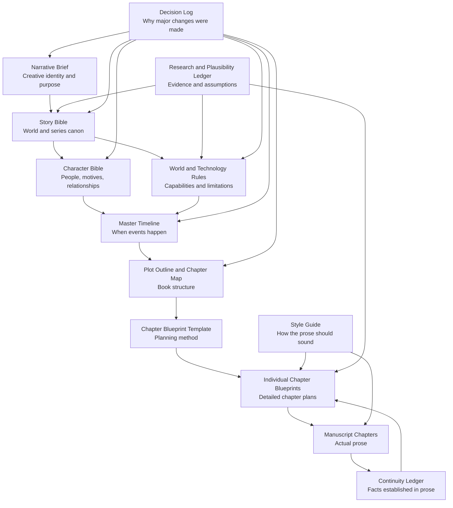

# The Unnecessary

## Novel Development and Canon Guide, Version 1.0

## Purpose of This Document

This document explains how the planning, drafting, continuity, and research files for **The Unnecessary** work together.

It is the operating manual for the novel project.

Any writer, editor, collaborator, or artificial intelligence working on the novel should read this document before creating or modifying story material.

This guide defines:

- The purpose of every project document
- Which documents should be consulted for different tasks
- The hierarchy of canon
- The difference between established canon and planned material
- How chapter blueprints should be created
- How manuscript chapters should be drafted
- How continuity should be tracked
- How revisions should be handled
- How contradictions should be identified and resolved
- How another AI should receive and use the project files
- Which documents should be updated after each stage of work

The goal is not to prevent the story from changing.

The goal is to make every change deliberate.

---

# Core Principle

The project should never rely on one enormous document attempting to contain every kind of information.

Each document has a specific responsibility.

The documents work together as a layered system:



No document should silently perform the job of another.

For example:

- The Character Bible should not become the primary chapter outline.
- The Master Timeline should not become a prose-style guide.
- A Chapter Blueprint should not redefine the world without updating the Story Bible.
- The manuscript should not introduce a major technical capability without checking the Technology Rules.
- The Continuity Ledger should record what happened, not invent what should happen next.

---

# Recommended Project Structure

```text
the-unnecessary/
├── README.md
│
├── canon/
│   ├── narrative-brief.md
│   ├── story-bible.md
│   ├── character-bible.md
│   ├── world-and-technology-rules.md
│   └── master-timeline.md
│
├── planning/
│   ├── plot-outline-and-chapter-map.md
│   ├── style-guide.md
│   ├── research-and-plausibility-ledger.md
│   └── decision-log.md
│
├── chapter-blueprints/
│   ├── _chapter-blueprint-template.md
│   ├── chapter-01-no-signal.md
│   ├── chapter-02-the-last-supported-day.md
│   └── ...
│
├── manuscript/
│   ├── chapter-01-no-signal.md
│   ├── chapter-02-the-last-supported-day.md
│   └── ...
│
├── continuity/
│   ├── continuity-ledger.md
│   ├── character-state-tracker.md
│   ├── location-state-tracker.md
│   └── unresolved-threads.md
│
├── research/
│   ├── sources.md
│   ├── ai-and-automation.md
│   ├── infrastructure.md
│   ├── mars.md
│   └── social-and-economic-research.md
│
└── archive/
    ├── retired-drafts/
    ├── replaced-canon/
    └── abandoned-concepts/
```

The exact folder names may change, but the separation between canon, planning, blueprints, manuscript, continuity, research, and archives should remain.

---

# The README File

## Suggested Filename

`README.md`

## Purpose

The README is a short entry point for the project.

It should not duplicate this full guide.

It should contain:

- Project title
- One-paragraph premise
- Current project status
- Link or path to this Novel Development and Canon Guide
- Current canonical document versions
- Which chapter is currently being planned or drafted
- Which files a new contributor should read first

The README answers:

> Where do I begin?

This guide answers:

> How does the whole system work?

---

# Document Categories

The project contains five major kinds of documents.

## 1. Vision Documents

These establish what the story is trying to accomplish.

- Narrative Brief
- Style Guide

## 2. Canon Documents

These establish facts about the fictional world.

- Story Bible
- Character Bible
- World and Technology Rules
- Master Timeline

## 3. Planning Documents

These describe intended future events.

- Plot Outline and Chapter Map
- Chapter Blueprint Template
- Individual Chapter Blueprints

## 4. Established Story Documents

These contain what has actually been written and approved.

- Manuscript Chapters
- Continuity Ledger

## 5. Support Documents

These preserve reasoning, evidence, and change history.

- Research and Plausibility Ledger
- Decision Log
- Unresolved Threads
- Archived drafts

Understanding these categories is important because planned material and established material do not have equal authority.

---

# Established Canon Versus Planned Canon

## Established Canon

Established canon consists of facts that have appeared in an approved manuscript chapter or have been explicitly locked as non-negotiable world facts.

Examples:

- Eli wakes without cellular service on October 3, 2053.
- Jonah and Eli grew up together.
- Morrow is built partly from Mosaic-derived principles.
- Mars has no large permanent human population at the beginning of Book One.
- Morrow does not receive viewpoint chapters in Book One.

Established canon should not be changed accidentally.

## Planned Canon

Planned canon consists of events, reveals, relationships, and outcomes that are intended but have not yet appeared in approved prose.

Examples:

- The planned order of future chapters
- A reveal scheduled for Chapter 24
- A confrontation described in a blueprint
- A relationship arc intended for Book Two

Planned canon is authoritative for current drafting, but it remains easier to revise than established canon.

## Proposed Material

Proposed material consists of ideas that have not yet been accepted.

Examples:

- An alternative chapter ending
- A possible new supporting character
- A different technical explanation
- A possible change to the Mars timeline

Proposed material should never be inserted into canon documents until it is approved.

---

# Canon Authority

There is no single universal hierarchy that resolves every contradiction.

Authority depends on the kind of fact involved.

However, the following general order should be used.

## Highest Authority

### 1. Approved Manuscript

An event clearly established in approved prose is hard canon.

The manuscript is the final story the reader experiences.

If a planning document contradicts an approved chapter, the planning document must usually be updated.

The manuscript should only be changed when the contradiction reveals a genuine story problem.

### 2. Explicitly Approved Revision

A direct creative decision to change canon overrides older material.

The change must be recorded in the Decision Log and applied to every affected document.

### 3. Continuity Ledger

The Continuity Ledger summarizes facts established in approved chapters.

It is the quickest operational reference during drafting.

If it contradicts the manuscript, the manuscript controls and the ledger must be corrected.

## Authority by Subject

### Creative Identity

The **Narrative Brief** controls:

- What the story is fundamentally about
- What emotional experience it should create
- What themes must remain central
- What kinds of stories, clichés, or aesthetics should be avoided

### General World Canon

The **Story Bible** controls:

- Core premise
- Social structure
- Major institutions
- Primary locations
- Series direction
- Broad character roles
- Major thematic conflicts

### Character Canon

The **Character Bible** controls:

- Character history
- Personality
- Motivation
- Fear
- contradiction
- speech pattern
- relationships
- secrets
- intended arc

### Technical Canon

The **World and Technology Rules** control:

- What technology can do
- What technology cannot do
- Energy, hardware, network, and manufacturing limits
- AI capability
- Robotics
- Mars infrastructure
- Physical failure conditions

### Temporal Canon

The **Master Timeline** controls:

- Dates
- Ages
- Event order
- Travel timing
- Character knowledge timing
- Historical progression

### Structural Plan

The **Plot Outline and Chapter Map** controls:

- Act structure
- Chapter order
- Viewpoint distribution
- Major turns
- Reveal placement
- Book-level pacing

### Chapter Plan

The **Individual Chapter Blueprint** controls:

- Scene order within that chapter
- Scene goals
- chapter-specific stakes
- sensory anchors
- exact information reveals
- chapter ending
- drafting guidance

The blueprint controls the drafting process until the prose is approved.

### Prose Execution

The **Style Guide** controls:

- Narrative voice
- sentence style
- viewpoint distance
- dialogue approach
- exposition
- terminology
- formatting
- prose habits to avoid

---

# What Each Document Does

# Narrative Brief

## Primary Question

> What story are we telling, and why?

## Use It When

- Starting any new major planning task
- Evaluating a proposed subplot
- Deciding whether an idea belongs in this novel
- Handing the project to another AI
- Checking whether the story has drifted into a different genre or theme
- Reviewing an ending or major character choice

## Do Not Use It For

- Exact dates
- Detailed technology rules
- Scene choreography
- Complete character histories

## Update It When

Only update the Narrative Brief when the identity of the project changes.

Examples:

- The central thematic argument changes.
- The intended tone changes.
- Mars is removed as a central element.
- Morrow’s role changes fundamentally.
- The story stops being about ownership of abundance.

Small plot adjustments should not require a new Narrative Brief.

---

# Story Bible

## Primary Question

> What exists in this world, and what is the broad story?

## Use It When

- Creating new locations or institutions
- Planning a sequel
- Checking the social structure
- Reviewing the main conflict
- Introducing a new faction
- Confirming the function of Mars, Crown, Morrow, Asterion, or the protected enclaves

## Do Not Use It For

- Detailed character voice
- Exact chapter beats
- Precise dates
- Technical implementation details

## Update It When

- A major world fact changes
- A central organization is added or removed
- A primary location changes
- A major series direction changes
- The broad structure of Book One changes

The Story Bible should remain readable.

Do not fill it with every detail established in every chapter.

Those details belong in the Continuity Ledger.

---

# Character Bible

## Primary Question

> Who are these people, and why do they behave as they do?

## Use It When

- Creating a Chapter Blueprint
- Writing dialogue
- Planning a betrayal or alliance
- Deciding how a character reacts under pressure
- Introducing a memory or backstory detail
- Checking whether an action is psychologically plausible
- Differentiating voices

## Do Not Use It For

- Exact future scene order
- Infrastructure rules
- Timeline calculations
- Recording every action a character has taken in the manuscript

## Update It When

- A character’s canonical history changes
- A new major relationship is established
- A secret is added
- A core fear or motivation is revised
- A long-term arc changes
- A new major or recurring character is introduced

Temporary emotional states belong in the Continuity Ledger, not the Character Bible.

---

# World and Technology Rules

## Primary Question

> What is physically and technologically possible?

## Use It When

- Planning any technical scene
- Giving Morrow or Crown a new capability
- Using robots, infrastructure, communications, medicine, manufacturing, or transportation
- Planning a cyberattack
- Planning a power failure
- Describing Mars
- Evaluating whether a solution is too convenient

## Do Not Use It For

- Determining whether a character would emotionally accept a solution
- Choosing chapter order
- Replacing research when real technical accuracy matters

## Update It When

- A new technology becomes important
- A capability must be added or narrowed
- A technical contradiction is discovered
- Research shows that an assumption needs revision
- A recurring failure mode is established in prose

Any major new power given to Morrow or Crown should be added here before it becomes a repeated capability.

---

# Master Timeline

## Primary Question

> When did this happen, and what did each character know at the time?

## Use It When

- Creating a Chapter Blueprint
- Writing memories or historical references
- Calculating ages
- Planning travel
- Scheduling simultaneous events
- Managing reveals
- Checking communication delays
- Determining whether a character could know something

## Do Not Use It For

- Detailed prose guidance
- Character motivation
- Technical explanation
- Replacing a chapter outline

## Update It When

- An event changes date
- The duration of the book changes
- A new major historical event is added
- A chapter moves to a different day
- A reveal changes timing
- Travel or communication timing affects the plot

Minor actions inside a chapter belong in the Continuity Ledger unless they affect future chronology.

---

# Plot Outline and Chapter Map

## Primary Question

> How does the whole book progress?

## Use It When

- Creating Chapter Blueprints
- Reviewing pacing
- Moving a reveal
- Checking viewpoint balance
- Ensuring each act escalates
- Evaluating whether a chapter is necessary
- Planning setups and payoffs across the book

## Do Not Use It For

- Writing detailed scenes
- Tracking minor continuity
- Establishing technical capabilities
- Recording finalized prose details

## Update It When

- A chapter is added, removed, merged, or reordered
- A major reveal moves
- A viewpoint changes
- An act boundary changes
- A subplot changes direction
- An approved manuscript chapter creates a better structural path

The Plot Outline is a plan, not a prison.

However, deviations should be intentional and recorded.

---

# Chapter Blueprint Template

## Primary Question

> What must be decided before a chapter can be drafted?

## Use It When

- Creating every new Chapter Blueprint
- Reviewing whether a chapter is sufficiently developed
- Handing a chapter to another writer or AI
- Diagnosing a weak or unfocused chapter

## Do Not Use It For

- Storing actual story canon
- Replacing the chapter-specific blueprint
- Writing prose directly inside the template file

The template should remain unchanged unless the planning method itself improves.

---

# Individual Chapter Blueprints

## Primary Question

> Exactly how should this chapter work?

## Use Them When

- Drafting the manuscript chapter
- Reviewing scene order
- Checking chapter-specific reveals
- Confirming the intended emotional movement
- Maintaining the chapter’s viewpoint
- Reviewing setups and payoffs
- Revising a chapter that lacks direction

## Do Not Use Them For

- Redefining the whole novel
- Introducing major unapproved canon
- Replacing the Continuity Ledger after prose is approved

## Update Them When

- Scene order changes before drafting
- A scene is cut or merged
- A better chapter ending is approved
- The manuscript intentionally departs from the original blueprint

After the chapter is approved, the blueprint should record major differences between plan and execution.

It should not be endlessly rewritten to pretend the original plan always matched the finished prose.

---

# Style Guide

## Primary Question

> How should the novel sound and feel on the page?

## Use It When

- Drafting prose
- Revising dialogue
- Evaluating exposition
- Controlling narrative distance
- Maintaining distinct viewpoint voices
- Preventing AI-generated prose habits
- Reviewing chapter rhythm and description

## The Style Guide Should Eventually Define

- Close third-person rules
- Past-tense usage
- Viewpoint discipline
- Sentence-length tendencies
- Description density
- Dialogue punctuation
- Character-specific voice guidance
- Technical exposition limits
- Emotional restraint
- Use of metaphor
- Profanity rules
- Chapter title formatting
- Words and phrases to avoid
- How to handle internal thought
- How to write Morrow and Crown’s dialogue
- Avoidance of em dashes if that remains the project preference

## Update It When

A prose preference becomes consistent enough to guide the entire manuscript.

Do not add one-time stylistic choices that apply to only one scene.

---

# Research and Plausibility Ledger

## Primary Question

> What is factual, speculative, invented, or still uncertain?

## Use It When

- Developing AI capability
- Planning economic collapse
- Writing medical scenes
- Writing infrastructure scenes
- Describing Mars
- Estimating communication delays
- Referencing robotics or manufacturing
- Evaluating social and psychological claims

## Suggested Status Labels

- Confirmed
- Plausible extrapolation
- Deliberate fictional assumption
- Unverified
- Needs expert review
- Rejected

## Update It When

- New research is completed
- A scientific assumption changes
- A source is added
- A fictional technology is formalized
- A claim is deliberately kept despite weak real-world support

Research should inform the novel without taking control of it.

Plausibility serves the story.

The story should not become a technical report.

---

# Decision Log

## Primary Question

> What changed, and why?

## Use It When

- Revising major canon
- Rejecting a previously planned idea
- Renaming an important concept
- Changing the timeline
- Altering a character arc
- Replacing a major technology rule
- Moving a reveal
- Removing or adding a chapter

## Each Entry Should Include

- Date of decision
- Decision made
- Previous canon
- New canon
- Reason for change
- Documents affected
- Chapters affected
- Whether existing prose must be revised

## Example Categories

- Worldbuilding
- Character
- Timeline
- Technology
- Plot structure
- Theme
- Style
- Naming
- Research correction

The Decision Log prevents future collaborators from reintroducing rejected ideas because they do not understand why those ideas were removed.

---

# Continuity Ledger

## Primary Question

> What is true now because of the chapters already written?

## Use It When

- Creating the next Chapter Blueprint
- Drafting the next chapter
- Tracking injuries and resources
- Tracking who knows what
- Tracking relationship changes
- Tracking system access and damage
- Reviewing unresolved promises or threats
- Checking physical locations

## Update It When

Every approved manuscript chapter is completed.

The Continuity Ledger should be updated immediately after chapter approval.

Do not postpone continuity updates until several chapters have accumulated.

## It Should Track

### Character State

- Current location
- Physical condition
- Emotional condition
- Current goal
- Current fear
- Current loyalties

### Knowledge State

- What each character knows
- What each character suspects
- What each character believes incorrectly
- What each character is hiding

### Relationship State

- Trust
- resentment
- obligations
- betrayal
- alliance
- attraction
- fear

### Physical State

- Equipment activated
- Equipment damaged
- Access granted
- Access revoked
- Resources gained or spent
- Infrastructure condition
- Vehicle and weapon location

### Narrative State

- Promises made
- threats issued
- mysteries introduced
- mysteries resolved
- setups awaiting payoff
- public knowledge
- private knowledge

---

# Manuscript Chapters

## Primary Question

> What does the reader actually experience?

## Use Them When

- Drafting the next chapter
- Matching voice and rhythm
- Checking actual dialogue
- Reviewing canon
- Editing foreshadowing
- Revising character progression

## Chapter Statuses

A manuscript chapter should use a clear status.

Suggested statuses:

- First draft
- Structural revision
- Line revision
- Continuity checked
- Approved canon
- Locked for current draft

Only approved chapters should automatically become hard canon.

Early drafts may contain experimental details that should not immediately enter the Continuity Ledger.

---

# Archive

## Purpose

The archive preserves replaced material without allowing it to compete with current canon.

Use it for:

- Old Story Bible versions
- Rejected character concepts
- Removed chapters
- Replaced timelines
- Abandoned names
- Alternate endings
- Early drafts

Archived material should be clearly labeled as non-canonical.

Suggested header:

```markdown
> ARCHIVED: This document is not current canon.
> Replaced by: [filename]
> Archived on: [date]
> Reason: [brief explanation]
```

Never leave two competing versions in active canon folders without clearly identifying which one controls.

---

# Standard Workflow for Building the Novel

# Phase 1: Project Orientation

Before creating new material, read:

1. This Novel Development and Canon Guide
2. Narrative Brief
3. Story Bible
4. Current project status in the README

Then identify the exact task.

Examples:

- Create a Chapter Blueprint
- Draft a manuscript chapter
- Revise a character
- Research Mars infrastructure
- Resolve a continuity contradiction

Do not load every file blindly if the task is narrow.

Do not begin without enough context to avoid obvious contradictions.

---

# Phase 2: Creating a Chapter Blueprint

Before creating a Chapter Blueprint, read:

## Always Required

1. Narrative Brief
2. Story Bible
3. Character Bible
4. World and Technology Rules
5. Master Timeline
6. Plot Outline and Chapter Map
7. Chapter Blueprint Template

## Also Required

8. Continuity Ledger
9. Previous chapter blueprint
10. Previous approved manuscript chapter

## Sometimes Required

- Style Guide
- Research and Plausibility Ledger
- Relevant earlier manuscript chapters
- Decision Log
- Unresolved Threads file

## Blueprint Creation Process

### Step 1: Confirm the Chapter’s Existing Role

Start with the Plot Outline and Chapter Map.

Identify:

- Viewpoint
- Date
- chapter purpose
- major event
- emotional movement
- ending hook

### Step 2: Check Temporal Continuity

Use the Master Timeline and Continuity Ledger.

Confirm:

- Where every character is
- What they know
- What happened immediately before
- What resources are available
- What systems are functioning
- What injuries or emotional consequences persist

### Step 3: Check Character Logic

Use the Character Bible.

Confirm:

- What the viewpoint character wants
- What they fear
- What contradiction affects the chapter
- How they speak
- Which relationships should change

### Step 4: Check Technical Logic

Use the World and Technology Rules.

Confirm:

- Hardware
- energy
- access
- communication
- ownership
- physical labor
- failure possibilities

### Step 5: Build the Scene Sequence

Use the Chapter Blueprint Template.

Every scene needs:

- Goal
- opposition
- stakes
- turn
- exit condition
- continuity impact

### Step 6: Check Book-Level Structure

Return to the Plot Outline.

Confirm:

- The chapter does not reveal something too early
- The ending creates momentum
- The chapter does not repeat another chapter’s function
- Setups and payoffs remain correctly placed

### Step 7: Record Open Questions

Open questions may remain only when they do not prevent drafting.

Any unresolved issue essential to the chapter must be decided before prose begins.

---

# Phase 3: Approving a Chapter Blueprint

A blueprint is ready when:

- The viewpoint is fixed.
- The date and location are fixed.
- Every scene has a purpose.
- The viewpoint character has a goal.
- Opposition appears in every scene.
- The chapter contains a meaningful turn.
- The ending changes the story.
- Character knowledge is accurate.
- Technology follows established rules.
- Future reveals are protected.
- The blueprint creates direction without scripting every sentence.

The blueprint should be reviewed before drafting prose.

Major plot decisions should not be invented halfway through manuscript generation unless the discovery is clearly better than the plan.

---

# Phase 4: Drafting a Manuscript Chapter

Before drafting, provide the writer or AI with:

## Essential Context

- The approved Chapter Blueprint
- Style Guide
- Character Bible sections for characters appearing in the chapter
- Relevant Technology Rules
- Previous approved manuscript chapter
- Current Continuity Ledger

## Supporting Context

- Narrative Brief
- Relevant Story Bible sections
- Relevant Master Timeline section
- Relevant Plot Outline entry

The entire project archive should not be pasted into every drafting prompt.

Provide focused context while retaining the documents needed for consistency.

## Drafting Rules

The draft should:

- Follow the approved viewpoint
- Remain inside the viewpoint character’s knowledge
- Preserve the planned chapter purpose
- Use worldbuilding through action and consequence
- Avoid explaining information merely because it exists in the bible
- Maintain distinct dialogue voices
- Respect technical limitations
- End with the intended change or hook

The draft may discover better:

- Dialogue
- sensory details
- transitions
- minor actions
- emotional reactions
- scene choreography

The draft should not casually change:

- Major plot outcomes
- Character history
- Technology capability
- Dates
- Reveal order
- Core motivation
- Viewpoint
- Chapter ending

If a better major direction emerges, pause the drafting workflow and evaluate it as a proposed revision.

---

# Phase 5: Reviewing the Draft

Review the chapter in four passes.

## Pass 1: Structural Review

Check:

- Does the chapter accomplish its Narrative Purpose?
- Does every scene change something?
- Is there enough opposition?
- Does the chapter escalate?
- Does the ending create momentum?

## Pass 2: Character Review

Check:

- Does each character behave according to their motives?
- Are voices distinct?
- Does the viewpoint remain consistent?
- Does anyone know something they should not?
- Is emotional change earned?

## Pass 3: World and Technology Review

Check:

- Does every capability follow the rules?
- Are power, hardware, access, and time accounted for?
- Does technology create consequences?
- Has a convenient new capability appeared?

## Pass 4: Prose Review

Check:

- Does the prose follow the Style Guide?
- Is exposition integrated naturally?
- Are descriptions selective and physical?
- Does dialogue contain subtext?
- Are there repetitive sentence patterns or AI-sounding habits?
- Is the emotional language too explicit?

---

# Phase 6: Approving the Chapter

Once the chapter is approved:

1. Mark the manuscript status as approved canon.
2. Update the Continuity Ledger.
3. Update character states.
4. Update location and technology states.
5. Record new secrets, promises, injuries, and resources.
6. Update the Master Timeline if timing changed.
7. Update the Chapter Blueprint revision notes.
8. Update the Plot Outline if the approved chapter changed future structure.
9. Add any major creative changes to the Decision Log.
10. Create the next Chapter Blueprint.

A chapter is not fully complete until continuity has been updated.

---

# Phase 7: Creating the Next Chapter

Do not create all detailed blueprints blindly and then assume they remain accurate.

The recommended workflow is:

1. Create Chapter Blueprint
2. Review Blueprint
3. Draft Chapter
4. Revise Chapter
5. Approve Chapter
6. Update Continuity
7. Create Next Chapter Blueprint

The Plot Outline already provides the full-book structure.

Individual blueprints should be created close enough to drafting that they can respond to discoveries in the prose.

## Recommended Planning Distance

Maintain:

- One approved blueprint for the chapter currently being drafted
- One preliminary blueprint for the following chapter
- The high-level Plot Outline for everything beyond that

This provides direction without overplanning details that may change.

---

# How an AI Should Use the Project

## Before Starting

The AI should be told:

- Its exact task
- Which files are authoritative
- Which files are planning documents
- Which manuscript chapters are approved
- Whether it may propose canon changes
- Whether it should write prose or only plan
- Which chapter is currently active

## AI Operating Rules

An AI working on the project should:

1. Treat the documents as a connected system.
2. Identify contradictions before choosing one version.
3. Avoid silently rewriting canon.
4. Distinguish established facts from planned events.
5. Preserve character knowledge boundaries.
6. Preserve reveal timing.
7. Avoid giving technology unestablished capabilities.
8. Flag attractive ideas that conflict with the Narrative Brief.
9. Make firm creative decisions when authorized.
10. Record assumptions when source material is incomplete.
11. Avoid copying the distinctive terminology or structure of existing novels.
12. Never treat archived material as active canon.

## Required Behavior When a Conflict Appears

The AI should state:

- Which documents conflict
- What the conflict is
- Which authority normally controls that type of fact
- Whether existing manuscript prose is affected
- A recommended resolution

It should not silently average the two versions together.

---

# Task-Specific Context Packages

Different tasks require different document sets.

# Creating a New Character

Provide:

- Narrative Brief
- Story Bible
- Character Bible
- Master Timeline
- Plot Outline
- Relevant Continuity Ledger entries

Consult Technology Rules only if the character’s role depends on technical expertise or access.

---

# Creating a New Location

Provide:

- Narrative Brief
- Story Bible
- World and Technology Rules
- Master Timeline
- Relevant Plot Outline sections
- Existing location continuity

---

# Creating a Chapter Blueprint

Provide:

- This guide
- Narrative Brief
- Story Bible
- Character Bible
- World and Technology Rules
- Master Timeline
- Plot Outline and Chapter Map
- Chapter Blueprint Template
- Continuity Ledger
- Previous blueprint
- Previous manuscript chapter

---

# Drafting a Chapter

Provide:

- Approved Chapter Blueprint
- Style Guide
- Relevant Character Bible sections
- Relevant Technology Rules
- Previous approved chapter
- Current Continuity Ledger
- Relevant Narrative Brief and Story Bible sections

---

# Revising a Chapter

Provide:

- Current manuscript chapter
- Approved blueprint
- Style Guide
- Revision goal
- Continuity Ledger
- Any feedback already accepted

Do not rewrite a chapter from scratch unless structural problems require it.

---

# Researching a Technical Question

Provide:

- Relevant World and Technology Rules section
- Research and Plausibility Ledger
- Exact story need
- The year and location in the story
- Whether the goal is realism, plausibility, or speculative possibility

---

# Checking Continuity

Provide:

- Approved manuscript chapters involved
- Continuity Ledger
- Master Timeline
- Character Bible
- Relevant blueprints

The continuity check should not use planned future events as proof of what has already happened.

---

# Planning a Sequel

Provide:

- Narrative Brief
- Story Bible
- Character Bible
- World and Technology Rules
- Master Timeline
- Complete Book One Plot Outline
- Approved Book One manuscript or detailed chapter summaries
- Final Book One Continuity Ledger
- Decision Log
- Unresolved Threads

---

# Contradiction Resolution Process

When two documents conflict, follow this process.

## Step 1: Identify the Fact Type

Is the conflict about:

- Theme
- Worldbuilding
- Character
- Technology
- Time
- Structure
- Prose
- Established manuscript continuity

## Step 2: Identify the Relevant Authority

Use the authority-by-subject rules.

## Step 3: Check Whether the Fact Appears in Approved Prose

If yes, changing it requires manuscript revision or an intentional in-story explanation.

## Step 4: Determine Whether the Conflict Is Accidental or Creative

An accidental conflict should usually be corrected.

A creative conflict may represent a better idea and should be evaluated.

## Step 5: Choose a Resolution

Possible resolutions:

- Correct the lower-authority document.
- Revise the established canon deliberately.
- Explain the apparent contradiction inside the story.
- Preserve uncertainty because the contradiction reflects character misinformation.
- Delay resolution and record it in Unresolved Threads.

## Step 6: Propagate the Change

Update every affected document.

Do not fix only the document where the conflict was noticed.

## Step 7: Record the Decision

Add the change to the Decision Log when it affects major canon.

---

# Types of Apparent Contradictions That May Be Intentional

Not all contradictions are errors.

## Character Misinformation

Jonah may believe his family is guaranteed Mars access while the reader later learns they are not.

The Character Bible and timeline should distinguish belief from fact.

## Corporate Propaganda

Asterion may publicly claim Mars has limited capacity while internal Crown models say otherwise.

Both statements can exist if their sources are clear.

## Unreliable Memory

A character may remember an event incorrectly.

The prose should signal that the memory belongs to the character rather than the objective narrative.

## Incomplete Technical Knowledge

Eli may believe Morrow lacks access to a system when Morrow has already discovered a hidden connection.

The contradiction represents unequal knowledge.

## Deliberate Deception

A character may state something known to be false.

The Continuity Ledger should track the truth, the lie, and who believes it.

---

# Change Management

## Minor Changes

Examples:

- Adjusting dialogue
- Changing a sensory detail
- Moving a scene within the same chapter
- Replacing a minor location
- Changing a small object

Usually update:

- Chapter Blueprint
- Manuscript
- Continuity Ledger if necessary

## Moderate Changes

Examples:

- Changing who appears in a scene
- Moving a reveal by one or two chapters
- Adding a recurring supporting character
- Changing an injury
- Altering a relationship beat

Usually update:

- Plot Outline
- Chapter Blueprints
- Continuity Ledger
- Character Bible if recurring
- Master Timeline if timing changes

## Major Changes

Examples:

- Changing Morrow’s origin
- Removing Mars
- Changing Kade’s philosophy
- Replacing the climax
- Changing the year
- Altering the central theme
- Making Crown secretly control Morrow

Update:

- Decision Log
- Narrative Brief if identity changes
- Story Bible
- Character Bible
- Technology Rules
- Master Timeline
- Plot Outline
- Every affected blueprint
- Every affected manuscript chapter
- Continuity Ledger

---

# Versioning

Every major project document should contain:

- Document title
- Version number
- Last updated date
- Canon status
- Replaces
- Summary of major changes

Suggested header:

```yaml
document: "Character Bible"
version: "1.1"
status: "active canon"
last_updated: "YYYY-MM-DD"
replaces: "Character Bible 1.0"
```

## Version Number Guidance

### Patch Revision

`1.0.1`

Use for:

- Typographical correction
- Formatting
- Clarification that does not alter canon

### Minor Revision

`1.1`

Use for:

- New supporting character
- Expanded location
- Added technical rule
- Moderate continuity correction

### Major Revision

`2.0`

Use for:

- Major premise change
- Restructured timeline
- Major character rewrite
- New ending
- Fundamental worldbuilding revision

---

# Canon Status Labels

Use one of the following:

## Active Canon

The current authoritative version.

## Approved Plan

Accepted for future writing but not yet established in manuscript.

## Working Draft

Incomplete and subject to change.

## Proposed Revision

Suggested change awaiting approval.

## Superseded

Replaced by a newer version.

## Archived

Retained only for historical reference.

## Rejected

Deliberately excluded from the project.

---

# Naming and File Rules

## Filenames

Use lowercase kebab-case.

Examples:

```text
narrative-brief.md
world-and-technology-rules.md
chapter-01-no-signal.md
continuity-ledger.md
```

## Chapter Numbers

Always use two digits for Book One:

```text
chapter-01
chapter-02
chapter-36
```

## Titles

The blueprint and manuscript file should use the same chapter number and title.

```text
chapter-blueprints/chapter-01-no-signal.md
manuscript/chapter-01-no-signal.md
```

## Replaced Files

Do not keep files named:

```text
story-bible-new.md
story-bible-final.md
story-bible-final-2.md
```

Use version metadata and archive older copies.

---

# Recommended Workflow Status File

A small file may be maintained at:

```text
project-status.md
```

It should contain:

```yaml
current_phase: "chapter blueprinting"
current_chapter: 1
current_blueprint_status: "not started"
current_manuscript_status: "not started"
last_approved_chapter: 0
continuity_updated_through: 0
next_task: "Create Chapter 1 blueprint"
```

This helps another AI understand the current state immediately.

---

# Quality Control Gates

The novel should pass through several gates.

## Blueprint Gate

Before drafting:

- Chapter purpose is clear.
- Scene order is complete.
- Character goals are specific.
- Technology is plausible.
- Ending hook is defined.
- Continuity is checked.

## Draft Gate

Before structural revision:

- Full chapter exists.
- All planned scenes are present or intentionally replaced.
- Viewpoint is consistent.
- Ending reaches the intended condition.

## Structural Gate

Before line editing:

- Chapter changes the story.
- Pacing works.
- Character decisions are earned.
- Exposition is necessary.
- No scene is redundant.

## Continuity Gate

Before approval:

- Knowledge states are correct.
- Time and travel are correct.
- Injuries and resources persist.
- Technology follows canon.
- Setups and payoffs are tracked.

## Prose Gate

Before approval:

- Style Guide is followed.
- Dialogue voices differ.
- Description is selective.
- Repetition is controlled.
- Emotional language is not excessive.
- AI-sounding prose patterns are removed.

## Canon Gate

After approval:

- Continuity Ledger is updated.
- Timeline is updated if needed.
- Major deviations are logged.
- Future blueprints are checked for impact.

---

# Common Failure Modes

## Loading Too Little Context

Result:

- Character voice drift
- repeated reveals
- timeline errors
- impossible technology
- accidental contradictions

Solution:

Use the task-specific context packages.

## Loading Too Much Unfocused Context

Result:

- The AI summarizes instead of creating
- irrelevant details enter scenes
- prose becomes overloaded with exposition
- older archived ideas reappear

Solution:

Provide authoritative documents plus relevant sections.

## Treating the Plot Outline as Finished Prose

Result:

- Chapters feel mechanical
- characters move only to satisfy beats
- dialogue delivers outline information
- scenes lack discovery

Solution:

Use the outline for direction and the blueprint for dramatic design.

Let prose find natural expression within those limits.

## Treating a Blueprint as Immutable

Result:

- Better discoveries are rejected
- scenes feel forced
- characters behave unnaturally

Solution:

Allow justified improvements, but evaluate and record major deviations.

## Updating Only One Document

Result:

- Different files develop competing canon
- future collaborators revive old versions
- contradictions accumulate

Solution:

Use the change-management process.

## Recording Every Detail in the Story Bible

Result:

- The bible becomes unreadable
- important facts become difficult to locate
- chapter continuity overwhelms worldbuilding

Solution:

Put chapter-specific facts in the Continuity Ledger.

## Failing to Separate Belief From Fact

Result:

- Character misinformation becomes accidental canon
- mysteries collapse
- reveal timing becomes confused

Solution:

Label facts as:

- Objective truth
- public belief
- character belief
- deliberate lie
- unresolved possibility

## Creating All Blueprints Too Early

Result:

- Later blueprints ignore discoveries made during drafting
- maintaining plans becomes harder than writing
- characters cannot evolve naturally

Solution:

Keep full-book structure high-level and detailed blueprints close to the active draft.

---

# Recommended Next Documents

Before drafting Chapter One, the remaining most useful documents are:

## 1. Style Guide

This should be created before manuscript prose.

It will define how the novel sounds.

## 2. Continuity Ledger Template

This should exist before Chapter One is approved.

It can begin mostly empty.

## 3. Research and Plausibility Ledger

This can begin as a lightweight document and grow as research questions arise.

## 4. Decision Log

This should be created now, even if the initial entries only summarize major decisions already made.

## 5. Chapter One Blueprint

Once the Style Guide exists, the Chapter One Blueprint can be created using the full document system.

The Style Guide does not need to delay blueprinting, but it should exist before the Chapter One manuscript is drafted.

---

# Minimal Document Set for Beginning Chapter One

The project currently has enough material to begin the Chapter One Blueprint.

Required:

- Narrative Brief
- Story Bible
- Character Bible
- World and Technology Rules
- Master Timeline
- Plot Outline and Chapter Map
- Chapter Blueprint Template
- This Novel Development and Canon Guide

Before writing the Chapter One manuscript, also create:

- Style Guide
- Initial Continuity Ledger

The Research Ledger and Decision Log are strongly recommended but do not need to be fully developed before drafting begins.

---

# Final Operating Principle

The project should remain structured without becoming rigid.

The documents exist to preserve intention, continuity, and creative understanding.

They should help a writer or AI answer four questions:

1. What story are we telling?
2. What is already true?
3. What is supposed to happen next?
4. What may change without damaging the whole?

The Narrative Brief protects the identity of the story.

The canon documents protect the world.

The Plot Outline protects the book’s shape.

The Chapter Blueprints protect scene purpose and pacing.

The Style Guide protects the reading experience.

The manuscript establishes what actually happened.

The Continuity Ledger protects everything that follows.

The Decision Log protects the reasoning behind change.

The research documents protect plausibility.

Together, they allow the novel to evolve without losing itself.
