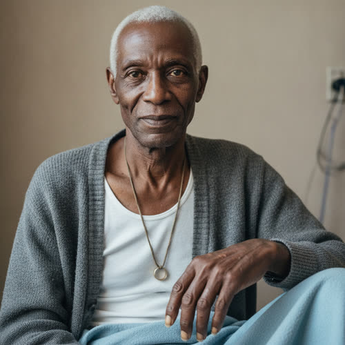

# Mr. Adeyemi

> Status: DRAFT. Generated under `../profile-spec.md` as part of the Riverside
> clinic cluster (Ch2). The only canon facts are those traced to
> `chapter-02-the-last-supported-day.md` and marked `[open]`: the surname
> Adeyemi, the age sixty-one, the nocturnal respiratory controller, the
> withdrawn authentication, the sealed-off daughter, and his dialogue. The given
> name Bayo, the birth date and birthplace, the industrial-lung history, the
> widowhood, the daughter's name, and every physical identifier are accepted as
> character canon under Decision 056. Reveal-tagged hidden facts and behavior-only
> items remain author-facing and are not stated on the page.

## Basic Information

**Full name:** Bayo Adeyemi
**Common name:** Mr. Adeyemi [open] (Lena and the staff call him only by surname on the page)
**Age at the start of Book One:** 61 [open]
**Birth date:** March 17, 1992 (not listed in `../../timeline/character-birth-dates.md`; invented under Section 6 and tagged for the spine. Chosen in 1992 on purpose, see Continuity Anchors, to make him an exact-age contemporary of Adrian Kade)
**Birthplace:** Lagos, Nigeria
**Current residence:** A rented ground-floor flat in Greater Detroit, in the clinic's neighborhood. Presently an overnight inpatient in Lena Okafor's independent community clinic [open].
**Household:** Lives alone. Widower; his wife died years ago of an untreated condition during the healthcare withdrawal. His only child, a daughter, is sealed inside a protected zone and cannot get out to visit him and would not be readmitted if she left [open].
**Occupation:** Retired. Former foundry and auto-plant worker; decades of industrial dust and fume scarred his lungs, which is why he now depends on the nocturnal respiratory controller (the respiratory failure is [open] per Chapter 2; the industrial-lung cause is accepted as character canon under Decision 056).
**Faction or class:** Everyone Else, per `../../world/social-structure.md` [open]. He is plainly outside the protected systems: cared for in an unbilled clinic, on a machine the maker has abandoned, his daughter on the far side of a wall he cannot cross.
**Primary viewpoint:** No. He is never a point-of-view character.
**Story role:** Clinic walk-on and the human stake under the chapter's midnight deadline. He is the one patient Lena cannot keep through the night without a machine she can no longer trust, the body that turns an authentication notice into a question about a life.

## Physical and Identifiers



### Frame

Five feet eleven inches, and built broad once, the deep-chested heavy-shouldered frame of a man who fed furnaces and lifted castings for thirty years. The illness has taken that down. In Chapter 2 he is "narrow under the blanket," the breadth gone to slack and the chest worked from outside by the machine [open]. He sits up by day and the old size shows in the wrists and the wide flat hands; lying down he reads smaller than he is.

### Coloring

Deep dark-brown complexion, ashened at the lips and the beds of the nails from the chronic shortage of breath. Close-cropped hair gone fully white, kept short because short is easy. A week of white stubble he lets Tomas shave when he has the wind for it. Brown eyes, still quick and amused under heavy lids, the one part of him the illness has not slowed [open, that he is alert and teasing at night].

### Face

A long face, the cheeks fallen in over good bones, the skin loose now where it was once full. Deep lines from the nose to the mouth. At rest his expression is patient and a little ironic, a man listening for footsteps in a hall and keeping score of them. [open] (He tells Lena, "I know your feet.")

### Hands and handedness

Right-handed. Big square foundry hands gone thin over the knuckles, the palms still ridged with the ghosts of calluses that took a working life to build and an idle decade to soften. Old healed burn marks freckle the backs of both hands and the right forearm. In Chapter 2 one of those hands comes out from under the blanket and finds the edge of Lena's sleeve and holds it "the way a man holds a railing on a stair he is not sure of." [open] His hands say labor, heat, and a long time since the labor.

### Distinguishing marks

A scatter of small shiny burn scars across the backs of both hands and the right forearm, from molten splash and hot metal over years on the foundry floor. A long pale surgical scar at the base of the throat from a tracheostomy that was later reversed. Yellowed, clubbed fingernails, a sign read straight off chronic low oxygen. A wedding band worn thin, kept on a cord around his neck since his finger swelled past it. No tattoos.

### Identity and body status (2053)

Legally registered, practically stranded, per `../../technology/infrastructure/identity-and-money.md`. His citizenship is intact on paper; his access is gone, which is the whole reason he is in an unbilled neighborhood clinic and not a supported hospital. Chronic respiratory failure, managed at night by a continuous-positive respiratory controller that breathes on a count his own lungs cannot make [open]. The controller's maker has withdrawn the remote authentication the device phones home for, and the discontinuation takes effect at 23:59 on October 3 [open]; no one, including the engineer in the back room, can say what the machine does after that minute [open]. No augmentations, no implants. He is kept alive by an external machine and by hand, the way the whole clinic is kept now.

### Movement and voice

By day he moves slowly and sits up under his own power, comes off the machine "for hours at a stretch," and complains about the food, which is its own kind of vital sign [open]. By night he lies still and lets the machine do the work [open]. His voice "comes thin around the controller's work, the cycle pushing under his words," so that the machine seems to punctuate him [open]. A low Lagos-inflected Nigerian English under five decades of flat Detroit vowel, the Yoruba music nearly worn off but surfacing on certain words.

### Grooming and default dress

Clean and particular about the little he can control. A laundered undershirt and the clinic's softest blanket, his own cardigan over the gown when he sits up. The thin wedding band on its cord. He keeps a comb and a folded handkerchief on the bedside whether or not he uses them, because a man keeps a comb. Scent of the machine's plastic tubing, antiseptic, and the faint camphor of a chest rub a neighbor makes.

## Personality

In public Mr. Adeyemi is wry, watchful, and incurably sociable, the ward's talker, a man who pays attention to people because attention is the currency he has left. [open] (Lena "saves the talkers for last," and he knows it, and trades on it.) He notices everything, footsteps and faces and the lie a young nurse cannot keep off his own face, and he names what he notices, gently, to let the other person know they have been seen. In private he is frightened the way a clear-eyed man is frightened, without drama and without illusion. He has decided he would rather hear the truth and be unsettled than hear comfort and be managed, and he tests the people caring for him to find out which kind they are.

His humor is dry, fond, and aimed at his own situation and at the people he likes. "You're not restful, you know that? You're a terrible comfort," he tells Lena, and means it as the highest praise he has. [open] He jokes precisely because the alternative is to weigh the night, and he has weighed it already.

**Articulated goal:** Get through the night, sit up in the morning, and complain about the breakfast.
**Deeper need:** To be told the truth by someone who will not leave, and to matter to one more person before the machine or the minute decides otherwise.
**Governing fear:** Not death. That his daughter learns he died on a switched-off machine in a cold room and was alone for it, on the far side of a wall she could not cross.
**Core contradiction:** He demands the unsweetened truth from everyone and gives the people he loves a softened version of his own decline, because being a burden frightens him more than dying does.
**Moral boundary:** He will not let his care cost a child theirs. He would refuse the machine before he would let it be the reason a feverish girl down the hall went without.
**What could make them cross it:** Almost nothing in himself. But if keeping silent about his own worsening bought his daughter one more believing week, he would lie to her without hesitation and call it mercy.
**Private reading of the collapse:** The companies did not turn cruel. They turned away. The same hand that stopped answering the towers and the buses reached down one night and stopped answering the thing that breathes for him, politely, on a schedule, and the worst of it is there is no one in the room to be angry at. The machine still means well. It simply needs permission no one will grant it anymore.
**Personal definition of human value:** A person is worth the people who will sit in the chair beside the bed. Value is being sat with.
**What they are preserving:** The ordinary dignity of being told the truth and not left alone for it. A hand on a sleeve. The right to complain about the food. (His entry in the Final Character Standard.)

## Daily Life and Habits

His day is built around the machine he is tethered to at night and freed from by day. Mornings, when the night has gone well, he comes off the controller, the staff prop him up, and he holds court from the bed: he eats what the clinic can manage, complains about it on principle, and tracks the building by ear, learning the staff by their footsteps in the hall [open]. By afternoon he tires and the breath shortens. By evening Tomas settles him back onto the controller for the night [open], and the card Lena keeps taped over the dead status light becomes the thing that says whether he is safe this hour.

He pays the way everyone outside the protected systems now pays, which is to say he is carried. There is no bill at this clinic and no institution to send one to, per `../../technology/infrastructure/identity-and-money.md` [open, that the clinic does not bill]. What he can still give, he gives in kind: he watches the ward at night and tells Tomas who is restless, he keeps the other patients company, and a neighbor brings the camphor rub against some older debt on Dembele's food board. He sleeps when the machine lets him and wakes at footsteps.

## Hobbies and Interests

- Following long-distance football on whatever radio signal still carries it, a habit kept from a boyhood in Lagos; he narrates matches to anyone in the next bed who will listen.
- Draughts and the long memory of a hundred games, played against Tomas across the blanket on the good evenings.
- Letters. He writes to his daughter in a notebook, real sentences in a careful hand, against the day a way is found to get them across the wall.

## Likes and Dislikes

Likes: the warmth of the controller's housing under a passing hand, strong tea, the sound of the ward settling at night, a nurse who tells him the truth, footsteps he recognizes, the word "tomorrow" when someone means it. Dislikes: the clinic's food (loudly, fondly), the dead status light on his machine, doctors who say everything will be fine, the silence when the cycle pauses a half-beat too long, being treated as already gone. [the food, the false-comfort doctor, and the truth-preference are canon-grounded; the rest accepted as canon (Decision 056)]

## Relationships

Structured edges (machine-readable; one edge per line, `relation: profile-slug`, canonical `lastname-firstname` ids):

```
- patient-of: [Lena Okafor](./okafor-lena.md)
- patient-of: [Tomas Herrera](./herrera-tomas.md)
```

Reciprocity note: `patient-of` is directional and stored only here, on the patient; the
`patient` inverse to Lena and Tomas is derived by traversal and never stored on their
files. His daughter Folake is a derived `father`-inverse and is carried in prose only (she
has no profile). His late wife has no profile and is carried in prose only; no `spouse`
edge is stored, and the `spouse` inverse is therefore never generated.

**Dr. Lena Okafor** (`./okafor-lena.md`). His physician and the one keeping vigil. [open] She keeps him for last on her round because he is a talker and she "saves the talkers for last," and on this night she sits on the edge of the chair beside his bed, which she does not usually do, and he notices that she does it [open]. The bond is a four-walls intimacy built fast: he trusts her precisely because she refuses to comfort him and tells him the truth that she is keeping him on a machine she cannot promise [open]. What he wants from her: that she stay in the chair and not lie to him. What she wants from him: to keep him breathing through a night she does not control, and to be allowed to be honest about it.

**Folake Adeyemi**. His only child, sealed inside a protected zone, unable to get out to see him and unable to return if she left [open, that the daughter is sealed off]. He talks about her by day and goes quiet about her at night [open]. The relationship is love stretched across the exact line that divides this whole cast, the served from the abandoned; it rhymes with the Park family's split (`./park-june.md` and her contractor father) and is one of three families the enclave system severs in Book One. What he wants: that she never learns how thin the nights got.

**Tomas Herrera** (`./herrera-tomas.md`). His night nurse and draughts opponent. [open, that Tomas is the night nurse on the floor] He is fond of "the good boy" who "can't lie worth anything, his face does it for him," and uses Tomas as a second, more readable instrument than the staff's careful words [open]. What he wants from Tomas: an honest face when the careful words fail. What Tomas gives him: steadiness, and the company of someone young who treats him as a man and not a case.

## Voice and Speech

Wry, unhurried, percussive against the machine's cycle. [open] Short observations offered as gifts: he tells you what he has noticed about you. He teases the people he trusts and goes formal and courteous with strangers. He reaches for a small story to make a hard point, as when he answers Lena's honesty with his mother's doctor: "used to tell her everything was going to be fine. Every time. Right up until the time it wasn't, and then he still said it." [open] Verbal tic: he reads people back to themselves, gently ("I know your feet"; "You saved me for last"). [open] Under stress he gets quieter and courtlier, not louder, and reaches for a hand rather than a word.

## History and Background

Born in Lagos in the early nineteen-nineties and came to Detroit as a young man for work in the auto and metal trades, in the last decades when that work still wanted human hands. He married, raised one daughter, and fed furnaces and lifted castings through the long automation of his own industry, until first the overtime and then the job and then the plant went the way of everything, replaced or simply closed. The lungs were the bill the work left him, dust and fume laid down over thirty years and collected later.

He buried his wife somewhere in the healthcare withdrawal, when the authorizations stopped coming and the care went with them. His daughter found her way to the protected side of the line, and then the line hardened, the way it hardens in this world, into something neither of them could cross [open, that the daughter is sealed off]. By Book One he is a widower in a rented flat, well enough by day and unable to hold a night, carried by an unbilled clinic and a machine that is about to lose its permission to help him.

## Private History and Behavioral Roots

- His mother's doctor told her comforting lies until the day she died, and kept saying them after -> he distrusts reassurance and trusts only people who will tell him the worst, which is why he warms to Lena exactly when she refuses to promise him the night. [open] (the cause is on the page in Chapter 2; tagged open)
- Thirty years reading a foundry floor by sound, knowing a bad pour by its note -> he reads the ward the same way now, tracking people by their footsteps and machines by the pause in their cycle. [behavior-only] (proposed)
- His daughter passed to the protected side and then the wall closed -> at night he goes silent about her, because naming her in the dark is more than he can carry, and saves her for the daylight when he can hold the thought up and look at it. [behavior-only] (the day/night split is [open]; the cause-reading is proposed)
- A working life of being the strong one who lifted what others could not -> he hides his decline and turns weakness into a complaint about the food, so that needing help reads as opinion rather than failure. [behavior-only] (proposed)

## Secrets

- He is failing faster by day than he lets Lena or Tomas see, banking what energy he has for the visiting hours that no longer come, so they will not move him or spend scarce resource on him that a younger patient could use. [reveal: Book 1] (proposed)
- He keeps a notebook of unsendable letters to his daughter and has begun writing them as goodbyes, having privately decided this is one of the last nights, and tells no one so the chair beside the bed stays ordinary. [reveal: Book 1] (proposed)
- He overheard enough of the staff's careful evening to know the machines lose their permission at midnight before Lena chose to tell him, and let her tell him anyway, to spare her the knowledge that he already knew. [reveal: Book 1] (proposed; consistent with "There were no secrets in a ward at night" [open])

## Role and Series Potential

In Chapter 2 his function is exact and load-bearing: he is the body that converts an authentication notice into a moral arithmetic. Lena's whole night is sorted around him, "the man first, everything else second," and the engineer in the back room is, three feet away, trying to forge a permission that will keep Mr. Adeyemi's chest rising. He is the chapter's clearest statement of the book's thesis, that the danger is not a machine turning against us but a machine faithfully waiting for a permission its owner has stopped granting. He also carries a deliberate generational rhyme: born the same year as Adrian Kade (`./kade-adrian.md`), he is a sixty-one-year-old contemporary of the man who owns companies like the one that switched off his machine, the two of them the same age on opposite sides of a single discontinued permission [reveal: Book 1] (proposed rhyme; do not state on the page).

Book One arc, minor: he is the test case for whether a stranded life can be kept on a forged yes, and the human cost meter on Eli and Morrow's first real intervention. Long-term series potential, if promoted: his controller is a natural early candidate for Morrow to keep running, which would make him the first person to live, knowingly, on a machine taught to say yes by a closet instead of a company, and a living question about what that yes is worth and what it owes him. His sealed-off daughter is a thread that could pull the protected-zone wall into the human foreground. False belief, if promoted: that being kept alive by a lie is the same as being abandoned. Truth he might learn: that a yes forged by someone who will sit in the chair is not the same thing as the company's yes, and may be worth more.

Writing rules: do not let him become a deathbed sage. His wisdom is ordinary and earned and sometimes wrong. Keep the humor; it is how he carries fear, not a sign he has none. Never resolve the daughter cheaply. Never let him explain the theme; he lives it, he does not narrate it.

## Continuity Anchors

Static, immutable. A drafter must not contradict these.

- His name in approved prose is Mr. Adeyemi, surname only. [open]
- He is sixty-one years old. [open]
- He has chronic respiratory failure and cannot hold a night without the controller; he comes off it "for hours at a stretch" by day and complains about the food. [open]
- At night he is on a respiratory controller that breathes on a count his own lungs cannot make; "his chest rising on the machine's count and not his own." [open]
- The controller's maker has withdrawn remote authentication, effective 23:59 on October 3, 2053, and no one can say what the device does after that minute. [open]
- He has a daughter in a protected zone who cannot get out to visit him and would not be readmitted if she left. [open]
- He tracks the staff by their footsteps ("I know your feet") and knows Lena saves the talkers for last. [open]
- He references his mother's doctor, who told her everything would be fine until it was not, and still after. [open]
- He calls Lena "a terrible comfort," and his hand comes out from under the blanket to hold the edge of her sleeve "the way a man holds a railing on a stair he is not sure of." [open]
- Accepted as character canon under Decision 056: given name Bayo; birth date March 17, 1992 (chosen in 1992 to make him an exact-age contemporary of Adrian Kade); birthplace Lagos; the foundry and auto-plant history and industrial lung disease; the widowhood and the late wife; the daughter's name Folake; the rented flat and solitary household; the Kade rhyme; and all physical identifiers and all Section 10 and 11 entries. (the behavior-only and reveal-tagged items remain author-facing and are not stated on the page)
