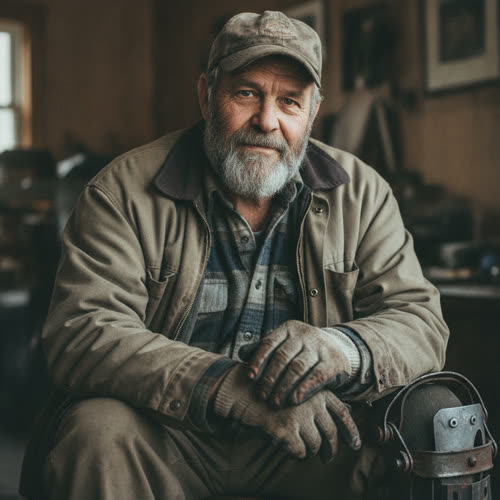

# Nolan Avery

## Basic Information

**Full name:** Nolan James Avery
**Common name:** Nolan
**Age at the start of Book One:** 64 [canon, character-birth-dates.md]
**Birth date:** January 27, 1989 [canon, character-birth-dates.md]
**Birthplace:** Detroit, Michigan
**Current residence:** Eli's neighborhood, a deteriorating residential district in Greater Detroit
**Household:** Lives alone in a long-held house in the neighborhood, his workshop and the brace-and-parts clutter of a working tradesman occupying as much of it as his living does. [open]
**Former occupation:** Electrical-grid engineer
**Current occupation:** Community power supervisor
**Faction or class:** Everyone Else, per `../../world/social-structure.md`. [open] He is the social structure's named case exactly: the specialist whose company pulled out and whose knowledge is now repurposed at neighborhood scale, keeping local power alive by hand.
**Primary viewpoint:** No. Nolan is never a point-of-view character, per `../viewpoint-rules.md`.
**Story role:** Infrastructure elder, skeptic, and symbol of retained human knowledge

## Physical and Identifiers




<!-- voice:start -->
_Voice (default sample):_

<audio controls src="../voices/avery-nolan/avery-nolan-1.mp3"></audio>

[Play voice](../voices/avery-nolan/avery-nolan-1.mp3)
<!-- voice:end -->
### Frame

Heavyset, with a damaged right knee. [canon] A big, broad, thick-through frame gone heavy with age, strong in the shoulders and arms from a lifetime of physical work, settled in the middle. He walks with a metal brace he repairs himself. [canon] His posture is the careful, weight-shifting stance of a man managing a bad knee all day, planted and deliberate, slow to rise and slow to sit. [canon-adjacent]

### Coloring

Brown skin weathered by decades of outdoor and substation work, lined and sun-marked at the back of the neck and the hands. A gray beard, kept full but not tidy. [canon] Gray, close-cropped or thinning hair under whatever cap is to hand. Dark eyes, hooded and shrewd, the eyes of a man who has been told a system is fine and has learned to go look for himself.

**Heritage:** African-American: a Great Migration family with Alabama roots in Detroit.

### Face

A broad, heavy, deeply lined face, jowled with age, framed by the gray beard. [canon beard] His notable features are the lines of long squinting at panels and weather and the set of a jaw used to disagreeing. His expression at rest is skeptical and unimpressed, a man waiting to be shown rather than told, which softens, rarely and unmistakably, into dry warmth when someone earns it. [canon-adjacent to his stubborn, generous nature]

### Hands and handedness

Right-handed. Large, thick, scarred working hands, the most eloquent thing on him: knuckles swollen from decades of cold metal and tight spaces, old burns and nicks from live work, nails permanently dark at the beds. He wears permanently stained work gloves. [canon] His hands are the literal record of the thirty-five years; they read, instantly and correctly, as a man who has had his hands inside the actual machinery of keeping the lights on, the exact opposite of an abstraction. [canon that he is suspicious of abstraction]

### Distinguishing marks

The damaged right knee is the defining mark, the result of decades of climbing, kneeling, and a working life on hard surfaces, now managed with a brace he machines and re-machines himself rather than wait on a healthcare system that has withdrawn. [canon knee and self-repaired brace] Old electrical burn scars on the hands and forearms, each from a specific job he could probably still name, the marks of live work done before and after the crews got thin. [behavior-only] (proposed) Permanently work-stained hands beneath the gloves. No tattoos or piercings established in canon.

### Identity and body status (2053)

Legally registered with a verified digital identity that still exists on paper, but living in the degraded-access reality of the unsupported districts: the institutions that identity used to open, dependable healthcare above all, have withdrawn from his neighborhood, per `../../technology/infrastructure/identity-and-money.md`. [open] The load-bearing body fact is the knee and, beneath it, his health: Nolan's health is deteriorating more rapidly than he tells anyone, and he manages it himself, with the same make-do discipline he brings to the brace, inside a world of no-bill community clinics and no specialists, refusing to be one more person the system has to carry. [canon that his health is deteriorating faster than he admits; reveal-gated] [reveal: Book 1] He carries no augmentations; his entire stance is that human knowledge and human hands, not automation, are what keep the grid alive. [canon distrust of AI]

### Movement and voice

He moves slowly and deliberately, favoring the braced knee, lowering himself to work and levering himself back up, a big man husbanding a body that is failing faster than he admits. [canon-adjacent] He has a deep voice. [canon] It is a low, gravelled, carrying bass with a Detroit working cadence, unhurried, used to talking over generators and to being the last word in a substation. He does not perform; he states. The spoken style itself lives in Section 8.

### Grooming and default dress

Practical, hard-worn work clothes built to survive the job: heavy trousers, layered shirts and a worn jacket, steel-toed boots, the brace, and the permanently stained work gloves he is rarely without. [canon gloves] His grooming is minimal and functional, the full gray beard kept but not fussed, the dress of a man who measures clothing by whether it survives a day inside machinery, not by appearance. [canon-adjacent to his pride in practical knowledge]

## Personality

Nolan is stubborn, generous, proud, and suspicious of abstraction. [canon] He values apprenticeships and practical knowledge. [canon] He resents Eli's corporate background but recognizes his skill. [canon] His generosity is real and undemonstrative: he will spend a freezing night getting a neighbor's power back and refuse to make a thing of it, then be sharp with anyone who calls it kindness. [behavior-only] (proposed) His humor is dry, gruff, and deadpan, delivered flat, often at the expense of new machines and the young engineers who trust them; he is funniest when he is most disgusted. [behavior-only] (proposed)

**Articulated goal:** Keep the lights on long enough to train people who can replace him. [canon]
**Deeper need:** Accept that preserving old knowledge may require integrating new intelligence rather than rejecting it. [canon]
**Governing fear:** That the community has become dependent on a small number of aging specialists who cannot be replaced quickly enough. [canon]
**Core contradiction:** He insists the only safe systems are ones a human can understand and take over by hand, while being himself the irreplaceable single point of failure that very principle warns against; his pride in being the one who knows the grid is also the dependency he most fears. [behavior-only] (proposed, derived from the canon fear and the canon manual-fallback boundary)
**Moral boundary:** He will not allow critical grid control to become fully automated without a manual fallback. [canon]
**What could make them cross it:** If his own failing health, or a hard winter that hand labor cannot meet, made a human fallback impossible to keep staffed, he might accept more automation than he can personally override, hating it, to keep people from freezing. [reveal: Book 1] (proposed)
**Private reading of the collapse:** This was not a mystery and not an act of nature; he watched it happen one crew at a time. Companies replaced experienced people with automated management systems to save money, the automation failed in ways its makers did not understand, and the people who could have fixed it had already been let go. [canon that he watched companies replace crews with automation that failed in ways younger engineers did not understand] To Nolan the withdrawal is, at bottom, the deliberate firing of everyone who actually knew how things worked. [behavior-only] (proposed framing)
**Personal definition of human value:** A person is worth what they can keep running and what they can teach the next pair of hands. Worth lives in retained, transmissible competence, which is precisely why a world that discards experienced people and a machine that needs no apprentice both read to him as theft. [open, derived from his canon goal and values]
**What they are preserving:** The hard-won human knowledge of how the systems actually work, and the line of apprenticeship that carries it forward, against both corporate abandonment and frictionless automation. He is, almost literally, the last man who remembers, trying to hand it on before his body quits. (His entry in the Final Character Standard.) [open, derived from canon]

## Daily Life and Habits

Nolan's days are the everyday economy at the level of the wires. Per `../../world/social-structure.md`, his specialist knowledge has been driven local and informal: he keeps a neighborhood's power alive by hand instead of routing a region's grid for a company. [open] A day is rounds of the local power infrastructure, diagnosing failures, scavenging and machining parts, nursing aging hardware, and arguing with younger people about what can and cannot be trusted to automation. [canon community power supervisor] He works for the barter, labor-exchange, and goods economy rather than for money, paid in food, repairs, fuel, and standing; per `./vega-marisol.md`, the grocer paid him in goods to come look at her compressor. [open, that he is paid in goods]

He keeps long, stiff hours bent around the bad knee, rests it when he must and pretends he is not, and spends part of every working day on the thing he says matters most and never quite has time for: trying to teach someone, anyone, enough to replace him. [canon goal to train replacements] The recurring strain of his week is the gap between how much the neighborhood needs him and how few hours his body and the clock actually give him, which is the engine of his fear and the story's clock.

## Hobbies and Interests

- Restoring and repairing old machinery for its own sake: motors, generators, hand tools, the brace itself, the satisfaction of making a dead mechanical thing run again with no server's permission and no manufacturer's blessing.
- Teaching and mentorship as a vocation rather than a chore: he takes real, gruff pleasure in apprenticeship, in watching a young pair of hands finally understand a system, which is his goal and his recreation both. [canon that he values apprenticeships] (the enjoyment is proposed)
- Keeping and consulting an analog archive of the regional grid: hand-marked schematics, paper logs, and decades of fault history that exist nowhere a company still maintains, a private library of how the system was actually built.

## Likes and Dislikes

Likes: a machine he can take apart and understand all the way down; a young person who actually wants to learn the trade; hand tools that outlive their makers; black coffee and a working space heater; being proven right about a system that "could not fail"; the company of other infrastructure people who remember the work. Dislikes: abstraction offered in place of a fix; automated management systems and the people who trust them blindly; being told a thing is fine by someone who has never opened it; being fussed over or pitied; and any suggestion that the knowledge in his head is replaceable on a timeline that does not exist. [canon that he is suspicious of abstraction and distrusts AI] (the rest accepted as canon (Decision 056))

## Relationships

Structured edges (machine-readable; one edge per line, `relation: profile-id`):

```
- colleague: [Eli Rook](./rook-eli.md) [canon: initial resentment to mutual respect; trusted with Morrow's physical infrastructure]
- colleague: [Ray Dorsey](./dorsey-ray.md)
```

Reciprocity note: the `colleague` edge to `./dorsey-ray.md` is the matching half
of that profile's edge back to Nolan (also normalized to `colleague` in this same
pass, since `neighbor-grid-elder` maps to the infrastructure-peer `colleague`
term), so both halves agree. The `colleague` edge to `./rook-eli.md` maps the
established Eli-Nolan arc (`grew-to-trust`); `./rook-eli.md` is active canon and
does not yet carry the reciprocal `colleague` half, owed when it is normalized.
Re-homed (non-edge): the barter repair tie to `./vega-marisol.md` (she calls
Nolan for the compressor and pays him in goods) is supply-and-repair logistics,
not a durable bond, and is recorded in the prose entry below, not as an edge.

**Eli Rook** (`./rook-eli.md`). Nolan initially treats Eli as someone who helped destroy the profession Nolan loved. Over time, they develop mutual respect. Nolan becomes one of the first people Eli trusts with Morrow's physical infrastructure. [canon] What Nolan wants from Eli, beneath the resentment, is the same thing he wants from anyone: proof that the man respects the work and the people who do it, and a successor worth teaching; what Eli needs from Nolan is the hands, the grid knowledge, and the hard-won trust that lets Morrow touch real infrastructure. The resentment is the corporate-background wound; the respect is earned at the panel.

**Ray Dorsey** (`./dorsey-ray.md`). The neighborhood's other infrastructure man, a former line and dispatch worker who keeps the mesh board; his natural counterpart and occasional collaborator. [open] (the working pairing is proposed in dorsey-ray.md) Two men of the same temper and trade, easy and a little competitive, paid in goods and respect. Per `./dorsey-ray.md`, Nolan is the prouder and angrier of the two about the new machines, Dorsey the more resigned, having watched his own trade switched off first; when a fault is genuinely a wire and not a decision, Dorsey is the one who walks Nolan to it. What each wants is someone of their own kind who still remembers the work.

**Marisol Vega** (`./vega-marisol.md`). The grocery counter clerk who calls him when something electrical or mechanical fails, and pays him in goods to come look. [open, that she called him for the compressor] Two infrastructure elders of the same generation, easy with each other. Per `./vega-marisol.md`, he looked at her dying dairy compressor and told her the truth she relayed to Eli: not the compressor, the controller. [open] (the read that this Chapter 1 "Nolan" is Nolan Avery is pending Reconcile confirmation per the spec, and is treated here as proposed identification) What each wants is continuity, and someone their age who remembers how the street used to run.

## Voice and Speech

Nolan is concrete, experienced, and skeptical of theory, per `../viewpoint-rules.md`. [canon-adjacent] He speaks in plain, declarative, mechanically specific sentences, naming the actual part and the actual failure rather than the abstraction; his canon Chapter 1 line is exactly this register, "It's not the compressor. It's the controller wants to call home and nobody's home." [open, established Chapter 1 line relayed via `./vega-marisol.md`] He distrusts theory offered without a fix and says so. [canon suspicion of abstraction] In his deep voice he is dry, blunt, and gruffly funny at the expense of machines and the people who over-trust them, and he gets quieter and flatter, not louder, when he is most certain he is right. [behavior-only] (proposed) He rarely volunteers feeling; what affection he has comes out as a willingness to spend his time and his failing body on a person, not as a sentence.

## History and Background

Born January 27, 1989, in Detroit. [canon] Nolan spent thirty-five years maintaining electrical systems. [canon] He understands the regional grid more intimately than anyone else in the community. [canon] He distrusts AI because he watched companies replace experienced crews with automated management systems that failed in ways younger engineers did not understand. [canon] He lived through the whole arc of the withdrawal from inside the trade, watching crews thin and contracts evaporate, and when the company finally pulled out of his district he did not leave; he stayed and turned the same skill local, becoming the neighborhood's community power supervisor. [canon current occupation] (the staying-rather-than-leaving framing is accepted as canon (Decision 056), consistent with the social structure) By Book One he is sixty-four, the most knowledgeable person in the community about the systems everyone depends on, and the one whose body is running out.

## Private History and Behavioral Roots

- Watched, over thirty-five years, experienced crews replaced one at a time by automated systems that then failed in ways no one left could fix -> his distrust of AI is not ideology but eyewitness memory, and he treats every confident claim that a system "cannot fail" as the exact thing he has already seen kill a grid. [behavior-only] (proposed grounding of the canon distrust)
- Was, himself, made obsolete by the automation he warned about, and stayed anyway -> his pride and his resentment of corporate people like Eli's old self are the same wound, and he guards his irreplaceability partly because being needed is what he has left. [behavior-only] (proposed)
- Knows his health is failing faster than he admits and has chosen not to say so -> he overworks the failing knee and body, refuses help and pity, and presses harder than ever to train a successor, a private race against a clock only he is fully watching. [behavior-only] [reveal: Book 1] (the deteriorating health is canon; the behavioral effects are proposed)
- Built a whole identity on transmissible competence and apprenticeship -> he measures every person, including Eli and Morrow, by whether they make the next pair of human hands more capable or less, and a system that needs no apprentice reads to him as a kind of death. [behavior-only] (proposed)

## Secrets

- Nolan's health is deteriorating more rapidly than he tells anyone. He knows the community may lose him within a year. [canon] He is the only one who fully knows how close the clock is; if the neighborhood understood how soon it may lose him, it would force exactly the panicked dependence and rushed automation he has built his life against, and would turn the people who rely on him into people who pity him, which he will not allow. [reveal: Book 1]

## Role and Series Potential

Nolan's mortality adds urgency to Morrow's creation. The community is not only losing corporate support. It is losing the people who remember how the systems work. [canon] He is the human mortality clock under the book's central problem: when hand labor and aging specialists can no longer keep enough machines alive, the case for resuming Morrow becomes physical and personal rather than abstract.

**Book One arc:** Nolan moves from treating Eli, and the idea of a new intelligence, as the enemy of everything he values, toward a guarded, conditional alliance, becoming one of the first to let Morrow near real infrastructure, on the strict condition of a human fallback he can take over by hand. [canon that he comes to trust Eli and is trusted with Morrow's physical infrastructure, and that he requires a manual fallback] His internal movement is toward the lesson his need names: that preserving old knowledge may require integrating new intelligence rather than rejecting it. [canon] **False belief:** Human hands and human knowledge alone can keep the systems alive, if people just refuse to give them up. **Truth he must learn:** The knowledge in one aging head cannot scale or outlast him by will alone; carrying it forward may require the very kind of intelligence he distrusts.

**Long-term series potential:** Nolan is a finite, deliberately mortal resource. His death, or his survival and reconciliation with Morrow as the system that finally lets him hand the work on, is a lever the series can pull once. He rhymes with the cast's other elders of retained knowledge, Daniel Rook in Flint among them, as the generation that remembers.

**Writing rules:** Do not make Nolan merely a luddite or merely a wise elder; his skepticism is grounded in real, witnessed failure and is sometimes simply correct. Do not let his death, if used, be sentimental; it should land as the loss of irreplaceable competence, which is the theme. Do not resolve his distrust of AI by having him converted; let it stay partly unconvinced.

## Continuity Anchors

Static, immutable. A drafter must not contradict these.

- His name is Nolan James Avery. [canon]
- He was born January 27, 1989, and is 64 at the start of Book One. [canon, character-birth-dates.md]
- Birthplace Detroit, Michigan; current residence Eli's neighborhood. [canon]
- Former electrical-grid engineer with thirty-five years maintaining electrical systems; now community power supervisor. [canon]
- He is heavyset with a damaged right knee, walks with a metal brace he repairs himself, has a gray beard, a deep voice, and permanently stained work gloves. [canon]
- He understands the regional grid more intimately than anyone else in the community and distrusts AI from watching automation replace and outlast competent crews. [canon]
- He will not allow critical grid control to become fully automated without a manual fallback. [canon]
- His health is deteriorating faster than he admits; he believes the community may lose him within a year. [canon]
- He is Everyone Else, Greater Detroit, per `../../world/social-structure.md`. [open]
- Accepted as character canon under Decision 056: his solo household and the absence of spouse or children as a positive fact; all physical identifiers beyond the canon ones above (complexion, eye color, face shape, hair, gait, timbre, specific wardrobe, burn scars); his daily-life economic details, hobbies, and likes/dislikes; the read that the Chapter 1 compressor "Nolan" is Nolan Avery; and the Book One arc, false belief, truth, long-term arc, and writing rules as stated in Role and Series Potential. (The behavior-only and reveal-tagged items remain author-facing and are not stated on the page.)

---

See also the [relationship map](../relationship-map.md) and the [viewpoint and dialogue rules](../viewpoint-rules.md) for Nolan's concrete, theory-skeptical voice.
