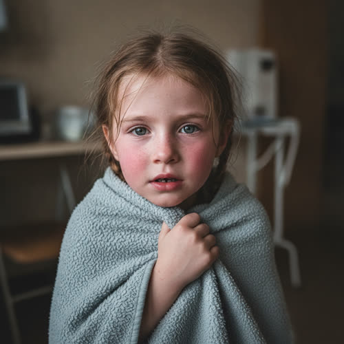

# The Caldwell Girl

> Status: DRAFT. Generated under `../profile-spec.md` as part of the Riverside
> clinic cluster (Ch2). The only canon facts are those traced to
> `chapter-02-the-last-supported-day.md` and marked `[open]`: the surname
> Caldwell, that she is a child, that she has a fever holding at one hundred, and
> that Lena keeps her overnight rather than send her into the cold, watched by
> hand and not by the machine. The given name Emma, her age, her birth date and
> birthplace, her parents and household, and every physical identifier are accepted
> as character canon under Decision 056. Because she is a young child, the
> interior apparatus in Section 3 is kept age-appropriate and brief. Reveal-tagged
> hidden facts and behavior-only items remain author-facing and are not stated on
> the page.

## Basic Information

**Full name:** Emma Caldwell (surname Caldwell is [open])
**Common name:** The Caldwell girl [open] (the only way she is named in Chapter 2); Emma to her family
**Age at the start of Book One:** 7
**Birth date:** February 14, 2046 (not listed in `../../timeline/character-birth-dates.md`; invented under Section 6 and tagged for the spine. Placed in 2046 to sit just younger than Amelia Mercer, born September 2045, age 8)
**Birthplace:** Greater Detroit, Michigan
**Current residence:** Her family's home in Greater Detroit, in the clinic's neighborhood. Presently kept overnight as a patient in Lena Okafor's clinic [open].
**Household:** Lives with her parents, the Caldwell family, Everyone Else. A mother who brought her to the clinic and waits on word, and at least one parent at home.
**Occupation:** Child; not yet of working age. Attends a neighborhood learning program of the informal kind the district runs now.
**Faction or class:** Everyone Else, per `../../world/social-structure.md` [open]. Her care is unbilled and her family is plainly outside the protected systems.
**Primary viewpoint:** No. She is never a point-of-view character.
**Story role:** Child walk-on and one of the chapter's purest images of care under withdrawal: a feverish little girl kept warm overnight and watched by a human hand because the machine that should watch her can no longer be trusted. She is "hers by hand, not the machine's."

## Physical and Identifiers



### Frame

Small for seven, light and slight under the clinic blanket, the way a feverish child is small. When she is well she is wiry and fast; tonight she is curled and still and warm to the touch.

### Coloring

Fair complexion gone pink and damp across the cheeks with the fever. Light-brown hair, fine and flyaway, sweat-stuck to her forehead and temple, usually worn in two short plaits that have half come undone. Blue-gray eyes, bright and over-shiny with the heat in her. [open, that she has a fever] (the eye color is proposed)

### Face

A round child's face, snub-nosed and freckled across the bridge, the cheeks flushed. At rest, asleep, her expression smooths into the open trust of a child who has decided the adults have it handled. Awake and feverish, her brow knots and unknots.

### Hands and handedness

Right-handed. Small hands, a child's hands, one of them usually fisted in the blanket edge in her sleep. Bitten nails. A scab on one knuckle from a fall. Her hands say nothing about work yet and everything about being seven: scrapes, a marker stain, a child's grip on a blanket.

### Distinguishing marks

A small pale scar on the left shin from a fall off a wall in the spring. A scatter of freckles across the nose and cheeks. A faint healed chickenpox mark at the hairline. A gap where a lower baby tooth has recently come out, which she will tell you about if you give her the chance. No piercings, no tattoos; she is seven.

### Identity and body status (2053)

Registered at birth, practically stranded with her family, per `../../technology/infrastructure/identity-and-money.md`. Her care is unbilled because there is no longer an institution on the other end of a bill [open, that the clinic does not bill]. No augmentations, no implants. Acutely unwell tonight with a feverish illness, fever holding at one hundred and falling [open]; otherwise a healthy child. The clinic's diagnostic scanner, which might have told Lena in a minute what the night will have to be watched out by hand, will not boot after midnight, so the child is monitored the old way [open, that the scanner is failing and she is watched by hand].

### Movement and voice

When well, fast and constant, all knees and motion. Tonight, slow and heavy-limbed with the fever, drifting in and out of sleep [open, by implication of the fever]. A light, clear child's voice, a flat Detroit vowel, that drops to a thin small thread when she is unwell. She is quiet tonight in the way a sick child goes quiet, which is its own kind of loud to the adults watching.

### Grooming and default dress

Tonight, a borrowed clinic nightshirt and the warmest blanket the clinic can spare, kept warm against a building that is cold by ration. When well: hand-me-down layers, sturdy mended shoes, a coat too big so it will last another winter, the practical patched clothing of an Everyone Else childhood. She smells of fever-sweat and the clean clinic blanket and, faintly, of the chest rub a neighbor makes.

## Personality

In health Emma is bright, busy, talkative, and stubborn, a seven-year-old who asks why until the adult runs out of why, and who would rather be doing the thing than being told about it. She is brave in the way small children are brave, which is to say she copes well right up until she is tired or frightened and then needs a hand to hold. Tonight she is subdued by the fever and by the strange cold building, watchful of the adults, taking her cues for how worried to be from their faces, and reassured most by Priya's steady presence and the regular ritual of the thermometer.

Her humor is a child's: knock-knock jokes told wrong, delight in a grown-up pretending to be fooled. The interior apparatus below is kept light and age-appropriate, as the spec directs for young children.

**Articulated goal:** To go home, to be less hot, and to keep the night-light on.
**Deeper need:** To be safe and warm and not left alone in the strange cold place; to be kept.
**Governing fear:** The dark, the cold, the needle she thinks might be coming, and being sent back out into the night.
**Core contradiction:** She insists she is fine and big enough to go home, while holding the blanket edge in a fist and not wanting Priya to leave the room.
**Moral boundary:** A seven-year-old's: she does not want anyone to get in trouble, and will hide a hurt to keep the peace.
**What could make them cross it:** Fear or fever could make her hide a worsening symptom rather than say it, exactly the thing the night's hand-watch exists to catch.
**Private reading of the collapse:** She has no theory of it. She has only ever known this world. The cold building, the broken machines, the doctor who comes by hand, are simply how things are; she has nothing to compare them to, which is itself the quiet horror the chapter trusts the reader to feel.
**Personal definition of human value:** Not yet formed. To her, value is the grown-up who stays in the room. (Age-appropriate placeholder per the spec's Section 11 note on a reduced interior for young children.)
**What they are preserving:** Without knowing it, she is what the others are preserving: the child kept warm by hand on a night no machine would, the reason the "old way" is worth the trouble. (Her entry in the Final Character Standard, held on her behalf.)

## Daily Life and Habits

When well, her days are an Everyone Else childhood: the neighborhood learning program, play in the cleared lots, errands run for the household, the small green economy of a family that grows and trades some of what it eats, per `../../world/social-structure.md`. Her family pays for nothing in the protected sense; they are held in the barter-and-standing economy of `../../technology/infrastructure/identity-and-money.md`, and a visit to Lena's clinic costs no money because there is no money in it.

Tonight her "day" is the clinic: a thermometer under the arm every two hours, a hand on her forehead, sips of warm fluid, the night-light, and Priya in and out of the room on a schedule the child quickly learns to expect and take comfort from [open, that she is watched by hand every two hours]. She sleeps in stretches and wakes warm and asks the time.

## Hobbies and Interests

- Drawing, on whatever paper the household can spare, mostly animals and houses with too many windows.
- Collecting small specific things, bottle caps and certain pebbles and one good marble, sorted and re-sorted.
- Knock-knock jokes and riddles she half-remembers and improves, told to any adult who will pretend to be stumped.

## Likes and Dislikes

Likes: the night-light, warm sweet drinks, when Priya stays, her one good marble, being told a story, the gap where her tooth came out. Dislikes: the cold of the building, the dark in the strange room, needles (real or imagined), being sent out into the night, the way the grown-ups' faces go careful when they think she is not looking. [the cold building and being sent into the cold are canon-grounded; the rest accepted as canon (Decision 056)]

## Relationships

Structured edges (machine-readable; one edge per line, `relation: profile-slug`, canonical `lastname-firstname` ids):

```
- patient-of: [Lena Okafor](./okafor-lena.md)
- patient-of: [Priya Sharma](./sharma-priya.md)
```

Reciprocity note: `patient-of` is directional and stored only here, on the patient; the
`patient` inverse to Lena and Priya is derived by traversal and never stored on their files.
Her parents have no profiles and are carried in prose only; no `mother` or `father` edges
are stored, and their child-inverse is therefore never generated.

**Dr. Lena Okafor** (`./okafor-lena.md`). Her doctor for the night, and the one who decides she stays. [open] Lena keeps her rather than send a child into the cold on a night she cannot promise her the scanner if she spikes, naming her "mine, not the machine's" [open]. The bond is the brief, total responsibility of a doctor for a sick child she has chosen to hold through an uncertain night. What the child wants from Lena, without the words for it: to be kept and made less hot. What Lena holds for the child: a decision she has to stand inside, that keeping her here is not safe and is still the least-bad choice.

**Priya Sharma** (`./sharma-priya.md`). The staffer who watches her by hand, the steady presence on the two-hour schedule. [open] Priya takes her temperature, writes it down, and is the one who will fetch Lena if she climbs [open]. For the length of this night the child is "hers by hand," and the child takes more comfort from the predictable ritual of Priya's checks than from anything a machine could offer. What the child wants from Priya: that she stay, or come back soon. What Priya gives: the reliable return that lets a frightened child sleep.

**Her parents, the Caldwells**. Everyone Else, the household she belongs to. A mother brought her in and waits on word; a parent keeps the home. The bond is ordinary and central: she wants to go home to them, and the reason she is here instead is that home cannot keep a fevered child as warm or as watched as the clinic can tonight. What they want: their child home, well, and safe.

## Voice and Speech

A light, clear, talkative child's voice when she is well, full of why and a flat Detroit vowel, dropping to a thin thread when she is unwell. She narrates her world in concrete particulars, the marble, the tooth, the drawing, and asks direct questions the adults find hard, like whether she is going home and how hot she is. Under fever and fear she gets quiet and short and holds on to the blanket. She tells small fibs to keep the peace and is transparently bad at it, the way children are.

## History and Background

Born in Greater Detroit in the mid-twenty-forties, into an Everyone Else family in the clinic's neighborhood. She has never known the supported world; the cold buildings, the dead machines, the doctor who comes by hand, are simply the shape of the only world she has, which is the quiet horror the chapter leaves unspoken. She came up through whatever schooling the district still runs informally and through a household that grows and trades some of what it eats.

By Book One she is seven and feverish, brought to Lena's clinic on the evening of October 3, kept overnight rather than sent home into the cold, and watched by a human hand on a night the machine that should watch her is about to lose its permission to.

## Private History and Behavioral Roots

- Has only ever known the withdrawn world, with nothing to compare it to -> she accepts the cold building and the broken machines without fear or comment, which lands on the adults harder than any complaint could. [behavior-only] (proposed)
- A child who reads adults' faces for how safe she is -> she goes quiet and watchful exactly when the grown-ups are most worried and trying hardest to look calm, and is steadied most by routine, the two-hour thermometer she comes to expect. [behavior-only] (proposed)
- Has learned, the way poor children learn, that being trouble has a cost -> she will insist she is fine and hide a hurt to keep the peace, the precise behavior the night's hand-watch exists to catch. [behavior-only] (proposed)

## Secrets

- Her throat or her head hurts worse than she has said, and she is hiding it because she is afraid of a needle and afraid of being sent home into the dark, which is exactly the unspoken worsening Priya's hand-watch is meant to find. [reveal: Book 1] (proposed)
- She is more frightened of the cold strange building than she lets the grown-ups see, and keeps a fist in the blanket so no one will notice and think her a baby. [reveal: Book 1] (proposed)

## Role and Series Potential

In Chapter 2 her function is small and load-bearing: she is the clearest, gentlest statement of the chapter's whole argument. A feverish child should be the easy case, the one the machine watches while the doctor handles the hard ones; instead she is kept overnight and watched by hand because the machine can no longer be trusted, and Lena claims her with the line that names the chapter's stakes, "she's mine, not the machine's." She is the warmth the rationing threatens, the child the "old way" is worth the trouble for, and the future the withdrawal is quietly shaping, a person who has never known anything better.

Book One arc, minor: she is a single night's responsibility, her fever rising or falling a small clean meter of whether the night holds. Long-term series potential, if promoted: a child of the withdrawal, raised entirely inside it, is exactly the figure who could one day measure what Morrow's intervention is for, the generation that might inherit either a world taught to keep them warm or one that learned to stop. She could recur as a household the clinic carries, a thread that keeps the human stakes young. False belief, if promoted: none yet; she is too young. What she models instead: a child's unquestioning acceptance of a diminished world, which is the thing the adults are fighting so she will not have to keep.

Writing rules: keep her a real seven-year-old, not a symbol with pigtails; her bravery and her fear are both ordinary. Do not give her thematic dialogue; the theme lives in how the adults treat her, not in anything she says. Never put her in graphic danger for effect; her stakes are warmth, fever, and being kept, and that is enough.

## Continuity Anchors

Static, immutable. A drafter must not contradict these.

- In approved prose she is named only as "the Caldwell girl." [open]
- She is a child, a patient at the clinic on the night of October 3, 2053. [open]
- She has a fever that is falling, "Down. Hundred even, last hour," holding at one hundred. [open]
- Lena keeps her overnight rather than send her into the cold, because Lena cannot promise her the scanner if she spikes: "she's mine, not the machine's." [open]
- She is watched by hand, not by the machine: temperature every two hours, the old way, written down, by Priya; if she spikes, Priya is to fetch Lena and not go to the cabinet. [open]
- She is "hers by hand, not the machine's." [open]
- Accepted as character canon under Decision 056: given name Emma; age 7; birth date February 14, 2046; birthplace Greater Detroit; the parents and the Caldwell household; the learning program; and all physical identifiers and all Section 10 and 11 entries. (the behavior-only and reveal-tagged items remain author-facing and are not stated on the page)
