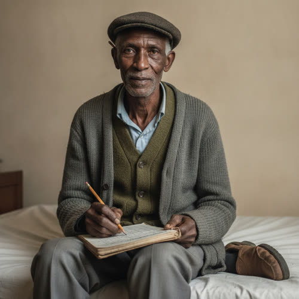

# Sékou Dembélé

## Basic Information

**Full name:** Sékou Dembélé
**Common name:** Dembélé [open] (the only name given in approved Chapter 2; people use the surname)
**Age at the start of Book One:** 73
**Birth date:** March 2, 1980 (not listed in `../../timeline/character-birth-dates.md`; invented under Section 6 and offered to the spine)
**Birthplace:** Bamako, Mali (grounds the Bambara/Malian surname and a later emigration)
**Current residence:** A small house in Lena's neighborhood, Greater Detroit, gone too cold to hold a night
**Household:** Lives alone. A widower. He spends many evenings in the clinic ward's spare bed, where he is not a patient, because his own house has gone too cold and the clinic had not yet. [open]
**Occupation:** Retired logistics analyst. For forty years he routed container ships, trucks, and the long autonomous trains across half a continent for a freight network. [open] He now keeps the neighborhood food-trade board, the cork panel by the clinic's back door, matching what one street produces against what another needs and working out who carries which to whom. [open]
**Faction or class:** Everyone Else, per `../../world/social-structure.md`. [open] (He keeps a paper notebook because the wall-sized screen and the institution behind it are gone.)
**Primary viewpoint:** No. He is never a point-of-view character.
**Story role:** Minor recurring walk-on, and the named human instance of the social-structure canon that a former freight analyst keeps a neighborhood food-trade board. His arc from ten thousand chains on a wall to three streets of eggs in a notebook is the book's plainest statement of its thesis: what survives the withdrawal is skill, applied closer to home.

## Physical and Identifiers



### Frame

A tall man folded down by age, six feet once and stooped a hand's width short of it now. Spare and bony, the kind of thinness that reads as a big frame with the upholstery gone. Lena's hand finds "the bone of it close under the cardigan" when she rests it on his shoulder. [open] He sits up in the spare bed to work, knees drawn up as a desk, the notebook propped on them. [open] His posture is the settled forward stoop of a man who spent a career leaning toward a screen.

### Coloring

Deep brown complexion, ashier at the knuckles and the shins in the cold ward. Hair gone fully white and cropped close to the skull, the eyebrows still half dark. Brown eyes that have kept the long flat focus of a man who read a continent off a board, quick to settle on a column of figures and slow to leave it. [open, derived from "I can still see a chain when it's in front of me"]

**Heritage:** Malian: Bambara, a Bamako immigrant.

### Face

A long, deeply lined face, the cheeks fallen in, the jaw still long and definite. His resting expression is attentive and a little amused, the look of a man who is always half watching a system move. When he talks about the wall-sized screen the amusement and the loss sit in the face at the same time and he does not try to keep either out. [open] A reading habit pulls his chin down and his eyes up over absent glasses.

### Hands and handedness

Right-handed. These are not a laborer's hands. They are an analyst's hands gone old: long fingers, soft palms thickened only at the writing callus, the nails ridged and clean. They move with the unhurried precision of a man used to a stylus and a keyboard, and now to a pencil. He keeps "careful columns in a hand that had been trained on a wall-sized screen." [open] The hands reveal a lifetime of routing, not lifting; of deciding where the freight went, not carrying it.

### Distinguishing marks

A pale surgical scar low on the right side of his abdomen from a gallbladder taken out decades ago, in the years when a clinic two streets over could still do that on a morning's notice. Reading glasses he has lost and no longer replaces, so he holds the notebook at arm's length in bad light. A faint indent across the bridge of the nose where the glasses used to sit. The first joint of the left index finger is stiff and slightly crooked, set badly after he jammed it in a container coupling on a yard inspection in his thirties, the one time the job put him near the steel he spent his life moving on paper. No tattoos.

### Identity and body status (2053)

Legally registered, institutionally stranded, per `../../technology/infrastructure/identity-and-money.md`. His verified identity still exists; the pension that identity once unlocked was folded into a successor fund and then into a state program and then quietly defunded, a number that stopped being answered, the same shape as everything else. He has no augmentations and no implants, a man of the generation that retired before the body became a thing you subscribed to. No prosthetics. Chronic conditions: arthritis in the knees and hips that the cold of his own house sharpens, mild and untreated heart trouble he manages by sitting down when the stairs argue with him, both watched over without charge at Lena's clinic. [open that the clinic carries him without a bill] His real vulnerability in Book One is plain and unmedical: a house he can no longer keep warm.

### Movement and voice

He moves slowly and economically, conserving the knees, taking stairs one tread at a time with a hand on whatever is near. His voice is low, dry, and pleased with itself when a chain comes clear, with the rolled cadence of Bambara and French under fifty years of flat American vowels. He says things "with a satisfaction that did not hide the other thing under it." [open] He talks to the notebook as much as to the person, narrating the route as he writes it.

### Grooming and default dress

Tidy, layered, and warm, because he is always cold now. Default dress is a buttoned cardigan over a shirt and a thermal vest, "the cardigan" Lena's hand finds at his shoulder, with a second cardigan over the first on the worst nights. Pressed trousers gone shiny at the knee, soft-soled shoes, a flat cap he keeps on indoors against the ward's chill. He keeps himself shaved and his collar straight even in a borrowed bed, a man who dressed for an office for forty years and will not let the habit go. Scent of liniment and pencil graphite. He carries the board-keeper's notebook and two pencils, one behind the ear.

## Personality

In public Dembélé is courtly, dry, and quietly proud of the one thing he can still do better than anyone on the street, which is see a chain. He delivers a route the way he must once have briefed a board, the figures first and the satisfaction underneath. He is generous with the skill and stingy with self-pity, and when the loss shows, he lets it show plainly rather than perform either grief or cheer over it. "Both were in his voice and he did not try to keep either out." [open] In private he is lonely and cold, an old man in a house the world stopped heating, who has learned that the clinic's warmth and the columns in the notebook are the two things that still put him somewhere he is needed.

His humor is structural. He finds it genuinely funny that the shape of the work did not change, only the scale, that the same logistics that moved the contents of the world now move a dozen eggs, and that he is still, demonstrably, good at it. "It's the same shape, you know. It's exactly the same shape." [open]

**Articulated goal:** Keep the food-trade board honest and current, so the right thing reaches the right door and no neighbor is left out of a chain he can see.
**Deeper need:** To still be the man who knows the road between things. To not be only an old body in a borrowed bed, but the mind that the street's small economy runs through.
**Governing fear:** That the cold takes the house, then the legs, then the columns, and he becomes a patient in the bed he now only borrows, a man things are carried to instead of the man who routes the carrying.
**Core contradiction:** He calls the notebook a downgrade and a humiliation in one breath and does it with open pride in the next. He grieves the wall-sized screen and would not trade away the three streets that need him now.
**Moral boundary:** He will not cook the board for a friend. He routes by who needs and who has and what is owed, not by who he likes, because a chain you bend once stops being a chain anyone can trust.
**What could make them cross it:** If his own warmth or his own survival came to depend on a particular family's favor, he might let a column lean their way and tell himself it was only efficiency, the way he once told himself the autonomous trains were only efficiency.
**Private reading of the collapse:** Nothing broke. The freight still moves, the world is still full, the chains still exist. The institutions simply stopped being the thing that held the chains, and the chains fell into people's hands, his among them. The automation he spent a career perfecting did exactly what it was built to do, which was to need fewer people, and one of the people it stopped needing was him.
**Personal definition of human value:** You are worth the chains you can still see and keep moving for people who cannot see them. Value is being the road between a thing that exists and a person who needs it.
**What they are preserving:** The route. The knowledge that a thing is here and wanted there and someone has to know the road between, and that this knowing is a skill and a kindness and does not require a company to license it. (His entry in the Final Character Standard.)

## Daily Life and Habits

He rises late and slowly in a cold house, boils water on a camp burner because the supported heat is gone, and walks the few cold blocks to the clinic's back door to update the board before the day's trades move. [open for the board; the routine accepted as canon (Decision 056)] He reads the columns, takes down the settled debts, pins up the new wants, and works out the day's carries, who walks which way with what. The Vesely place has eggs; the Reyes place needs them; the Okonkwos owe the Veselys from August; he holds the whole supply chain of three streets in the paper notebook on his knees. [open]

For money he barely uses money. He trades the one thing he has, which is the routing itself, and the neighborhood keeps him fed and, on the cold nights, warm, in exchange for the board that keeps the rest of them squared, per `../../technology/infrastructure/identity-and-money.md`. [open] He eats what the chains leave at his door, often the near edge of a trade, an egg, a heel of bread, soup from whoever cooked too much. On the coldest evenings he comes to the clinic and sits up in the spare bed and works the columns in the bad light until he puts the notebook down and goes under the blanket, and in the morning he walks home and starts again. [open]

## Hobbies and Interests

- Maps, in any form. Old paper road atlases, transit diagrams, the painted-over harbor charts he keeps rolled in a tube, the pleasure of a route drawn so a stranger could follow it.
- A shortwave radio he listens to for the freight and weather chatter that still leaks across the bands, the company of a moving world he is no longer routing.
- Teaching the board to anyone who will sit still, especially the young, because a chain you can see is a thing you can hand on, and he would rather hand it on than keep it.

## Likes and Dislikes

Likes: a chain that comes clear in front of him, a sharpened pencil, a settled column, the warmth of the clinic, strong sweet tea, brown eggs that have "earned their trip," the young asking him how a route works (the chain, the eggs, and the satisfaction are canon-grounded; the rest accepted as canon (Decision 056)). Dislikes: the cold of his own house, a debt left dangling, anyone who calls the board charity, being thanked as if the routing were nothing, and the particular silence of a phone that no longer answers a number (the cold house is canon; the rest accepted as canon (Decision 056)).

## Relationships

Structured edges (machine-readable; one edge per line, `relation: profile-slug`):

```
- acquaintance: [Lena Okafor](./okafor-lena.md)
- colleague: [Marisol Vega](./vega-marisol.md)
- colleague: [Talia Reed](./reed-talia.md)
```

Re-homed (barter logistics, not edges, per profile-spec.md): Dembélé keeps the
food-trade board for the Okonkwo, Vesely, and Reyes households and routes the
Vesely brown eggs onward to Lena's clinic. The former `board-keeper-for`
(Okonkwo, Vesely, Reyes) and `routes-eggs-to` (Lena) labels are supply, routing,
and debt accounting, not durable bonds, so they are dropped from the edge list
and carried in the descriptive prose below. Mapped: the clinic bond formerly
tagged `clinic-guest-of` becomes the symmetric `acquaintance` with Lena; the
board coordination formerly tagged `coordinates-board-with` becomes the symmetric
`colleague` with Marisol.

Reciprocity note: under the model these two symmetric edges are stored on both
ends, so `okafor-lena` should carry `acquaintance: dembele-sekou` and
`vega-marisol` should carry `colleague: dembele-sekou`. Both counterpart files are
out of this batch and not edited here; their reciprocal edges, and the migration
of Marisol's placeholder `trades-with` note, are flagged for the migration pass.

**Dr. Lena Okafor** (`./okafor-lena.md`). The doctor who lets him sit up in the spare bed on the cold nights, and the last node on most of his chains. [open] She takes the eggs he routes to her and puts her hand on his shoulder, and she cannot decide, standing there, whether the bed is a kindness or an indictment, and has stopped trying. [open] The bond is mutual respect between two people who keep a withdrawn world running by hand. What he wants from her: warmth, and to be useful in her clinic rather than a charge on it. What she gets from him: a working barter ledger and an old man's company that is also a daily reckoning of what the new economy costs.

**Mrs. Okonkwo** (`./okonkwo-ngozi.md`). A family on his board. He routed the Veselys' brown eggs to them on Wednesday against an August debt, and then watched those same eggs come to the clinic as the Okonkwos' fee for the father's visit. "The Okonkwos paid you in my eggs." [open] What he wants from her: that the debts settle clean and the chain stay legible. What she gets from him: the route that turns what she has into what she owes.

**Marek Vesely** (`./vesely-marek.md`). The egg source, the start of the chain Dembélé loves best. The board matches "what the Vesely place had" against the streets that need it. [open] What he wants from Vesely: a steady, honest count of the hens' output so the routing holds. What Vesely gets: a man who turns a surplus of eggs into settled debts and fed neighbors.

**Hector Reyes** (`./reyes-hector.md`). A family on the board whose need he routes, "what the Reyes place needed," and a man in the clinic ward at the same time Dembélé is in the spare bed. [open] What he wants from Reyes: to keep the eggs flowing to a household that needs them. What Reyes gets: eggs that arrive because someone still keeps the road between.

**Mrs. Diallo** (`./diallo-aminata.md`). Less a node than a neighbor he worries about, a woman who stayed off his board and out of the clinic for months out of a fear of a bill, until the cough decided for her. They are near in age and far in temperament, his pride in being needed against her dread of being a cost. What he wants from her: that she let the chains carry to her too. What she gets: an old man's gentle, unwelcome insistence that she is owed a place in the routing.

**Marisol Vega** (`./vega-marisol.md`). The grocer who squares her hand-written ledger against his board for the things the dead supply chain no longer brings. Two keepers of the same withdrawn economy, one at a counter, one at a cork panel, who trade near-dated stock and routes back and forth. What each wants: a neighbor of the same generation who still remembers how the street used to be supplied, and a working seam between the shop and the board.

## Voice and Speech

Low, dry, courtly, and structural. He talks in routes: a thing is here, a thing is wanted there, somebody has to know the road between. He narrates a chain aloud as he writes it, the moves counted off, "three moves, those eggs." [open] His vocabulary is a logistician's gone domestic, chains and moves and columns and trips, applied to eggs and bread and salve. Verbal tic: he says the same true thing twice, the second time slower, to make it land, "It's the same shape, you know. It's exactly the same shape." [open] Under stress, or under the weight of the loss, he gets quieter and more precise, and lets the grief and the pride sit in the voice together without sorting them. A faint French-African cadence surfaces on the long vowels.

## History and Background

Born in Bamako, Mali, in a trading family, and good early at the one thing he never stopped being good at, seeing how a quantity here became a need met there. He emigrated young, trained as a logistics analyst, and spent forty years inside a continental freight network, rising to route container ships, trucks, and the long autonomous trains across half a continent. [open for the forty years and the freight] He was, in his own words, a man who "once moved the contents of the world from where it was made to where it was wanted." [open] He married and was widowed; the house they kept is the house that is now too cold.

The automation he helped perfect did to him what it did to the city. The autonomous trains he had spent years routing learned to route themselves, the network shed its analysts, and the institution that had employed him withdrew under the same polite notices that took the towers and the grid. [open, derived] He retired into a neighborhood the world had stopped supplying, and discovered that the skill did not retire with the job. He started keeping the food-trade board, the cork panel by the clinic's back door, because someone had to know the road between the Vesely place and the Reyes place, and he was the man who could see it. By Book One the wall-sized screen is a paper notebook, and he holds the supply chain of three streets on his knees. [open]

## Private History and Behavioral Roots

- Spent forty years certain that better routing meant fewer hands needed, and then was one of the hands the routing stopped needing -> he insists, with pride and without bitterness aimed at anyone, that the work is "the same shape," because if the shape is the same then the skill was never the thing that became unnecessary, only the scale. [behavior-only] (proposed)
- Watched the wall-sized screen and the institution behind it vanish a number at a time -> he keeps the board on paper, in pencil, in a notebook on his own knees, trusting nothing that has to phone a company to be allowed to know what it knows. [behavior-only] (proposed)
- His own house went cold and the clinic had not yet -> he comes to the spare bed in the evenings and earns the warmth the only way he will accept it, by working, keeping the columns current rather than simply taking the bed. [behavior-only] (proposed)
- Routed freight his whole life and only once stood on a real yard, jamming his finger in a coupling -> he is faintly, privately moved by the physical weight of the things he used to move only as numbers, and lingers over a real crate of real eggs longer than the routing requires. [behavior-only] (proposed)
- Was widowed in the cold house and has no one to keep warm for -> he attaches himself to the board and the clinic because being needed by a system is the closest thing left to being needed by a person. [reveal: Book 1] (proposed)

## Secrets

- He is colder and more alone in the house than he lets the clinic see, rationing the camp burner's fuel and timing his evening visits by how badly the night will bite, and he frames every visit as work on the board so no one names it as shelter. Exposure would turn the proud board-keeper into a charity case in his own eyes. [reveal: Book 1] (proposed)
- His heart trouble is worse than he has told Lena, and he has been quietly leaving the board's logic written out in full in the back of the notebook so that someone could keep the chains running after him. Exposure would force the care he is avoiding and admit the legs are going. [reveal: Book 2] (proposed)
- He privately suspects the autonomous-freight systems he helped build are exactly the lineage of the intelligences now deciding which neighborhoods get supplied, and carries a quiet, unspoken guilt that the road he perfected is the road that withdrew from his own street. He says none of this aloud. [reveal: Book 2] (proposed)

## Role and Series Potential

In Chapter 2 his function is exact and thematic. He is the lived instance of the social-structure canon that a former freight analyst keeps a neighborhood food-trade board, and the chapter uses him to land its thesis in a single image: the wall-sized screen reduced to a paper notebook, the same skill, a smaller life no one chose, "warmer than the one that had paid her in a number from an office, and a downgrade no one had chosen." [open, derived] He is one half of a deliberate diptych with Malcolm Mercer, two logistics men at opposite ends of the withdrawal, one who parlayed the trade into Asterion wealth and a Mars hope, one who ended it in a borrowed clinic bed with a cork board. (Diptych derived from the spine; flagged for the Mercer cluster.) Book One arc, minor: from a proud, lonely keeper of three streets toward the question of who keeps the board when the keeper cannot. Long-term series potential: if promoted, his board is the natural human counterpart to Morrow, a second answer to the same problem of making stranded, incompatible nodes cooperate without a company's permission, one run on a notebook and one on a forged yes. He could become the man who first recognizes what Morrow really is, because he has spent his life seeing chains. False belief, if promoted: that the routing is only the same shape, that scale costs nothing. Truth he would learn: that scale was never neutral, that the road he perfected is the road that withdrew.

Writing rules: do not let the grief tip into self-pity; the pride is real and load-bearing. Do not let his folk-logistics wisdom be simply correct or simply quaint. Keep "the same shape" as both his comfort and his blind spot. Never let him explain the book's thesis more directly than Chapter 2 already lets him.

## Continuity Anchors

Static, immutable. A drafter must not contradict these.

- His name in approved prose is Dembélé, surname only, "old Dembélé." [open]
- He ran logistics for forty years, routing container ships, trucks, and the long autonomous trains across half a continent. [open]
- He now keeps the neighborhood food-trade board, the cork panel by the clinic's back door, where he pins his columns of what the Vesely place has and what the Reyes place needs and who carries which to whom. [open]
- He keeps a board-keeper's notebook of careful columns, written in a hand "trained on a wall-sized screen," and works it on his knees in bad light. [open]
- He comes to the clinic some evenings and sits up in the spare bed, where he is not a patient, because his own house has gone too cold and the clinic had not yet. [open]
- He routed the brown eggs: "Vesely to Okonkwo Wednesday, against a thing they owed the Veselys from August. Now they've come to you. Three moves, those eggs." [open]
- He says of the routing: "I can still see a chain when it's in front of me. Used to be ten thousand of them at once, on a screen the size of a wall. Now it's eggs. But it's the same shape, you know. It's exactly the same shape." [open]
- He tells Lena: "You take the eggs, doctor. They've earned their trip." [open]
- He is thin enough that Lena feels "the bone of it close under the cardigan" when she rests her hand on his shoulder; he is warm; the bed is warm. [open]
- Later that night he "put down the notebook and gone under the blanket." [open]
- Accepted as character canon under Decision 056: given name Sékou; age 73; birth date March 2, 1980; birthplace Bamako, Mali; the widowhood; living alone; all physical identifiers; the freight-network and pension specifics; and the hobbies, daily life details, and likes/dislikes of this profile. (The behavior-only and reveal-tagged items remain author-facing and are not stated on the page.)
