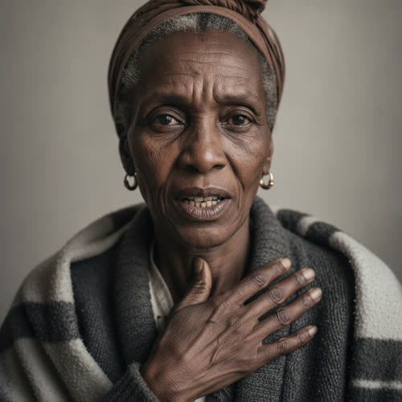

# Aminata Diallo

## Basic Information

**Full name:** Aminata Diallo
**Common name:** Mrs. Diallo [open] (the only name given in approved Chapter 2)
**Age at the start of Book One:** 70
**Birth date:** February 14, 1983 (not listed in `../../timeline/character-birth-dates.md`; invented under Section 6 and offered to the spine; derived from her line "You spend fifty years afraid of the cost of a doctor")
**Birthplace:** Labé, Guinea (grounds the Fulani surname and a later emigration to the United States)
**Current residence:** A house in Lena's neighborhood, Greater Detroit; presently a ward bed at the clinic
**Household:** Lives alone now, widowed. Her husband is quoted in the prose, "My husband used to say," which reads as a man no longer present. [open that a husband is referenced]
**Occupation:** Retired; a homemaker and, in earlier years, a low-wage service worker, the kind of work that came with no coverage and taught the fear
**Faction or class:** Everyone Else, per `../../world/social-structure.md`. [open] (She is the human residue of the withdrawn healthcare apparatus: the fear of the bill, outliving every institution that ever sent one.)
**Primary viewpoint:** No. She is never a point-of-view character.
**Story role:** Minor walk-on with an outsized thematic charge. She is the book's cleanest image of an institution outliving itself as pure fear: a woman who stayed home for months and let a small thing grow large out of terror of a cost that no longer exists.

## Physical and Identifiers




<!-- voice:start -->
_Voice (default sample):_

<audio controls src="../voices/diallo-aminata/diallo-aminata-1.mp3"></audio>

[Play voice](../voices/diallo-aminata/diallo-aminata-1.mp3)
<!-- voice:end -->
### Frame

Five feet three inches, thin, and grown frail, the thinness of someone who has been quietly unwell and quietly not eating enough for a while. In the ward bed she is small under the blanket. Upright she has a careful, self-contained carriage, a woman who takes up little room on purpose.

### Coloring

Dark brown complexion, the skin gone a little gray with illness and the cold ward. Hair worn under a headscarf, gray at the edges where it shows, the Fulani way of covering kept all her life. Dark eyes "that were tired and clear," the clarity the thing the prose marks, a woman seeing her situation exactly. [open]

**Heritage:** Guinean: Fulani, Fulbe, a Labe immigrant.

### Face

A fine-boned, narrow face, the cheeks hollowed by illness and age, deeply lined, with a composed, dignified resting expression that the cough keeps breaking. When she tries to laugh "the laugh turned into the cough." [open] The face is one that has practiced not showing fear and is, tonight, almost past the practice.

### Hands and handedness

Right-handed. Thin, work-worn hands, the knuckles enlarged, the skin loose now over old strength, a lifetime of cleaning and cooking and care work in them. In the bed they are still, folded, or pressed to her chest when the cough comes. The hands reveal decades of low-paid physical labor and the present quiet of a body conserving what it has left.

### Distinguishing marks

A faint old scar at the hairline from a childhood fall in Guinea. The worn, slightly grooved fingers and a permanent slight stoop of decades of domestic and service work. Pierced ears with small old gold hoops she has worn so long the holes have stretched, a connection to home she never takes out. Her teeth show the long absence of dental care, another bill she never let herself pay. No tattoos; her tradition forbids them.

### Identity and body status (2053)

Legally registered, and the most thoroughly self-excluded person in this cluster, per `../../technology/infrastructure/identity-and-money.md`. Her verified identity is intact; the institutions it once reached, the insurer, the public plan, the state program, are all gone, and yet the fear they installed in her has kept her out of care more effectively than any locked door, "the fear was the last thing left standing of the whole apparatus." [open] No augmentations, no implants; unthinkable for a woman who would not pay for a scan. No prosthetics. Chronic condition, now acute: a chest, a cough "that was not a cough, that was the kind of thing a chest holds for months before it becomes the thing it was always going to be," advanced by months of avoided care into something the scanner she cannot run would name and the months have probably already decided. [open]

### Movement and voice

She moves slowly and carefully, short of breath, resting between efforts, a body rationing itself. Her voice is quiet, worn, and clear-eyed, with a West African Fulani cadence under decades of American English, the consonants soft, the rhythm gentle. The cough interrupts her. She delivers hard truths about herself plainly and even wryly, "So now I'm here too late instead of broke." [open]

### Grooming and default dress

Modest, careful, and traditional. Default dress is long skirts or a wrapper and a headscarf, layered against the cold, a heavy cardigan, sensible shoes, the dignified self-presentation of a woman who keeps herself correct even while sick and poor. In the ward she is in her own nightclothes and headscarf and the clinic blanket. Scent of camphor and the herbal things she has dosed herself with at home for months instead of coming in. The old gold hoops.

## Personality

In public Mrs. Diallo is gentle, dignified, self-effacing, and wry, a woman who has spent a lifetime not being a burden and apologizes before she is asked anything, "I should have come before... I kept thinking what it would run me. Old foolishness." [open] She turns her own situation over with a clear, unsparing, almost humorous honesty, naming her mistake exactly, "That's the trade I made with myself. Cheaper, anyway." [open] In private she is frightened and resigned at once, carrying the dread that outlived its cause and now, too late, the larger dread underneath it.

Her humor is dark, self-deprecating, and clear, the gallows wit of someone who can see her own error perfectly and is too late to fix it. The dog image is hers, "like a dog that flinches at a hand that's only ever fed it," and it is both a joke and a diagnosis of her own conditioning. [open]

**Articulated goal:** To not be a cost or a trouble to anyone, and, beneath that and only now, to be told the truth about what the months have done.
**Deeper need:** To be relieved of the fear itself, the lifelong dread of the bill that has outlived every bill, and to be allowed to receive care as something other than a debt she is shamefully incurring.
**Governing fear:** Articulated, the cost of the doctor. Real, and underneath, the thing the cost-fear was always standing in front of: that her chest holds the thing it was always going to become, and that she traded the chance to catch it for the comfort of not spending.
**Core contradiction:** She is afraid of a bill in a world with no bills, dread without an object, a flinch at a hand that only feeds her. She knows there is no charge and stayed away for months anyway, because the fear is no longer about money and never quite was.
**Moral boundary:** She will not take care she believes a younger or more savable person needs more, and she will not make her dying anyone's emergency.
**What could make them cross it:** Only fear for someone she loves, never for herself, would make her demand a resource ahead of another; for herself she will always defer, which is the very deferral that has cost her.
**Private reading of the collapse:** The world took the bill away and left her the dread of it, "which was the worse half to keep." The companies and the offices and the plans all withdrew, but the thing they trained into her over fifty years did not withdraw with them. The apparatus is gone and she is still obeying it.
**Personal definition of human value:** A lifetime of believing, against her will, that her value was measured by what her care would cost others; now, too late, the dawning sense that she was worth the care all along and the counting was the lie.
**What they are preserving:** She has spent her life preserving her own thrift and her refusal to be a cost, and that preservation is the thing that is killing her; what she has left to preserve is her dignity and her clear sight in the face of it. (Her entry in the Final Character Standard; deliberately the cluster's tragic case, a preservation that turned on its keeper.)

## Daily Life and Habits

For months her days have been a slow, private negotiation with a cough, dosing herself at home with camphor and herbal things, telling herself it would pass, weighing every worsening against "what it would run me," and choosing, again and again, to stay home. [open, derived] Now her day is the ward bed: rest, the cough, the dark hours, the dread, and the small warmth of being looked after at last. [open that she is kept warm in the ward]

For money she has almost nothing and spends almost nothing, which has been the whole organizing principle of her life, per `../../technology/infrastructure/identity-and-money.md`. [open] She is largely outside the barter economy too, not a node on Dembélé's board but a neighbor at its edge, because trading also means being seen needing, and being seen needing is the thing she has spent a lifetime avoiding. She eats little, lives small, and has made thrift into a fortress that finally became a trap.

## Hobbies and Interests

- Prayer and the rhythm of the day around it, the practice of her faith carried whole from Guinea, the one structure the withdrawal could not defund.
- The small home remedies and herbal preparations she has used on herself for years, half medicine and half thrift, a knowledge that let her avoid the doctor she feared.
- Memory itself, the long telling-over of home, Labé, the family, the husband, a life lived more and more inward as the body and the world both narrowed.

## Likes and Dislikes

Likes: warmth, which she has rationed her whole life and is grateful for now, "You're warm here, that's something"; quiet; prayer; the clarity of being told a true thing plainly; an old gold hoop's weight in the ear (the gratitude for warmth is canon-grounded; the rest accepted as canon (Decision 056)). Dislikes: being a cost, being seen as needy, a fuss made over her, and, lifelong, the cost of a doctor, the dread she cannot put down even now (the fear of cost and the dislike of fuss are canon-grounded; the rest accepted as canon (Decision 056)).

## Relationships

Structured edges (machine-readable; one edge per line, `relation: profile-slug`):

```
- patient-of: [Lena Okafor](./okafor-lena.md)
```

Mapped and kept (per profile-spec.md): the directional `patient-of` edge is kept,
stored here on the patient (Mrs. Diallo); the clinician inverse is derived, never
stored. The former `late-husband` label maps to the symmetric `spouse`, with the
deceased/widowed life-status carried in prose so it is not mislabeled. The husband
is quoted in Chapter 2 but unnamed, has no profile, and is out of this cluster's
create-list, so his target stays a bare placeholder slug, not a Markdown link, and
the edge points at a still-proposed person.

Reciprocity note: `patient-of` is directional and not reciprocity-checked, and
`okafor-lena` is out of this batch. Her late husband has no profile and is carried
in prose only; no `spouse` edge is stored, and the `spouse` inverse is therefore
never generated.

**Dr. Lena Okafor** (`./okafor-lena.md`). The doctor she finally came to, too late, and who keeps from her tonight what the scan she cannot run would have found. [open] Mrs. Diallo apologizes to her, confesses the trade she made with herself, and lets Lena "keep the rest back, the way patients did, both of them in on it." [open] The bond is a quiet, mutual, knowing mercy between two women, the patient who can see her situation clearly and the doctor who chooses, for one night, to withhold the worst of it. What she wants from Lena: warmth, truth eventually, and not to be a trouble. What Lena gets: the patient who most sharply embodies the cruelty Lena lives inside, a fear that outlived its institutions.

**Her late husband** (quoted in approved Chapter 2; no profile yet, out of create-list). The man who "used to say I'd let a thing kill me before I'd let it bill me." [open] His teasing names her lifelong flaw exactly, and his absence is part of why she faced the cough alone, dosing herself at home with no one to push her in. The relationship is now memory and the echo of his joke, which has turned out to be a prophecy. He is deceased (accepted as character canon under Decision 056); he remains unnamed and unprofiled, carried in prose only.

**The neighborhood food-network** (`./dembele-sekou.md`, `./okonkwo-ngozi.md`, `./vesely-marek.md`, `./reyes-hector.md`). She stands at the edge of the barter economy the others run, near it but not in it, because to trade is to be seen needing. The cluster connection is by contrast: where Mrs. Okonkwo pays her way and Dembélé routes the chains and Reyes draws on the board, Mrs. Diallo took nothing and asked nothing until the cough forced her in. She is the person the network exists to catch and almost did not. This framing grounds her as the cluster's counter-case (accepted as character canon under Decision 056).

## Voice and Speech

Quiet, worn, clear, and unexpectedly wry. She speaks in plain, complete sentences, apologizing and confessing and diagnosing herself with a terrible accuracy. Her vocabulary is plain and homely, reaching for an exact homely image when she names her own condition, the dog and the feeding hand, the trade she made, "too late instead of broke." [open] A soft Fulani cadence underlies the American English. Verbal tic: she states the truth about herself before anyone asks, the apology and the self-diagnosis arriving "already loaded the way the eggs had been loaded." [open] The cough breaks her sentences. Under stress she becomes calmer and clearer, not more agitated, a lifetime of not making a fuss holding even now.

## History and Background

Born in Labé, Guinea, into a Fulani family, and raised in the faith and the modesty she has kept her whole life. She emigrated to the United States as a young woman, around the turn of the 2000s, and settled in Detroit, working the low-wage service jobs that came with no coverage and everything to lose, which is where the fear was installed: fifty years, by her own count, of being afraid of the cost of a doctor. [open, derived from "You spend fifty years afraid of the cost of a doctor"] She married; her husband teased her about the very thrift that defined her, "I'd let a thing kill me before I'd let it bill me." [open]

As the institutions withdrew, the insurer that "would once have argued with Mrs. Diallo about whether her chest was worth a scan" pulled out of the district, the public plan folded into a state thing, the state thing was quietly defunded, and somewhere in there the fear of the bill outlived every institution that had ever sent one. [open] By Book One she has had a cough for months, "the kind of thing a chest holds for months before it becomes the thing it was always going to be," and stayed home through all of it because the old part of her "that had not caught up with the world" still believed that coming in cost money she did not have. [open] She came in at last, too late, "here too late instead of broke," and let the doctor keep the worst of it back for one more night. [open]

## Private History and Behavioral Roots

- Fifty years of low-wage work with no coverage in a country that billed for everything -> a dread of the cost of a doctor so deep it kept her home for months after the cost itself had ceased to exist, "like a dog that flinches at a hand that's only ever fed it." [behavior-only] (proposed)
- A lifetime of being the one who must not be a cost or a burden -> she apologizes before she is asked, confesses her own error first, and refuses fuss, taking up as little of anyone's resource as she can even when the resource is free. [behavior-only] (proposed)
- A husband who named the flaw as a joke and is now gone -> she faced the cough alone with no one to push her in, and his joke turned prophecy is part of what she carries. [behavior-only] (proposed)
- Self-dosed at home for years to avoid the doctor -> she trusts camphor and her own herbal remedies and her own endurance over any institution, a self-reliance that is really the fear wearing the mask of competence. [reveal: Book 1] (proposed)
- Came in only when the body forced the decision out of her hands -> she experiences the warm ward and the free care as both relief and indictment, a kindness arriving exactly too late to be the kindness it could have been. [reveal: Book 1] (proposed)

## Secrets

- She understands more clearly than she lets Lena see that the months have already decided this, that "here now" is not the same as "in time," and she is letting the doctor keep the prognosis back not because she does not know but because she is granting them both one quiet night before it is said aloud. Exposure of how much she already knows would end the shared mercy early. [reveal: Book 1] (proposed)
- The fear that kept her home was never really about money, and on some level she has always known that, that she used the cost as the name for a deeper refusal to be examined, to be told, to be a body that could be found wanting, and naming that would mean facing that the apparatus she blames was only ever half the reason. Exposure would strip the comfortable story that the world did this to her. [reveal: Book 2] (proposed)

## Role and Series Potential

In Chapter 2 her function is the book's cleanest single image of the withdrawal's cruelty: an institution outliving itself as pure fear. "The fear was the last thing left standing of the whole apparatus." [open] She gives the chapter its sharpest line, the dog flinching at the feeding hand, and its sharpest fact, a woman dead or dying not of a bill but of the dread of one that no longer exists. Where Reyes shows the supply withdrawal on a healing body and Dembélé shows the career withdrawal in a notebook, Mrs. Diallo shows the deepest withdrawal of all, the one that left only the conditioned fear behind. Book One arc, minor and likely brief: a woman who came in too late, granted warmth, mercy, and the truth in the order she can bear them. Long-term series potential: limited by her likely fate, but as the cluster's tragic counter-case she is the standing argument for everything the network and any system like Morrow would exist to prevent, the neighbor the chains did not reach in time. If she lives, her arc is learning to let herself be cared for, fifty years too late and not entirely too late. False belief: that staying away was thrift, that she was sparing someone. Truth she embodies whether or not she learns it: that the fear of the cost cost her more than any bill ever could.

Writing rules: do not let her be only a lesson; keep her wit and her clear eyes, she sees her own situation better than anyone tending her. Do not resolve her cheaply; the months may already have decided. Hold the doctor-patient mercy as mutual and chosen, "both of them in on it," not as Lena deceiving a passive victim. Never let the theme be stated more baldly than her own dog-and-hand image already states it.

## Continuity Anchors

Static, immutable. A drafter must not contradict these.

- Her name in approved prose is Mrs. Diallo. [open]
- She came in that afternoon with "a cough that was not a cough, that was the kind of thing a chest holds for months before it becomes the thing it was always going to be." [open]
- She did not come months ago because "she had still believed, in the old part of her that had not caught up with the world, that coming in cost money she did not have." [open]
- She says: "I should have come before... I kept thinking what it would run me. Old foolishness. My husband used to say I'd let a thing kill me before I'd let it bill me." Her attempted laugh "turned into the cough." [open]
- Lena tells her: "There's no bill. There hasn't been a bill here in two years. There's nobody to send it to." [open]
- She answers: "I know it. I knew it. It doesn't go out of you, though, the counting. You spend fifty years afraid of the cost of a doctor and then one day the cost is gone and you're still afraid, like a dog that flinches at a hand that's only ever fed it." [open]
- "So now I'm here too late instead of broke. That's the trade I made with myself. Cheaper, anyway." [open]
- Her eyes are "tired and clear." Lena withholds "what the scan she could not run would have found, what the months had probably already decided," and Mrs. Diallo lets her "keep the rest back... both of them in on it." [open]
- Lena: "You're here now." And: "We'll look at you properly tomorrow. Rest tonight. You're warm here, that's something." Diallo: "It's something." [open]
- A husband is quoted ("My husband used to say"); he is not named or otherwise described. [open]
- Accepted as character canon under Decision 056: given name Aminata; age 70; birth date February 14, 1983; birthplace Labé, Guinea, and Fulani origin; emigration around 2000; widowhood and the husband's deceased status; living alone; all physical identifiers; all Section 10 and 11 entries. (the behavior-only and reveal-tagged items remain author-facing and are not stated on the page)
