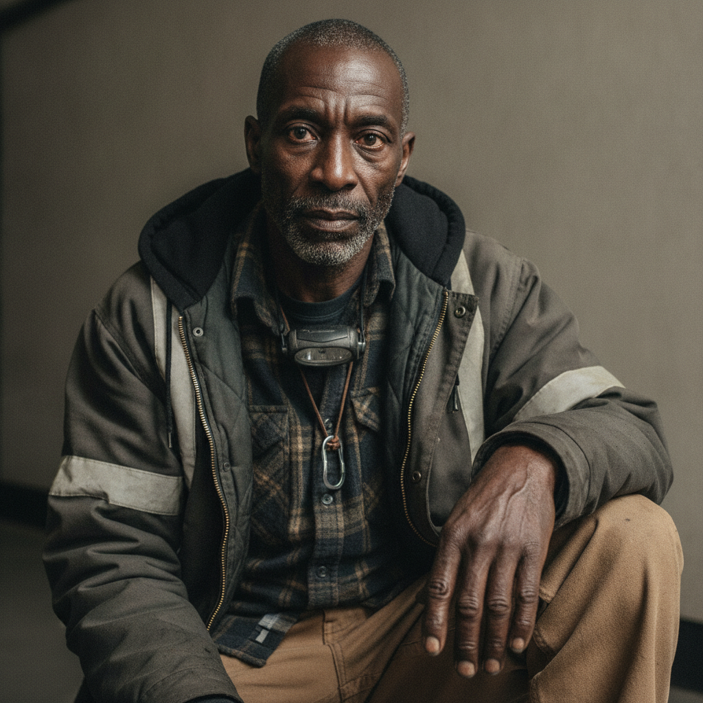

# Raymond Dorsey

> Status: DRAFT. Generated under `../profile-spec.md` as part of the Eli-neighborhood
> Chapter 1 walk-on cluster, written together with the Vance father and son so the
> shared neighborhood, board, and economy cohere. The canon facts are the surname
> Dorsey and the single mesh-board post traced to `chapter-01-no-signal.md`,
> marked `[canon]`. The given name Ray, his age, his birth date, his birthplace,
> his trade, and his household are accepted as character canon under Decision 056.
> Reveal-tagged and behavior-only items remain author-facing. Profile stays draft
> pending author activation.

## Basic Information

**Full name:** Raymond Dorsey [canon surname Dorsey, the name he signs on the board]
**Common name:** Dorsey [canon] (the only name in Chapter 1; he signs the mesh board by surname, and the street calls him Dorsey)
**Age at the start of Book One:** 45
**Birth date:** April 3, 2008 (not listed in `../../timeline/character-birth-dates.md`; invented under Section 6 and tagged for the spine)
**Birthplace:** Detroit, Michigan
**Current residence:** A small single-story house two streets over from Eli's shop, in Eli's neighborhood, Greater Detroit
**Household:** Lives alone. Divorced years back, no children in the house. His mother and a younger sister live a few districts away, past the edge the local mesh can reach, and he can only call them when the towers are up.
**Occupation:** Was a telecom and cable lineman, then a dispatcher, before the trade was automated and the company pulled out of the district. Now he hauls, does odd repair-of-the-non-electronic kind, and keeps an informal night watch over the block, paid in goods, credits, and favors, per `../../world/social-structure.md`.
**Faction or class:** Everyone Else, per `../../world/social-structure.md`. [canon] (He is plainly outside the protected systems: a man on the community mesh at two in the morning with no signal out.)
**Primary viewpoint:** No. He is never a point-of-view character.
**Story role:** Minor walk-on. The human ambient anxiety of the communications withdrawal and the most frequent night voice on the neighborhood mesh board. In Chapter 1 his post is the first evidence that the dead signal is not only Eli's, and it sets the chapter's opening note: the neighborhood can talk to itself, but not to anyone past its own edge.

## Physical and Identifiers



### Frame

Six feet even, lean and long-limbed, with the slight forward stoop of a tall man who spent years ducking under door frames and bending into junction boxes. Build is rangy and a little hollow now, the leanness of a man who eats irregularly and works at night. His posture is loose-shouldered and easy until something worries him, when he goes still and upright, listening.

### Coloring

Dark brown complexion, the skin at the back of his neck and his forearms weathered darker from outdoor work in all weather. Close-cropped hair gone mostly gray, kept shaved nearly to the scalp because a clipper run is cheaper and surer than a barber the neighborhood no longer has. A short gray-flecked beard kept the same way. Dark brown eyes, a little reddened at the rims from short broken sleep.

### Face

A long, narrow-jawed face, high forehead, deep vertical lines between the brows from years of squinting at small terminals and night work. Resting expression is watchful and faintly worried, the face of a man already half-listening for the next thing to go quiet. When he laughs it transforms completely and briefly, then settles back to the listening.

### Hands and handedness

Right-handed. Lineman's hands: large, long-fingered, the pads thickened and the nails permanently darkened at the edges, two knuckles enlarged from old breaks, a fine tracery of pale wire-nicks across the backs. He still strips and splices a cable by feel in the dark. His hands reveal a trade built entirely on connection, on making two ends meet and hold, now applied to whatever physical thing still needs joining.

### Distinguishing marks

A long pale scar down the inside of his right forearm from a fall off a service pole in his twenties, when the harness anchor he trusted was the kind that did not hold. A burn glaze across two fingertips of the left hand from a live splice taken too fast. A small steel ring he wears on a bootlace, an old climbing-spur buckle from his lineman kit, kept as a keepsake of the trade. No tattoos. A gap where a lower molar was pulled by a dentist the neighborhood used to have and no longer does.

### Identity and body status (2053)

Legally registered, practically stranded, per `../../technology/infrastructure/identity-and-money.md`. His verified identity still exists on paper, but the accounts and dispatch systems that once made him reachable to a company and a paycheck went silent the ordinary way, so he runs on cash, barter, the community ledger, and the library hub's mesh. [open] He keeps a small drawer of dead phones, each the last one some service stranded, partly for parts and partly because a comms man cannot make himself throw away a phone. [behavior-only] No augmentations and no implants, by economy and by a lineman's distrust of any link he cannot physically trace. [behavior-only] Mild high-frequency hearing loss in the left ear from decades near humming gear, uncorrected because the audiologist is one more service that left.

### Movement and voice

He moves quietly for a big man, deliberate, economical with steps, a night-worker's habit of not waking a street. A flat Detroit accent, the vowels broad, the cadence unhurried. His voice is a low warm baritone, a little roughened, the voice of a man used to being the calm one on a bad line, used to saying try it now into the dark and waiting to hear if it took.

### Grooming and default dress

Plain and weatherproofed. Default dress: a heavy hooded work jacket with a reflective stripe gone dull, layered flannels, canvas work trousers with a thigh pocket full of small tools, insulated boots, fingerless gloves so he can still work a connector. A knit cap pulled low on cold nights. He keeps a headlamp on a cord around his neck the way another man keeps reading glasses. Scent of cold air, machine oil, and burnt coffee. No jewelry but the spur buckle on its lace.

## Personality

In public Dorsey is steady, sociable, and a little wry, the kind of neighbor who knows whose porch light is out and whose battery car is feeding which house this week. He is the board's night voice, the one awake at strange hours posting what he sees, and over the months that has made him a quiet fixture of the neighborhood's nervous system. He is not a panicker. He reports. In private he is lonelier than he lets on, a connected man living at the end of a thinning line, rationing how often he tries the towers because a failed call out costs him more than a successful one gives.

His humor is dry and self-deprecating, often aimed at himself as the obsolete specialist: the man who spent his life keeping the world connected, now reduced to asking a corkboard if anybody else can hear anything. He treats the dead network the way a sailor treats weather, with respect and without illusion.

**Articulated goal:** Keep a line open. Get a signal out tonight, and keep the board alive so the neighborhood can at least find each other.
**Deeper need:** To still be reachable, and to still reach. To not be the man left talking into a channel that no longer carries.
**Governing fear:** The final silence. The night the towers stay dark and the hub goes too, and there is no voice at all, not out and not in, and his mother and sister are simply on the far side of a quiet he cannot cross.
**Core contradiction:** A communications man whose whole trade was connection is now the loudest, most reliable voice on a board that cannot reach past its own edge. He keeps the whole street connected to itself while unable to reach the two people he most wants.
**Moral boundary:** He will not spread panic and will not post what he has not seen with his own eyes. He reports a thing as exactly what it is, no worse, because a calm true word on a bad night is the one service he can still deliver.
**What could make them cross it:** If staying calm and accurate started costing lives, if there came a night when only fear would move people fast enough, he could break his own rule and ring the alarm hard, and hate that it worked.
**Private reading of the collapse:** Nobody cut the cables. The lines just stopped being answered, one exchange at a time, switched off in some far building by a number on a sheet, and the copper and the towers are all still standing, perfectly good, carrying nothing. He watched the trade he loved get powered down with the rest.
**Personal definition of human value:** You are worth being someone who answers. Value is being reachable, and being the kind of man who picks up.
**What they are preserving:** The open channel. The night watch. A board where the neighborhood can still find each other when nothing else will carry a word.

## Daily Life and Habits

He keeps a half-nocturnal schedule, partly old dispatch habit and partly because the block is most exposed at night, when a dead streetlight is a real dark and a stranded car battery is a cold house by morning. He walks the streets in the small hours with the headlamp, checking which lights are out, which cables are run from which car into which house, whose porch has gone dark that should not have. [behavior-only] (proposed) He checks the mesh board on every loop and posts what he finds, and he tries the towers for a signal out at the same hour each night, two-ish, because that is when the load eases and the bars sometimes flicker up long enough for one call. [open, behaviorized] The Chapter 1 post is one of those nightly tries, failed.

For money and goods he hauls, splices the non-electronic things that still splice, runs a charged battery to a cold house, and stands the informal watch, paid in coffee, credits, repairs, and the standing welcome of a man people are glad to owe. He squares his accounts on the food-trade board the way everyone does. He eats late and plain, sleeps in two shifts, and does not commute, because his work is the streets he can walk.

## Hobbies and Interests

- A shortwave and scanner setup he keeps powered off a salvaged battery, trawling the air for any distant human voice still broadcasting, which is less every season. It is the lineman's vice in retirement, listening to the world he can no longer call.
- Repairing and reviving dead handsets, partly for parts and partly for the small triumph of making a stranded phone do the one dumb thing it can still do.
- Dominoes and long card games on the colder nights, played by lamplight with whoever is also awake, for the company and the table talk.

## Likes and Dislikes

Likes: the bars flickering up at two in the morning, a clean splice that holds, strong reheated coffee, a porch light that comes back on, the weight of a working handset, dominoes, the particular quiet of the street at three when nothing has gone wrong yet. Dislikes: a call that drops mid-sentence, the clean machine type of a provider notice, a dead streetlight he cannot fix because the fault is a decision and not a wire, being thanked for his understanding, and the silence on the far side of the mesh edge where his mother's voice should be. [the notices and the mesh edge are canon-grounded; the rest accepted as canon (Decision 056)]

## Relationships

Structured edges (machine-readable; one edge per line, `relation-label: canonical-id`; ids per the relational spine):

```
- neighbor: [Eli Rook](./rook-eli.md)
- neighbor: [Marisol Vega](./vega-marisol.md) (proposed)
- colleague: [Nolan Avery](./avery-nolan.md)
```

Reciprocity note: the `neighbor` edge to `./vega-marisol.md` and the `colleague`
edge to `./avery-nolan.md` are reciprocated in those profiles in this same pass
(note that `neighbor-grid-elder` to Nolan maps to the symmetric `colleague` term,
the infrastructure-peer bond, not `neighbor`). The `neighbor` edge to
`./rook-eli.md` maps the canon mesh-board exchange; `./rook-eli.md` is active
canon and does not yet carry the reciprocal `neighbor` half, owed when it is
normalized. Pearl (mother) and Renata (sister) have no profiles and are not carried as
structured edges; both appear in the prose entry below.

**Eli Rook** (`./rook-eli.md`). A neighbor and the man the street trusts to actually fix a stranded thing. [open] Their one on-page contact is on the board itself: Dorsey posts that he has no signal out, and Eli answers, *Same here. Looking.* [canon, that Eli replied to the board] The bond is the easy practical trust of two men who keep things running by hand at opposite ends of the same dead network, one walking the streets at night, one at the bench by day. What Dorsey wants from Eli: a real diagnosis, and the rare relief of telling a problem to someone who can hold the whole shape of it. What Eli gets from Dorsey: the neighborhood's earliest, most reliable read of what is failing, posted before anyone official would ever say it.
**Marisol Vega** (`./vega-marisol.md`). The grocer two streets over, a fixed point of his nightly loop and the warm yellow doorway he checks is still lit. [open that both are neighborhood fixtures] Two people of nearly the same generation holding the street's small infrastructures open, hers the counter, his the line. He runs her a charged battery when the case is failing; she keeps his coffee. What each wants: continuity, and a neighbor who remembers how the street used to run.
**Nolan Avery** (`./avery-nolan.md`). The grid elder, his natural counterpart and occasional collaborator: when a streetlight or a feed is genuinely a wire and not a decision, Dorsey is the one who walks Nolan to it. [open] Two infrastructure men of the same temper, easy and a little competitive, paid in goods and respect. The tension is gentle. Nolan is prouder and angrier about the new machines; Dorsey is more resigned, having watched his own trade switched off first. What each wants: someone of their kind who remembers the work.
**Pearl Dorsey** and **Renata Dorsey**. His mother and sister live a few districts away, beyond the edge the local mesh can carry, and reaching them depends entirely on the towers being up. [open that he tries the towers nightly] The relationship is love stretched across a line that is being withdrawn, the same severed-family wound the cast carries in other households. What Dorsey wants: one clear call a week, to know they are warm. See Private History.

## Voice and Speech

Low, warm, and economical, the register of a man used to keeping a bad line calm. Short reporting sentences, the syntax of a dispatcher: location, condition, action. *Nothing on mine since maybe two.* [canon] He times by the network, not the clock, marking events by when the bars went rather than the hour. His vocabulary is plain and physical, full of the trade, lines and feeds and splices and loads, and he reaches for those words even about things that are not electrical. Verbal tic: he signs off and signs things by surname, *Dorsey,* the way he signed work orders and signs the board now. [canon] Under stress he gets shorter and steadier, not louder, the voice going flat and clear the way it did on the worst calls.

## History and Background

Born and raised in Detroit, into a family that worked with their hands. He went into the trade young, climbing poles and pulling cable, then moved inside to dispatch when his knees and the falls caught up with him. For two decades his whole life was connection, the literal making and keeping of lines, first for a company, then for whatever was left of it as the contracts thinned and the automated network-management systems replaced the crews, the same way they replaced Nolan Avery's. [open, world-consistent] When the company pulled out of the district under the same polite notices that took the towers, the dispatch job evaporated. He did not leave. He stayed in the neighborhood and turned the same skill local, hauling, splicing, watching the block, and keeping the mesh board, becoming the night nervous system of `../../world/social-structure.md`'s informal economy.

By Book One his marriage is years behind him, his mother and sister are on the far side of a shrinking signal, and his trade survives only as a man walking dark streets with a headlamp, posting to a board that cannot reach the world. On the night Chapter 1 opens, he tries the towers at two, gets nothing, and writes the post that turns out to be the first sign of the day's larger withdrawal. [canon]

## Private History and Behavioral Roots

- Spent a career being the calm voice on a failing line, the one who said *try it now* and waited -> he reports trouble flatly and exactly, never worse than it is, because he learned that fear on a bad channel costs lives and a steady word saves them. [behavior-only] (proposed)
- Fell off a service pole young on an anchor that did not hold -> he trusts only a link he can physically trace, and distrusts any connection, mechanical or human, that asks him to take its holding on faith. [behavior-only] (proposed)
- Watched his own trade, connection itself, get switched off building by building before the rest of the withdrawal reached the street -> he grieves the dead network more personally than his neighbors do, and cannot make himself throw away a dead phone. [behavior-only] (proposed)
- His mother and sister sit past the mesh edge where only the towers can reach -> he tries for a signal out at the same hour every night and feels each failed try as a small loss, which is the real weight under the plain Chapter 1 post. [behavior-only] (proposed)

## Secrets

- He has been quietly skimming his sleep and his own battery reserve to keep the shortwave and the night watch running, and is closer to worn out than he lets the street see, because the watch is the last thing that makes him feel like the man he was. [reveal: Book 1] (proposed)
- His mother's last clear call, weeks ago, was not good news, and he has told no one in the neighborhood, because saying it aloud would make it a thing happening rather than a thing he might still fix with one good signal out. [reveal: Book 1] (proposed)
- He keeps a private logbook of exactly which towers and feeds died on which nights, a lineman's habit of charting a failing network, and has started to see the shape in it before anyone called it a withdrawal, a pattern he does not yet have the words or the standing to raise. [reveal: Book 2] (proposed)

## Role and Series Potential

In Chapter 1 his function is precise and load-bearing for the opening: his post is the first proof that the dead signal is not Eli's phone but the neighborhood's, and it establishes the chapter's governing fact, that the mesh is up and the towers are not, that the street can talk to itself but not past its edge. He is the human sound of that fact. Book One arc, minor: from the steady night reporter toward a man who can no longer keep his own losses off the board he keeps for everyone else. Long-term series potential: if promoted, his nightly fault log and his lineman's instinct for a failing network make him a natural early node and ally for Morrow's work on the neighborhood's communications, the man who already maps which lines are dead and could be taught which forged yes brings one back, and an early human test of whether the street will trust a connection it cannot physically trace, the one thing he has sworn off. False belief, if promoted: that staying calm and accurate is always the same as being useful. Truth he would learn: that there are nights the street needs him to break his own steadiness and lead.

Writing rules: do not make him the wise old infrastructure sage twice over; he is Nolan Avery's lighter, more resigned counterpart, not a copy. Keep his calm as a trade discipline he chose, not serenity. Never let his fault-log foresight tip into prophecy. His one canon line is a worried man's plain report at two in the morning; keep that register.

## Continuity Anchors

Static, immutable. A drafter must not contradict these.

- His name in approved prose is Dorsey, the surname he signs on the neighborhood mesh board. [canon]
- His Chapter 1 mesh post reads, verbatim: *Anybody got signal out. Nothing on mine since maybe two. Dorsey* [canon]
- He posted in the night; his own signal had been gone since "maybe two." [canon]
- He is a neighbor inside Eli's neighborhood, on the same library-hub mesh, which is up while the towers are down. [canon]
- Eli answered the board, *Same here. Looking,* in response to Dorsey's and the library's posts. [canon, that Eli replied to the board]
- Accepted as character canon under Decision 056: given name Ray / Raymond; age 45; birth date April 3, 2008; birthplace Detroit; the lineman-and-dispatcher trade; living alone; the divorce; the mother Pearl and sister Renata past the mesh edge; all physical identifiers; and the hobbies, daily life details, and likes/dislikes of this profile. (The behavior-only and reveal-tagged items remain author-facing and are not stated on the page.)
