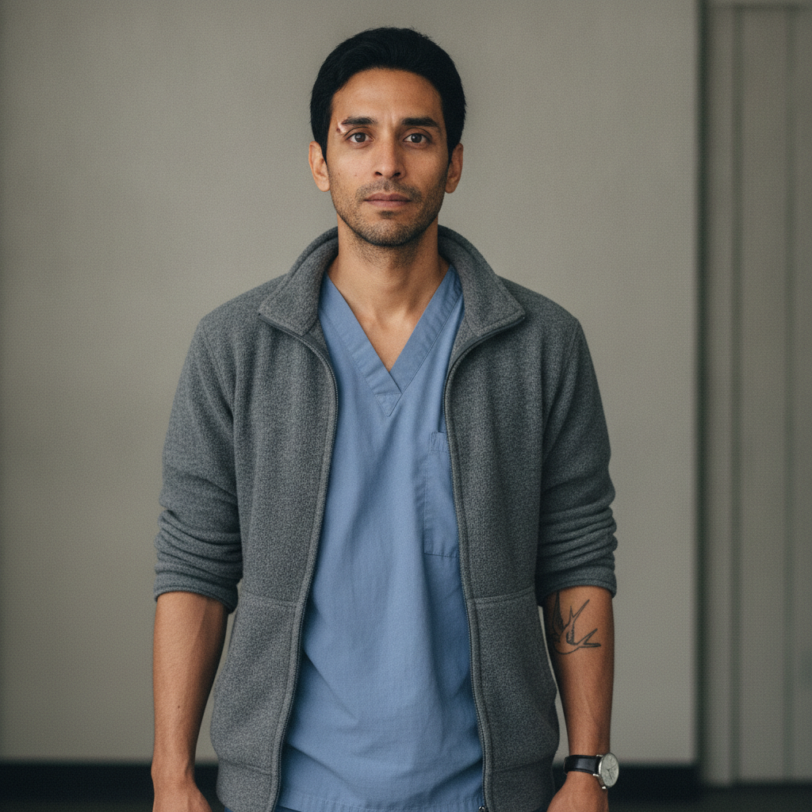

# Tomas Herrera

> Status: DRAFT. Generated under `../profile-spec.md` as part of the Riverside
> clinic cluster (Ch2). The only canon facts are those traced to
> `chapter-02-the-last-supported-day.md` and marked `[open]`: the given name
> Tomas, the age thirty, that he is the night nurse and the only other person on
> the floor, that he relays Priya's question and the Okonkwos' eggs, and that he
> "can't lie worth anything, his face does it for him." The surname Herrera, the
> birth date and birthplace, the family, and every physical identifier are accepted
> as character canon under Decision 056. Reveal-tagged hidden facts and
> behavior-only items remain author-facing and are not stated on the page.

## Basic Information

**Full name:** Tomas Herrera (given name Tomas is [open])
**Common name:** Tomas [open] (the only name given in Chapter 2)
**Age at the start of Book One:** 30 [open]
**Birth date:** May 9, 2023 (not listed in `../../timeline/character-birth-dates.md`; invented under Section 6 and tagged for the spine)
**Birthplace:** Detroit, Michigan
**Current residence:** A flat in Greater Detroit, in the clinic's neighborhood, within walking distance of the clinic
**Household:** Lives with his mother and a younger sister he helps support. Unmarried.
**Occupation:** Nurse. The clinic's night nurse, the second of two people on the floor overnight [open]. Trained in a hospital system before the withdrawal; now community-clinic staff.
**Faction or class:** Everyone Else, per `../../world/social-structure.md` [open]. He works for community standing and barter, not a salary, in an unbilled clinic.
**Primary viewpoint:** No. He is never a point-of-view character.
**Story role:** Clinic walk-on; Lena's steady second pair of hands and her relay to the rest of the floor. He is the staffer she "had not had to teach to be afraid quietly," and the readable face on which the night's fear is plainest.

## Physical and Identifiers



### Frame

Five feet nine inches, lean and quick, with the unshowy fitness of a man who is on his feet all night and lifts patients without being asked. Upright posture, light on the floor. He has learned to take up little room in a small clinic and to be where he is needed a beat before he is called.

### Coloring

Warm medium-brown complexion. Black hair, thick and straight, kept short and neat because a night nurse has no time for it otherwise. Dark brown eyes, expressive past his own wishes. A few days' worth of stubble by the end of a run of nights.

### Face

An open, boyish face that looks younger than thirty, broad at the cheekbones, quick to show what he feels. [open] (Mr. Adeyemi: "he can't lie worth anything, his face does it for him.") At rest it is attentive and faintly worried, the face of someone listening down a hall for a change in a sound.

### Hands and handedness

Left-handed. Clean, careful, capable hands, the nails kept short, the skin dry and a little cracked from a hundred hand-washings a shift. Steady hands, the steadiness practiced rather than born; under his calm they are the part of him he has trained hardest, because hands that shake frighten patients and his job is to not frighten them. His hands say method, repetition, and the deliberate manufacture of calm.

### Distinguishing marks

A pale comma of a scar through his left eyebrow from a fall off a bike at eleven. A small burn scar on the inside of the right wrist from an autoclave in his training years. A faded line-drawing tattoo of a swallow on the inside of his left forearm, his late grandfather's bird, done at nineteen. Clean even teeth. No piercings.

### Identity and body status (2053)

Legally registered, practically stranded, per `../../technology/infrastructure/identity-and-money.md`. His nursing credential exists in a system that no longer maintains the institution that issued it, which is exactly why his skill survives only at neighborhood scale, in a clinic that bills no one. No augmentations, no implants; he distrusts a body part that would need a server's permission to keep working, having watched a building full of such machines lose theirs. Healthy, apart from the chronic sleep debt of a man who works nights and worries days. No chronic conditions of note.

### Movement and voice

Quiet and quick on his feet, the gait of someone who has spent years not waking the sleeping. [open, that he is unobtrusive on the floor] A clear, even voice pitched low for a ward at night, with a flat Detroit vowel and a faint Spanish cadence under it from the household he grew up in. He reports things plainly, "the way you'd report the weather," even when they are not the weather [open].

### Grooming and default dress

Neat, practical, warm. Scrub top under a heavy zip fleece against the cold building, the clinic having heat only in rations. Worn soft-soled shoes that make no sound. A watch with a second hand, because counting a pulse and a respiratory rate by hand is a thing he still does and may have to do more of. Scent of hand sanitizer and the cheap soap he keeps in a locker.

## Personality

In public Tomas is calm, dependable, and gently competent, the person a frightened patient looks at to find out how frightened to be, which is why he has trained his face and lost the fight anyway. [open] (His face "does it for him.") He is kind without being soft, and he keeps the ward's small machine-sounds and body-sounds organized in his head the way a good nurse does. In private he carries more fear than he shows and a habit of swallowing it, learned early; he is the calm one because someone in his life had to be, and it became him.

His humor is dry and self-deprecating, often at the expense of his own transparent face. He reported a dozen eggs as "a fee" because he "didn't know what else to do with a fee," and the joke is the bureaucratic word held up against the barter reality, offered flat. [open]

**Articulated goal:** Get every patient on the floor through the night, and hand Lena a clean report at dawn.
**Deeper need:** To be trusted with the hard nights, and to be the steadiness for others that no one was reliably for him.
**Governing fear:** That his calm will fail at the exact moment a patient is reading his face for whether to be afraid, and that his fear will become theirs.
**Core contradiction:** He has built his whole professional self on a manufactured calm, and his honest face betrays it constantly, so that the more he steadies his hands the louder his expression speaks.
**Moral boundary:** He will not lie to a patient's face about their condition, partly on principle and partly because he physically cannot.
**What could make them cross it:** If a patient's panic would itself do them harm, he might learn to school his face into a comfortable lie, and lose something he values about himself in the learning.
**Private reading of the collapse:** It did not announce itself. It came as a stack of polite notices and a building that got quieter and colder a notice at a time, until the work that took a hospital now takes two people and their hands. He does not hate it loudly. He just keeps showing up, because showing up is the part that did not get withdrawn.
**Personal definition of human value:** A person is worth the nights they will stay awake for someone who is not paying them. Value is staying.
**What they are preserving:** The bedside. The human at three in the morning. The promise that someone is on the floor when the machines go quiet. (His entry in the Final Character Standard.)

## Daily Life and Habits

His clock is inverted. He works the clinic's nights, the second of the two people on the floor [open], and sleeps through the cold mornings at home while his mother and sister keep the day. There is no paycheck; the clinic bills no one, so he is held the way everyone is held, in the everyday economy of `../../technology/infrastructure/identity-and-money.md`, his nursing traded into the same web of barter and standing that pays Lena in eggs and salve. What his household needs that his hands cannot directly make, they get along Dembele's food board and the neighbor network, and Tomas's standing as clinic staff is itself a kind of credit.

A night runs in rounds and relays: he checks beds, settles Mr. Adeyemi onto the controller for the night, carries Priya's questions to Lena and Lena's answers back, accepts the Okonkwos' eggs at the counter and finds somewhere they will not freeze, and watches the front door no one will come through until dawn [open]. By day he sleeps badly, helps at home, and reads the same notices everyone reads.

## Hobbies and Interests

- Tending a few cold-frame vegetables and herbs on a back step, food being the one thing the new economy always wants more of.
- Five-a-side football on a cleared lot with other men off the night shift, the one thing that reliably empties his head.
- Repairing small things, radios and lamps and a neighbor's bicycle, a habit he shares with half the neighborhood now that nothing is replaced and everything is mended.

## Likes and Dislikes

Likes: the quiet middle of a night when everyone is breathing easy, strong coffee at the turn of his shift, the sound of Mr. Adeyemi's draughts pieces on the blanket, a report he can give clean, his grandfather's old swallow tattoo. Dislikes: the dead status light on the controller, the medication cabinet's locked gray face, lying, the cold that rises through the floor, being told to deliver bad news he can already feel showing on his face. [the cold and the untrustworthy machines are canon-grounded; the rest accepted as canon (Decision 056)]

## Relationships

Structured edges (machine-readable; one edge per line, `relation: profile-slug`, canonical `lastname-firstname` ids):

```
- reports-to: [Lena Okafor](./okafor-lena.md)
- colleague: [Priya Sharma](./sharma-priya.md)
```

Reciprocity note: `reports-to` is directional; its inverse to Lena is derived by traversal
and never stored on her file. `colleague` is symmetric and reciprocated by `sharma-priya`.
His care of Mr. Adeyemi is stored once, as `patient-of: herrera-tomas`, on `adeyemi-bayo.md`,
not here, because that inverse is derived.

**Dr. Lena Okafor** (`./okafor-lena.md`). His director and the doctor he reports to. [open] He is the nurse she "had not had to teach to be afraid quietly," which is the highest professional compliment in this clinic, and the one she trusts to read the floor while she does the round [open]. He had "read the same notice on her face all evening," the way Adeyemi reads it on his [open]. What he wants from her: to be trusted with the night and told the truth about it. What she wants from him: a steady floor, an honest relay, and one fewer person she has to manage the fear of.

**Mr. Adeyemi** (`./adeyemi-bayo.md`). His charge through the night and his draughts opponent on the good evenings. [open, that Tomas is the night nurse attending him] The old man is fond of him and uses his honest face as a more reliable instrument than the staff's careful words, calling him "a good boy" who "can't lie worth anything" [open]. What Tomas wants for him: to get him through to morning and the complaint about the breakfast. What Adeyemi gives Tomas: the regard of a man who treats him as a person and not a junior.

**Priya Sharma** (`./sharma-priya.md`). His coworker on the floor, the staffer watching the Caldwell girl by hand. [open, that Priya is watching the child and that her question reaches Lena through Tomas] He relays her question about whether to keep or send the child, and carries Lena's instruction back: watch her by hand, temperature every two hours, come get Lena and not the cabinet if she spikes [open]. The bond is the easy shorthand of two people who run a floor together at night. What each wants from the other: a reliable second, and someone to share the weight of a night no one chose.

## Voice and Speech

Plain, even, low for the hour. [open] He reports rather than editorializes, stacking facts in the order they matter: "Priya wants to know about the Caldwell girl. Whether we keep her or send her home. And the Okonkwos brought their thing. It's on the counter." [open] He states things "without weight, the way you'd report the weather, because it was the weather" [open]. His dryness is structural, not performed: he calls a dozen eggs "a fee" because he genuinely does not know what else to call it [open]. Under stress he gets shorter and more factual, and the fear he is keeping off his voice shows up on his face instead. [open]

## History and Background

Born and raised in Detroit, the steady eldest of a working family that came up Mexican-American on the city's east side. He trained as a nurse in the back half of the hospital era, in a system that was already reducing human staff and leaning on Asterion-linked machines. He watched that hospital hollow out the way Lena watched hers, the suppliers stop guaranteeing parts, the allocation systems start choosing, until the human bedside was the part nobody could automate and nobody would pay for either.

When the district lost protected-service status, the institutions that had trained and credentialed him receded, and his skill found its level at neighborhood scale, in Lena's unbilled clinic. By Book One he is thirty, the night nurse, the second of two people holding a floor through the dark, and the household earner whose calm at work is the same calm he has run at home since he was a boy.

## Private History and Behavioral Roots

- Became the calm one in a household where a parent's illness made fear a luxury no one could afford to show -> he manufactures steadiness for others by reflex, and reads it as his job to absorb a room's fear rather than add to it. [behavior-only] (proposed)
- Trained in a hospital that automated and then withdrew, and saw panic itself harm patients on bad nights -> he prizes quiet competence over reassurance and never lets a crisis raise his voice. [behavior-only] (proposed)
- Has a face that has always shown his feelings and been caught at it his whole life -> he over-controls his hands and his voice to compensate, which is precisely why his expression carries the load and gives him away. [open, that his face gives him away] (the compensation is proposed)
- Grew up watching his grandfather mend what others threw away -> he reflexively repairs small broken things and treats the clinic's dying machines less as appliances than as patients of a kind. [behavior-only] (proposed)

## Secrets

- His own household is closer to needing the clinic's charity than he lets on, and he is quietly ashamed to be staff and potential supplicant at once, the same obsolete shame that keeps Mrs. Diallo from coming in. [reveal: Book 1] (proposed)
- He is more frightened of the midnight deadline than he has let Lena see, and has privately rehearsed what he will do by hand if every machine on the floor goes dark at once. [reveal: Book 1] (proposed)
- He has not told Lena that he has been skimming his own sleep to the edge of unsafe to cover the nights, because he is afraid she will send him home and leave the floor to one person. [reveal: Book 1] (proposed)

## Role and Series Potential

In Chapter 2 his function is structural and quiet: he is the floor's nervous system, the relay that lets Lena be in one room while the clinic stays whole, and the readable instrument on which the night's dread is plainest, the face that "does it for him." He embodies the chapter's truth that when the machines lose their permission, the work falls to two people and their hands, and that the human bedside is the part that did not get withdrawn. He is also the clean foil to the machines: where the cabinet and the scanner know everything and may say nothing, Tomas knows less and cannot stop himself from showing all of it.

Book One arc, minor: from the staffer who absorbs the floor's fear silently toward someone who must, on a night like this one, act on his own judgment when the machines and even the doctor cannot be everywhere. Long-term series potential, if promoted: a community clinic running partly on a forged yes would put Tomas at the exact seam between trusting a machine taught to lie kindly and trusting his own hands, making him a ground-level test of the book's central question. He could grow into Lena's true second, or break under a night where his hands are the last system left. False belief, if promoted: that calm shown is calm achieved. Truth he might learn: that the patients are steadied as much by his staying as by his composure, and that an honest frightened face that stays is worth more than a smooth one that leaves.

Writing rules: do not make him merely Lena's instrument; he has judgment of his own and should use it. Keep the honest face; it is his characterization, not a flaw to fix. Do not let his competence read as coldness; the calm is a gift he gives, paid for in private fear.

## Continuity Anchors

Static, immutable. A drafter must not contradict these.

- His name in approved prose is Tomas, given name only. [open]
- He is thirty years old. [open]
- He is the clinic's night nurse and, on the night of October 3, the only other person on the floor with Lena. [open]
- Lena describes him as a nurse she "had not had to teach to be afraid quietly." [open]
- He relays Priya's question about whether to keep or send the Caldwell girl, and carries Lena's answer back: watch her by hand, temperature every two hours, come get Lena and not the cabinet if she spikes. [open]
- He accepts the Okonkwos' dozen eggs at the counter, reports it "the way you'd report the weather," and calls it "a fee" because he does not know what else to call it. [open]
- He has "read the same notice on her face all evening." [open]
- Mr. Adeyemi describes him as "a good boy" who "can't lie worth anything, his face does it for him." [open]
- At the chapter's end he sits at the front with the lights low, awake and dependable, watching the door no one will come through. [open]
- Accepted as character canon under Decision 056: surname Herrera; birth date May 9, 2023; birthplace Detroit; the Mexican-American family and the household with his mother and sister; the hospital-trained origin; the grandfather and the swallow tattoo; and all physical identifiers and all Section 10 and 11 entries. (the behavior-only and reveal-tagged items remain author-facing and are not stated on the page)
