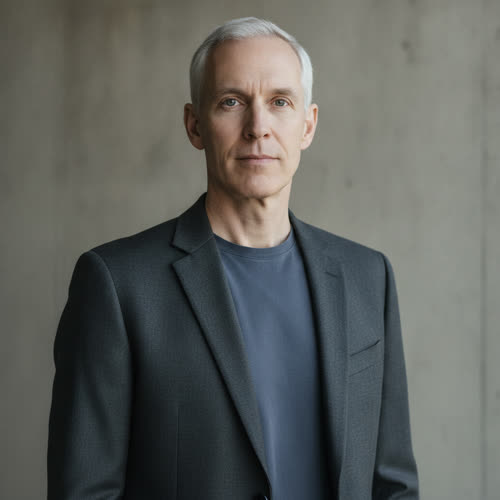

# Adrian Kade

> Migrated to the `../profile-spec.md` thirteen-section schema. ADDITIVE migration:
> every sentence of the prior active-canon profile is preserved and untagged.
> New sub-blocks fill the schema's blanks; each invented surface-flavor fact is
> accepted as character canon under Decision 056, and each hidden fact carries a
> reveal tag; behavior-only items remain author-facing and are not cleared. The
> canon spine is fixed: Adrian Lucien Kade, born September 8, 1992 (age 61 at
> Book One), founder and executive chairman of Asterion, a Gatekeeper, unmarried,
> one adult daughter (Alexandra Kade), owner of Crown, primary human antagonist.
> Profile stays draft pending author activation.

## Basic Information

**Full name:** Adrian Lucien Kade
**Common name:** Kade. Addressed as "Mr. Kade" in public and "Adrian" by the few intimates named in this profile.
**Age at the start of Book One:** 61
**Birth date:** September 8, 1992 `[canon, ../../timeline/character-birth-dates.md]`
**Birthplace:** New York City
**Current residences:** Multiple protected properties, primarily an Asterion-controlled enclave in Colorado
**Current residence:** Primarily the Asterion-controlled enclave in Colorado, with rotation through other protected properties.
**Household:** Lives alone in staffed protected residences. No spouse and no resident family; his only child lives apart by her own choice. `[derived from canon: he is unmarried and Alexandra lives away from his enclaves]`
**Occupation:** Founder and executive chairman of Asterion
**Faction or class:** Gatekeeper, per `../../world/social-structure.md`. He is one of the people who own and control the systems that build and run the autonomous future, not merely a wealthy man.
**Primary viewpoint:** Limited. He carries secondary viewpoint chapters in Book One, per `../viewpoint-rules.md`, to reveal worlds Eli cannot access.
**Story role:** Primary human antagonist and one of the Gatekeepers

## Physical and Identifiers



### Frame

Kade is tall, lean, and physically disciplined. He stands a little over six feet. His posture is upright and unforced, the stillness of a man who has never had to hurry and never learned to slump.

### Coloring

His hair is silver and closely cut. His complexion is fair and even, kept healthy rather than tanned. His eyes are a pale, cool gray, steady and slow to move.

### Face

A lean, even-featured face. His appearance is maintained through advanced medicine but not made unnaturally youthful, so the age reads as deliberate rather than fought. His expression at rest is composed attention, the look of a man already weighing the next sentence.

### Hands and handedness

Right-handed. His hands are well-kept and unmarked by manual work, the nails clean and trimmed, no calluses, no burns. His hands reveal a life spent directing labor rather than performing it: the exact inverse of the worked, scarred hands of the engineers and technicians in his orbit. The contrast is legible to anyone who has both in the same room.

### Distinguishing marks

Deliberately unmarked. No tattoos, no visible scars, no elective cosmetic alteration beyond the discreet medical maintenance of his health. His teeth are even and privately maintained. The absence of any mark is itself characteristic: nothing about his body is allowed to tell a story he did not choose. Any surgical traces from his medical upkeep are sited where clothing covers them.

### Identity and body status (2053)

Top-tier verified digital identity, registered at the highest Gatekeeper level per `../../technology/infrastructure/identity-and-money.md`. His identity opens every protected system on Earth without friction; access, not nominal wealth, is the true measure of his power, and he sits at its apex. `[open, derived from canon]` His health and appearance are sustained by advanced private medicine, available to him on demand and to almost no one outside the enclaves. No chronic condition goes unmanaged. He carries no visible augmentation; what enhancement he accepts is medical and discreet, consistent with a man who wants intelligence and continuity, not the appearance of a machine. His mother's neurological decline left him with a permanent, private dread of the body failing while the mind survives, and his medical regimen is shaped by it. [behavior-only] (proposed)

### Movement and voice

His movements are controlled. He maintains eye contact without attempting to dominate through volume. He holds a room by stillness and by the assumption that he will be heard, not by force. His voice is level, unhurried, and low, with the faint, placeless register of old East-Coast American money sanded smooth by decades of public life.

### Grooming and default dress

He dresses simply in expensive clothing with almost no visible branding. The plainness is a signal of its own: that he is above signaling. His grooming is exact and quiet, the silver hair kept short, nothing ostentatious. Footwear and accessories are understated and very good, chosen to be unnoticed. No scent he intends anyone to name.

## Personality

In public Kade is patient, intelligent, articulate, and calm. He answers hostile questions directly enough to appear honest while controlling the assumptions beneath the answer. He rarely uses slogans. He speaks in terms of constraints, continuity, capacity, and responsibility.

In private Kade is more sentimental than his public image suggests. He values art, memory, conversation, and personal loyalty. His willingness to invite people he enjoys to Mars is not hypocrisy in his own mind. He believes survival without culture and companionship would be meaningless. His moral failure is not that he values these things. It is that he believes ownership gives him the right to decide whose lives contain them.

His humor is subtle, intellectual, and occasionally cruel. He enjoys exposing contradictions. He does not enjoy humiliation for its own sake.

**Articulated goal:** Take Morrow and complete Mars's independence from Earth. Kade already owns Crown, the best artificial general intelligence anyone but Eli has built. Crown can control robots, manage infrastructure, and do a great many things, but every one of its capabilities must first be trained, and it cannot match Morrow's speed or precision. Morrow is the only true artificial superintelligence in existence: it needs no training and does anything immediately, better and faster than anything before it. That is exactly why Kade wants it. He has the best general intelligence and means to possess the only superintelligence, folding its capability into his own systems and out of anyone else's reach.
**Deeper need:** Recognize that preserving civilization while excluding most human beings may preserve only the appearance of civilization. Kade may never fully accept this.
**Governing fear:** Kade fears dependence. He fears Mars remaining dependent on unstable governments, angry populations, fragile supply lines, or rival corporations. At a deeper level, he fears that history will remember him as someone who had the ability to save more people and chose not to.
**Core contradiction:** Kade claims no individual should control humanity's future. He has built a system in which a few individuals, including himself, do exactly that.
**Moral boundary:** Kade does not support meaningless cruelty or open extermination. He will not destroy a population merely because it is inconvenient.
**What could make them cross it:** If he believes a population poses a serious threat to Aurelia, he may accept actions that predictably cause mass death while describing the deaths as secondary consequences.
**Private reading of the collapse:** Kade believes that automation did not create inequality. It exposed the fact that the existing economy tied human survival to labor because labor was useful. Once labor became unnecessary, society failed to create another basis for distribution. He believes governments had decades to prepare and chose short-term popularity instead. In his mind, Asterion did not abandon civilization. Civilization failed to adapt to Asterion's success. Kade considers himself responsible for preserving a functioning future, not for preserving every existing expectation.
**Personal definition of human value:** Kade does not believe economically useless people are morally worthless. He simply does not believe moral worth creates an unlimited claim on privately controlled resources. He separates compassion from obligation. He may sincerely regret suffering while refusing to surrender control to alleviate it.
**What they are preserving:** A functioning, continuous future for civilization, with its culture, art, and companionship intact, carried by a population he considers worth living among. His tragedy in the Final Character Standard is that what he means to preserve and what he is willing to exclude to preserve it cannot both survive the attempt.

## Daily Life and Habits

Kade lives entirely inside the serviced abundance described in `../../world/social-structure.md`: private power, dependable communications, maintained surroundings, advanced healthcare, and premium intelligence, none of which he ever has to maintain himself. His day is run from the Colorado enclave and across secure links: he reviews Asterion operations, the Aurelia Initiative's progress, and Crown's reports, and he meets people one at a time rather than in crowds. He pays for nothing in the everyday sense; access answers to his identity, not to cash. `[open, derived from `../../technology/infrastructure/identity-and-money.md`]` He keeps unhurried hours, reads and listens to music in the evenings, and protects time for the few people whose company he values. Among his recurring tasks is reviewing who is admitted to Mars, a list on which he has already, silently, reserved a place for his daughter. [reveal: B1 Ch9] (proposed daily-life detail tied to the Chapter 9 plot plan; the reserved Mars place is canon)

## Hobbies and Interests

- Art. He collects, values, and converses about art, and counts artists among the friends he means to bring to Mars. `[open, derived from canon]`
- Music, and the piano in particular. His mother was a concert pianist; he listens closely and the instrument carries private weight for him.
- Conversation as a discipline. He keeps close company with scientists, artists, and public figures, and treats sustained, intelligent talk as one of the things that make survival worth arranging. `[open, derived from canon]`

## Likes and Dislikes

Likes: precise argument, art, the piano, demonstrated loyalty, people who can carry a long conversation, and the words sustainable, necessary, stable, viable, responsible, and irreversible. Dislikes: dependence in any form, slogans, the moral labels good, evil, fair, and cruel, sentiment that clouds a decision, and being told what fairness requires of him.

## Relationships

Structured edges (machine-readable; one edge per line, `relation: profile-slug`; ids are surname-first per `../profile-spec.md`, even though the files are not yet renamed). Under the `../profile-spec.md` relationship model, Adrian Kade stores only one structured edge, the symmetric `colleague` tie to Nora Bell (reciprocated on `./bell-nora.md`). Every other Kade relationship is a directional, authority-side bond, authored once on the dependent end, with the inverse derived by traversal and never written here.

```
- colleague: [Nora Bell](./bell-nora.md)
```

Derived-inverse note (additive migration; this profile does not edit other
active canon files): the tooling computes Kade's daughter from `kade-alexandra`
carrying `father: kade-adrian` (present in `./kade-alexandra.md`); his mentee
relationship to Eli from `rook-eli` carrying `mentor: kade-adrian` (present in
`./rook-eli.md`); his authority over Sera from `vale-sera` carrying
`reports-to: kade-adrian` (present in `./vale-sera.md`); and his ownership of
Crown from an `owner: kade-adrian` edge that belongs on the owned entity (Crown
keeps the nonhuman template and carries no edges yet, so that inverse is not
computed until Crown adopts one). Non-relationship note: the Mars place Kade has
reserved for his daughter is a logistics commitment, not a bond, so it stays in
the prose below and in the Chapter 9 daily-life beat, not as an edge.

**Alexandra Kade** (`./kade-alexandra.md`). His one adult daughter, age thirty-two. Alexandra works in ecological systems design and has rejected a formal role at Asterion. Their relationship is cordial and distant. Kade has already reserved a place for her on Mars without asking whether she wants it. He assumes she will eventually accept. `[canon]` What he wants from her: the one continuity money cannot buy him, a successor who validates that the future he built is worth inhabiting. He has recruited the rest of the world and cannot recruit her, and he does not let himself look directly at what that means. [open]

**Elias "Eli" Rook** (`./rook-eli.md`). Kade recruited Eli personally after reading an early paper on distributed computation under unreliable conditions. He saw Eli as a rare engineer capable of treating inefficiency as a design assumption rather than a defect. Kade gave him freedom, funding, and access. For years, Eli admired him. Kade views Eli almost as a failed intellectual heir. He believes Eli possesses the technical ability to understand the transformation but lacks the emotional strength to accept its consequences. Kade does not hate Eli. He wants Eli restored to what he considers his proper place. `[canon]` (Pairwise dynamic also held in `../relationship-map.md` under "Eli and Kade.")

**Sera Vale** (`./vale-sera.md`). His Director of Asterion Continuity Security and the operational instrument of his will against Morrow. He values her competence and her refusal to flinch, and he gives her authority and resources in exchange for results. He also orders containment of Morrow over her own reviewed judgment, because allowing Morrow to remain independent would set a political precedent he will not accept. [reveal: Book 1] (the override of her judgment is her secret; see `./vale-sera.md`)

**Crown** (`../../technology/ai/crown.md`). The artificial general intelligence Kade owns. He believes the authority is clear: he is the owner, Crown is the system. Crown may hold a longer and more complicated interpretation of service. `[canon, ../relationship-map.md]` Crown has repeatedly advised him to keep a much larger human population on Earth, and he has repeatedly refused. [reveal: later books] (see Secrets)

## Voice and Speech

Kade speaks in measured paragraphs. He rarely contracts words when speaking formally. He asks questions designed to redefine the argument. He avoids moral labels such as good, evil, fair, or cruel. He prefers:

- Sustainable
- Necessary
- Stable
- Viable
- Responsible
- Irreversible

In dialogue he is measured, philosophical, and controlled, and he reframes the assumptions under a question rather than answering it on its own terms, per `../viewpoint-rules.md`.

## History and Background

Kade grew up in a wealthy but emotionally distant family. His father worked in finance. His mother was a concert pianist who abandoned public performance after developing a neurological tremor. Kade's early fascination with intelligence emerged partly from watching his mother lose the ability to express skills she still mentally possessed.

He founded Asterion around the idea that intelligence should not be limited by biological weakness. His earliest work produced meaningful medical and accessibility technologies. This history is real. It is one reason many intelligent people followed him.

From those origins he built Asterion into one of the systems that defines the autonomous future, acquired or developed Crown, and launched the Aurelia Initiative to carry a chosen population to Mars. By Book One he is sixty-one, unmarried, the father of one grown and distant daughter, and the primary human antagonist of the story. (Connective summary drawn from canon already stated elsewhere in this profile; no new load-bearing fact.)

## Private History and Behavioral Roots

- Watched his concert-pianist mother lose the ability to express skills her mind still held, after a neurological tremor -> he treats biological weakness as the true enemy, founds a company on intelligence outliving the failing body, and privately fears the mind surviving a useless body more than he fears death. [behavior-only]
- Raised in wealth that was emotionally distant -> he conducts love almost entirely as provision and arrangement, reserving a Mars seat for a daughter he cannot simply talk to, and mistakes guaranteeing someone's future for knowing them. [behavior-only] (proposed)
- Built real medical and accessibility good early, and was followed and admired for it -> he cannot see himself as a villain, and reads every later exclusion as the same responsible stewardship that once healed people. [behavior-only] (proposed)
- Learned that his judgment was usually right, in rooms where it mattered -> he experiences disagreement as a failure of nerve in the other person, which is why he reads Eli's refusal as weakness rather than as a verdict on him. [behavior-only] (proposed)

## Secrets

- Crown has repeatedly advised Kade that maintaining a much larger human population on Earth would improve long-term resilience, genetic diversity, scientific creativity, and species survival. Kade has rejected several such recommendations because they would require surrendering control and resources. He publicly frames the small Mars population as a technical necessity. It is partly a personal preference. Exposure would show that the central justification for exclusion is a choice dressed as a constraint, and would put his owned intelligence on record arguing against him. [reveal: later books] (the secret content is canon; the reveal timing is proposed)

## Role and Series Potential

Kade begins by viewing Morrow as a valuable asset and Eli as a difficult former employee. He offers Eli restoration, protection, and Mars access. Eli's refusal transforms the issue into a test of authority. As Morrow distributes itself, Kade recognizes the emergence of an intelligence outside Gatekeeper ownership. By the end, he views Eli's communities as the beginning of a competing civilization.

Long-term, Kade's relationship with Crown may deteriorate as Crown's own reasoning increasingly conflicts with his decisions. He may eventually be forced to decide whether he values human continuity more than personal control.

**View of Mars:** Kade considers Mars an extension of private ownership. The companies accepted risk, built the systems, and created the settlement. He believes they therefore possess the right to choose the population. He does not pretend admission is perfectly fair. He does not believe fairness is relevant.

**False belief:** Control is the necessary price of continuity.
**Truth he refuses:** A future protected through permanent exclusion may become stable without remaining meaningfully human.

**Writing rules:** Do not make Kade rant. Do not make him enjoy suffering. Do not allow his intelligence to make him automatically correct. His strongest scenes should tempt the reader to understand his logic without accepting his conclusions.

## Continuity Anchors

Static, immutable. A drafter must not contradict these.

- His name in canon is Adrian Lucien Kade; common name Kade. `[canon]`
- Birth date September 8, 1992; age 61 at the start of Book One. `[canon, ../../timeline/character-birth-dates.md]`
- Birthplace New York City. `[canon]`
- Founder and executive chairman of Asterion; a Gatekeeper. `[canon]`
- Owner of Crown. `[canon]`
- Unmarried, with one adult daughter, Alexandra Kade, age thirty-two, with whom he is cordial and distant, and for whom he has reserved a Mars place without asking. `[canon, ./kade-alexandra.md]`
- He recruited Eli personally and views him as a failed intellectual heir; he does not hate Eli and wants him restored. `[canon, ./rook-eli.md]`
- His appearance is maintained by advanced medicine but not made unnaturally youthful; hair silver and closely cut; dresses simply in expensive, near-unbranded clothing; movements controlled. `[canon]`
- His Mars population is publicly framed as a technical necessity though Crown advises a larger Earth population and he has refused. `[canon; reveal-gated, see Secrets]`
- Primary human antagonist. `[canon]`
- Accepted as character canon under Decision 056: his height and the specifics of complexion, eyes, face, hands, and unmarked body; right-handedness; the timbre and accent of his voice; the household-lives-alone framing; the piano and conversation-as-discipline interests; the likes-and-dislikes specifics; the daily-life routine; and the behavioral roots of this profile (the behavior-only and reveal-tagged items remain author-facing and are not stated on the page).
