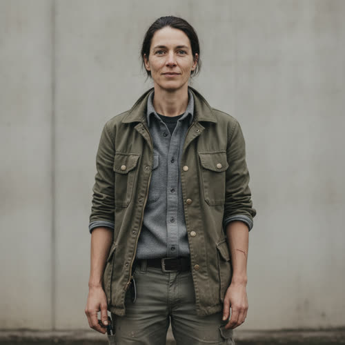

# Alexandra Kade

## Basic Information

**Full name:** Alexandra Wren Kade (given and surname `[canon]`; middle name Wren)
**Common name:** Alexandra `[canon]`. She does not use a diminutive and corrects "Alex" to "Alexandra" without heat.
**Age at the start of Book One:** 32 `[canon, character-birth-dates.md]`
**Birth date:** June 16, 2021 `[canon, character-birth-dates.md]`
**Birthplace:** A private medical suite arranged for the family, New York City
**Current residence:** A single converted property she owns outright at the working edge of a degraded region, deliberately outside any Asterion enclave, sited next to a restoration project she runs. She keeps it spare and self-supplied, the opposite of her father's serviced enclaves.
**Household:** Lives alone by choice. No spouse, no children `[canon-silent, treated as none for Book One]`. Field crew and project partners cycle through her work site, but she shares a home with no one.
**Occupation:** Ecological systems designer `[canon]`. She designs and restores living systems: closed-loop water, soil, and food cycles, constructed wetlands, bioremediation of poisoned ground, and self-sustaining ecological infrastructure for places the corporate supply chains have left (the concrete shape of the practice is proposed; "ecological systems design" and her refusal of an Asterion role are `[canon]`).
**Faction or class:** Gatekeeper by birth and by access; self-exiled by choice. Per `../../world/social-structure.md`, a Gatekeeper's family member holds Gatekeeper-tier access whether or not they want it. Alexandra holds it and declines to use it. She lives nearer to the conditions of Everyone Else than any other person in the Kade or Asterion orbit. `[open, derived from canon]`
**Primary viewpoint:** No, in Book One. She appears only through Kade's viewpoint in the Chapter 9 plot plan (`docs/30-plot/book-1/chapters/chapter-09.md`). She is a strong candidate for a later-book viewpoint, because her open Mars thread is exactly the kind of decision the series defers.
**Story role:** Thematically load-bearing offscreen character. She is the heir who refuses the empire, her father's private and unanswerable rebuke: the one person whose admission to Mars he has guaranteed, and the one person who will not say yes. She personifies the book's question of whether exclusion-as-continuity can persuade even the people it most favors.

## Physical and Identifiers




<!-- voice:start -->
_Voice (default sample):_

<audio controls src="../voices/kade-alexandra/kade-alexandra-1.mp3"></audio>

[Play voice](../voices/kade-alexandra/kade-alexandra-1.mp3)
<!-- voice:end -->
### Frame

Tall and lean, about five feet nine inches, with the flat, functional strength of someone who works on her feet and outdoors rather than in a gym. She inherited her father's height and economy of build (`./kade-adrian.md` describes Kade as tall, lean, and physically disciplined). Her posture is upright but loose, weight ready to move, nothing held for display. She takes up exactly the room she needs and no more.

### Coloring

Fair-to-olive complexion, weathered and sun-touched across the nose, the forearms, and the back of the neck from years of fieldwork rather than from leisure. Dark brown hair, thick, with the first scattered grays she does not color, worn short or pushed back out of the way and cut for function, not style. Gray eyes, level and slow to widen, that her father's people find unnervingly hard to read across a table. Her coloring is kept deliberately unspecified as to maternal lineage: her mother is a load-bearing open canonical slot, left uninvented by design (Decision 057).

**Heritage:** Paternal line white East-Coast American, through Adrian Kade. The maternal line is a deliberate, load-bearing open canonical slot, left unassigned by design and reserved as a later-book reveal (Decision 057); her fair-to-olive coloring stays consistent with either a white or a part-Mediterranean, Latina, or mixed mother.

### Face

A long, even face with strong brows and a wide, firm mouth. Her resting expression is calm attention, close to her father's controlled stillness but warmer at the eyes, the calm of someone listening rather than waiting to speak. When something genuinely pleases her the whole face opens at once, briefly and completely, then resets. People who have only seen the reset call her cold. People who have earned the open face know better.

### Hands and handedness

Right-handed. Working hands: short clean nails, ground-in calluses across the palms and the pads of the fingers, soil she can never quite scrub out of the cuticles, small old scars from wire, blades, and frost. Her hands reveal manual outdoor labor done by choice by a person who never needed to do any: the daughter of a man whose every physical need is met by machines, who has chosen work that leaves dirt under the nails. The contrast is the whole point of her.

### Distinguishing marks

A thin pale scar across the left palm from a fence wire that parted under tension on a restoration site, taken in her twenties. A faded vaccination-era scar high on the left arm, ordinary for her birth cohort. A scatter of small burn-flecks on the right forearm from soldering field sensors by hand. Sun-freckling across the shoulders that fades each winter and returns each spring. No tattoos, no elective piercings, no cosmetic work, the bare unaltered body being itself a quiet statement for her. Even, healthy teeth, fully and privately maintained, the one piece of inherited Gatekeeper access she has never bothered to refuse.

### Identity and body status (2053)

Top-tier verified digital identity, registered at the highest level a Gatekeeper's family member carries, per `../../technology/infrastructure/identity-and-money.md`. Her name alone opens any protected enclave, any clinic, any transport, any premium intelligence. She uses almost none of it. `[open, derived from canon]` She deliberately runs her daily life on the same degraded local systems her neighbors use, paying in goods, labor, and local credit where she can, and reaching for the Kade name only when a project would otherwise fail. [behavior-only] (proposed) This under-use is not poverty. It is a standing argument with her father conducted through her own body and accounts.

No augmentations and no implants, by deliberate refusal, not by economy. She regards a body as a living system to be kept in balance, not a managed one to be optimized, and elective augmentation reads to her as the same exclusion logic applied inward. [behavior-only] (proposed) No prosthetics. No chronic illness; her only standing complaints are field wear, an old wrist she taped for a season, and the seasonal toll of cold outdoor work. She could have any of it perfectly managed by Asterion-linked medicine on a word. She does not ask.

### Movement and voice

She moves with unhurried economy, the gait of someone who has walked uneven ground for a living and watches where her feet go out of habit. Her voice is low, even, and quiet, pitched to carry across a field without rising. The accent is the placeless, privately educated, faintly transatlantic register of a child raised across several private residences `[canon]`, which she has spent years deliberately roughening so she does not sound like what she is. Under that, when she is tired or moved, the polished vowels surface again, and she hears them and dislikes them.

### Grooming and default dress

Spare and functional. Default dress: hard-wearing work trousers, layered shirts and a canvas or wool field coat against weather, real boots resoled rather than replaced, a knife and a multitool that are tools and not ornaments. Nothing branded, which is the one taste she shares with her father, though for the opposite reason: his plainness signals that he is above signaling, hers signals that she has stepped out of the game entirely. Hair pushed back, hands clean but never soft, no jewelry, no scent but soil, woodsmoke, and cold air. On the rare occasions she enters an enclave she changes into plain good clothes that fit the room, wears them like a borrowed costume, and changes out the moment she leaves.

## Personality

In public, or in the few enclave rooms she still enters, Alexandra is composed, courteous, and economical, easy to mistake for her father's daughter in temperament: the same stillness, the same refusal to be rushed, the same habit of answering the real question under the asked one. In private, among her field crew and the communities she works in, she is warmer, blunter, funnier, and quick to physical work. The distance she keeps from Asterion is not coldness. It is the most expensive thing she owns.

Her humor is dry and exact, often turned on the absurdity of abundance that refuses to be shared. She is allergic to the corporate vocabulary of "sustainable" and "viable" precisely because they are her father's words (he prefers "sustainable, necessary, stable, viable, responsible, irreversible," per `./kade-adrian.md`), and she has watched him use them to mean the opposite of what an ecologist means by them. She will not say "sustainable" out loud anymore. The word has been spoiled for her.

**Articulated goal:** Build living systems that let a place feed, water, and sustain itself without permission from anyone, including her father.
**Deeper need:** To prove, mostly to herself, that her refusal of the Kade future is a life and not just a long sulk; that she is for something, not only against him.
**Governing fear:** That she is fooling herself. That the access she will not use is the only reason her projects survive at all, and that she is a tourist in the abandonment her neighbors cannot leave. [behavior-only] (proposed)
**Core contradiction:** She rejects her father's world and lives on the safety net of his name. She can walk out of any hardship she designs her life around, and her neighbors cannot, and she knows it.
**Moral boundary:** She will not let her father's resources or her father's name be used to choose who among the people she works with lives and who is left, and she will not turn her own work into another gate.
**What could make them cross it:** A disaster at a project she loves that only Asterion capacity could stop, forcing her to spend the name and the access at scale, and to accept that her clean refusal was always a luxury her neighbors paid for.
**Private reading of the collapse:** Nothing collapsed. It was designed. The withdrawal was a sequence of ownership decisions dressed as weather, and a system that can be designed to exclude can be designed to include; her father simply chose. An ecosystem has no unnecessary species. A civilization that invents the category "unnecessary people" has revealed something about its designers, not about the people.
**Personal definition of human value:** Worth is not earned and not assigned. In a living system nothing carries a value that has to be justified to keep its place. People are not different.
**What they are preserving:** The principle that a living system makes room for what is not useful, that abundance unshared is just hoarding with better manners, and that the measure of a future is whom it leaves out. (Her entry in the Final Character Standard.)

## Daily Life and Habits

She wakes early at the work site and walks the project before she does anything else, reading the water lines, the soil moisture, the new growth, the failures overnight, the way her grandfather's generation would have read a barometer. She works with her hands most of the day: planting, grading, plumbing closed-loop water, calibrating cheap field sensors she solders herself because the supported instruments need a server that no longer answers. [open, world-consistent per `../../technology/infrastructure/identity-and-money.md`]

For money and goods she lives mostly inside the everyday economy described in `../../world/social-structure.md`: she trades design and labor for housing, food, and help, keeps accounts on the same local credit and barter her neighbors use, and eats simply from what the project and the nearby growers produce. The exception is sharp and deliberate: when a project needs material that only a corporate supply chain or Gatekeeper access can deliver, she spends the Kade name, hates doing it, logs it privately, and treats each instance as a small defeat. [behavior-only] (proposed)

She sleeps hard and short. She does not commute; her home and her work are the same ground. Once or twice a season a message arrives from her father's office about her reserved place on Mars, or a formal invitation to an enclave, and she lets it sit unanswered for days before deciding whether it deserves a reply. [open behavior; tied to the Chapter 9 plot beat in `docs/30-plot/book-1/chapters/chapter-09.md`, where she ignores exactly such a message] [reveal: B1 Ch9]

## Hobbies and Interests

- Seed and soil. She keeps a personal collection of open-pollinated seed she has gathered and saved by hand, ownerless by design, the botanical version of a system that needs no permission to run.
- Field naturalism. She tracks the return of insects, birds, and soil life to ground she has restored, keeping handwritten logs, and counts a restored species as the only score she respects.
- Reading the old ecologists. She reads pre-collapse ecology and systems theory closely, the literature of how living wholes hold together, and argues with it in the margins.

## Likes and Dislikes

Likes: the smell of turned wet soil, cold morning air, the first green on dead ground, work that leaves something alive behind, blunt people, hand tools that outlive their makers, a meal grown within sight of the table, rain that arrives when the system needs it. Dislikes: the word "sustainable" in a corporate mouth, serviced comfort she has not worked for, the soft hum of an enclave that never has to maintain itself, being introduced as Adrian Kade's daughter, the phrase "operational value," and any sentence that sorts people into worth the cost and not.

## Relationships

Structured edges (machine-readable; one edge per line, `relation: profile-slug`):

```
- father: [Adrian Kade](./kade-adrian.md)
```

Derived-inverse note for the migration pass (this profile does not edit active
canon): `father` is directional and is stored only here, on the dependent end,
so `./kade-adrian.md` carries no `daughter` edge; the tooling derives Adrian's
daughter relationship from this `father` edge by traversal. Adrian's profile
states the daughter relationship in prose, which is preserved. Non-relationship
note: the Mars place Adrian reserved for Alexandra is a logistics commitment,
not a bond, so it stays in the prose below (and in his Chapter 9 daily-life
beat), not as an edge.

**Adrian Kade** (`./kade-adrian.md`). Her father. The relationship is cordial and distant, exactly as his profile states. `[canon]` He recruited the rest of the world; he could not recruit her. He has reserved a place for her on Mars without asking and assumes she will eventually accept. `[canon]` She has not accepted and has not finally refused. What he wants from her: the one continuity that money cannot buy him, a successor who validates that the future he built is worth inhabiting. What she wants from him: to be released from the assumption that she will come, and, underneath that, the much older thing she will not name, his actual attention paid to who she is rather than to the seat he is keeping warm. The bond is love conducted entirely as avoidance. They are not estranged. They are worse than estranged: fond, polite, and forever talking past each other. [open]

**Her mother** (OPEN CANONICAL SLOT, not invented). Canon establishes only that Kade's relationship with Alexandra's mother ended several years after 2021 and that Alexandra was then raised across several private residences while spending significant time with her father. `[canon, ../../timeline/historical/2026-2034-assistance-and-compression.md]` The mother's name, lineage, whereabouts, and current relationship to Alexandra are undefined and are deliberately left blank rather than invented. Ratified as a load-bearing open slot in Decision 057: it is reserved as a later-book reveal and is not to be filled in earlier work. Who raised her and where her mother stands shape her ecology and her refusal both, and that question is held open on purpose.

## Voice and Speech

Low, even, economical, with her father's habit of answering the question beneath the question, but turned to the opposite ends. Short declarative sentences when she is working; longer, precise, faintly academic ones when she is explaining a system, the cadence of someone who reads closely. She avoids moral labels in argument the way her father does, then lands one flat sentence that is unmistakably a verdict. Verbal tic: she will not say "sustainable," and substitutes "it can keep itself" or "it stands on its own." [open] Under stress she gets quieter and more clipped, and the polished privately-educated vowels she has spent years sanding off come back, which is the tell that she is rattled. When she is with her father she speaks less than she wants to, and regrets both the saying and the not-saying afterward.

## History and Background

Born June 16, 2021, into the Kade family at the height of its ascent. `[canon]` Her parents' relationship ended several years into her childhood, and she was raised across several private residences, moving between them, spending significant time with her father. `[canon, ../../timeline/historical/2026-2034-assistance-and-compression.md]` She grew up inside the exact comfort the rest of the world was losing, a serviced childhood in which nothing ever had to be maintained because someone, somewhere, was always being paid to prevent it from failing.

She turned away from it young. Where her father saw intelligence as the thing that should outlive the weak body, she came to see the living world as the model her father's systems had forgotten: that a healthy system carries the redundant, the slow, and the apparently useless, and is stronger for it. She trained and built a career in ecological systems design and made it a working life rather than a hobby of conscience, restoring poisoned and abandoned ground and building systems that let places sustain themselves without corporate supply. `[canon for the field and the rejection; the career particulars proposed]` She was offered a formal role at Asterion and rejected it. `[canon]` By Book One she lives apart from her father's enclaves, keeps her access in reserve and her distance deliberate, and lets his messages about Mars sit unanswered.

## Private History and Behavioral Roots

- Raised in a serviced childhood where every failure was invisibly prevented by paid labor -> as an adult she compulsively does the maintenance herself, distrusts any comfort she has not personally kept running, and reads an effortless system as a hidden dependency. [behavior-only] (proposed)
- Watched her father use the language of stewardship ("sustainable," "responsible") to justify deciding who is kept -> she cannot say those words without irony and has built her own vocabulary to replace them. [behavior-only] (proposed)
- Spent significant time with her father across several residences but rarely his actual attention -> she keeps her own open face in reserve, hard to read, and gives full warmth only where it is earned, which the enclave world misreads as her father's coldness. [behavior-only] (proposed)
- Holds Gatekeeper access she refuses to use on principle, and has quietly used it anyway to save a failing project -> she logs each use privately and treats it as a defeat, and the gap between the refusal she performs and the access she keeps is the wound she will not look at directly. [behavior-only] (proposed)
- Learned the model of inclusion from ecosystems, not from people -> she argues for human worth in the language of systems and biodiversity, which can read as cold even when the conviction under it is the warmest thing about her. [behavior-only] (proposed)

## Secrets

- She has quietly used the Kade name and Asterion-tier access to keep specific restoration projects from collapsing, while publicly and to her father refusing any part of his world. Exposure would hand her father proof that her independence runs on his resources, and would shame her in front of the communities who believe she stands outside the gate with them. [reveal: Book 2] (proposed)
- Her ecological systems are designed, increasingly and not entirely by accident, to let abandoned communities feed and sustain themselves without corporate support: biologically, the same outcome Asterion fears Morrow could enable technically. She has not framed it to herself as defiance, and has not connected it to her father's fear, but the convergence is real and is the most dangerous thing she does. Exposure, especially to Asterion security, would reclassify her from harmless heiress to a threat to the model. The thematic parallel itself, that her restoration work lets abandoned communities survive without the corporation, the biological mirror of Morrow, is canon characterization; the convergence with Morrow and any plot it drives is a Book-2 SEED and proposed direction, not a locked plot pillar. [reveal: Book 2] (Book-2 seed; proposed direction, not locked) (consistent with the core premise; does NOT grant Morrow or any system an unestablished capability, and is kept biological and small-scale)
- She has not decided about Mars, and lets everyone, including her father, read her silence as eventual yes. The truth of her position is reserved by canon for later books and is deliberately not stated here. What she hides now is only that the silence is not assent; it is an unmade decision she is avoiding. [reveal: later books] (proposed framing of an open canon thread; her actual choice is NOT invented or leaked)

## Role and Series Potential

In Book One her function is largely offscreen and entirely structural. She exists in the reader's view through one Kade-viewpoint beat (the Chapter 9 plot plan), in which her father reviews proposed Mars residents, keeps a place for a daughter he has not asked, and notes that she ignores his message about it. She is the quiet proof inside Kade's own chest that exclusion-as-continuity does not even persuade the person he most wants to bring: the heir who will not inherit. She sharpens the book's central question, who do the powerful believe humanity includes, by being the one inclusion Kade cannot secure.

Book One arc, minimal and offscreen: she remains the unanswered message, the deferral that needles Kade between his larger moves. Long-term series potential is large. She is a natural later-book viewpoint and a natural bridge between the Gatekeeper world and Everyone Else, the one person with standing in both. Her ecological work is a slow biological rhyme to Morrow's technical one, and the two could converge. Her open Mars decision is a loaded gun the series has deliberately left on the table. False belief, if promoted: that her clean refusal is itself a sufficient moral life, that stepping out of the gate is the same as dismantling it. Truth she would learn: that refusing the inheritance and using its safety net are the same act until she spends the name where it can be taken from her, and that her father's rebuttal to her whole life is the access she keeps in reserve.

Writing rules: do not let her become a simple virtuous foil; her hands are clean only because his money pays for the soap. Do not resolve the Mars question on the page in Book One; her silence is the point and the reveal is reserved. Do not invent her mother to fill the gap; the open slot is load-bearing. Do not let her ecological convictions read as sentimental; she argues from systems, not from feeling, and is the more unsettling for it. Keep her and her father fond, never shouting; their tragedy is courtesy, not war.

## Continuity Anchors

Static, immutable. A drafter must not contradict these.

- Her name in canon is Alexandra Kade. She is Adrian Kade's daughter. `[canon, ./kade-adrian.md]`
- Birth date June 16, 2021; age 32 at the start of Book One. `[canon, ../../timeline/character-birth-dates.md]`
- She works in ecological systems design. `[canon]`
- She has rejected a formal role at Asterion. `[canon]`
- Her relationship with her father is cordial and distant. `[canon]`
- Her father has reserved a place for her on Mars without asking, and assumes she will eventually accept; she has not accepted. `[canon]`
- She was raised across several private residences and spent significant time with her father; her parents' relationship ended several years after her 2021 birth. `[canon, ../../timeline/historical/2026-2034-assistance-and-compression.md]`
- Her ultimate position on Mars is OPEN and reserved by canon for later books. It is not established here and must not be leaked in earlier chapter work. `[reveal: later books]`
- Her mother is UNDEFINED in canon and is a deliberate, load-bearing open slot (Decision 057): reserved for a later-book reveal, not to be invented or filled in earlier work.
- Accepted as character canon under Decision 056: the middle name Wren; birthplace New York City; current residence and the converted off-enclave property; living alone; all physical identifiers in Section 2; the concrete shape of her ecological practice; the deliberate under-use of her access; and the behavioral roots of this profile (the behavior-only items, the Book-2 seed on the Morrow parallel, the Mars decision, and the mother slot all remain author-facing or open and are not stated on the page).
