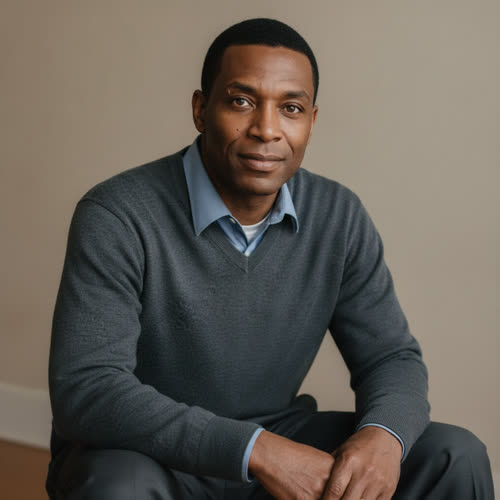

# Jonah Mercer

## Basic Information

**Full name:** Jonah Alexander Mercer
**Common name:** Jonah. His parents call him by his first name; his children call him Dad; Eli has called him by his surname since they were boys.
**Age at the start of Book One:** 39
**Birth date:** January 17, 2014 (per `../../timeline/character-birth-dates.md`)
**Birthplace:** Flint, Michigan
**Current residence:** The Jonah-and-Celeste Mercer home in Lakeward, the protected enclave north of Detroit, a separate household a short walk from his parents' home.
**Household:** Lives with his wife **Celeste Mercer** (`./mercer-celeste.md`), their son **Julian** (`./mercer-julian.md`), and their daughter **Amelia** (`./mercer-amelia.md`). His parents, **Malcolm** (`./mercer-malcolm.md`) and **Elaine** (`./mercer-elaine.md`), keep a separate accessible home a short walk along the same maintained Lakeward street.
**Occupation:** Political and corporate relationship manager.
**Faction or class:** Protected Wealthy, Lakeward, per `../../world/social-structure.md`. He holds the position through the family fortune his father built, not through wealth of his own.
**Primary viewpoint:** Yes.
**Story role:** Eli's oldest friend, social bridge, and unintended betrayer.

## Physical and Identifiers



### Frame

Jonah is six feet tall with a broad, well-maintained build. He carries the build deliberately: shoulders squared, weight even, the posture of a man who has learned that a room reads a body before it hears a word. He is heavier than Eli and softer than his father once was, kept trim by the easy fitness of protected life rather than by labor.

### Coloring

He has warm brown skin, the family coloring his children inherit, close-cropped black hair kept barbered and current, and warm brown eyes. (hair, eyes, and the trustworthy face are established) His coloring reads health and upkeep, the surface of a man whose systems all still work.

### Face

Jonah has a face people tend to trust quickly. It is open, even-featured, and quick to warmth, the kind of face that makes a stranger feel already known. His expression at rest is attentive and faintly pleased, an alert readiness to be of use. When he is genuinely frightened the warmth stays on the face by habit and only leaves the eyes, which is how Celeste reads him. [behavior-only] (proposed)

### Hands and handedness

Right-handed. Soft, well-kept hands, manicured without flash, the hands of a man whose work is conversation and not repair. A faint indentation on the right middle finger from a pen, and a wedding band he never removes. His hands reveal a life spent in rooms where nothing needs lifting, the exact inverse of Eli's scarred ones.

### Distinguishing marks

A small pale scar through his right eyebrow from a childhood fall in Flint, the one mark on him that predates the money. Otherwise unmarked: no tattoos, no piercings, expensive and immaculate dental work. The absence of marks is itself a class signature, a body that has never been made to bleed for anything. [behavior-only] (proposed)

### Identity and body status (2053)

Fully and premium registered, per `../../technology/infrastructure/identity-and-money.md`. Jonah's verified digital identity is the unremarkable, frictionless kind that authenticates his Lakeward residence, his enclave permissions, and the access that is the actual substance of his career. [open] He has no augmentations and no implants; he does not need them, and in his world choosing them would read as anxiety. He is healthy, with no chronic conditions, and has never in his life waited for care or heard the word authorization applied to himself, a fact he is only now beginning to understand as fragile through his father's decline. [behavior-only] (proposed)

### Movement and voice

He moves easily and inclusively, turning his whole body toward whoever is speaking, touching a forearm to land a point. [behavior-only] (proposed) His voice is warm, fluid, and unhurried, a pleasant mid-baritone built for the long dinner and the quiet aside. Underneath the polish is a flat Michigan vowel from Flint that surfaces only when he is truly angry or truly tired.

### Grooming and default dress

He dresses carefully without appearing ostentatious. His clothing is current, repaired professionally, and selected to communicate competence rather than extreme wealth. (established) Default dress: a well-cut soft-collar shirt, fine knitwear, dark trousers, good quiet shoes, no visible branding, the restraint that signals he need not advertise. He is clean-shaven and barbered, scent of a discreet cedar-and-citrus soap. The whole presentation is a tool, and he knows it: Jonah understands how he appears to others and uses that awareness instinctively. (established)

## Personality

In public Jonah is charming, reassuring, articulate, and attentive. He remembers names, spouses, children, personal preferences, and old favors. He makes people feel that their concerns have been understood even when he cannot solve them. He dislikes direct confrontation and reframes disagreements as practical problems. (established)

In private Jonah is more frightened than he appears. He experiences status as physical safety. Losing access does not mean embarrassment to him. It means losing medicine, security, education, and a future for his children. He loves Eli but sometimes resents Eli's ability to reject systems Jonah feels obligated to navigate. Jonah believes Eli's morality is partially subsidized by people like him, who continue negotiating with the powerful. (established)

His humor is social. He tells stories, imitates people lightly, and uses humor to lower tension. His humor becomes more frequent when he is frightened. (established)

**Articulated goal:** Secure permanent protection and Mars passage for his family. (established external goal)
**Deeper need:** Accept that proximity to power does not equal influence over it. He must learn that preserving his family cannot justify turning every person and relationship into leverage. (established internal need)
**Governing fear:** Watching his children move from protected life into the abandoned world. He also fears Eli looking at him and seeing only a coward. (established)
**Core contradiction:** He genuinely loves people but repeatedly converts relationships into transactions when he feels threatened. (established)
**Moral boundary:** He believes he would never knowingly cause Eli's death or deliberately condemn a community. (established)
**What could make them cross it:** If forced to choose between strangers and his children, Jonah will choose his children. He will then spend enormous emotional energy explaining why the choice was unavoidable. (established)
**Private reading of the collapse:** Nothing collapsed; the rules simply got quieter and more selective, and the only sane response is to stay inside the rooms where the rules are still being written. He does not believe the withdrawal was evil. He believes it was a sorting, and that a good father gets his family onto the right side of it and does not waste himself grieving the sort. [behavior-only] (proposed)
**Personal definition of human value:** A person is worth the relationships they can hold and the favors they can keep alive. He measures value in trust and access, which is exactly the currency Crown is making obsolete, and the dread that this definition no longer protects anyone is the dread he will not look at.
**What they are preserving:** The faith that human warmth, memory, and decency still buy a place in the room. He is preserving the dignity of the middleman against a world that has automated the middle away. (His entry in the Final Character Standard.)

## Daily Life and Habits

Jonah's work is his day, and the day is built of rooms full of people. He attends private dinners, settlement briefings, charity events, contract negotiations, and political meetings. (established) He arranges agreements between protected enclaves, corporations, and weakened government institutions; his work depends on trust, discretion, memory, and personal relationships. He is useful because powerful people still prefer certain conversations to occur through a human being who understands implication and embarrassment. (established) He survives by making himself personally pleasant and socially necessary, because he knows Crown could perform much of his job. (established)

For money and goods he is fully inside the protected economy, not the barter world outside the walls: he is paid in retainer, access, and standing rather than in eggs or labor, and his Lakeward life has the reliable power, current systems, delivered food, and gated security described in `../../world/protected-enclaves.md`. [open] He commutes between enclaves and meeting rooms by arranged transport, eats well and often as a function of work, and sleeps poorly the night before anything is at stake. Where everyone outside the walls spends the day keeping aging machines alive, Jonah spends it keeping relationships alive, which is the same maintenance labor performed on people. [behavior-only] (proposed)

## Hobbies and Interests

- Wine and the long table. He takes real, unforced pleasure in food, wine, and the architecture of a good evening, and he is genuinely good at making strangers comfortable, a craft he practices for its own sake and not only for work.
- People as a study. He collects names, histories, and connections the way another man collects stamps; he reads memoirs and political biography to understand how rooms actually decide things.
- His children's worlds. He follows Julian's tinkering and Amelia's small menagerie with a parent's deliberate attention, and these are among the few interests he holds that have nothing to do with leverage.

## Likes and Dislikes

Likes: a long dinner that goes well, a name remembered back to him, being trusted, his wife's directness even when it stings, the specific relief of a tense conversation defused, his father in a good morning hour, his children asleep and safe. Dislikes: open confrontation, being made to wait outside a room, the cold synthetic competence of Crown doing a human's job, the silence after he asks a powerful person for something, and the particular look Eli gives him when Jonah has just been reasonable about something that should have made him angry.

## Relationships

Structured edges (machine-readable; one edge per line, `relation: id`, ids per the spine's `lastname-firstname` convention):

```
- spouse: [Celeste Mercer](./mercer-celeste.md)
- father: [Malcolm Mercer](./mercer-malcolm.md)
- mother: [Elaine Mercer](./mercer-elaine.md)
- friend: [Eli Rook](./rook-eli.md)
```

Reciprocity note: the `mercer-malcolm`, `mercer-elaine`, `mercer-julian`, and
`mercer-amelia` halves are authored in `./mercer-malcolm.md`,
`./mercer-elaine.md`, `./mercer-julian.md`, and `./mercer-amelia.md` and
reconcile with the edges above (their `son: mercer-jonah`, `father: mercer-jonah`
ladders). The `mercer-celeste` half is reciprocated in `./mercer-celeste.md`.
The `rook-eli` half is canon friendship; `./rook-eli.md` carries the prose but
does not yet hold structured edges and gains its `friend: mercer-jonah` half on
its own later migration. Edge ids use `lastname-firstname` though the files are
not yet renamed.

**Celeste Mercer** (`./mercer-celeste.md`), wife. Celeste understands the Mercer family's position more clearly than Jonah does. She does not trust Asterion's vague promises. She believes Jonah confuses being invited into private rooms with being respected by the people inside them. Their marriage is loving but strained by Jonah's refusal to admit how little control he possesses. Celeste is not initially aware that Jonah exposes Morrow; when she learns the truth, her response is anger rather than gratitude. (established) What he wants from her: that she stop reading his striving as weakness and trust that he can still buy them safety. What she wants from him: that he build a future they can control instead of chasing an invitation.

**Malcolm Mercer** (`./mercer-malcolm.md`), father. Jonah's father, Malcolm Mercer, also lives in Lakeward and suffers from a progressive neurological condition managed by expensive Asterion-linked medical systems. (established) Jonah's desire to reach Mars is not abstract: he believes Mars may be the only place where his father's treatment can continue indefinitely. (established) Beneath that is an older ache, the son who became liked by powerful people rather than a man who built something, seeking an approval his father can no longer simply give. [behavior-only] (proposed) What he wants from Malcolm: the reassurance that the Mars promise is real and that he has done enough. What Malcolm wants from him: to secure the grandchildren without becoming a man who is only ever pleasant. (See `./mercer-malcolm.md`.)

**Elaine Mercer** (`./mercer-elaine.md`), mother. His mother, Elaine Mercer, worked in healthcare administration. (established) She reads Jonah's fear more clearly than he would like, because she gave him half of it, and her gentle reassurance is something he leans on even as he half-knows she doubts it. [behavior-only] (proposed) What he wants from her: to be told he is doing enough for his father. What she wants from him: that he build something the family can actually control. (See `./mercer-elaine.md`.)

**Julian Mercer** (`./mercer-julian.md`), son, age twelve. (established) Julian is one of the two human stakes under Jonah's central fear. Jonah wants the boy to stay a happy, protected child a little longer, and Julian is exactly the age where he is starting to refuse to. [behavior-only] (proposed) What Jonah wants: that Julian never have to know the world Jonah is afraid of. What Julian wants: a straight answer, just once, instead of being handled. (See `./mercer-julian.md`.)

**Amelia Mercer** (`./mercer-amelia.md`), daughter, age eight. (established) Amelia is the youngest and purest version of the thing Jonah is fighting to preserve, too young to see the fear in him. [open] What Jonah wants: that she never have to know there was anything to be afraid of. What Amelia wants: his attention and his play. (See `./mercer-amelia.md`.)

**Eli Rook** (`./rook-eli.md`), oldest friend. Jonah grew up near Eli and views their friendship as one of the few relationships in his life that existed before status and access became important. (established) Jonah was never as technically gifted as Eli, but he was skilled at reading people, managing conflict, and understanding social hierarchies; he often protected Eli socially during childhood, and Eli often protected Jonah academically. (established) The friendship is also the wound at the center of his arc: it is Jonah's exposure of Morrow that leads Kade to Eli. What Jonah wants from Eli: to be seen as more than a coward, and to bring his friend inside the only safety Jonah believes in. What Eli wants from Jonah: honesty about the cost of the rooms Jonah keeps walking into. (See `./rook-eli.md`.)

Structural and thematic links (no reciprocal family edge required):

- Adrian Kade (`./kade-adrian.md`). Jonah works the world Kade owns. A private Asterion contact is the channel through which Jonah's exposure of Morrow reaches Kade, and Kade uses that contact to locate Eli. Jonah believes he is negotiating with the system; the system is using him. (established arc; no personal bond, no reciprocal edge required.)

## Voice and Speech

Jonah speaks fluidly and often uses people's names. He softens statements. He says things such as: (established)

- "Let's be realistic."
- "There may be another way to approach this."
- "Nobody is asking you to surrender."
- "I'm trying to keep options open."

When truly angry, his politeness disappears and his speech becomes direct. (established) Under that anger the Flint vowel returns. [behavior-only] (proposed) His default register is warm, inclusive, and a half-step softer than the truth; he reframes rather than refuses, and he buys time with grace. He uses humor to lower the temperature of a room and reaches for it most when he is most afraid. (established humor pattern)

## History and Background

Jonah grew up in Flint, Michigan, near Eli, and the two met as boys. (established; born Flint per `../../timeline/character-birth-dates.md`) His mother, Elaine Mercer, worked in healthcare administration. His father, Malcolm Mercer, built a logistics business and later became wealthy through early investments in autonomous transportation and Asterion. (established) Jonah was never as technically gifted as Eli, but he was skilled at reading people, managing conflict, and understanding social hierarchies. He often protected Eli socially during childhood; Eli often protected Jonah academically. Their friendship survived the widening difference in class until adulthood made it impossible to ignore. (established, reconciled with `./rook-eli.md`)

Malcolm's fortune moved the family up and out, into the protected life Jonah's children were born into. Jonah did not inherit his father's gift for building systems; he found his own gift in people, and he built a career as the human intermediary that powerful institutions still occasionally prefer to a machine. He married Celeste, a former architect, and they raised Julian and Amelia inside Lakeward. (established marriage and children) By Book One his father is years into a neurological decline kept at bay by Asterion-linked machines, and the question of Mars has stopped being abstract for him and become a race against that decline. (established)

## Private History and Behavioral Roots

- Grew up the less gifted of two friends, protected socially by being liked -> converts every relationship into goodwill he can draw on later, and panics when liking is not enough. [behavior-only]
- Watched his father's fortune lift the family out of a declining Flint -> equates access with survival at a level below argument, so that losing a room feels to him like losing air. [behavior-only] (proposed)
- Has a father whose treatment depends on Asterion's continued goodwill -> cannot hear a refusal from the powerful as final, and will negotiate past the point of dignity because stopping feels like signing his father's death. [behavior-only] (proposed)
- Was warned privately that the Mars promise is thinner than advertised and told no one -> overperforms optimism to his family while privately desperate, and reaches for any new leverage with an urgency he disguises as opportunity. [behavior-only] (ties to his Secret)
- Knows Crown could do his job -> works harder at being personally charming the more obsolete he feels, and reads the cold competence of automation as a personal threat. [behavior-only] (proposed)

## Secrets

- Before discovering Morrow, Jonah already knew that the Mercer family's Mars expectations were uncertain. A private Asterion contact had warned him that later migration waves would be smaller than publicly implied. Jonah did not tell Celeste or his father. When he sees Morrow, he is not merely optimistic; he is desperate. (established secret) From Celeste and Malcolm; cost of exposure is his wife's trust and his father's last illusion. [reveal: Book 1]
- The exposure of Morrow is Jonah's own act, taken expecting negotiation, and it is what leads Kade to Eli. He carries the dawning private knowledge that he was never part of the decision-making process he thought he had entered. (established arc, held as a secret in the early chapters) From Eli and the community until the climax; cost is the friendship and the lives in the containment operation. [reveal: Book 1]

## Role and Series Potential

In Book One, Jonah is the social bridge whose love becomes the mechanism of betrayal. He discovers Morrow and sees a path to permanent security. He exposes limited performance data to Asterion, expecting negotiation. Kade uses Jonah's contact to locate Eli. Jonah initially believes he can mediate. As pressure increases, he realizes he was never part of the decision-making process. By the climax, Jonah must choose between Lakeward access and helping Eli's community survive the containment operation. He chooses to help. This does not erase his betrayal. (established arc)

His larger arc: Jonah may become a negotiator between ordinary communities, excluded wealthy factions, and the people preparing to leave Earth. His greatest future danger is becoming so skilled at compromise that he helps normalize another unjust system. (established long-term arc)

**False belief:** Enough money, usefulness, and loyalty will eventually make the Gatekeepers honor their implied promises. (established)
**Truth he must learn:** The system he serves preserves ambiguity because ambiguity keeps people obedient. No amount of successful negotiation can make him equal to people who control the terms. (established)

Writing rules: do not make Jonah secretly malicious. Do not excuse his betrayal merely because he loves his family. Do not make him foolish. His mistake comes from understanding social power well but misunderstanding the limits of his own place within it. (established)

## Continuity Anchors

Static, immutable. A drafter must not contradict these.

- Full name Jonah Alexander Mercer. Surname Mercer. (established)
- Age 39 at the start of Book One; born January 17, 2014, in Flint, Michigan. (established; birth date per `../../timeline/character-birth-dates.md`)
- He is married to Celeste Mercer; their children are Julian (age 12) and Amelia (age 8). (established)
- His father is Malcolm Mercer; his mother is Elaine Mercer. Malcolm lives in Lakeward and suffers a progressive neurological condition managed by expensive Asterion-linked medical systems. (established)
- He is Eli Rook's oldest friend; they met as boys near Flint, Jonah protecting Eli socially and Eli protecting Jonah academically. (established)
- He works as a political and corporate relationship manager and lives in Lakeward. He is a viewpoint character. (established)
- Jonah exposes Morrow, expecting negotiation; Kade uses Jonah's Asterion contact to locate Eli; at the climax Jonah chooses to help, which does not erase the betrayal. (established arc)
- Accepted as character canon under Decision 056: all physical identifiers (frame detail, hands, the eyebrow scar, body status); the separate-household geography on the Malcolm street; the interior personality fields (Private reading of the collapse, Personal definition of human value, What they are preserving); the Hobbies and Likes and Dislikes; and the behavioral roots of this profile (the behavior-only and reveal-tagged items remain author-facing and are not stated on the page).
