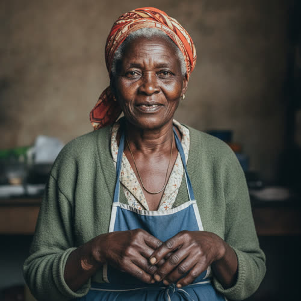

# Amara Okafor

## Basic Information

**Full name:** Amara Okafor [canon] (`./okafor-lena.md`: "her mother, Amara Okafor, age seventy-four"). Full given form Amarachi Okafor.
**Common name:** Amara [canon]. Called "Mama" by Lena and "Mama Amara" by the younger relatives in the household.
**Age at the start of Book One:** 74 [canon] (`./okafor-lena.md`).
**Birth date:** February 9, 1979 (not in `../../timeline/character-birth-dates.md`; invented to land age 74 on Day 1, October 3, 2053, and tagged for the spine. The spine fixes the year as approximately 1979.)
**Birthplace:** Onitsha, Anambra State, Nigeria. Emigrated to Detroit as a young woman.
**Current residence:** The Okafor household near Eli's neighborhood, Greater Detroit, the same home Lena lives in [canon that they share one home] (`./okafor-lena.md`; the neighborhood placement follows Lena's "near Eli's neighborhood").
**Household:** One household with her daughter Lena and several supported relatives [canon] (`./okafor-lena.md`: "Lena lives with her mother, Amara Okafor... and helps support several relatives"). The household includes two younger dependent relatives, Amara's grandchildren through a second, absent child.
**Occupation:** Retired grocer [canon that she ran a grocery; retirement is the obvious present state] (`./okafor-lena.md`: "Her parents operated a small grocery store"). In 2053 she keeps the household: cooking, the kitchen garden, the family ledger, and the care of the younger relatives.
**Faction or class:** Everyone Else, per `../../world/social-structure.md` [canon by inheritance] (the Okafor household is plainly outside the protected systems; Lena runs an unsupported clinic and refused an enclave place).
**Primary viewpoint:** No. Amara is never a point-of-view character.
**Story role:** Supporting. She is the reason Lena's refusals are concrete rather than abstract: the living elder whose care under a withdrawn healthcare system is the daily stake behind Lena's politics, and the keeper of the family's grocery-counter memory. She is the human cost line under the enclave offer Lena turned down.

## Physical and Identifiers



### Frame

Five feet two inches, small and compact, with the thickened waist and softened shoulders of a woman who stood behind a counter and over a stove for fifty years. Once visibly strong in the forearms; the strength has receded but the habit of it has not, so she still reaches and lifts as if she expects to be able to. She has lost perhaps an inch of height to her spine. Her posture is upright by deliberate effort and stooped the moment she forgets to hold it.

### Coloring

Deep brown complexion, the skin at her hands and face finely lined, dry and ashen in the cold months of the unheated rooms. Hair fully gray-white, coarse and thick, kept very short and natural under a head wrap she ties fresh each morning, the wrap usually a faded wax-print cloth she has owned for decades. Dark brown eyes, the whites slightly yellowed with age, the left clouding at the edge with an early cataract she has not had touched because the clinic that would touch it no longer exists in any form she could reach.

### Face

A round, broad face, deeply lined at the brow and around the mouth, with high full cheeks that lift when she is amused. Notable features: a strong jaw, a wide flat nose, a small dark mole high on the left cheek. Expression at rest is watchful and a little severe, the face of a woman who priced stock by reading a customer's coat. The severity breaks completely and suddenly when she laughs, which she does loudly and without warning.

### Hands and handedness

Right-handed. Old grocer's-and-cook's hands: broad palms, blunt thickened fingers, knuckles swollen and stiff with arthritis, the nails ridged and kept short. A permanent shine of old burn-callus along the right palm edge from decades of pots and hot oil. Her hands shake very slightly now when she holds them still, steady again the instant they have a task. The hands reveal the work of two trades, the counter and the kitchen, and they reveal age: she can still bone a fish or count coins faster than anyone in the house, but she can no longer open a jar, and the small surrender of handing the jar to a grandchild is the thing about her own body she likes least.

### Distinguishing marks

A long pale burn scar across the inside of the right wrist from a fryer in the back of the Detroit store, c. 1990s. A thin vertical tribal-style mark, faint with age, at each temple, given in early childhood in Onitsha before the family stopped the practice. A flattened, healed-crooked little finger on the left hand, broken once unloading a delivery and set by hand because the day could not spare a doctor. A gold wedding band worn thin, kept on a cord around her neck rather than the swollen finger it no longer fits. Dental: two missing lower molars, never replaced, from the long stretch when dentistry left the district.

### Identity and body status (2053)

Legally registered, practically stranded, per `../../technology/infrastructure/identity-and-money.md`. Her verified digital identity survives on record from the years the grocery was a real business with a real bank link, but that link went silent the way everything went silent, so she lives entirely on the household's cash, barter, and the community ledger. She has no implants and no augmentations, partly economy and entirely temperament: she does not trust a thing that has to ask permission elsewhere before it will work, and she says so. [behavior-only] No prosthetics. Chronic conditions, all managed by hand and at her daughter's clinic under care-without-a-bill: hypertension she controls with a dwindling, rationed supply of old generic pills Lena scavenges; osteoarthritis in both hands and the right hip; the early left cataract; and a slow-rising chest tightness she has not reported. [the unreported symptom is tagged in Secrets]

### Movement and voice

She moves slowly and deliberately now, planting each step, one hand reaching for furniture and counter edges out of long habit, favoring the right hip late in the day. She refuses a cane and calls it furniture for the dying. [behavior-only] Her voice is low for a woman, gravelly, and carries; it filled a store without effort and still fills a room. Her accent is Detroit American laid over a durable Nigerian English, Igbo-inflected, the vowels rounder and the rhythm more clipped than her daughter's, with proverbs and Igbo words surfacing when she is moved or scolding.

### Grooming and default dress

Dignified and frugal. She dresses every day as if she might be seen, because she was raised that a woman behind a counter is the face of the house. Default dress in the cold months: layered cardigans and a heavy wrapper skirt over thick stockings, a fresh head wrap, an apron with a deep pocket while she cooks, worn flat shoes with a good grip. On Sundays and for the rare visitor she puts on a single good wax-print gown kept decades and mended invisibly. She smells of palm oil, dried fish, ground pepper, and the camphor rub she uses on her hip. The only jewelry is the wedding band on its cord and small gold studs she has worn since her own mother gave them.

## Personality

In public, with neighbors and at the clinic, Amara is formidable, courteous, and exact: she remembers names, debts, and slights for decades, greets correctly, and misses nothing. She presided over a counter for fifty years and still presides. In private she is warmer and funnier than the severe face suggests, prone to sudden loud laughter, fierce teasing of the young relatives, and an unembarrassed bossiness about food and money. She is also, privately, frightened in a way she will not name: of being the cost that drags her daughter down, of dying in a cold room, of being the reason Lena said no to safety.

Her humor is dry, proverbial, and merciless toward foolishness. She answers a complaint with an Igbo proverb and a flat look, and she finds the obedient broken machines of 2053 genuinely funny, a confirmation of a thing she suspected all along: that cleverness with no character behind it always fails you in the cold.

**Articulated goal:** To keep the household fed, warm, and held together, and to not be a burden her daughter has to choose between herself and other patients.
**Deeper need:** To still be of use. To matter to the running of the house, not merely be kept by it, so that her long life reads as something other than a cost.
**Governing fear:** That she is the weight that will sink Lena. That her daughter refused safety for her, and that her aging body will be the thing that proves the refusal a mistake.
**Core contradiction:** She demands, loudly, to be treated as capable and consulted, while quietly hiding the evidence of her decline so no one revises that judgment. She insists she is not a patient and conceals that she is becoming one.
**Moral boundary:** She will not let the household take charity that shames the giver or beggars a neighbor, and she will not let her own care be bought at the price of a relative being left behind. She held the line that excluded relatives meant no.
**What could make them cross it:** If staying meant a grandchild going hungry or untreated, she could take an offer she despises, or take more clinic medicine than her share, and rule it the lesser cruelty, then hate the ruling.
**Private reading of the collapse:** No flood, no war. The companies simply stopped answering, the way a debtor stops answering, and called their silence efficiency. She has seen a market do this to a neighborhood before, in another country, and recognized it on sight when it came for Detroit. The machines kept their manners and put us out.
**Personal definition of human value:** You are worth the people you feed and the debts you keep. Value is being depended on and meeting it, counter to counter, name to name.
**What they are preserving:** The household as a place where no one is turned out for being a cost, where the table is set and the names are kept. The grocery-counter ethic carried into one kitchen: feed who comes, square what is owed, abandon no one. (Her entry in the Final Character Standard.)

## Daily Life and Habits

She wakes before the others in the cold and the dark, ties her head wrap, and starts the kitchen, because a cold house with a warm kitchen is still a home and a cold house with a cold kitchen is not. She takes her hypertension pill with the first water, counting what is left in the bottle every single morning so she is never surprised by the day it runs out. [behavior-only] She cooks the household's main meals, stretching little into enough with long-practiced economy, and she keeps the family ledger: who in the neighborhood owes the Okafors, what the Okafors owe, and against which the dried-fish and the eggs and the labor get squared.

For money and goods the household runs the way the district runs, on cash, barter, and the community ledger per `../../technology/infrastructure/identity-and-money.md`. Amara is its treasurer by temperament. She trades produce from the kitchen garden and her cooking for what the dead supply chain no longer brings, and she squares the family's small debts against the neighborhood food-trade board kept by Dembele near the clinic. She is the one who knows that the Okonkwo eggs are owed against an old debt and pays attention to such things by reflex, the same closed barter loop the clinic sits inside.

She eats last and least, and lies about having eaten. [behavior-only] She sleeps poorly, waking in the small hours to listen to the house breathe and to do the day's arithmetic of pills and money in the dark. She does not leave the neighborhood. Her whole world is four cold rooms, a garden sill, and the short walk to the clinic where her daughter works and where, increasingly, she goes some evenings because the clinic is warmer than the house, which she will not admit is the reason.

## Hobbies and Interests

- A kitchen window garden of peppers, bitterleaf, and herbs grown from saved seed, partly to cook with and partly to trade, and partly because something green growing in a cold room is an argument against despair.
- Cooking as craft and memory, not chore: she keeps the dishes of Onitsha alive in a Detroit kitchen and teaches them, unasked and relentlessly, to the youngest relative, so the recipes will outlast her.
- A worn hymnal and a small radio she keeps for whatever church broadcast still reaches the house on a Sunday; she sings along low while she works, in Igbo and English both.

## Likes and Dislikes

Likes: a warm kitchen, palm oil and dried fish and fresh ground pepper, the loud laughter of the young relatives, a debt squared exactly even, the head-wrap cloth she has owned for thirty years, strong sweet tea, the weight of real coins, a visitor who greets correctly. Dislikes: a cane, being thanked for cooperation, the clean machine type of an official notice, cold food and a cold stove, jars she can no longer open, waste of any kind, being called a patient, and pity.

## Relationships

Structured edges (machine-readable; one edge per line, `relation: profile-id`; ids per the cast spine):

```
(none stored; her late husband Nnamdi has no profile and is carried in the prose entry below; her daughter Lena is derived from the `mother` edge on `./okafor-lena.md`)
```

Mapped: the old `late-husband` label becomes `spouse`, with widowhood (not divorce) kept in the prose entry below. Dropped as a derived inverse: `daughter` to Lena, now computed from the `- mother: okafor-amara` edge stored on `./okafor-lena.md`; the parent never stores the child. Re-homed (not relationships): the two dependent grandchildren are a household note (unassigned, out of create-list); the dried-fish and egg routing with Sekou Dembele is barter-economy supply logistics, not a bond; and the Marisol Vega pairing is a thematic archetype rhyme, explicitly not a personal acquaintance. All three are kept in the prose entries below, not as edges. Nnamdi Okafor has no profile and is carried in prose only; no `spouse` edge is stored, so no `spouse` inverse is generated.

**Dr. Lena Okafor** (`./okafor-lena.md`). Her daughter, and the center of her life. [canon that they are mother and daughter and share a household] The bond is deep, proud, and fierce, complicated by a single fact each carries privately: Lena refused a protected-enclave physician's place because it excluded two of the relatives, and the offer would still have taken Amara. [canon, okafor-lena.md] So Amara knows she is, in part, what her daughter chose against. What Amara wants from Lena: to see her safe and not consumed by the clinic, and to be treated by her as a mother and a help, never as a case. What Lena gets from Amara: the moral ground under her own refusals made flesh, the family's memory, and the one person who can still order her to eat and be obeyed. Their friction is the friction of two strong women who are the same woman thirty-nine years apart: Amara thinks Lena gives the neighborhood what she owes the household, and says so. (Matrilineal detail: Lena's full name is Dr. Lena **Amara** Okafor; the daughter carries the mother's name.) [canon]

**Nnamdi Okafor**. Her husband and the other half of the grocery counter, dead approximately four years, of a managed condition that stopped being managed when the insurer and then the care withdrew. She wears his thinned band on a cord. The relationship is now grief carried as routine and as argument: she still consults him aloud over the ledger and still loses the argument the way she always did, and the empty other side of the counter is the shape of the house she will not discuss. See Private History.

**The two dependent relatives**. The grandchildren of Amara through a second child of hers who is gone, absent or deceased. They are the two the enclave offer would have excluded, and therefore the precise human reason the household stayed whole and stayed poor. [the exclusion is canon, okafor-lena.md] Amara mothers them a second time and is teaching the youngest to cook. What she wants for them: that they are fed, schooled as the district still can, and never made to feel they were the cost.

**Marisol Vega** (`./vega-marisol.md`; archetype rhyme, not necessarily an acquaintance). Two older women who held a counter open while the systems withdrew, a generation apart: Marisol still works hers, Amara has buried hers and carries it into a kitchen. If an author scene ever puts them in a room they will recognize each other instantly as the same kind of woman. This is a thematic pairing to keep consistent, not an established personal relationship; do not invent shared history on the page without author approval.

## Voice and Speech

Low, gravelly, carrying, and exact. Short declarative orders and long proverbs, with little in between. She greets and addresses by relationship and respect ("my daughter," "the Okonkwo woman") and corrects anyone who greets carelessly. Igbo words and proverbs surface when she is moved, scolding, or grieving, dropped without translation because she expects the household to keep enough of the language to follow. Vocabulary is concrete: food, money, debt, the body, the weather of the rooms. Verbal tic: she answers a worry not with comfort but with a proverb and a task, because in her experience the task is the comfort. Under stress she gets quieter and more clipped, like her daughter, and switches further toward Igbo. She will not say the word "sick" about herself; she says "tired," and means something she is hiding. [behavior-only]

## History and Background

Born in Onitsha, in eastern Nigeria, into a market family. She came up in and around a market stall, learned the counter as a girl, and emigrated to Detroit as a young woman in the early 2000s. She married Nnamdi Okafor and the two of them ran a small neighborhood grocery in Detroit for decades, the kind of store that survived on knowing every customer by name [canon that her parents, i.e. Amara and her husband, ran a small grocery store: `./okafor-lena.md`]. She raised her children behind that counter, Lena among them, and the lesson she taught was the counter's lesson: feed who comes, keep what is owed, abandon no one. Lena's stated reason for entering medicine, a profession of "direct, undeniable value," is the grocery ethic carried one trade over. [canon link to okafor-lena.md]

Across the long withdrawal the same polite notices that took the towers, the grid, and the clinic took the store's supply and payment links, and the couple kept it open on cash and barter until age and Nnamdi's illness closed it. Nnamdi died approximately four years before Book One when his managed condition outlived the institution that managed it. Amara, the surviving half, moved into one household with her daughter. When Lena was offered a protected-enclave physician's place that included Amara but excluded two dependent relatives, the household refused and stayed whole and unsupported. [canon, okafor-lena.md] By Book One she keeps that household: the kitchen, the garden, the ledger, the young, and her own quietly failing body.

## Private History and Behavioral Roots

- Watched her husband Nnamdi die waiting on a managed condition that the withdrawal quietly stopped managing -> she counts her own pills every morning and rations them in secret, and will not be a second authorization that never comes. [behavior-only] (proposed)
- Spent fifty years as the face of a counter where a hungry child was never turned away and a debt was never forgiven either -> she keeps the family ledger to the cent and feeds whoever is in the house, and cannot do one without the other. [behavior-only] (proposed)
- Knows the enclave offer would have taken her and left two children behind, and knows her daughter chose against safety partly for her -> she hides every sign of her own decline, so as never to become the proof that the refusal was a mistake. [behavior-only] (proposed)
- Emigrated once already from a place a market abandoned, and recognized the same abandonment coming for Detroit -> she is unsurprised by the collapse and impatient with neighbors who keep expecting the systems to return. [behavior-only] (proposed)
- Buried a husband and, before Book One, a second child whose grandchildren she now raises -> she will not discuss either loss, and answers grief with a task. [reveal: Book 2] (proposed; the second child's fate is a held family fact, not page-level in Book One)

## Secrets

- She has a rising chest tightness and breathlessness on the stairs that she has told no one, least of all Lena, and she works to hide it, because a diagnosis would make her the patient she swore not to be and the cost she fears she is. Exposure would force the household and the clinic to spend scarce care on her and would confirm her governing fear. [reveal: Book 1] (proposed)
- She secretly eats less and gives her share of the rationed medicine and food to the younger relatives and to her daughter, and lies that she has eaten and taken her pill. [behavior-only] (proposed)
- She keeps a small hidden fold of cash and her two gold studs sewn into a wrapper hem, against the day the household has to move or bury someone, and has told no one it exists, ashamed to be planning for a failure she tells the young will not come. [reveal: Book 1] (proposed)
- The second child, the parent of the grandchildren she raises, is a grief and possibly a shame she keeps sealed; what exactly happened is the family's most private fact. [reveal: Book 2] (proposed; do not surface in Book One)

## Role and Series Potential

Amara's function is to make Lena's politics cost something a reader can see. The enclave Lena refused is abstract until you meet the seventy-four-year-old mother who would have been taken into the warmth and the two children who would not. She is the everyday-economy register in its oldest voice: the grocery-counter ethic that Lena practices as medicine and that Marisol practices a generation behind. Book One arc, supporting: from hiding her decline and insisting she is only the house's keeper, toward the moment her concealed body forces the family, and Lena, to spend the scarce care she has spent a life refusing for herself, testing whether the household's no-one-abandoned ethic holds when the abandoned one is its own matriarch. Long-term series potential: if promoted, Amara is the natural early human test of whether a community will accept a stranded system, a salvaged medical controller or a Morrow-kept supply, being taught to run on a forged permission to keep an old woman alive, which makes her care the most intimate possible version of the book's central question about a yes no owner ever granted. False belief, if promoted: that her worth ends the day she becomes a cost. Truth she would learn: that being depended on and depending are the same ledger, and the house she built keeps her by the rule she taught it.

Writing rules: do not make her a saintly grandmother; her love is real and also controlling, proud, and sharp-tongued. Do not let her wisdom be merely correct; her certainty that the systems will never return is sometimes a refusal to hope that wounds the young. Keep her decline hidden until the story chooses to reveal it; her hiding is the behavior, not the exposition. Never let her explain the theme aloud. She is Lena's mother and Lena's mirror, not Lena's moral chorus.

## Continuity Anchors

Static, immutable. A drafter must not contradict these.

- Her name is Amara Okafor. [canon, `./okafor-lena.md`]
- She is seventy-four at the start of Book One (Day 1, October 3, 2053). [canon]
- She is Lena Okafor's mother, and they live in one household. [canon]
- The family is a large Nigerian-American family from Detroit. [canon]
- Amara and her late husband operated a small Detroit grocery store; Lena was raised behind that counter. [canon, read from `./okafor-lena.md` "Her parents operated a small grocery store"]
- Lena's full name is Dr. Lena Amara Okafor; Lena carries her mother's name. [canon, `./okafor-lena.md`]
- Lena refused a protected-enclave physician's offer that included Amara but excluded two dependent relatives; the household stayed whole and unsupported. [canon, `./okafor-lena.md`]
- Accepted as character canon under Decision 056: the birth date February 9, 1979; the full given name Amarachi; the birthplace Onitsha, Anambra State, Nigeria, and the Igbo immigrant origin; the late husband Nnamdi Okafor and his death c. 2049; the second, gone child and the two grandchildren as the dependent relatives; all physical identifiers; the unreported chest condition; and all Section 10 and 11 entries. (the behavior-only and reveal-tagged items remain author-facing and are not stated on the page)
