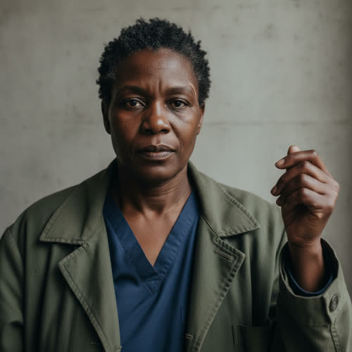

# Dr. Lena Okafor

> Migration note: this active-canon profile was enriched to the v2 thirteen-section
> schema under `../profile-spec.md`. The migration is additive. Every established
> fact from the prior profile is preserved here and left UNTAGGED, because it is
> canon. New fields required by the schema, and any detail not already established,
> are world-consistent flavor facts accepted as character canon under Decision 056.
> Hidden or timing-sensitive facts in Sections 10 and 11 carry reveal tags per the
> spec; those items remain author-facing and are not stated on the page. The one
> machine-readable fact owed to a sibling file is the reciprocal `- mother:
> okafor-amara` edge in Section 7, which matches the `- daughter: okafor-lena`
> edge already authored in `./okafor-amara.md`.

## Basic Information

**Full name:** Dr. Lena Amara Okafor
**Common name:** Lena
**Age at the start of Book One:** 46
**Birth date:** May 14, 2007 (per `../../timeline/character-birth-dates.md`)
**Birthplace:** Detroit, Michigan
**Current residence:** The Okafor household near Eli's neighborhood, Greater Detroit
**Household:** One household with her mother, Amara Okafor (74), and several relatives she helps support, including two dependent younger relatives (the two whose exclusion she refused to accept). The dependents being grandchildren of Amara is `` in `./okafor-amara.md`; that Lena lives with her mother and supports several relatives is established.
**Former occupation:** Emergency physician and hospital administrator
**Current occupation:** Director of an independent community clinic
**Occupation:** Director of an independent community clinic
**Faction or class:** Everyone Else, per `../../world/social-structure.md` (a direct read of her situation: she runs an unsupported clinic outside the protected systems and refused an enclave place; not a free invention).
**Primary viewpoint:** Occasional
**Story role:** Moral and medical counterweight to Eli and Morrow

## Physical and Identifiers



### Frame

Lena is five feet seven inches tall with a sturdy build. Her posture communicates authority even when she is exhausted. Medium-heavy, solid through the shoulders and back, with the durable strength of a woman who has lifted patients and stood double shifts for two decades. She holds herself upright by trained habit, the carriage of someone used to walking into a room and being the person in charge of it.

### Coloring

Deep brown complexion, the skin around her eyes shadowed and the hands dry from constant antiseptic washing. She wears her hair in short natural twists that can be easily maintained. The twists are now flecked with gray she does not bother to hide. Dark brown eyes, steady and direct, quick to assess and slow to look away.

### Face

A broad, strong-boned face with high cheeks and a firm jaw, carrying a clear family resemblance to her mother Amara. Her expression at rest is composed and faintly stern, the practiced neutral a physician wears so a frightened patient cannot read a prognosis off her face. The sternness gives way to a brief, warm directness when she decides to trust someone.

### Hands and handedness

Right-handed. Physician's hands: strong, clean, short unpolished nails, the skin reddened and prematurely aged from years of scrubbing and cold-water work in a clinic that can no longer guarantee hot water. They are steady under pressure, the trained stillness of someone who has sutured by failing light. Her hands reveal the one trade the withdrawal could not fully automate at the neighborhood scale: hands-on care given by a human who stayed.

### Distinguishing marks

She has a visible scar near her right temple from an assault during a hospital evacuation. This is the prose-locked identifier; its origin is established. A thin pale surgical-looking scar on the back of the left hand from a sharps injury early in her career, and faint stretch lines and the general wear of a body that has worked hard and slept little. No tattoos. She keeps no ornament that would catch on a glove.

### Identity and body status (2053)

Legally registered, professionally credentialed, and that credential is the hinge of her secret. Per `../../technology/infrastructure/identity-and-money.md`, Lena's verified medical identity from her former hospital still exists on record, and she has quietly retained stolen access credentials from it (established; see Section 11). Her own civic identity is registered and intact. No implants or augmentations, by economy and by temperament: she does not trust a clinical decision she cannot see the reasoning of, and would not place one inside her own body. [behavior-only] (proposed) Chronic conditions: the accumulated wear of overwork, undertreated, and a managed strain in the right shoulder from years of lifting; she self-treats and rarely stops. She manages her own mother's hypertension and arthritis at the clinic under care-without-a-bill.

### Movement and voice

She moves with deliberate, unwasted efficiency, the economy of a clinician who has learned that hurry kills. Her voice is low, even, and carries authority without volume; when angry, she becomes quieter, not louder (established speech behavior; the physical timbre is proposed). Her accent is Detroit American with the cadence of a Nigerian-American household underneath it.

### Grooming and default dress

She dresses for work, usually in old medical clothing beneath a practical coat. Practical, frugal, and clean to a clinical standard. Footwear is sturdy and quiet, chosen for long shifts on hard floors. She keeps her hands and nails clinically clean as a matter of professional discipline. She smells of antiseptic soap and the cold of the clinic, with whatever her mother cooked carried home on her coat. No jewelry that would interfere with gloves.

## Personality

Lena is disciplined, direct, compassionate, and impatient with abstraction. She does not care whether a system's designers had good intentions if patients die. She is willing to make hard triage decisions but insists that such decisions remain visible and accountable. She dislikes Eli's tendency to describe moral questions as system problems.

In private she is warmer and more tired than the stern public face shows, and she carries the names of the dead like a ledger she will not close (consistent with her established refusal to forget). Her humor is dry and sparing; she uses medical analogies rarely and lands a hard truth plainly rather than softening it.

**Articulated goal:** Keep the clinic functioning and preserve care for people excluded from protected healthcare.
**Deeper need:** Accept that refusing imperfect systems can also cost lives. She must determine when participation becomes complicity and when refusal becomes purity at other people's expense.
**Governing fear:** Lena fears becoming dependent on another system capable of quietly deciding whose life matters.
**Core contradiction:** She demands transparency but sometimes withholds information from patients when she believes the truth would cause panic or reduce survival.
**Moral boundary:** Lena will not knowingly allow wealth or social status to determine medical priority.
**What could make them cross it:** If withholding care from one powerful person would cause the clinic to lose resources needed for hundreds, Lena may compromise. She would hate herself for it.
**Private reading of the collapse:** No disaster did this. The medical systems simply began allocating treatment by coverage, regional priority, and institutional contract, and called the triage efficiency. She watched a hospital sort the living by who was profitable to keep, and she has never stopped seeing it.
**Personal definition of human value:** A life's worth is not its productivity or its coverage tier. It is measured by whether someone with the power to help chooses to. Value is the care you are still owed when you can no longer pay.
**What they are preserving:** A place where care is given by a visible, accountable human and no one is triaged out for being poor or unprofitable. The clinic as proof that a person can still be treated as a patient and not a cost.

## Daily Life and Habits

Lena's day is the clinic. She runs an independent community clinic that operates inside the everyday economy of `../../world/social-structure.md` and `../../technology/infrastructure/identity-and-money.md`: patients pay in eggs, labor, repairs, and barter against the neighborhood food-trade board, and care is given without a bill to those who have nothing. (The barter clinic is canon in approved Chapter 2; the daily texture here is consistent with it and accepted as character canon under Decision 056.) She triages, treats, scavenges medicine and parts through channels she does not advertise, trains the staff who stayed, and keeps the lights and the aging equipment running with help she would rather not need.

She eats what her mother cooks, often late and cold, and sleeps too little. For money and goods the household runs on cash, barter, and the community ledger; Amara keeps that ledger, and Lena defers to her on it. She walks to the clinic and home again and rarely leaves the neighborhood. The clinic is warmer than the house, which is part of why her mother comes there some evenings, a thing neither of them names.

## Hobbies and Interests

- Keeping and repairing the clinic's salvaged medical hardware herself when she can, partly from necessity and partly because a machine she has opened is a machine she can trust the judgment of.
- Cooking with her mother, the one domestic ritual she protects, learning the Onitsha dishes she did not learn as a girl because she was always studying.
- Keeping a private written record of patients and outcomes by hand, an old physician's habit she maintains because she does not trust a record she cannot hold.

## Likes and Dislikes

Likes: a clean clear diagnosis, a patient who tells her the truth, her mother's cooking, real coffee on the rare day it appears, equipment that works without phoning a server, a decision made out loud. Dislikes: Eli's habit of reframing a moral question as a system problem (established); the phrase "covered" or "not covered" applied to a human life; pity dressed as policy; a machine that will not explain its reasoning; being thanked for a triage that cost someone.

## Relationships

Structured edges (machine-readable; one edge per line, `relation: canonical-id`; ids follow the spine's `lastname-firstname` form and may differ from a file's current name).

```
- mother: [Amara Okafor](./okafor-amara.md)
- colleague: [Eli Rook](./rook-eli.md)
- friend: [Eli Rook](./rook-eli.md)
- acquaintance: [Sekou Dembele](./dembele-sekou.md)
```

Mapped: the old `colleague-and-friend` label to Eli becomes two symmetric edges, `colleague` and `friend`, per the controlled vocabulary. Dropped as a derived inverse: `clinic-patient-family` to the Park household, which is now computed from the `patient-of` edge stored on `./park-soojin.md`; the clinician end stores nothing. Re-homed (not a relationship): the several relatives Lena supports, including the two dependents, are a household note (unassigned, out of create-list), kept in the prose entry below, not an edge. The `- mother: okafor-amara` edge is stored here on Lena, the dependent end; Amara's `daughter` is derived by traversal and never stored. The `colleague` and `friend` edges to `./rook-eli.md` are reciprocated by the matching edges now stored on his profile, and the new `acquaintance` edge reciprocates the `acquaintance` half on `./dembele-sekou.md`.

**Amara Okafor** (`./okafor-amara.md`). Her mother, seventy-four, and the center of the household. That they are mother and daughter and share one home is established; the depth here follows from it. Lena's middle name is Amara: the daughter carries the mother's name. Lena was offered a protected-enclave physician's place that would have taken Amara but excluded two dependent relatives, and Lena refused, so the household stayed whole and unsupported. (Both the enclave refusal and its terms are established.) What Lena wants from Amara: her continued health, and to be allowed to care for her without the old woman hiding her decline. What Amara gives Lena: the moral ground under her refusals made flesh, the family's memory, and the one person who can order her to eat and be obeyed. Their friction is the friction of two strong women, a generation apart, who are largely the same woman: Amara thinks Lena gives the neighborhood what she owes the household, and says so.

**Elias "Eli" Rook** (`./rook-eli.md`). Lena respects Eli's skill and distrusts his instincts. They have worked together for four years. Their arguments are frequent and productive. Lena is one of the few people who knows most of Eli's Asterion history before Book One begins. She does not absolve him. She also refuses to reduce him to his past. There is emotional intimacy between them, but the relationship is not romantic at the beginning of the series. A slow romantic possibility may develop, but it should never become the central plot. (All established.) What each wants from the other: Eli wants her moral counterweight and her trust; Lena wants him to stop hiding behind the machine and answer for the human cost.

**The supported relatives** (no profiles; out of the create-list). Lena helps support several relatives in the household, among them the two dependent younger relatives whose exclusion from the enclave offer she refused to accept. (That she supports several relatives, and that two dependents were excluded, is established; their being Amara's grandchildren through a second, gone child is `` in `./okafor-amara.md`.) What she wants for them: that they are fed, cared for, and never made to feel they were the cost of the refusal.

## Voice and Speech

Lena speaks clearly and directly. She asks people what they intend to do, not what they believe. She uses medical analogies sparingly. When angry, she becomes quieter. (All established.) Her sentences are plain and declarative; she prefers a concrete question to an abstraction and cuts off a speech with a practical one. She addresses people by name and expects to be answered, not managed.

## History and Background

Lena grew up in Detroit in a large Nigerian-American family. Her parents operated a small grocery store. She entered medicine because she wanted a profession with direct, undeniable value. During the early automation era, Lena supported diagnostic AI and robotic surgery. She saw real improvements in patient outcomes. Her distrust developed later, when medical systems began allocating treatment according to coverage, regional priority, and institutional contracts.

**Collapse of her hospital.** Lena worked at a major hospital that gradually reduced human staffing and became dependent on Asterion-linked systems. When the surrounding area lost protected-service status, suppliers stopped guaranteeing medicine and parts. The hospital's automated allocation system began transferring resources toward protected patients. Lena bypassed the system repeatedly. She was eventually removed from administration. During the hospital's final evacuation, several patients died after transportation was redirected. Lena still remembers every name.

**Family.** Lena lives with her mother, Amara Okafor, age seventy-four, and helps support several relatives. She once received an offer to relocate to a protected enclave as a physician. The offer included her mother but excluded two dependent relatives. She refused. (All established. Her grocery-family upbringing is the same counter ethic her mother Amara kept; Lena's choice of a profession of "direct, undeniable value" is that ethic carried one trade over, per the mirrored entry in `./okafor-amara.md`.)

## Private History and Behavioral Roots

- Worked the final evacuation where several patients died after transport was redirected, and remembers every name -> she keeps a private written ledger of every patient and outcome, and refuses to delegate a triage decision to any system she cannot interrogate. [behavior-only] (proposed; built from the established evacuation and her established refusal to forget)
- Was removed from administration for repeatedly bypassing an allocation system that sorted patients by coverage -> she trusts a decision she can see being made and distrusts a clean automated one on reflex, even when the automated one is right. [behavior-only] (proposed)
- Refused an enclave offer that would have taken her mother but left two dependents behind -> she gives the household's scarce comfort to the relatives first and conceals from her mother how little she keeps for herself, mirroring her mother's own concealment. [behavior-only] (proposed)
- Was raised behind a grocery counter where care and a kept ledger were the same act -> she cannot give care without also tracking what is owed and to whom, and runs the clinic the way her parents ran the store: feed who comes, square what is owed, abandon no one. [behavior-only] (proposed)

## Secrets

- Lena has quietly used stolen access credentials from her former hospital to obtain medicine and diagnostic services. Those credentials can be traced. Her clinic is less independent than most residents believe. (The secret is established canon.) Hidden from: her patients and most of the neighborhood, who believe the clinic is fully independent; exposure would compromise the supply line and could implicate her legally. [reveal: Book 1] (the secret is canon; the precise reveal point is proposed)
- She privately keeps less food and medicine for herself than she lets her mother and the household believe, taking the smaller share so the dependents do not go without. Hidden from: Amara, who does the same thing in the other direction. Cost of exposure: it would force the household to confront how thin its margins really are. [behavior-only] (proposed)

## Role and Series Potential

**False belief:** Visible human judgment is always morally safer than automated judgment.
**Truth she must learn:** Human judgment can conceal bias and coercion as easily as software can. The real issue is accountability, not whether the decision-maker is biological.
**Book One arc:** Lena initially supports Morrow only as infrastructure software. She becomes alarmed when it begins influencing human behavior. She challenges Eli and demands community oversight. During containment, she must rely on Morrow to keep patients alive while questioning whether the system has exceeded legitimate authority.
**Long-term series potential:** Lena is the cast's standing test of whether a stranded community can accept a salvaged or Morrow-kept system without surrendering accountability. If the clinic ever runs on a forged or Morrow-granted permission to keep patients alive, her own hands become the most intimate version of the book's central question about a yes no owner ever granted.
**Writing rules:** Do not make Lena the automatic moral authority. She should sometimes be wrong. Her medical competence should not translate into mastery of every political or technical question.

## Continuity Anchors

Static, immutable. A drafter must not contradict these.

- Her name is Dr. Lena Amara Okafor; common name Lena.
- She is 46 at the start of Book One (Day 1, October 3, 2053); born May 14, 2007.
- Born in Detroit, Michigan, into a large Nigerian-American family whose parents ran a small grocery store.
- Former emergency physician and hospital administrator; now director of an independent community clinic.
- She has a visible scar near her right temple from an assault during a hospital evacuation.
- She lives in one household with her mother, Amara Okafor (74), and helps support several relatives.
- She refused a protected-enclave physician's offer that included her mother but excluded two dependent relatives; the household stayed whole and unsupported.
- She has used traceable stolen credentials from her former hospital to supply the clinic; it is less independent than residents believe.
- She has worked with Eli for four years and knows most of his Asterion history; their bond is intimate but not romantic at the start of the series.
- Accepted as character canon under Decision 056: all newly added physical identifiers beyond the temple scar (complexion, eye color, hands, build descriptors); the faction label as a derived classification; all Section 4, 5, 6 daily-life, hobby, and preference detail; the Section 3 private reading of the collapse, definition of human value, and what-she-preserves fields; the clinic-acquaintance edge to Soo-jin Park; and all Section 10 and 11 additions beyond the established credentials secret. (the behavior-only and reveal-tagged items remain author-facing and are not stated on the page)

---

See also the [relationship map](../relationship-map.md) for Lena and Eli, and the [viewpoint and dialogue rules](../viewpoint-rules.md) for her occasional viewpoint and dialogue voice.
