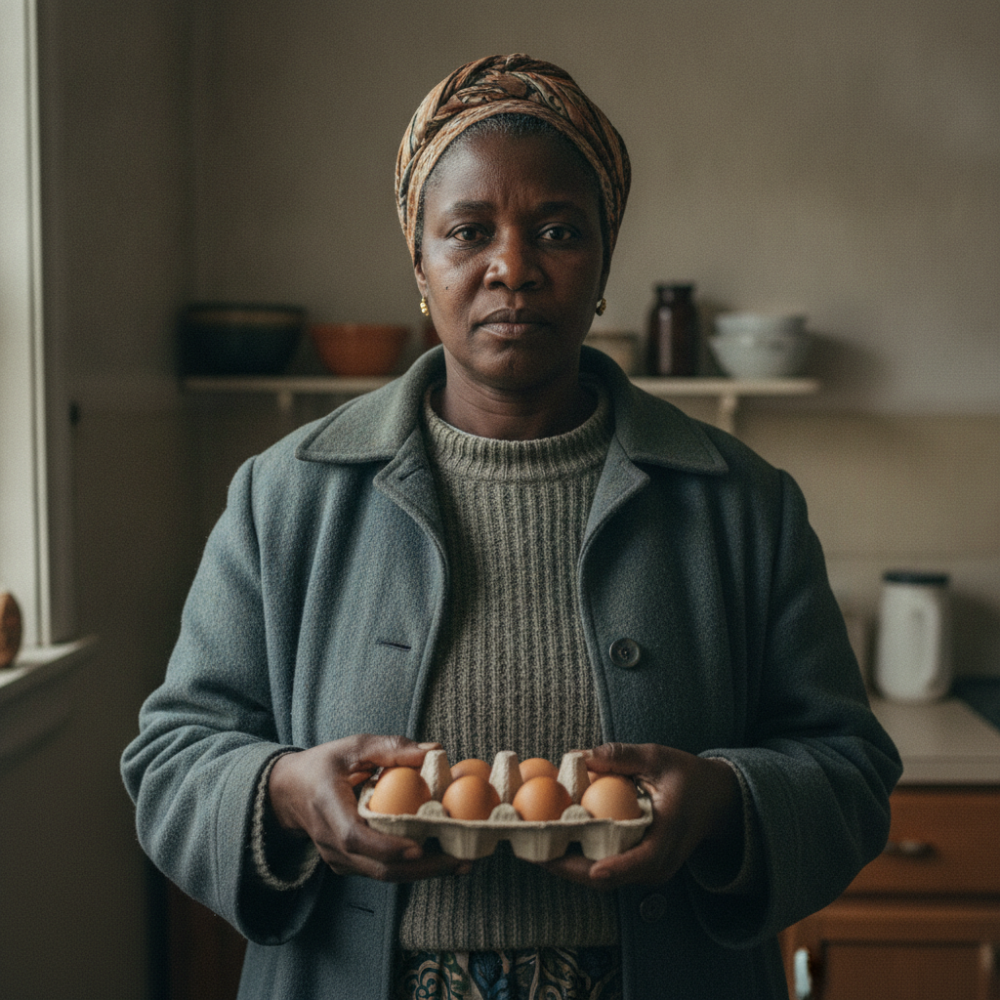

# Ngozi Okonkwo

> Status: DRAFT. Generated under `../profile-spec.md` for the Chapter 2
> neighborhood food-network cluster. Canon facts traced to
> `chapter-02-the-last-supported-day.md` are marked `[open]`. The given name
> Ngozi, the birth date, the age, the birthplace, the household composition, and
> every physical identifier are accepted as character canon under Decision 056.
> In the prose she is "Mrs. Okonkwo," and the household is "the Okonkwos."
> Reveal-tagged and behavior-only items remain author-facing. Profile stays draft
> pending author activation.

## Basic Information

**Full name:** Ngozi Okonkwo
**Common name:** Mrs. Okonkwo [open] (the only name given in approved Chapter 2)
**Age at the start of Book One:** 50
**Birth date:** June 1, 2003 (not listed in `../../timeline/character-birth-dates.md`; invented under Section 6 and offered to the spine)
**Birthplace:** Enugu, Nigeria (grounds the Igbo surname and a later emigration to Detroit)
**Current residence:** A house in Lena's neighborhood, Greater Detroit
**Household:** A multigenerational Igbo household: Mrs. Okonkwo, an elder she cares for known in the prose as "the father," and at least one younger relative. "The father" is the incoming clinic patient whose Tuesday visit the eggs pay for. [open that the eggs are "for the father's visit Tuesday"]
**Occupation:** Keeper of the household, family-elder caregiver, and an active trader on the neighborhood food board
**Faction or class:** Everyone Else, per `../../world/social-structure.md`. [open] (She pays a doctor in eggs because there is no longer an office to send a bill to.)
**Primary viewpoint:** No. She is never a point-of-view character.
**Story role:** Minor walk-on. The human face of the barter fee, and the middle node of the egg ledger that links the Vesely place, Dembélé's board, and Lena's clinic. She makes the everyday economy concrete: a debt to one neighbor settled in hens' eggs that become a doctor's fee.

## Physical and Identifiers



### Frame

Five feet six inches, broad-shouldered and solid, built for carrying, with the planted, upright stance of a woman used to managing a household and a sick elder at once. She walks in carrying something and sets it down with care, "the Okonkwos brought their thing. It's on the counter." [open that she delivered the eggs] Her posture is squared and certain even when she is tired.

### Coloring

Dark brown complexion, even and well-kept. Hair worn in neat cornrows or wrapped in a printed headscarf depending on the day, threaded with the first gray at the front and tended without fuss. Dark brown eyes, level and appraising, the eyes of a woman who counts what is in a room.

### Face

A round, strong-boned face, full at the cheeks, with a composed, slightly formal resting expression that softens fast when she is among her own. A small habitual set to the jaw, the look of someone carrying a worry she will not put on you. Lines bracketing the mouth from a smile she gives deliberately rather than constantly.

### Hands and handedness

Right-handed. Capable, working hands: broad palms, short nails, a cook's small scars and a caregiver's chapped knuckles from washing and lifting. She handles a dozen eggs the way you handle something owed and breakable, knowing exactly which ones are the brown ones and that those are the ones that matter. [open, derived from "she said you'd want the brown ones"] The hands reveal cooking, washing, lifting an elder, and the daily physical work of holding a multigenerational house together.

### Distinguishing marks

A faint pair of vertical tribal marks high on each cheek, given in infancy in Enugu, the old Igbo way, now nearly faded. A burn scar across the inside of the right wrist from a pot of hot oil, the kind of scar every serious cook of her generation carries. A thin white line on the left thumb from a kitchen knife. Pierced ears she keeps with small gold studs, a wedding gift she still wears. No tattoos.

### Identity and body status (2053)

Legally registered, practically outside the institutions, per `../../technology/infrastructure/identity-and-money.md`. Her verified identity is intact on paper; the systems that identity used to open, a clinic that billed, a pharmacy that filled, an insurer that argued, are gone or unreachable, so she pays a doctor in eggs. [open, derived] She has no augmentations or implants, a matter of economy and a quiet cultural conservatism about the body. No prosthetics. Chronic condition: well-controlled high blood pressure she keeps in check with diet and what the clinic can still spare, the unglamorous maintenance medicine that the withdrawal makes harder every season. Her body's real load is invisible and uncoded: the daily lifting and tending of "the father."

### Movement and voice

She moves with a brisk, weighted efficiency, no wasted trip, because a woman running a household under-supplied learns to make one errand do three things. Her voice is warm, low, and definite, carrying a Nigerian English under the Detroit decades, the consonants crisp, the sentences ending where she means them to. She gives instructions plainly, "she said you'd want the brown ones," the way a woman states a fact she has already verified. [open]

### Grooming and default dress

Neat, modest, and practical, dressed for work and for respect at once. Default dress is a long printed wrapper or a sturdy skirt over warm layers in the cold months, a buttoned coat she keeps on indoors against the rationed heat, a headscarf, and flat shoes that have carried weight. For the clinic and church she puts herself together more formally, because how you appear is a way of keeping your dignity when the systems will not keep it for you. Scent of cooking spice, soap, and the cold outside air she carries in. Small gold studs, a thin chain.

## Personality

In public Mrs. Okonkwo is formal, gracious, and exacting, a woman who keeps standards up precisely because the world's standards have fallen. She arrives having already done the thinking, knows what she owes and to whom, and settles it without being asked twice, "for the father's visit Tuesday," the fee handed over before the service, the obligation honored in advance. [open, derived] In private she is tired and stretched thin between an elder who needs her and a household to keep fed on a barter economy, and she guards how thin by never letting the strain show as complaint.

Her humor is dry and proud, surfacing in the precision of her insistence, the small flex of knowing the Vesely browns are better and saying so. She is not sentimental about the new economy; she is competent inside it.

**Articulated goal:** Keep her household fed, warm, and squared with its neighbors, and get "the father" the care he needs without owing anyone an unpaid debt.
**Deeper need:** To preserve the dignity of paying her own way, of being a giver and a settler of debts rather than a recipient of charity, in a world that keeps trying to turn need into shame.
**Governing fear:** That the day comes when she has nothing left to trade, when the eggs and the labor and the standing run out, and she must take care for the father as alms and watch her household become a charge on the street.
**Core contradiction:** She insists on paying for everything to keep her dignity, and in doing so she sometimes gives away what her own household can least spare, settling a debt in eggs her family could have eaten.
**Moral boundary:** She will not let an obligation go unpaid, and she will not let "the father" go without care to save a trade. The elder comes first; the debt comes a close second; her own needs come last.
**What could make them cross it:** If the father's care and a neighbor's settled debt ever came down to the same dozen eggs, she could let a real obligation lapse, and carry the shame of the broken chain rather than fail the old man.
**Private reading of the collapse:** The companies and the offices left, and what they took was not the food, which is still here, but the clean way of paying for things that let you keep your distance and your pride. Now everything is owed face to face, and that is harder and also, she will admit only to herself, more honest.
**Personal definition of human value:** You are worth the debts you keep and the people you carry. Value is being someone whose word and whose fee are good.
**What they are preserving:** The dignity of the settled debt, and the household that pays its way, in an economy that has stripped the dignity out of need. (Her entry in the Final Character Standard.)

## Daily Life and Habits

Her day is built around the father: waking him, washing him, feeding him, and the slow management of an old man's needs in a cold house, around which she fits the cooking, the trading, and the keeping of the household. [accepted as canon (Decision 056), grounded in the canon "the father's visit Tuesday"] She tracks what the household owes and is owed and settles it on Dembélé's board and at the clinic, "the Okonkwos paid you in my eggs," carrying the fee herself rather than sending it. [open]

For money she trades, like everyone outside the protected systems, per `../../technology/infrastructure/identity-and-money.md`. [open] The household has standing obligations, "a thing they owed the Veselys from August," and she works them down in eggs, labor, and cooking. [open] She eats from what the chains bring and what she grows and trades, and she keeps a little back against the father's visits, because care now is paid in advance and in kind. She does not commute; her world is the house, the board, the clinic, and the church.

## Hobbies and Interests

- Cooking the dishes of home, jollof and egusi and pepper soup, scaled to whatever the barter economy delivers, the kitchen the one place the old life is fully intact.
- Church and the women's network around it, a parallel ledger of care and obligation that runs alongside Dembélé's board.
- A small garden of peppers and greens she tends against the cold, partly for the pot and partly to trade, a producer's pride in growing rather than only buying.

## Likes and Dislikes

Likes: a debt settled clean, brown eggs (she is particular, "you'd want the brown ones"), a well-run kitchen, the father having a good day, the formality of doing a thing properly, gold against dark skin (the brown eggs and the settling are canon-grounded; the rest accepted as canon (Decision 056)). Dislikes: owing and not being able to pay, being treated as a charity case, waste, a slipshod trade, and the cold that has gotten into the father's chest (the owing and the cold are world-grounded; the rest accepted as canon (Decision 056)).

## Relationships

Structured edges (machine-readable; one edge per line, `relation: profile-slug`):

```
(none -- every former edge on this profile was barter-economy logistics, re-homed to prose below)
```

Re-homed (barter logistics, not edges, per profile-spec.md): Mrs. Okonkwo pays
the clinic in a dozen brown eggs for "the father's" visit, settles an August debt
to the Vesely place, and is routed to on Dembélé's board. The former
`paid-clinic-fee-to` (Lena), `settling-debt-with` (Vesely), and `routed-by`
(Dembélé) labels are fee, debt, and routing logistics, not durable social bonds,
so they are dropped from the edge list and carried in the descriptive prose below.
She is not herself a clinic patient ("the father" is), so she stores no
`patient-of` edge, and she therefore carries no structured relationship edges.

Note: "the father" is a household member and an incoming clinic patient, noted
only, with no id, out of this cluster's create-list.

**Dr. Lena Okafor** (`./okafor-lena.md`). The doctor her household pays in eggs, and the one who will see "the father" on Tuesday. [open] Mrs. Okonkwo brings the fee in advance and in kind, twelve brown eggs on the counter where the billing screen used to be, and tells the nurse exactly which eggs they are. [open] There is a quiet cultural recognition between two Igbo women in a withdrawn city, Okafor and Okonkwo, though the prose does not yet stage it. What she wants from Lena: care for the father, taken as something paid for and not as alms. What Lena gets: a patient family who keep the clinic supplied in the only currency left.

**Marek Vesely** (`./vesely-marek.md`). The hen-keeper her household owed "a thing" from August, settled when his brown eggs came to them on Wednesday. [open] The Vesely browns are the eggs she then carried to the clinic, so the debt she owed and the fee she paid are the same dozen, moving. What she wants from Vesely: to clear the August debt cleanly. What Vesely gets: an honest settling and a household that pays.

**Dembélé** (`./dembele-sekou.md`). The board-keeper who routed the eggs to her and tracked the whole chain, "Vesely to Okonkwo Wednesday." [open] He is the reason the debt and the fee connect at all. What she wants from him: that the routing be fair and the columns straight, so her obligations are legible. What Dembélé gets: a reliable node, a family whose trades settle and can be counted on in the chain.

**Mrs. Diallo** (`./diallo-aminata.md`). A neighbor of the same generation and the same world, a woman whose dread of a bill kept her home while Mrs. Okonkwo's pride keeps her paying, two faces of the same outlived fear of cost. What she might want from Diallo: that she stop hiding from care. What Diallo gets: an example of a woman meeting the new economy head-on.

## Voice and Speech

Warm, formal, and exact. She states what is owed and what is brought as settled facts, "they're from the Vesely place, the brown ones, she said you'd want the brown ones," instruction and provenance in one breath. [open] Her vocabulary is plain and domestic, ordered by obligation, who owes, who is owed, what is for whom. A Nigerian English crispness sits under the Detroit vowels. Verbal tic: she anchors a statement in its source and its purpose, naming where a thing came from and what it is for, because in a barter economy provenance is the receipt. Under stress she becomes more formal, not less, drawing dignity up around the household like a wrapper.

## History and Background

Born in Enugu, Nigeria, in an Igbo family, and raised to the standards of obligation and hospitality she still keeps. She emigrated to Detroit as a young woman, married, and built a household in the city, part of the same Nigerian-American Detroit that produced Lena Okafor a generation older. [accepted as canon (Decision 056); parallels the canon Okafor origin] As the city's services withdrew under the polite notices, the household turned, like everyone's, to trade, labor, and the board, and Mrs. Okonkwo turned out to be good at the new economy precisely because she had always run a house on obligation and exact reckoning.

By Book One she carries "the father," the household's elder, whose chest the cold has gotten into and who has a clinic visit Tuesday, and she pays for it the new way, in advance and in eggs. [open, derived] The eggs themselves are a debt to the Veselys from August, settled Wednesday, carried to the clinic that same week, a single dozen of brown eggs doing the work the whole apparatus used to do. [open]

## Private History and Behavioral Roots

- Raised in a culture where an unpaid obligation is a stain on the whole family -> she settles every debt early and in full, even when it costs her household the eggs it could have eaten, and never lets a fee be called a favor. [behavior-only] (proposed)
- Has watched the institutions that used to let you pay at arm's length disappear -> she pays face to face, in kind, and carries the fee herself, treating provenance and delivery as the receipt the dead screen no longer prints. [behavior-only] (proposed)
- Carries an elder whose decline she manages alone in a cold house -> she fits the whole barter economy around the father's needs and lets none of the strain show as complaint, because complaint would make him the burden she refuses to let him be. [behavior-only] (proposed)
- Emigrated and rebuilt a life once already, before the withdrawal -> she meets the collapsed economy with competence rather than grief, having learned young that a household is something you carry to a new place and reassemble. [reveal: Book 1] (proposed)

## Secrets

- The household's standing is thinner than the formality suggests, and the eggs she pays the clinic with are eggs the family needed, a debt settled at the cost of a meal, which she will not admit because admitting it would turn her dignity into a problem the street feels obliged to fix. Exposure would shame her and draw the charity she most wants to avoid. [reveal: Book 1] (proposed)
- She knows "the father" is failing faster than the Tuesday visit can fix, and is quietly pre-settling debts and stockpiling small fees so that when the worse news comes the household will owe no one. Exposure would force the grief she is holding off by staying busy. [reveal: Book 2] (proposed)

## Role and Series Potential

In Chapter 2 her function is precise and structural: she is the middle move in the egg ledger, the woman who turns a debt to the Veselys into a doctor's fee, and the proof that the everyday economy runs on obligation honored face to face. Her single line of instruction, brought to Lena secondhand through Tomas, "they're from the Vesely place, the brown ones, she said you'd want the brown ones," carries the entire texture of the barter world in one fussy, dignified detail. [open] Book One arc, minor: the slow pressure on a woman who insists on paying her way as the things she has to pay with run thinner. Long-term series potential: if promoted, she is a natural community anchor, a household head whose network of church, kitchen, and obligation is a second informal infrastructure beside Dembélé's board and Talia's coordination, and an early, skeptical test of whether a system like Morrow can be trusted to keep a debt honest. False belief, if promoted: that paying for everything keeps you free. Truth she would learn: that there is a kind of need no settled debt can cover, and accepting care is not the same as losing dignity.

Writing rules: do not flatten her into the noble immigrant or the saint of the kitchen; her pride costs her household real things. Keep the formality as armor and as genuine standard at once. Never let "the father" become a prop; he is the load she carries, not a plot device.

## Continuity Anchors

Static, immutable. A drafter must not contradict these.

- Her name in approved prose is Mrs. Okonkwo; the household is "the Okonkwos." [open]
- She brought a dozen brown eggs to the clinic as the fee "for the father's visit Tuesday." [open]
- The eggs are "from the Vesely place, the brown ones," and she said "you'd want the brown ones." [open]
- The eggs settle a chain Dembélé routed: "Vesely to Okonkwo Wednesday, against a thing they owed the Veselys from August. Now they've come to you." [open]
- The fee was set down on the counter where the billing screen used to be, and Tomas "didn't know what else to do with a fee." [open]
- "The father" is a member of her household and an incoming clinic patient (visit Tuesday). [open]
- Accepted as character canon under Decision 056: given name Ngozi; age 50; birth date June 1, 2003; birthplace Enugu, Nigeria; the multigenerational household and "the father" as elder patriarch; all physical identifiers; and the hobbies, daily life details, and likes/dislikes of this profile. (The behavior-only and reveal-tagged items remain author-facing and are not stated on the page.)
