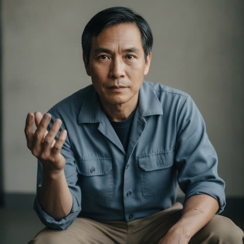

# Daniel Park

## Basic Information

**Full name:** Daniel Hyun-woo Park (현우)
**Common name:** Daniel [open] (the name June's profile gives him). Soo-jin and his mother-in-law call him by the Korean given name in private.
**Age at the start of Book One:** 49
**Birth date:** March 3, 2004 (not listed in `../../timeline/character-birth-dates.md`; carried here for the spine; places him at 30 at June's birth on August 22, 2034, a normal gap)
**Birthplace:** Detroit, Michigan
**Current residence:** Contract-worker housing inside a corporate-contracted protected enclave outside the Great Lakes region
**Household:** Lives alone in enclave worker quarters. Separated, not divorced, from his wife Soo-jin Park. His wife, daughter June, and mother-in-law remain a single household in Greater Detroit [open].
**Occupation:** Robotics-maintenance contractor. He keeps the enclave's autonomous systems running: domestic and service robotics, autonomous security units, and the maintenance machines that maintain everything else. [open, that he holds a robotics-maintenance position inside a protected enclave]
**Faction or class:** Everyone Else by origin and class; physically resident inside a Protected enclave by labor contract, not by wealth or ownership. He is an inside-the-wall member of the outside class. [open nuance, derived from `./park-june.md`; framing per `../../world/social-structure.md` and `../../world/protected-enclaves.md`]
**Primary viewpoint:** No. He is off-page through approved Chapter 2 and is not a point-of-view character in Book One.
**Story role:** June's absent father. The off-page source of June's concealed technical advantage and the human instance of an enclave severing a family by contract rather than by malice. A planned reveal vector: the question of where June's restricted documentation comes from leads back to him.

## Physical and Identifiers



### Frame

Five feet nine inches, lean, with the wiry build June inherited from him, now gone slightly soft and stooped at forty-nine from years bent into machine bays under enclave light. His posture is a maintenance worker's habitual half-crouch of readiness, weight forward, ready to kneel to a panel. Under observation he holds unnaturally still, a learned economy of motion. He does not take up room. He has spent six years making himself unremarkable to cameras.

### Coloring

Warm light-brown complexion gone indoor-pale, the particular grayed pallor of a man who lives under filtered artificial light while his daughter works in the cold open air. Black hair, fine and straight, cut short and neat to the enclave's grooming standard, now heavily salted with gray at the temples. Dark brown eyes, deep-set, tired, and watchful.

**Heritage:** Korean-American: second-generation.

### Face

A narrow, even face with neat regular features and a high straight brow. His expression at rest is careful neutrality, a face trained to give nothing to a lens. When he forgets the cameras, which is rarely, a quick warmth surfaces and vanishes. June has his quickness but her mother's face.

### Hands and handedness

Right-handed. Maintenance hands, the one trade automation still needs: fine, precise, fast, the fingertips scarred and slightly flattened from connectors and actuator springs, a permanent faint metallic-gray of conductive paste ground into the creases of the right palm that no washing fully lifts. Short clean nails, kept to enclave hygiene code. His hands are the clearest thing he passed to June, who works with the same fast certainty.

### Distinguishing marks

A pale crescent scar across the pad of the left thumb, from a security-unit servo that closed on it during a night call in his first contract year. A small shiny burn on the inside of the right forearm from a coolant line. A faint surgical mark over a back lower molar that the enclave's dental service crowned for free, a small luxury that quietly separates him from a family that has no dentist. No tattoos. A nearly invisible scar on the inner left wrist over the enclave-issued subdermal credential (see below).

### Identity and body status (2053)

The inverse of the stranded outsider. Daniel is fully registered, biometrically enrolled, and enclave-permissioned, per `../../technology/infrastructure/identity-and-money.md`; his verified digital identity is current, complete, and the literal condition of his employment and his bed. [open nuance] An enclave-issued subdermal credential in his left wrist logs his location and gates every door; he is aware that it logs him, and that awareness governs how he moves and when he dares to make a private call. [behavior-only] (proposed) No augmentations beyond the credential; contracted labor is given tools, not enhancement, and he distrusts anything implanted past what the job requires. Chronic conditions: managed hypertension and early type-2 diabetes, kept in easy check by the enclave clinic, the same clinic-grade care his wife, daughter, and mother-in-law do without.

### Movement and voice

He moves quietly and economically, a worker's habit of being unobtrusive, never the first motion in a room watched by machines. [behavior-only] (proposed) His voice is low and even, with flat Detroit vowels carried under the cadence of a bilingual Korean-American household. He drops into Korean only in the rare private calls home, and the shift is the surest sign the conversation is real and not for the log. [behavior-only] (proposed)

### Grooming and default dress

Clean to the point of self-erasure. On shift, a gray enclave contractor coverall with a name patch and the credential badge clipped at the chest, clean-room discipline at the cuffs. Off shift, plain neat civilian clothes, nothing that would read as either poverty or presumption. Short tidy hair, shaved close on a weekly enclave schedule. Footwear: steel-capped maintenance boots on shift, soft soles off. He carries the enclave's filtered, scentless air on him, with an undertone of machine lubricant. The neatness is partly code and partly camouflage, a man dressed to be overlooked.

## Personality

In public, inside the enclave, Daniel is quiet, courteous, deferential, and competent, the reliable contractor management forgets is a person with a life on the other side of the wall. He performs unremarkableness on purpose. In private, on the rare unlogged call, he is warm, anxious, and over-attentive, packing months of fatherhood into a scheduled window. He is a man holding two selves apart by force, the enclave employee and the exiled father, and the seam between them is where the strain lives.

His humor is dry, self-deprecating, and quiet, close in register to Eli's though more apologetic. He jokes about the machines he tends the way a man jokes about a demanding employer, and he never jokes where a camera can read his face. [behavior-only] (proposed)

**Articulated goal:** Keep his contract in good standing so the resources and the documentation keep flowing home, and find some legal path, someday, to bring his family inside the wall.
**Deeper need:** To be forgiven for leaving, and to still be a father and a husband across the distance rather than a man who simply left.
**Governing fear:** That the contract that lets him help them is the very thing that turned him into a stranger to his own daughter, and that he will be caught leaking documentation and lose the income and the family in a single stroke. [behavior-only] (proposed)
**Core contradiction:** He entered the enclave to protect his family's future and in doing so abandoned them in the present, and he keeps alive the autonomous systems that made families like his own unnecessary in the first place. [behavior-only] (proposed)
**Moral boundary:** He will not let June be the one who gets caught in his place, and he will not give the enclave anything that would harm the neighborhood his family lives in.
**What could make them cross it:** If the enclave offered to bring his wife and daughter inside in exchange for information about the outside network, or about whatever June is building with it, he might tell himself that protecting them justified betraying them.
**Private reading of the collapse:** The withdrawal is permanent, and the only rational move was to get one foot inside the wall even at the cost of the family being split. A man who can send money and documents home is more use, he tells himself, than a man freezing beside them.
**Personal definition of human value:** A person is worth what they can still provide to the people they are responsible for.
**What they are preserving:** A channel of help across the wall, and the possibility, however thin, of return. (His entry in the Final Character Standard.)

## Daily Life and Habits

His week is shift work, logged door to door. He wakes in worker quarters, eats in a contractor cafeteria where the food is abundant and bland and impossible to send home, and spends his shifts in the enclave's machine spaces, diagnosing and repairing the robotics that keep a comfortable district invisible to the people who live in it. He is paid in enclave credits and a remittance allowance, which he converts and sends to Greater Detroit through the permitted channel, the openly logged help June's profile calls "resources when he can." [open]

Underneath the permitted channel runs the unpermitted one. On a fixed, careful schedule he exfiltrates restricted service documentation and security information to June through a covert path he built and maintains himself, timed to the gaps he has learned in the credential log. [reveal: Book 1] (the documentation leak is grounded in `./park-june.md`; the operational detail is proposed) He eats, sleeps, and pays entirely inside the protected economy, which is precisely why he cannot share any of it. His commute is a badge against a reader. His money is a number that needs the enclave's permission to exist.

## Hobbies and Interests

- He keeps an old analog film camera and photographs the enclave's maintained gardens and clean lit streets, then sends June occasional prints, a way to show her the warmth he cannot bring her.
- He teaches himself the enclave's security and service architecture far past what his job requires, partly from a maintainer's curiosity and partly because that knowledge is the one inheritance he can still smuggle to his daughter.
- He cooks bad solitary approximations of Soo-jin's food on a quarters hot plate, chasing a taste he cannot get right without her or her mother.

## Likes and Dislikes

Likes: the specific quiet of an enclave corridor at 3 a.m. when no one is watching and a call home is possible, the smell of solder, a fault that resolves cleanly, his daughter's voice when she forgets to be guarded, the few seconds of a Korean sentence in his own mouth. Dislikes: the credential's faint pulse under his wrist skin, cafeteria abundance, being thanked by residents for service while being unseen as a person, the word "contract," and the polished gardens he photographs and resents in the same breath.

## Relationships

Structured edges (machine-readable; one edge per line, `relation: canonical-id`). Canonical ids follow the spine's `lastname-firstname` form and may differ from the current filename of an existing profile.

```
- spouse: [Soojin Park](./park-soojin.md)          (separated, not divorced; noted in prose)
```

Mapped: the old `spouse-separated` label becomes `spouse`, with the separation (not divorce) kept in the prose entry below; it reciprocates the `spouse` edge on `./park-soojin.md`. Dropped as derived inverses: `daughter` to June, now computed from June's `father` edge in `./park-june.md`; and `mother-in-law` to Han Young-hee, computed from `spouse` plus Soo-jin's `mother` edge. Re-homed (not a relationship): Eli Rook as an unknowing beneficiary of the documentation leak is a one-sided plot fact, kept in the prose entry below, not an edge.

**Soo-jin Park** (`./park-soojin.md`). His wife, separated by the wall, not divorced. [open that the family separated] The marriage is held in suspension. They chose opposite answers to the same question, he that the family's value lay in what he could provide from inside, she that it lay in who she refused to leave, and neither has conceded. What he wants from her: forgiveness, and to still be hers. What he fears from her: that she has already, quietly, let him go. See the mirrored entry in her profile.

**June Park** (`./park-june.md`). His daughter, thirteen when he left and nineteen now, a person he has had to keep loving through a slot in a wall. [open] He froze her at thirteen in his mind, and underestimates how far she has grown, which is part of why she conceals from him how much she has built. [behavior-only] (proposed) What he wants from her: to be forgiven, and to remain useful to her even as a documentation pipe. What he fears: that the help is the only thing still binding her to him, and that it will be the thing that gets her caught. The restricted documentation he sends her is canon (`./park-june.md`); the cost it carries is his secret.

**Han Young-hee, his mother-in-law**. The reason the family split: Soo-jin would not leave her, and the enclave would not take her. [open that the mother-in-law's presence caused the split, per `./park-june.md`] Daniel's feeling toward her is complicated, neither blame nor peace, a quiet grief that the woman who raised his wife is also, blamelessly, the hinge his family broke on. Proposed: she has advancing dementia, which made relocation genuinely cruel and his choice genuinely unforgivable in the same stroke.

**Eli Rook** (`./rook-eli.md`). They have never met, and that is the point. [open] The restricted documentation Daniel leaks to June feeds the work she does with Eli, and Eli does not know the source, which means a stranger inside an enclave is quietly powering the very network June is building. The tension is structural and unspoken: Daniel's danger underwrites Eli's deniability. What Daniel would want from Eli if they met: assurance that his daughter is not being led where he cannot follow.

## Voice and Speech

Low, even, precise, and apologetic. Short sentences. He talks about machines the way Eli does, by fault and remedy, but softens human conversation with care he does not soften technical conversation with. Under stress he becomes more formal and more exact, retreating into procedure the way a maintenance man reads a fault code aloud, and this is the specific behavioral seed June carries, who "becomes unusually formal when afraid" per `./park-june.md`. [behavior-only] (proposed) He code-switches into Korean only in private, never on a logged line, and the switch itself is information.

## History and Background

Daniel Park was born around 2004 in metro Detroit, the second-generation son of Korean immigrant parents in a region that was, in his childhood, enjoying its brief second golden age of robotics, manufacturing, and autonomous industry, per `../../world/locations/greater-detroit.md`. He watched the automation boom raise the region and then make most of its people unnecessary. He learned robotics maintenance deliberately, as the one hands-on trade the autonomous economy could not yet do without, the maintainer who keeps the maintainers running.

He married Soo-jin Han and they had June in Dearborn in 2034 [June's birthplace and date are canon]. Through the long withdrawal he kept the family afloat on shrinking local work. Around 2047, with June about thirteen, he was offered a robotics-maintenance contract inside a protected enclave, a real foothold on the protected side, on terms that barred him from bringing extended family. [open, derived from `./park-june.md`] Soo-jin would not leave her mother. Daniel took the contract anyway, telling himself that a provider inside the wall was worth more to them than a man stranded outside it. He has not seen June in person since. [open] He sends what he can through the permitted channel and, in secret, a great deal more through the unpermitted one.

## Private History and Behavioral Roots

- Watched his own father's auto and robotics-retrofit work made obsolete by the very autonomous systems he now maintains -> he clings to the maintainer's job as the only durable foothold and cannot imagine giving it up, even at the cost of his family. [behavior-only] (proposed)
- Left when June was thirteen and froze her at that age in his mind, fixed in the analog prints -> he speaks to and about her as if she is still a child, underestimates her competence, and so never learns how far past him she has gone. [behavior-only] (proposed)
- Lives every hour inside a logged, surveilled space -> he has trained himself to stillness and a blank face, never to react where a lens can read him, a habit that reads to his family on a video call as coldness. [behavior-only] (proposed)
- Converted himself, by the act of leaving, into a provider-at-a-distance to make the leaving bearable -> he measures his own worth almost entirely in what he can send, and panics quietly whenever a channel home is threatened. [behavior-only] (proposed)

## Secrets

- He has been secretly passing restricted enclave service documentation and security information to June, a clear breach of his contract and very likely a prosecutable one. Hidden from: the enclave and its corporate contractor, and from Eli, who does not know June's documentation has a source. Cost of exposure: his contract, his income, his liberty, and the family's lifeline, all at once. [reveal: Book 1] (the leak itself is canon in `./park-june.md`; the contractual and legal stakes are proposed)
- He maintains intermittent secret contact with June at all, against the spirit if not the letter of his contract. Hidden from: the enclave, and largely from Soo-jin, whom he does not tell how often he and June actually speak. Cost: less legal than emotional, the exposure that he is closer to his daughter than to his wife. [reveal: Book 1] (June's side of this contact is canon; Daniel's concealment of its frequency from Soo-jin is proposed)
- He has begun to suspect that the enclave is preparing to retire even its human maintainers, that his own irreplaceable trade is about to become unnecessary, and he has told no one at home that his foothold is failing. Hidden from: his family, because admitting it would mean the sacrifice bought nothing. Cost: the collapse of the entire justification for the split. [reveal: Book 2] (proposed; the personification, even the maintainer becomes unnecessary, deliberately rhymes with `evan-voss` as Mara's stake)
- He has been saving every spare credit toward an enclave family-reunification buy-in he has quietly learned he will never be able to afford. Hidden from: everyone, out of shame. Cost: the admission that the plan keeping him going is a fiction. [reveal: Book 2] (proposed)

## Role and Series Potential

In Book One, Daniel is off-page and load-bearing. He is the source of the "access she has concealed from Eli" that makes part of June's technical success possible, and therefore the hidden root of one of June's central tensions. His function is to make the enclave's cruelty intimate: it is not a wall in the abstract, it is a father behind it. Book One arc, off-page: his channel to June becomes more dangerous as Morrow draws attention, raising the stakes of June's secret without his ever appearing. Long-term series potential: a natural on-page entrance if the enclave sheds him (his Book 2 secret), if June's concealed channel is exposed, or if the family-reunification question is forced. He could become a defector with restricted knowledge, a hostage of his own contract, or the test case for whether the protected wall can ever be crossed back the other way. False belief, if promoted: that providing from a distance is the same as not abandoning. Truth he would learn: that his daughter needed a father present more than a pipeline, and grew her own way around his absence. Writing rules: do not redeem the leaving cheaply; the help is real and the abandonment is also real, and both are true at once. Do not let him be simply a victim of the enclave; he chose it. Keep his face blank on camera and warm only in the unlogged seconds. Never let June's secret reach the page before its reveal point through his side of it.

## Continuity Anchors

Static, immutable. A drafter must not contradict these.

- His name in canon (`./park-june.md`) is Daniel Park. [open]
- He accepted a robotics-maintenance position inside a protected enclave. [open]
- He is contractually restricted from bringing extended family into his enclave. [open]
- He sends resources to his family when he can. [open]
- June has not seen him in person for six years (so, since roughly 2047, when she was about thirteen). [open]
- He has given June restricted service documentation and security information. [open]
- He is 30 years older than June, a normal generational gap; no teen parenthood in the Park family. (derived from canon birth dates; June's date is canon)
- FLAG, name collision: bare "Daniel" is ambiguous across `rook-daniel`, Eli's middle name, and `park-daniel`. Always disambiguate by surname in prose.
- Accepted as character canon under Decision 056: the Korean given name Hyun-woo; age 49; birth date March 3, 2004; birthplace Detroit; the second-generation Korean-American origin; "separated, not divorced" marital status; the specific enclave being out-of-region; living alone in worker quarters; the subdermal credential and managed health conditions; and all physical identifiers and surface detail in this profile. The mother-in-law's name Han Young-hee and her dementia are an invented fill of an unnamed supporting character and remain the author's to accept or veto separately. (The behavior-only and reveal-tagged items remain author-facing and are not stated on the page.)
