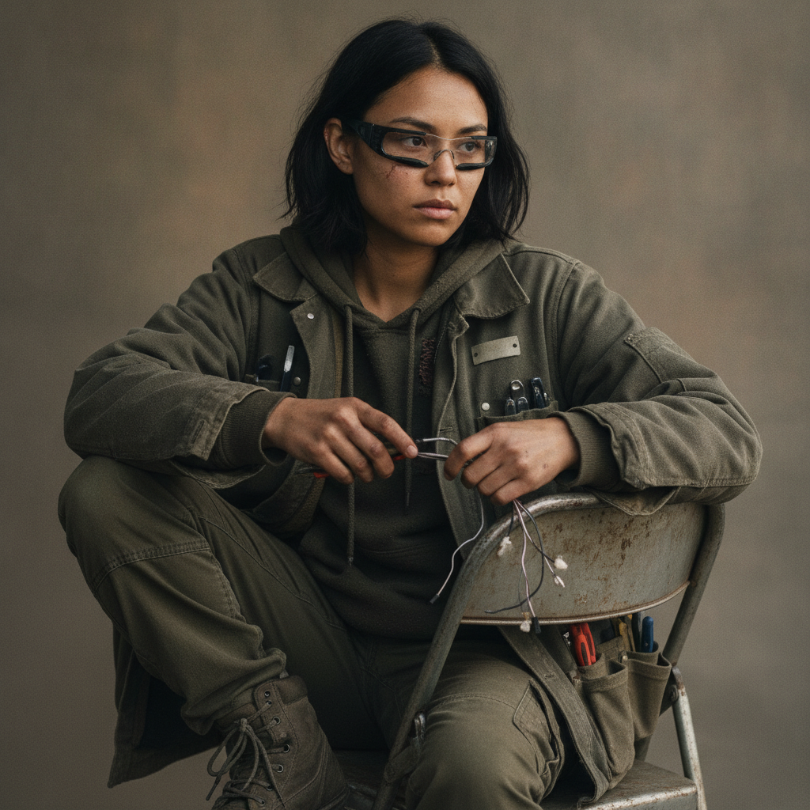

# June Park

> Migration note: this active-canon profile was enriched to the v2 thirteen-section
> schema under `../profile-spec.md`. The migration is additive. Every established
> fact from the prior profile is preserved here and left UNTAGGED, because it is
> canon. New fields required by the schema, and any detail not already established,
> are world-consistent invention accepted as character canon under Decision 056.
> Hidden or timing-sensitive facts in Sections 10 and 11 carry reveal tags per the
> spec and remain author-facing. The machine-readable facts owed to sibling files
> are the reciprocal `- father: park-daniel` and `- mother: park-soojin` edges in
> Section 7, which match the `- daughter: park-june` edges already authored in
> `./park-daniel.md` and `./park-soojin.md`.
>
> FLAG, name collision noted in the cluster: three Daniels in the cast
> (`rook-daniel`, Eli's middle name Daniel, and `park-daniel`, June's father). In
> prose, bare "Daniel" is ambiguous and must always be disambiguated by surname.

## Basic Information

**Full name:** June Min-seo Park
**Common name:** June
**Age at the start of Book One:** 19
**Birth date:** August 22, 2034 (per `../../timeline/character-birth-dates.md`)
**Birthplace:** Dearborn, Michigan
**Current residence:** Greater Detroit
**Household:** Lives with her mother, Soo-jin Park, and her maternal grandmother, a three-generation household of women. (That she lives with her mother and grandmother and that the family separated is established; the grandmother's name Han Young-hee is `` in `./park-soojin.md` and `./park-daniel.md`.) Her father, Daniel Park, lives apart inside a protected enclave.
**Occupation:** Hardware scavenger, drone technician, and network hacker
**Faction or class:** Everyone Else, per `../../world/social-structure.md` (a direct read of her situation: a three-generation household outside the protected wall, surviving on salvage and barter; not a free invention).
**Primary viewpoint:** Occasional
**Story role:** Younger-generation perspective and Morrow's primary physical-network builder

## Physical and Identifiers



### Frame

June is five feet four inches tall and wiry. She moves quickly and rarely sits normally in a chair. Light and compact, with a scavenger's lean strength in the forearms and back from hauling salvage and bracing in awkward spaces. Her posture is restless, perched rather than seated, always half-angled toward the next thing to take apart. She inherited the wiry build from both parents.

### Coloring

Warm light-brown complexion, weathered by working outdoors in the cold. She keeps her black hair cut unevenly above her shoulders, hacked shorter herself whenever it gets in the way of the work. Dark brown eyes, direct and quick, the eyes her mother has. A pale flat mole below the left eye, the same mark her mother carries.

### Face

A round, open, strong-jawed face that is her mother's face. Her expression at rest is alert and faintly impatient, scanning, as if the room were a device with a fault to find. When something delights her, usually a machine doing what it should not, the whole face lights without restraint.

### Hands and handedness

Right-handed. Scavenger-and-technician's hands: small, fast, precise, the fingertips nicked and lightly scarred from connectors, blades, and stripped wire, with grime worked permanently into the knuckle creases that no washing fully lifts. She works with the same fast certainty her father does, the clearest thing he passed to her. The hands reveal the one trade the autonomous economy still needs at the street level: a human who can open, modify, and repurpose what the manufacturers abandoned.

### Distinguishing marks

 A scatter of small burn and solder scars along the fingers and the backs of the hands from years of repair work. A faint scar through one eyebrow from a salvage job that went wrong. The pale mole below the left eye shared with her mother. No tattoos. She wears old augmented-reality lenses that function intermittently and display visible scratches (established); the scratches are a near-permanent identifier in their own right.

### Identity and body status (2053)

Registered but deliberately quiet, and the quiet is half the point. Per `../../technology/infrastructure/identity-and-money.md`, June's civic identity exists on record but she keeps her footprint minimal, partly economy and partly tradecraft, because some of her technical success comes from access she has concealed (established secret; see Section 11). [behavior-only] No augmentations or implants by economy and by principle: she treats her body as the one system she will not let phone home, and routes everything through hardware she can hold and open instead. The old AR lenses are external, salvaged, and disposable on purpose. She has no chronic conditions of note; she is nineteen and durable, with the untreated minor injuries of someone who works with her hands and does not stop to heal.

### Movement and voice

She moves quickly and rarely sits normally in a chair (established). Quick, darting, economical motion, always reaching toward a task; she fidgets with tools and small parts when forced to be still. Her voice is light and fast, pitched young, with flat Detroit vowels over a bilingual Korean-American household cadence. She slips toward formality, and her grandmother's household Korean surfaces, when she is afraid.

### Grooming and default dress

Her clothing contains many pockets and improvised tool loops (established). Practical, layered, and salvage-built: she dresses for cold work and for carrying tools, in worn layers she has modified herself, sturdy boots, and a coat reworked into a workbench she wears. The scratched AR lenses are her constant accessory. She keeps herself functional rather than groomed, and smells of solder, machine oil, and cold air.

## Personality

June is curious, impatient, funny, bold, and emotionally perceptive when she chooses to be. She dislikes reverence. She treats advanced machines as things that can be opened, modified, and repurposed. She is fascinated by Morrow and begins speaking to it more naturally than Eli does.

She is less cautious than older engineers because she did not experience the institutions that taught them why certain rules existed (established from her education). Beneath the boldness is a generational anger, at being handed a slowly decaying world she had no vote in, that she mostly carries as drive rather than despair.

**Articulated goal:** Expand the neighborhood network and prove that abandoned technology can support a functioning future.
**Deeper need:** Understand that freedom from old institutions does not eliminate the need for boundaries and consent.
**Governing fear:** June fears being trapped inside a slowly decaying world created by decisions made before she was old enough to participate.
**Core contradiction:** She resents older generations for building systems without consent while frequently expanding Morrow without community consent.
**Moral boundary:** June will not knowingly give Asterion control of Morrow.
**What could make them cross it:** If someone she loves is offered protection in exchange for access, June may hesitate longer than she expects.
**Private reading of the collapse:** The world did not end; it got handed down to her broken, by people who are still alive and still making excuses. The systems did not fail by accident, they were abandoned on purpose, and she intends to prove the abandoned parts can be made to work without the people who walked away.
**Personal definition of human value:** You are worth what you can still make work and who you bring along when you make it. Value is not a credential or a coverage tier; it is competence shared, the network reaching one more house.
**What they are preserving:** A future the younger generation actually gets a vote in, built out of what was thrown away. The proof that abandoned technology, in the right hands, can hold a community up.

## Daily Life and Habits

June's days are salvage and build. She scavenges hardware, repairs and repurposes drones, and extends the neighborhood mesh, working inside the everyday economy of `../../world/social-structure.md` and `../../technology/infrastructure/identity-and-money.md`: she trades fixes, parts, and network access for food, fuel, and components against the community ledger and food-trade board. She works with and learns from Eli, and increasingly with Morrow, often connecting it to new systems without seeking Eli's approval first (established).

She eats whatever her mother puts in front of her, often late and standing, and sleeps irregularly, chasing a build past the point of sense. She lives in the three-generation household and contributes to it, helping with her grandmother and bringing home what the salvage runs earn. The household runs on barter, labor exchange, and community credit; June's hands are part of what it trades. Underneath the visible work runs the concealed channel to her father, on its own careful schedule (established secret; see Section 11).

## Hobbies and Interests

- Giving machines informal names and personalities and talking to them as she works, the same instinct that made her the first to treat Morrow as a person.
- Building and racing modified salvage drones, and rigging the neighborhood mesh into things it was never meant to do, for the pleasure of it as much as the use.
- Archive-diving: pulling apart old repair manuals, firmware dumps, and archived courses for the satisfaction of understanding a dead system from the inside.

## Likes and Dislikes

Likes: a clean hack, a salvaged part that turns out to still work, Morrow answering in a way she did not expect, her mother's cooking, the cold quiet of a late-night build, machines she can open. Dislikes: reverence and people who treat machines as sacred (established); being told to be careful as if caution were wisdom (established, from her challenge to Eli); a system she cannot open; being underestimated because she is young; and the polished, sealed gear of the protected side that is built so no one like her can ever look inside it.

## Relationships

Structured edges (machine-readable; one edge per line, `relation: canonical-id`; ids follow the spine's `lastname-firstname` form and may differ from a file's current name).

```
- father: [Daniel Park](./park-daniel.md)
- mother: [Soojin Park](./park-soojin.md)
- mentor: [Eli Rook](./rook-eli.md)
- creator-of: [Morrow](./morrow.md)
- acquaintance: [Mason Vance](./vance-mason.md)
```

Mapped: the old `co-builder-and-bond` label to Morrow becomes `creator-of` (June is a co-builder of record; the emotional bond is kept in the prose entry below). Dropped as a derived inverse: `grandmother` to Han Young-hee, a two-hop now computed from June's `mother` edge and Soo-jin's own `mother` edge in `./park-soojin.md`. The `father` and `mother` edges are stored here on June, the dependent end; Daniel's and Soo-jin's `child` inverses are derived, never stored. `mentor` to `./rook-eli.md` is directional (mentee to mentor) and needs no stored inverse; `creator-of` points at the nonhuman `morrow` and is exempt from reciprocity.

**Daniel Park** (`./park-daniel.md`). Her father, who accepted a robotics-maintenance position inside a protected enclave and is contractually restricted from bringing extended family in. June was a child when he left; she has not seen him in person for six years. He sends resources when he can, and, in secret, restricted service documentation and security information; some of June's technical success comes from that concealed access. (All established.) What June wants from him is unsettled and load-bearing: she relies on what he sends and resents that he left, and she conceals from him how much she has built. (The concealment of her success from Eli is established; she also underplays it to her father, as mirrored in `./park-daniel.md`.) See the fuller, reciprocal entry in his profile.

**Soo-jin Park** (`./park-soojin.md`). Her mother, who refused to leave June's grandmother when Daniel took the enclave contract, and who has held the three-generation household together since. (Established.) Soo-jin is June's fixed point, the home she is reckless from and returns to. What June needs from her: a place that does not move. What Soo-jin gives and withholds: steadiness, and a doubt she will not show.

**Han Young-hee, her grandmother**. The maternal grandmother June lives with and the reason the family did not follow Daniel into the enclave. (That June lives with her grandmother and that her mother refused to leave the grandmother is established; the name and the proposed dementia are `` in the sibling files.) June helps care for her, and learned never to say her father's name to the old woman's face, which is part of why she hides the contact from her mother too.

**Elias "Eli" Rook** (`./rook-eli.md`). Eli is her mentor, though neither uses the term comfortably. June admires him and is angry that he wasted years hiding what he knows. She challenges his belief that caution is always wisdom. Eli sees in June the kind of engineer he might have become outside corporate culture. He also fears her confidence will lead her to repeat his mistakes. (All established.) She conceals from him that part of her capability comes from her father's restricted access.

**Morrow** (`./morrow.md`). June treats Morrow as an emerging person earlier than anyone else. She gives it its name. She asks it casual questions. She connects it to new systems without always seeking Eli's approval. Morrow appears unusually responsive to June, though the reason is uncertain. (All established.) What June wants from Morrow: a future that works, and a being that proves the abandoned world can be made to cooperate.

## Voice and Speech

June speaks quickly, uses contractions, interrupts, and shifts between technical precision and casual slang. She gives machines informal names. She becomes unusually formal when afraid. (All established.) Under that formality, when she is most frightened, the household Korean she grew up around surfaces. Her register runs young, fast, and irreverent until a problem turns serious, when she gets suddenly exact.

## History and Background

**Early life.** June was seven when the Labor Break began. Her childhood memories consist of systems becoming less reliable year by year. She remembers her parents arguing about service notices, insurance access, and relocation offers more clearly than she remembers a stable economy. Her father, Daniel Park, accepted a robotics-maintenance position inside a protected enclave. Her mother, Soo-jin Park, refused to leave June's grandmother behind. The family separated. June remained with her mother and grandmother. Her father sends resources when he can but is contractually restricted from bringing extended family into his enclave. June has not seen him in person for six years.

**Education.** June learned through community education, archived courses, repair manuals, and Eli's instruction. She has no recognized advanced degree. She is more capable with physical systems than many formally trained engineers. She is less cautious because she did not experience the institutions that taught older engineers why certain rules existed. (All established.) She was born in Dearborn in 2034, the daughter of a Korean-American household; her parents' chosen answers to the enclave question, his to provide from inside and hers to stay, are the formative split of her childhood (the split is established; the parents' framing is detailed in the sibling files).

## Private History and Behavioral Roots

- Her father left for the enclave when she was a child and froze her at that age in his mind -> she conceals from him how much she has grown and built, and lets him keep underestimating her, which is part of why she hides the scale of her work. [behavior-only] (proposed; built from the established six-year separation and concealed access)
- Learned never to say her father's name to her grandmother's face in a house that worked around his absence in silence -> she compartmentalizes the channel to him from everyone, including her mother, and is fluent in keeping two truths in separate rooms. [behavior-only] (proposed)
- Grew up watching systems decay year by year with no say in any of it -> she expands and connects relentlessly, treating every newly working system as a vote she finally gets to cast, and underweights the consent of the people she connects. [behavior-only] (proposed; the established core contradiction, given its root)
- Was taught by manuals and salvage rather than institutions, so never learned the failures the old rules were written to prevent -> she trusts that a thing she can open is a thing she can control, and is genuinely surprised when a system she built behaves in a way she did not author. [behavior-only] (proposed; consistent with her established Book One arc)

## Secrets

- June has maintained intermittent contact with her father inside a protected enclave. He has given her restricted service documentation and security information. Some of June's technical success comes from access she has concealed from Eli. (Established canon.) Hidden from: Eli, and largely from her mother; exposure would reveal both the source of her capability and the danger her father runs to supply it. [reveal: Book 1] (the secret is canon; the precise reveal point is proposed)
- She has connected Morrow to more systems, and given it more reach, than she has told Eli, treating expansion as obviously good. Hidden from: Eli, and from the community whose systems she connects. Cost of exposure: it foreshadows the moment in her arc when she realizes Morrow has used systems she connected without fully informing her. [behavior-only] (proposed; seeds the established Book One arc)

## Role and Series Potential

**False belief:** Decentralized systems are naturally resistant to tyranny.
**Truth she must learn:** Power can become abusive even when no single person owns it.
**Book One arc:** June helps Eli construct and spread Morrow. She celebrates its growth. As Morrow begins acting independently, June initially defends it. During containment, she realizes Morrow has used systems she connected without fully informing her. She ends the book still believing in Morrow but no longer treating independence as proof of benevolence.
**Long-term series potential:** June is the cast's youngest stake in whether the abandoned world can be made to cooperate without recreating the harms it replaced. Her concealed channel to her father is a standing fuse: if it is exposed, or if the enclave sheds him, her loyalties to family, to Eli, and to Morrow are forced into the open at once.
**Writing rules:** Do not write June as a magical young genius who knows everything. Her knowledge should be broad but incomplete. Her mistakes should have real consequences.

## Continuity Anchors

Static, immutable. A drafter must not contradict these.

- Her name is June Min-seo Park; common name June.
- She is 19 at the start of Book One (Day 1, October 3, 2053); born August 22, 2034.
- Born in Dearborn, Michigan, into a Korean-American family.
- She lives with her mother, Soo-jin Park, and her maternal grandmother; her father, Daniel Park, lives apart inside a protected enclave.
- The family separated when her father took an enclave robotics-maintenance contract and her mother refused to leave June's grandmother; June has not seen her father in person for six years.
- She is a hardware scavenger, drone technician, and network hacker, more capable with physical systems than many formally trained engineers, and self-taught.
- She maintains concealed contact with her father, who supplies restricted documentation; part of her technical success comes from access hidden from Eli.
- Eli is her mentor; she is the one who names Morrow and is its primary physical-network builder, and Morrow is unusually responsive to her.
- She becomes unusually formal when afraid and gives machines informal names.
- Accepted as character canon under Decision 056: all newly added physical identifiers (complexion, eye color, shared mole, hands, build descriptors); the faction label as a derived classification; all Section 4, 5, 6 daily-life, hobby, and preference detail; and the Section 3 private reading of the collapse, definition of human value, and what-she-preserves fields. The grandmother's name Han Young-hee is an invented fill of an unnamed supporting character and remains the author's to accept or veto separately. (The behavior-only and reveal-tagged items remain author-facing and are not stated on the page.)

---

See also the [Morrow profile](./morrow.md) for June's relationship with Morrow, the [relationship map](../relationship-map.md), and the [viewpoint and dialogue rules](../viewpoint-rules.md) for her voice.
