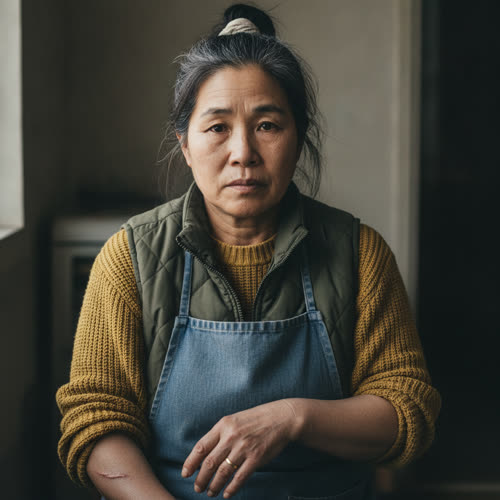

# Soo-jin Park

> Status: DRAFT. Generated under `../profile-spec.md` for the Park-family cluster.
> The only fixed facts are those traced to June Park's active-canon profile
> (`./park-june.md`) and tagged `[open]`: that Soo-jin Park is June's mother, that
> she refused to leave June's grandmother when Daniel took the enclave contract,
> that the family separated, and that June lives with her mother and grandmother
> in Greater Detroit. Everything else is enrichment: the flavor facts (maiden name,
> age, birth date, birthplace, occupation, physical identifiers, and surface detail)
> are accepted as character canon under Decision 056. The mother's name Han
> Young-hee and her details remain the author's to accept or veto. Behavior-only
> and reveal-tagged items remain author-facing. The profile stays a draft pending
> author activation and the enrichment is reversible.

## Basic Information

**Full name:** Soo-jin Park (수진); born Han Soo-jin
**Common name:** Soo-jin [open] (the name June's profile gives her)
**Age at the start of Book One:** 48
**Birth date:** February 9, 2005 (not listed in `../../timeline/character-birth-dates.md`; carried here for the spine; places her at 29 at June's birth on August 22, 2034, a normal gap)
**Birthplace:** Detroit, Michigan
**Current residence:** A house in Greater Detroit, in the eroding outside world, not a protected enclave [open that she is outside the wall]
**Household:** Lives with her daughter June Park and her own mother, June's grandmother, a three-generation household of women. [open] Separated, not divorced, from her husband Daniel Park, who lives inside an enclave.
**Occupation:** Home caregiver to her mother, and the neighborhood's informal eldercare and medication hand, trading care, cooking, and nursing labor into the community economy. Proposed former occupation: a pharmacy technician before the withdrawal, which is why neighbors bring her their medication questions now.
**Faction or class:** Everyone Else, per `../../world/social-structure.md`. [open, derived from `./park-june.md`] She is not merely outside the protected systems; she chose to stay outside them, declining the enclave entry that following Daniel would have given her.
**Primary viewpoint:** No. She is off-page through approved Chapter 2 and is not a point-of-view character in Book One.
**Story role:** June's mother and the moral anchor of the Park split. The parent who stayed, the keeper of the three-generation household June leaves from and returns to, and the living embodiment of the refusal to sort one's own family into the kept and the abandoned.

## Physical and Identifiers



### Frame

Five feet three inches, small and wiry, the build she passed to June. Her posture is upright and braced, the carriage of a woman who lifts and turns an aging parent several times a day. Strong for her size, with a caregiver's practical back and a way of planting herself in a doorway. She does not slump even when exhausted, which is most of the time.

### Coloring

Warm light-brown complexion, weathered at the hands and reddened across the knuckles from cold-house work and cold water. Black hair, straight and thick, going gray at the part, kept shoulder-length and tied back out of the way with whatever is nearest. Dark brown eyes, direct and quick, the eyes June has.

### Face

A round, open, strong-jawed face, lined at the brow from worry and at the mouth from a habit of pressing her lips when she will not say a thing. This is the face June carries. Her expression at rest is composed alertness, a woman listening for a sound from the next room. The composure is a discipline; she has decided her household will not run on her panic.

### Hands and handedness

Right-handed. Caregiver's and cook's hands: short clean nails, strong thumbs, the backs chapped and the palms toughened, a faint permanent smell of garlic, ginger, and antiseptic soap. Small healed nicks from kitchen knives. Her hands reveal the two kinds of work that fill her days, feeding people and tending a failing body, both done by hand because the systems that used to help have withdrawn. June's quick precision is her father's; Soo-jin's hands are slower and surer.

### Distinguishing marks

A long thin burn scar on the inside of the right forearm from a pot of boiling bone broth years ago. A pale flat mole below the left eye that June also has, mother and daughter marked the same. A worn gold wedding band she still wears, on her finger, not on a chain, a fact she does not explain and no one asks about. A small old scar through the left eyebrow from a childhood fall. No tattoos.

### Identity and body status (2053)

Legally registered, deliberately outside. Soo-jin's verified digital identity is intact, and that is what makes her status a choice rather than an accident: as Daniel's spouse she was eligible to enter the enclave with him, and she declined, letting her enclave-spouse eligibility lapse rather than leave her mother. [open that she refused, per `../../technology/infrastructure/identity-and-money.md`] She lives now in the care-without-a-bill economy, trading and bartering for what the withdrawn systems no longer provide. No augmentations, by economy and by principle; she distrusts anything that has to ask a server for permission, having watched permissions decide her own family. [behavior-only] (proposed) Chronic conditions: early osteoarthritis in both hands and a chronic caregiver's fatigue, managed by rest she rarely takes and by Lena's community clinic. Her mother, June's grandmother, is the household's real medical gravity, see Relationships.

### Movement and voice

She moves with the efficient, unhurried economy of a woman who has measured exactly how much energy a day requires and refuses to spend more. Her voice is low, warm, and level, with flat Detroit vowels and a Korean cadence under them, and she code-switches fluidly into Korean with her mother, often mid-sentence, the household language braided through the English. [behavior-only] (proposed) When she is most afraid she goes quiet and very practical, and she slips into formal Korean with her mother, the same retreat into formality-under-fear that June carries. [behavior-only] (proposed)

### Grooming and default dress

Practical and warm, dressed for a cold house and physical work. Layered sweaters and a quilted vest indoors through the cold months, an apron she cooks and nurses in, sleeves she can push up fast, hair tied back. Soft sure-footed shoes for a floor she crosses a hundred times a day. Little jewelry but the wedding band. Scent of cooking and clean soap. She keeps herself and her mother neat as a matter of dignity, even as the house goes cold around them, the same way Marisol keeps her shop's warm light, see `./vega-marisol.md` for the shared register of dignity-as-signal.

## Personality

In public Soo-jin is steady, plainspoken, warm, and unsentimental, a woman neighbors bring both their sick parents and their hard questions to. She carries the household and a good deal of the street's quiet caregiving without naming it as sacrifice. In private she is tired in her bones, and she rations her own doubt the way she rations heat, letting almost none of it show, because she has decided that her certainty is the floor her daughter and her mother stand on. Her grief over Daniel is folded away and worked around, not displayed.

Her humor is dry, deadpan, and maternal, aimed at the absurdity of a world where the machines were kept warm and the people were not. She teases June in two languages and lands a verdict in the form of a shrug. [behavior-only register]

**Articulated goal:** Keep her mother comfortable and cared for, keep June fed and safe, and hold the household together through one more cold season.
**Deeper need:** To be certain she chose love and not stubbornness, and not to be, in her daughter's eyes, the one who broke the family.
**Governing fear:** That her refusal to follow Daniel cost June a father and a future, that June will come to blame her for it, and that her mother will die and the whole sacrifice will look, in hindsight, like it was for nothing. [behavior-only] (proposed)
**Core contradiction:** She refused the enclave to keep her family whole around her mother, and in the same act she split the family and lost her husband. She kept one dependent by losing a partner. [behavior-only] (proposed)
**Moral boundary:** She will not abandon her mother for comfort, and she will not place her own principles above June's actual safety.
**What could make them cross it:** If June's life genuinely depended on getting inside the wall, Soo-jin might finally cross her own line, accept Daniel's enclave, and leave her mother, the exact thing she swore she never would.
**Private reading of the collapse:** The world did not end. It decided some people were not worth keeping warm, and then it asked each family to sort itself into the ones who would be kept and the ones who would not. She refused to do the sorting, and she is not sorry, most days.
**Personal definition of human value:** You are worth the people you refuse to leave behind.
**What they are preserving:** An unbroken duty to her mother, and a home that June can leave from and always come back to. (Her entry in the Final Character Standard.)

## Daily Life and Habits

Her day is built around her mother. She wakes first, in a cold house, and the first thing she does every morning is go to her mother's room to see what kind of day it will be, because the dementia makes each morning a new negotiation. [behavior-only] (proposed) She manages medications by hand and by memory, the way the neighborhood now manages everything the cabinets and the clinics no longer guarantee. She cooks for three from what the food economy brings, trades nursing and cooking and her old pharmacy knowledge for eggs, fuel, and repairs, and keeps a careful place in the neighborhood's web of mutual care described in `../../world/social-structure.md`.

For money and goods she takes what moves: barter, labor exchange, community credit, the occasional national cash, per `../../technology/infrastructure/identity-and-money.md`. She brings her mother to Lena's clinic when the home care reaches its limit, and she is the kind of steady hand the clinic counts on in return. She sleeps lightly, half-listening for her mother the way Marisol half-listens for the compressor, and she is asleep before June most nights and awake before her every morning.

## Hobbies and Interests

- She makes kimchi and other ferments by hand, a craft inherited from her mother, and keeps making it partly for food and partly because the ritual is one of the last things that still reliably orients her mother and pulls a clear afternoon out of the fog.
- She keeps a small indoor herb and chili garden on a south windowsill for cooking and for the smell of something alive in a cold house.
- She mends and remakes clothes for the household and for trade, slow handwork done in the evenings, and she is good enough at it that neighbors bring her things to save.

## Likes and Dislikes

Likes: a clear morning when her mother knows her, the smell of fermenting cabbage and of garlic in hot oil, June home and eating, a full pantry however it was filled, her mother humming an old Korean song she did not know was still in there, the weight of the wedding band she has not removed. Dislikes: the silence after a bad night, the word "relocation," being pitied, anyone who speaks of her mother as a burden, the cold that gets into the house by February, and the particular careful brightness in June's voice that means the girl is hiding something.

## Relationships

Structured edges (machine-readable; one edge per line, `relation: canonical-id`). Canonical ids follow the spine's `lastname-firstname` form and may differ from the current filename of an existing profile.

```
- spouse: [Daniel Park](./park-daniel.md)          (separated, not divorced; noted in prose)
- patient-of: [Lena Okafor](./okafor-lena.md) (proposed; the clinic she brings her mother to; noted in prose)
```

Mapped: the old `spouse-separated` label becomes `spouse` (separated, not divorced; prose below), reciprocating `./park-daniel.md`. The old `clinic-physician` label becomes `patient-of`, a directional edge stored here on the patient end and pointing at Dr. Okafor; its `patient` inverse is derived, so `./okafor-lena.md` stores nothing back. Dropped as a derived inverse: `daughter` to June, now computed from June's `mother` edge in `./park-june.md`. Han Young-hee, Soo-jin's mother, is carried in prose only; she has no profile and no structured edge.

**Daniel Park** (`./park-daniel.md`). Her husband, separated by the wall, not divorced. [open that the family separated] She has not taken off the ring. They chose opposite answers to the same question, he that the family's value was what he could provide from inside, she that it was who she refused to leave, and the marriage has been suspended on that disagreement for six years. What she wants from him: an acknowledgment that staying was not stubbornness, that she chose right. What she will not give him: the satisfaction of being asked back before he admits leaving was wrong. See the mirrored entry in his profile.

**June Park** (`./park-june.md`). Her daughter, and the person her whole refusal was meant to keep a real childhood for. [open] Soo-jin reads June closely and lovingly and notices the careful brightness that means a secret, and she has decided not to dig, because she suspects what it is and cannot bear to forbid it or to join it. [reveal: Book 1] (proposed; the open question of how much Soo-jin knows about June's contact with Daniel is flagged for the author below) What she wants from June: that the girl not blame her, and not vanish into the work the way her father vanished into the wall. What June needs from her: a fixed point, a home that does not move.

**Han Young-hee, her mother**. The cause of the split and the center of Soo-jin's days. [open that Soo-jin refused to leave her mother, per `./park-june.md`] Proposed: she is about 75, an immigrant from South Korea who gave up a homeland to raise Soo-jin, and she now has advancing dementia, which made relocating her into a strange enclave genuinely cruel and made Soo-jin's refusal genuinely unanswerable. Soo-jin's bond to her is the moral floor of the whole profile: she cannot conceive of abandoning the woman who did not abandon her.

**Dr. Lena Okafor** (`./okafor-lena.md`). The clinic physician Soo-jin brings her mother to, and a woman whose choice rhymes with her own. [acquaintance] Lena refused a protected-enclave offer rather than abandon dependent relatives; Soo-jin refused to follow her husband rather than abandon her mother. They are two households, one moral spine. The bond is practical and respectful, two women holding elders against a withdrawn system, and Soo-jin is exactly the steady hand Lena relies on among the families. What each wants: that the other's people get through the winter.

## Voice and Speech

Low, warm, level, economical. Plain declarative sentences in English, braided with Korean to her mother, switching language by who she is protecting. She delivers hard things calmly, the way a nurse does, and she answers a worried question with a task. Verbal habit: she presses her lips and changes the subject rather than discuss Daniel, and she goes to the stove when his name comes up. [behavior-only] (proposed) Under real fear she goes quiet and very practical and slips into formal Korean, the same formality-under-fear June shows in English, per `./park-june.md`. [behavior-only] (proposed)

## History and Background

Soo-jin Han was born around 2005 in metro Detroit, the daughter of a Korean immigrant mother who had left her own country to raise her. She grew up bilingual and second-generation, trained into mid-skill healthcare-adjacent work as a pharmacy technician, the kind of specialist knowledge that the social structure of `../../world/social-structure.md` later drove local and informal. She married Daniel Park and they had June in Dearborn in 2034 [canon birthplace and date]. As the withdrawal deepened she folded her old work into neighborhood caregiving.

Around 2047, with June about thirteen, Daniel was offered a robotics-maintenance contract inside a protected enclave, on terms that would not admit her mother. [open, derived from `./park-june.md`] Soo-jin refused to leave her mother. The family separated. She kept June and her mother together as one household and has held it together through the six years since, in a cooling house, on barter and care and refusal. [open]

## Private History and Behavioral Roots

- Her mother gave up a homeland and a language to raise her -> Soo-jin cannot conceive of abandoning her mother for comfort, and refused the enclave even at the cost of her marriage, the same moral spine that drives Lena Okafor's refusal. [behavior-only] (proposed)
- The night Daniel left, and the choice itself, went unspoken in the house and stayed unspoken -> she presses her lips and goes to the stove whenever he comes up, and June learned never to say his name to her mother's face, which is part of why June hides the contact from her too. [behavior-only] (proposed)
- Watched the services withdraw politely, watched permissions decide her own family -> she trusts hands and neighbors and distrusts anything that needs a server's yes, and keeps the household on things she can touch. [behavior-only] (proposed)
- Carries a doubt she will not voice, that she might have chosen wrong -> she over-performs certainty for June and her mother, never letting either see her waver, because she has decided her steadiness is load-bearing. [behavior-only] (proposed)

## Secrets

- She half-knows that June still talks to her father and gets things from him, and she has chosen not to ask, because confirming it would force her either to forbid it or to join it, and she cannot do either. Hidden from: June, who thinks she has hidden it; and from herself, a little. Cost of facing it: it would reopen the whole question of Daniel and of her own choice. [reveal: Book 1] (proposed; see the flagged open canon question below)
- On the worst nights she drafts a message to Daniel she never sends, and she has never told anyone the door between them is not, in her own heart, fully closed. Hidden from: June, Daniel, herself. Cost: the admission that "not divorced" is not only paperwork. [reveal: Book 2] (proposed)
- She deliberately let her enclave-spouse eligibility lapse and never told June there had ever been a door, so the girl could not someday blame her for closing it. Hidden from: June. Cost: June learning that her mother chose, and chose to hide that there was a choice. [reveal: Book 2] (proposed)

## Role and Series Potential

In Book One, Soo-jin is off-page and structurally essential. She is the home front of June's life, the reason June has a fixed point to be reckless from, and the household whose stability June's secret channel to Daniel quietly threatens. Her refusal rhymes deliberately with Lena Okafor's and stands as one of the book's clearest images of a person declining to sort her own family into the kept and the abandoned. Book One arc, off-page: she holds the household as the winter and the surveillance close in, sensing more than she says about what June is doing. Long-term series potential: a natural on-page anchor for any June viewpoint chapter, a moral counterweight to both Daniel and the enclave question, and a character who could be forced, in a later book, to finally face her own choice if June's safety ever requires the wall she refused. False belief, if promoted: that her certainty has to be total to be a floor for the others. Truth she would learn: that June can carry the truth of her mother's doubt, and would rather have it than the performance. Writing rules: do not make her a saint of sacrifice; the refusal cost her marriage and she knows it. Do not resolve the marriage cheaply in either direction. Keep her doubt private and load-bearing, never spoken to June on the page before its reveal point. Let her competence read as discipline, not serenity.

## Continuity Anchors

Static, immutable. A drafter must not contradict these.

- Her name in canon (`./park-june.md`) is Soo-jin Park. [open]
- She is June's mother. [open]
- She refused to leave June's grandmother, her own mother, when Daniel accepted the enclave contract. [open]
- The family separated as a result; June remained with her mother and grandmother in Greater Detroit. [open]
- She is 29 years older than June, a normal generational gap; no teen parenthood in the Park family. (derived from canon birth dates; June's date is canon)
- FLAG, open canon question: `./park-june.md` establishes that June conceals her contact with Daniel from Eli, but is silent on whether Soo-jin knows. This profile proposes that Soo-jin half-knows and does not ask. This is `` and must not be treated as settled; the author should confirm what Soo-jin knows, since it governs several Section 11 entries and the June-Soo-jin dynamic.
- Accepted as character canon under Decision 056: the maiden name Han; age 48; birth date February 9, 2005; birthplace Detroit; the second-generation Korean-American origin; the former pharmacy-technician occupation and current caregiving role; "separated, not divorced" marital status and the unremoved ring; the lapsed enclave-spouse eligibility; the clinic acquaintance with Lena Okafor; and all physical identifiers and surface detail in this profile. The mother's name Han Young-hee, her age, and her dementia are an invented fill of an unnamed supporting character and remain the author's to accept or veto separately. (The behavior-only and reveal-tagged items remain author-facing and are not stated on the page.)
