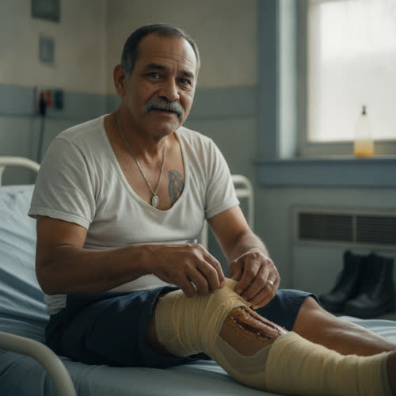

# Hector Reyes

## Basic Information

**Full name:** Hector Reyes
**Common name:** The Reyes man [open] (the only name given in approved Chapter 2)
**Age at the start of Book One:** 58
**Birth date:** April 18, 1995 (not listed in `../../timeline/character-birth-dates.md`; invented under Section 6 and offered to the spine)
**Birthplace:** Detroit, Michigan, to a Mexican-American family (grounds the surname and a working-class Detroit origin)
**Current residence:** The Reyes place, a household in Lena's neighborhood, Greater Detroit; presently a ward bed at the clinic while the leg heals
**Household:** The Reyes family, a working household that needs eggs from the board. At least one other adult keeps the place going while he is laid up. [open that the Reyes place is a family and a board node]
**Occupation:** A neighborhood handyman and hauler, the kind of physical fix-and-carry work the local economy now runs on, currently sidelined by the leg
**Faction or class:** Everyone Else, per `../../world/social-structure.md`. [open] (His dressing is gauze and a neighbor's salve because the smart-foam supplier withdrew.)
**Primary viewpoint:** No. He is never a point-of-view character.
**Story role:** Minor walk-on. The body the withdrawal of supply is written on: a healing leg that should have had a smart foam and gets hand-changed gauze instead. He is both a clinic patient and a household on Dembélé's board, the "needs" end of the egg chain whose "has" end is the Vesely place.

## Physical and Identifiers



### Frame

Five feet nine inches, compact and muscular gone a little soft at the middle in his late fifties, a working man's durable build. Laid up in the ward bed he is restless in it, propped to keep the leg right, a man unused to lying still. Upright he carries himself with the rolling, weight-bearing ease of someone who lifts and hauls for a living.

### Coloring

Medium brown complexion, tanned darker on the forearms and neck from outdoor work. Black hair going salt-and-pepper, thick, cut short and practical, with a heavy mustache kept trimmed. Dark brown eyes, patient and observant, the eyes of a man who has learned to wait out a slow process.

**Heritage:** Mexican-American, Latino: Detroit-born, working the trades.

### Face

A square, friendly face, broad through the jaw, lined at the eyes from squinting and laughing both, the resting expression open and a little rueful. The mustache and the smile lines make him read as approachable. Right now there is the gray underweather of someone in low-grade pain and bored by it.

### Hands and handedness

Right-handed. Tradesman's hands: thick-fingered, callused across the palms and the base of the fingers, nails broken short, old nicks and a permanent ground-in working dirt no scrub fully takes. Even in the bed they want a task, picking at the blanket, testing the edge of the dressing. The hands reveal a life of hauling, fixing, and lifting, the local handyman economy done by hand.

### Distinguishing marks

The leg wound itself: a deep gash along the right shin, "a leg that should have had a particular dressing," now packed with plain gauze and a neighbor's salve and slowly closing, "the leg was clean, the leg was healing." [open] Older marks: a long pale scar across the left forearm from sheet metal, a thumbnail permanently black-ridged from an old hammer blow, the scattered burns and nicks of decades of physical work. A small religious tattoo over the heart, a faded Guadalupe, from his twenties. A chipped front tooth never capped.

### Identity and body status (2053)

Legally registered, institutionally stranded, per `../../technology/infrastructure/identity-and-money.md`. His verified identity exists; the supply chain it used to reach, the one that would have shipped the smart foam that reads a wound and wicks and reports, has stopped supplying, so his leg is dressed the old slow way by hand. [open, derived] No augmentations, no implants; a working man who never had the money or the inclination. No prosthetics. Chronic conditions: the beginnings of the diabetes that runs in the family, undiagnosed-by-machine and managed by Lena's eye and diet, which is part of why the shin is slow to close, a wound that in a supplied world would have been a minor thing and now is a ward stay.

### Movement and voice

Normally he moves easily under load, a hauler's economy; in the ward he is hobbled and hates it, shifting to spare the leg. His voice is warm, easy, and unhurried, a Detroit accent with a Spanish music under it from the household he grew up in, quick to a joke and slow to a complaint. He talks to pass the boredom of the bed.

### Grooming and default dress

Practical and clean as the ward allows. Out of the bed his default is work clothes, a flannel or henley, canvas trousers with the wear of tools, steel-toe boots, a cap, layered against the cold. In the ward he is in a worn undershirt and the blanket, the boots set by the bed where he can see them, a working man keeping his gear close. Scent of antiseptic and the herbal salve now, sawdust and engine oil normally. A worn wedding band and a thin saint's medal on a chain.

## Personality

In public Reyes is genial, talkative, and self-deprecating, the neighbor who jokes with the person tending him, "you'd have had me scanned and stitched and out the door in an hour, time was." [open] He carries discomfort lightly and turns his own helplessness into a wry observation rather than a grievance, partly to put the person caring for him at ease. In private he is anxious under the geniality, a provider laid up while his household needs both his hauling and the eggs his board node is short, a man measuring how long the leg will keep him from earning.

His humor is warm, nostalgic, and aimed at the absurd contrast between the old fast world and the slow new one, the hour's scan-and-stitch against the five careful minutes of a doctor's eyes. He uses it to thank her without embarrassing either of them.

**Articulated goal:** Heal the leg and get back on his feet, back to the hauling and fixing that keeps his household fed and supplied on the board.
**Deeper need:** To be the one who provides and carries, not the one carried, to not become a man his family and his street have to dress and feed.
**Governing fear:** That the leg does not close, that the slow thing becomes the permanent thing, and a working man becomes an invalid in a world that has no machines left to fix him fast.
**Core contradiction:** He jokes that he misses the scan-and-stitch hour, the machine speed, even as his whole survival now rests on the hand work and the neighbors the machines made unnecessary, and he is being healed by exactly the slow human care he half mourns.
**Moral boundary:** He will not take from the board more than his household truly needs, will not let his being laid up become an excuse to draw down eggs and care a worse-off neighbor could use.
**What could make them cross it:** If the leg kept him down long enough and the household got hungry enough, he might let his need on the board creep past honest, taking the Vesely eggs a sicker house should have, and tell himself it was temporary.
**Private reading of the collapse:** The fast world was better and it left. Time was, a thing like this leg was an hour and a door; now it is a ward bed and a salve a woman's grandmother taught her. He does not romanticize the slow way. He is grateful for it and he misses the speed, and he holds both without pretending the trade was good.
**Personal definition of human value:** You are worth what you can carry and fix for the people who count on you. Value is being able to work.
**What they are preserving:** His ability to provide, the working body that hauls and fixes and keeps a household and a board node supplied, and the good humor that keeps the people tending him from feeling it as a burden. (His entry in the Final Character Standard.)

## Daily Life and Habits

Normally his day is physical and various, hauling, fixing, clearing, the patched-together handyman work the local economy runs on, paid in trade and in placement on the board. [proposed; the board node is canon] Right now his day is the ward: the slow hours of a healing leg, the dressing changed by hand under the work light, the boredom, the watching of the other beds, the visits from whoever keeps the Reyes place going while he is down. [open that the leg is hand-dressed in the ward]

For money he trades labor, the most barterable thing there is, per `../../technology/infrastructure/identity-and-money.md`. [open] His household is a "needs" node on Dembélé's board, "what the Reyes place needed," and the Vesely eggs are part of what answers it. [open] He eats what the household and the chain provide; laid up, he eats what the ward and the board send. He will go home to the Reyes place when Lena lets him, and back to the work the moment the leg holds.

## Hobbies and Interests

- Working on engines and old machines, cars and small motors, the satisfaction of bringing a dead thing back, a trade and a pleasure at once.
- Soccer, watched on whatever still broadcasts and argued about with the neighbors, and once played; a lifelong loyalty to a team.
- Cooking for the household, especially weekend food, carne and beans and the dishes his mother made, a provider's pleasure in feeding people.

## Likes and Dislikes

Likes: a job that comes out clean, an engine that turns over, the speed of the old world remembered fondly, good food at a full table, soccer, a joke that lands, the smell of cut wood and hot oil (the nostalgia for the fast scan-and-stitch is canon-grounded; the rest accepted as canon (Decision 056)). Dislikes: lying still, being waited on, the salve's smell he is too polite to mention, a wound that will not close, owing the board more than he brings, and the boredom of the bed (the impatience and the slow healing are canon-grounded; the rest accepted as canon (Decision 056)).

## Relationships

Structured edges (machine-readable; one edge per line, `relation: profile-slug`):

```
- patient-of: [Lena Okafor](./okafor-lena.md)
```

Re-homed (barter logistics, not edges, per profile-spec.md): the Reyes household
is a "needs" node whose egg requirement Dembélé's board answers from the Vesely
place. The former `needs-eggs-from` (Vesely) and `board-node-routed-by` (Dembélé)
labels are supply and routing logistics, not durable bonds, so they are dropped
from the edge list and carried in the descriptive prose below. Kept: the
directional `patient-of` edge, stored here on the patient (Reyes); the clinician
inverse is derived by traversal, never stored.

Reciprocity note: `patient-of` is directional and not reciprocity-checked, and
`okafor-lena` is out of this batch. The salve woman "three streets over" who
cooked the dressing from her grandmother's recipe remains a referenced-but-unnamed
individual in approved Chapter 2, with no id, out of this cluster's create-list,
flagged for a future generation pass.

**Dr. Lena Okafor** (`./okafor-lena.md`). The doctor changing his dressing by hand under the work light, the old slow way, because the smart foam stopped coming. [open] He jokes with her about the lost speed and lets her tend him, and his easy talk is partly a kindness to a doctor doing five careful minutes of what a machine did in one. [open] What he wants from Lena: a closed leg and a discharge back to work. What she gets: a patient whose leg her own eyes can read as healing, a small clean win on a hard night.

**Marek Vesely** (`./vesely-marek.md`). The hen-keeper whose eggs answer his household's need on the board, "what the Reyes place needed." [open] A relationship made entirely through the chain; the two may barely speak, but Vesely's surplus is part of what feeds the Reyes table. What he wants from Vesely: eggs to keep the household in protein while he cannot earn. What Vesely gets: a neighbor to supply, a use for the flock's surplus.

**Dembélé** (`./dembele-sekou.md`). The board-keeper who routes the eggs his household needs, the man matching "the Reyes place needed" against "the Vesely place had." [open] What he wants from Dembélé: a fair place in the chain while he is down and not earning. What Dembélé gets: a node to route to, a need to balance against a surplus.

**The salve woman, three streets over** (referenced in approved Chapter 2; no profile yet, out of create-list). The neighbor who cooks the salve "from something her grandmother had cooked," now on his leg. [open] An anonymous but load-bearing care relationship: her grandmother's recipe is part of what is healing him. Flagged for a future generation pass.

## Voice and Speech

Warm, easy, and wry. He talks readily, especially when bored or in pain, and leans on nostalgia and self-deprecation, "you'd have had me scanned and stitched and out the door in an hour, time was." [open] His vocabulary is a tradesman's, concrete and tool-bound, with a fondness for the old fast way named plainly. A Spanish music runs under the Detroit accent. Verbal tic: he marks the gap between then and now with "time was," holding the old world and the new one in the same sentence without bitterness. Under stress he jokes more, not less, using humor to spare the person tending him.

## History and Background

Born in Detroit to a Mexican-American family in the working trades, he came up with tools in his hands and never left them, doing the fix-and-haul work that kept on existing at neighborhood scale after the big employers withdrew. [proposed, grounds the handyman economy] He married and built the Reyes household; as the city's supply chains thinned, his kind of physical, local, barterable skill became more valuable rather than less, the work that does not automate away, and he became a fixture of the trade economy, his household a standing node on the board. [open that the Reyes place is a board node]

By Book One a gash on the shin that the old world would have scanned, stitched, and closed in an hour has become a slow ward-bed wound, dressed by hand with gauze and a neighbor's salve because the smart-foam supplier stopped supplying. [open] The injury writes the whole withdrawal on a single working body: not a catastrophe, just a minor thing made major by the quiet disappearance of the supply that used to make it minor.

## Private History and Behavioral Roots

- Has been the provider and fixer his whole life, the one who carries -> being laid up and waited on shames him, so he turns his helplessness into jokes to keep from feeling like a burden and to put his caretaker at ease. [behavior-only] (proposed)
- Lived through the fast machine medicine and its disappearance -> he marks every slow new thing against the quick old one with "time was," grateful and grieving at once, never pretending the slower way is better. [behavior-only] (proposed)
- Family diabetes he half knows and half avoids, in a world with no machine to confirm it -> he downplays his own symptoms and lets a minor wound run slow, because admitting the chronic thing would mean admitting the working body is starting to fail. [reveal: Book 1] (proposed)
- Watched his trade survive the withdrawal when so many did not -> he carries a quiet, faintly guilty relief that his hands still earn, and overgives on the board to square the luck. [reveal: Book 2] (proposed)

## Secrets

- He is more frightened about the leg than the jokes let on, privately certain that if it does not close he is finished as a working man, and he hides the fear behind the genial talk so his household will not panic. Exposure would crack the provider's composure his family leans on. [reveal: Book 1] (proposed)
- He knows the family sugar sickness is on him and has told no one, not even Lena straight, because a working body that is failing is a thing he is not ready to be, and naming it would slow the leg's story into a longer, worse one. Exposure would force a reckoning with a chronic decline in a world with no easy machine to manage it. [reveal: Book 2] (proposed)

## Role and Series Potential

In Chapter 2 his function is to make the supply withdrawal physical and survivable at once. His leg "should have had a particular dressing, a smart foam that read the wound and wicked and reported," and instead gets "a tin of plain gauze and a salve a woman three streets over cooked," and the leg heals anyway, "the leg was clean, the leg was healing." [open] He is the chapter's proof that the hand and the eye can still do the work, and its quiet reminder of what was lost, the hour-long fix become a ward stay. He is also the human "needs" end of the egg ledger, balancing the Vesely "has" end. Book One arc, minor: the laid-up provider learning to be carried, and the wound as a slow clock on a working body. Long-term series potential: if promoted, he is a natural early beneficiary and skeptic of any system that promises to restore the fast supply, a man who misses the speed and distrusts the new owner of it; his handyman network and his board node make him a practical organizer if the neighborhood ever has to coordinate at scale. False belief, if promoted: that he can outwork the failing body and the lost supply both. Truth he would learn: that being carried for a season is not the end of being a provider.

Writing rules: keep the humor as kindness and cover, not as comic relief; the fear is real underneath. Do not let the salve and the hand-healing become a tidy lesson that the old world was bad; he genuinely misses the speed. Let the leg be a real clock, not a quick recovery.

## Continuity Anchors

Static, immutable. A drafter must not contradict these.

- His name in approved prose is "the Reyes man"; the household is "the Reyes place" and "the Reyes family." [open]
- He is in the second bed of the ward with a healing leg. [open]
- The leg "should have had a particular dressing, a smart foam that read the wound and wicked and reported," from a supplier that stopped supplying. [open]
- It is dressed instead with "a tin of plain gauze and a salve a woman three streets over cooked from something her grandmother had cooked," changed by hand under the work light. [open]
- "The leg was clean. The leg was healing." [open]
- He says: "You'd have had me scanned and stitched and out the door in an hour, time was." Lena answers, "Time was." [open]
- The Reyes place is a node on Dembélé's board: the board matches "what the Vesely place had and what the Reyes place needed." [open]
- Accepted as character canon under Decision 056: given name Hector; age 58; birth date April 18, 1995; Detroit birthplace and Mexican-American origin; the handyman occupation and work-injury cause of the wound; the family diabetes; the household composition; all physical identifiers; all Section 10 and 11 entries. (the behavior-only and reveal-tagged items remain author-facing and are not stated on the page)
