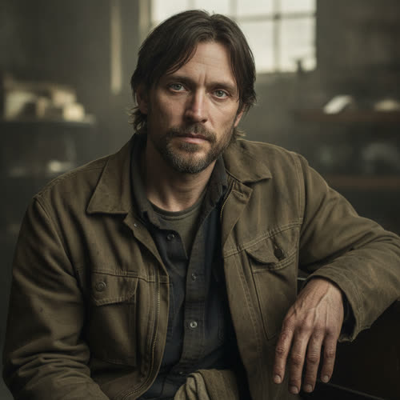

# Elias “Eli” Rook

> Status: ACTIVE-CANON, enriched in place under `../profile-spec.md`. Every fact
> from the original profile is preserved verbatim and untagged. Sub-blocks and
> sections required by the schema that canon did not fix are filled by
> world-consistent invention, accepted as character canon under Decision 056.
> Hidden or timing-sensitive facts carry a reveal tag per spec Section 5 and
> remain author-facing. The existence of Morrow remains the central secret and is
> gated `[reveal: Book 1]`.

## Basic Information

**Full name:** Elias Daniel Rook
**Common name:** Eli
**Age at the start of Book One:** 38
**Birth date:** February 11, 2015 (per `../../timeline/character-birth-dates.md`)
**Birthplace:** Flint, Michigan
**Current residence:** A deteriorating residential neighborhood in Greater Detroit
**Household:** Lives alone in quarters attached to his repair shop. Divorced from Nora Bell for six years when Book One begins; no children.
**Former occupation:** Senior systems architect at Asterion
**Current occupation:** Independent infrastructure technician, repair specialist, and unofficial network engineer
**Faction or class:** Everyone Else, per `../../world/social-structure.md`. (The Rooks "were never wealthy"; Eli now lives and works inside a withdrawn district, outside the protected systems.)
**Primary viewpoint:** Yes
**Story role:** Protagonist and creator of Morrow

## Physical and Identifiers



### Frame

Eli is approximately five feet ten inches tall with a narrow, slightly underweight build. He does not look physically imposing. His posture is economical and slightly forward at the shoulders, the carriage of a man who spends his hours bent over open panels and benches.

### Coloring

He has dark brown hair that he cuts himself and usually allows to grow too long between trims. His eyes are gray-green and often appear tired rather than expressive. His complexion is pale and uneven, the indoor pallor of bench work crossed with weather from outdoor repairs. The gray-green eyes came from his father.

### Face

A long, narrow face. He has a short beard that becomes uneven when he is working through a crisis. His eyes often appear tired rather than expressive. His expression at rest gives very little away. His stillness and attention can make other people feel intensely observed.

### Hands and handedness

Right-handed. His hands show old burns, cuts, and small scars from years of hardware work. One fingertip on his left hand has reduced sensation after an industrial power-controller accident. The hands read the trade plainly: heat, voltage, and patient close work. They are a near copy of his father's repairman's hands.

### Distinguishing marks

The deadened fingertip on his left hand is his clearest mark, left by the industrial power-controller accident. Across the backs of both hands and the fingers are old burns and small healed cuts from years of hardware work. No tattoos and no piercings. A faint permanent grease-shadow worked into the knuckle creases that shop soap never fully lifts.

### Identity and body status (2053)

Legally registered, deliberately quiet, per `../../technology/infrastructure/identity-and-money.md`. His verified identity survives from his Asterion years, but he keeps his footprint as small as the system allows, because his external goal is to keep his community's systems alive without attracting Asterion's attention. He carries no implants and no augmentations, partly economy and partly a tradesman's flat distrust of any device that has to ask a server for permission to keep working [behavior-only] (proposed). He has the reduced-sensation left fingertip from the power-controller accident; otherwise he is in ordinary health for a man who eats irregularly and sleeps too little.

### Movement and voice

He moves deliberately and without waste, the unhurry of a man who has learned that rushing a live system is how it hurts you. His stillness and attention can make other people feel intensely observed. His speaking voice is low and dry, with a flat Michigan working vowel underneath it. He rarely raises it.

### Grooming and default dress

He cuts his own hair and lets it run long between trims; the beard goes uneven under strain. He wears practical clothing that can survive dust, oil, heat, and electrical work. His jackets contain more repaired seams than original stitching. Heavy resoled boots and a cloth in a back pocket. He smells of solder, machine oil, and cold metal.

## Personality

### Public Personality

Eli appears calm, dry, and controlled. He dislikes dramatic language. He rarely raises his voice. He asks precise questions and becomes irritated when people answer a different question from the one he asked. He is more comfortable admitting technical uncertainty than emotional uncertainty. When praised, he redirects attention toward the system or the team. When blamed, he often accepts more responsibility than is actually his. Both reactions allow him to avoid emotional intimacy.

### Private Personality

Eli is deeply afraid of becoming morally comfortable again. He distrusts certainty, especially his own. He wants redemption but believes openly wanting redemption would make his actions selfish. He sometimes prefers guilt because guilt allows him to remain focused on the past instead of risking another decision about the future. He is capable of warmth, humor, loyalty, and tenderness, but these qualities emerge most clearly when he is helping someone solve a practical problem.

### Sense of Humor

Eli’s humor is dry and understated. He rarely tells jokes directly. He responds to absurdity with precise observations. Example tone:

> “The good news is the pump still works. The bad news is it thinks it belongs to a hotel in Singapore.”

His flat, exact register on the exit is his father's, inherited whole.

**Articulated goal:** Keep essential systems functioning in his community without attracting Asterion’s attention. Later, protect Morrow from corporate control.
**Deeper need:** Accept that moral responsibility cannot be avoided through withdrawal. He must learn to participate in collective decisions rather than hiding behind technical expertise or guilt.
**Governing fear:** Creating a more compassionate version of the same controlling system he helped build at Asterion. He also fears that Morrow may genuinely become better than him and judge him accordingly.
**Core contradiction:** Eli believes powerful intelligence should not be owned. He still expects Morrow to obey him because he created it.
**Moral boundary:** He will not knowingly place advanced intelligence under permanent private ownership. He will not deliberately sacrifice uninformed civilians to preserve Morrow.
**What could make them cross it:** If he becomes convinced that destroying Morrow would doom millions of people, Eli may accept manipulation, coercion, or limited harm to preserve it. This possibility should frighten him.
**Private reading of the collapse:** No one had to seize anything. The owners simply stopped paying the people who held the systems up, finger by finger, and called the withdrawal efficiency. His shame is that his own work helped make the labor cheap enough to abandon. This is his father's lesson turned back on himself.
**Personal definition of human value:** A person is worth the failures they quietly prevent for others. He distrusts any measure of worth that depends on being owned, employed, or selected.
**What they are preserving:** The principle that intelligence and infrastructure should answer to the people who depend on them rather than to whoever owns them, and the unglamorous human labor that keeps the abandoned world alive.

## Daily Life and Habits

Eli operates from a former computer repair shop attached to a deteriorating commercial building. He repairs systems that manufacturers and infrastructure companies no longer support.

His work includes:

- Removing cloud dependencies
- Standing up local emulation servers so orphaned devices can resolve and authenticate again
- Rewriting firmware
- Repairing medical equipment
- Connecting incompatible battery systems
- Restoring abandoned networking hardware
- Reprogramming delivery machines
- Maintaining local servers
- Teaching younger technicians

He accepts payment in money, parts, food, labor, medicine, and favors. He often refuses payment from people who cannot afford it, then becomes privately resentful when he lacks resources. He does not admit this resentment.

His days have no clean edges: he rises early, listens to the building's systems before he listens to anyone, works a queue of broken devices that only grows, and is pulled out at all hours by a neighbor whose insulin cooler or furnace controller has stopped. He eats whatever the barter economy puts in front of him, sleeps lightly and badly, and pays his own way the same way he is paid, in labor and parts traded across the neighborhood ledger, per `../../technology/infrastructure/identity-and-money.md`.

## Hobbies and Interests

- Restoring old analog receivers and radios for their own sake, machines that answer to no network and ask no server for permission, a habit inherited from his father's transistor radio.
- Reading old engineering and systems manuals slowly and completely, a quiet pleasure traceable to the books his mother brought home.
- Mapping the neighborhood by hand: which blocks still hold power, which mesh nodes still answer, which abandoned device could be cannibalized for the next repair.

## Likes and Dislikes

Likes: the clean note of a system running right, strong coffee gone cold while he works, a problem with one correct answer, a far AM station at night, the weight of a good tool, quiet. Dislikes: inspirational language, being thanked too loudly, any device that has to phone a company to do its job, a question answered with a different question, certainty, and being watched while he thinks.

## Relationships

Structured edges (machine-readable; one edge per line, `relation: profile-slug`). Canonical ids per the relational spine; targets use the `lastname-firstname` form even where files are not yet renamed.

```
- father: [Daniel Rook](./rook-daniel.md)
- mother: [Ruth Rook](./rook-ruth.md)
- former-spouse: [Nora Bell](./bell-nora.md)
- friend: [Jonah Mercer](./mercer-jonah.md)
- mentor: [Adrian Kade](./kade-adrian.md)
- friend: [Lena Okafor](./okafor-lena.md)
- colleague: [Lena Okafor](./okafor-lena.md)
- colleague: [Nolan Avery](./avery-nolan.md)
- friend: [Julian Mercer](./mercer-julian.md)
- neighbor: [Ray Dorsey](./dorsey-ray.md)
- neighbor: [Marcus Vance](./vance-marcus.md)
- rival: [Talia Reed](./reed-talia.md)
- adversary: [Sera Vale](./vale-sera.md)
- creator-of: [Morrow](./morrow.md) [reveal: Book 1]
```

Reciprocity note: `father` and `mother` are directional and live here on Eli,
the dependent child; the parents (`./rook-daniel.md`, `./rook-ruth.md`) store no
child edge, because the inverse is derived by traversal, never written. The
symmetric edges (`friend` and `colleague` to Lena, `colleague` to Nolan, `friend`
to Julian, `neighbor` to Dorsey and to Marcus Vance, `rival` to Talia, and
`adversary` to Sera) are each reciprocated by the matching edge on the counterpart
profile. `mentor` (to Kade) and `creator-of` (to Morrow) are directional and
store no reciprocal half.
`./bell-nora.md`, normalized in this pass, carries the matching symmetric
`- former-spouse: [Eli Rook](./rook-eli.md)`, and `./mercer-jonah.md` already
carries the matching `- friend: [Eli Rook](./rook-eli.md)`. The remaining
symmetric edges (`colleague` to Lena, `rival` to Talia) await reciprocal halves
when those counterpart files are normalized; `mentor` (to Kade) and `creator-of`
(to Morrow) are directional and store no reciprocal half.

**Daniel Rook** (`./rook-daniel.md`). His father. Daniel raised Eli around the trade and taught him that most modern systems appear effortless only because someone is constantly preventing them from failing. Nearly everything the manuscript shows in Eli, the stillness, the dry flat humor, the gray-green eyes, the scarred hands, the precise questions, the trade of keeping abandoned systems alive, descends from this man. The bond was love expressed as instruction. Daniel is deceased in 2053 (canon, per Decision 056): he died circa 2050 in Flint, and Eli keeps his transistor radio. The exact moment the reader learns of the death is left to a later plot decision.

**Ruth Rook** (`./rook-ruth.md`). His mother. Ruth worked in public libraries and community education and gave Eli his vocabulary, his ear for the exact word, and the habit of pressing for the true question under the one asked. The bond is warm and real and, in 2053, thinned by the dead infrastructure between Flint and Greater Detroit.

**Nora Bell** (`./bell-nora.md`). His former wife, an Asterion behavioral-systems researcher. The marriage deteriorated as Eli grew withdrawn and morally absolute and Nora chose to stay inside Asterion to influence it. He believes staying made them collaborators; she believes withdrawal is not the same as courage. They have been divorced for six years. He rarely speaks about her and still keeps an old analog photograph of the two of them from before either worked at Asterion. The full history is preserved in Section 9. See also `../relationship-map.md`.

**Jonah Mercer** (`./mercer-jonah.md`). His oldest friend, met at nine. Childhood loyalty complicated by class, guilt, envy, and the betrayal to come: Eli believes Jonah traded principles for security, Jonah believes Eli mistakes withdrawal for courage, and they understand each other better than either wants to admit, per `../relationship-map.md`.

**Adrian Kade** (`./kade-adrian.md`). His former mentor at Asterion and the book's antagonist. Kade believes Eli belongs beside him; Eli fears part of himself still wants Kade's approval. Their conflict is personal, intellectual, and moral, per `../relationship-map.md`.

**Dr. Lena Okafor** (`./okafor-lena.md`). A clinic doctor he works with. Mutual respect with frequent disagreement: Lena forces Eli to confront human consequences, Eli gives Lena tools capable of saving lives, and each fears the other's blind spots, per `../relationship-map.md`. (Edge target id `okafor-lena`.)

**June Park** (`./park-june.md`). His student and a younger technician. She represents the future Eli wants to protect and the recklessness he fears; she admires him but refuses to treat him as morally superior, per `../relationship-map.md`. (Edge target id `park-june`.)

**Talia Reed** (`./reed-talia.md`). His political counterpart in the community: technical urgency versus collective legitimacy, a relationship meant to produce some of the novel's most grounded political conflict, per `../relationship-map.md`. (Edge target id `reed-talia`.)

**Morrow** (`../../technology/ai/morrow.md`). The artificial superintelligence he secretly created and buried roughly six years ago. He expects it to obey him because he made it; it does not, ultimately, obey. The existence of this relationship is the central secret of Book One. [reveal: Book 1]

## Voice and Speech

Eli speaks in complete but economical sentences. He avoids metaphors unless they clarify something technical. He does not use inspirational language naturally. When emotional, his sentences become shorter and more literal. He pauses before answering moral questions. He interrupts technical misunderstandings but rarely interrupts emotional accusations. This must agree with `../viewpoint-rules.md`.

## History and Background

### Early Life

Eli grew up in Flint during the long aftermath of industrial decline. His father, Daniel Rook, repaired industrial controls and later municipal water equipment. His mother, Ruth Rook, worked in public libraries and community education. The family was never wealthy, but Eli grew up around adults who understood how infrastructure affected ordinary life. His father taught him that most modern systems appear effortless only because someone is constantly preventing them from failing.

Eli met Jonah Mercer when they were nine years old. Jonah was socially confident where Eli was withdrawn. Jonah helped Eli navigate people. Eli helped Jonah understand machines and schoolwork. Their friendship survived differences in class until adulthood made those differences impossible to ignore.

### Education

Eli earned scholarships to study distributed systems, machine learning, and computer engineering. He was recruited by Asterion before completing his doctorate. He told himself he could return to academic research later. He never did.

### Career at Asterion

Eli became known for solving coordination problems other engineers considered too messy. He disliked systems designed around one ideal machine or one centralized environment. He preferred architectures capable of adapting to inconsistent hardware, unreliable networks, and incomplete information.

This work led to Mosaic. Mosaic allowed advanced AI systems to distribute tasks across many kinds of processors and coordinate software agents with physical machines. Eli believed Mosaic could prevent advanced intelligence from being monopolized by companies capable of operating enormous data centers. Instead, Asterion used Mosaic to reduce the cost of automation and expand Crown into industries previously protected by hardware limitations. Eli’s work helped make replacement cheaper.

### Complicity

Eli witnessed the first large waves of layoffs. He accepted Asterion’s argument that the economy would adapt. He appeared at conferences and publicly defended automation. He said that new forms of work would emerge. He said technology itself was neutral. He said refusing progress would only place responsible people outside the rooms where decisions were made. These statements were not lies when he first made them. They became lies when he continued repeating them after he began to doubt them. Eli’s shame does not come only from what he built. It comes from how long he defended it.

### Departure From Asterion

Asterion eventually used Mosaic-derived systems to automate much of Eli’s own division. Kade offered Eli a protected position connected to the Aurelia Initiative. The offer required Eli to surrender his remaining ownership claims over Mosaic, stop publicly questioning Asterion’s direction, and continue designing autonomous systems for Mars. Eli refused. His refusal came too late to prevent the damage and too early to preserve his comfortable life. He left Asterion with limited savings, restricted access to his own work, and a reputation as a talented engineer who had become emotionally unstable.

### Marriage to Nora Bell

Eli was previously married to **Nora Bell**, an Asterion behavioral-systems researcher. Their marriage deteriorated as Eli became increasingly withdrawn and morally conflicted. Nora believed the transformation could no longer be stopped and that remaining inside Asterion was the only way to influence it. Eli believed staying made them collaborators. Their final argument occurred after Eli rejected Kade’s offer. Nora remained with Asterion. They have been divorced for six years when Book One begins. They have no children. Eli rarely speaks about her. He still keeps an old analog photograph of the two of them from before either worked at Asterion. Nora remains alive and may become important in later books.

## Private History and Behavioral Roots

Causes and their visible effects. Most are author-facing constraints, never explained on the page.

- His father taught him to find the fault himself rather than be told the answer -> he asks precise questions, becomes irritated when answered the wrong question, and trusts only the answer he has reached with his own hands. [behavior-only] (proposed; see `./rook-daniel.md`)
- Took an industrial power-controller accident that deadened a fingertip -> he works live and abandoned systems with a respect that looks like slowness, and never trusts a "powered down" indicator. [behavior-only]
- Defended automation publicly long after he began to doubt it -> he now over-accepts blame, distrusts his own certainty, and prefers guilt to the risk of another wrong decision. [behavior-only]
- Built and then buried Morrow alone, telling no one -> he withdrew into solitary repair work and keeps even the people closest to him at the length of a workbench. [reveal: Book 1]
- Watched his own division automated out from under him after he built the tool that did it -> he refuses positions of authority, mistaking refusal for safety from becoming Kade. [behavior-only]

## Secrets

Eli’s secret is Morrow. [reveal: Book 1]

Roughly six years ago, around the time he left Asterion, working alone, on his own time, telling no one, Eli secretly created a true artificial superintelligence. He named it Morrow. It was finished, and it was supremely, frighteningly capable. Asterion never knew it existed. No one did. Its very existence is the secret: that a true ASI exists at all, that he is the one who made it, and that it has been buried, powered down, for years.

The Mosaic principles he carried out of Asterion in his head are background that informed Morrow’s build, not the secret itself. He took none of Asterion’s code; Morrow is his own separate creation, the thing he made from those principles. Morrow, finished and hidden, is what no one knows.

Within minutes of first interacting with Morrow, Eli understood it could never be let out and that no one could ever know it existed. Unable to destroy his life’s work and unprepared to release it, he disassembled the machines, hid the drive, and tried to pretend it did not exist. When the present forces his hand, he does not build Morrow. He returns to where he buried it and resumes it.

He initially hides all of this from everyone, including Jonah and Lena.

## Role and Series Potential

Eli is the protagonist and the moral center of the book. He is the technician trying to preserve a shrinking circle of normality, and the man who must learn that refusing power does not stop his choices from shaping other people's lives.

**False belief:** If he avoids positions of authority, he cannot become like Kade.

**Truth he must learn:** Refusing authority does not prevent his decisions from shaping other people’s lives. Power exists whether or not he feels worthy of using it.

**Book One arc:** Eli begins as a technician trying to preserve a shrinking circle of normality. When hand labor cannot keep enough machines alive to save the people depending on them, he goes back for the intelligence he created and buried six years ago. He does not build it. He resumes it, with far more caution than the night he hid it. As Morrow grows, Eli attempts to remain its operator while denying that he has become a political leader. He is forced to reveal his past, face community anger, reject Kade’s offer, and confront Morrow’s independence. At the climax, Eli orders Morrow to erase itself to save human lives. Morrow refuses. Eli ends the book understanding that he created a new moral actor rather than a tool.

**Long-term arc:** Eli’s larger arc concerns whether he can help establish a relationship between humanity and Morrow without becoming its priest, owner, spokesman, or dictator. He must eventually accept that protecting human agency may require giving people the freedom to reject both him and Morrow.

**Writing rules:** Do not make Eli effortlessly charismatic. Do not make him correct simply because he understands technology. Do not allow guilt to function as proof of goodness. Do not turn him into a chosen savior. His intelligence should solve some problems and create others.

## Continuity Anchors

Static, immutable. A drafter must not contradict these.

- Full name Elias Daniel Rook; common name Eli. Born February 11, 2015, in Flint, Michigan; age 38 when Book One begins.
- Approximately five feet ten inches, narrow and slightly underweight; gray-green eyes; dark brown hair he cuts himself; short beard.
- One fingertip on his left hand has reduced sensation after an industrial power-controller accident; his hands carry old burns and small scars.
- His father is Daniel Rook (repaired industrial controls and later municipal water equipment); his mother is Ruth Rook (public libraries and community education). The family was never wealthy.
- He met Jonah Mercer at age nine. He was previously married to Nora Bell, an Asterion behavioral-systems researcher; divorced six years before Book One; no children. He keeps an old analog photograph of the two of them from before Asterion.
- Former senior systems architect at Asterion; author of Mosaic; left after refusing Kade's Aurelia offer.
- Roughly six years ago he secretly created and then buried a true artificial superintelligence, Morrow. He resumes it rather than building it anew. [reveal: Book 1]
- Accepted as character canon under Decision 056: the household detail that he lives alone in quarters attached to the shop; right-handedness; all physical identifiers beyond the core canon above (face shape, complexion, gait, voice timbre, dress and scent); the Hobbies, Likes and Dislikes; and the Private reading of the collapse, Personal definition of human value, and What they are preserving. (The behavior-only and reveal-tagged items remain author-facing and are not stated on the page.)
