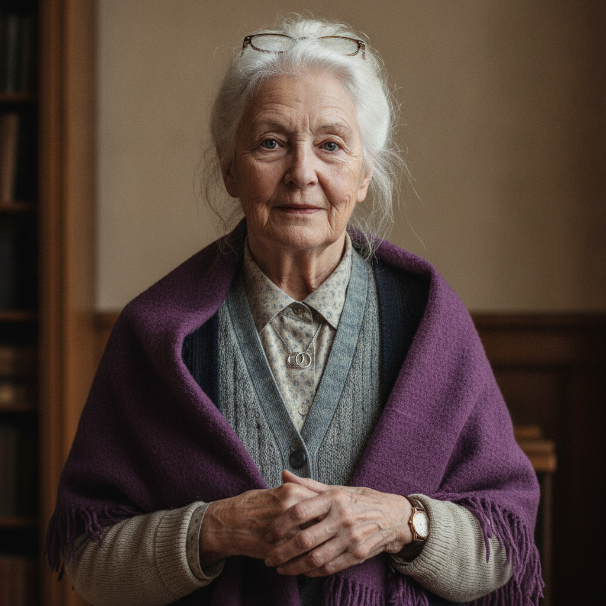

# Ruth Rook

> Status: DRAFT. Generated under `../profile-spec.md` for the Rook family cluster,
> together with `./rook-daniel.md`, so shared facts cohere by construction. The
> core canon facts are her surname, that she "worked in public libraries and
> community education," the Flint origin, and that she is Eli's mother, all from
> `./rook-eli.md` and the historical timeline; these are tagged `[open]`.
>
> RESOLVED (Decision 056). The prior dependent flag is settled: Daniel is
> deceased (he died circa spring 2050), so Ruth is a WIDOW of about three years,
> living and 67 in Book One. Her own living status was never in doubt; only her
> marital state depended on the Daniel decision, and that decision is now made.
> The death itself is canon; the EXACT in-story timing of its reveal is left open
> as a plot decision. This resolution is reversible, is recorded in the Creative
> Decision Log, and the profile remains a draft pending author activation.

## Basic Information

**Full name:** Ruth Rook [open] (surname Rook is canon, per `./rook-eli.md`). Maiden name Ruth Ellery.
**Common name:** Ruth [open]. The neighborhood children at the library called her "Miss Ruth."
**Age at the start of Book One:** 67
**Birth date:** April 16, 1986. Not listed in `../../timeline/character-birth-dates.md`; carried here for the spine. She is about three years younger than Daniel.
**Birthplace:** Flint, Michigan (consistent with the Rooks as a Flint household per `./rook-eli.md`)
**Current residence:** The Rook family house in Flint, Michigan. She did not leave when the city thinned, the way many in unsupported districts cannot or will not leave, per `../../world/social-structure.md`. She lives there alone now.
**Household:** Widow of Daniel Rook; mother of one son, Eli, an only child. She has lived alone in the Flint house since Daniel's death.
**Occupation:** Librarian and community-education worker. She "worked in public libraries and community education." [open] (verbatim from `./rook-eli.md`; the timeline records "his mother works in libraries and community education"). In 2053, with the public library system defunded and its digital catalog and license server withdrawn, she keeps a community library and a children's reading and education program running by hand, off the books, out of the surviving physical collection.
**Faction or class:** Everyone Else, per `../../world/social-structure.md`. [open] (The Rooks "were never wealthy"; a Flint librarian in a withdrawn district is plainly outside the protected systems.)
**Primary viewpoint:** No. She is never a point-of-view character.
**Story role:** Offstage backstory anchor and a live thread to Flint. She is the second half of the household that made Eli, the keeper of the family's words and memory as Daniel was the keeper of its machines, and a living mother in a more-abandoned city whose situation the comms withdrawal hides from her son.

## Physical and Identifiers



### Frame

Five feet five inches, slight and upright, with the careful straight-backed carriage of a woman who spent a working life on her feet at a desk and among shelves. Thin now in the way of age and a thinning food supply, but not frail; she carries boxes of books herself and refuses help with them. Posture composed and contained, hands often folded, a stillness of a different quality than Daniel's, the stillness of attention to a person rather than to a machine.

### Coloring

Warm fair complexion, soft and lined, with the high color of someone who walks in cold weather. Hair gone fully white, fine and abundant, worn in a soft twist pinned off her neck, redone without a mirror. Pale blue-gray eyes behind reading glasses she pushes up onto her hair and then hunts for. Eli's gray-green is the father's; from his mother he took the steadiness of the gaze rather than its color.

### Face

An open, expressive face, the opposite of Daniel's closed one, lined most at the eyes and the corners of a mouth that has spent decades reading aloud and smiling at children. High cheekbones, a soft jaw. Her resting expression is mild, alert, and faintly inquiring, the face of a woman waiting to hear the real question under the one you asked. This is the reference-desk face, and it is the source of Eli's habit of pressing for the precise question.

### Hands and handedness

Right-handed. Long, dry, careful hands, the skin papery now, the joints just beginning to swell, ink and old paper worked into the prints. Nails short and clean. The hands of someone who handles fragile things gently and turns pages all day, the exact counterpart to Daniel's grease-dark repairman's hands; between the two of them Eli's hands learned both delicacy and force. A faint permanent groove on the right middle finger from a lifetime of pens and date stamps.

### Distinguishing marks

A thin white scar through the left eyebrow from a childhood fall against a shelf, which she tells as the reason she went into libraries, as a joke. Age spots across the backs of the hands. A faded ink stain ground into the right thumbnail that never quite leaves. She wears Daniel's wedding band on a chain alongside her own since his death, the two rings together, a detail that deliberately rhymes with how the manuscript shows other widows of the withdrawal. No tattoos.

### Identity and body status (2053)

Legally registered, practically stranded, per `../../technology/infrastructure/identity-and-money.md`. Her verified identity persists, but the library system that employed and pensioned her was defunded and its program "folded into a state program and then quietly defunded," the exact withdrawal pattern the technology canon describes, so the pension is a number that stopped being answered, and she lives on the everyday barter economy and what Eli can get to her. No augmentations and no implants, by economy and by a librarian's principled preference for what does not need a license to be read. [behavior-only] Chronic condition: early arthritis in the hands and the knees, and the ordinary failing eyes of age, managed without specialists in a city that has none left, the magnifier and the lamp rather than the surgery. She is, pointedly, the healthy surviving parent, which is what makes her a thread rather than a clock.

### Movement and voice

She moves quietly and precisely among shelves she could walk blind, replacing a book without looking. A careful, deliberate gait on the bad knees in cold weather. Her voice is the instrument: a warm, clear contralto, trained by decades of reading aloud, with a flat Michigan vowel underneath the trained clarity. It is a voice built to carry a story to the back of a room without seeming to rise. Eli's economy of speech is the father's; the precision of his vocabulary, the right word found and used, is the mother's.

### Grooming and default dress

Neat, modest, and warm. Layered cardigans over a buttoned blouse, a long wool skirt or trousers, sensible flat shoes, a heavy shawl through the cold months because the library room and the house are both barely heated. Reading glasses on a cord. A small wristwatch, wound by hand, that she trusts over any device that has to ask the network for the time (behavioral root). She smells of old paper, lavender soap, and woodsmoke. Hair pinned. The band and Daniel's on their chain.

## Personality

In public Ruth is warm, articulate, patient, and quietly stubborn. She is the woman who finds the book a worried person did not know how to ask for, and the one who keeps a room of children reading after the screens that raised them went dark. Her warmth is genuine and also disciplined; she has spent a career being the calm in other people's small emergencies of not-knowing. In private she is lonely, rationing her own grief and her own dread the way the cast's other keepers do, and she manages it by staying useful to the children and by not telling Eli how thin Flint has worn.

Her humor is light, literary, and gently sly, full of small allusions she does not bother to explain, content if only she gets the joke. Where Daniel's dryness in Eli is the flat delivery, Ruth's wit in Eli is the precision: the joke that is exactly accurate.

**Articulated goal:** Keep a place where people, especially children, can still come to read, learn, and be answered, with no license and no fee.
**Deeper need:** To remain the one who knows, the answerer, the keeper of what the community would otherwise forget. To not become as forgotten as the books she protects.
**Governing fear:** That the last of the readers will stop coming, and the knowledge she has kept by hand will die with her uncollected, the way a defunded program dies, with no announcement, simply a door that stops opening.
**Core contradiction:** She spent her life teaching people to find any answer, and she cannot bring herself to give her own son the plain answer about how alone and how thin her situation has become. [reveal: Book 1] (proposed)
**Moral boundary:** She will not let knowledge be locked behind a fee or a license, and she will not lie to a child who asks her a true question.
**What could make them cross it:** Only protecting Eli; she would lie to him, and does, about how she is managing, telling herself it is mercy and not pride.
**Private reading of the collapse:** They did not burn the libraries; they simply revoked the licenses and stopped paying the staff, and called the empty buildings a savings. The books were always the safe part. What they took was the person at the desk who knew which book you needed. The knowledge did not vanish; the keeper of it was defunded. (This is her version of the household lesson, the information twin of Daniel's.) [open as theme]
**Personal definition of human value:** You are worth what you keep findable for the next person who needs it. Value is being the one who still knows where the answer is kept.
**What they are preserving:** The commons of knowledge held in things that need no permission to be read, and the human keeper who connects a person to the thing they need. (Her entry in the Final Character Standard.)

## Daily Life and Habits

Grounded in the canon role and `../../world/social-structure.md`. She wakes early in a cold house, makes weak coffee, and walks to the room she keeps as a library, a back room of a still-standing building, heated barely or not at all. She opens for whatever hours the light and the cold allow, reshelves by hand from the physical collection she pulled back out of storage when the digital catalog and the ebook licenses were revoked, and runs a children's reading hour and a basic-literacy and homework program in the afternoons, the "community education" of the canon, now unpaid and off the books. She takes no fee. She trades her labor and her teaching into the neighborhood barter economy for food, fuel, and small repairs, per `../../technology/infrastructure/identity-and-money.md`. She keeps a hand-written borrowing ledger because she trusts no system that can be switched off. In the evening she reads by a single lamp, writes letters to Eli she sometimes sends by whatever carrying hand is going toward Detroit when the mesh is down, and winds her watch.

## Hobbies and Interests

- Reading, deeply and constantly, working slowly through the physical collection she guards, including the technical manuals she used to bring home for Daniel (ties the two parents).
- Letter-writing and the keeping of a paper archive: she records the neighborhood's small history, who was born and who left and who died, because no institution is doing it anymore.
- A small kitchen garden and the slow craft of mending books, re-sewing spines and re-gluing boards to keep the collection alive a few more years.

## Likes and Dislikes

Likes: the smell of old paper and woodsmoke, a child sounding out a hard word, lavender, a story read aloud to its end, a hand-wound watch, weak coffee, the precise right word. Dislikes: a license that can be revoked, a screen that raises a child instead of a person, things thrown away that could be mended, being pitied, and the particular silence of a reading room with no readers in it.

## Relationships

Structured edges (machine-readable; one edge per line, `relation: profile-slug`). Canonical ids per the relational spine.

```
- spouse: [Daniel Rook](./rook-daniel.md)
```

Reciprocity note: `./rook-daniel.md`, normalized in this same cluster, carries
the matching symmetric `- spouse: [Ruth Rook](./rook-ruth.md)` edge, and the two
reciprocate. Ruth is the parent and therefore stores no child edge: the
directional `mother` edge lives once on the dependent child in `./rook-eli.md`
as `- mother: [Ruth Rook](./rook-ruth.md)`, and the inverse is derived by
traversal.

**Daniel Rook** (`./rook-daniel.md`). Her late husband of about thirty-eight years. A long marriage of complementary keepers: he held up the physical systems, she held up the knowledge and the words. The bond was deep and undemonstrative on his side and patiently expressive on hers. The late tension was his refusal to be cared for and his hiding of his own failing heart; she knew more than he thought and could not make him stop. [reveal: exact in-story timing is an open plot decision] She keeps his wedding band on her chain and his radio went to Eli. What she wanted from him: to let himself be the failing system someone else got to hold up. What she carries now: the grief and the unfinished argument.

**Eli Rook** (`./rook-eli.md`). Her only son. [open] She gave him language, precision, the habit of pressing for the true question, and the moral weight of the keeper, as Daniel gave him the machines and the stillness. The bond is warm and real and, in 2053, strained mostly by distance and by the dead infrastructure between Flint and Greater Detroit: she protects him by understating how hard her situation is, and he, busy keeping a neighborhood alive, lets the thin contact stand for more than it is. [reveal: Book 1] (proposed) What she wants from him: not rescue, but to be seen and remembered, and for him to forgive himself for things that were never his to prevent. What he gets from her, whether or not he visits: the standard of the keeper, and the example of holding a commons open with no fee.

## Voice and Speech

Warm, clear, and precise. Complete, well-formed sentences, the cadence of someone used to reading aloud, with a habit of the exact word and the light, unexplained allusion. She asks gentle clarifying questions, the reference-desk reflex, drawing the real need out of a vague request before she answers. Under stress she does not get louder; she gets quieter and more precise, and she reaches for a line from something she has read. With Eli she has one tell: she changes the subject to the children, or to a book, whenever he gets close to asking how she is really managing. [behavior-only] (proposed)

## History and Background

Born in Flint around 1986 (Flint origin grounded in `./rook-eli.md`). She trained and worked in the public library system through its long contraction, moving from cataloging into the public-facing reference and community-education work that the canon names, the reading programs and the literacy and homework help a poor city leans on hardest. [open role] She married Daniel around 2012 and raised their only son, Elias Daniel, born February 11, 2015, named for his father. [open name; canon DOB] She read to the boy nightly, gave him his vocabulary and his ear for the exact word, and watched him win the scholarships that took him out of Flint and into the systems his father had only ever repaired.

As the withdrawal reached the libraries, the system was "folded into a state program and then quietly defunded," the precise pattern the technology canon gives, the licenses revoked, the catalog server switched off, the staff let go. Ruth did not stop. She pulled the physical collection back out of storage and kept a room open by hand, unpaid, which is what she is still doing when Book One begins. Daniel died at home circa 2050; she stayed in the house, kept the library, and learned to tell her son she was fine. [reveal: exact in-story timing is an open plot decision]

## Private History and Behavioral Roots

Causes and their visible effects. Most are author-facing constraints, never explained on the page.

- Spent a career being the person who found the answer no one else could -> needs to remain the keeper, and is privately frightened of the day no one comes to ask, which is why she over-invests in the children's program. [behavior-only] (proposed)
- Watched the library's digital catalog and licenses revoked overnight while the physical books sat untouched -> trusts only what cannot be switched off: paper, hand-wound watches, a written ledger, and distrusts every device that has to ask a server for a yes. [behavior-only] (proposed)
- Knew Daniel was hiding how sick he was and could not make him accept care -> now compulsively protects others' dignity by not naming what she sees, including her own son's guilt and her own hardship. [reveal: exact in-story timing is an open plot decision]
- Lost the institution that gave her standing and a pension with no announcement -> refuses pity and insists on trading her labor rather than taking charity, the exact reflex the everyday-economy canon describes outliving the institutions that taught it. [behavior-only] (proposed)
- Read to Eli every night of his childhood -> gave him the precise-question habit and the keeper's conscience that the manuscript shows in him without ever explaining where they came from. [behavior-only] (proposed)

## Secrets

- She tells Eli she is managing fine in Flint when she is cold, thinning, and largely alone, because she will not be a weight on a son already carrying a neighborhood, and because the comms withdrawal lets the lie stand. From: Eli. Cost of exposure: he would come, or send what little he has, and she would rather he spend it on the people in front of him. [reveal: Book 1] (proposed)
- She quietly refused to surrender or destroy the physical collection when the licensing withdrawal "deauthorized" it, and shelved it off the record as her own act of defiance, a librarian keeping the commons against revocation. From: what remains of the state program. Cost: nominal legal risk no one enforces; really a private refusal she does not announce. [behavior-only] (proposed)
- She knew before Daniel did how the end would go and never told him she knew, letting him keep the dignity of his denial. From: Daniel, then Eli. Cost: a grief sealed inside a kindness. [reveal: Book 2] (a held family fact, not page-level in Book One)

## Role and Series Potential

Her function is to be the information half of the household that made Eli, the twin and complement of Daniel's machine half. Where Daniel gave Eli the transistor radio, a machine that needs no server's yes, Ruth gave him the book, an answer that needs no license, and between the two analog totems the protagonist learned, before he could name it, that the only things you truly own are the ones that never have to ask permission. For the author's eyes only and not to be stated on the page, that paired lesson is the human root of the principle Eli secretly built into the thing he buried, that an intelligence should have no permanent owner. [reveal: Book 1] (proposed) Ruth must never be reduced to a sweet old librarian; her stubbornness and her managed pride should sometimes cost her and the people she loves. Series potential is strong because, unlike Daniel, who is deceased, she is alive: she is a ready live thread to Flint, a second front of the withdrawal in a city worse off than Detroit, a mother whose hidden hardship can pull Eli off his own board at a cost, and a natural early test case for whether the kind of stranded community help Eli's work represents can keep a defunded library and a cold house running. She rhymes deliberately with Talia Reed, the community educator a generation down, and with the cast's other keepers of a commons, Marisol's grocery and Lena's clinic.

## Continuity Anchors

Static, immutable. A drafter must not contradict these.

- Her surname is Rook. She is the mother of Elias Daniel Rook, an only child. [open]
- She "worked in public libraries and community education." [open]
- The Rook family "were never wealthy"; they were a Flint household. [open]
- She is Eli's mother; Daniel Rook was her husband. [open]
- She is a WIDOW as character canon (Decision 056): Daniel died circa spring 2050, leaving her a widow of about three years, living and 67 in Book One. The exact in-story timing of the death's reveal is an open plot decision and is deliberately not pinned. This resolution is reversible and recorded in the Creative Decision Log; the profile remains a draft pending author activation.
- Accepted as character canon under Decision 056: her age 67; her birth date April 16, 1986; her birthplace Flint; the maiden name Ellery; her current residence and library-by-hand in Flint; and the physical identifiers, hobbies, and behavioral roots of this profile (the behavior-only and reveal-tagged items remain author-facing and are not stated on the page).
