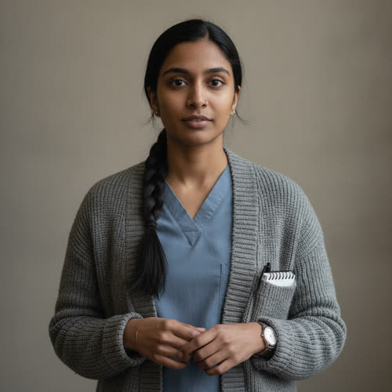

# Priya Sharma

## Basic Information

**Full name:** Priya Sharma (given name Priya is [open])
**Common name:** Priya [open] (the only name given in Chapter 2)
**Age at the start of Book One:** 28
**Birth date:** August 30, 2025 (not listed in `../../timeline/character-birth-dates.md`; invented under Section 6 and tagged for the spine)
**Birthplace:** Detroit, Michigan
**Current residence:** A flat in Greater Detroit, in the clinic's neighborhood
**Household:** Lives with her father, whose worsening eyesight she helps manage, and shares the flat with a cousin. Unmarried.
**Occupation:** Clinic staff. A medical aide and nurse-equivalent on the floor; the staffer who keeps hand watch on patients the machines can no longer be trusted to monitor [open, that she watches the Caldwell girl]. Former pharmacy technician.
**Faction or class:** Everyone Else, per `../../world/social-structure.md` [open]. She works in an unbilled clinic for community standing and barter, not a salary.
**Primary viewpoint:** No. She is never a point-of-view character.
**Story role:** Clinic walk-on; the hand on the feverish child when the cabinet cannot be trusted. She is the human monitor who replaces a machine that has stopped being trustworthy, the "old way" made flesh.

## Physical and Identifiers



### Frame

Five feet three inches, slight and compact, with the quick economy of someone who has learned to do precise work in a small space. Upright, contained posture. She holds still well, which is half of what the night's hand-watch asks of her.

### Coloring

Brown complexion with a warm undertone. Black hair, fine and very straight, worn in a single practical plait down her back so it stays out of her work. Dark brown eyes, watchful and steady, the eyes of someone counting. A small, careful face that gives little away on purpose.

### Face

An oval face, neat-featured, composed at rest, with a stillness that reads as competence and sometimes as reserve. She has the trained blank of a person who has learned not to let a patient see her doing arithmetic about them. When she is concentrating, the stillness deepens rather than breaks.

### Hands and handedness

Right-handed. Small, exact, very clean hands, the nails kept short and unpolished, the fingers practiced at fine measured work from years of counting and splitting doses. She does precise things slowly and never rushes a count. Her hands say measurement, patience, and a deep habit of double-checking, the legacy of a pharmacy bench where a slip was a danger.

### Distinguishing marks

A faint vaccination scar high on the left upper arm. A thin pale line across the pad of the left index finger from a broken ampoule years ago. A small dark mole at the right jaw. A nose piercing healed closed, a stud she stopped wearing on the floor and never put back. Even teeth. No tattoos.

### Identity and body status (2053)

Legally registered, practically stranded, per `../../technology/infrastructure/identity-and-money.md`. Her pharmacy-technician credential outlived the chain pharmacy that employed her and the systems that verified it, so her skill survives only where it is used by hand, in a clinic that bills no one. No augmentations, no implants; she has a measurer's distrust of a device whose accuracy she cannot personally check, sharpened by watching the medication cabinet become a thing she is now told not to use. Healthy; mild eyestrain and tension headaches from close work in low, battery-sparing light.

### Movement and voice

Neat, contained, unhurried; she moves like someone carrying something full she does not want to spill. A soft, clear voice, kept low for the ward, with a flat Detroit vowel and a faint North-Indian lilt under it from her parents' speech. When she gives a number she gives it exactly, the temperature, the time, no rounding.

### Grooming and default dress

Tidy and warm and unfussy. A scrub top under a heavy cardigan against the cold building, the heat being rationed. The single plait. Soft-soled shoes. A wristwatch with a sweep hand and a small notebook in her cardigan pocket for the hand-written observations the machines no longer keep, with a pen clipped beside it. Scent of soap and the faint clean astringency of antiseptic.

## Personality

In public Priya is precise, quiet, and conscientious, the staffer you give the task that must be done exactly and the same way every time. [open, that she is trusted with the hand-watch] She is reserved with strangers and warm in a low key with the people she has worked beside, and she expresses care through accuracy: the right number, written at the right time, is how she says she is paying attention. In private she carries a measurer's anxiety, a need to check and re-check that can tip into self-doubt, and a guilt she keeps banked about an earlier time when she trusted a machine's number over her own and it cost.

Her humor is dry and rare and deadpan, usually a single precise word dropped at the right moment. She is not a performer; the joke is small and lands because no one expected her to make one.

**Articulated goal:** Watch the child well, take the temperature on time every time, and write down a record someone could trust their decisions to.
**Deeper need:** To know that her own careful hand is enough now that the machine's is not, and to be forgiven, privately, for a time it was not.
**Governing fear:** That she will miss the one reading that mattered, the spike between two checks, and a child will pay for a number she did not catch.
**Core contradiction:** She trusts measurement above almost everything and is being asked, tonight, to be the measurement, with nothing to check her own hand against but her own hand.
**Moral boundary:** She will not record a number she did not actually take, or sign her name to a reading she only assumed. The record has to be true or it is worse than nothing.
**What could make them cross it:** Exhaustion across too many unbroken nights could let an assumed reading slip into the notebook as a real one, and the thought of having done it would frighten her more than the night itself.
**Private reading of the collapse:** The systems did not fail loudly. They became unreliable so quietly that one day you were told not to use the machine that had always been right, and no one could tell you exactly when it had stopped being trustworthy, only that it had. The not-knowing is the whole of it. So you go back to the hand, and the hand is slower and frightened and yours.
**Personal definition of human value:** A person is worth the care they take with a thing that cannot check up on them. Value is being trustworthy when no system is watching.
**What they are preserving:** The true record. A number that means what it says. The "old way" of a hand on a forehead and a time written down. (Her entry in the Final Character Standard.)

## Daily Life and Habits

She works the clinic floor in the cold dim hours, often overlapping Tomas's night, and keeps the day for her father and the flat. There is no wage; like all the staff she is held in the everyday economy of `../../technology/infrastructure/identity-and-money.md`, her skill traded into the neighborhood's barter and standing rather than billed. What the household needs that her hands cannot make, they get along the food board and the neighbor network, and her place as clinic staff is its own kind of credit.

On a night like this her whole world narrows to a task: the Caldwell girl's temperature every two hours, by hand, written down, and Lena fetched and not the cabinet if the fever climbs [open]. Between checks she keeps the small machine-sounds of the floor sorted in her ear and squares her notebook. She eats what the clinic has, sleeps in the worst light of the morning, and reads the same notices everyone reads.

## Hobbies and Interests

- Careful cooking from a short list of remembered family recipes, weights and timings done by eye now but precisely, the pharmacy bench turned to a kitchen.
- Tending a windowsill of medicinal and culinary herbs, partly for use, partly to trade, the kind of small green economy the neighborhood runs on.
- Keeping handwritten ledgers and indexes for the household and sometimes for the clinic, an honest pleasure in a column that adds up.

## Likes and Dislikes

Likes: a clean column of readings that all agree, the weight of a good pen, strong sweet tea, a quiet child who lets her work, the specific relief when a fever is falling, her father's old radio. Dislikes: the medication cabinet's locked gray face and the not-knowing inside it, an interruption mid-count, a rounded number, the cold that rises through the floor, being asked to trust a machine she cannot check. [the untrustworthy cabinet and the cold are canon-grounded; the rest accepted as canon (Decision 056)]

## Relationships

Structured edges (machine-readable; one edge per line, `relation: profile-slug`, canonical `lastname-firstname` ids):

```
- reports-to: [Lena Okafor](./okafor-lena.md)
- colleague: [Tomas Herrera](./herrera-tomas.md)
```

Reciprocity note: `reports-to` is directional; its inverse to Lena is derived by traversal
and never stored on her file. `colleague` is symmetric and reciprocated by `herrera-tomas`.
Her hand-watch of the Caldwell girl is stored once, as `patient-of: sharma-priya`, on
`caldwell-emma.md`, not here, because that inverse is derived.

**Dr. Lena Okafor** (`./okafor-lena.md`). Her director and the doctor whose instruction governs her night. [open, that Lena directs her watch on the child] Lena trusts her with the hand-watch precisely because Priya does a thing exactly and the same way every time, and gives her the rule that protects them both: come get me, do not go to the cabinet [open]. What Priya wants from Lena: a clear rule she can execute exactly, and to be trusted with the careful work. What Lena wants from Priya: a true record taken by a hand she can rely on when the machine cannot be.

**Tomas Herrera** (`./herrera-tomas.md`). Her coworker on the floor and her relay to Lena tonight; her question about the Caldwell girl reaches Lena through him, and Lena's answer comes back the same way [open]. The bond is the unspoken efficiency of two people who run a night together. What each wants from the other: a reliable second and a shared hold on the weight of the floor.

**The Caldwell girl** (`./caldwell-emma.md`). Her charge for the night, the feverish child she watches by hand. [open] She takes the temperature every two hours, writes it down, and is the one who will fetch Lena if the number climbs [open]. The bond is brief but total for the length of a night: for these hours the child is "hers by hand, not the machine's," the same phrase Lena uses. What Priya wants: to hand the child back to morning with a clean record and a falling fever.

## Voice and Speech

Quiet, precise, economical. [open, by implication from her exact hand-watch task] She speaks in exact quantities and times and avoids the approximate. She asks rather than assumes, which is why her question to Lena is routed carefully through Tomas rather than guessed at: keep the child, or send her home [open]. Her sentences are short and clean, and she would rather say "one hundred even, last hour" than "about a hundred." Under stress she gets quieter and more exact, double-naming the number to be sure it was heard. She rarely editorializes; the reading is the statement.

## History and Background

Born and raised in Detroit, the daughter of North-Indian immigrants who ran a small business of the kind the city used to be full of. She trained and worked as a pharmacy technician in the last years of the chain pharmacies, on a bench where accuracy was the whole job and a machine counted beside her and was usually right. When the chains pulled out of the district under the same polite notices that took everything else, the pharmacy closed and the verifying systems with it, and her skill found its level at neighborhood scale, in Lena's unbilled clinic.

By Book One she is twenty-eight, clinic staff, the careful hand the floor turns to when a machine can no longer be trusted, and a daughter who helps her father through his failing sight in a flat kept warm only in rations.

## Private History and Behavioral Roots

- Once trusted an automated count over her own and a patient came to harm by it, in her pharmacy years -> she now re-checks every reading by hand and refuses to record a number she did not personally take, and is sharpest exactly when she is told to trust a machine. [reveal: Book 2] (proposed) [behavior-only]
- Came up on a pharmacy bench where a single wrong number was a real danger -> she is meticulous to the point of slowness and treats an interrupted count as a thing that must be started over. [behavior-only] (proposed)
- Helps her father through worsening eyesight at home -> she has a practiced, undramatic patience with bodies that are failing and with people who do not want to admit they need watching. [behavior-only] (proposed)
- Grew up in a household where care was shown by getting the details exactly right -> she expresses affection through accuracy, the right number at the right time, and can seem cold to people who read warmth only as words. [behavior-only] (proposed)

## Secrets

- The harm from the trusted automated count years ago is a guilt she has told no one at the clinic, and it is the real reason she is the most rigorous person on the floor about doing things by hand. [reveal: Book 2] (proposed)
- She is privately terrified she will miss the spike between two checks tonight, and has been taking the Caldwell girl's temperature more often than the every-two-hours she was told, and not writing the extra checks down so no one tells her to rest. [reveal: Book 1] (proposed)
- Her father's sight is worse than she has admitted to anyone, including Lena, because a clinic that cannot run its own scanner is the last place she wants to bring a problem it cannot fix. [reveal: Book 1] (proposed)

## Role and Series Potential

In Chapter 2 her function is precise and thematically exact: she is the human hand that replaces a machine the clinic can no longer trust, the "old way" of temperature-every-two-hours made into a person. Where the medication cabinet sits gray and locked-faced and may keep its keys at midnight, Priya is the watch that does not need a server's permission to work. She is the chapter's quiet proof that what survives the withdrawal is skill applied by hand, and that the cost of it is slower, more frightened, and entirely human.

Book One arc, minor: from the staffer executing a rule exactly toward someone who must trust her own hand fully once the machines are gone, and perhaps lay down an old guilt by being, on this night, the reliable measurement she has not let herself believe she is. Long-term series potential, if promoted: a clinic taught to run on a forged yes would put Priya at the sharpest edge of the book's question, the measurer asked to trust a machine that now lies kindly, against every instinct her history gave her. She could become the staff voice that refuses a too-easy reliance on Morrow, the one who keeps the hand-record running in parallel because she has learned what it costs to trust a number you did not take. False belief, if promoted: that her own hand is a poor substitute for the machine. Truth she might learn: that a true number taken in fear by a person who will answer for it outranks a confident number from a machine that answers to no one.

Writing rules: do not mistake her reserve for coldness; her accuracy is how she loves. Keep her quiet; she is not a dispenser of wisdom. Do not let the pharmacy guilt surface early; it is a Book Two thread and stays behind her behavior until then.

## Continuity Anchors

Static, immutable. A drafter must not contradict these.

- Her name in approved prose is Priya, given name only. [open]
- She is clinic staff on the floor on the night of October 3, 2053. [open]
- She is the staffer watching the Caldwell girl, and her question about whether to keep or send the child reaches Lena through Tomas. [open]
- She is instructed to watch the child by hand: temperature every two hours, the old way, written down. [open]
- She is instructed that if the child's fever spikes she is to come get Lena and not go to the cabinet. [open]
- Accepted as character canon under Decision 056: surname Sharma; age 28; birth date August 30, 2025; birthplace Detroit; the North-Indian immigrant family and the household with her father and cousin; the pharmacy-technician history and the automated-count harm; and all physical identifiers and all Section 10 and 11 entries. (the behavior-only and reveal-tagged items remain author-facing and are not stated on the page)
