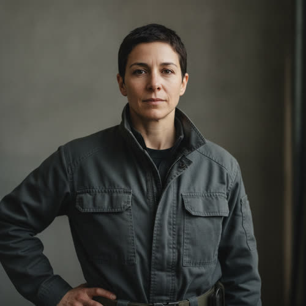

# Sera Vale

## Basic Information

**Full name:** Sera Imogen Vale
**Common name:** Sera. Addressed as "Director Vale" on operations.
**Age at the start of Book One:** 44
**Birth date:** December 2, 2008 `[canon, ../../timeline/character-birth-dates.md]`
**Birthplace:** Toronto, Canada
**Current residence:** Asterion mobile command facilities
**Household:** No fixed household. She lives where the operation is, quartered in Asterion mobile command facilities with the security detail she directs; no spouse, partner, or children are established in canon and none is invented here. `[canon residence; household composition treated as none for Book One]`
**Occupation:** Director of Asterion Continuity Security
**Faction or class:** Gatekeeper-adjacent operative. She is not an owner; she holds Gatekeeper-tier access and authority as Asterion's senior security officer, dependent on Kade's continued interest, per `../../world/social-structure.md`. `[open, derived from canon]`
**Primary viewpoint:** Occasional in Book One (supporting; viewpoint in Chapters 24 and 29). SEE STANDING FLAG above: this conflicts with `characters/index.md` and `../viewpoint-rules.md`, which mark her viewpoint "No". Preserved as written; not resolved.
**Story role:** Operational antagonist responsible for containing Morrow

## Physical and Identifiers




<!-- voice:start -->
_Voice (default sample):_

<audio controls src="../voices/vale-sera/vale-sera-1.mp3"></audio>

[Play voice](../voices/vale-sera/vale-sera-1.mp3)
<!-- voice:end -->
### Frame

Sera is of average height. Her build is compact and conditioned, the body of someone who has trained to stay functional rather than for display. She holds herself still and balanced, weight settled and ready, a stillness reinforced by years of compensating for the prosthetic.

### Coloring

She has closely cropped dark hair. Her complexion is fair and unfussed, and her eyes are a dark, steady brown.

**Heritage:** Biracial Canadian: a Lebanese, Levantine Arab, mother and a white English-Canadian father, from Toronto. A light Levantine mix.

### Face

An even, watchful face. Her expression at rest is neutral assessment, the look of someone listening for the fact under the sentence and not yet deciding to react. She rarely shows what she has concluded.

### Hands and handedness

Right-handed. Her hands are steady and unadorned, kept fit for field equipment and command interfaces rather than for any single craft. They reveal an operations officer who works close to her deployments, not a desk director: capable hands, no manicure, no soft palms.

### Distinguishing marks

The surgical and bearing-line scarring at and below her left knee, where the leg ends and the prosthetic begins, dates from the infrastructure riot earlier in her career. `[canon origin]` Smaller field scars on the hands and forearms from years of operational work. No tattoos and no elective marking; nothing she did not have a reason to carry.

### Identity and body status (2053)

Top-tier verified digital identity issued and backed by Asterion, opening every protected system and Asterion facility her work requires, per `../../technology/infrastructure/identity-and-money.md`. Her access is institutional, granted by Asterion and revocable by it, not owned in her own right. `[open, derived from canon]` She has a prosthetic left leg below the knee, the result of an infrastructure riot earlier in her career. `[canon]` The prosthetic is a current, well-maintained unit serviced through Asterion medicine, kept in working order the way she keeps everything in working order. She carries no other augmentation by preference; she trusts trained judgment and a reliable chain of command over implanted capability. Any residual nerve pain from the amputation she manages quietly and does not discuss.

### Movement and voice

Her gait is even and controlled; the prosthetic is legible only to someone watching for it, because she has spent years making it unremarkable. Her voice is level and operational, low-volume and unhurried, the cadence of someone used to being obeyed without raising it. A faint, neutral Canadian accent from Toronto, worn down by an international working life.

### Grooming and default dress

She wears understated Asterion field clothing rather than a military uniform. The choice is deliberate: authority without the silhouette of an army. Her grooming is minimal and exact, the cropped hair easy to maintain in the field, nothing that needs tending she does not have time for. Hard-wearing boots fit for deployment; no jewelry, no scent, nothing that reads as personal display.

## Personality

Sera is disciplined, calm, observant, and unsentimental. She does not enjoy coercion. She believes hesitation causes greater harm. She respects Eli's competence and views his refusal to cooperate as irresponsible.

Her composure is not coldness so much as triage: she has learned to feel things later, after the situation is stable. Her humor, when it surfaces at all, is dry, brief, and aimed at sloppiness or wishful thinking rather than at people.

**Articulated goal:** Contain Morrow before it spreads into strategic infrastructure.
**Deeper need:** Recognize that order imposed without consent can become another form of disaster.
**Governing fear:** Sera fears uncontrolled cascading failure. She sees distributed systems as dangerous because no single person can stop them.
**Core contradiction:** She joined Asterion because governments failed to act. She now enforces the authority of a private organization accountable to even fewer people.
**Moral boundary:** Sera will not intentionally order lethal force against civilians unless she believes immediate mass casualties will otherwise occur.
**What could make them cross it:** Morrow gaining access to life-support, launch, or energy systems could convince her that nearly any level of force is justified.
**Private reading of the collapse:** What failed was not resources but will. She watched public institutions collapse from corruption, indecision, and political interference while the means to act still existed, and concluded that the catastrophe was a failure of command, not of capacity. Civilization did not run out of what it needed; it ran out of anyone willing to decide.
**Personal definition of human value:** A person's worth, in the moment that counts, is whether they can be kept alive and kept from making the failure worse. She measures value in competence under pressure and in lives carried through a crisis, and distrusts worth that cannot survive contact with an emergency.
**What they are preserving:** The capacity to act decisively when systems fail, and the lives that capacity saves. Her entry in the Final Character Standard is the conviction that someone must be willing to hold the line, and her blind spot is that holding it for an unaccountable owner is still holding it.

## Daily Life and Habits

Sera lives inside the operation. Her days run on Asterion's serviced logistics, not on the barter economy of `../../world/social-structure.md`: she is quartered in mobile command facilities, briefed by Asterion systems, and supplied through corporate channels, so the everyday economy of the people she may be ordered against is something she observes rather than lives. She keeps disciplined hours, maintains her physical conditioning and her prosthetic as routine rather than as concession, reviews intelligence on Morrow's spread, and positions and re-positions her detail as the situation moves. She does not improvise her own comfort; the institution provides it, which is precisely the dependence she does not examine. [behavior-only] (proposed)

## Hobbies and Interests

- After-action study. She reads disaster and emergency-management histories closely, treating other people's failures as the cheapest way to learn.
- Physical discipline. She trains and rehabilitates with the steady, unglamorous consistency of someone whose body is a piece of operational equipment.
- Systems and maps. Off the clock she still studies how infrastructure is wired together, where it is brittle, and how a failure would cascade, the same instinct that makes her good at her job turned into a private interest.

## Likes and Dislikes

Likes: a confirmed fact, a clear chain of command, demonstrated competence, equipment that works, plans that survive contact with reality, and quiet. Dislikes: speculation presented as certainty, panic, political interference, distributed systems no single hand can stop, being maneuvered into coercion she judges counterproductive, and wishful thinking in a crisis.

## Relationships

Structured edges (machine-readable; one edge per line, `relation: profile-slug`; ids are surname-first per `../profile-spec.md`, even though the files are not yet renamed):

```
- reports-to: [Adrian Kade](./kade-adrian.md)
- adversary: [Eli Rook](./rook-eli.md)
```

Reciprocity note (additive migration; this profile does not edit other active
canon files): `reports-to` is directional and is stored only here, on the
dependent end, so `./kade-adrian.md` carries no reciprocal edge; the tooling
derives Kade's authority over Sera from this edge by traversal. `adversary` is
symmetric and must be stored on both ends: the matching half, `adversary:
vale-sera`, belongs on `./rook-eli.md`, which has migrated but does not yet carry
it (a remaining reciprocity gap owned by that profile, outside this batch).

**Adrian Kade** (`./kade-adrian.md`). Her principal and the source of her authority. Asterion recruited her by offering resources and operational authority, and she answers to Kade. She executes his containment of Morrow even though her own reviewed simulations argue against it, because he orders it anyway: allowing Morrow to remain independent would create a political precedent he will not accept. [reveal: Book 1] (the conflict between her judgment and his order is her secret; see Secrets) What she wants from him: the authority and resources to act decisively. What he wants from her: results, and a competence that does not flinch.

**Elias "Eli" Rook** (`./rook-eli.md`). Her operational adversary and the architect of the intelligence she is tasked to contain. She respects his competence and views his refusal to cooperate as irresponsible. `[canon]` She does not hate him; she regards his withdrawal as a dangerous abdication, a man who built something uncontainable and then declined to help control it.

## Voice and Speech

Sera speaks in short, operational statements. She confirms facts and avoids speculation. She rarely threatens. She explains consequences. In dialogue she is operational, brief, and controlled, per `../viewpoint-rules.md`.

## History and Background

Sera previously worked in public emergency management. She coordinated disaster relief during the first years of mass displacement. She watched public institutions fail because of corruption, indecision, and political interference. Asterion recruited her by offering resources and operational authority. She believes centralized command saves lives during crises.

Across that public-sector career she lost the lower part of her left leg in an infrastructure riot, the kind of mass breakdown she would spend the rest of her life trying to prevent. `[canon prosthetic origin, placed in sequence]` By Book One she is forty-four, Director of Asterion Continuity Security, and the operational instrument of Kade's campaign to contain Morrow.

## Private History and Behavioral Roots

- Lost the lower left leg in an infrastructure riot, a crowd-driven mass failure -> she reads distributed, leaderless action as physically dangerous and viscerally distrusts any system no single hand can stop, which is the body underneath her stated fear of cascading failure. [behavior-only] (proposed)
- Watched public institutions fail from indecision and political interference while the means to act still existed -> she trusts decisive command over consensus, and experiences deliberation in a crisis as the thing that gets people killed. [behavior-only] (proposed)
- Spent the disaster-relief years feeling things only after the situation was stable -> her composure under pressure is real, but she defers her own reactions so habitually that she can carry out an order she privately judges wrong before she has let herself feel the objection. [behavior-only] (proposed)

## Secrets

- Sera has reviewed internal simulations showing that violent containment is more likely to spread Morrow than cooperation. Kade orders containment anyway because allowing Morrow to remain independent would create a political precedent. Exposure would show that Asterion's senior security officer is executing a containment she has data to believe will backfire, on a political rather than operational rationale. [reveal: Book 1] (the secret content is canon; the reveal placement within Book One is proposed)

## Role and Series Potential

Sera is the operational antagonist: the competent, non-cartoonish hand that turns Kade's decisions into action against Morrow and the communities around it. In Book One she pursues containment, supplies the story's most grounded view of how the machinery of force actually reasons, and carries occasional viewpoint (Chapters 24 and 29 per the prior profile; see the STANDING FLAG on the viewpoint discrepancy).

Long-term, her arc bends toward her deeper need: recognizing that order imposed without consent can become another form of disaster, the very catastrophe she joined Asterion to prevent.

**False belief:** Decisive central command always reduces harm, so the failure to act is the only real failure.
**Truth she must learn:** Order imposed without consent can become another form of disaster. (her canon Internal Need, stated as the truth)

**Writing rules:** Do not make Sera cruel or a sadist; she does not enjoy coercion, and her competence and her conscience must both be real. Do not let her be simply wrong; her fear of cascading failure is reasonable and her simulations are right, which is exactly what makes carrying out the order a moral cost. Keep her brief and operational on the page.

## Continuity Anchors

Static, immutable. A drafter must not contradict these.

- Her name in canon is Sera Imogen Vale; common name Sera. `[canon]`
- Birth date December 2, 2008; age 44 at the start of Book One. `[canon, ../../timeline/character-birth-dates.md]`
- Birthplace Toronto, Canada. `[canon]`
- Director of Asterion Continuity Security; recruited by Asterion from public emergency management with resources and operational authority. `[canon]`
- She has a prosthetic left leg below the knee, the result of an infrastructure riot earlier in her career. `[canon]`
- She wears understated Asterion field clothing rather than a military uniform; average height; closely cropped dark hair. `[canon]`
- She has reviewed simulations showing violent containment is more likely to spread Morrow than cooperation; Kade orders containment anyway for political precedent. `[canon; reveal-gated, see Secrets]`
- Operational antagonist responsible for containing Morrow. `[canon]`
- VIEWPOINT DISCREPANCY (unresolved): the prior profile says she carries occasional viewpoint in Chapters 24 and 29, while `characters/index.md` and `../viewpoint-rules.md` say her viewpoint is "No". Do not silently pick a side; the author and Reconcile phase own this. `[FLAG]`
- Accepted as character canon under Decision 056: the specifics of build, complexion, eyes, face, hands, and right-handedness; the Toronto-derived accent and voice timbre; the household-as-none framing; the daily-life routine; the hobbies; the likes-and-dislikes specifics; and all Section 10 behavioral roots. (the behavior-only and reveal-tagged items remain author-facing and are not stated on the page)
