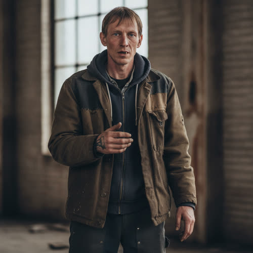

# Marcus Vance

## Basic Information

**Full name:** Marcus Vance [canon surname Vance, from "Vance's boy" in Chapter 1]
**Common name:** Vance [canon] (the only name in Chapter 1; the street calls him by surname)
**Age at the start of Book One:** 35
**Birth date:** February 14, 2018 (not listed in `../../timeline/character-birth-dates.md`; invented under Section 6 and tagged for the spine; set so he is eighteen at his son's birth)
**Birthplace:** Greater Detroit, Michigan
**Current residence:** A rented house in Eli's neighborhood, Greater Detroit
**Household:** Single father living with his seventeen-year-old son Mason. Mason's mother is absent from the household.
**Occupation:** Day-labor and shift work, whatever the everyday economy still pays for: hauling, demolition and salvage on the abandoned buildings, battery and stove tending, the hands-on local work that replaced steady employment, per `../../world/social-structure.md`.
**Faction or class:** Everyone Else, per `../../world/social-structure.md`. [canon] (Plainly outside the protected systems: he sends his son to a neighbor to revive a dead doorbell rather than buy a new one, and pays nothing because nothing is asked.)
**Primary viewpoint:** No. He is never a point-of-view character and does not appear on the page in Chapter 1.
**Story role:** Minor walk-on, referenced only. The unseen household behind the doorbell, and the young single father whose narrow face the boy carries. His function is to give the doorbell scene a home: there is a man and a boy in a house who only want the house to know there is somebody in it.

## Physical and Identifiers



### Frame

Five feet nine or ten, lean and wiry, built for endurance rather than mass, the leanness of a man who works on his feet all day and shares a thin household table. Posture is quick and slightly guarded, weight forward, a man ready to be told the next thing that needs doing.

### Coloring

Fair, sallow complexion, chapped and wind-reddened across the face from outdoor labor in the cold. Light brown hair, straight and fine, cut short and a little raggedly, kept down by his own hand or his son's. Pale gray eyes set close. He looks tired in a settled, unremarkable way.

### Face

A narrow face. [canon] This is the one canon physical fact: the boy is described as having "his father's narrow face," so the narrowness is fixed for both of them. Long and lean-jawed, sharp-cheeked, a thin straight nose, the features pulled close and vertical. Resting expression is flat and watchful, an economy of expression that the boy has inherited along with the shape. He looks older than thirty-five around the eyes.

### Hands and handedness

Right-handed. Laborer's hands, broad-knuckled and hard-palmed, the nails short and often split, a permanent grime worked into the creases that no washing fully takes out. Old blisters healed to callus. His hands reveal heavy physical work taken as it comes, lifting, hauling, prying, the unspecialized labor the local economy runs on.

### Distinguishing marks

A white seam of scar across the left palm from a salvage job, a sheet of glass or a cut edge taken before he had gloves. A faded, cheap, half-finished forearm tattoo from his teens that he never had completed once money got serious. Two fingers on the right hand that did not set quite straight after being broken on a demolition crew, untreated because the clinic was for things that could not wait. A chipped front tooth, uncapped.

### Identity and body status (2053)

Legally registered, practically stranded, per `../../technology/infrastructure/identity-and-money.md`. His verified identity exists, but with no steady employer and no protected account it gets him no institutional access; he lives on cash, day-rate goods, and the community ledger. [open] No augmentations, no implants, by economy and by having no use for them. Chronic lower-back strain from years of lifting, managed by working through it and by the occasional visit to Lena's community clinic under care-without-a-bill. He cannot afford to be hurt, and arranges his body around that fact. [behavior-only]

### Movement and voice

He moves fast and a little carefully, the gait of a man who has learned that an injury is a household catastrophe, not a sick day. A flat working Detroit accent. His voice, were it on the page, would be quiet, clipped, and plain, a man who says the necessary thing and stops, the verbal economy the boy has copied exactly.

### Grooming and default dress

Worn and functional. Default dress: layered hooded sweatshirts under a canvas work coat, heavy trousers, steel-toed boots resoled more than once, work gloves when he has them. Everything clean enough but visibly mended, often by his own hand or Mason's. Scent of cold air, dust, and machine oil. No jewelry. He keeps himself and the boy presentable on almost nothing, which is its own kind of pride.

## Personality

Off the page, Vance reads as plain, hard-working, and tightly held, a young man who became a father before he was finished being a kid and built his whole adult self around the boy. He is not warm in an easy way, but he is dependable and present, and the household runs on his quiet, relentless effort. He shows love through provision and repair rather than words, which is why a broken doorbell goes to the neighbor who can fix it rather than into the trash: keeping the boy's small world working is the language he speaks.

His humor, what there is of it, is dry and weary, usually at his own expense as the kid who got handed a man's job early. He does not philosophize about the withdrawal. He came up inside it. He simply gets up and does the day.

**Articulated goal:** Keep the household running and the boy safe, fed, and steady, day to day, on whatever the work pays.
**Deeper need:** To have given Mason something better than the fear he was raised in. To prove the young father did not fail the kid he never planned to have so soon.
**Governing fear:** That he has raised his son into a world that will never answer when the boy rings, that the most basic safety, a house that knows you are in it and a door that someone would come to, is the one thing he cannot provide no matter how hard he works.
**Core contradiction:** He works himself down to nothing to provide, but the thing he most wants to give, a sense that they are not alone and that someone would come, cannot be earned by labor; it has to be fixed for free by a neighbor at a bench, which both relieves and shames him.
**Moral boundary:** He will not let the boy go without while he has anything left, and he will not take what is not his or owed, even on the worst week. The household pays its way or does without.
**What could make them cross it:** A cold enough winter, an injury that stops him working, the boy genuinely going hungry, and he could take a thing he has not earned and call it providing.
**Private reading of the collapse:** Things stopped answering when he was barely grown. He has no theory and no golden past to mourn. The world has always been a place where machines wait on a permission that never comes, and you adapt or you do not eat.
**Personal definition of human value:** A man is what he keeps running for the people in his house. Value is showing up, every day, for the boy.
**What they are preserving:** The household. The boy. A door that rings, so the house can know there is somebody in it.

## Daily Life and Habits

He is up before the boy, takes whatever work the day offers, and is often gone to a salvage site or a hauling job by light, paid in cash, goods, energy credits, or a share of what is pulled out of an abandoned building, per `../../world/social-structure.md`. [open, world-consistent] He keeps the house warm on a bypassed thermostat and a fed battery, cooks plain heavy food in quantity, and trades on the food board for what his pay does not cover. He squares small debts in labor, a day of his back against a week of someone's eggs. He sleeps hard and short. His whole week is arranged around two facts: the work has to happen, and the boy has to be all right.

When a thing in the house breaks, he first tries to fix it himself, and when it is past him, like a doorbell that wants a company that no longer exists, he sends it to Eli, because Eli will make it work again and not charge a man who has nothing to spare. That errand is exactly what Chapter 1 shows from the other end. [canon, that the boy brought the doorbell to Eli]

## Hobbies and Interests

- Working on an old combustion car he keeps half-running for parts and the rare long haul, a thing he can fully understand and fully own, with no server's permission required.
- Watching the boy's pickup ball games and the program's odd events, the closest thing he has to leisure, standing at the edge with his hands in his pockets.
- Salvage as a quiet pleasure as well as a trade, the small satisfaction of pulling a still-good thing out of a dead building and giving it another life.

## Likes and Dislikes

Likes: a full day's work that pays, a warm house, the boy doing well at the program, an engine that turns over on the first try, plain food in quantity, a tool that is simply a tool. Dislikes: a thing that will not work until it phones a company, the clean type of a provider notice, being pitied, owing money he cannot pay, the cold getting into the house, and any reminder of how young he was when it all landed on him.

## Relationships

Structured edges (machine-readable; one edge per line, `relation-label: canonical-id`; ids per the relational spine):

```
- neighbor: [Eli Rook](./rook-eli.md) (service noted in prose)
- neighbor: [Marisol Vega](./vega-marisol.md) (proposed)
```

Reciprocity note: Marcus is Mason's father, but the directional parent edge is
stored once on the child; `./vance-mason.md` carries
`- father: [Marcus Vance](./vance-marcus.md)`, so the prior `son` edge here is
dropped as a derived inverse the tooling computes. The `neighbor` edge to
`./vega-marisol.md` is reciprocated in that profile in this same pass. The
`neighbor` edge to `./rook-eli.md` (the repair tech who serves the household) maps
the household-served tie; `./rook-eli.md` is active canon and does not yet carry
the reciprocal `neighbor` half, owed when it is normalized. Re-homed (non-edge):
the absent mother of his son (Renee) is a co-parent prose note, recorded in the
prose entry below; the parent edge lives on Mason's side, not here.

**Mason Vance** (`./vance-mason.md`). His son, seventeen, who carries his narrow face. [canon] The center of his life and the reason for nearly everything he does. They are a tight, near-sibling-aged unit, an eighteen-year gap that makes them read almost as older and younger brother as much as father and son. [open] The bond is close, quiet, and load-bearing on both sides; they speak the same clipped language and run the household between them. What Marcus wants from Mason: that the boy come up steadier and less afraid than he did, and not have to become a man as early as he did. What Mason gets from Marcus: a present, dependable father and a model of showing up. The tension is the unspoken weight Marcus carries about how young he was, and his fear that he has not been able to give the boy enough. See the reciprocal entry in Mason's profile.
**Eli Rook** (`./rook-eli.md`). The neighborhood's repair tech, the man Vance trusts to revive a stranded device and not charge a household that cannot pay. [canon, that the household's doorbell went to Eli, who took no money] They have no on-page scene together; the relationship runs through the boy and the bench. What Vance wants from Eli: that the small machines of his house keep working, cheaply, without a company in the loop. What Eli gives: exactly that, and the dignity of a fix offered without a bill.
**Renee Vance**. Mason's mother, gone from the household, by departure or by the withdrawal's wider attrition. Her absence is the shape of the single-father household and a thing Vance does not discuss. See Private History.

## Voice and Speech

Were he on the page, Vance would speak in short, flat, practical sentences, a man who says what is needed and stops, the same clipped economy his son shows at Eli's bench. Plain working vocabulary, nothing decorative, the verbs of labor and provision. He answers a question with the thing itself, not the feeling around it. Under stress he goes quieter and shorter still, and does the next physical task with his hands while he thinks. The boy's *That's what we want,* said with a flatness Eli knew and let pass, is the household register, and it is Vance's. [canon, the boy's line as the family voice]

## History and Background

Born and raised in Greater Detroit, inside the long withdrawal rather than before it. He became a father at eighteen, in 2036, when the boy Mason was born and the systems were already pulling back, and that single fact set the shape of his whole adult life: a kid who skipped the years other people use to become themselves and went straight to providing. [open; teen-fatherhood is a proposed reading of the age ladder] Whatever plans he had ended there. He took the work that was available, which was physical and local and unsteady, and he raised the boy mostly alone after the mother left the household. The two of them have been a unit for as long as Mason can remember.

By Book One he is thirty-five with a seventeen-year-old, the gap so narrow that strangers sometimes take them for brothers, both with the same narrow face. [canon, the shared face] He keeps a rented house warm and a son fed on day-labor and salvage, and when the doorbell dies, he does the ordinary thing a careful poor father does: sends it to the neighbor who can make it ring again for nothing.

## Private History and Behavioral Roots

- Became a father at eighteen, before he was finished being a kid, with the withdrawal already setting in -> he built his entire adult identity around provision and shows love through keeping the boy's world working rather than through words. [behavior-only] (proposed)
- Lost or was left by the boy's mother and raised Mason mostly alone -> he is wary of being relied on by anyone but the boy, and treats the household as a closed, two-man unit that pays its own way and asks for little. [behavior-only] (proposed)
- Worked through injuries he could not afford to treat -> he arranges his whole body and schedule around never getting hurt, because an injury is a household catastrophe, and this reads on the page as a careful, guarded physicality. [behavior-only] (proposed)
- Grew up never knowing a world where machines answered -> he has no nostalgia and no theory about the collapse; he simply does the day, which makes the doorbell errand matter-of-fact to him and quietly devastating only to an observer who remembers the before. [behavior-only] (proposed)

## Secrets

- He is more frightened than he ever shows the boy that he started too young and has not given Mason enough, and he measures himself constantly against that fear. Exposure would not cost him standing so much as it would let the boy see how thin the ground under their household really is. [reveal: Book 1] (proposed)
- The reason for the mother's absence is something he has shaped into a plain, closed answer for the boy that is not the whole truth, and he guards the gap between the two. [reveal: Book 2] (proposed)

## Role and Series Potential

In Chapter 1 his function is entirely implied and entirely sufficient: he is the home the doorbell belongs to, the "we" in the boy's *That's what we want,* the reason the scene lands as a household need and not a gadget repair. He turns a stranded device into a man and a boy in a house who only want it known that there is somebody in it. Book One arc, minimal and off-page: the steady provider whose effort is the floor under one of the neighborhood's smallest, truest wants. Long-term series potential: if promoted, the young single father is a sharp lens on the generation that became adults inside the withdrawal, and a natural early beneficiary, and possible skeptic, of Morrow's work, a man who would care less about the principle than about whether the thing keeps the house warm and the door ringing. False belief, if promoted: that providing materially is the whole of fathering. Truth he would learn: that the boy needed his presence and his fear shared, not only his labor.

Writing rules: do not let him become a noble-poor archetype; his love is real and also exhausted and inarticulate. Do not resolve the teen-father weight into a speech. Keep him off the page or barely on it unless deliberately promoted; his power in Chapter 1 is that he is felt, not seen. Never give him more words than the household register allows.

## Continuity Anchors

Static, immutable. A drafter must not contradict these.

- In approved prose he exists only as "Vance," the father of "Vance's boy." [canon]
- The boy, seventeen, has "his father's narrow face," which fixes the narrow face as a shared, canon physical fact for both father and son. [canon]
- The household's dead smart-doorbell was brought to Eli, who fixed it and took no money. The household's want, spoken by the boy as "we," reduces to: someone is here, let me know. [canon]
- He and the boy live in Eli's neighborhood, inside the everyday barter-and-labor economy. [canon by setting]
- Accepted as character canon under Decision 056: given name Marcus; age 35; birth date February 14, 2018; birthplace Greater Detroit; the day-labor and salvage trade; the single-father household and the absent mother Renee; the reading that he was a teenage father at eighteen; all physical identifiers beyond the canon narrow face; and the hobbies, daily life details, and likes/dislikes of this profile. (The behavior-only and reveal-tagged items remain author-facing and are not stated on the page.)
