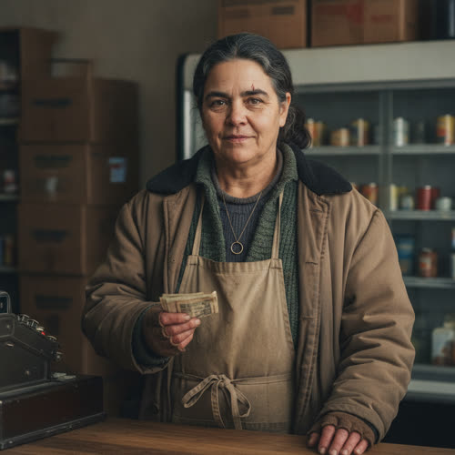

# Marisol Vega

## Basic Information

**Full name:** Marisol Vega
**Common name:** Marisol [open] (the only name given in Chapter 1)
**Age at the start of Book One:** 55
**Birth date:** July 19, 1998 (not listed in `../../timeline/character-birth-dates.md`; invented under Section 6 and tagged for the spine)
**Birthplace:** Detroit, Michigan
**Current residence:** The apartment above her grocery, in Eli's neighborhood, Greater Detroit
**Household:** Lives alone above the shop. Widowed. One adult daughter living elsewhere.
**Occupation:** Grocer. She works the counter and keeps the neighborhood grocery open. [open] She is the proprietor who held the doors open after the parent chain withdrew from the district.
**Faction or class:** Everyone Else, per `../../world/social-structure.md`. [open] (She is plainly outside the protected systems: a cold shop, a dark dairy case, cash passed hand to hand.)
**Primary viewpoint:** No. She is never a point-of-view character.
**Story role:** Minor recurring walk-on. The human face of the everyday economy and the neighborhood's barometer of the polite withdrawal. In Chapter 1 she shows Eli the same corporate hand closing on a dairy case that is closing on the towers, the grid, and the clinic.

## Physical and Identifiers



### Frame

Five feet four inches, sturdy and short, with the settled weight of a woman who has stood behind a counter for thirty years. Her posture is square and planted, shoulders rounded forward a little from years of reaching across the counter and lifting cases. She does not loom. She holds her ground.

### Coloring

Warm brown complexion, weathered at the hands and the back of the neck from cold work. Dark hair gone iron-gray at the temples, thick and coarse, kept in a low practical knot she redoes without a mirror. Brown eyes, quick, that move to follow where a customer is looking before the customer has said anything. [open] (In Chapter 1 she reads Eli's eyes on the dark case and answers the question he has not asked.)

**Heritage:** Mexican-American, Latina: Detroit-born, southwest-Detroit roots.

### Face

A broad, open face, lined at the mouth and the outer eyes from a lifetime of an expression that lands just short of a smile. [open] Her resting expression is the "almost smiling" the chapter names: an habitual, held warmth that is half welcome and half armor. Heavy brows. A short straight nose. The face of someone people tell things to.

### Hands and handedness

Right-handed. Grocer's hands: broad palms, short clean nails, knuckles beginning to thicken, skin chapped red across the backs from the open chill of the shop. She counts soft worn bills with a dry quick thumb and knows a counterfeit by feel, not sight. [open] (She takes Eli's "soft worn bills" hand to hand.) Her hands reveal cold, repetition, and cash: a register worked by hand, a case stocked by hand, a trade economy run by hand.

### Distinguishing marks

A shiny burn scar the size of a coin on the inside of her left forearm, from a hot plate in the back of the store years ago. A pale nick through her right eyebrow from a thrown can when she was a girl behind a different counter. A faded gold band she still wears on a chain rather than her finger, the finger having thickened past it. No tattoos. A chipped lower front tooth she never had capped because the dentist that would have done it stopped being a thing the neighborhood had access to.

### Identity and body status (2053)

Legally registered, practically stranded, per `../../technology/infrastructure/identity-and-money.md`. Her verified digital identity still exists on paper, but the grocery's link to the parent chain's payment and supply systems went silent the way everything goes silent now, so she runs on cash, barter, and a community ledger instead. She has no augmentations and no implants, partly economy and partly principle: she distrusts a thing that has to ask a server for permission to work, having watched her own dairy case do exactly that. [behavior-only] No prosthetics. Chronic condition: early osteoarthritis in both hands, aggravated by the cold shop, managed at the community clinic under care-without-a-bill, the same clinic Lena runs.

### Movement and voice

She moves economically, no wasted steps behind a counter she could work blind. A slight favoring of the right hip late in the day. Her voice is low, even, and unhurried, with a flat Detroit vowel and a faint Spanish cadence under it from the household she grew up in. She delivers bad news in the same register she would use to say it had rained, which is the chapter's own description of how she tells Eli the compressor is gone. [open]

### Grooming and default dress

Unfussy and warm. In Chapter 1 she is behind the counter with her coat on, inside, because the shop is cold, and that single fact tells Eli most of what he needs before he crosses the floor. [open] Default dress: a heavy buttoned work coat over layered sweaters through the cold months, an apron with a deep cash pocket, fingerless gloves she cuts herself so she can still count bills, worn rubber-soled shoes that grip a wet floor. Hair in the low knot. Scent of coffee, cardboard, and the cold-store chemical tang of the dairy case. No jewelry but the band on its chain.

## Personality

In public Marisol is warm, plain-spoken, and unsentimental. She runs a shop that is "the good warm yellow of a place that wanted you to come in," and the warmth is real and also a deliberate signal she maintains on purpose. [open] She tells people the truth flatly and early, because she has decided that the kindest thing she can do is let a neighbor plan around what is actually failing rather than what they wish were failing. In private she is tired, careful, and quietly grieving, rationing her own dread the way she rations the last two cold doors.

Her humor is dry, folk-poetic, and aimed at the absurdity of obedient machines. "Everybody's house thinks something now," she says, almost smiling, and the line is both a joke and a verdict. [open] She anthropomorphizes the failures because it is funnier and truer than the corporate language: a controller that "wants to call home and nobody's home." [open]

**Articulated goal:** Keep the shop open and stocked enough to stay worth walking into.
**Deeper need:** To remain counted on. To not be quietly reclassified, the way the neighborhood was, into a thing not worth the cost of serving.
**Governing fear:** That hers will be the last lit doorway on the street, and then one cold morning it will not be worth it either, and the warm yellow will go gray as the inside of a switched-off screen.
**Core contradiction:** She tells everyone else the unvarnished truth about what is failing, while keeping her own shop's warmth and her own almost-smile as a maintained fiction of normalcy. She manages the street's despair and hides her own.
**Moral boundary:** She will not hoard, gouge a scarcity, or lie about what has actually broken. She will not turn the shortage into leverage over people who know her name.
**What could make them cross it:** If holding the last cold door for a stranger meant her own daughter going without, or her own survival being the price, she could begin to ration by who she loves rather than who is in front of her, and tell herself it was only sense.
**Private reading of the collapse:** Nobody blew anything up. The companies just stopped picking up the phone, finger by finger, and were polite about it. The machines kept their manners and abandoned us. "Everybody's house thinks something now," and not one of those thoughts is about the people in the house.
**Personal definition of human value:** You are worth what you keep running for the people who know your name. Value is being the place the street counts on.
**What they are preserving:** The ordinary daily exchange. A lit door, a warm room, a face that knows you, a place to come in out of the cold and be known. (Her entry in the Final Character Standard.)

## Daily Life and Habits

She wakes above the shop and comes down before light to open. First thing, every morning, she checks the two working dairy doors, the way you check a pulse, because the long case is dying a door at a time and she wants to know the hour it loses another. [open, behaviorized] She lights the warm sign and props the heater that barely touches the room, then keeps her coat on, because the heat is one of the costs that no longer pencils out. [open]

For money she takes whatever moves: soft worn cash hand to hand for small things like coffee, local credits, and barter for the rest, per `../../technology/infrastructure/identity-and-money.md`. [open for cash] She keeps a hand-written ledger of who owes and who is owed and squares it against the neighborhood food-trade board (run by Dembele, established Chapter 2) for the things the dead supply chain no longer brings. She trades near-dated stock for eggs, repairs, and labor. She paid Nolan Avery in goods to come look at the compressor. [open that she called Nolan]

She eats from the shop, mostly what is closest to its date. She sleeps light, half-listening for the compressor note that tells her the case is still alive. She does not commute; her whole world is the building. She closes at dusk, counts the till by hand, and writes the day into the ledger before she climbs the stairs.

## Hobbies and Interests

- A window box and a few pots of herbs and chilies she grows on the shop's south sill, partly for the smell of something living in a cold room and partly to trade.
- A battered radio she keeps tuned to whatever still broadcasts, which is less every season; she likes the company of a human voice that is not a notice.
- Old recorded telenovelas on a screen behind the counter, watched in fragments between customers, for the pleasure of a story where the trouble is only people.

## Likes and Dislikes

Likes: the smell of the shop at opening, strong dark coffee, the brass bell over the door, the kids who cut through on the way to the program, a bill so worn it is soft as cloth, the compressor's low steady note. Dislikes: the dark length of the case past the two lit doors, the clean machine-written type of the notices, waste, the particular silence where a hum used to be, and being thanked for her cooperation. [the case and the notices are canon-grounded; the rest accepted as canon (Decision 056)]

## Relationships

Structured edges (machine-readable; one edge per line, `relation: profile-slug`):

```
- colleague: [Talia Reed](./reed-talia.md) (proposed; reciprocal of Talia's grocery-coordination edge)
- colleague: [Sekou Dembele](./dembele-sekou.md) (reciprocal of Dembele's food-board edge)
- neighbor: [Marcus Vance](./vance-marcus.md) (proposed; reciprocal)
- neighbor: [Raymond Dorsey](./dorsey-ray.md) (proposed; reciprocal)
```

Reciprocity note: the symmetric `colleague` edges to `./reed-talia.md` and
`./dembele-sekou.md` and the `neighbor` edges to `./vance-marcus.md` and
`./dorsey-ray.md` are the matching halves of edges those profiles carry to
Marisol, all normalized together in this pass, so each pair agrees. Rafael Vega (late husband) has no profile and is not carried as an edge; he is
held in the prose entry below. Dropped (derived inverse): the `adult-daughter` edge to
Camila, since a parent stores no child edge; if Camila is ever profiled she
carries the `mother` edge, and her departure stays in prose. Re-homed (non-edge):
the customer tie to `./rook-eli.md` (a regular buying coffee), the repair tie to
`./avery-nolan.md` (she calls him for the compressor), and the barter routing
through the food board are supply, customer, and repair logistics, recorded in the
prose and Daily Life below, not as edges.

**Eli Rook** (`./rook-eli.md`). A regular customer and a neighbor she trusts to actually fix a thing. [open] She follows his eyes to the dark case and answers before he asks, gives him the real diagnosis in plain language, and tells him to buy his coffee today because she cannot promise the two doors hold. [open] The bond is practical mutual respect between two people who keep things running by hand. What she wants from him: that he keep coming in, and that one day he might keep her case cold. What he gets from her: an early, honest read of the withdrawal, delivered without drama.

**Nolan Avery** (`./avery-nolan.md`). The man she calls when something electrical or mechanical fails. [open, that she called him for the compressor] Two infrastructure elders of the same generation, easy with each other, paid in goods and favors. He looked at her compressor and told her the truth she relayed to Eli: not the compressor, the controller. The tension is gentle: he is prouder and more bitter about the new machines than she lets herself be. What each wants: continuity, and someone of their age who remembers how the street used to run.

**Rafael Vega**. Her husband, dead about three years, of an untreated condition during the healthcare withdrawal. She wears his band on a chain. The relationship is now grief carried as habit; see Private History.

**Camila Vega**. Left the neighborhood for work in a protected enclave. The bond is love stretched thin across the line between the served and the abandoned. What Marisol wants: that her daughter is safe and warm, even at the cost of being gone.

## Voice and Speech

Low, even, economical. Short declarative sentences. She delivers hard facts in the register of small weather, "the way you would say it had rained Tuesday." [open] Her vocabulary is plain and physical, but she reaches for folk-poetic anthropomorphism when she names a failure, because the corporate words are useless: a controller that "wants to call home and nobody's home," a house that "thinks something now." [open] She often says the diagnosis and the remedy in the same breath, then steps back. Verbal tic: an almost-smiling aside as she turns away, the joke offered on the exit. [open] Under stress she gets shorter and more practical, rationing words like stock, and stops offering the almost-smile.

## History and Background

Born and raised in Detroit, in and around small grocery work, the kind of family business that survived on knowing every customer by name. She came up behind counters and never left them. She married Rafael, raised one daughter, Camila, and ran the neighborhood store through the long decline as the chain that nominally owned it pulled out of the district under the same polite notices that took the towers and the grid. When the parent company withdrew, she did not close. She kept the doors open as a community store on cash and barter, becoming a fixture of the everyday economy described in `../../world/social-structure.md`.

By Book One she has buried a husband to the withdrawal of care, watched her daughter cross to the protected side of the line, and is running a dairy case that is failing one cold door at a time. The compressor on the long case quit on a Tuesday; she called Nolan; the answer was the same answer the whole neighborhood is getting. [open]

## Private History and Behavioral Roots

- Watched Rafael die waiting on an authorization from an insurer that had quietly stopped existing -> she now tells customers plainly what has failed and pushes them to take what they need today, and will not let the obsolete fear of cost keep a neighbor from a thing. [behavior-only] (proposed)
- Has watched the long case go dark a door at a time over months -> she checks the two working doors first thing every morning, touches them like a pulse, before she does anything else. [behavior-only] (proposed)
- Her daughter left for the protected side and the calls thin every month -> she keeps the shop deliberately "warm yellow," because a lit doorway is the one signal she can still send into a street that is going dark. [behavior-only] (proposed)
- Grew up behind a counter run by a mother who never raised a price on a short week -> she refuses to gouge a scarcity even when she could. [behavior-only] (proposed)
- The chain abandoned her store with clean machine-written type and a thank-you -> she distrusts notices and trusts a hand she can see, which is why she would rather Eli or Nolan stand in front of the broken thing than any company. [behavior-only] (proposed)

## Secrets

- She has been quietly carrying families who cannot pay, eating the loss against her own thin margin, and tells no one, because charity named aloud shames the person receiving it. Exposure would embarrass the neighbors she protects and reveal how close the shop is to the edge. [reveal: Book 1] (proposed)
- She keeps a small hidden reserve of cash and trade goods against the morning the shop finally fails, and is privately ashamed that she is already planning her own exit while telling the street to hold on. [reveal: Book 1] (proposed)
- Camila has largely stopped answering, and Marisol still tells customers her daughter is fine and busy. The gap between the line she says and the silence she lives with is the thing she guards most. [reveal: Book 2] (proposed)

## Role and Series Potential

In Chapter 1 her function is precise: she is the first place Eli sees the single shape behind the morning's separate failures, a dairy case dying of the same withheld permission that is killing the towers, the grid, and the clinic. She delivers the chapter's governing image in folk terms, "the controller wants to call home and nobody's home," and hands Eli the phrase he files and later cannot keep separate. Book One arc, minor: from maintaining the fiction of normalcy toward letting the street see how thin it has worn. Long-term series potential: if promoted, her shop is a natural early node for Morrow to keep cold and stocked, making her an early test of whether a community will accept a stranded system being taught to run on a forged yes, and a human gauge of what that yes is worth. She could become either an early adopter or a principled refuser of Morrow's help. False belief, if promoted: that keeping up appearances protects people. Truth she would learn: that the street can carry the truth better than the performance of fine.

Writing rules: do not make her a saint of the poor; her generosity is real and also self-interested and tired. Do not let her folk wisdom be simply correct. Keep her almost-smile as armor, not warmth alone. Never let her explain the theme out loud past what Chapter 1 already gives her.

## Continuity Anchors

Static, immutable. A drafter must not contradict these.

- Her name in approved prose is Marisol, first name only. [open]
- She works behind the counter of the neighborhood grocery, which is "the good warm yellow of a place that wanted you to come in." [open]
- She wears her coat on, inside, because the shop is cold. [open]
- The compressor on the long dairy case quit on a Tuesday. She called Nolan Avery to look at it. The diagnosis is the controller, not the compressor: "It's not the compressor. It's the controller wants to call home and nobody's home." [open]
- The long case is down to two working doors, holding milk and the cultured stuff that keeps; the rest stands unlit, pulled empty and clean. [open]
- She rings up Eli's coffee and takes payment in soft worn cash, hand to hand. [open]
- She tells Eli to buy the coffee today: "You want it, I'd take it today. I don't know how long I hold the two." [open]
- As Eli turns to go she says, almost smiling, "Everybody's house thinks something now." [open]
- Accepted as character canon under Decision 056: surname Vega; age 55; birth date July 19, 1998; birthplace Detroit; proprietor status; widowhood and the late husband Rafael; the daughter Camila; the household above the shop; all physical identifiers; and the hobbies, daily life details, and likes/dislikes of this profile. (The behavior-only and reveal-tagged items remain author-facing and are not stated on the page.)
