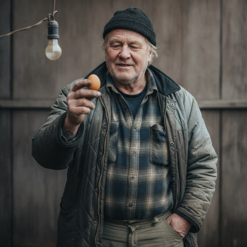

# Marek Vesely

## Basic Information

**Full name:** Marek Vesely
**Common name:** Vesely, or "the Vesely place" for the smallholding [open] (the only name in approved Chapter 2)
**Age at the start of Book One:** 66
**Birth date:** September 12, 1987 (not listed in `../../timeline/character-birth-dates.md`; invented under Section 6 and offered to the spine)
**Birthplace:** Detroit, Michigan, grandson of Czech immigrants who settled the family lot (grounds the Czech surname and the inherited smallholding)
**Current residence:** The Vesely place, a smallholding on the edge of the neighborhood in Greater Detroit, with brown-egg hens
**Household:** Lives on the smallholding, widowed or long single; the place is a one-keeper operation he runs alone. The "Vesely place" reads in prose as a household and a producer at once. [open]
**Occupation:** Hen-keeper and small producer. He keeps the brown-egg flock and supplies the neighborhood food board with eggs, the start of the barter chain. [open that the place is the egg source]
**Faction or class:** Everyone Else, per `../../world/social-structure.md`. [open] (He is the canon example, made flesh, of "someone who held a corporate job keeps chickens.")
**Primary viewpoint:** No. He is never a point-of-view character.
**Story role:** Minor offscreen walk-on. The head of the egg ledger: the producer whose surplus, routed by Dembélé through the Okonkwos, becomes a doctor's fee. He grounds the social-structure canon that displaced corporate workers turn to keeping chickens, and anchors where the food in the chain actually comes from.

## Physical and Identifiers




<!-- voice:start -->
_Voice (default sample):_

<audio controls src="../voices/vesely-marek/vesely-marek-1.mp3"></audio>

[Play voice](../voices/vesely-marek/vesely-marek-1.mp3)
<!-- voice:end -->
### Frame

Five feet ten inches, broad and thickened through the chest and forearms from outdoor work, a soft heaviness over real strength. The slightly bowlegged, ground-planted stance of a man who spends his days on uneven dirt, bending to coops and hauling feed. He stands like someone braced against weather.

### Coloring

Fair, weathered complexion, ruddy and chapped across the cheeks and the back of the neck from year-round outdoor work, pale where the collar covers. Hair a faded sandy gray, thinning on top, kept short under a cap; a few days of pale stubble most of the time. Pale blue-gray eyes set in a permanent slight squint from the open sky.

**Heritage:** White American: Czech, grandson of Czech auto-plant immigrants.

### Face

A broad, heavy face, jowled now, with deep weather lines and a habitually mild, closed expression, the face of a man who talks more easily to animals than to people. A bulbed nose reddened by cold. The resting look is patient and a little wary, warming slowly. He smiles with the eyes before the mouth.

### Hands and handedness

Right-handed. Real farmer's hands, the opposite of Dembélé's: thick, cracked, permanently grimed in the creases, nails split and short, a grip that has wrung necks and mended wire and carried feed sacks for decades. He candles an egg against a bare bulb to read it, turning it in fingers that know a good brown one by weight and shell. The hands reveal daily physical husbandry, the bottom of the food chain done by hand.

### Distinguishing marks

A missing tip on the left ring finger, taken years ago by a machine in the auto-parts plant that employed him before the withdrawal, the injury that quietly marks where his first life ended and the second began. A scatter of small healed peck and wire scars across the backs of both hands. A burst of broken capillaries across the nose and cheeks from cold and drink. A faded blue-green tattoo on the left forearm, a half-legible thing from his youth he never explains. Teeth worn and tobacco-stained.

### Identity and body status (2053)

Legally registered, economically self-stranded by choice as much as by circumstance, per `../../technology/infrastructure/identity-and-money.md`. His verified identity exists; he uses it for almost nothing, having built a life that needs no server's permission, a flock, a lot, a board. No augmentations, no implants; he distrusts anything that has to ask a company to keep working, having watched the plant that employed him automate and then close. [behavior-only] No prosthetics beyond the missing fingertip. Chronic conditions: bad knees and a smoker's chest he ignores until the clinic makes him sit down, a back that the feed sacks have ruined, all managed without a bill at Lena's clinic.

### Movement and voice

He moves slowly and surely over rough ground, deliberate, never hurried, conserving the back and the knees. His voice is a low, gravelly rumble, sparing of words, with a flat Michigan accent and a faint Central European shape on certain vowels inherited from the grandparents' household. He grunts more than he talks and lets a nod do the work of a sentence.

### Grooming and default dress

Rough, warm, and functional, dressed for the coop in all weather. Default dress is layered flannel and a quilted coat gone shiny and stained, work trousers, rubber muck boots, fingerless gloves, and a knit cap pulled low. He smells of straw, feed, woodsmoke, and the ammoniac warmth of a henhouse, a smell he no longer notices and others do. He is clean enough and no more; grooming is not where his pride lives. His pride is in the eggs.

## Personality

In public, which for him is the board and the clinic and a few doorsteps, Vesely is taciturn, dependable, and undemonstrative, a man whose word is in the quality of his eggs rather than in anything he says. He is reliable to the point of stubbornness, shows up, settles, and goes home. In private he is solitary by preference and a little melancholy, a man who lost a trade and a workforce of fellow men and replaced them with a flock, and who finds the hens easier company than the people the eggs travel to.

His humor is bone-dry and rare, delivered deadpan in three or four words, usually at his own expense or the hens'. He takes a quiet, almost unspeakable pride in the fact that everyone in the chain wants "the brown ones," that his eggs are the good ones, the standard the board sorts by.

**Articulated goal:** Keep the flock healthy and laying and the place going, and put good brown eggs into the chain reliably enough that his name on the board means quality.
**Deeper need:** To still be a producer, a man whose hands make a real thing the neighborhood needs, after the plant took his trade and his fellow workers and left him with nothing to build.
**Governing fear:** That the flock fails, disease or a hard winter or his own failing back, and he becomes a man who keeps nothing and produces nothing, only another mouth on Dembélé's board.
**Core contradiction:** He distrusts depending on anyone or anything, and built a self-sufficient little world to prove it, yet his eggs only mean anything because they enter a chain of obligation he cannot control and a board he does not keep.
**Moral boundary:** He will not put a bad egg into the chain or pass off the small pale ones as the browns. The quality is the one honest thing he has, and he will not adulterate it.
**What could make them cross it:** If a hard season thinned the flock and he needed to settle his own debts, he might quietly stretch the count or send the seconds as firsts, and hate himself for becoming the kind of supplier the old plant had been.
**Private reading of the collapse:** The plant did not fail. It worked better without them. That was the whole lesson, that you could be good at your job for twenty years and the job could simply decide it no longer needed the men. So he stopped depending on jobs. A hen does not lay you off. The eggs come or they do not, and either way it is between him and the animal, with no company in the middle to change its mind.
**Personal definition of human value:** You are worth what you can make with your hands that someone actually needs. Value is being a producer, not a permission.
**What they are preserving:** The honest brown egg and the self-sufficient place that makes it, a small proof that a man's hands can still feed a street without a company's leave. (His entry in the Final Character Standard.)

## Daily Life and Habits

He rises before light to the coop, the one schedule that never withdrew, because hens keep the old hours regardless of what the grid does. He feeds, waters, gathers, candles, and sorts, browns to the board and seconds to the pot, then mends what the night broke, wire, latch, roof, against predators and cold. [the routine accepted as canon (Decision 056); the brown eggs and the board are canon] Midmorning he carries or sends the day's surplus to Dembélé's board, where it enters the chain, "Vesely to Okonkwo Wednesday." [open]

For money he uses almost none, per `../../technology/infrastructure/identity-and-money.md`. [open] He trades eggs for feed, for repairs to the place, for the clinic's care, and for the few things the lot cannot make. He eats simply and seasonally, eggs and what the garden gives and what the chain brings back. He does not commute; the place is his whole circuit. He turns in early, listens for the flock, and sleeps light against foxes and thieves.

## Hobbies and Interests

- The birds themselves, beyond their use: breeds, broodiness, the small daily drama of a flock's pecking order, a genuine stockman's interest he would never call a hobby.
- Mending and making, fences, coops, a kitchen garden, the satisfaction of fixing a thing with what is on hand rather than ordering a part that will never come.
- Home-brewing and pickling, a Central European inheritance from the grandparents, beer and kraut and preserved eggs he trades and shares.

## Likes and Dislikes

Likes: a full nest box, a hen that goes broody and raises her own, the weight of a good brown egg in the hand, woodsmoke, quiet, a fair trade settled without talk, the fact that the board sorts by "the brown ones" (the brown-egg quality is canon-grounded; the rest accepted as canon (Decision 056)). Dislikes: predators, a thief, a bad winter, talk for its own sake, anything that has to phone a company to work, and being thanked at length (the distrust of phoning-home systems is world-grounded; the rest accepted as canon (Decision 056)).

## Relationships

Structured edges (machine-readable; one edge per line, `relation: profile-slug`):

```
- patient-of: [Lena Okafor](./okafor-lena.md)
```

Re-homed (barter logistics, not edges, per profile-spec.md): the Vesely place
supplies brown eggs into the chain, to the Okonkwos, onto Dembélé's board, and to
the Reyes household. The former `egg-source-for` (Okonkwo), `supplies-board`
(Dembélé), and `supplies-eggs-to` (Reyes) labels are supply logistics, not durable
bonds, so they are dropped from the edge list and carried in the descriptive prose
below. Kept: the directional `patient-of` edge, stored here on the patient
(Vesely); the clinician inverse is derived by traversal, never stored.

Reciprocity note: `patient-of` is directional and not reciprocity-checked.
`okafor-lena` is out of this batch, so no reciprocal edge is authored there.

**Dembélé** (`./dembele-sekou.md`). The board-keeper who turns his surplus into a settled chain. Vesely produces; Dembélé routes; "what the Vesely place had" is the top line of the board. [open] The two are a quiet pair, the man who makes the thing and the man who knows where it should go, neither able to do the other's half. What he wants from Dembélé: an honest, current accounting so the eggs reach the right doors and the right debts. What Dembélé gets: the reliable head of his favorite chain.

**Mrs. Okonkwo** (`./okonkwo-ngozi.md`). The household his eggs went to on Wednesday, settling "a thing they owed the Veselys from August." [open] A straight, formal trading relationship between two people who pay what they owe; she carried his browns on to the clinic the same week. What he wants from her: the August debt cleared. What she gets: the good brown eggs that become her doctor's fee.

**Hector Reyes** (`./reyes-hector.md`). A household on the board whose need his surplus answers, "what the Reyes place needed," eggs against a healing man's table. [open] What he wants: to keep a neighbor in protein through a bad stretch. What Reyes gets: eggs from a place that still produces.

**Dr. Lena Okafor** (`./okafor-lena.md`). The doctor who keeps his ruined back and smoker's chest going without a bill, and whom he pays the only way he pays anyone, in eggs through the chain. [proposed; consistent with care-without-a-bill canon] What he wants from Lena: to stay on his feet and laying-shed-capable as long as the flock needs him. What Lena gets: a steady producer whose eggs feed half her barter economy.

## Voice and Speech

Low, gravelly, and minimal. He speaks in short flat declaratives and grunts, and lets quality and reliability talk for him. His vocabulary is concrete and husbandry-bound, birds, feed, weather, wire, count. He does not editorialize and rarely volunteers; ask him a question and you get the fact and nothing around it. Verbal tic: he answers a thank-you with a single dismissive syllable and a nod, deflecting gratitude as if it were a draft. A faint Central European vowel surfaces on words the grandparents used. Under stress he goes fully silent and works harder with his hands.

## History and Background

Born in Detroit, grandson of Czech immigrants who came for the auto plants and kept a productive backyard lot in the old-country way, the lot that is now the Vesely place. He followed the men of the family into the plant, an auto-parts line, and gave it twenty years and a fingertip. [accepted as canon (Decision 056); grounds the displaced-worker canon] When the line automated and then the plant closed under the same withdrawal that took everything else, he did not move and did not retrain. He went back to the lot, built up the flock the grandparents had always half-kept, and turned a backyard habit into a smallholding that feeds a chain. [open that the place produces the chain's eggs]

By Book One the Vesely place is the reliable head of the neighborhood's egg supply, a one-man operation whose brown eggs are the standard the food board sorts by. He is the canon's displaced corporate worker who "keeps chickens," made specific: not a quaint hobbyist but a man who replaced a vanished trade with a flock because the flock cannot lay him off. [open, derived]

## Private History and Behavioral Roots

- Gave two decades to a plant that automated his line and then closed -> he built a life that depends on no company, a flock and a lot and his own hands, and bristles at anything that has to phone home to work. [behavior-only] (proposed)
- Lost the fingertip to a machine on the line -> he does the husbandry deliberately by hand, candling eggs against a bare bulb, mending wire by feel, taking a small stubborn pride in work no machine does for him. [behavior-only] (proposed)
- Lost the daily company of a workforce of fellow men when the plant closed -> he keeps to the flock and finds the hens easier than people, and lets his eggs do the socializing the chain requires. [behavior-only] (proposed)
- Comes from a household that kept a productive lot through hard times in the old country -> he treats self-sufficiency as inheritance and dignity, not deprivation, and would rather produce a poor thing than buy a fine one. [reveal: Book 1] (proposed)

## Secrets

- His back and chest are worse than he admits, and there is no one to take over the flock if he goes down, so he works through pain he hides from Lena and tells no one how close the whole place runs to one bad season. Exposure would force rest he cannot afford and reveal the place's fragility to a chain that depends on it. [reveal: Book 1] (proposed)
- On the thinnest weeks he has quietly held back eggs his own table needed to keep the board's count honest, eating less so the chain stays full, a self-denial he would be ashamed to have named as generosity. [reveal: Book 2] (proposed)

## Role and Series Potential

In Chapter 2 his function is to be the offscreen source, the place the food comes from, "the Vesely place, the brown ones." [open] He grounds the whole barter economy in actual production, the reminder that under the board and the ledger and the clever routing there is a man at four in the morning with cracked hands and a flock, making the thing everything else moves. He is the canon's "keeps chickens" line given a face and a history. Book One arc, minor: the steady producer whose quiet fragility, one back, one flock, one season, is the unspoken floor under the neighborhood's food. Long-term series potential: if promoted, the Vesely place is a natural early node for any system trying to keep a community fed without corporate supply, and Vesely a hard, skeptical test case, a man who already refused to depend on a company once and will not casually trust a new one, even Morrow. False belief, if promoted: that true self-sufficiency is possible, that he needs no one. Truth he would learn: that his eggs only mean anything inside the chain, that the producer needs the board as much as the board needs the producer.

Writing rules: do not romanticize the smallholding; it is cold, hard, fragile work, and his self-sufficiency is partly a wound. Keep him taciturn; resist giving him speeches. Let the eggs, not the man, carry his presence in scenes he is not physically in.

## Continuity Anchors

Static, immutable. A drafter must not contradict these.

- The Vesely place is canon as the source of the brown eggs, "they're from the Vesely place, the brown ones." [open]
- The Vesely place appears only offscreen in approved Chapter 2; no individual Vesely is on the page. [open]
- The Vesely browns are the eggs that go "Vesely to Okonkwo Wednesday, against a thing they owed the Veselys from August," then on to the clinic. [open]
- Dembélé's board matches "what the Vesely place had" against the streets that need it, including "what the Reyes place needed." [open]
- The Vesely place keeps hens that lay brown eggs, the standard the board sorts by. [open]
- Accepted as character canon under Decision 056: given name Marek; the single keeper as representative of the place; age 66; birth date September 12, 1987; Detroit birthplace and Czech-immigrant lineage; the auto-plant history and fingertip; living alone; all physical identifiers; and the hobbies, daily life details, and likes/dislikes of this profile. (The behavior-only and reveal-tagged items remain author-facing and are not stated on the page.)
