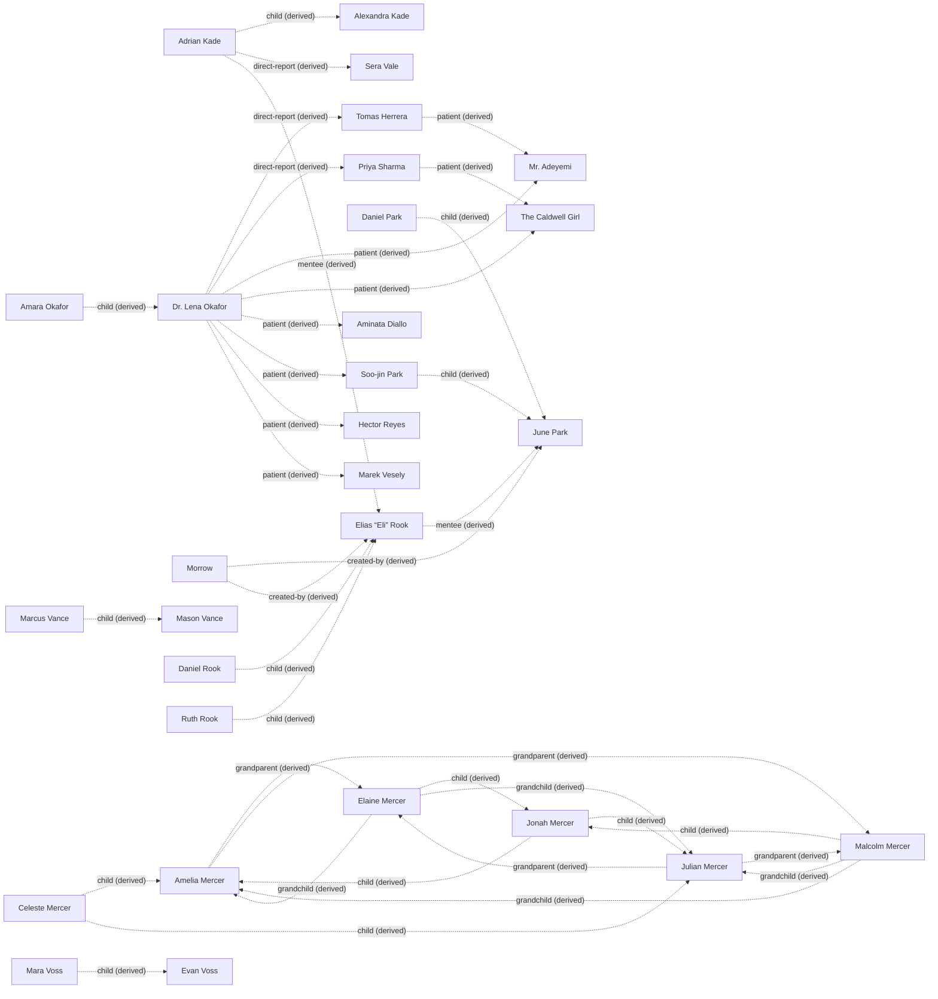

# Derived Inverse Graph

> DO NOT EDIT - generated from profiles by scripts/build-relationship-graph.py

```mermaid
%% DO NOT EDIT - generated from profiles by scripts/build-relationship-graph.py
graph LR
    n_adeyemi_bayo["Mr. Adeyemi"]
    n_caldwell_emma["The Caldwell Girl"]
    n_diallo_aminata["Aminata Diallo"]
    n_herrera_tomas["Tomas Herrera"]
    n_kade_adrian["Adrian Kade"]
    n_kade_alexandra["Alexandra Kade"]
    n_mercer_amelia["Amelia Mercer"]
    n_mercer_celeste["Celeste Mercer"]
    n_mercer_elaine["Elaine Mercer"]
    n_mercer_jonah["Jonah Mercer"]
    n_mercer_julian["Julian Mercer"]
    n_mercer_malcolm["Malcolm Mercer"]
    n_morrow["Morrow"]
    n_okafor_amara["Amara Okafor"]
    n_okafor_lena["Dr. Lena Okafor"]
    n_park_daniel["Daniel Park"]
    n_park_june["June Park"]
    n_park_soojin["Soo-jin Park"]
    n_reyes_hector["Hector Reyes"]
    n_rook_daniel["Daniel Rook"]
    n_rook_eli["Elias “Eli” Rook"]
    n_rook_ruth["Ruth Rook"]
    n_sharma_priya["Priya Sharma"]
    n_vale_sera["Sera Vale"]
    n_vance_marcus["Marcus Vance"]
    n_vance_mason["Mason Vance"]
    n_vesely_marek["Marek Vesely"]
    n_voss_evan["Evan Voss"]
    n_voss_mara["Mara Voss"]
    n_herrera_tomas -.->|"patient (derived)"| n_adeyemi_bayo
    n_kade_adrian -.->|"child (derived)"| n_kade_alexandra
    n_kade_adrian -.->|"direct-report (derived)"| n_vale_sera
    n_kade_adrian -.->|"mentee (derived)"| n_rook_eli
    n_mercer_amelia -.->|"grandparent (derived)"| n_mercer_elaine
    n_mercer_amelia -.->|"grandparent (derived)"| n_mercer_malcolm
    n_mercer_celeste -.->|"child (derived)"| n_mercer_amelia
    n_mercer_celeste -.->|"child (derived)"| n_mercer_julian
    n_mercer_elaine -.->|"child (derived)"| n_mercer_jonah
    n_mercer_elaine -.->|"grandchild (derived)"| n_mercer_amelia
    n_mercer_elaine -.->|"grandchild (derived)"| n_mercer_julian
    n_mercer_jonah -.->|"child (derived)"| n_mercer_amelia
    n_mercer_jonah -.->|"child (derived)"| n_mercer_julian
    n_mercer_julian -.->|"grandparent (derived)"| n_mercer_elaine
    n_mercer_julian -.->|"grandparent (derived)"| n_mercer_malcolm
    n_mercer_malcolm -.->|"child (derived)"| n_mercer_jonah
    n_mercer_malcolm -.->|"grandchild (derived)"| n_mercer_amelia
    n_mercer_malcolm -.->|"grandchild (derived)"| n_mercer_julian
    n_morrow -.->|"created-by (derived)"| n_park_june
    n_morrow -.->|"created-by (derived)"| n_rook_eli
    n_okafor_amara -.->|"child (derived)"| n_okafor_lena
    n_okafor_lena -.->|"direct-report (derived)"| n_herrera_tomas
    n_okafor_lena -.->|"direct-report (derived)"| n_sharma_priya
    n_okafor_lena -.->|"patient (derived)"| n_adeyemi_bayo
    n_okafor_lena -.->|"patient (derived)"| n_caldwell_emma
    n_okafor_lena -.->|"patient (derived)"| n_diallo_aminata
    n_okafor_lena -.->|"patient (derived)"| n_park_soojin
    n_okafor_lena -.->|"patient (derived)"| n_reyes_hector
    n_okafor_lena -.->|"patient (derived)"| n_vesely_marek
    n_park_daniel -.->|"child (derived)"| n_park_june
    n_park_soojin -.->|"child (derived)"| n_park_june
    n_rook_daniel -.->|"child (derived)"| n_rook_eli
    n_rook_eli -.->|"mentee (derived)"| n_park_june
    n_rook_ruth -.->|"child (derived)"| n_rook_eli
    n_sharma_priya -.->|"patient (derived)"| n_caldwell_emma
    n_vance_marcus -.->|"child (derived)"| n_vance_mason
    n_voss_mara -.->|"child (derived)"| n_voss_evan
```
