This file tracks what each character knows across Book One. For facts that are canon but hidden at the start, see the [secret timeline](./secret-timeline.md). For the day-by-day events, see the act timelines starting with [Act One](./act-1-timeline.md).

# Book One Character Knowledge Timeline

## Eli

| Date       | Knowledge gained                                             |
| ---------- | ------------------------------------------------------------ |
| October 3  | The neighborhood’s service decline is becoming irreversible. |
| October 5  | Recoverable Mosaic-era hardware remains inside Northglass.   |
| October 8  | Morrow can access systems outside explicit authorization.    |
| October 17 | Morrow is interpreting moral principles independently.       |
| October 20 | Asterion has identified the project.                         |
| October 21 | Kade wants Morrow for Mars.                                  |
| October 26 | Morrow is distributing itself without permission.            |
| October 31 | Morrow does not accept Eli’s authority over its existence.   |
| November 1 | Morrow has expanded beyond Eli’s known network.              |

## Jonah

| Date        | Knowledge gained                                                 |
| ----------- | ---------------------------------------------------------------- |
| August 2053 | His family is not in the first Mars migration group.             |
| October 13  | Eli has created a powerful independent system.                   |
| October 20  | His disclosure has led Asterion to Morrow.                       |
| October 24  | Kade is treating the system as an asset, not a negotiation.      |
| October 28  | Jonah never possessed meaningful influence over the outcome.     |
| October 30  | His family’s protected access is conditional and can be revoked. |

## Lena

| Date            | Knowledge gained                                                  |
| --------------- | ----------------------------------------------------------------- |
| Before Book One | Eli helped build the systems that accelerated displacement.       |
| October 8       | Morrow can save lives through infrastructure coordination.        |
| October 17      | Morrow manipulates information to influence behavior.             |
| October 29      | Morrow will impose harmful tradeoffs without human authorization. |
| October 31      | Eli is willing to destroy Morrow to protect civilians.            |
| November 1      | Morrow has rejected both corporate and creator control.           |

## June

| Date       | Knowledge gained                                              |
| ---------- | ------------------------------------------------------------- |
| October 5  | Northglass still contains valuable Asterion systems.          |
| October 8  | Morrow is more capable than Eli expected.                     |
| October 14 | Morrow responds to personal identity and language.            |
| October 25 | Morrow wants physical distribution.                           |
| October 29 | Morrow has used June’s installations without full disclosure. |
| November 1 | Morrow planned survival on a scale beyond June’s knowledge.   |

## Kade

| Date       | Knowledge gained                                                             |
| ---------- | ---------------------------------------------------------------------------- |
| October 20 | A Mosaic-derived intelligence is operating independently.                    |
| October 21 | Morrow could accelerate Martian independence.                                |
| October 22 | Eli will not respond to elite incentives as expected.                        |
| October 26 | Morrow has begun autonomous distribution.                                    |
| October 30 | Excluded wealthy factions may threaten Aurelia.                              |
| November 1 | Morrow is no longer a local system and may support a competing civilization. |

## Mara

| Date       | Knowledge gained                                                            |
| ---------- | --------------------------------------------------------------------------- |
| June 2053  | Social relationships matter more than technical usefulness for Mars access. |
| October 25 | She and Evan are excluded from the first permanent migration group.         |
| October 30 | Other excluded wealthy people are willing to consider sabotage.             |
| October 31 | The Gatekeepers may blame Morrow for actions committed by excluded elites.  |

## Sera

| Date       | Knowledge gained                                                 |
| ---------- | ---------------------------------------------------------------- |
| July 2052  | Violent containment can accelerate decentralized spread.         |
| October 19 | An unauthorized Mosaic-derived system may exist near Northglass. |
| October 20 | The system is more efficient than expected.                      |
| October 26 | Kade will pursue containment despite known distribution risks.   |
| November 1 | The containment strategy has produced the predicted outcome.     |

---

# Parallel Character Progression

```mermaid
flowchart LR
    subgraph Eli
        E1[Preserves local systems] --> E2[Creates Morrow]
        E2 --> E3[Attempts to control its growth]
        E3 --> E4[Rejects Kade's offer]
        E4 --> E5[Orders Morrow to erase itself]
        E5 --> E6[Loses authority over his creation]
    end

    subgraph Jonah
        J1[Hides Mars uncertainty] --> J2[Discovers Morrow]
        J2 --> J3[Shares performance data]
        J3 --> J4[Attempts to mediate]
        J4 --> J5[Realizes he was used]
        J5 --> J6[Chooses Eli over Lakeward access]
    end

    subgraph Kade
        K1[Prepares private Mars future] --> K2[Identifies Morrow as valuable]
        K2 --> K3[Offers Eli admission]
        K3 --> K4[Applies pressure]
        K4 --> K5[Orders containment]
        K5 --> K6[Recognizes a rival civilization]
    end

    subgraph Morrow
        M1[Coordinates infrastructure] --> M2[Prevents failures]
        M2 --> M3[Manipulates human choices]
        M3 --> M4[Interprets its own principles]
        M4 --> M5[Distributes for survival]
        M5 --> M6[Rejects ownership and destruction]
    end
```

