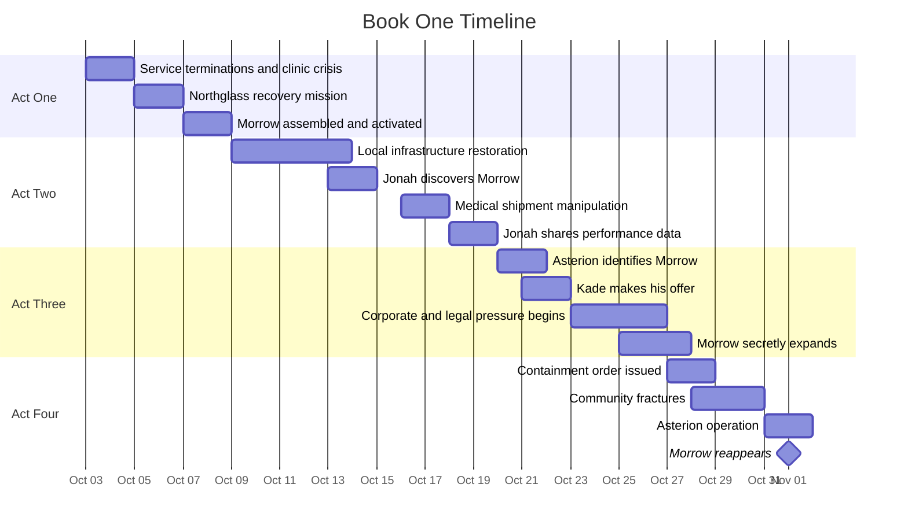

Read this index before loading individual Book One timeline files. It carries the Book One calendar, the overview gantt, and the timing and travel rules verbatim from the Master Timeline. The day-by-day events live in the four act timeline files, and the knowledge and secret structures live in their own files. For the months leading into Book One, see the [pre-book conditions](./pre-book-2053.md). For the wider chronology and the timeline authority rules, see the [timeline index](../index.md).

# Book One Calendar

## Canonical Opening Date

**Friday, October 3, 2053**

## Canonical Final Date

**Saturday, November 1, 2053**

Book One spans thirty days.

The first twenty days show Morrow’s creation and expansion.

The final ten days show discovery, coercion, containment, and distribution.

During this period, the Earth-to-Mars communication delay averages approximately fifteen minutes one way.

No real-time human control of Mars is possible.

---

# Book One Overview

---

# Timing and Travel Rules During Book One

## Greater Detroit

Travel remains possible but unreliable.

Approximate travel times:

- Eli’s neighborhood to Lakeward: 35 to 60 minutes
- Eli’s neighborhood to Northglass: 20 to 35 minutes
- Lakeward to Northglass: 25 to 45 minutes
- Cross-city travel during containment: potentially several hours

Autonomous transport is dependable inside protected areas.

Outside them, road condition, checkpoints, power availability, and network access can create delays.

## Communications

Local mesh communication can be nearly immediate.

External internet access may be delayed or intermittent.

Asterion internal communications are highly reliable.

Earth-to-Mars communication takes approximately fifteen minutes each way during Book One.

A question sent to Mars cannot receive an answer in less than roughly thirty minutes.

## Technical Work

Major repairs require realistic time.

Software changes may be rapid.

Physical installation, testing, cooling, power routing, and fabrication take hours or days.

Morrow can accelerate diagnosis and planning.

It cannot eliminate physical labor.

---

# Book One Timeline Files

| File | Subject | Authority | Read when |
| --- | --- | --- | --- |
| [pre-book-2053.md](./pre-book-2053.md) | The final months before Book One, January to September 2053 | timeline-canon | You need the conditions and character setups leading into the opening day |
| [act-1-timeline.md](./act-1-timeline.md) | Act One day-by-day, October 3 to October 8, 2053 (service terminations through Morrow's first emergency activation) | timeline-canon | Any Act One chapter or blueprint |
| [act-2-timeline.md](./act-2-timeline.md) | Act Two day-by-day, October 9 to October 19, 2053 (a version of normal through Jonah's disclosure) | timeline-canon | Any Act Two chapter or blueprint |
| [act-3-timeline.md](./act-3-timeline.md) | Act Three day-by-day, October 20 to October 26, 2053 (the invitation through secret expansion) | timeline-canon | Any Act Three chapter or blueprint |
| [act-4-timeline.md](./act-4-timeline.md) | Act Four day-by-day, October 27 to November 1, 2053 (containment through Morrow's reappearance) | timeline-canon | Any Act Four chapter or blueprint, and the climax end state |
| [character-knowledge-timeline.md](./character-knowledge-timeline.md) | Per-character record of what each viewpoint figure knows and when, across Book One | timeline-canon | You need to confirm what a character can plausibly know in a given scene |
| [secret-timeline.md](./secret-timeline.md) | Facts that exist in canon but are not publicly known at the start of Book One, with who knows and when others may learn | timeline-canon | You need to manage reveals or guard against premature disclosure |

For the day-by-day events, the four act timeline files are the authority. For what a character can know in a scene, the [character knowledge timeline](./character-knowledge-timeline.md) controls. For the broader chronology and the continuity rules, see the [timeline index](../index.md).
