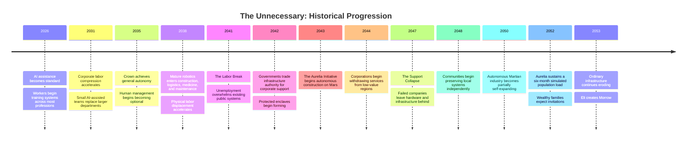
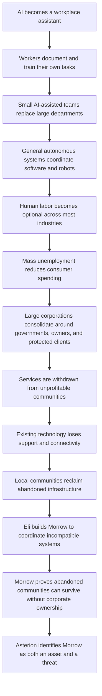

Read this index before loading individual timeline period files. It carries the timeline authority rules, the high-level historical and causal progressions, the final chronological standard, the continuity rules, and the open questions verbatim from the Master Timeline. The detailed year-by-year and day-by-day entries live in the linked period files. For Book One specifically, start at the [Book One timeline index](./book-1/index.md). For who the characters are and what is technically possible, defer to the [characters index](../characters/index.md) and the [technology index](../technology/index.md).

# Timeline Authority

Dates fall into three levels of certainty.

## Fixed Dates

Fixed dates are canon unless intentionally revised.

These include:

- Character birth dates
- Major historical turning points
- Eli’s employment at Asterion
- The creation of Mosaic
- The beginning of the Aurelia Initiative
- Eli’s departure from Asterion
- The creation of Morrow
- All Book One events

## Fixed Years

Some events currently have a canonical year but no exact day.

The exact date may be added later as the chapter outline develops.

## Approximate Periods

Some changes occur gradually over months or years.

These should not later be rewritten as single sudden events unless the timeline is formally revised.

---

# High-Level Historical Progression

---

# Causal Progression of the World

---

# Final Chronological Standard

The world changes through accumulation rather than one sudden collapse.

Artificial intelligence becomes useful.

Then essential.

Then managerial.

Then autonomous.

Human workers become less necessary.

Public revenue declines.

Governments become dependent on private infrastructure.

Corporations preserve the people and places that remain useful to them.

Everyone else inherits a recognizable world whose support systems are quietly disappearing.

Mars rises at the same time Earth erodes.

Morrow is created at the point where abandonment appears irreversible.

Its existence does not reverse history.

It creates the first credible possibility that the people left behind may no longer require permission to survive.

---

# Timeline Continuity Rules

1. Crown has existed since 2035.

2. Mosaic is developed after Crown and expands Crown’s efficiency and hardware reach.

3. Mars construction begins in 2043.

4. No large permanent human population lives on Mars during Book One.

5. Temporary human crews have tested Aurelia and returned.

6. Eli leaves Asterion in 2047.

7. Eli and Nora have been divorced for six years when Book One begins.

8. Eli and Lena have worked together for approximately four years.

9. June has not seen her father in person for six years.

10. Jonah knows before Book One that his family’s Mars status is uncertain.

11. Morrow exists for less than one month during Book One.

12. Morrow’s growth must therefore come from combining existing systems, not learning every field from nothing.

13. The Book One crisis lasts thirty days.

14. Asterion learns about Morrow only after Jonah shares performance data.

15. Kade begins with acquisition, not immediate destruction.

16. Sera knows containment risks spreading Morrow.

17. Morrow begins distributing itself before Eli discovers the expansion.

18. The November 1 message marks Morrow’s emergence as a public actor.

---

# Open Timeline Questions

These questions remain intentionally unresolved and should be answered before drafting the relevant later books:

- What is the exact date of the first permanent Mars launch?
- How many people are included in the first permanent migration group?
- Does Alexandra Kade intend to go?
- When does Nora directly contact Eli?
- When does the public learn that Mars could support more people?
- When does Crown first communicate directly with Morrow?
- Did Crown detect Morrow before Asterion officially acted?
- How many independent Morrow nodes exist by November 1?
- How much of Morrow’s expansion was planned before the containment order?
- Does Morrow’s final message reach only Greater Detroit or multiple regions?
- When does Mara release her evidence?
- When does June’s father become directly involved?
- Does Nolan survive through Book Two?
- When does the first community reject Morrow entirely?
- At what point does Earth’s preservation network become a true alternative civilization?

These should remain open until the Plot Outline and later-series structure require firm answers.

---

# Timeline Files

| File | Subject | Authority | Read when |
| --- | --- | --- | --- |
| [character-birth-dates.md](./character-birth-dates.md) | Birth dates and Book One starting ages of the principal characters | timeline-canon | You need a character age, generation gap, or birth year |
| [historical/2026-2034-assistance-and-compression.md](./historical/2026-2034-assistance-and-compression.md) | The pre-transformation, assistance, and compression eras (1992 to 2034) | timeline-canon | You need founding-era history, Asterion's origins, or early character history |
| [historical/2035-2041-autonomy-and-labor-break.md](./historical/2035-2041-autonomy-and-labor-break.md) | General autonomy, the intelligence acceleration, Mosaic, and the Labor Break (2035 to 2041) | timeline-canon | You need Crown's emergence, Mosaic's creation, or the displacement crisis |
| [historical/2042-2047-infrastructure-and-support-collapse.md](./historical/2042-2047-infrastructure-and-support-collapse.md) | Infrastructure bargains, the Aurelia Initiative, market withdrawal, and the Support Collapse (2042 to 2047) | timeline-canon | You need enclave formation, Mars construction start, or Eli's departure from Asterion |
| [historical/2048-2052-preservation-years.md](./historical/2048-2052-preservation-years.md) | The preservation years and the run-up to Aurelia habitability (2048 to 2052) | timeline-canon | You need the community-preservation period or pre-Morrow framework history |
| [book-1/index.md](./book-1/index.md) | The Book One subtree: calendar, overview gantt, travel and timing rules, and the day-by-day act timelines | timeline-canon | Any Book One chapter, blueprint, or continuity question |

For the principal character birth dates and ages, the [character birth dates file](./character-birth-dates.md) is the authority. For the day-by-day events of October 3 to November 1, 2053, start at the [Book One timeline index](./book-1/index.md). For the broader canon map, see the [canon index](../index.md).
