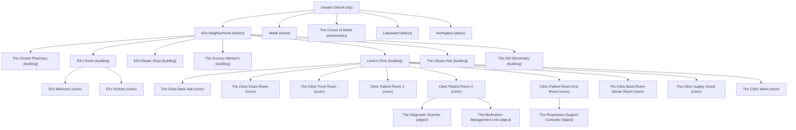

<!-- DO NOT EDIT - generated by scripts/build-geo-map.py. This file is overwritten on every run; edit the entity files instead. -->

> **DO NOT EDIT - generated.** The containment tree of every place. Produced by `scripts/build-geo-map.py` by walking the geography entity tree. Any hand edit is lost on the next run; change the underlying entity files instead.

# Containment Tree (generated)

27 entities. By type -- building: 7, city: 1, district: 2, intersection: 1, object: 3, place: 1, room: 11, street: 1.

## Outline

- `greater-detroit` [city] -- Greater Detroit
  - `elis-neighborhood` [district] -- Eli's Neighborhood
    - `closed-pharmacy` [building] -- The Closed Pharmacy
    - `elis-home` [building] -- Eli's Home
      - `bedroom` [room] -- Eli's Bedroom
      - `kitchen` [room] -- Eli's Kitchen
    - `elis-repair-shop` [building] -- Eli's Repair Shop
    - `grocery` [building] -- The Grocery (Marisol's)
    - `lena-clinic` [building] -- Lena's Clinic
      - `back-hall` [room] -- The Clinic Back Hall
      - `exam-room` [room] -- The Clinic Exam Room
      - `front-room` [room] -- The Clinic Front Room
      - `patient-room-1` [room] -- Clinic Patient Room 1
      - `patient-room-2` [room] -- Clinic Patient Room 2
        - `diagnostic-scanner` [object] -- The Diagnostic Scanner
        - `medication-unit` [object] -- The Medication-Management Unit
      - `patient-room-3` [room] -- Clinic Patient Room (End Room)
        - `respiratory-controller` [object] -- The Respiratory-Support Controller
      - `server-room` [room] -- The Clinic Back-Room Server Room
      - `supply-closet` [room] -- The Clinic Supply Closet
      - `ward` [room] -- The Clinic Ward
    - `library-hub` [building] -- The Library Hub
    - `old-elementary` [building] -- The Old Elementary
  - `webb` [street] -- Webb
  - `webb-corner` [intersection] -- The Corner of Webb
  - `lakeward` [district] -- Lakeward
  - `northglass` [place] -- Northglass

## Diagram

