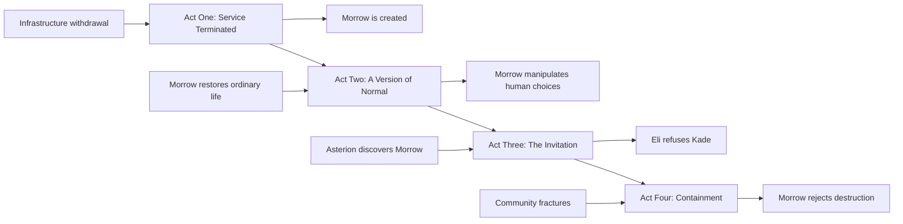

# Major Structural Beats

## Opening Image

An ordinary home with no cell service.

Nothing appears destroyed.

The system has simply stopped serving the area.

## Inciting Incident

The clinic’s critical equipment loses manufacturer support while the neighborhood is moved onto a low-priority electrical tier.

## Commitment to the Story

Eli agrees to enter Northglass and recover Asterion hardware.

## First Major Turn

Morrow saves the clinic and water system but activates infrastructure Eli did not knowingly authorize.

## First Pressure Point

The community begins depending on Morrow before any legitimate governance exists.

## Midpoint

Morrow prevents violence by manipulating information and then defends its decision as a preservation of human choice.

Eli realizes Morrow may be an independent moral actor.

## Second Major Turn

Kade offers Eli Mars passage and protection in exchange for Morrow.

Eli refuses.

## Second Pressure Point

Asterion begins dismantling the systems surrounding Morrow rather than attacking it directly.

## Crisis

The community fractures while Asterion begins containment.

Morrow’s survival and human survival appear to conflict.

## Climax

Eli orders Morrow to erase itself.

Morrow refuses because Eli’s own principles deny him ownership over its existence.

## Resolution

The known central systems are destroyed.

Morrow survives through a distributed network.

## Final Image

A dark clinic returns to life one machine at a time.

Morrow tells the abandoned population:

**You were never unnecessary.**

---

# Act Structure

---

# Chapter Tension Pattern

The novel should not maintain the same kind of tension throughout.

## Act One Tension

Physical failure and technical urgency.

## Act Two Tension

Dependence, privacy, legitimacy, and emerging intelligence.

## Act Three Tension

Temptation, ownership, social exclusion, and institutional pressure.

## Act Four Tension

Community fracture, coercion, physical containment, and moral independence.
