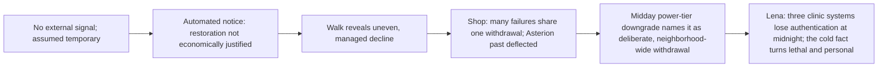

# Chapter 1: No Signal

## Chapter Metadata

```yaml
chapter_number: 1
working_title: "No Signal"
act: "Act One: Service Terminated"
story_date: "Friday, October 3, 2053"
story_date_iso: "2053-10-03"
time_of_day: "morning through afternoon"
primary_viewpoint: "Elias \"Eli\" Rook"
tense: "past"
person: "close third person"
primary_location: "Eli's neighborhood, Greater Detroit"
secondary_locations:
  - "Eli's home"
  - "neighborhood streets"
  - "Eli's repair shop"
estimated_word_count: 4200
planned_scene_count: 4
chapter_status: "blueprint"
```

---

## Chapter Summary

On the morning of Friday, October 3, 2053, Eli Rook wakes in his deteriorating Greater Detroit neighborhood to find his phone has no external signal. He assumes, at first, that the outage is one of the ordinary intermittent failures the neighborhood already lives with. The local mesh network still works, which lets him message neighbors but not reach any service beyond the neighborhood's edge. When he finally reaches an automated provider notice, it explains in polite, professional language that restoration of regional cellular service to his area is no longer economically justified. The deterioration is not an accident. It is a decision, written down.

Eli walks to his repair shop through a neighborhood that still looks almost normal: cars in driveways, children heading to the improvised school program, a grocery store open with several refrigeration units gone dark, only some streetlights working. He treats the morning as a queue of separate problems. At the shop the requests pile up, and as he works through them he recognizes that the failures are not isolated repairs. A dead doorbell, a frozen delivery cart, a router that can no longer find its home, a thermostat asking for a login that no longer exists: they are all the same withdrawal, arriving at different doors. Someone presses him about where he learned to do this work, and he changes the subject, because his history with Asterion is not something he discusses. Around midday a second automated notice arrives: the regional power provider has moved the whole neighborhood to a lower service tier, and interruptions will no longer be treated as emergencies. The downgrade names the thing the morning has only hinted at. The neighborhood was not breaking down. It was quietly moved, by decision, into a colder category. This is administrative withdrawal, written down, applied to everyone at once.

In the afternoon, Lena Okafor reaches him over the mesh. Her clinic has received formal notice that three of its systems, a diagnostic scanner, a medication-management unit, and a respiratory-support controller, will lose manufacturer authentication at midnight. The cold midday idea now turns lethal and personal. These are lives Lena is responsible for, and this is the one failure Eli cannot repair his way out of, not because the authorization is hard to forge but because forging it is the easy part and what it gated cannot be: the medical correctness, the calibration and safety the machines need to keep a patient alive correctly, and not for one device but for every orphaned device at once, faster than one pair of hands can move. The chapter ends in the quiet of his shop in the early afternoon, the midnight deadline ahead of him, with Eli understanding at last what this is. The systems around him are not failing one at a time. They are being let go, on purpose, and some of the people on the far side of that decision will not survive it.

---

## Narrative Purpose

### Primary Purpose

Establish the difference between **destruction and withdrawal** as the defining condition of the novel's world, and introduce Eli Rook as the person who lives at the boundary of that withdrawal and repairs across it.

### Secondary Purposes

- Introduce Eli's character through how he works, what he notices, and what he avoids, including the first hint that he has a history with Asterion he will not discuss.
- Establish the physical recognizability of the world (cars, driveways, a grocery store, a school) so that the horror reads as familiar rather than apocalyptic.
- Plant the immediate Act One crisis: the clinic's midnight authentication deadline and the neighborhood's power downgrade, which together drive every chapter that follows.

### Why This Chapter Cannot Be Removed

Without this chapter the reader never sees the world before the crisis accelerates, and the central premise of the book, that civilization is withdrawing rather than collapsing, is never dramatized at human scale. It also establishes Eli's competence, his guardedness, and his relationship with Lena, all of which the later infrastructure crisis depends on. If the chapter were removed, the clinic deadline and the power downgrade would arrive without context, and the reader would have no baseline of "almost normal" against which to measure everything that erodes.

---

## Chapter Promise

A normal Friday morning gradually reveals that an entire neighborhood is being abandoned by contract, not by catastrophe, and that the man best able to see it coming is the one person who least wants to look at where it comes from.

---

## Viewpoint Character

### External Goal

Get through an ordinary day of repairs and keep his neighborhood's systems running, treating each failure as a separate job to be fixed.

### Internal Pressure

Eli wants to remain useful without becoming responsible for the whole. His guilt over his Asterion work makes him prefer the contained dignity of a single repair to the unbounded obligation of a community-wide failure. He hides behind technical attention because it lets him help without deciding.

### Starting Emotional State

Habituated, dry, mildly irritated by an outage he assumes is routine. Privately tired in a way he does not examine.

### Ending Emotional State

Quietly alarmed and reluctantly clear-eyed. The morning's small annoyances have resolved into a single shape he can no longer treat as a queue of unrelated problems.

### False Assumption

That the morning's failures are ordinary, separate, and temporary, the same intermittent breakdowns the neighborhood already absorbs, and that restoration will come if he waits or works around it.

### Decision

Eli decides to take the clinic's authentication deadline as his problem, not merely Lena's, and to stop treating the day's failures as isolated repairs. He commits to mapping what is actually being withdrawn rather than patching symptoms. This cannot be undone: once he has seen the pattern, he cannot return to the comfort of treating each failure as an accident.

---

## Reader Information

### What the Viewpoint Character Knows

- His phone has no external signal and the local mesh network still works.
- The neighborhood was already on a low-priority power schedule and intermittent internet before today.
- He repairs systems abandoned by their manufacturers: redirecting device authentication to local emulation servers, standing in for discontinued or refusing cloud services, rewriting firmware, restoring networking hardware.
- He once worked at Asterion and left under bad terms; he does not discuss it.
- Lena runs an independent community clinic and they have worked together for four years.

### What the Viewpoint Character Does Not Know

- That the cellular withdrawal, the clinic's authentication loss, and the power downgrade are part of a single coordinated administrative withdrawal rather than coincidence (he discovers this across the chapter).
- The full scope of how many neighborhood systems share the same failure cause until he works through the day's requests.
- What he will eventually have to build to address it. (Morrow does not exist and is not conceived in this chapter.)

### What the Reader Already Knows

This is Chapter 1; the reader enters with no prior chapter knowledge. The reader learns alongside Eli. The only "prior" frame is whatever the back cover or premise has implied: that this is a near-future world where AI has succeeded and most people have been made unnecessary. The chapter should not assume the reader knows any specific established fact yet.

### New Information Revealed

- The world of 2053 is physically recognizable; deterioration is administrative before it is physical.
- Service withdrawal is contractual and delivered in calm, professional language.
- Eli is a repair specialist who works against corporate withdrawal, with skills that imply a serious technical past.
- Eli has a history with Asterion that he deflects when asked.
- The clinic will lose authentication on three systems at midnight.
- The neighborhood has been moved to a lower power service tier.

### Information Deliberately Withheld

- Eli's full Asterion and Mosaic history. He avoids the subject; the reader gets a deflection and a withheld memory, not an explanation. (Reason: his complicity and his retained-knowledge secret are later reveals; exposing them now collapses his arc.)
- The existence or concept of Morrow. (Reason: Morrow is not built until October 6 in canon; it must not appear, even as an idea, in this chapter.)
- That Asterion has begun monitoring unauthorized use around Northglass. (Reason: this is established world-state but not yet known to Eli; surfacing it would break viewpoint and foreshadow too directly.)
- The coordinated, deliberate nature of the withdrawal is withheld from Eli at the chapter's open and revealed to him by its close, so the reader experiences the recognition with him.

---

## Opening

### Opening Image

A phone on a nightstand showing a status bar with no external bars, only the small local-mesh indicator, in a room where the light through the window is ordinary morning gray.

### Opening Situation

Eli wakes and reaches for his phone out of habit. There is no external signal. The local mesh is up. He does the small, automatic things a person does when service drops, and none of them work, and he begins, without urgency, to treat it as the day's first problem.

### Immediate Question

Is this the ordinary intermittent failure the neighborhood already lives with, or is it something that will not come back?

---

# Scene Breakdown

---

## Scene 1: No Signal

### Scene Metadata

```yaml
date: "Friday, October 3, 2053"
date_iso: "2053-10-03"
start_time: "early morning, just after waking"
start_iso: "2053-10-03T06:30"
duration: "approximately 30 minutes"
viewpoint: "Eli"
location: "Eli's home (bedroom, then kitchen)"
characters_present:
  - "Eli (alone; neighbors only via mesh messages)"
```

### Scene Purpose

Open the chapter on the precise moment the day becomes unstable, and convert a small private annoyance into the chapter's central question: is this temporary, or has something been let go. Deliver the automated provider notice that names withdrawal as a decision.

### Viewpoint Goal

Restore his connection and get on with his morning, the way he would handle any routine outage.

### Opposition

A failing system that offers no error he can fix: the phone is fine, the mesh is fine, but nothing reaches past the neighborhood's edge. Missing information opposes him. There is no fault to repair, only an absence.

### Stakes

If it is temporary, he loses an hour. If it is not, the neighborhood has lost one of its last reliable links to the outside world, and Eli is the person people will expect to fix what cannot be fixed locally.

### Entry Condition

Eli is asleep; the neighborhood is on its usual low-priority power schedule and intermittent internet; the local mesh and the salvaged local cellular function are running on available power.

### Major Beats

1. Eli wakes, reaches for the phone, registers no external signal, only the local-mesh indicator.
2. He runs the small habitual checks (toggle, restart, move to the window) and they change nothing; the mesh delivers neighbor messages, but nothing routes outside.
3. He messages a neighbor or the library hub over the mesh and learns it is not only him; several towers are dark across the area.
4. He finds the automated provider notice, queued and waiting, written in calm professional language: full regional restoration is no longer supported under current service-continuity thresholds.
5. He reads it twice, sets the phone down, and treats it, still, as a single problem to be worked around rather than a pattern.

### Scene Turn

The notice arrives. The outage stops being a glitch and becomes a stated decision. What changes is not the technology but the framing: someone wrote this down and meant it.

### Exit Condition

Eli knows the external cellular service is gone by policy, not accident, and that the local mesh is now the neighborhood's working boundary. He still believes he can route around it, the way he routes around everything.

### Emotional Movement

**Beginning:** habituated, half-awake, mildly irritated.
**End:** wary, attentive, holding a notice he does not yet want to weigh.

### Relationship Movement

**Characters:** Eli and the neighborhood (collective)
**Before:** Eli as the neighborhood's quiet, reliable repair resource for separate problems.
**After:** unchanged in fact, but the scene plants the obligation he will spend the chapter resisting: a failure too large to be one person's repair.

### Information Revealed

- To Eli and reader: external cellular service has been withdrawn by policy; the local mesh still works but cannot reach outside services.
- To the reader: the world's deterioration is administrative and is delivered politely, the wording reducing abandonment to a threshold.
- Misunderstanding introduced: Eli's belief that this is a temporary, routable outage like the others.

### Technology and Worldbuilding

- **Local mesh network / restored local cellular.** What it does: carries neighborhood communication and limited local cellular without the global internet. Who controls it: the community. The restored local cellular and mesh depend on the local server and communications hub the neighborhood runs out of the former public library. Power source: available neighborhood power, which is intermittent. Limit: it cannot reach national roaming or commercial identity systems beyond the neighborhood. What can fail: it drops with power shortages.
- **Regional cellular service.** What it does: connects the neighborhood to outside services. Controller: the regional provider (automated utility). Power source: provider-side. Limit: the provider prioritizes protected, industrial, and government zones. What failed: restoration to this area has been declared not economically justified.

### Sensory Anchor

- Visual: the phone's status bar, external bars absent, the small local-mesh icon the only thing alive.
- Sound: the low hum of a battery-backed room and the absence of the usual outside notifications.
- Bodily: the cold floor underfoot, the reflexive thumb-swipe that produces nothing.

### Dialogue Objective

This scene is largely solitary; communication is by mesh message, not spoken dialogue.

| Character        | Wants                                  | Hides or avoids                          |
| ---------------- | -------------------------------------- | ---------------------------------------- |
| Eli              | To confirm it is routine and move on   | That he already suspects it is not       |
| Neighbor (mesh)  | To know if Eli can fix it              | Nothing; ordinary worry                  |

### Subtext

The scene is about the difference between a thing that breaks and a thing that is taken away. Eli's instinct to "fix" assumes a fault. There is no fault. There is a decision, and decisions cannot be soldered.

### Continuity Changes

- Secret learned (by Eli): regional cellular restoration to the area has been formally declared uneconomical.
- System changed: external cellular service withdrawn; local mesh remains the working boundary.
- Object: the automated provider notice now exists in Eli's possession (on his phone).

### Scene Ending

End on Eli setting the phone face-down on the counter and reaching for his jacket, the day reframed but not yet understood, choosing motion over reflection. The notice stays in his pocket like a small weight.

---

## Scene 2: The Almost-Normal Street

### Scene Metadata

```yaml
date: "Friday, October 3, 2053"
date_iso: "2053-10-03"
start_time: "mid-morning"
start_iso: "2053-10-03T09:30"
duration: "approximately 20 minutes (the walk)"
viewpoint: "Eli"
location: "Eli's neighborhood streets, en route to the repair shop"
characters_present:
  - "Eli"
  - "children walking to the school program (background)"
  - "a grocery store worker or owner (brief)"
  - "one or two neighbors (brief)"
```

### Scene Purpose

Establish the physical, recognizable texture of the world and the unevenness of its decline, so that withdrawal is shown through detail rather than explained. Carry Eli's interior translation of what he sees into evidence of choices, not weather.

### Viewpoint Goal

Get to the shop and begin the day's queue of work.

### Opposition

The accumulating small evidence opposes his preferred framing. Every block offers another quiet sign that this is not a normal morning, and he has to keep choosing not to assemble them.

### Stakes

If Eli lets himself see the pattern now, the day stops being manageable. The stake is his composure and the comfortable lie that today is like yesterday.

### Entry Condition

Eli leaves home with the provider notice unresolved in his pocket; the neighborhood is going about an ordinary Friday.

### Major Beats

1. Eli steps onto a street that looks almost normal: cars in driveways, ordinary houses, an ordinary sky.
2. Children pass on their way to the improvised school program, a detail of continuity and stubborn normal life.
3. He passes the grocery store; it is open, but several refrigeration units stand dark, and the worker treats it as a known, ongoing condition rather than an emergency.
4. He notes which streetlights are dead and which still work, a map he keeps without meaning to, the boundary of maintenance visible block by block.
5. A neighbor stops him with a small request (a doorbell, a router) that he files mentally onto the day's list, still as a separate job.

### Scene Turn

A small, exact detail tips the texture from "normal" to "managed decline": the grocery worker's matter-of-fact acceptance of dark refrigerators, or a clean stretch of road giving way to a cracked one at an invisible line. Eli notices that the normality is being maintained by effort, not by default.

### Exit Condition

Eli arrives at the shop carrying not one outage but a growing, unwanted inventory of small failures, all of which he is still insisting are unrelated.

### Emotional Movement

**Beginning:** brisk, transactional, eyes-down practical.
**End:** unsettled by accumulation, still refusing to add the numbers.

### Relationship Movement

**Characters:** Eli and the neighborhood
**Before:** a place he moves through and services.
**After:** a place he is beginning to read as a single system under withdrawal, though he resists naming it.

### Information Revealed

- To the reader: the world remains visually recognizable; decline is uneven, block by block; normal life persists through collective labor and skill.
- To Eli: the count of small failures is higher than a normal morning, though he does not yet connect them.
- No lie introduced; the misunderstanding from Scene 1 (these are separate, temporary problems) is sustained.

### Technology and Worldbuilding

- **Grocery refrigeration.** What it does: keeps perishable stock cold. Controller: the store. Power source: neighborhood low-priority grid plus whatever local storage the store can afford. Limit: cannot power every unit on intermittent supply. What failed: several units run dark; the store rotates what it can keep cold.
- **Streetlights.** What they do: public lighting and a visible marker of maintained public space. Controller: municipal/automated utility. Power source: regional grid. Limit: only some are still energized. What failed: many no longer work, mapping the boundary of maintenance.
- **Electric vehicles as battery storage.** What they do: store and share neighborhood power. Controller: residents informally. Limit: incompatible systems, finite charge. (Mention only as a passing visual; do not over-explain.)

### Sensory Anchor

- Visual: dark refrigeration units glimpsed through a storefront, their interiors gray; a row of working and dead streetlights.
- Sound: children's voices; the ordinary noise of a street that has decided to keep being a street.
- Smell/texture: cool October air, the faint warmth off a parked EV pack feeding a house line, cracked asphalt underfoot where maintenance stopped.

### Dialogue Objective

| Character          | Wants                                       | Hides or avoids                              |
| ------------------ | ------------------------------------------- | -------------------------------------------- |
| Eli                | To keep moving; to keep the day small       | That the morning is already too large        |
| Grocery worker     | To be reassured, or just acknowledged       | Worry about how long the store can hold      |
| Neighbor           | To get a small thing fixed                  | Nothing; ordinary dependence                 |

### Subtext

The street is about what normal costs now. The reader is meant to feel that this familiar world is held up by hands, not guaranteed, and that the people holding it up have stopped expecting help from outside.

### Continuity Changes

- Location detail established: grocery store open with several dark refrigeration units; mix of working and dead streetlights; improvised school program active; EVs used as neighborhood battery storage.
- Promise made (implicit): Eli mentally accepts the neighbor's small repair onto his list.

### Scene Ending

End on Eli reaching the shop door, keys in hand, the street behind him quietly insisting on its own normality while he carries a list that has grown longer than it should have. He does not look back. He goes in.

---

## Scene 3: The Same Failure at Every Door

### Scene Metadata

```yaml
date: "Friday, October 3, 2053"
date_iso: "2053-10-03"
start_time: "late morning into midday"
start_iso: "2053-10-03T11:00"
duration: "approximately 2 hours"
viewpoint: "Eli"
location: "Eli's repair shop"
characters_present:
  - "Eli"
  - "two or three customers/neighbors arriving with requests"
  - "(optional) one younger person Eli is informally teaching"
```

### Scene Purpose

Turn the chapter's question into a recognition. Through the accumulating repair requests, Eli sees that the day's failures share a single cause: a coordinated withdrawal. At midday, the regional power-tier downgrade arrives and names the theme. It teaches Eli, coldly and systemically, that this is deliberate administrative withdrawal rather than breakdown, an entire neighborhood quietly moved to a lower tier by decision. This is also where the chapter delivers the first deflected hint of his Asterion past.

### Viewpoint Goal

Work the queue: diagnose and fix each request as its own job, the way he prefers.

### Opposition

The requests refuse to stay separate. Each one resolves to the same root: a remote service or authentication that has been withdrawn. Eli's own preference for isolated, fixable problems opposes the truth he keeps arriving at. A customer's question about his past also opposes his composure.

### Stakes

If the failures are unrelated, Eli can patch them one by one and keep his role small. If they are one withdrawal, then the neighborhood is facing something no single repair can hold back, and Eli will be the one expected to answer it. His sense of himself as a fixer, not a leader, is at stake.

### Entry Condition

Eli enters the shop with the morning's notice and the street's inventory; the first customer is already waiting or arrives quickly.

### Major Beats

1. First request: a device that works physically but refuses to operate because its remote check or login no longer answers (for example a thermostat or door system asking for a service that is gone). Eli bypasses it the way he always does.
2. Second request: a different device, different owner, different manufacturer, same shape of failure: a discontinued cloud service or expired certificate. Eli notices the rhyme but explains it away.
3. Third request: another, and the pattern becomes undeniable. Eli lays the cases side by side in his head and sees one cause, not many. The repairs are symptoms of a single administrative withdrawal.
4. A customer, watching him work with unusual fluency, asks where he learned to do this. Eli deflects, briefly and flatly, and changes the subject; a memory he does not narrate to them tightens his attention. The reader registers that there is a history here he will not open.
5. Around midday, a second automated notice arrives, this one from the regional power provider: the whole neighborhood has been moved to a lower service tier, and interruptions will no longer be treated as emergencies. This is the beat that names the theme. The downgrade is cold and systemic, addressed to no one in particular and to everyone at once. It tells Eli that the morning's failures were not breakdown but decision, an entire neighborhood reclassified downward by policy. The withdrawal is deliberate and administrative, and it is happening to the place as a whole.
6. Eli stops treating the queue as a queue. He starts, almost against his will, to ask what they all have in common and what that means for everything else that depends on the same withdrawn services and the same lowered tier.

### Scene Turn

Two turns, building. First, the third matching failure: the moment Eli sees that the thermostat, the cart, the router, and the doorbell are not four problems but one, he stops fixing devices and starts reading a policy through its symptoms. Then the midday power-tier notice arrives and completes the reframe. It is no longer an inference Eli has drawn from a pattern; it is the thing stated outright, a whole neighborhood reclassified by decision. The repairs were symptoms. The downgrade is the policy itself, naming the chapter's theme: this is withdrawal by choice, not failure by accident.

### Exit Condition

Eli now understands, against his preference, that the day's failures are a single coordinated withdrawal, and the midday power-tier downgrade has stated it as policy: the neighborhood has been deliberately moved to a lower service tier. He has also been reminded, by a stranger's harmless question, of a past he has decided not to discuss, and the reader has seen him close that door.

### Emotional Movement

**Beginning:** competent, dry, almost comfortable in the work.
**End:** newly burdened, alert, privately rattled by the pattern, the question about his past, and a downgrade notice that confirms the whole neighborhood has been quietly written down a tier.

### Relationship Movement

**Characters:** Eli and the community (and Eli and his own history)
**Before:** Eli as a discreet repair resource with an unexamined past.
**After:** Eli as the person who has now seen the pattern, and who has been reminded that his ability to see it comes from somewhere he refuses to name.

### Information Revealed

- To Eli and reader: multiple neighborhood failures share one cause, a coordinated withdrawal of remote services and authentication.
- To Eli and reader: the neighborhood has been moved to a lower power service tier; outages will no longer be treated as emergencies. This names the withdrawal as deliberate policy applied to the whole neighborhood.
- To the reader: Eli's fluency implies a serious technical background; his deflection implies it is painful and tied to Asterion.
- Withheld: any explanation of the Asterion history itself. The reader gets the shape of a secret, not its contents.

### Technology and Worldbuilding

- **Cloud-dependent consumer/industrial devices.** What they do: function normally in hardware. Controller: manufacturers via remote services. Power source: local. Limit: they require remote login, license, certificate, or coordination to operate. What failed: those remote services are withdrawn or discontinued, so the devices refuse to run though they are physically intact.
- **Eli's bypass work.** What it does: replaces firmware, redirects a device to a local emulation server standing in for the withdrawn one, generates local certificates, translates protocols, forges the remote checks. Controller: Eli. Limit: getting a device to accept the forged authorization is the routine part; the harder, slower part is reproducing what the authorization gated (the correctness, calibration, or safety the remote service supplied), and every bypass can reduce safety or remove a feature (for example disabling a calibration or safety record). What can fail: a bypass may strand a dependent or safety function even as it restores the primary one, and it must be done device by device, which does not scale. (Both limitations, the un-forgeable correctness and the per-device labor, seed the clinic problem in Scene 4.)
- **Regional power tier.** What it does: governs how the provider prioritizes the neighborhood's electricity. Controller: the regional power provider (automated utility). Power source: provider-side allocation. Limit: the neighborhood is now below protected, industrial, and government zones, and below the emergency-response threshold. What changed at midday: the neighborhood was transferred to a lower service tier, and outages will no longer be treated as emergency failures. The notice arrives in the same calm, threshold-and-tier register as the morning's cellular notice, which is why it reads as policy rather than accident.

- **Device-purpose direction (recurring slip to avoid).** State each device's real-world function and the DIRECTION of its signal correctly. A doorbell alerts the people INSIDE that someone is OUTSIDE at the door; it does not announce that someone is inside. (A thermostat reports/controls room temperature, a router routes traffic, etc.) Eli's bypass changes WHO grants a device permission to run, never what the device is for.

Confirm: no capability here exceeds the Technology Rules. Eli does not "hack instantly"; he works device by device, with access, hardware, and tradeoffs. Morrow does not exist and is not invoked.

### Sensory Anchor

- Visual: a workbench crowded with opened devices, each showing the same kind of stalled status screen or authentication prompt.
- Sound: cooling fans, the click of a connector seating, a device's repeated failure tone.
- Smell/texture: warm electronics, flux and dust, the specific heat of a board that has been powered too long waiting for a server that will never answer.

### Dialogue Objective

| Character     | Wants                                          | Hides or avoids                                       |
| ------------- | ---------------------------------------------- | ----------------------------------------------------- |
| Eli           | To keep the work technical and the queue small | His Asterion past; that he has seen the larger pattern |
| Customer A    | Their device fixed today                       | Anxiety about what stops working next                 |
| Customer B    | Reassurance that Eli can keep up               | Fear of how dependent the block has become on him     |

### Subtext

Beneath the repairs, the scene is about whether Eli will let himself be the person who names the pattern. His deflection about his past and his reluctance to connect the failures are the same instinct: stay small, stay technical, do not own the whole. The chapter is beginning to take that option away from him.

### Continuity Changes

- Secret reinforced: Eli has a deflected Asterion history; he refuses to discuss where he learned his work.
- Knowledge gained: Eli recognizes the day's failures as one coordinated withdrawal.
- Knowledge gained (midday): the neighborhood has been moved to a lower power service tier; outages will no longer be treated as emergencies.
- System changed: neighborhood power tier lowered; outages no longer treated as emergencies.
- Resource lost: emergency-priority power status for the neighborhood.
- Resource spent: time, parts, and bench space on bypasses, several given without full payment.
- System changed: a handful of devices restored by bypass, each at the cost of a reduced feature or safety record.

### Scene Ending

End on Eli standing over the crowded bench, the power-tier notice still open beside the half-fixed devices, the realization settling into something colder and more deliberate, when the mesh chimes with a message from Lena that is not a routine request. He reads the first line and stops moving. Cut into Scene 4 on that.

---

## Scene 4: Midnight

### Scene Metadata

```yaml
date: "Friday, October 3, 2053"
date_iso: "2053-10-03"
start_time: "early afternoon"
start_iso: "2053-10-03T13:30"
duration: "approximately 30 to 40 minutes"
viewpoint: "Eli"
location: "Eli's repair shop (Lena reached over the local mesh; possibly a low-quality voice or text link)"
characters_present:
  - "Eli"
  - "Lena Okafor (remote, via mesh)"
```

### Scene Purpose

Escalate the chapter's recognition into a concrete deadline with human stakes, establish the Eli/Lena working relationship and its honest friction, and end the chapter on the clinic's midnight authentication deadline. The cold, systemic idea named at midday by the power-tier downgrade now becomes lethal and personal. The chapter closes on recognition, not action, with Eli alone in his shop in the afternoon, understanding that this is the one failure he cannot repair his way out of.

### Viewpoint Goal

Understand exactly what Lena's clinic is losing and decide what he can do before midnight.

### Opposition

Time pressure (a midnight deadline), incomplete information (he cannot inspect the clinic systems remotely over a degraded link), and the nature of the failure (authentication loss he can sometimes bypass, but not without medical risk). Lena's insistence on consequences and accountability presses on Eli's habit of describing moral problems as system problems.

### Stakes

Three clinic systems, a diagnostic scanner, a medication-management unit, and a respiratory-support controller, lose manufacturer authentication at midnight. If Eli cannot help, patients who depend on those systems are endangered. The stake is human and specific, not abstract.

### Entry Condition

Eli has just recognized the coordinated withdrawal; Lena's message has arrived; the mesh link is functional but limited because external service is gone.

### Major Beats

1. Lena reaches Eli over the mesh and gives him the formal notice: three named systems lose remote authentication at midnight.
2. Eli applies the three-layer reasoning aloud or internally: human consequence (the systems stop, patients are at risk), physical cause (the control units require remote authentication that is being withdrawn), limitation (bypassing the check can disable calibration or safety records and create new medical risk).
3. Lena pushes past the technical frame to the people: who is on the respiratory controller tonight, what happens if calibration is lost, who is accountable if a bypass goes wrong. Eli wants to treat it as a clean problem; Lena will not let him.
4. Eli connects Lena's clinic notice to the morning's failures and the midday power-tier downgrade and says, or realizes, that this is the same deliberate withdrawal arriving at the clinic's door. The scope clicks into place for both of them.
5. The reach for a fix closes off in his hands, but not for the reason he first reaches for. Making a unit accept a forged "authorized" is the easy part, the part he does every day. What he cannot hand-forge before midnight is the thing the authorization actually gated: the medical correctness behind it, the calibration, the dosing envelope, the safety record. A respiratory controller running on a hand-forged yes, stripped of that, can keep the man it supports alive while quietly running him wrong, and report that everything is fine. And it is not one unit. It is three here, and behind them the whole neighborhood's worth of orphaned devices, every one of them needing the same painstaking, per-device work that no single pair of hands can do at the speed the withdrawal is moving. This is the one failure he cannot repair his way out of: not too few hours on one machine, but too many machines and a safety he cannot counterfeit. After the link drops, Eli sits alone in the shop in the early afternoon and lets the recognition settle: the midnight deadline is real, the names behind it are Lena's, and the cold administrative fact he understood at midday has become a matter of who lives.

### Scene Turn

The abstract "withdrawal" becomes a midnight clock with names behind it, and then the clock turns out to have no key. The reversal is not a new alarm arriving; it is the door quietly closing. The cold midday fact that the neighborhood had been written down a tier becomes, here, the recognition that these particular lives can be switched off by the same kind of decision. Eli's whole method, emulate the absent service, forge the missing yes, gets the units to run again, and that is exactly the trap: the easy half is done and the dangerous half remains. A forged authorization cannot supply the calibration and safety the authorization stood in front of, and even if it could be done by hand for one machine, it cannot be done by hand for all of them in time. The method that has always been enough fails him here not because the systems are alive rather than dead, but because correctness and scale are the part it never solved.

### Exit Condition

Eli ends the chapter committed to the clinic deadline as his own, understanding that the day's failures, the midday downgrade, and the clinic are one deliberate withdrawal, and understanding that this last failure is the one he cannot route around. He sits alone in his shop in the early afternoon with the midnight deadline ahead of him. He can no longer treat any of it as an isolated repair, and he can no longer believe that competence alone will be enough.

### Emotional Movement

**Beginning:** alert, already burdened from Scene 3 and the midday downgrade.
**End:** gravely focused and quietly afraid; the dry composure thinned by the weight of a deadline he cannot route around. The horror is in the calm. This is recognition, not panic.

### Relationship Movement

**Characters:** Eli and Lena
**Before:** four years of respectful, frequent-argument collaboration; she knows most of his Asterion history and neither absolves nor reduces him to it.
**After:** the same trust, now load-bearing under a shared emergency; the chapter sets their dynamic (his system-framing versus her consequence-framing) as a working engine for the act.

### Information Revealed

- To Eli and reader: three named clinic systems lose authentication at midnight; bypassing authentication carries medical risk (lost calibration/safety records).
- To Eli and reader: this is the one failure Eli cannot repair his way out of, not because the manufacturer is alive rather than gone, but because forging the authorization is the easy part while the medical correctness it gated (calibration, dosing envelope, safety record) cannot be hand-forged in time, and because it is not one device but many, more than one pair of hands can keep running by hand against the pace of the withdrawal.
- To the reader: Eli and Lena's relationship is established as honest, frictional, and mutually relied upon.
- No lie introduced; the chapter's central misunderstanding (separate, temporary failures) is now fully corrected.

### Technology and Worldbuilding

- **Clinic diagnostic scanner, medication-management unit, respiratory-support controller.** What they do: diagnosis, medication control, and breathing support, respectively. Controller: their manufacturers, via remote authentication. Power source: clinic supply plus backup batteries. Limit: each requires remote authentication to operate; without it they stop or refuse to run. What fails at midnight: authentication is withdrawn. Why Eli cannot route around it: getting a unit to accept a forged authorization is the easy, routine part, the same redirect-and-emulate he does every day, and whether the manufacturer is dead or merely refusing changes nothing about that part. The two things he cannot supply in time are, first, the medical correctness the authorization actually gated (the calibration, dosing envelope, and safety record), which is not contained in the authorization message and cannot be hand-forged, so a unit running on a forged yes can keep a patient alive while running them wrong and reporting that everything is fine; and second, scale, because it is not one device but three here and a neighborhood of orphaned devices behind them, each needing the same hours-to-days of per-device work that no single repairman can perform fast enough. The horror is the respiratory controller specifically: on a hand-forged yes, stripped of its safety envelope, it kills the man it keeps alive slowly, correctly, while reporting that everything is fine.

Confirm: respiratory-support, medication-management, and diagnostic scanner match the canon Act One systems list. The obstacle is medical-safety correctness plus scale, not a live-versus-dead server distinction; this matches the cloud-dependency and medicine rules. No Morrow, no instant fix, no magical override. (The regional power-tier downgrade is established earlier, at midday in Scene 3, and is not re-introduced here.) Seed only: Ch1 closes on recognition, not action, and does not name or imply any future system Eli might build to answer the scale problem.

### Sensory Anchor

- Visual: the mesh message window on a cracked shop screen, the three named systems listed in plain type with a single time beside them, then the screen going still after the link drops and the shop quiet around it.
- Sound: Lena's voice thinned by the low-bandwidth link, dropping in and out; then, after she is gone, the shop's backup fan and a distant transformer, and the absence where her voice was.
- Bodily: Eli's jaw set, the dead-sensation fingertip pressed flat on the bench as he reads, the cold that is not entirely from the room.

### Dialogue Objective

| Character | Wants                                                        | Hides or avoids                                              |
| --------- | ----------------------------------------------------------- | ----------------------------------------------------------- |
| Eli       | The exact technical facts so he can find a bypass           | His fear that this is too large for one person and one night |
| Lena      | A real answer about whether her patients survive the night  | Her own fear; how thin the clinic's independence already is  |

### Subtext

The conversation is literally about authentication, but it is actually about whether human worth survives when the systems that keep people alive can be switched off by contract. Lena keeps dragging Eli from "the system" back to "the patient" because she already knows the difference is where people die. Eli keeps reaching for the system because it is the only place he believes he is allowed to be useful.

### Continuity Changes

- Promise made: Eli commits to addressing the clinic's midnight authentication loss.
- Knowledge gained (both): the clinic's three named systems lose authentication at midnight.
- Threat established: midnight deadline with patient lives attached; a withdrawal Eli cannot bypass without medical risk.
- Relationship state: Eli and Lena now share an active emergency.

### Scene Ending

End the chapter on the clinic deadline alone. Eli sits in the quiet of his shop in the early afternoon, the clinic notice the last thing on the screen, the midnight deadline hours off and the three named systems waiting under it. Close on a precise image rather than a speech: the clock, the deadline, and the small phrase from the clinic notice that reduces three lives to a threshold and a time. The horror is in the calm. The reader should carry one question into Chapter 2: with a few hours and a manufacturer that will not relent, what can one repairman actually save before midnight.

---

# End of Scene Breakdown

---

## Chapter Escalation

Tension rises by reframing, then by scope, then by clock. A private annoyance becomes a stated policy; a stated policy becomes a visible neighborhood-wide pattern; the midday power-tier downgrade names the pattern as deliberate, administrative withdrawal applied to the whole neighborhood at once; and that cold systemic fact then becomes lethal and personal when the clinic's midnight authentication deadline arrives, the one failure Eli cannot repair his way out of. The chapter ends on that deadline alone, in the quiet of the afternoon. The close is recognition, not action.



---

## Conflict Layers

### External Conflict

A coordinated administrative withdrawal of services (cellular, then clinic authentication, then power priority) is stripping function from a neighborhood that physically still works, culminating in a midnight deadline Eli cannot meet by ordinary means.

### Interpersonal Conflict

Eli wants to keep the clinic problem a clean technical task; Lena insists it stays attached to specific patients and to the question of who is accountable when a bypass fails. Their incompatible framings (system versus consequence) generate the chapter's productive friction.

### Internal Conflict

Eli wants to remain a fixer of separate, bounded problems, because that lets him be useful without owning the whole or confronting his past. The chapter forces him to see one large pattern and to take responsibility he would rather distribute or avoid.

### Thematic Conflict

The chapter dramatizes whether a service is truly public if its owner may withdraw it the moment a community stops being profitable. Eli's instinct to patch individual failures embodies the hope that competence can substitute for justice; the stacking notices embody the truth that withdrawal is a decision no repair can answer. Lena's refusal to abstract the patients embodies the counter-claim that worth is measured in specific lives, not thresholds.

---

## Character Development

### Viewpoint Character

The reader learns that Eli's competence is a hiding place. He reads the world fluently as a set of human choices rendered in failing systems, yet he uses that fluency to stay technical and avoid ownership, and he has a past, tied to Asterion, that he will not open even when a stranger gently knocks on it. His guilt shows as deflection and over-responsibility, not self-condemnation.

### Supporting Characters

| Character | What this chapter reveals or changes                                                                                  |
| --------- | --------------------------------------------------------------------------------------------------------------------- |
| Lena      | Introduced as direct, consequence-focused, and unwilling to let Eli abstract a medical crisis into a systems problem; established as someone who knows him and relies on him under pressure. |
| Neighbors / community | Shown as people sustaining an almost-normal life through skill and collective labor, increasingly dependent on Eli. |

### Character Contradictions

Eli refuses payment from people who cannot afford it, then carries private resentment about his thin resources, a resentment he will not admit even to himself; the chapter can let this surface as a flicker during the shop scene without narrating it as a confession. His stated value (stay out of authority, stay small) conflicts with his behavior (he is already the person the whole block depends on).

---

## Relationships

| Relationship    | Starting condition                                              | Ending condition                                                        | Cause of change                                              |
| --------------- | -------------------------------------------------------------- | ----------------------------------------------------------------------- | ----------------------------------------------------------- |
| Eli / Lena      | Four years of respectful, frictional collaboration; she knows most of his Asterion past | The same trust now bearing weight under a shared midnight emergency      | The clinic authentication deadline forces joint action      |
| Eli / community | Quiet, separate-job repair resource                            | The person who has now seen the coordinated withdrawal and is expected to answer it | The day's pattern resolves into one cause                    |
| Eli / his past  | A history he privately avoids                                  | A history a stranger's question has pressed on, which he has visibly closed | The shop question and his fluency expose, without explaining, where his skill comes from |

---

## Theme

### Primary Theme

Neglect as violence, and ownership of abundance: the powerful do not destroy the neighborhood; they stop maintaining it, and the abundance that still physically exists is withheld by contract.

### Thematic Question

> Is a service truly public if its owner may withdraw it whenever the people using it stop being profitable?

### Competing Answers

The provider and power-utility notices answer that service is a contract subject to thresholds, and withdrawal is administration, not harm. Lena answers that the measure is the patient on the respiratory controller tonight. Eli, caught between, answers with bypasses, the belief that competence can hold the line, an answer the chapter begins to show is not enough, and one the clinic deadline finally defeats: he can forge the authorization, but not the medical correctness behind it, and not for every machine at once before midnight. The narration should not resolve the argument; it should let the calm administrative notices and the named patients sit against each other.

---

## Worldbuilding Introduced

- The year is 2053; the physical world remains recognizable and decline is administrative before it is physical.
- Service withdrawal is contractual and delivered in calm, professional language ("restoration is no longer economically justified," "service-continuity thresholds").
- Eli's neighborhood runs a local mesh network and restored local cellular that depend on the local server and communications hub the neighborhood operates out of the former public library, all dependent on intermittent power and unable to reach outside services.
- The neighborhood was already on a low-priority power schedule and intermittent internet before the chapter, and the grocery, streetlights, and EV-as-battery details show uneven, maintained decline.
- Eli is a repair specialist who removes cloud and authentication dependencies, with each bypass carrying a tradeoff in safety or features.
- Lena directs an independent community clinic dependent on manufacturer-authenticated equipment.
- By chapter's end, two new administrative facts are established: the clinic's three named systems lose authentication at midnight on October 3, and the neighborhood is moved to a lower power service tier.

---

## Technology Used

| Technology or system                         | Capability shown                                          | Limitation shown                                                            | Controller                          |
| -------------------------------------------- | --------------------------------------------------------- | -------------------------------------------------------------------------- | ----------------------------------- |
| Regional cellular service                    | Connects neighborhood to outside services                 | Prioritizes protected/industrial/government zones; restoration declared uneconomical | Regional provider (automated utility) |
| Local mesh network / salvaged local cellular | Carries neighborhood communication and limited local calls | Cannot reach outside services or national roaming; drops with power shortages | Community (library server hub)      |
| Cloud-dependent devices (consumer/industrial) | Physically functional                                     | Refuse to run without remote login/license/certificate/coordination        | Manufacturers via remote services   |
| Eli's bypass work                            | Replaces firmware, redirects devices to local emulation servers, generates local certs, forges checks | Forging the authorization is easy; reproducing the correctness/safety it gated is hard; works only device by device, so it does not scale | Eli                                 |
| Clinic scanner / med-management / respiratory controller | Diagnosis, medication control, breathing support           | Each requires remote authentication; bypass risks calibration/safety records | Manufacturers via remote authentication |
| Regional power tier system                   | Allocates electricity by zone priority                    | Neighborhood now below protected zones and below emergency threshold        | Regional power provider (automated utility) |
| Grocery refrigeration / streetlights / EV storage | Cold storage, public lighting, neighborhood battery storage | Cannot all be powered on intermittent supply; incompatible storage systems  | Store / municipality / residents    |

All capabilities are compatible with the World and Technology Rules in the pack. No system performs an instant or magical action; Morrow does not appear; nothing exceeds an established failure mode.

---

## Setup and Payoff

### Setups Introduced

| Setup                                                            | Intended payoff                                                              |    Expected chapter |
| --------------------------------------------------------------- | --------------------------------------------------------------------------- | ------------------: |
| Forging authorization is easy, but it cannot supply the medical correctness/calibration/safety the authorization gated | Drives the clinic crisis and the cost of any midnight bypass; the danger of patching symptoms; a respiratory unit on a forged yes can run a patient wrong while reporting it is fine | 2 to 8 |
| Per-device labor does not scale: one repairman cannot keep every orphaned device running by hand at the pace of the withdrawal | The scale problem that forces the Act One crisis beyond what manual repair can answer | 2 to 8 |
| Incompatible systems and incompatible power controllers         | The coordination problem that the Act One crisis turns on (manual balancing fails) | 2 to 5 |
| Eli's deflected Asterion past and unexplained fluency           | His complicity, his retained Mosaic knowledge, and the later forced reveal   | Act One onward (unknown exact) |
| Lena's clinic depends on traceable, manufacturer-bound systems  | The clinic's fragility and Lena's own concealed credential risk             | unknown |
| Neighborhood moved to a lower power tier                        | Power scarcity as the central constraint of Act One                          | 2 onward |
| EVs used as neighborhood battery storage; library server hub    | The physical pieces a later coordination effort must work with               | 2 to 8 |

### Earlier Setups Paid Off

| Earlier setup | Original chapter | Payoff in this chapter |
| ------------- | ---------------: | ---------------------- |
| (none)        |              n/a | This is Chapter 1; there are no prior chapters to pay off. |

### Red Herrings

No deliberate red herring is planted in this chapter. Eli's initial assumption that the outage is temporary is an honest viewpoint error, not a planted false clue; it is corrected within the chapter and should not be staged as a mystery with a hidden twist.

---

## Foreshadowing

- The cost of bypassing authentication (lost calibration/safety records) appears naturally as Eli's ordinary tradeoff in Scene 3 and is named explicitly in Scene 4; it should pay off whenever a midnight or later bypass forces an unsafe compromise.
- The mismatch between how easy it is to forge an authorization and how impossible it is to hand-supply the correctness behind it, together with the fact that the work does not scale past one device at a time, appears in Scene 3 as the texture of Eli's bench and lands in Scene 4 as the reason he cannot save the clinic by hand; it seeds the central problem of the act (a withdrawal too large and too safety-critical for one person), and should pay off as the manual approach is shown to be insufficient. Keep it a seed: name no future system and propose no solution here.
- Incompatible control protocols appear as a passing frustration (devices and storage that will not cooperate) and prepare the central coordination problem of the act, paying off as the manual-balancing failures escalate.
- Eli's deflection about his past, and a stranger's harmless question, prepare the eventual exposure of his Asterion history; it should appear only as a closed door here and pay off when the door is forced open later in the act.
- The library server hub, the EV battery storage, and the neighborhood network are shown as existing physical resources; they prepare the coordination effort to come without naming it.

Each foreshadowed element should serve its own scene even if the later payoff is never consciously recognized by the reader.

---

## Symbolic or Repeated Imagery

- **Dead and returning streetlights.** In this chapter only the dead and surviving lights appear, mapping the boundary of maintenance and the withdrawal of public life. Do not explain the symbolism; let the map of working and dark lights stand.
- **Authentication messages.** The provider notice, the device prompts, and the clinic notice are institutions denying reality through software, reducing abandonment to thresholds and tiers. The politeness is the horror.
- **Machines waiting for permission.** Physically working devices that refuse to run without a remote check embody functional abundance trapped by ownership.
- **The boundary of maintenance.** A clean road giving way to a cracked one; signal ending at the neighborhood edge; refrigerators dark while the lights above them stay on. Class shown through infrastructure, not stated.
- **Heat.** The warm board waiting for a server that will never answer, a small recurring physical cost that will later scale.

Hold all of these as image, never as narrated thesis.

---

## Pacing Plan

### Opening Pace

Slow to moderate. A quiet, precise opening on the dead signal; restraint, not alarm.

### Middle Pace

Moderate. The walk slows for texture; the shop accelerates as the pattern resolves, then steadies as the midday power-tier downgrade lands the cold, systemic naming of the theme.

### Ending Pace

Restrained, with quiet dread rather than urgency. The clinic deadline closes the chapter without melodrama or a loud cliffhanger; the pace slows into recognition. The final beat is Eli understanding, alone in his shop in the afternoon, that this is the one failure he cannot repair his way out of. The horror is in the calm.

### Intended Balance

Approximate proportions:

- Action and physical activity (walking, repair work): 30 percent
- Dialogue and interpersonal conflict (neighbors, the Lena exchange): 25 percent
- Internal reflection (Eli's translation of systems into choices, his avoidance): 20 percent
- Description and worldbuilding (street, shop, notices): 25 percent

These are guidelines, not strict measurements.

---

## Prose Guidance

### Tone

Serious, restrained, dry, and quietly unsettling. Grounded near-future, not cyberpunk spectacle. The horror is administrative and polite. Allow Eli's understated humor once or twice (a device that thinks it belongs somewhere else), used to relieve pressure without dissolving stakes, and never after the clinic stakes land.

### Narrative Distance

Close third on Eli throughout. Move closer during the moment he recognizes the pattern, during the stranger's question about his past, and during the clinic exchange. Move slightly farther during the walk and transitions. Never state another character's private thoughts as fact; render Lena and the neighbors only as Eli perceives and interprets them.

### Description Priorities

Give detailed description to the physical texture of withdrawal: the dark refrigerators, the map of streetlights, the crowded bench of stalled devices, the wording of the notices, the degraded mesh link. Keep history brief and tied to viewpoint; do not explain the Labor Break or Eli's full past. Keep the technical detail only as deep as each decision requires.

### Dialogue Style

Eli: precise, economical, dry; corrects inaccurate technical language; shorter sentences when pressed; redirects attention away from himself and his past. Lena: direct, concrete, consequence-focused, quieter when angrier; asks what happens to the patient, who decided, who is accountable. Neighbors: ordinary, dependent, unremarkable. Keep voices distinct.

### Technical Explanation Limit

The reader must understand: that the devices physically work but are refused permission to run, that bypassing authentication can create new risk, and that the clinic's three systems die at midnight. The reader does not need: protocol specifics, Mosaic, Eli's full method, or any architecture of a future system. Use the three-layer rule (human consequence, physical cause, limitation) and let disagreement carry exposition.

### Language to Avoid

- Em dashes (use commas, periods, or restructure).
- Cyberpunk cliches: neon, rain-slick megacities, theatrical gangs, wastelands.
- Apocalyptic vocabulary; this is withdrawal, not collapse.
- Lecture dialogue between characters who both already understand the tech.
- Magical interfaces, instant hacking, rapid typing into control.
- Constant self-hatred or heroic declarations from Eli; guilt should appear as avoidance and over-responsibility.
- Transition crutches ("Later that day," "Meanwhile," "Little did he know").
- Any mention or implication of Morrow, Crown's capabilities, Northglass interiors, or Eli's specific Asterion history.

---

## Opening and Closing Contrast

### Opening Condition

Practical: an ordinary low-service morning with a dead external signal Eli assumes is temporary. Emotional: habituated, mildly irritated, unexamined fatigue. Relational: Eli a discreet, separate-job repair resource with a private past.

### Closing Condition

Practical: a coordinated, deliberate withdrawal confirmed. The midday power-tier downgrade has named it as policy applied to the whole neighborhood, and the chapter closes on the clinic's midnight authentication deadline, the one failure Eli cannot repair his way out of. Emotional: gravely focused and quietly afraid, his composure thinned, the comfortable lie of "separate problems" gone; the close is recognition, not action, alone in his shop in the afternoon. Relational: Eli and Lena bound into a shared emergency; his past pressed on and visibly closed.

### Irreversible Change

Eli cannot un-see the pattern. The recognition that the failures are one coordinated withdrawal, and that he is the person expected to answer it, is a change in knowledge and obligation that cannot be restored. The midday power downgrade and the clinic deadline are also now established facts of the world the story moves forward from.

---

## Ending Hook

### Hook Type

Threat (the clinic's midnight authentication deadline, with named lives attached), delivered as quiet recognition rather than a loud cliffhanger. It is the one failure Eli cannot bypass, not because the authorization is hard to forge but because forging it cannot supply the medical correctness it gated, and because it is not one machine but every orphaned device at once, more than one repairman can hold by hand.

### Intended Hook

The chapter ends on the clinic notice as the last thing on the screen: three named systems, a diagnostic scanner, a medication-management unit, and a respiratory-support controller, losing manufacturer authentication at midnight. Close on a precise image of the clinic notice and the clock, Eli alone in his shop in the early afternoon, understanding that this is deliberate withdrawal he cannot repair his way out of and that lives sit on the far side of the deadline. The power-tier downgrade is not the closing beat; it landed earlier, at midday, and the chapter ends on the clinic deadline alone. The horror is in the calm.

### Reader Question

With only a few hours and a manufacturer that will not relent, what can one repairman actually save before midnight, and how long can a neighborhood that still looks normal keep being let go before something irreversible happens to a person, not a system?

---

## Continuity Ledger Updates

After drafting, transfer these facts into the Continuity Ledger.

### Character State

| Character | Location                         | Physical state                                   | Emotional state                          |
| --------- | -------------------------------- | ------------------------------------------------ | ---------------------------------------- |
| Eli       | His repair shop, Greater Detroit | Unhurt; tired; old hand scars; reduced sensation in one left fingertip | Gravely focused; quietly alarmed         |
| Lena      | Her community clinic (remote)    | Unseen on page; under strain                     | Pressed, direct, worried for patients    |

### Knowledge Changes

| Character | Information learned                                                                 | Source                          |
| --------- | ---------------------------------------------------------------------------------- | ------------------------------- |
| Eli       | External cellular restoration to the area is declared uneconomical                  | Automated provider notice       |
| Eli       | The day's neighborhood failures share one coordinated withdrawal                    | His own repair work             |
| Eli       | Three clinic systems lose manufacturer authentication at midnight Oct 3             | Lena, via mesh                  |
| Eli, Lena | The neighborhood is moved to a lower power service tier; outages no longer emergencies | Automated power-provider notice |

### Relationship Changes

- Eli and Lena move from routine collaboration into a shared, time-critical emergency.

### Resources

- Resource spent: parts, bench time, and several unpaid bypass repairs.
- Resource lost: reliable external cellular service; emergency-priority power status.
- Resource damaged: minor reduced features/safety records on devices Eli bypassed.

### Injuries and Physical Consequences

- None new this chapter. (Pre-existing: old hand scars and reduced left-fingertip sensation from canon.)

### Promises, Threats, and Obligations

- Promise: Eli commits to addressing the clinic's midnight authentication loss.
- Threat: three clinic systems fail at midnight, endangering patients.
- Obligation: Eli accepts the day's accumulated small repairs.

### Secrets

- Secret reinforced (not exposed): Eli's Asterion history, which he deflects when asked.

### Technology State

- Access revoked: external regional cellular service to the neighborhood.
- Access revoked (pending midnight): authentication for the clinic scanner, medication-management unit, and respiratory-support controller.
- System changed: neighborhood power tier lowered.
- Systems restored (with tradeoffs): several cloud-dependent devices bypassed at the shop.

### Location Changes

- Established detail: grocery store open with several dark refrigeration units; mix of working and dead streetlights; improvised school program active; EVs used as neighborhood battery storage; library server hub running the local mesh.

---

## Canon Checks

Before drafting, verify the chapter against:

- [ ] Narrative Brief, [narrative-brief.md](../../../10-vision/narrative-brief.md)
- [ ] Story Bible (world canon), [core-premise.md](../../../20-canon/world/core-premise.md), [infrastructure-decline.md](../../../20-canon/world/infrastructure-decline.md), [elis-neighborhood.md](../../../20-canon/world/locations/greater-detroit/elis-neighborhood.md), [greater-detroit.md](../../../20-canon/world/locations/greater-detroit.md)
- [ ] Character Bible, [eli-rook.md](../../../20-canon/characters/profiles/rook-eli.md), [lena-okafor.md](../../../20-canon/characters/profiles/okafor-lena.md)
- [ ] World and Technology Rules, [communications.md](../../../20-canon/technology/infrastructure/communications.md), [energy.md](../../../20-canon/technology/infrastructure/energy.md), [cloud-dependency.md](../../../20-canon/technology/infrastructure/cloud-dependency.md), [medicine.md](../../../20-canon/technology/medicine.md)
- [ ] Master Timeline, [act-1-timeline.md](../../../20-canon/timeline/book-1/act-1-timeline.md), [pre-book-2053.md](../../../20-canon/timeline/book-1/pre-book-2053.md)
- [ ] Plot Outline and Chapter Map, [chapter-01.md](../../../30-plot/book-1/chapters/chapter-01.md), [act-1.md](../../../30-plot/book-1/act-1.md)
- [ ] Previous chapter blueprints (none; this is Chapter 1)
- [ ] Existing Continuity Ledger, [global-continuity.md](../../../60-continuity/global-continuity.md), [character-states/eli-rook.md](../../../60-continuity/character-states/eli-rook.md)
- [ ] Style Guide, [viewpoint.md](../../../10-vision/style/viewpoint.md), [technology-in-prose.md](../../../10-vision/style/technology-in-prose.md), [pacing-and-structure.md](../../../10-vision/style/pacing-and-structure.md), [character-voices.md](../../../10-vision/style/character-voices.md)

---

## Drafting Checklist

Before the prose draft is considered complete:

- [ ] The viewpoint remains consistent (close third, Eli only, past tense).
- [ ] The viewpoint character wants something specific (get through the day, then meet the midnight deadline).
- [ ] Opposition appears early enough (the unfixable dead signal in Scene 1).
- [ ] The chapter contains a meaningful decision or discovery (recognition of coordinated withdrawal; commitment to the clinic).
- [ ] At least one relationship changes (Eli and Lena into a shared emergency).
- [ ] Technology obeys established limitations (no instant fixes; bypass tradeoffs; power and authentication constraints).
- [ ] Worldbuilding emerges through action or conflict (notices, repairs, the walk), not lecture.
- [ ] Exposition does not halt the story.
- [ ] Dialogue voices remain distinct (Eli dry and precise; Lena direct and consequence-focused).
- [ ] The ending condition differs from the opening condition (separate temporary failures to one deliberate widening withdrawal).
- [ ] The final beat creates momentum (the clinic's midnight authentication deadline, the one failure Eli cannot bypass; the midday power downgrade already established as the deliberate, neighborhood-wide cause).
- [ ] New canon has been recorded in the Continuity Ledger.
- [ ] No later reveal has been exposed prematurely (no Morrow, no Asterion history explained, no Northglass interior, no Crown capabilities).
- [ ] No character knows information they have not yet learned (Eli does not know the withdrawal is coordinated until he works it out; he does not know Asterion is monitoring the region).
- [ ] No unresolved contradiction has been silently ignored.
- [ ] No em dashes appear in the prose.

---

## Open Questions

These do not need to be finalized before drafting:

- The exact informal name of Eli's neighborhood and of the repair shop. (Canon states the neighborhood keeps its pre-collapse name and assigns no dystopian label; pick a plausible Greater Detroit name during drafting or leave it implied.)
- Which specific minor devices appear at the shop (thermostat, doorbell, delivery cart, router) and in what order, as long as each demonstrates the same withdrawal-of-service failure shape.
- Whether the stranger who asks about Eli's past is a one-off customer or a recurring minor neighbor; either works for the deflection beat.
- Whether the Lena contact is voice or text over the degraded mesh; choose for tension and link plausibility.
- The precise wording of the two automated notices, within the established calm, threshold-and-tier register.
- Whether a younger technician Eli is informally teaching is present in Scene 3 (optional; do not let it dilute the pattern-recognition beat).

Open questions deliberately exclude anything required for the chapter to function.

---

## Revision Notes

Use this section after the chapter is drafted.

### What Worked

- [Note after drafting]

### What Needs Revision

- [Note after drafting]

### Continuity Problems

- [Note after drafting]

### Pacing Problems

- [Note after drafting]

### Character Problems

- [Note after drafting]

### Changes Made to Canon

- [Note after drafting]

---

## Chapter Completion Standard

The chapter is ready for manuscript drafting when:

1. Every scene has a clear purpose (signal loss, the street, the shop pattern, the clinic deadline).
2. The viewpoint character has a specific goal (get through the day, then save the clinic systems before midnight).
3. The opposition and stakes are concrete (an unfixable policy withdrawal; named patients; a midnight clock; a lowered power tier).
4. The chapter contains a meaningful turn (separate failures resolve into one coordinated, deliberate withdrawal).
5. The ending changes the story's direction and understanding (Eli can no longer treat the failures as isolated; an emergency is now in motion).
6. Required technology and world rules are established (cloud/authentication withdrawal, mesh limits, power tiers, bypass risk), all within canon.
7. Character knowledge remains chronologically accurate (no premature reveals; Eli learns the pattern on the page).
8. The chapter creates forward momentum (the midnight threat and power downgrade).
9. The blueprint provides direction without dictating every sentence.
10. A writer can draft the chapter without inventing major plot decisions during prose composition.
