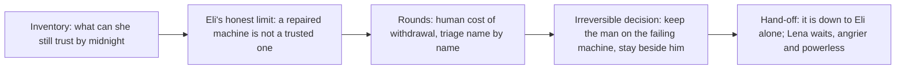

# Chapter 2: The Last Supported Day

## Chapter Metadata

```yaml
chapter_number: 2
working_title: "The Last Supported Day"
act: "Act One: Service Terminated"
story_date: "Friday, October 3, 2053"
time_of_day: "evening into night"
primary_viewpoint: "Dr. Lena Okafor"
tense: "past"
person: "close third person"
primary_location: "Lena's independent community clinic, near Eli's neighborhood, Greater Detroit"
secondary_locations:
  - "the clinic's patient rooms and ward"
  - "the clinic's old back-room server space"
  - "the street immediately outside the clinic"
estimated_word_count: 5800
planned_scene_count: 4
chapter_status: "blueprint"
```

---

## Chapter Summary

On the evening of Friday, October 3, 2053, Dr. Lena Okafor is already running on anger. A formal manufacturer notice arrived that afternoon: three of her clinic's systems, the diagnostic scanner, the medication-management unit, and the respiratory-support controller, lose remote authentication at midnight. She has spent the hours since the call to Eli getting her patients and her staff ready for a deadline none of them chose. When Eli arrives, the chapter grounds the technical setup entirely through her: he asks where the affected machines are, how many of each, and where the clinic's old server room is, and through her answering and showing him the reader re-learns the three systems and what each one keeps alive. Lena does not understand the problem as Eli does. She understands it as triage. Which patients cannot wait. Which procedures can safely continue and which must stop tonight. And she has to make those calls without knowing whether the machines will keep running past midnight or stop the moment they are next restarted, because no one, Eli included, can tell her what midnight actually does.

She leaves Eli to the back-room work and goes to her people. The middle of the chapter is her rounds, and it is the book's first sustained look at what 2053 is like for ordinary, non-technical people, delivered entirely through Lena. The clinic and the neighborhood are seen through a physician's eyes rather than an engineer's: the patients and the regular people coping with a world that has quietly stopped supporting them, the small adaptations and ordinary indignities of unsupported care. Through the specific people in front of her, the texture of the new everyday life accumulates without ever becoming a lecture. The work most people used to do for distant companies has come home and gone informal: the man who once ran logistics for a freight network now keeps the neighborhood's food-trade board, and the people who pay her do it in what they have, because that is what an economy is now. A patient leaves a dozen eggs on the counter because there is no other way to settle it. The old institutional scaffolding of care has folded the same polite way the towers and the dairy case folded: insurers withdrew from whole districts or simply ceased, the clinic no longer bills anyone because there is no longer anyone to bill, and patients still carry the reflexes of a world that ended, one apologizing for what she cannot pay, another having stayed away for months out of the old fear that he could not afford to come. Lena holds the contradiction without resolving it: this human, hand-to-hand economy is in some ways warmer than the transactional one it replaced, and it is also a downgrade no one chose, a wound dressed in neighborliness. Inside all of it she does her triage. She moves a man off the respiratory controller for the daylight hours and dreads the night he cannot hold without it. She rations, she improvises, she answers the people who depend on her with the only honesty she allows herself, which is never the whole of it.

The chapter ends as the night deepens. Lena has done everything a doctor can do with her hands and her judgment, and it is not enough, and the part that might matter now is happening in a back room she has handed to one man. She begins the chapter angry at the companies that abandoned the clinic. She ends it angrier at a wider thing: a world in which the people she is responsible for now depend on one man's unauthorized work and a clock no one chose. She does not see what Eli does in the back room. The viewpoint stays with her, and hands the night forward.

---

## Narrative Purpose

### Primary Purpose

Show what technological withdrawal **means in human terms**, through the eyes of someone who is not an engineer, and convert the abstract midnight deadline from Chapter 1 into a series of concrete, accountable triage decisions made over named patients. This chapter is the book's argument that worth is measured in specific lives, dramatized by the one character canon assigns to insist on exactly that.

### Secondary Purposes

- Introduce Lena as a full viewpoint character in her own right (Chapter 1 saw her only through Eli and only over a degraded link): her competence, her discipline, her anger held as quiet, her refusal to let a medical crisis be abstracted into a systems problem.
- Worldbuild the unsupported-care texture of the clinic and the neighborhood through a non-technical lens: rationed consumables, improvised support, the indignities of running modern equipment with no manufacturer behind it.
- Deliver the book's first big lens on 2053 everyday life for ordinary, non-technical people, entirely through Lena on her rounds: post-employment localism (work that used to belong to big companies has come home and gone informal), a barter and trade-over-purchase economy (goods and services passed hand to hand, patients paying in what they have), and the collapse of insurance and institutional healthcare (insurers withdrawing from whole districts or folding; a clinic that no longer bills because there is no longer anyone to bill). Every world-fact rides on one concrete patient, transaction, or object in front of her; none of it is narrated as an essay.
- Establish the economic and insurance collapse as another face of the same polite corporate withdrawal that drives Chapter 1, deepening that chapter's thesis rather than competing with it: "hard to pay premiums with no income" rhymes with "no longer supported under current service-continuity thresholds." The hand opening finger by finger is the same hand; here it lets go of the scaffolding that used to pay for care and work.
- Establish the human stakes of the midnight deadline as bodies and names, and the moral hazard that repaired-but-unsupported technology can be confidently wrong, so that the night Eli inherits carries weight the reader already feels.
- Hand the night cleanly forward to Chapter 3 (Eli's vigil) without crossing into it: end on Eli alone against the deadline, seen only as Lena leaves him to it.

### Why This Chapter Cannot Be Removed

Without this chapter the midnight deadline stays an engineering problem with patients named only in passing over a thin link. The reader would arrive at Chapter 3's vigil never having stood inside the clinic, never having met the people the deadline is about, never having watched a physician triage lives against a clock she did not set. It is also the novel's first sustained look through a non-Eli viewpoint, and the only place where the cost of withdrawal is felt as care rather than as wiring. If it were cut, the book's central moral claim, that human value is not the same as economic usefulness, would have no human carrier in Act One before Morrow appears, and the death that ignites everything in Chapter 3 and Chapter 4 would land on people the reader never knew.

---

## Chapter Promise

A doctor spends the last hours her equipment is officially allowed to work deciding, patient by patient and name by name, who can be kept safe through a night no one promised, while the man who might save the machines disappears into a back room she cannot follow him into. A clinical evening becomes a moral accounting, and the comfort of being the one in charge dissolves into dependence on a deadline and a stranger's unauthorized hands.

---

## Viewpoint Character

### External Goal

Get every patient through the night safely, before and after midnight, by triaging what the clinic can still do without authenticated equipment: deciding which procedures continue, which stop tonight, and how to cover the patients who depend on the three systems that go dark.

### Internal Pressure

Lena's authority is the thing keeping the clinic upright, and she has built it on the belief that visible human judgment is safer than automated judgment. Tonight her judgment is not enough by itself. She is forced to depend on Eli's unauthorized fix and on a deadline set by people she will never meet, which presses directly on her deepest fear: becoming dependent on a system, and now a man, capable of deciding whose life matters while she stands by. She carries the names of patients who died in her last evacuation, and she will not add to that list by pretending a problem is smaller than it is.

### Starting Emotional State

Controlled, sleepless, and very angry, in the quiet way that other people mistake for calm. Furious at the companies that wrote a thank-you note while closing a hand around her patients. Already moving, already triaging, refusing to let the anger become panic because panic does not move a patient off a respirator.

### Ending Emotional State

Angrier, and the anger has changed shape. No longer aimed only at the distant companies but at the whole arrangement she now stands inside: that the people she is responsible for depend on one man's unauthorized work in a back room and on a clock no one chose. Spent, clear-eyed, and unwilling to be comforted. Not despairing. Anger is not despair. It is the only fuel she trusts.

### False Assumption

That this is, finally, a problem she can manage the way she manages every other shortage, by triage, discipline, and refusing illusions: that if she is honest and careful enough, her judgment can hold the line. The chapter challenges this. The decisive part of tonight is not in her hands at all. It is in a back room, in work she cannot do and cannot fully oversee, against an outcome no one can predict.

### Decision

Lena commits to a triage plan she cannot fully justify, made without knowing what midnight does: she keeps certain patients on the clinic floor through the night under direct human watch, sends others home or elsewhere, stops a procedure she would normally continue, and decides to keep the man who cannot hold a night unaided on the respiratory controller and present beside him rather than move him, betting on Eli and on machines that may already be doomed. The bet cannot be unmade. Whatever happens overnight, she has chosen who is where when midnight comes, and she will own that choice with or without an outcome she controls.

---

## Reader Information

### What the Viewpoint Character Knows

- A manufacturer notice arrived that afternoon: the diagnostic scanner, the medication-management unit, and the respiratory-support controller lose remote authentication at midnight tonight, October 3.
- She has worked with Eli for four years; she respects his skill and distrusts his instincts. She knows **most** of his Asterion history, that he was a senior systems person at a major company and left under bad terms, and she neither absolves him nor reduces him to it.
- Her clinic survives by combining modern equipment with older medical practice and improvised support; consumables, parts, calibration, and software support are all precarious.
- She has run a hospital collapse before and watched patients die when systems and logistics were withdrawn; she remembers every name.
- Eli's fix is to stand in for the withdrawn manufacturer locally so the machines stop waiting on a company that no longer answers. She understands this in outline, as forgery and repair.
- Which of her patients are fragile, who is on what, and what each system clinically does.

### What the Viewpoint Character Does Not Know

- What midnight actually does to the machines: whether they keep running until restarted, lose only their diagnostics, or stop at once. No one, including Eli, knows this. (Canon: act-1-timeline.md, Friday night; chapter-02.md Information Revealed.)
- That repairing the authentication does not restore the medical correctness the authentication gated (calibration, dosing envelope, safety record), so a unit running on Eli's fix can be confidently wrong. She grasps the danger in clinical terms (an unsupported device she cannot trust) but not in Eli's exact technical terms, and Eli does not fully lay it out for her on the page this chapter.
- Anything about Morrow, the buried project, or Eli's deeper secret. These do not exist for her and must not surface. (Reveal-safety.)
- What Eli will actually do in the back room tonight, or whether it will work. She leaves him to it and does not witness it. (Chapter 3 is his vigil, his viewpoint.)

### What the Reader Already Knows

From Chapter 1 (Eli's viewpoint), the reader already knows, and Chapter 2 must stay consistent with:

- The three named systems and the **23:59 / midnight** deadline, October 3, delivered in the same calm corporate register as the other withdrawal notices.
- That the neighborhood was moved to a lower power tier at midday, and outages will no longer be treated as emergencies (relevant to clinic backup-power risk; Lena would know this as a resident and clinic director).
- That Eli could forge the authorization but not the medical correctness behind it, and not for every machine in time; the reader carries the dread that the fix may not be a fix.
- That there is a man, sixty-one, on the respiratory controller who cannot hold a night without it (named in Chapter 1's call as the patient Lena was protecting; she carries the name, keeps it back from Eli over the link).
- That the mesh link between clinic and shop is thin and drops.

### New Information Revealed

- The clinic seen from inside: layout, ward, the three machines in their places, the old back-room server space, the staff and patients, the physical and procedural reality of unsupported care.
- The first sustained picture of 2053 everyday life for ordinary, non-technical people, all through Lena: post-employment localism (former corporate workers now working locally and informally, e.g. a one-time logistics analyst who keeps the neighborhood food-trade board; someone who once held a corporate job now keeping chickens or fixing bikes), a barter and trade economy (goods and services traded hand to hand, "you get eggs from so-and-so down such-and-such road"; patients paying Lena in goods because that is what they have), and the collapse of insurance and institutional healthcare (insurers withdrew from whole districts or folded; premiums cannot be paid with no income; the clinic no longer bills because there is nothing to bill to). Each fact is shown on a specific person or object, never narrated as exposition.
- That the economic and insurance collapse is the same polite withdrawal as the cellular, power, and manufacturer notices of Chapter 1, not an apocalypse: a company closing its hand, finger by finger, here around the scaffolding that used to pay for care.
- The old world's manners outliving the old world: people who still apologize for not being able to pay, and who stayed away from care for months out of the old reflex that they could not afford it.
- Lena's interior: how she triages, what she refuses, the discipline over the anger, the names she carries, the fear she will not name aloud, and the contradiction she holds without resolving (that the new human, local economy is in some ways warmer than the old transactional one and is also a downgrade no one chose).
- Medical AI can diagnose accurately while remaining inaccessible: the scanner can be right and still refuse to run, or run and not be trustable. (Canon: medicine.md, "Accurate diagnosis does not matter if the treatment cannot be obtained.")
- Unsupported technology creates moral risk even when repaired: a fixed machine she cannot fully trust is its own kind of hazard, and she has to decide how much to lean on it.
- That no one, Eli included, knows what midnight does, and that Lena has to make irreversible triage calls anyway.

### Information Deliberately Withheld

- **Morrow, the buried drive, the "resume the project," Eli's six-years-ago secret.** Reason: these are deep later reveals; Lena does not know them, and the chapter is in her viewpoint. Nothing may hint at them, not even as Eli's strangeness. His back-room work reads, to her and the reader at this point, as authentication forgery and repair, nothing more.
- **What midnight does to the machines.** Reason: the uncertainty is the dread, and the outcome belongs to Chapter 3 (the borrowed-uptime reprieve) and Chapter 4 (the off-page death). Chapter 2 must end before any of that and must not foreshadow the specific outcome.
- **Lena's own stolen, traceable credentials.** Reason: canon secret held at story start; its payoff is reserved for later (possibly during containment). It may inform her wariness about traceability and her clinic's hidden fragility as private texture, but it must not be exposed or explained here.
- **The full technical reason the fix is not really a fix** (the un-forgeable medical correctness). Reason: Eli only half-names it to her; the chapter holds her in clinical, not engineering, understanding. The reader, who heard it in Chapter 1, supplies the dread; Lena need not have the vocabulary.
- **What Eli does in the back room.** Reason: viewpoint discipline. She leaves him to it; the camera stays with her.

---

## Opening

### Opening Image

A patient room readied for a night that may have no working machines in it: a respiratory controller running steadily with a printed paper card taped to its housing where a glowing certified-status indicator used to mean something, and Lena's hand flat on the warm casing, feeling it breathe for the man in the bed, counting the hours left on a clock she did not set.

### Opening Situation

Lena is mid-preparation, hours after the afternoon notice and her call to Eli, walking her clinic the way she walks it before any crisis, taking inventory of what she can still trust. She is not waiting for Eli; she is working. The chapter opens on motion and judgment, not on explanation, with the anger already in her and the deadline already counting down.

### Immediate Question

If the machine that keeps this man breathing tonight loses its permission at midnight, and no one can say whether that means it stops, degrades, or simply keeps running while she has to wonder, what does a doctor do with the hours she has left, and who does she decide to keep close when the clock turns?

---

# Scene Breakdown

---

## Scene 1: Inventory of What Still Works

### Scene Metadata

```yaml
date: "Friday, October 3, 2053"
start_time: "early evening, around 18:30"
duration: "approximately 30 minutes"
viewpoint: "Lena"
location: "Lena's clinic, the ward and the three machines in their rooms"
characters_present:
  - "Lena"
  - "a clinic nurse or aide (one named staff member, brief)"
  - "the man on the respiratory controller, age 61 (present, mostly silent)"
  - "one or two patients glimpsed in passing"
```

### Scene Purpose

Open the chapter inside Lena's judgment and her anger, establish the clinic physically and the three machines in their places, and convert the afternoon notice into a problem she is already managing by hand: an inventory of what she can still trust through the night. No other scene establishes Lena's interior and the clinic's unsupported-care texture from the inside before Eli arrives.

### Viewpoint Goal

Know exactly what she still has: which machines, which patients, which procedures, and how long any of it holds if the equipment goes dark at midnight. She wants a true picture before she has to make decisions she cannot take back.

### Opposition

The picture refuses to be true. The equipment looks fine and reads fine, which is the trap; a diagnostic that can be accurate and still inaccessible, a controller that confirms it is authorized on a cycle that ends at midnight. Missing information opposes her: she cannot know what midnight does, and the machines will not tell her. Her own anger opposes her, threatening to become the kind of feeling that does not move a patient.

### Stakes

If she misjudges what holds, she puts a specific patient on a machine that fails in the dark with no warning. The stake is the man on the respiratory controller and whoever else she leaves dependent on equipment she cannot vouch for after midnight.

### Entry Condition

The afternoon manufacturer notice has arrived and been read; Lena has already called Eli (the Chapter 1 call) and he is coming. The clinic is in its evening rhythm, understaffed, running on the usual improvisations. The neighborhood was dropped a power tier at midday.

### Major Beats

1. Lena moves through the clinic taking inventory, her hand on the respiratory controller's warm housing, reading the man in the bed and the machine at once.
2. She checks the diagnostic scanner and the medication-management unit, registering that each is physically perfect and each will stop being permitted at midnight; the scanner can find the thing wrong inside a person and refuse to boot at startup; the med unit holds the doses already loaded and may lock against new ones.
3. A staff member asks her a practical question (a dose, a schedule, whether to admit someone), and Lena answers in the clipped, exact way she works, the anger audible only as quiet. A light, concrete touch of the new economy sits inside the question: a supply that used to arrive on a contract now comes through a trade with someone two streets over, or a payment that would once have been billed is now simply not billed, because there is no longer anyone on the other end of the bill. Establish this as ordinary fact, not as a topic; it is the water the clinic swims in.
4. She does the arithmetic she hates: how many hours, how many patients, how much she can carry by hand if the machines go.
5. She catches herself standing too long with her hand on the controller and makes herself move, because standing still is not a plan.

### Scene Turn

The inventory does not resolve into a manageable list. The closer she looks, the clearer it is that the things she most needs to trust are the things she can trust least, because trustworthiness now depends on permission that ends at midnight, not on whether the machine works. She is not short of equipment. She is short of certainty, and certainty is the one thing triage requires.

### Exit Condition

Lena has a clear, frightening inventory and no way to act on it alone; she knows precisely what she cannot promise. The arrival of Eli (heard or announced at the scene's end) is the thing that might change the math, and she turns toward it already knowing he cannot give her what she actually needs.

### Emotional Movement

**Beginning:** controlled fury, in motion, refusing panic.
**End:** the same fury, narrowed to a point, as the inventory confirms her judgment alone will not be enough tonight.

### Relationship Movement

**Characters:** Lena and the clinic (her staff and patients, collective)
**Before:** Lena as the steady center, the one who decides and is trusted to decide.
**After:** unchanged in their eyes, but Lena privately registers that being the one who decides is about to mean depending on someone else's hands, which is the thing she least wants.

### Information Revealed

- To the reader: the clinic interior, the three machines in place, the unsupported-care texture, Lena's method and anger.
- To the reader: medical AI can be accurate and inaccessible at once (the scanner); a controller confirms authorization on a cycle that ends tonight.
- To Lena: the precise, unwelcome shape of what she cannot promise after midnight.
- No lie introduced; the chapter's central uncertainty (what midnight does) is established as unanswerable.

### Technology and Worldbuilding

- **Respiratory-support controller.** What it does: keeps a patient breathing who cannot, unaided, hold a night. Controller: its manufacturer, via remote authentication on a confirmation cycle. Power: clinic supply plus backup batteries (now without emergency-restoration priority after the midday tier drop). Limit: requires remote authorization to keep confirming itself; at midnight that authorization is withdrawn. What can fail: it may keep running until restarted, degrade, or stop, and no one knows which.
- **Diagnostic scanner.** What it does: diagnoses accurately, often better than an individual physician. Controller: manufacturer, via a startup license check. Limit: checks a license at boot; if the server does not answer, it does not boot. What fails: accurate diagnosis becomes inaccessible. (Canon: medicine.md.)
- **Medication-management unit.** What it does: controls dosing, how much of a drug and when. Controller: manufacturer authentication. Limit: at midnight it may keep the doses already loaded and refuse new ones, or lock entirely. What can fail: it strands the patients whose dosing it governs.

### Sensory Anchor

- Visual: the printed paper card taped over a dead certified-status light; the two clean machines reading perfect numbers in a dim room.
- Sound: the steady cycle of the respiratory controller; a battery-backed clinic's low electrical hum; a patient's breathing under the machine's.
- Smell/texture: antiseptic and old building, the warm casing of the controller under her flat hand, the cold that has crept in since the heat was rationed.

### Dialogue Objective

| Character          | Wants                                          | Hides or avoids                                   |
| ------------------ | ---------------------------------------------- | ------------------------------------------------- |
| Lena               | An exact account of what holds and for how long | Her fear; how thin the clinic's independence is    |
| Clinic staff member | Clear instructions; reassurance                 | How frightened they are by the deadline            |

### Subtext

The scene is about the difference between a machine that works and a machine she can trust. Lena's whole method is built on judgment over permission, and tonight the permission is the thing being taken, and she is discovering that her judgment cannot replace it, only decide who stands closest to the failure.

### Continuity Changes

- Location detail established: the clinic interior, the placement of the three named systems, the ward, the back-room server space (named in passing, paid off in Scene 2).
- Knowledge confirmed (Lena): the three systems lose authentication at midnight; no one knows what midnight does.
- System state: the three systems still functioning, on borrowed permission, with the deadline counting down.
- Resource state: clinic on reduced power priority after the midday tier drop; consumables and parts precarious.

### Scene Ending

End on Lena lifting her hand from the warm housing of the respiratory controller as a sound at the front of the clinic tells her Eli has come, and turning toward it with the inventory finished and useless, because the man who is arriving cannot give her certainty, only a chance.

---

## Scene 2: Where Are the Machines

### Scene Metadata

```yaml
date: "Friday, October 3, 2053"
start_time: "early evening, around 19:00"
duration: "approximately 30 to 40 minutes"
viewpoint: "Lena"
location: "Lena's clinic, moving from the entrance through the ward to the old back-room server space"
characters_present:
  - "Lena"
  - "Eli (present, seen entirely through Lena)"
```

### Scene Purpose

Ground the technical setup entirely through Lena, as the plot-map mandates: Eli asks where the affected machines are, how many of each kind, and where the clinic's old server room is; Lena answers and shows him, and through her telling the reader re-learns the three systems and what each keeps alive. Establish the Eli/Lena dynamic from her side (his system-framing against her consequence-framing), and hand the back-room work to him so Lena can leave for her rounds. No other scene delivers the setup from a non-engineer viewpoint or sets the relay that hands the night forward.

### Viewpoint Goal

Get Eli oriented fast and working, and get a straight answer to the only question that matters to her: can he keep her patients safe through the night, and if not, what is she actually deciding.

### Opposition

Eli. Not as antagonist but as friction: he reaches for the system, the clean technical frame, and she keeps dragging him back to the patient and the consequence. His honesty opposes her too; he will not promise her what she wants, and his refusal to lie is the thing she both trusts and cannot bear tonight. The thin time before midnight opposes them both.

### Stakes

If she lets Eli keep it abstract, she loses the one thing she can extract from him: a real account of what his fix can and cannot do, so she can triage around its limits. If she gets it wrong, she plans the night against a fix that was never going to hold.

### Entry Condition

Eli has arrived. Lena has her inventory. The three systems are placed and counting down. The back-room server space exists, dusty and half-forgotten, the place Eli will need.

### Major Beats

1. Eli comes in and, in his way, asks the orienting questions: where are the affected machines, how many of each kind, where is the clinic's old server room. Lena answers and walks him through it; through her answers the reader re-learns the three systems and what each keeps alive.
2. Lena watches him read the machines the way he reads everything, fluent and detached, and feels the familiar pull of his competence and the familiar distrust of where it goes.
3. She pushes him from the system to the people: who is on the controller tonight, what happens to the man if calibration is lost, who is accountable if a repaired machine is confidently wrong. She has done this with him for four years; she does it now with the deadline on top of it.
4. Eli gives her the honest, unwelcome shape of it without the full technical vocabulary: he can make the machines stop waiting on a company that no longer answers, but he cannot vouch for what they do after that the way the manufacturer once did, and he cannot do it for every machine in the time he has. Lena hears, in clinical terms, that a repaired machine is not a trusted machine.
5. She shows him the back-room server space and leaves him to it. The hand-off is deliberate: this is his work, not hers, and she has her own. (A single light touch of the world economy may ride the walk-through here, glimpsed not explained: a corner of the clinic given over to the food-trade board, or a shelf of in-kind payments, the everyday evidence that the clinic now runs on the community economy. One detail, no more; the world chapter proper is Scene 3.)

### Scene Turn

The turn is the honest answer. Lena came hoping Eli's arrival would shrink the problem; instead his honesty confirms that the decisive work is now out of her hands and that even done perfectly it may not be enough or may not be trustable. The relationship engine of the act sets here, from her side: he goes up where it is clean, she stays down where the bodies are, and tonight she has to let him go up because someone has to do the back-room work she cannot.

### Exit Condition

Eli is installed in the back-room server space with the work; Lena has the truthful limits of his fix and a clear, frightening sense that her triage must assume the machines may fail or may lie. She turns to her rounds. From here the chapter follows her, and Eli recedes into a room she will not re-enter on the page.

### Emotional Movement

**Beginning:** brisk, demanding, glad of him and wary of him at once.
**End:** the wariness deepened into something colder; not toward Eli personally but toward the arrangement that makes her depend on him and on a deadline.

### Relationship Movement

**Characters:** Lena and Eli
**Before:** four years of respectful, frictional collaboration; she knows most of his Asterion past and neither absolves nor reduces him.
**After:** the same trust, now load-bearing under a shared emergency and seen from her side; she has handed him the part she cannot do and resents that she has to.

### Information Revealed

- To the reader (re-learned through Lena): the three systems and what each keeps alive, the count, the back-room server space.
- To Lena: the truthful limits of Eli's fix, in clinical terms (a repaired machine is not a trusted one; he cannot cover every machine in time).
- To the reader: the Eli/Lena dynamic from her viewpoint, his system-framing against her consequence-framing, his honesty as both trustworthy and unbearable.
- Withheld: any hint of Morrow, the buried project, or Eli's deeper history. His work is forgery and repair, full stop. His past is, to her, the known Asterion history, not the deeper secret; she does not press it tonight and the narration does not open it.

### Technology and Worldbuilding

- **Eli's bypass work, seen through Lena.** What it does: stands up a local stand-in for the withdrawn manufacturer so the machines stop waiting on a company that no longer answers; forges the permission. Controller: Eli. Limit (as Lena understands it): forging the permission does not restore the manufacturer's vouching for the machine's correctness, so a repaired machine cannot be fully trusted; and it is per-machine work that does not cover everything before midnight. What can fail: a machine running on his fix may be confidently wrong, which for a respiratory controller or a dosing unit is its own danger. (Canon: cloud-dependency.md; the reader knows the full version from Chapter 1; Lena holds the clinical version.)
- **The clinic's old back-room server space.** What it is: a dusty, half-forgotten room where the clinic's own server lives, the place Eli needs to stand up a local stand-in. Controller: the clinic, neglected. Limit: old, underpowered, not built for this. (Sets the Chapter 3 vigil location without entering it.)

### Sensory Anchor

- Visual: Eli's stillness and the speed of his hands over a machine; the dust and disuse of the back-room server space when she opens it for him.
- Sound: his short, exact questions; the difference between his voice in person and the thin link version from the afternoon.
- Smell/texture: cold corridor, the particular stale air of the unused back room, the click of the server-space door.

### Dialogue Objective

| Character | Wants                                                          | Hides or avoids                                          |
| --------- | ------------------------------------------------------------- | ------------------------------------------------------- |
| Lena      | A real answer about whether her patients survive the night    | Her fear; how much she is about to depend on him         |
| Eli       | The exact machines and the room, so he can start              | (As Lena reads him) that he is not sure he can do it; his discomfort being relied on |

### Subtext

The conversation is literally about where the machines are and how many. It is actually about the moment Lena hands the decisive part of her clinic to someone else and has to decide to trust hands that come from a past she has never fully forgiven. The setup questions are Eli's way of being useful without being responsible for the people; Lena's pushback is her refusing to let him have that.

### Continuity Changes

- Location detail established/paid off: the back-room server space (set up in Scene 1) now shown and handed to Eli; this is the Chapter 3 vigil location.
- Relationship state: Lena has handed Eli the back-room work; the relay that hands the night forward is set.
- Knowledge gained (Lena): the truthful clinical limits of Eli's fix.
- Promise made: Eli will work the back room against midnight; Lena will triage around it.

### Scene Ending

End on Lena pulling the back-room door most of the way closed on Eli already bent over the clinic's old server, the dust and the single work light and the bowed shoulders, and turning back down the corridor toward her patients, leaving him to a room she has decided not to stand in.

---

## Scene 3: Rounds

### Scene Metadata

```yaml
date: "Friday, October 3, 2053"
start_time: "evening, around 19:45 into mid-evening"
duration: "approximately 90 minutes"
viewpoint: "Lena"
location: "Lena's clinic ward and patient rooms; a brief step to the street immediately outside"
characters_present:
  - "Lena"
  - "the man on the respiratory controller, age 61"
  - "two or three named patients or neighbors"
  - "a clinic staff member"
```

### Scene Purpose

This is the heart of the chapter and the book's first big lens on what 2053 is like for ordinary, non-technical people. Lena does her rounds, and the clinic and neighborhood are shown as they are now, the patients, the regular people coping with a world that has quietly stopped supporting them, the small adaptations and indignities of unsupported care. This scene is the natural home for the expanded worldbuilding: post-employment localism, the barter and trade-over-purchase economy, and the collapse of insurance and institutional healthcare, all shown on specific people and objects in front of Lena, never as a narrated essay and never as a standalone "here is the economy" section. It is also where the central triage decision is made, name by name, without knowing what midnight does. No other scene carries the human cost of withdrawal, the world texture, or the triage decision.

The world-economy material must obey a strict craft rule: every world-fact rides on one concrete patient, transaction, or object. Worldbuilding emerges through action; exposition never halts the story. The economic and insurance collapse must read as another face of the same withdrawal that drives Chapter 1, a company politely closing its hand, not an apocalypse: the line that cannot be crossed on a body, "hard to pay premiums with no income," must rhyme with the Chapter 1 line "no longer supported under current service-continuity thresholds." Keep Lena's register throughout: she holds, at once, that this hand-to-hand human economy is in some ways warmer than the old transactional one and that it is a downgrade no one chose, a wound. Both truths, never reconciled.

### Viewpoint Goal

Settle every patient as safely as she can for a night she cannot guarantee, and decide who is where when midnight comes: who stays under direct human watch, who goes home or elsewhere, what stops tonight, who stays on the failing machines.

### Opposition

The world. Every patient is a different shortage, a different improvisation, a different person owed honesty she cannot fully give. The missing certainty opposes her at every bed: she is triaging against an outcome no one can predict. Her own rule, transparency, opposes her, because telling a frightened patient the whole truth tonight may cost more than it is worth, and she knows she sometimes withholds, and hates it.

### Stakes

Every decision is a specific life placed for the night. If she keeps the man on the controller and the machine fails after midnight, she has chosen wrong. If she moves him and he cannot hold the night, she has chosen wrong. The stakes are named patients, and she will carry whichever name the night takes.

### Entry Condition

Eli is in the back room. Lena has the truthful limits of the fix. The deadline is closing. The clinic is full of people who depend on her and a few who depend on machines that go dark at midnight.

### Major Beats

1. Lena moves bed to bed, and through her eyes the reader sees unsupported care up close: a treatment improvised around a missing consumable, a diagnosis she has to make with her own judgment because the scanner she would have trusted is part of tonight's problem, a patient managed with older practice because the modern path is gone.
2. **Post-employment localism, shown on one person.** A patient (or a neighbor at the clinic) carries the new working life on him: a man who used to run logistics for a freight or distribution network, now the one who keeps the neighborhood's food-trade board, matching what one street grows or keeps against what another needs. Lena knows his history without narrating it, the way you know your patients; the contrast between the work he trained for and the work that feeds people now sits in the scene as fact, not commentary. (A second, lighter instance can ride past in a line: someone who once held a corporate job now keeps chickens or fixes bikes. One vivid carrier and one glancing one; no list.)
3. **The barter and trade economy, shown on one transaction.** A patient settles with Lena in goods because that is what she has, leaving a dozen eggs on the counter, or paying her in a service or a thing because cash is only one of several things money is now. The directional, hand-to-hand quality of it surfaces in dialogue, not exposition ("you get eggs from so-and-so down such-and-such road"). Lena takes the eggs. She holds the contradiction in the taking: there is a warmth in it the old transactional world never had, and it is also evidence of a world that can no longer pay its physician in anything but eggs.
4. **The collapse of insurance and institutional healthcare, shown on two patients.** First, a patient who stayed away for months out of the old reflex that he could not afford care, and whose small problem is now large because of the delay, the very fear the old system trained into people outliving the system that trained it. Second, a patient (or family member) who still apologizes for not being able to pay, the old world's manners persisting after the old world ended. Through these, the reader learns, without a paragraph of explanation, that insurers withdrew from whole districts in the same polite register as the cell and power and manufacturer notices, or folded entirely; that you cannot pay premiums with no income; and that the clinic no longer bills because there is no longer anyone to bill to. Lena names none of this as a system; she feels it as the shape of the people in front of her, and the same banked anger she carries about the machines extends to it: it is the same hand, opening.
5. She reaches the man on the respiratory controller, age 61 (the man named over the Chapter 1 call). She moves him off it for as long as he can manage in the evening, as she does, and faces the night he cannot hold without it. This is the decision's center: keep him here, on the machine that may fail, with her beside him, or move him, with no good place to move him to.
6. She makes the triage calls across the clinic: what continues, what stops tonight, who stays under watch, who goes. She decides to keep the man on the controller and stay close, betting on Eli and on machines that may already be doomed, because there is no safe option, only owned ones.
7. A moment of withheld truth: a patient or family asks her if it will be all right, and Lena gives them the honest fraction she allows herself, and feels the cost of the part she keeps back, and the anger that it should ever come to this.

Pacing note: the world-economy beats (2, 3, 4) must be interleaved with the medical rounds and the triage decision, not stacked into a block. Each rides a single bed or doorway and then the scene moves on. The reader should feel they have toured 2053 only in retrospect; in the moment they are always watching Lena settle a specific patient.

### Scene Turn

The turn is the decision landing as a thing she owns rather than a thing she solves. She cannot make the night safe; she can only decide who stands closest to the danger and stand there with them. The triage call about the man on the controller is the irreversible choice of the chapter: made in the dark, against an unknown, and hers.

### Exit Condition

The clinic is as settled as Lena can make it. Every patient is placed for the night. The man is on the controller with Lena's choice behind it. She has done everything a doctor can do with hands and judgment, and the decisive part is still happening in a room she handed away.

### Emotional Movement

**Beginning:** focused, moving, the anger banked into work.
**End:** spent and clear, the anger broadened from the companies to the whole arrangement, grief held at arm's length because the night is not over.

### Relationship Movement

**Characters:** Lena and her patients (the man on the controller in particular)
**Before:** the doctor who decides and is trusted.
**After:** the doctor who has decided, and who now waits beside her decision, no longer fully in control of whether it was right.

### Information Revealed

- To the reader: the human texture of unsupported care, the patients, the neighborhood coping, the indignities and the small dignities, all through a non-tech lens.
- To the reader: the first sustained picture of 2053 everyday life for ordinary, non-technical people, all shown on specific people and objects in front of Lena: post-employment localism (former corporate work gone local and informal), the barter and trade economy (payment in goods, hand-to-hand and directional), and the collapse of insurance and institutional healthcare (insurers withdrawn from districts or folded; premiums unpayable without income; the clinic no longer billing).
- To the reader: that the economic and insurance collapse is another face of the same polite corporate withdrawal that drives Chapter 1, the same hand opening finger by finger, not an apocalypse.
- To the reader: that the old world's manners outlive the old world (apologies for not paying; staying away out of an obsolete fear of cost).
- To the reader: that unsupported technology creates moral risk even when repaired; Lena triages around a machine she cannot trust.
- To Lena: the full weight of deciding without knowing what midnight does.
- Lie or withholding introduced: Lena gives a frightened patient less than the whole truth, consistent with her canon contradiction, and registers the cost. (Not a plot lie; a character truth. Not exposed or resolved this chapter.)

### Technology and Worldbuilding

- **Unsupported medicine, in practice.** What it is: modern equipment combined with older practice and improvised support, lacking consumables, parts, calibration, network authorization, and current models. Controller: nominally the manufacturers, in practice Lena and her staff. Limit: accurate equipment that cannot be obtained, trusted, or resupplied. What fails: the smooth modern path, replaced by judgment and improvisation. (Canon: medicine.md, "Unsupported Medicine.")
- **Medical AI accuracy versus access.** What it shows: the scanner could diagnose accurately and is now part of the problem, so Lena diagnoses with her own judgment. Limit: accurate diagnosis does not matter if it cannot be obtained. (Canon: medicine.md.)
- **Post-employment localism.** What it is: the displacement of mass employment has not emptied the neighborhood of work; it has driven work local and informal. People who used to hold jobs inside large companies now do small, hands-on, community-facing work instead, and the old specialist knowledge is repurposed (a logistics analyst becomes the food-trade coordinator). Controller: the community itself, by informal agreement; no institution. Limit: it covers food, repair, and care at a neighborhood scale only, and it depends entirely on which knowledgeable people happen to live here. What is lost: income, institutional standing, and the assumption that distant systems will provide; what survives: skill, applied closer to home. (Canon: community-infrastructure.md, which lists logistics coordinators and informal apprenticeships among the roles that keep communities alive; infrastructure-decline.md, "knowledge becomes more valuable than wealth"; social-structure.md, "Everyone Else.")
- **The barter and trade economy.** What it is: outside the protected systems, payment is no longer mainly cash. People settle in goods, labor, and services traded hand to hand and directionally ("eggs from so-and-so down such-and-such road"). National currency still exists and still circulates (the "soft worn bills" of Chapter 1), but it is one option among several, not the default. Patients pay Lena in what they have. Controller: no one; it is emergent and trust-based. Limit: it works only at the scale of people who know each other; it cannot reach the corporate supply chains it replaced. What it costs: the loss of the frictionless, anonymous transaction; what it gains: a warmth and visibility the old transactional economy lacked. (Canon: identity-and-money.md, "Money": barter, labor exchange, energy credits, physical goods, community ledgers, and surviving government currency; greater-detroit.md neighborhood network sharing food, medicine, and labor.)
- **The collapse of insurance and institutional healthcare.** What it is: the financial and institutional scaffolding that used to pay for and authorize care has withdrawn the same way the manufacturers, the cell provider, and the power provider withdrew. Insurers abandoned whole districts under the same kind of polite notice, or folded outright; premiums cannot be paid with no income; verified digital identity and coverage, which used to gate access to institutional medicine, no longer connect to anything for people here. Lena's clinic no longer bills, because there is no longer an institution on the other end of the bill. Controller: nominally insurers and health institutions, in practice no one; care now runs on Lena's judgment and the community economy. Limit: this is care without resupply, without specialist referral, without the institutional backstop that used to catch the hard cases. What persists: the old reflexes of a paying world, patients who stayed away because they "could not afford it" and patients who apologize for not paying, manners outliving the system that taught them. (Canon: identity-and-money.md, "People outside supported systems may retain legal citizenship while losing practical access to institutions," and "Access Is More Important Than Wealth"; medicine.md "Allocation Systems"; this is an extension of the Decision 002 withdrawal logic to insurers specifically, flagged below for post-approval canonization.)

Keep all of this in a non-tech, non-economic register: Lena does not narrate wiring and she does not narrate macroeconomics. She narrates what a thing does for a patient, what a person used to do and does now, and what it costs that the old scaffolding no longer holds. Every world-fact above must reach the page only through one concrete patient, transaction, or object.

### Sensory Anchor

- Visual: a patient's face under a single working light; the paper card on the controller; an improvised support rig replacing a vanished consumable; a dozen eggs left on the counter in a worn carton where a payment terminal used to sit; the food-trade board's hand-written columns glimpsed through a doorway.
- Sound: breathing, the controller's cycle, a quiet ward at night, a question asked too lightly to hide the fear in it; a patient's apology for not being able to pay, offered before Lena can wave it away; the directional shorthand of the trade economy in a neighbor's voice ("eggs from so-and-so down such-and-such road").
- Smell/texture: antiseptic, cold, the warm casing again under her hand, the particular tiredness in her own legs; the cool weight of the egg carton; the soft worn bills of the few who still pay in cash.

### Dialogue Objective

| Character | Wants                                                  | Hides or avoids                                      |
| --------- | ----------------------------------------------------- | --------------------------------------------------- |
| Lena      | To settle each patient honestly and safely             | The full truth from the frightened; her own fear     |
| Patient / neighbor | Reassurance; to be told it will be all right    | How frightened they are; how much they depend on her |
| Man on the controller | To get through the night; not to be a burden | His fear of the machine he depends on                |
| The former logistics analyst (food-board keeper) | To be useful, to make the trade math work for his neighbors | That the work he trained a career for is gone, and that this is what is left |
| The patient who pays in goods | To settle her debt with dignity, to not be a charity case | Shame at having only eggs to offer; her dependence on the clinic |
| The patient who stayed away for months | Care now, and not to be scolded for waiting | That he stayed away out of the old fear of a bill that no longer exists |

### Subtext

The rounds are about what care means when the system behind it has withdrawn: that it comes down to one tired person's judgment and presence, and that this is both the dignity and the indictment of the world. The world-economy texture carries the same doubleness: the hand-to-hand life is warmer and more human than the transactional world it replaced, and it is also the visible wound of a world that can no longer pay its physician in anything but eggs, can no longer insure its people, can no longer give a logistics analyst anything to coordinate but a food board. Lena does not resolve the contradiction; she lives inside it, and the scene must let both truths stand. Lena's withholding is about the limit of even her honesty under pressure, the contradiction the book will test in her.

### Continuity Changes

- Decision made: the chapter's triage plan, including keeping the man on the respiratory controller through the night with Lena present.
- Secret reinforced (not exposed): Lena's habit of withholding the whole truth from frightened patients; her clinic's hidden fragility.
- Knowledge confirmed: unsupported, repaired technology is a moral hazard, not a solution.
- World-texture established (for the Continuity Ledger, pending post-approval canonization in the world bible): post-employment localism (former corporate workers doing informal local work; a one-time logistics analyst running the neighborhood food-trade board); the barter and trade economy (patients paying in goods; hand-to-hand directional trade; national cash one option among several); the collapse of insurance and institutional healthcare (insurers withdrawn from districts or folded; premiums unpayable without income; the clinic no longer bills); the persistence of old paying-world reflexes (apologies for nonpayment; delayed care out of obsolete fear of cost).
- Resource state: consumables and improvisations spent through the rounds; a dozen eggs and other in-kind payments received in lieu of cash.

### Scene Ending

End on Lena finishing her rounds at the man on the controller's bedside, the night fully arrived now, the decision made and unmakeable, her hand once more on the warm casing, and the understanding settling that the rest of tonight is no longer hers to do.

---

## Scene 4: It Is Down to Him

### Scene Metadata

```yaml
date: "Friday, October 3, 2053"
start_time: "late evening, the night deepening toward midnight (well before 23:59)"
duration: "approximately 20 minutes"
viewpoint: "Lena"
location: "Lena's clinic: the corridor outside the back-room server space, then the ward"
characters_present:
  - "Lena"
  - "Eli (glimpsed once through the back-room doorway, not entered)"
```

### Scene Purpose

Close the chapter on the hand-off and complete Lena's emotional movement from anger at the companies to anger at the whole arrangement. End as the night deepens with Lena having done what she can and the decisive work down to Eli alone in the back room, which she does not see. Set up Chapter 3 (Eli's vigil) without entering it. No other scene performs the relay or lands Lena's final state.

### Viewpoint Goal

Confirm there is nothing more she can do tonight that she has not done, and accept, without softening it, that the rest is in a room she handed away, against a clock no one chose.

### Opposition

The limit of her own usefulness. She cannot do the back-room work and cannot honestly oversee it; standing in the doorway would not help and she knows it. Her need to be the one in charge opposes the truth that tonight she is not. Midnight, still ahead, opposes her by being the thing she cannot reach.

### Stakes

Nothing she can change now, which is exactly the unbearable part: the stakes are entirely in someone else's hands and in an outcome no one can predict, and her only move is to hold her position beside her patients and wait.

### Entry Condition

The clinic is settled; the triage plan is set; the man is on the controller. Eli is still in the back room, working. The night has deepened. Midnight is ahead, not arrived.

### Major Beats

1. Lena does a final pass and finds, as she knew she would, that everything that can be done by hand is done. There is no more medicine in the move she can make.
2. She passes the back-room door and glimpses Eli through it once, bent over the work, the single light, the bowed shoulders, hands moving. She does not go in. She lets the door stay as it is. (Viewpoint stays with her; we do not enter his work or his head.)
3. She names to herself, in her own terms, the thing that has been growing in her all evening: that the people she is responsible for now depend on one man's unauthorized work and a deadline no one chose, and that this is a worse abandonment than the notice, because the notice at least came from someone she could be angry at.
4. The anger completes its turn: from the companies, to the arrangement; from a thing done to her clinic, to the shape of a world that makes a doctor stand in a corridor while a stranger's hands decide her patients' night. The evening's accumulation feeds this: the eggs on the counter, the patient who apologized, the man who waited months, the food board where a logistics career ended up, all of it the same withdrawal that took the authentication, the same hand opening. The anger is not only about tonight's machines; it is about the whole arrangement that has reduced an entire way of living to improvisation and good neighbors holding a line no institution will hold for them.
5. She returns to the ward, to her position beside her patients, and takes up the wait that is the only thing left to her, the night deepening, the back room closed, the clock she did not set still running.

### Scene Turn

The turn is acceptance without comfort. Lena stops looking for a move and takes up her place, and in doing so the chapter completes her arc: she is not less angry, she is more, and the anger has found its true target, not the companies alone but the entire arrangement that has reduced her to waiting on hands she did not choose.

### Exit Condition

Lena is at her position in the ward, the night deepened, having done everything a doctor can do; the decisive work is down to Eli alone in the back room against the midnight deadline, and she does not see it. The viewpoint hands the night forward to Chapter 3. The chapter ends before midnight and before any outcome.

### Emotional Movement

**Beginning:** spent, clear, the decision made.
**End:** angrier in a wider, colder way; grounded, not despairing; holding her position and refusing to be comforted.

### Relationship Movement

**Characters:** Lena and Eli
**Before:** she has handed him the back-room work.
**After:** the dependence is fully felt and resented and accepted at once; the trust holds, and so does the anger at needing it. (Seen only from her side; Eli's interior stays closed.)

### Information Revealed

- To Lena (named to herself): the full shape of what she resents, that responsibility for her patients now runs through one man's unauthorized work and an unchosen deadline.
- To the reader: Lena's completed emotional movement; the hand-off to Eli's vigil.
- Withheld: everything about what Eli does in the back room and what midnight will do. The chapter ends on the deadline ahead, not on its outcome.

### Technology and Worldbuilding

- No new technology. The back room and the three systems are already established. The only "system" foregrounded here is the arrangement itself: a world in which functional clinics depend on unauthorized repair and unchosen deadlines. Keep it as Lena's felt understanding, not a lecture.

### Sensory Anchor

- Visual: the back-room door not quite closed, the slice of work light, Eli's bent shape glimpsed and left; the ward beyond, dim and full of sleeping or waiting patients.
- Sound: the controller's steady cycle down the corridor; the back-room small sounds of work she cannot interpret; the building's low hum; the absence where reassurance would be.
- Bodily: the ache of a long day in her legs and back; the cold; her own stillness as she takes up the wait.

### Dialogue Objective

This scene is largely solitary; if Eli speaks at all it is a few words through the doorway, kept minimal, and Lena does not enter. The weight is interior.

| Character | Wants                                            | Hides or avoids                                  |
| --------- | ------------------------------------------------ | ------------------------------------------------ |
| Lena      | To accept there is nothing more to do, and hold  | That she is frightened and furious in equal measure |

### Subtext

The scene is about what it costs to be the one in charge of a thing you cannot control. Lena's refusal to enter the back room is not avoidance; it is the discipline of knowing her presence there would not help and might break the concentration of the only hands that can. The corridor she stands in is the exact shape of the world's abandonment: she is responsible and powerless at once, and only anger keeps her upright.

### Continuity Changes

- Relationship state: dependence on Eli fully felt and accepted; trust holds under resentment.
- Emotional state (Lena, chapter end): spent, clear, more broadly angry; grounded.
- Hand-off set: the night relays to Chapter 3 (Eli's vigil); Lena does not witness it.
- No outcome recorded: the chapter ends before midnight; what midnight does is not established here.

### Scene Ending

End the chapter on Lena at her position in the ward, the night deepened, the back-room door a sliver of light down the corridor, the clock she did not set still running toward a thing no one can name, and Lena holding still inside her anger, having done all a doctor can do, leaving the rest to one man and one machine and an hour she cannot reach. Close on a precise image, not a verdict: her hand, the warm casing, the steady cycle, the closed door, the waiting.

---

# End of Scene Breakdown

---

## Chapter Escalation

Tension rises by narrowing scope from inventory, to honest limit, to named decision, to powerless waiting. The clinic-wide problem narrows to one bed; the abstract deadline narrows to a choice Lena owns; her control narrows to a corridor she stands in while someone else's hands decide. The escalation is inward and moral, not action-driven: the horror is in the calm, in a competent woman discovering the edge of her competence and refusing to be comforted at it.



---

## Conflict Layers

### External Conflict

A manufacturer's withdrawal of authentication from three life-critical clinic systems at midnight forces Lena to triage her patients against a deadline she did not set and an outcome no one can predict, with only an unauthorized, partial repair standing between her patients and the dark.

### Interpersonal Conflict

Lena and Eli want incompatible framings of the same crisis. Eli wants it to be a clean technical problem he can be useful inside; Lena wants it to stay attached to specific patients and to the question of who is accountable when a repaired machine is confidently wrong. She wins the framing and loses the comfort, because winning it means owning the decision herself.

### Internal Conflict

Lena believes visible human judgment is morally safer than automated judgment, and tonight her judgment cannot make the night safe, only decide who stands closest to the danger. She must depend on a man and a deadline she did not choose, which is precisely her deepest fear, and she must withhold the whole truth from frightened patients to keep them steady, which violates the transparency she demands of everyone else.

### Thematic Conflict

The chapter dramatizes whether human worth survives when the systems that keep people alive can be switched off by contract, and whether care is still care when it depends on unauthorized repair and unchosen deadlines. Lena's decisions embody the claim that worth is measured in named, specific lives and in someone choosing to stand beside the danger rather than abstract it. The companies' polite notice embodies the opposing answer, that service is a threshold and a body is a line item. The narration must not settle the argument; it lets the calm notice and the named patient sit against each other.

---

## Character Development

### Viewpoint Character

The reader learns that Lena's authority is not certainty but the willingness to own decisions she cannot guarantee. Her anger is not loss of control; it is the fuel that keeps her precise. Her hardest competence is not medical but moral: deciding who stands closest to a failure she cannot prevent, and staying there. The chapter also shows the edge of her: she withholds truth under pressure and hates it, and she is terrified of exactly the dependence the night forces on her.

### Supporting Characters

| Character | What this chapter reveals or changes |
| --------- | ------------------------------------ |
| Eli (seen only through Lena) | His system-framing and his honesty shown from the outside; his discomfort being relied on; his competence as a thing Lena both needs and distrusts. No interiority; no hint of his deeper secret. |
| The man on the respiratory controller, 61 | Given presence and weight as a person, not a stake; the named life the deadline is actually about. |
| Clinic staff / patients | Shown as people sustaining and depending on a clinic held up by one tired doctor's judgment; the human face of unsupported care. |

### Character Contradictions

Lena demands transparency and accountability from systems and from Eli, then withholds the full truth from a frightened patient because she judges the truth would cost more than it is worth. She insists the crisis stay attached to named people, then has to make a decision so large it can only be owned, not justified. These contradictions are revealing and must not be smoothed into consistency.

---

## Relationships

| Relationship            | Starting condition                                                         | Ending condition                                                                       | Cause of change                                                            |
| ----------------------- | -------------------------------------------------------------------------- | -------------------------------------------------------------------------------------- | -------------------------------------------------------------------------- |
| Lena / Eli              | Four years of respectful, frictional collaboration; she knows most of his Asterion past | The same trust now load-bearing and resented; she has handed him the decisive work and accepted that she depends on it | The clinic deadline forces her to rely on his unauthorized fix and leave him to it |
| Lena / her patients     | The doctor who decides and is trusted to decide                            | The doctor who has decided and now waits beside the decision, no longer in control of whether it was right | The deadline turns triage into an owned, irreversible choice               |
| Lena / the wider world (companies, the arrangement) | Anger aimed at the companies that wrote the notice | Anger broadened to the whole arrangement that makes a doctor depend on one man and an unchosen clock | The evening's accumulation of powerlessness                                |

---

## Theme

### Primary Theme

Economic usefulness versus human worth, and neglect as violence: the companies do not attack the clinic; they withdraw permission, politely, and leave a doctor to decide which named lives stand closest to the failure. Worth is asserted by Lena's insistence on the patient over the system, and by her choosing to stand beside the danger.

### Thematic Question

> Is care still care when it survives only through unauthorized repair and a deadline no one chose, and what is a doctor's judgment worth when the thing being taken is not a machine but the permission for the machine to keep a person alive?

### Competing Answers

The manufacturer notice answers that authorization is a threshold and a patient is a supported or unsupported line item. Lena answers that the measure is the man on the controller tonight and who chooses to stay beside him. Eli, seen through her, answers with a fix, the belief that competence can hold the line, which the chapter shows is not enough and may not even be trustworthy. The narration must not resolve the argument; let the calm notice and the named patient sit against each other.

---

## Worldbuilding Introduced

- The interior and operation of an independent community clinic running unsupported: modern equipment combined with older practice and improvised support, lacking consumables, parts, calibration, network authorization, and current models.
- The clinic has an old, half-forgotten back-room server space (the location Chapter 3's vigil occupies).
- Medical AI can diagnose accurately while remaining inaccessible; accurate diagnosis does not matter if the treatment or the trust cannot be obtained.
- Unsupported, repaired technology is a moral hazard: a fixed machine is not a trusted machine, and a repaired life-critical device can be confidently wrong.
- The clinic depends on its own backup power, now without emergency-restoration priority after the midday tier drop, so a night outage is a real and un-prioritized risk.
- The human texture of withdrawal at the level of a single neighborhood clinic: rationing, improvisation, the indignities and small dignities of care held up by one person's judgment.

The following are the **new world-economy facts** this chapter introduces (the book's first big lens on 2053 everyday life for ordinary, non-technical people). They extend existing canon (identity-and-money.md, community-infrastructure.md, infrastructure-decline.md, social-structure.md, Decision 002) and must be entered into the Continuity Ledger when the chapter is approved. **These are not yet canon: they should be canonized in the world bible only AFTER this chapter is drafted and approved, not now. They are flagged for that step in "Conflicts and Extensions Flagged" below.**

- **Post-employment localism.** The displacement of mass employment has driven ordinary work local and informal. People who once held jobs inside large companies now do hands-on, community-facing work; specialist knowledge is repurposed at neighborhood scale (a former logistics analyst now keeps the neighborhood food-trade board; others keep chickens, fix bikes, and the like). This extends community-infrastructure.md (logistics coordinators and informal apprenticeships among the roles that keep communities alive) and infrastructure-decline.md ("knowledge becomes more valuable than wealth").
- **The barter and trade-over-purchase economy.** Outside protected systems, payment is no longer mainly cash. People settle in goods, labor, and services traded hand to hand and directionally ("eggs from so-and-so down such-and-such road"). Patients pay their physician in what they have. National currency still circulates (the "soft worn bills" of Chapter 1) but as one option among several, not the default. This extends identity-and-money.md ("Money": barter, labor exchange, energy credits, physical goods, community ledgers, surviving government currency) and greater-detroit.md (the neighborhood network sharing food, medicine, and labor).
- **The collapse of insurance and institutional healthcare.** The financial and institutional scaffolding that used to pay for and authorize care has withdrawn the same polite way the cell, power, and manufacturer notices withdrew: insurers abandoned whole districts or folded outright; premiums cannot be paid with no income; verified digital identity and coverage no longer connect to anything here. Lena's clinic no longer bills, because there is no institution on the other end of the bill; care runs on her judgment and the community economy. This extends identity-and-money.md ("losing practical access to institutions"; "Access Is More Important Than Wealth"), medicine.md ("Allocation Systems"), and the Decision 002 withdrawal logic (applied to insurers, which existing canon does not yet name explicitly; see flag below).
- **The persistence of old paying-world reflexes.** The manners and fears of the bygone transactional world outlive it: patients who apologize for not being able to pay, and patients who stayed away from care for months out of the obsolete reflex that they could not afford it.
- **Lena's contradiction as world-stance.** The new human, hand-to-hand economy is in some ways warmer than the transactional one it replaced and is also a downgrade no one chose, a wound dressed in neighborliness. Both truths hold at once and are never reconciled.

Only facts that should be remembered in future chapters are listed. The borrowed-uptime outcome, the death, and anything about Morrow are deliberately not here.

---

## Technology Used

| Technology or system | Capability shown | Limitation shown | Controller |
| -------------------- | ---------------- | ---------------- | ---------- |
| Respiratory-support controller | Keeps a patient breathing through a night he cannot hold unaided | Requires remote authorization on a cycle that ends at midnight; what midnight does (run until restart / degrade / stop) is unknown | Manufacturer via remote authentication |
| Diagnostic scanner | Diagnoses accurately, often better than an individual physician | Checks a license at startup; if the server does not answer it does not boot; accurate diagnosis becomes inaccessible | Manufacturer via startup license check |
| Medication-management unit | Controls dosing, how much of a drug and when | May keep already-loaded doses and refuse new ones, or lock entirely, at midnight | Manufacturer via remote authentication |
| Eli's bypass work (seen through Lena) | Stands up a local stand-in for the withdrawn manufacturer; forges the permission so machines stop waiting | Forging permission does not restore the manufacturer's vouching for correctness; per-machine, cannot cover everything before midnight; a repaired machine is not a trusted one | Eli |
| Clinic backup power | Keeps the clinic running through an outage | No emergency-restoration priority after the midday tier drop; finite battery; generators may lag | Clinic |
| Unsupported clinic equipment generally | Physically functional modern medicine | Lacks consumables, parts, calibration, current models; usable only through judgment and improvisation | Nominally manufacturers; in practice Lena and staff |
| The community trade economy (barter, labor and in-kind exchange, surviving cash) | Lets people obtain food, care, and repair by trading hand to hand what they have | Works only at the scale of people who know each other; cannot reach the corporate supply chains it replaced; no anonymous frictionless transaction | The community itself, emergent and trust-based |
| The neighborhood food-trade board (post-employment local coordination) | Matches what one street grows or keeps against what another needs; a former logistics career repurposed at neighborhood scale | Covers only this network; depends entirely on which knowledgeable people live here; no institution behind it | A former logistics analyst, by informal community agreement |
| The withdrawn insurance and institutional-healthcare scaffolding | (Formerly) paid for and authorized care; connected patients to specialists and resupply | Withdrawn from whole districts or folded; unpayable without income; no longer connects to anything here; the clinic no longer bills | Nominally insurers and health institutions; in practice no one |

Every capability is compatible with the World and Technology Rules (medicine.md, cloud-dependency.md, identity-and-money.md, community-infrastructure.md) and with Decisions 002 and 005. No system performs an instant or magical action. No machine's midnight outcome is shown. The community-economy and insurance entries are social facts rather than devices; they are listed here so the chapter's worldbuilding is fully accounted for. Morrow does not appear, is not implied, and is given no capability.

---

## Setup and Payoff

### Setups Introduced

| Setup                                                              | Intended payoff                                                                 |    Expected chapter |
| ----------------------------------------------------------------- | ------------------------------------------------------------------------------ | ------------------: |
| The clinic's old back-room server space, dusty and underpowered, handed to Eli | The Chapter 3 vigil happens there; Eli races to convert it into a local emulation server | 3 |
| The man on the respiratory controller (61) kept on the failing machine with Lena's choice behind it | The off-page death after the borrowed-uptime gap; the grief that ignites Eli's move | 3 to 4 |
| A repaired machine is not a trusted machine (moral risk of unsupported, fixed equipment) | Lena's later alarm at depending on any system (including Morrow) that quietly decides outcomes; her demand for oversight | Act One onward |
| The clinic's backup power without emergency-restoration priority; outage risk through the night | The pre-dawn outage that restarts the borrowed-uptime machines and they do not come back | 3 to 4 |
| Lena's withholding of the whole truth from frightened patients | Her core contradiction tested as Morrow's influence grows; the question of when human judgment also conceals | Act One onward |
| Lena's clinic less independent than residents believe (texture only; not exposed) | Her stolen, traceable credentials surfacing during containment | unknown (later) |
| The neighborhood food-trade board and its former-logistics-analyst keeper (post-employment localism) | The informal community coordination Morrow will later augment, not replace; what "coordination" means before there is an AI to do it; possible recurring community figure | Act One onward |
| The barter and trade economy / patients paying in goods (hand-to-hand value after cash) | The community web of obligation and trust that the containment campaign later strains, and the stakes of restored vs. withdrawn support felt in human terms | Act One onward |
| The collapse of insurance and institutional healthcare (the clinic no longer bills; insurers withdrawn or folded) | The lived cost of withdrawal that Morrow's restoration is measured against; what "support" was and what its loss did | Act One onward |

### Earlier Setups Paid Off

| Earlier setup | Original chapter | Payoff in this chapter |
| ------------- | ---------------: | ---------------------- |
| The three named clinic systems lose authentication at midnight (the Chapter 1 call) | 1 | The deadline is dramatized from inside the clinic as triage over named patients; the systems are placed and shown |
| The man, 61, on the respiratory controller, whose name Lena kept back from Eli | 1 | Given full presence as a person; the center of the chapter's irreversible triage decision |
| Eli could forge the yes but not the medical correctness behind it, and not for every machine in time | 1 | Re-landed through Lena in clinical terms (a repaired machine is not a trusted one) without re-explaining the engineering; the reader's Chapter 1 dread is paid into her triage |
| The midday power-tier drop, no more emergency restoration | 1 | Becomes concrete clinic-backup-power risk for the night ahead |
| The thin, dropping mesh link between clinic and shop | 1 | Contrasted with Eli now present in person; the earlier link voice recalled against his real one |

### Red Herrings

No deliberate red herring is planted. Lena's hope that Eli's arrival will shrink the problem is an honest viewpoint expectation, corrected within the chapter, not a planted false clue. Do not stage the back-room work as a mystery with a hidden twist; its outcome is simply withheld to Chapter 3, not concealed as a trick.

---

## Foreshadowing

- The repaired-machine-is-not-a-trusted-machine idea appears naturally as Lena triages around equipment she cannot vouch for; it prepares her later alarm at depending on any opaque system that decides outcomes, including Morrow, and should pay off as her oversight demands. Keep it as her clinical wariness, never as a named warning about a future system.
- The clinic's un-prioritized backup power and the night-outage risk appear as a real present worry; they prepare the pre-dawn outage that ends the borrowed-uptime machines. Plant it as tonight's danger, not as a flagged setup; name no outcome.
- The man on the controller's fragility through a night appears as the center of tonight's triage; it prepares the off-page death. He must read as a person tonight, not as a doomed plot token; the foreshadowing serves the present bedside even if the later loss is never consciously connected.
- Lena's withholding of the whole truth appears as a single honest cost; it prepares the testing of her transparency contradiction as the book proceeds. Keep it a character beat, not a thesis.
- The community trade economy and the food-trade board appear as the ordinary present, not as a setup; they quietly establish what informal coordination looks like before Morrow exists, so that Morrow's later coordination reads as an augmentation of something human rather than an arrival from nowhere. Keep it lived texture, never a signpost toward a future system.

Each foreshadowed element must serve its own scene even if the later payoff is never consciously recognized. None of them may hint at Morrow, the buried project, or what midnight does.

---

## Symbolic or Repeated Imagery

- **The paper card taped over a dead certified-status light.** A handwritten human stand-in where a manufacturer's permission used to glow: care continuing by improvisation after the institution behind it withdrew. Let it recur without narrating its meaning.
- **Lena's hand on the warm casing of the respiratory controller.** Touch as the doctor's instrument when the instruments cannot be trusted; presence as the last reliable thing. It opens, recurs in the rounds, and closes the chapter.
- **The clock no one chose / the deadline counting down.** The 23:59 from Chapter 1 felt now as a thing done to named people, not a number. Hold it as pressure, not as a ticking-clock device.
- **The back-room door not quite closed.** The threshold between what Lena can do and what she has handed away; responsibility and powerlessness in one image. It is the chapter's final picture; do not gloss it.
- **Machines reading perfect numbers in a dim room.** Functional abundance trapped by withdrawn permission, the same image-family as Chapter 1's machines waiting for permission, now over a body. Let it stand.

Hold all of these as image, never as narrated thesis.

---

## Pacing Plan

### Opening Pace

Moderate. The inventory moves, with restraint and a banked anger; precise, not slow, not alarmed.

### Middle Pace

Moderate, slowing through the rounds for human texture and the weight of the triage decision; the chapter's center is its longest, most interior stretch.

### Ending Pace

Slow and grounded. The hand-off closes the chapter on quiet dread and completed anger rather than a loud cliffhanger; the pace settles into Lena's waiting. The horror is in the calm.

### Intended Balance

Approximate proportions:

- Action and physical activity (rounds, handling equipment, walking the clinic): 25 percent
- Dialogue and interpersonal conflict (Eli setup, patients, staff, the patients who carry the world texture): 30 percent
- Internal reflection (Lena's judgment, anger, the triage reasoning, the withheld truth, the held contradiction about the new economy): 20 percent
- Description and worldbuilding (clinic, unsupported-care texture, the machines, and the 2053 everyday-life lens: post-employment localism, the trade economy, the insurance and healthcare collapse, all carried on concrete people and objects): 25 percent

These are guidelines, not strict measurements. With the expanded world-lens, the worldbuilding share rises; it must still arrive through patients, transactions, and objects in Scene 3, never as a standalone descriptive block.

---

## Prose Guidance

### Tone

Serious, restrained, grounded, and angry in the quiet way Lena is angry. The dread is administrative and personal at once. Allow ordinary dignity and small human warmth in the rounds (a patient's joke, a staff member's steadiness) so the cost reads as the loss of something worth keeping; never let it become sentimental or relieve the stakes once the triage decision lands.

### Narrative Distance

Close third on Lena throughout, never leaving her. Move closer during the triage decision, the bedside with the man on the controller, the withheld-truth beat, and the final acceptance. Move slightly farther during transitions between beds and the walk to the back room. Render Eli, the patients, and the staff only as Lena perceives and interprets them; never state Eli's private thoughts as fact, and never enter the back room.

### Description Priorities

Give detailed description to the physical and human texture of unsupported care: the paper card, the improvised support, a patient's face, the warm casing, the dust of the back room. Keep Lena's history brief and tied to the present (the names she carries surface only as the night's pressure makes them relevant). Keep technical detail in a non-engineer register: what a machine does for a person and what it costs that it no longer reliably does it, not how it works.

### Dialogue Style

Lena: direct, practical, consequence-focused; asks what people intend to do, not what they believe; uses medical analogies sparingly; quieter when angrier. She drags every conversation from the system back to the patient. Eli (through her): precise, economical, dry, honest even when honesty is unwelcome; he reaches for the system and she pulls him back. Patients and staff: ordinary, frightened, dignified, dependent. Keep voices distinct (viewpoint-rules.md).

### Technical Explanation Limit

The reader must understand: that the three systems lose permission at midnight, that no one knows what that does, that a repaired machine cannot be fully trusted, and that Lena is triaging named patients around all of it. The reader does not need: the engineering of emulation, protocol specifics, or the full Chapter 1 articulation of un-forgeable correctness (the reader already has it; Lena holds only the clinical version). Let disagreement and bedside decisions carry the exposition; no lectures between people who both understand.

### Language to Avoid

- Em dashes (use commas, periods, or restructure).
- The prohibited AI-writing patterns (no "It was not X, it was Y"; no "the weight of"; no "the silence stretched"; no "her stomach dropped"; no "for the first time"; no abstract lists of three). See prohibited-patterns.md.
- Cyberpunk and apocalyptic vocabulary; this is withdrawal, not collapse; no neon, no wasteland.
- The doctor-who-always-knows-what-is-right cliche; Lena must be able to be wrong and must withhold truth at a cost. Do not make her the automatic moral authority.
- Medical-melodrama (no monitor-flatline theatrics, no heroic-speech bedside). The off-page death belongs to Chapter 3 to 4; nothing here may stage or foreshadow a specific death.
- Any mention or implication of Morrow, the buried drive, the "resume the project," Eli's six-years-ago secret, Crown capabilities, Northglass interiors, or what midnight does to the machines.
- Head-hopping to Eli or entering the back room.
- Transition crutches ("Later that evening," "Meanwhile," "Little did she know").

---

## Opening and Closing Contrast

### Opening Condition

Practical: an unsupported clinic readying for a midnight authentication loss on three systems, the deadline counting down, Eli on his way. Emotional: Lena controlled, sleepless, very angry at the companies, in motion, refusing panic. Relational: Lena the steady center, the one who decides and is trusted.

### Closing Condition

Practical: the clinic triaged and settled as far as a doctor's hands and judgment can; the decisive work down to Eli alone in a back room against the midnight deadline; the man kept on the failing machine with Lena's choice behind it. Emotional: Lena angrier in a wider, colder way, the anger turned from the companies to the whole arrangement, spent and clear and unwilling to be comforted. Relational: Lena depending on Eli's unauthorized work and an unchosen clock, resenting and accepting the dependence at once; trust holding under the anger.

### Irreversible Change

Lena has made the night's triage decision, including keeping the man on the respiratory controller, and that placement of named lives against a midnight she cannot reach cannot be unmade. Her anger has also changed target permanently, from a thing done to her clinic to the shape of a world that makes a doctor wait in a corridor while a stranger's hands decide her patients' night. Both are changes in knowledge and stance that cannot be restored.

---

## Ending Hook

### Hook Type

Image, carrying an unanswered question. The chapter closes on a precise image of Lena at her position, the back-room door a sliver of light, the clock running toward a thing no one can name, rather than on a loud cliffhanger or a stated outcome.

### Intended Hook

Lena, having done everything a doctor can do, holds her position in the ward as the night deepens, the back-room door not quite closed on Eli at the clinic's old server, the three systems counting toward a midnight whose effect no one knows. The decisive work is down to Eli alone; Lena does not see it. The chapter ends before midnight and before any outcome, on the closed door and the waiting and the steady cycle of the machine she has chosen to keep her patient on.

### Reader Question

With the night handed to one man in a back room and a deadline no one chose, what can he actually do before midnight, and when the hour turns, what does it do to the machines keeping Lena's patients alive? (The answer is Chapter 3's, in Eli's viewpoint; Chapter 2 must not pre-empt it.)

---

## Continuity Ledger Updates

After drafting, transfer these facts into the Continuity Ledger.

### Character State

| Character | Location | Physical state | Emotional state |
| --------- | -------- | -------------- | --------------- |
| Lena | Her clinic ward, Greater Detroit | Unhurt; exhausted; sleepless; scar near right temple (pre-existing) | Spent, clear, broadly and quietly angry; grounded, not despairing |
| Eli | The clinic's back-room server space (seen only from outside) | Working; unhurt | Not narrated; rendered only as Lena perceives him: bent to the work, hard to read |
| The man on the respiratory controller (61) | A clinic bed, on the controller | Dependent on the controller for the night; alive at chapter's end | Frightened, kept steady; a person, not a stake |

### Knowledge Changes

| Character | Information learned | Source |
| --------- | ------------------- | ------ |
| Lena | The truthful clinical limits of Eli's fix: a repaired machine is not a trusted machine; he cannot cover every machine before midnight | Eli, in person |
| Lena | No one, including Eli, knows what midnight does to the machines | Eli, in person; the afternoon notice |
| Reader | The clinic interior, unsupported-care texture, the three systems in place, the back-room server space | Lena's viewpoint |

### Relationship Changes

- Lena and Eli: from routine collaboration into a shared, time-critical emergency in which Lena depends on Eli's unauthorized work and leaves him to it; trust holds under resentment. (From Lena's side; do not record Eli's interior.)
- Lena and her patients: from the doctor who decides to the doctor who has decided and waits beside the decision.

### Resources

- Resource spent: consumables, improvised supports, and Lena's own reserves through the rounds.
- Resource at risk: clinic backup power, now without emergency-restoration priority.
- Resource depended on: Eli's labor in the back room (unauthorized, partial, uncertain).

### Injuries and Physical Consequences

- None new this chapter. (Pre-existing: Lena's right-temple scar from canon.)

### Promises, Threats, and Obligations

- Decision (irreversible): Lena's triage plan, including keeping the man on the respiratory controller through the night with herself present.
- Threat (carried forward, not resolved): the three systems lose authentication at midnight; what that does is unknown; the clinic's un-prioritized power makes a night outage a real risk.
- Obligation: Lena owns the night's placements of named patients.

### Secrets

- Secret reinforced, not exposed: Lena withholds the whole truth from frightened patients (canon contradiction); her clinic is less independent than residents believe (her traceable credentials, texture only, not stated).
- No secret of Eli's exposed: his Asterion past stays at the known level; the deeper secret is not touched.

### Technology State

- System state (pending midnight): scanner, medication-management unit, and respiratory controller still functioning on borrowed permission, counting down to the authentication loss.
- Access (in progress, outcome not recorded): Eli working in the clinic's back-room server space to stand up a local stand-in; result deliberately not established this chapter.
- No system shown failing, restored, or surviving midnight in this chapter.

### Location Changes

- Established: the clinic interior and ward layout; the placement of the three named systems; the clinic's old back-room server space (the Chapter 3 vigil location).

---

## Canon Checks

Before drafting, verify the chapter against:

- [ ] Narrative Brief, [narrative-brief.md](../../../10-vision/narrative-brief.md)
- [ ] Story Bible / world canon, [global-continuity.md](../../../60-continuity/global-continuity.md), [elis-neighborhood.md](../../../20-canon/world/locations/elis-neighborhood.md)
- [ ] Character Bible, [lena-okafor.md](../../../20-canon/characters/profiles/okafor-lena.md), [eli-rook.md](../../../20-canon/characters/profiles/rook-eli.md), [viewpoint-rules.md](../../../20-canon/characters/viewpoint-rules.md), [relationship-map.md](../../../20-canon/characters/relationship-map.md)
- [ ] World and Technology Rules, [medicine.md](../../../20-canon/technology/medicine.md), [cloud-dependency.md](../../../20-canon/technology/infrastructure/cloud-dependency.md)
- [ ] Master Timeline, [act-1-timeline.md](../../../20-canon/timeline/book-1/act-1-timeline.md) (Friday Oct 3 evening and night)
- [ ] Plot Outline and Chapter Map, [chapter-02.md](../../../30-plot/book-1/chapters/chapter-02.md), [chapter-01.md](../../../30-plot/book-1/chapters/chapter-01.md), [chapter-03.md](../../../30-plot/book-1/chapters/chapter-03.md), [act-1.md](../../../30-plot/book-1/act-1.md)
- [ ] Act One revision (reveal-safety), [act-1-revision-morrow-origin.md](../../../30-plot/book-1/act-1-revision-morrow-origin.md) (Q1 POV relay; §10)
- [ ] Previous chapter blueprint, [chapter-01 blueprint](../chapter-01-no-signal/blueprint.md), and approved manuscript, [chapter-01-no-signal.md](../../../50-manuscript/book-1/chapter-01-no-signal/chapter-01-no-signal.md)
- [ ] Existing Continuity Ledger, [global-continuity.md](../../../60-continuity/global-continuity.md), [character-states/lena-okafor.md](../../../60-continuity/character-states/lena-okafor.md), [setups-and-payoffs.md](../../../60-continuity/setups-and-payoffs.md), [unresolved-threads.md](../../../60-continuity/unresolved-threads.md)
- [ ] Style Guide, [viewpoint.md](../../../10-vision/style/viewpoint.md), [technology-in-prose.md](../../../10-vision/style/technology-in-prose.md), [pacing-and-structure.md](../../../10-vision/style/pacing-and-structure.md), [prohibited-patterns.md](../../../10-vision/style/prohibited-patterns.md)
- [ ] Decisions, [030 close third, multiple viewpoints](../../../00-governance/decision-log/decisions/030-novel-uses-close-third-person-with-multiple-viewpoints.md), [037 serious restrained tone](../../../00-governance/decision-log/decisions/037-the-tone-is-serious-restrained-and-morally-ambiguous.md), [039 avoid em dashes](../../../00-governance/decision-log/decisions/039-avoid-em-dashes-in-drafted-prose-and-project-copy.md), [045 Ch1 ends on the clinic deadline](../../../00-governance/decision-log/decisions/045-chapter-1-ends-on-clinic-midnight-deadline.md)

---

## Drafting Checklist

Before the prose draft is considered complete:

- [ ] The viewpoint remains consistent: close third, Lena only, past tense, the whole chapter. No head-hop to Eli; the back room is never entered.
- [ ] Lena wants something specific: get every patient through a night she cannot guarantee, and decide who is where at midnight.
- [ ] Opposition appears early enough: the inventory that will not become certainty (Scene 1).
- [ ] The chapter contains a meaningful decision: the irreversible triage plan, including keeping the man on the failing machine with Lena present.
- [ ] At least one relationship changes: Lena and Eli into a dependence she resents and accepts; Lena and her patients into decided-and-waiting.
- [ ] Technology obeys established limitations: no instant fixes; a repaired machine is not trusted; no machine's midnight outcome shown.
- [ ] Worldbuilding emerges through action and bedside, not lecture, and in a non-engineer register.
- [ ] Exposition does not halt the story; the three systems are re-learned through Lena's answers, not narrated as a manual.
- [ ] Dialogue voices remain distinct: Lena direct and consequence-focused; Eli dry, precise, honest.
- [ ] The ending condition differs from the opening: from anger at the companies and being in charge, to broader anger and dependence on hands she did not choose.
- [ ] The final beat creates momentum: it is down to Eli alone against midnight; the reader carries the question forward to Chapter 3.
- [ ] New canon recorded in the Continuity Ledger.
- [ ] No later reveal exposed prematurely: no Morrow, no buried drive, no "resume the project," no six-years-ago secret, no Crown, no Northglass interior, no borrowed-uptime outcome, no death, no statement of what midnight does.
- [ ] No character knows information they have not yet learned: Lena does not know what midnight does, the full un-forgeable-correctness engineering, or anything about Morrow; her own credential secret is not exposed.
- [ ] No unresolved contradiction silently ignored; any doc conflict is flagged, not resolved.
- [ ] No em dashes appear in the prose.
- [ ] Continuity exact with Chapter 1: the three systems by name, the 23:59 / midnight deadline, the October 3 date, the man (61) on the respiratory controller, the failing mesh link recalled against Eli now present, the midday power-tier drop.

---

## Open Questions

These do not need to be finalized before drafting:

- The clinic's informal name, the staff member's name, and the names of the patients in the rounds (canon names none of these; choose plausible names in drafting, keep the man on the controller consistent with Chapter 1's "man, sixty-one").
- The exact second patient or neighbor vignette in Scene 3 that carries the unsupported-care texture (any that shows ordinary people coping; do not let it dilute the central triage decision).
- Whether the scanner or the medication-management unit gets the on-page demonstration of accurate-but-inaccessible (either works; one is enough).
- The precise wording of any quoted line from the manufacturer notice, within the established calm, threshold-and-thank-you register from Chapter 1 (do not contradict Chapter 1's wording).
- Whether Eli speaks a single line through the back-room doorway in Scene 4 or none at all (choose for the cleanest hand-off; either preserves viewpoint).
- How much of Lena's hospital-collapse history surfaces (keep to the minimum the present pressure earns; the names she carries appear only as the night makes them relevant).

Open questions deliberately exclude anything required for the chapter to function.

---

## Revision Notes

Use this section after the chapter is drafted.

### What Worked

- [Note after drafting]

### What Needs Revision

- [Note after drafting]

### Continuity Problems

- [Note after drafting]

### Pacing Problems

- [Note after drafting]

### Character Problems

- [Note after drafting]

### Changes Made to Canon

- [Note after drafting]

---

## Chapter Completion Standard

The chapter is ready for manuscript drafting when:

1. Every scene has a clear purpose (inventory, the setup-through-Lena hand-off, the rounds and the triage decision, the hand-off to Eli alone).
2. The viewpoint character has a specific goal (get the patients through a night she cannot guarantee; decide who is where at midnight).
3. The opposition and stakes are concrete (uncertainty no one can resolve; named patients; a deadline she did not set; a repaired machine she cannot trust).
4. The chapter contains a meaningful turn (Lena's acceptance that the decisive work is out of her hands, and her owned, irreversible triage decision).
5. The ending changes the story's direction or understanding (Lena's anger turns from the companies to the whole arrangement; the night is handed forward to Eli alone).
6. Required technology and world rules are established within canon (the three systems, unsupported care, the repaired-but-untrusted hazard), with no midnight outcome shown.
7. Character knowledge remains chronologically accurate (no premature reveals; Lena holds only what she can know).
8. The chapter creates forward momentum (the deadline ahead, the back room closed, the wait begun).
9. The blueprint provides direction without dictating every sentence.
10. A writer can draft the chapter without inventing major plot decisions during prose composition.

---

## Conflicts Flagged

No canon conflict was found that affects this chapter. Two items were checked and reconciled cleanly rather than flagged:

1. **Chapter 3 plot-map closing tag.** `docs/30-plot/book-1/chapters/chapter-03.md` contains stray closing tags (`</content>` and `</invoke>`) at the end of the file, an artifact of how it was written, not a canon conflict. It does not affect Chapter 2. Noting it so the orchestrator can clean it if desired; it is not a story contradiction.
2. **POV relay for the clinic night.** The Act One revision (`act-1-revision-morrow-origin.md` §10 Q1, RESOLVED) and the Style Guide (`viewpoint.md` one-viewpoint-per-chapter) agree that the clinic night is a relay across chapters: Lena's chapter (this one) ends on the equipment's precarious state and hands forward; Eli's vigil (Chapter 3) is his POV and owns the borrowed-uptime outcome and the off-page death. This blueprint follows that resolution exactly and does not cross into Eli's chapter, so there is no conflict, only a boundary this chapter respects.

### Extensions flagged for post-approval canonization (not conflicts)

The expanded world-economy material in this revision is an **extension** of existing canon, not a contradiction of it. It was grounded against `identity-and-money.md`, `community-infrastructure.md`, `infrastructure-decline.md`, `social-structure.md`, `greater-detroit.md`, `medicine.md`, and Decisions 002 and 005, and is consistent with all of them and with the Chapter 1 manuscript (the soft worn bills, hand-to-hand mail, Marisol's grocery, the food/medicine/labor-sharing neighborhood network). Two points are flagged for deliberate handling rather than silent adoption:

1. **Insurers named explicitly.** Existing canon establishes that companies withdraw service via polite notice (Decision 002) and that people outside supported systems lose practical access to institutions (`identity-and-money.md`), but no current canon file *names insurance companies specifically* as having withdrawn from districts or folded. This chapter makes that explicit (the clinic no longer bills; premiums cannot be paid with no income). This is a faithful extension of the established withdrawal logic to a new sector, not a new mechanism. **Recommendation:** treat it as a proposed addition to the world bible (likely `social-structure.md` or `identity-and-money.md`, or a new economy file), to be canonized only after this chapter is drafted and approved.

2. **The new world-economy facts are not yet canon.** Everything listed under "Worldbuilding Introduced" as new world-economy material (post-employment localism with the food-trade board, the barter and trade-over-purchase economy, the insurance and institutional-healthcare collapse, the persistence of old paying-world reflexes) should be **canonized in the world bible AFTER the chapter is drafted and approved, not now.** Until then they live only in this blueprint and, once drafted and approved, in the Continuity Ledger. Per the project's no-silent-canon-change rule, the orchestrator should not pre-emptively edit the world bible from this blueprint.
