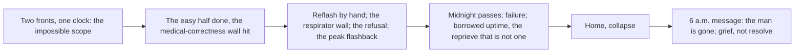

# Chapter 3: Borrowed Time

## Chapter Metadata

```yaml
chapter_number: 3
working_title: "Borrowed Time"
act: "Act One: Service Terminated"
story_date: "Friday night, October 3 into Saturday dawn, October 4, 2053"
story_date_iso: "2053-10-03/2053-10-04"
time_of_day: "late afternoon, through the night, to roughly 6 a.m."
primary_viewpoint: "Elias \"Eli\" Rook"
tense: "past"
person: "close third person"
primary_location: "The back-room server room of Lena's independent community clinic, Greater Detroit"
secondary_locations:
  - "the clinic's patient rooms and corridor, glimpsed as Eli moves between the devices and the rack"
  - "the Asterion datacenter, as intercut flashback memory (years past)"
  - "Eli's home and bedroom, the pre-dawn collapse and the 6 a.m. waking"
estimated_word_count: 6200
planned_scene_count: 6
chapter_status: "blueprint"
```

---

## Chapter Summary

Lena has gone to her patients and it is down to Eli, alone in the clinic's back room with a clock he cannot beat. Chapter 2 handed him the night; Chapter 3 lets it fail. He works two problems at once. He has to reflash the firmware on the clinic's abandoned medical devices so they stop demanding a signature from a company that will go silent at midnight, and at the same time he races to convert a dusty, underpowered back-room records server into a local emulation and stand-in authentication server, so the orphaned machines have something to resolve and authenticate against once their makers go dark. The dread is not the deadline itself but its uncertainty. No one knows what midnight does to each machine, whether it keeps running until something restarts it, quietly loses its diagnostics, or stops the instant the hour turns, and there is no time to find out, so he spends every second as though the worst is true.

The work itself is rendered in two deliberate, counterbalancing registers. In the solo passages the engineering is dense and authentic and meant to leave a non-technical reader out of their depth, because the point is that this is genuinely hard. Braided against that, a few brief beats let Eli translate for Lena, in plain words, when she steps to the back-room doorway between her rounds: what he is doing, and whether it is working, and the one thing she actually needs, which is whether the man will be safe. She is the reader's non-technical surrogate, and through her the basic stakes and the dread land for everyone while the mechanics stay opaque.

The chapter is built as a braid, and the braid is the length engine. Against the present work the chapter intercuts an escalating sequence of flashbacks to Eli's Asterion days, kept inside his own memory and therefore viewpoint-safe. In them he is the opposite of the man at the bench: calm, fluent, masterful, fixing the company's systems at lightning speed while a manager sweats and panics over his shoulder, not angry but frightened, talking about the one-point-three million dollars and the investor confidence that will evaporate if it is not fixed soon. Eli reassures him; it will be fine; and it is, effortlessly. Later the manager hangs up a call, says they are back up, claps Eli on the back, and tells him this is why he is Eli and everyone else is just another programmer. The inversion is the engine of the chapter. The past self saved a corporation money without breaking a sweat and was adored for it; the present self, the same genius, working by hand against a real clock, cannot keep one machine alive long enough to matter. As the present grows more hopeless the cuts grow sharper and the gap widens, until there is nowhere left for the memory to go.

He does not finish. Midnight passes and neither the emulation server nor the reflash is done in time, and he fails. Then the reprieve that is not one. After midnight the equipment still works, but only because nothing has restarted it. The machines are running on borrowed uptime now: one outage where the generators lag, one tripped cord, one reboot, and they stop for good. He has not saved them. He has deferred the moment they die and handed its timing to chance. He will not forge the respiratory controller's authorization, because a forged yes on that machine would strip the calibration and the safety record it gated and keep the man alive slowly, correctly, while killing him, and he will not do that. There is nothing more to do tonight. Spent, he goes home and collapses. At roughly 6 a.m. Lena's message wakes him: the power went out in the night, the generators were too slow. He does not need it spelled out. The man on the respirator is gone, the death off the page and inferred, never staged, and it is a death from the power failure, the systemic tier-drop and the withdrawn emergency restoration, not from anything he forged. What rises in him is grief, not resolve. No decision is announced. Nothing is named. The grief is the ignition.

---

## Narrative Purpose

### Primary Purpose

Turn the abstract midnight deadline into one man's frantic, hopeless, fully embodied labor, and convert that failure into the grief that ignites everything that follows. This is the emotional ignition of the move the next days will seal. It is not a decision Eli makes here. The chapter exists to make the reader feel, in the body and in the clock, the exact distance between a genius who was once adored for saving a corporation money and the same genius who, by hand, cannot save one life.

### Secondary Purposes

- Deliver the book's first sustained interior of Eli under maximum pressure, doing the actual work his whole identity is built on, and let the reader watch his competence run headlong into a wall competence cannot move. Chapter 1 saw him recognize the withdrawal; here he tries to fight it with his hands and loses.
- Run the deliberate, sanctioned exception to the project's clarity-over-density rule: get fully into the weeds of what Eli is doing, in real and credible engineering, so that a non-technical reader feels out of their depth (the point being that this is genuinely hard, not easy) while a technical reader finds it authentic and arrives, on their own, at the realization that there is no way he finishes in time. The density is the second length engine and a load-bearing instrument of dread, not decoration. (This intent is declared in full under Prose Guidance and protected under Information Deliberately Withheld; see the Deliberate Difficulty note.)
- Counterbalance that density with a layperson-translation layer: brief, in-character beats where Eli explains to Lena, in plain words, what he is doing and whether it is working, so the basic stakes and the dread land for every reader even while the mechanics stay opaque. Lena is the reader's non-technical surrogate and the one who pulls Eli off the bench and back to the body. The two layers run together; no one is left behind on the stakes and no one is handed the mechanics. (Declared in full in "The Translation Layer" section and in Prose Guidance.)
- Build and escalate the Asterion-datacenter flashback braid as the chapter's structural spine and its thematic engine: the golden boy who fixed the company's systems effortlessly and was worshipped for it, set against the present failure, the gap widening with every cut. Keep the flashbacks the shallow seed only: the corporate world, the adoration, the wound, felt and never explained.
- Establish the borrowed-uptime mechanism as canon-compatible fact: the midnight cutoff does not stop the machines outright; it strands them, alive only until the next restart, with their survival handed to chance.
- Pay off Chapter 1's and Chapter 2's dread on the page: that forging the authorization is the easy half and the medical correctness behind it cannot be hand-forged in time, and that one pair of hands cannot keep every orphaned device alive at the scale a city, or even a clinic, needs. Dramatize Eli's refusal to forge the respirator's yes as a moral boundary, not a technical failure.
- Land the off-page death as the ignition of the arc, grief rather than resolve, and hand the next morning forward to the days that seal the move, without naming Morrow, Northglass, or any decision.

### Why This Chapter Cannot Be Removed

Without this chapter the midnight deadline is set up in two chapters and then resolved in a line of summary; the reader is told the machines ran on borrowed uptime and a man died, but never made to feel the night that decided it. This is the only place the reader is inside the work itself, watching the protagonist's defining skill fail against time and scale, and the only place the Asterion inversion is dramatized rather than referenced: the worshipped golden boy and the failing man are the same person, and the chapter is the proof. Cut it and the death that ignites the entire book lands as report, not grief; Eli's later, world-altering decision to go back for what he buried has no felt floor under it; and the book's thesis, that the danger is not a machine turning against us but a machine faithfully waiting for a permission its owner has stopped granting, never gets its sharpest human demonstration. The grief that drives Act One forward is manufactured here or it is nowhere.

---

## Chapter Promise

A man who has spent his life being the one who can always fix it spends a single night discovering that his hands are not enough, and the reader is made to live every hour of it: the real, intricate, losing work against a clock, braided with memories of the effortless mastery that once made him a god to the people who paid him. The promise is dread earned through authenticity, the slow certainty that he will not finish, and a grief at the end that arrives without a single line of resolve. A technical repair becomes a moral limit and then a loss, and the loss does not announce what it will cost; it only opens the ground beneath him.

---

## Viewpoint Character

### External Goal

Keep the clinic's three abandoned machines alive past midnight, by whatever combination of reflashing their firmware and standing up a local stand-in for the withdrawn manufacturer services will work in the hours he has. Concretely: make the orphaned devices stop demanding a signature from a dead company and accept a local answer instead, the respiratory controller first, before the hour turns and the only patient who cannot hold a night without a machine is left on one no one is permitted to vouch for.

### Internal Pressure

Eli's entire sense of himself is built on being the one who can prevent the failure, quietly, with his hands, asking nothing. His private definition of human value is that a person is worth the failures they quietly prevent for others, and tonight is the night that definition is tested to destruction: he cannot prevent this one. Underneath the work runs the wound the flashbacks keep pressing, the memory of when the same skill was effortless and adored and saved nothing that mattered. He is afraid of his own competence, of where it once went, and tonight he is forced to want it to be enough and to watch it not be. There is also the buried thing he never names, the reason he withdrew into hand-repair and guilt in the first place, present only as pressure and refusal, never explained.

### Starting Emotional State

Locked in, focused, the calm of a man at a familiar bench with an unfamiliar deadline. Already triaging the work the way Lena triages bodies, already a little behind and not yet admitting it. Underneath the calm, the first cold awareness of the scale of what he has taken on.

### Ending Emotional State

Grief, plain and groundless, with no decision attached to it. Not resolve, not a plan, not the clean burn of purpose. The hollow, specific grief of a man who did everything his ability allowed and watched it come to nothing, who learns at 6 a.m. that the deferral failed and the chance came up the wrong way, and who has nowhere to put it. Spent past exhaustion into something quieter and worse.

### False Assumption

That this is, finally, a problem his hands can win, the way his hands have always won: that if he is fast enough and good enough and spends every second, competence will hold the line the way it always has. The chapter dismantles this. The work is within his ability and still impossible, because the wall is not skill but scale, time, and a medical correctness no forgery can reproduce. The golden boy could always fix it. The man at the bench cannot, and being the same man is the wound.

### Decision

The one true choice Eli makes tonight is a refusal, not an action: he will not forge the respiratory controller's authorization, because a forged yes there would keep the man breathing on stripped calibration and an absent safety record, killing him slowly and correctly while reporting that everything is fine, and Eli will not do that to a body he cannot vouch for. It is a moral boundary held under maximum temptation, and it cannot be unmade: by holding it he accepts that he has no fix that saves the man, only the chance that nothing restarts the machine before morning. He does not decide to act, to go anywhere, or to become anything. The chapter ends before any such decision exists. The only thing he commits to is the line he will not cross, and the grief that follows from holding it.

---

## Reader Information

### What the Viewpoint Character Knows

- The three clinic systems lose remote authentication at 23:59 tonight: the diagnostic scanner, the medication-management unit, and the respiratory-support controller. (Established Ch1, Ch2.)
- The respiratory controller is the one that matters: there is a man, sixty-one, who cannot hold a night without it. Eli does not know the man's name; Lena kept it back from him over the link and in person. To Eli he is the man on the respirator, the body the night is about.
- The technical truth he stated to Lena: he can make the machines stop waiting on the company by standing up something local that answers in the company's place, but forging the permission does not reproduce what the permission stood in front of, the calibration, the dosing envelope, the accumulated safety record. A machine on a forged yes runs and reports itself fine and means it, and may be confidently, lethally wrong.
- That it is hours of work per machine done right, and that he cannot do all three the way he would want any of them in the time he has.
- That the back-room records server is underpowered and on the neighborhood's low tier with no emergency restoration, so if the grid sags and the batteries take it, the room and whatever he has running go dark with the rest of the clinic.
- His own past: that he was, at Asterion, the one they called when the company's systems failed, and that he was very good and very calm and very well paid and adored for it. (He knows the whole of his history; the reader is shown only the shallow corporate seed of it.)

### What the Viewpoint Character Does Not Know

- What midnight actually does to each machine: whether it keeps running until restarted, loses only its diagnostics, or stops at once. No one knows, and the not-knowing is the dread. (Canon: act-1-timeline.md; cloud-dependency.md.)
- Whether the power will hold through the night. He knows the tier drop makes an outage un-prioritized and possible; he does not know one is coming before dawn.
- That the man on the respirator will die at roughly 6 a.m. when a pre-dawn outage restarts the borrowed-uptime machines and the generators lag. He learns the fact, off the page and inferred, only from Lena's morning message.
- The man's name, his history, his daughter behind the wall, his notebook, anything Lena and Chapter 2 know about Mr. Adeyemi. None of it is available to Eli and none of it may surface in his viewpoint.

### What the Reader Already Knows

From Chapters 1 and 2, the reader carries into this chapter and the chapter must stay consistent with:

- The three named systems and the 23:59 / midnight deadline, October 3, in the same calm corporate register as the other withdrawal notices.
- That the neighborhood was dropped to a lower power tier at midday, and outages will no longer be treated as emergencies. (The seed of the pre-dawn death.)
- That Eli could forge the authorization but not the medical correctness behind it, and not for every machine in time.
- That there is a man, sixty-one, on the respiratory controller who cannot hold a night without it, and that Lena chose to keep him on it with herself beside him, betting on Eli and on machines that may already be doomed.
- That Lena handed Eli the clinic's old back-room server, dusty and underpowered, and left him to it; the decisive work of the night is his, alone, in that room.

### New Information Revealed

- The actual texture and difficulty of the work, rendered in real engineering: what reflashing an abandoned medical device's firmware involves, what standing up a local emulation and authentication server in place of a withdrawn manufacturer actually requires, and precisely where the easy half ends and the impossible half begins. (See Technology and Worldbuilding per scene; the density is intentional, see Prose Guidance.)
- That the obstacle is not the liveness of the manufacturer's server but three things together: the labor per device, the scale (every device orphaned at once), and the un-forgeable medical correctness the authorization gated. (Canon: cloud-dependency.md; act-1-revision-morrow-origin.md section 1.)
- The borrowed-uptime mechanism: midnight does not stop the machines outright; it strands them, alive only until the next restart, their survival handed to chance.
- That Eli will not forge the respirator's yes, and why: a moral boundary, not a technical failure.
- The Asterion inversion: that Eli was, at Asterion, the calm and celebrated one, valued above all for protecting profit, and that the same ability cannot save one life by hand. Shallow corporate seed only, felt as wound and contrast, never named or explained.
- That the death is the cost of the borrowed-uptime gap and of the systemic power failure, and that what it leaves behind is grief, not a plan.

### Information Deliberately Withheld

- **Morrow, the buried drive, the six-years-ago secret, the resume-the-project move, Northglass, "Escaping," the first encounter.** Reason: these are the deep reveals reserved for the Northglass return, late, near the turn-on. The Chapter 3 flashbacks are the shallow seed (the golden boy, the corporate world) and must not touch the deep layer. Nothing in Eli's work or memory may hint that he ever built anything of his own, or that there is somewhere he could go for it. His withdrawal and guilt are present only as pressure and refusal. (Reveal-safety; act-1-revision-morrow-origin.md sections 3, 5, 10, and the two-flashback-layers rule.)
- **What midnight does to the machines, stated as fact.** Reason: the uncertainty is the dread. The chapter shows him spending every second as if the worst is true and then shows the borrowed-uptime reprieve; it never resolves the abstract question of what the cutoff "really" does, because no one in the book knows.
- **The man on the respirator's name, history, and interior, and his Chapter-2 secrets.** Reason: viewpoint discipline and reveal-safety. Eli does not know them; Mr. Adeyemi's reveal-tagged facts (the goodbye-letter notebook, that he is failing faster than he shows, that he already knew about the deadline) are gated and must not appear. To Eli he is the man on the respirator, an abstraction he is failing.
- **The death, staged.** Reason: it happens off the page, between scenes, and is inferred from Lena's morning message. It must never be dramatized, narrated, or witnessed. The grief lands; the death is never shown.
- **Any decision, resolve, or plan at the end.** Reason: canon is explicit that the ignition is grief, not a decision (act-1-timeline.md; act-1-revision-morrow-origin.md Q4). There is no "and so he decided." The chapter ends on grief with nothing named.
- **DELIBERATE DIFFICULTY (the technical opacity is intended; a working seed, not a bug).** Reason and instruction for the clarity audit and any reviewer: unlike every other chapter, Chapter 3 is meant to be technically dense to the point that a non-technical reader feels out of their depth. That opacity is the device, not a defect. It conveys that the work is genuinely hard, that this is real and there is no way he finishes. The clarity audit must NOT flatten, simplify, or gloss the engineering toward lay-readability. The only things that must land for every reader are the basic STAKES (a man's life hangs on whether these machines keep working) and the DREAD (he is not going to make it). The technical specifics are meant to remain opaque to laypeople and authentic to technical readers; both responses are correct and intended. This exception is sanctioned by the Style Guide's "follow your heart for something special." Do not treat reader confusion about the mechanics as a clarity failure; treat confusion about the stakes or the dread as the only real failure. The chapter deliberately runs TWO layers in counterbalance: (1) the dense, authentic, out-of-depth technical passages (Eli alone, plus narration) for immersion and the technical reader's "this will not finish in time" read; and (2) the Eli-to-Lena translation beats, where a real engineer explains to a non-technical doctor, in plain words, what he is doing and whether it is working. The clarity audit must expect the basic stakes and the dread (the "drift" of where this is going) to land for every reader through the Lena translation beats, while the technical specifics stay deliberately opaque in the solo passages. Lena is the reader's surrogate; no one is left behind on the stakes, and no one is handed the mechanics. See "The Translation Layer" section below for how the beats are distributed.

---

## Focus

> Note on this section: the Chapter 1 and Chapter 2 blueprints predate the
> template's Focus section and omit it. It is included here because the template
> declares it and the blueprint craft requires it; it adds the per-chapter
> reader-knowledge slice without altering the rest of the structure the prior
> blueprints model. Entity pointers are written as plain document-relative paths
> (not Markdown links) so a not-yet-created bible path can be named without
> breaking link validation; existing files are also linked in Canon Checks.

### Levels

blur (a function or role, glimpsed) · sketch (a few defining strokes) · sharp
(clearly drawn, voice and body and want legible) · crisp (fully present and
dimensional, known from the inside). The level is a coarse ambition, never a
score, and revelation is delivered image over inventory; names of attributes,
never their values, which live only in the bible files.

### Focus Targets

#### Character - Elias "Eli" Rook

- **Bible pointer:** `../../../20-canon/characters/profiles/rook-eli.md`
- **Level:** crisp
- **Revelation target:**
  - **Physical:** the working body under strain, named not valued, pull the concrete attributes from the bible: the scarred and burned hands, the deadened left fingertip and how he favors it over fine work, the forward-bent posture at the rack, the unhurried economy of motion that is his signature and that frays as the hours and the failure accumulate, the beard going uneven under the crisis as canon says it does. The hands are the chapter; they are also his father's hands.
  - **Emotional:** the widening interior gap between the adored, effortless past self and the failing present self; the cold focus giving way, hour by hour, to something closer to dread and then to the groundless grief of the ending. Let the reader feel the inversion as a wound he carries, not a thing he explains.
  - **Interior:** his definition of human value (a person is worth the failures they quietly prevent for others) tested to destruction tonight; his moral boundary (he will not forge the respirator's yes and slow-kill a man); his preference for guilt over the risk of another decision, present as the very thing the night is about to break open. The deep secret stays sealed; render only its pressure.
- **Voice and heritage pointer:** pull Eli's "Voice and Speech" and his heritage and movement signals from the profile: the low, dry voice with the flat Michigan working vowel; complete but economical sentences that go shorter and more literal when he is emotional; the dry, exact, understated humor (his father's flat register on the exit); the habit of saying a thing back to himself to fix it in place. Write him specifically as Flint working-class, never as a generic engineer.

#### Item / Object - The clinic's records server (the closet machine he converts)

- **Bible pointer:** `../../../20-canon/world/locations/greater-detroit/elis-neighborhood/lena-clinic/server-room/clinic-records-server.md`
- **Level:** sharp
- **Revelation target:**
  - **Appearance:** the squat box and its single amber light, named from the bible; deepen it under load tonight, what it sounds and feels like to push an underpowered records machine toward work it was never built for, the heat and the strain and the careful budget of what he can draw before the rack gives.
  - **Significance:** the local thing that must stand in for a withdrawn company, the seat of the night's decisive work and of the borrowed-uptime fix; its underpowered limit is one face of the wall. From it he means to forge the permission but not what the permission stood in front of.
  - **Provenance:** hold at the level Chapter 2 already set (it came with the building, down the tenant chain); do not re-reveal, let it ride as known.

#### Item / Object - The respiratory-support controller

- **Bible pointer:** `../../../20-canon/world/locations/greater-detroit/elis-neighborhood/lena-clinic/patient-room-3/respiratory-controller.md`
- **Level:** sharp
- **Revelation target:**
  - **Appearance:** seen now through Eli's hands and instruments rather than Lena's palm, what the device exposes to a technician, its ports and its phone-home cycle and the firmware it runs on; the taped index card over the dead status light is Lena's, and from Eli's side it reads as the human stand-in he is trying to make permanent in silicon. Pull concrete attributes from the bible, not values invented here.
  - **Significance:** the machine the whole crisis narrows to and the one he will not forge; the borrowed-uptime victim; the place where a forged yes becomes a slow, correct killing. This is the chapter's moral fulcrum.
  - **Provenance:** the withdrawn manufacturer and the cyclic remote authorization, as established; no new provenance revealed.

#### Location - The clinic back-room server room

- **Bible pointer:** `../../../20-canon/world/locations/greater-detroit/elis-neighborhood/lena-clinic/server-room.md`
- **Level:** sharp
- **Revelation target:**
  - **Physical-spatial:** the small room from the inside now, the steel rack under the painted-shut window, the swelled door, the single work light, the stool; the geography of one man's working night in a closet three feet from a corridor where a doctor can do nothing.
  - **Atmosphere:** the stale cold air of a year unopened, dust and old electronics and the faint sweet mouse-smell; the work light throwing his bent shadow long across the painted-shut window; the room deepening into the small hours, the cold, the narrowing world of the task. The opposite, in every sensory register, of the datacenter in the flashbacks.
  - **Significance:** the seat of the failure and the borrowed-uptime fix; the room Lena handed him and will not re-enter; the place the book's ignition is assembled in and does not arrive.

#### Location - The Asterion datacenter (intercut flashback memory)

- **Bible pointer:** `docs/20-canon/world/locations/asterion-datacenter.md` (intended path; NO FILE YET, flagged below for the orchestrator; written as plain text, not a link, so validation does not resolve it)
- **Level:** sketch
- **Revelation target:**
  - **Physical-spatial:** the ordered, abundant machine floor of the company at its height, racks and cool light and power without question, sketched as the inverse of the cold dead closet; enough to place the memory, no more.
  - **Atmosphere:** the calm and the ease and the adoration; the manager sweating at his shoulder; the warmth of being the one who can always fix it. The emotional opposite of the present room.
  - **Significance:** the inversion engine. Where saving the company millions was effortless and Eli was worshipped for it, set against a present where the same hands cannot save one life. Shallow corporate seed only; never explain what he built, never name Morrow, keep the past a wound and a contrast.

#### Character - The man on the respirator (Mr. Adeyemi, from Eli's distance)

- **Bible pointer:** `../../../20-canon/characters/profiles/adeyemi-bayo.md`
- **Level:** blur
- **Revelation target:**
  - **Physical:** essentially none on the page; Eli does not see him in the back room. He exists for Eli as a fact down the corridor: a sixty-one-year-old man whose chest will not hold a night.
  - **Emotional:** the abstract weight of the one body the work is for, and at 6 a.m. the absence where the body was.
  - **Interior:** withheld entirely; Eli has no access to it. Reveal-safety: do not name him, do not surface any of his Chapter-2 [reveal: Book 1] facts (the notebook, the faster decline, that he already knew). He is the stake, kept a blur on purpose, so the loss lands as a fact and a grief, not a portrait.

### Usage Note

Only entities deliberately sharpened are listed. The diagnostic scanner and the
medication-management unit appear and are worked on, but the chapter does not
bring them into focus beyond their function; they stay below a focus entry. The
flashback manager is a sketch in the prose but has no bible file and is flagged
below rather than given a Focus block with a broken pointer. Every value behind
every named attribute lives in the bible files, not here.

---

## Opening

### Opening Image

The hand's-width of corridor light narrowing to nothing as the swelled door settles back into its frame behind Lena, and then the back room as Eli has it now: the single work light on its hook, the squat records server with its one amber eye on the steel rack, the painted-shut window, the cold stale air of a year unopened, and his own scarred hands already opening the canvas bag, already reaching, the deadened left fingertip the first thing to touch cold metal. The clinic's small night sounds shut outside the door. It is just him and the closet and the clock.

### Opening Situation

Eli is alone in the back room, the handoff Chapter 2 showed now complete and behind him, the door shut to a hand's width and then to nothing. He has researched for two hours at the shop and arrived around three; the work window runs to midnight; he is starting the real labor with the deadline already counting. He does not begin with reflection. He begins with triage, the same as Lena: two fronts, one clock, and the cold arithmetic of which to spend the next hour on.

### Immediate Question

Can one man, by hand, in the hours he has, make abandoned machines accept a closet's word in place of a dead company's, and keep the man on the respirator breathing past a minute no one can explain? And under it, the harder question the flashbacks keep asking: if this skill was once enough to make him a god to the people who paid him, why is it not enough now, when it is finally the only thing that matters?

---

## Braided Structure: The Asterion Flashbacks

The chapter is a braid of present-time work and intercut Asterion-datacenter
memory. The braid is deliberate and is one of the two length engines (the other
is the technical density). It must be managed as a rising structure, not a set
of interchangeable inserts.

- **POV-safe.** The flashbacks are Eli's own memory, rendered as lived memory,
  so they never break the single close-third viewpoint. No head-hop, no omniscient
  narration of the past, only what Eli remembers and how he remembers it.
- **The shallow seed only.** Reveal-safety is absolute. These flashbacks are the
  golden-boy / corporate-world layer. They may show Eli's mastery, the manager's
  panic and adoration, the money, the ease. They must NOT reveal or hint at
  Morrow, the buried drive, the six-years-ago first encounter, "Escaping,"
  Northglass, or that Eli ever built anything of his own. The deep layer is
  reserved for the Northglass return. Keep what he built at Asterion unnamed and
  unexplained; the point is the adoration and the ease, not the technology. Do
  not lecture Mosaic; do not name Morrow; do not name Crown unless a drafting
  pass finds it unavoidable, and prefer leaving the system unnamed (the past is
  felt as a wound and a contrast, never explained).
- **Escalation map (the gap widening).** The cuts intensify as the present grows
  more hopeless:
  1. First cut (Scene 1, early, lightest): the calm datacenter, Eli fluent and
     unhurried, the manager just beginning to sweat at his shoulder. Establishes
     the inverse register: he was calm there too, but there it was easy.
  2. Second cut (Scene 2, the emulation wall): the manager in full panic, the
     one-point-three million dollars and the investor confidence that will
     evaporate, "how long, just tell me how long"; Eli reassuring him, it will
     be fine, and it is, effortlessly. Cut against the present moment where the
     same reassurance is the one thing he cannot honestly give.
  3. Third cut (Scene 3, the reflash and the respirator wall, the peak): the
     manager hangs up the call, "we're back up, we're fine," claps Eli on the
     back, "this is why you're Eli, and everyone else is just another
     programmer." The adoration at its height, cut against the present failure at
     its deepest. The exact wording is to be sharpened in drafting; the beat is
     locked.
  4. After midnight (Scene 4): the memory has nowhere left to go. Either a final
     short, flat echo of the praise turned hollow, or its pointed absence; the
     inversion is total and the braid closes. Do not add a new flashback after
     the failure lands; let the gap stand.
- **Function, not nostalgia.** Each flashback must earn its cut by sharpening the
  present: the contrast of ease against impossibility, adoration against
  uselessness, money saved against a life not saved. Never let a flashback become
  a fond detour; it is a blade laid against the present scene.

---

## The Translation Layer: Eli and Lena (the layperson counterbalance)

Alongside the dense, deliberately opaque technical passages, the chapter runs a
second, balancing layer: brief beats in which Eli explains to Lena, simply and in
plain words, what he is actually doing and whether it is working. This is the
layperson-translation device, and it is in character: a real engineer translates
for a doctor, and Lena is exactly the person who pulls Eli "off the bench, back to
the body." She is the reader's non-technical surrogate. The two layers work in
counterbalance: the solo passages immerse and leave laypeople out of their depth
on the mechanics (intended), while the Lena beats hand every reader the
plain-language version and the basic stakes (so no one is lost on what is at stake
or where it is going).

- **What the translation beats deliver.** Not the mechanics, the meaning: "I can
  make the machine stop waiting on the company, but I cannot promise it is telling
  you the truth"; "the easy part is done; the part that keeps the man safe is the
  part I cannot fake"; "it will run, I cannot make it right." The plain version of
  the dense work that is opaque to Lena. Each beat translates the surrounding
  technical stretch into stakes Lena, and the reader, can act on.
- **In character, both sides.** Lena asks the one consequence question and refuses
  the comfort ("yes, or the truth, not the comfort"); Eli answers honestly,
  economically, choosing the plain word the way he chooses a connector. The beats
  are short, reluctant, and driven by her need to triage around his fix, not by a
  desire to chat. They also pace the chapter, breaking up the solo work.
- **Distribution (a few beats, not many).** The handoff translation is already
  canon (Chapter 2 Scene 2: "I can forge the permission. I can't forge what the
  permission was standing in front of... It'll be me, and a closet"); Chapter 3
  opens carrying it. Then: one brief doorway check-in mid-evening (Scene 2, the
  emulation status, "is it working?" and the plain answer) and one harder check-in
  later in the evening (Scene 3, "the man, tonight, yes or the truth" and the plain
  refusal). These sit inside the window of Lena's Chapter 2 rounds.
- **CANON BOUNDARY (must not contradict approved Chapter 2).** Chapter 2's
  late-night beat (her Scene 4, roughly 22:30) is explicit and approved: Lena
  glimpses Eli through the hand's-width door, does NOT speak, does NOT enter, and
  "Eli's bent shape did not turn. He had not heard her." Chapter 3 must honor this
  exactly. So the spoken translation check-ins happen EARLIER in the evening, during
  her rounds; the late and midnight portions stay solitary; and Chapter 3 may render
  the silent late glimpse from Eli's side, with him not turning, to tie the two
  chapters tightly. Keep the check-ins few and brief so they do not undercut
  Chapter 2's established dynamic of Lena deliberately leaving him alone with the
  work. This boundary is flagged in "Conflicts and Items Flagged" for an author
  ruling, since it lightly extends what Chapter 2's selective POV showed.
- **Viewpoint.** The chapter stays close third on Eli throughout. Lena in these
  beats is seen and heard only as Eli perceives her, at the doorway; her interior
  is never rendered. This is not a head-hop and not a POV-relay breach; it is Eli's
  chapter, with Lena appearing in it.

---

# Scene Breakdown

---

## Scene 1: Two Fronts, One Clock

### Scene Metadata

```yaml
date: "Friday, October 3, 2053"
date_iso: "2053-10-03"
start_time: "late afternoon, around 15:45 (the door just shut behind Lena)"
start_iso: "2053-10-03T15:45"
duration: "approximately 45 minutes"
viewpoint: "Eli"
location: "The clinic back-room server room; brief steps to the device rooms to scope the machines"
characters_present:
  - "Eli (alone; Lena and staff heard, not present)"
```

### Scene Purpose

Open the chapter inside Eli's work and establish the two-front problem concretely: reflash the device firmware AND convert the underpowered records server into a local emulation and stand-in authentication server. Set the real engineering register the chapter will sustain, establish the clock and the scale honestly, and lay the first, lightest flashback cut to seed the inversion. No other scene establishes the shape of the impossible task or starts the braid.

### Viewpoint Goal

Get a true picture of the job and choose where to spend the first hours: scope the three machines, identify what each demands and what the records box can actually become, and order the work with the respirator first. He wants, the way Lena wanted an honest inventory, to know exactly how far behind he already is.

### Opposition

The scale and the clock. Every honest measurement makes the job bigger: three machines, hours each done right, one underpowered box, one set of hands, and a deadline counting down. Missing information opposes him (no one knows what midnight does, so he must plan for the worst on every front). His own competence opposes him, the reflex that says he can always fix it, which keeps him from admitting how thin the time is.

### Stakes

If he scopes it wrong or orders it wrong, he spends irreplaceable early hours on the wrong front and reaches midnight with nothing finished and the respirator unserved. The stake, named precisely once and then carried, is the man down the corridor who cannot hold the night without the controller.

### Entry Condition

Lena has handed him the room and gone to her rounds (Chapter 2's close). The bag is unopened; the records server runs its single amber light at the records task and nothing harder; the work light is on its hook; the clinic runs on daylight and battery on the low tier. The deadline is roughly eight hours out.

### Major Beats

1. The door settles shut; Eli takes the room in the way he takes a building in, listening to the rack before he touches it, reading the amber light, the power he has, what the box will hold.
2. He scopes the three machines, briefly and physically: what each one phones home for and how (the scanner's startup license check, the cabinet's authorization, the controller's cyclic confirmation), and what reflashing versus emulating would cost on each. The real engineering starts here, stated as a working man states it to himself.
3. He frames the two fronts and the bet between them: stand up one local server that several devices can resolve and authenticate against (efficient if it works, but it must convince each device, and the medical correctness it cannot reproduce), versus reflashing each device's firmware one at a time to stop demanding the signature at all (surer per device, but hours each, and it is never one device).
4. **First flashback cut (lightest).** The calm datacenter; Eli fluent and unhurried at a far worse-looking problem, the manager just starting to sweat at his shoulder. The register of ease. Return on the same gesture into the cold closet.
5. He makes the order: the records box toward emulation while he has fresh hours and the grid is steady, the respirator firmware as the thing he will not leave unfinished, the scanner he can lose, the cabinet he will reach if he can. He opens the bag.

### Scene Turn

The turn is the scope resolving into something he can measure and therefore fear. Scoping it does not shrink it; it confirms the job is bigger than the clock, that "hours a machine done right" times three against eight hours and one box does not close, and that he is going to have to choose what not to save. He starts anyway.

### Exit Condition

Eli has a true, frightening map of the night and a chosen order of work; the bag is open, the first cable run, the records box claimed for the emulation attempt. The flashback has been seeded. He is committed and already behind.

### Emotional Movement

**Beginning:** locked-in calm, the familiar bench-quiet.
**End:** the same calm narrowed by the first real measure of the scale, the cold awareness that competence may not be the variable that decides this.

### Relationship Movement

**Characters:** Eli and the work itself (and, through it, the unseen man on the respirator)
**Before:** the job is a task he has been handed and intends to win.
**After:** the job is a thing he can already feel he may lose, attached now to one body he has put first and cannot picture.

### Information Revealed

- To the reader: the two-front problem in real terms; the genuine difficulty and scale; the clock; the order of work.
- To the reader: the first, lightest note of the Asterion inversion (ease, calm, a sweating manager), seeded for escalation.
- To Eli: the honest measure of how far behind he is.
- No lie introduced; the central uncertainty (what midnight does) is restated as unanswerable and planned-around.

### Technology and Worldbuilding

- **The two-front fix, scoped.** What it is: (a) a local emulation / stand-in authentication server, redirecting each device's phone-home to a local box that answers in the withdrawn manufacturer's place, which requires capturing and reverse-engineering each device's calls, generating local certificates and a local CA the device will trust, and answering the device's challenge in a way it accepts; and (b) firmware reflashing, modifying each device's firmware so it stops demanding the remote signature at all. Controller: Eli. Power: the records box on the low tier, underpowered. Limit: hours per device; one box; the un-forgeable medical correctness; the device's trust anchored in the manufacturer's key. What fails: any of these, slowly, against the clock. (Canon: cloud-dependency.md "Why Just Emulate It Is Not the Whole Job"; act-1-revision section 1.)
- **The records server.** What it does today: holds records, nothing harder, on one amber light. What he needs it to become: the local thing the orphaned devices resolve and authenticate against. Limit: "a light and a board and not much," on the low tier, no emergency restore.

### Sensory Anchor

- Visual: the single amber light; the work light's cone; his scarred hands and the deadened fingertip first onto cold metal; the painted-shut window.
- Sound: the rack's small electrical note; the clinic's muffled life beyond the door; the click of the bag opening.
- Smell/texture: stale cold air, dust, old electronics, the faint sweet mouse-smell; the chill of the metal; the budgeted warmth of the room.

### Dialogue Objective

Largely solitary. Eli speaks mostly to himself and to the machines, in the dry habit of saying a thing back to fix it in place. The flashback manager's lines belong to memory, not the present room.

| Character | Wants | Hides or avoids |
| --------- | ----- | --------------- |
| Eli | To know the true shape of the job and order it | From himself, how thin the time already is |
| The manager (flashback only) | To be told it will be fixed | His panic; that he does not understand what Eli does |

### Subtext

The scene is about the difference between a problem you can win by being good and a problem that is bigger than any one person can be good enough to win. Eli's whole identity says the first; the night is the second; the scoping is where he first feels which one this is, and starts anyway because starting is what he is.

### Continuity Changes

- Location established (from inside): the back-room server room as Eli's working space for the night.
- Knowledge confirmed (Eli): the true scale and order of the work; the impossibility honestly measured.
- System state: the records box claimed and begun toward local-emulation repurposing (the conversion's beginning; it completes nowhere tonight).
- Resource committed: Eli's tools, cable, and the first hours.

### Scene Ending

End on Eli crouched at the rack the way he crouches at everything, the bag open, the first connection made, the amber light beside his hand, the clock in the corner of his mind already running, and the cold understanding settling that he is going to have to be faster than he has ever been and that it still may not be enough.

---

## Scene 2: The Easy Half and the Wall

### Scene Metadata

```yaml
date: "Friday, October 3, 2053"
date_iso: "2053-10-03"
start_time: "late afternoon into evening, around 16:30"
start_iso: "2053-10-03T16:30"
duration: "approximately two and a half hours"
viewpoint: "Eli"
location: "The clinic back-room server room; one or two trips to a device to capture its traffic"
characters_present:
  - "Eli"
  - "Lena (briefly, at the back-room doorway, mid-rounds; seen only as Eli perceives her)"
```

### Scene Purpose

Drive deep into the emulation-server work and bring Eli hard against the wall the whole book has promised: forging "authorized = yes" is the easy part; reproducing the medical correctness the authorization gated is the part that cannot be hand-forged in time. This is the chapter's densest technical stretch and its first real defeat, braided with the second, escalated flashback (the panic, the money). It also carries the chapter's first present-time translation beat: Lena steps to the doorway mid-rounds, asks whether it is working, and Eli hands her, and the reader, the plain-language version of the wall he has just hit. No other scene lands the easy-half / impossible-half distinction in the body of the work or first translates it for the layperson.

### Viewpoint Goal

Make the records box answer for the withdrawn manufacturer well enough that a device accepts it: capture the device's calls, stand up endpoints that answer them, generate the certificates and the local trust the device demands, and clear its challenge, so the machine stops asking the sky and starts asking the closet, and runs.

### Opposition

The engineering itself, honestly rendered. The device's trust is anchored in the manufacturer's key; certificate pinning means it will not believe a local server it has no reason to trust; the challenge-response wants a signature only the manufacturer's private key can produce, which a local box cannot generate, which forces him back toward patching firmware to accept a local key instead, looping the two fronts together. And beneath the solvable parts, the unsolvable one: the authorization gated calibration, dosing envelope, and safety record he cannot reconstruct. Time opposes him; the hours bleed.

### Stakes

If he sinks the evening into the emulation path and the medical-correctness wall makes it worthless for the machine that matters, he has spent his freshest hours on a server that can keep a doorbell honest and not a man. The stake remains the respirator and the closing clock.

### Entry Condition

The records box is claimed and the first scaffolding is up. The grid is steady, the batteries hold, the clinic runs around him. The deadline is roughly seven hours out and falling.

### Major Beats

1. The capture and the build: Eli intercepts a device's phone-home, reads the shape of what it asks the manufacturer, and stands up local endpoints that answer. The forged yes comes within reach, and for a moment it looks like it will be enough.
2. The trust problem: certificate pinning and the manufacturer-anchored chain. He generates a local CA and the certs, and confronts that the device has no reason to trust them, which means touching the firmware after all. The two fronts braid; the clean separation he hoped for collapses.
3. **Second flashback cut (escalated).** The manager in full panic now, the one-point-three million dollars, the investor confidence evaporating, "how long, just tell me how long." Eli reassuring him, calm, it will be fine, and it is, effortlessly, the fix landing under his hands like a solved chord. Return to the present, where the same reassurance is the one thing he cannot honestly give.
4. The wall: he gets a device to accept the local answer and runs straight into the thing he told Lena. The yes is forgeable; what the yes stood in front of is not. The calibration, the dosing envelope, the safety record are not in the protocol; they were the company's accumulated say-so, and no closet can reproduce them in an evening. For a doorbell it does not matter. For the cabinet and the controller it is the whole matter.
5. **Translation beat (Lena at the doorway).** Lena steps in mid-rounds, not to watch but to triage, and asks the only thing that is hers to ask: is it working. Eli, who has just hit the wall, gives her the plain version, the layperson translation of the dense stretch the reader has been living through, "the easy part is done, the machine will run; the part that keeps the man safe is the part I cannot fake." Short, honest, no comfort. She takes the plain stakes back to her patients and goes. The beat hands the reader the meaning while the mechanics stay opaque, breaks the solo work, and stays inside Chapter 2's rounds window. (Honor the canon boundary: this is an earlier, spoken doorway beat, not the approved silent late glimpse.)
6. He sits with the defeat for one beat, the way he does not let himself sit, and then makes the only move left: pull off the pure-emulation hope for the life-critical machines and go to firmware reflashing on the respirator directly, because if he cannot make a trustworthy server he will at least try to make the device need no server. He has burned hours to learn what he already knew.

### Scene Turn

The turn is the wall arriving in his own hands, not as a thing he said to Lena but as a thing the work proves: the easy half done, the impossible half exactly as impossible as he warned. The emulation server is not going to save the man. The realization redirects the night and starts the true countdown to failure.

### Exit Condition

Eli has a partial local server that can make non-critical devices accept a local yes and cannot give the life-critical machines what they actually need; he abandons the emulation hope for the controller and turns to reflashing it directly, hours gone, the clock meaner. The braid has escalated.

### Emotional Movement

**Beginning:** absorbed, fast, briefly hopeful as the forged yes comes near.
**End:** the first taste of real defeat, controlled, redirected into the next attempt; the gap between this bench and the remembered one beginning to ache.

### Relationship Movement

**Characters:** Eli and his own competence
**Before:** competence as the reliable instrument that has never failed him at a bench.
**After:** competence intact and insufficient; the instrument works and the wall does not care, which is a new and specific loneliness.

### Information Revealed

- To the reader: the real mechanics of standing up a local stand-in (capture, endpoints, local CA and certificates, cert pinning, the manufacturer-anchored challenge), and exactly where the solvable becomes unsolvable.
- To the reader: the easy-half / impossible-half distinction proven in the work, not just stated; the un-forgeable medical correctness as the wall.
- To the reader: the second, escalated flashback (panic, the money, effortless success), deepening the inversion.
- To Lena and the reader (translation beat): the plain-language status, the easy part done and the part that keeps the man safe un-fakeable; the basic stakes land for the layperson while the mechanics stay opaque.
- To Eli: confirmation, in his hands, that the emulation path cannot save the life-critical machines in time.

### Technology and Worldbuilding

- **Local emulation / stand-in authentication, in depth.** What it requires: traffic capture and protocol reverse-engineering; local endpoints that answer the device's calls; a local certificate authority and certificates; defeating or satisfying certificate pinning; answering a challenge whose valid signature needs the manufacturer's private key. What it cannot do: reproduce the calibration, dosing envelope, and safety record the authorization gated. Controller: Eli. Limit: the device's trust is anchored upstream; the medical correctness is not in the protocol. (Canon: cloud-dependency.md; act-1-revision section 1. Keep it real; no magic, no instant crack.)
- **Why the forged yes is not a fix for life-critical machines.** A doorbell on a forged yes rings at the wrong time. A dosing cabinet or a respiratory controller on a forged yes runs and reports itself fine while being unvouched-for and possibly, lethally, wrong. (Canon-gold line, cloud-dependency.md; do not soften.)

### Sensory Anchor

- Visual: scrolling captures and the device's panel; the local light against the cold window; his hands moving fast, the deadened fingertip slowing the finest steps.
- Sound: the rack's note rising under load; a fan he did not want to hear spin up; the small clinic sounds beyond the door.
- Smell/texture: warming electronics, solder-ghost and machine oil on his own hands, the cold that does not leave the room.

### Dialogue Objective

The present is near-solitary except for the brief Lena doorway beat; the rest of the spoken weight is in the flashback. Eli mutters the work to himself; the manager's panic and Eli's reassurance carry the flashback; the Lena beat carries the plain-language translation.

| Character | Wants | Hides or avoids |
| --------- | ----- | --------------- |
| Eli (present, to himself) | To make a device accept the closet's word | That he already knows the wall is coming |
| Eli (to Lena) | To give her the true, plain status she can triage around | Nothing; honesty is the point, but he keeps the mechanics off her plate |
| Lena (at the doorway) | The one consequence answer, is it working, yes or the truth | Her fear; how much she is leaning on him |
| Eli (flashback) | To reassure the manager and solve it | Nothing; there it costs him nothing |
| The manager (flashback) | A number, a guarantee, the money saved | His terror; his dependence on a man he does not understand |

### Subtext

The scene is about the difference between being trusted and being trustworthy. He can forge the trust; he cannot forge the trustworthiness, and on a body that distinction is the difference between a repair and a slow killing. The flashback's effortless save sharpens it: there, trust and trustworthiness were the company's to assert and his to deliver, and it was easy, and nothing was at stake but money.

### Continuity Changes

- System state: a partial local server stood up; non-critical devices could accept a local yes; the life-critical machines cannot be served this way in time.
- Knowledge confirmed (Eli): the emulation path will not save the respirator; redirect to firmware reflashing.
- Resource spent: several of the freshest hours.

### Scene Ending

End on Eli pulling his hands back from the half-built server, the forged yes glowing uselessly for the machines that matter, and turning to the respiratory controller's firmware with the clock past seven hours gone and the memory of an effortless save still ringing, the two benches a single cruel chord.

---

## Scene 3: By Hand

### Scene Metadata

```yaml
date: "Friday, October 3, 2053"
date_iso: "2053-10-03"
start_time: "evening into late night, around 19:00"
start_iso: "2053-10-03T19:00"
duration: "approximately four hours"
viewpoint: "Eli"
location: "The clinic back-room server room and patient-room-3 with the controller; Eli moving between"
characters_present:
  - "Eli (mostly alone with the devices; the man on the respirator not seen, kept down the corridor)"
  - "Lena (one brief, harder doorway check-in earlier in the scene; and, late, the silent glimpse from Chapter 2, to which Eli does not turn)"
```

### Scene Purpose

The chapter's longest, deepest stretch: the firmware reflash by hand, per device, against the bleeding clock, ending at the respirator wall and the moral refusal. This is where competence and time and scale finally close around him, where the flashback peaks at the height of his old adoration, and where the inversion lands fully. It also carries the chapter's hardest translation beat (Lena's last spoken check-in, the man, tonight, yes or the truth) and ties to Chapter 2's approved silent late glimpse. No other scene carries the reflash labor, the refusal to forge the respirator's yes, or the braid's climax.

### Viewpoint Goal

Reflash the respiratory controller's firmware so it stops demanding the remote signature and runs without the dead company, correctly enough to keep the man through the night; and, if any hours remain, do the same or stand up the local answer for the scanner and the cabinet. Above all, finish the controller before midnight.

### Opposition

The firmware itself and the clock. Encrypted or signed firmware; secure boot that rejects an unsigned image; the need to dump the existing image, find and defeat the remote-check, patch it, re-sign or bypass the signature, and write it back over JTAG or a serial or DFU path without bricking the one machine a man's night depends on; verification; the real risk that a failed write leaves the controller worse than abandoned. And the wall behind all of it: even a clean reflash that makes the device run does not restore the calibration and safety record, so a respirator reflashed to run on its own is a respirator he cannot vouch for, which is the thing he will not do. Scale opposes him: hours into one device and two more behind it and the hour turning.

### Stakes

This is the scene where the stakes are no longer abstract. If the reflash fails or bricks the controller, the man has no machine at all tonight. If it succeeds technically, Eli faces a respirator running on a yes he forged, stripped of the record that makes its pressures safe, which could keep the man alive while killing him slowly and correctly. Either way the man's night is on the table, and Eli's own moral boundary with it.

### Entry Condition

The emulation path is abandoned for the life-critical machines. It is evening going to night; the clinic has dropped to electric light here and there; the deadline is roughly five hours out and falling toward zero across the scene. Eli is at the controller's firmware.

### Major Beats

1. The reflash, in real and intricate steps, rendered dense and authentic: dumping the image, finding the remote-check, the signing and secure-boot obstacle, patching, the write path, the verification, the bricking risk on the one machine that cannot be risked. Time visibly bleeding; small wins, real setbacks.
2. **Translation beat (Lena's last spoken check-in, harder).** Lena comes to the doorway one more time as her rounds end, and asks the consequence question in its starkest form, the man, tonight, yes or the truth, the echo of Chapter 2's "yes or the truth, not the comfort." Eli gives her the plain refusal: he can make the machine run, he cannot make it true, and the one honest path would be worse than no path. She hears the layperson version of the wall and the boundary; she takes it to her bedside choice and goes. This is the last time they speak tonight; the basic stakes are now fully in the reader's hands. (Honor the canon boundary: spoken, earlier; the later glimpse is silent.)
3. A partial result on a lesser machine if it serves the dread (e.g., the scanner brought to where it would at least not block, or a path half-walked and abandoned for time), to show that even his successes are too slow and too few. One device done is not three; the scale is the point.
4. **Third flashback cut (the peak).** The manager hangs up the call: "we're back up, we're fine." He claps Eli on the back. "This is why you're Eli, and everyone else is just another programmer." The adoration at full height. Return to the present on the same shoulder, no hand on it now, the controller unsolved under his fingers.
5. The respirator wall and the refusal: he reaches the point where the controller could be made to run on a forged yes, and stops, because running it stripped of its calibration and safety record would keep the man breathing on numbers nothing is left to check, slowly and correctly killing him while reporting fine. He will not do it. The moral boundary holds against the full temptation of the clock.
6. **The silent late glimpse (Chapter 2 tie, roughly 22:30).** At one point a slice of corridor light shifts at the hand's-width door and a shape stands there a moment and does not speak. Eli does not turn; he has not heard her, or has heard her and known there is nothing to say. This is the exact moment Chapter 2 renders from Lena's side; here it is rendered from Eli's, and it must stay silent and non-entering to match approved canon.
7. The clock runs out under his hands. Not a dramatic alarm; the quiet arithmetic completes: he is not going to finish the controller correctly, he will not finish it incorrectly on purpose, and there are not enough hours or enough of him for all three. The inversion lands without being stated: the man who was worshipped for the effortless save cannot, by hand, save the one life in front of him.

### Scene Turn

The turn is the refusal and the running-out together: the one machine that matters cannot be finished the right way in time, and Eli will not finish it the wrong way, so the night's outcome passes out of his hands and into chance. The peak flashback's adoration, cut against this, completes the inversion; the gap is total.

### Exit Condition

The controller is not safely reflashed and will not be; Eli has refused to forge its yes; the scanner and cabinet are unfinished or only partly addressed; midnight is minutes away. He has done everything his ability and his conscience allow, and it has not been enough. The braid has reached its height and has nowhere left to climb.

### Emotional Movement

**Beginning:** grim focus, hands moving, hope narrowed to one machine.
**End:** the specific desolation of a craftsman whose craft has failed honestly; the wound of the inversion fully open; not yet grief, but the ground for it.

### Relationship Movement

**Characters:** Eli and the man on the respirator (unseen), via the controller
**Before:** the man is the body he put first and means to save.
**After:** the man is the body he cannot save and will not endanger; the failure has a face Eli cannot picture and a machine he can.

### Information Revealed

- To the reader: the dense, authentic reflash work and its genuine difficulty and risk; the scale problem proven (one device is not three; hours are not minutes).
- To the reader: the peak of the Asterion adoration ("this is why you're Eli"), cut against the deepest present failure.
- To Lena and the reader (translation beat): the plain refusal, he can make the machine run but not true, and the honest path would be worse than none; the layperson now holds the full stakes of the bedside choice.
- To Eli and the reader: the moral boundary, that he will not forge the respirator's yes and slow-kill the man; the night passing out of his control.

### Technology and Worldbuilding

- **Firmware reflashing, in depth.** What it involves: dumping the existing firmware; locating the remote-authentication check; defeating or working around image signing and secure boot; patching the image; writing it back over a hardware path (JTAG/SWD, serial, or DFU); verifying; and the real risk of bricking the device. Controller: Eli. Limit: hours per device; signing and secure-boot obstacles; bricking risk on a life-critical machine; and, decisively, that a clean reflash restores running, not the gated medical correctness. (Canon: cloud-dependency.md; act-1-revision section 1. Real engineering only; no instant unlock.)
- **The respirator's medical correctness as the un-forgeable thing.** The calibration, dosing/pressure envelope, and accumulated safety record were the company's say-so, not data in the device; reflashing to run does not restore them; running without them is a slow, correct killing. This is the moral and technical fulcrum. (Canon-gold; do not soften.)

### Sensory Anchor

- Visual: the controller open to its ports; a progress that stalls; the work light and the long bent shadow on the painted-shut window; the clock on the phone.
- Sound: a write that hangs; the controller's own cycle audible from the room down the hall when he steps to it; the rack's strained note; the deep quiet of the clinic at night.
- Smell/texture: hot electronics, the cold that never leaves, the ache settling into his bent shoulders and the slowed deadened fingertip.

### Dialogue Objective

Mostly solitary; the spoken weight is the peak flashback and the one hard Lena check-in. Eli says little aloud in the present except the work, the plain refusal to Lena, and perhaps one flat word to the controller.

| Character | Wants | Hides or avoids |
| --------- | ----- | --------------- |
| Eli (present, to himself) | To finish the controller correctly in time | His mounting certainty that he cannot |
| Eli (to Lena) | To give her the plain, honest refusal she can plan around | The full weight of the failure; he spares her the mechanics, not the truth |
| Lena (at the doorway) | The starkest consequence answer, the man, tonight, yes or the truth | Her fear; how much the bedside choice now rests on his answer |
| Eli (flashback) | To be the man they think he is | How little the praise costs and how much it will later |
| The manager (flashback) | To celebrate the save and his own relief | That he will never know what Eli actually did |

### Subtext

The scene is about the moment a craftsman's identity ("I can always fix it") meets the limit of craft, and chooses conscience over the false fix. The peak flashback is the cruelest possible mirror: there, the praise was for an effortless save of money; here, the only thing left to "save" the man would be a lie that kills him, and refusing it is the realest thing his skill has ever done and the least rewarded.

### Continuity Changes

- System state: the respiratory controller not safely reflashed and not forged; scanner/cabinet unfinished or partial; nothing finished the way he wanted.
- Decision (irreversible): Eli refuses to forge the respirator's authorization (moral boundary, per his profile).
- Knowledge confirmed (Eli): one pair of hands cannot reflash and emulate fast enough to matter at the clinic's scale, even within his ability.
- Resource spent: the bulk of the night; his reserves.

### Scene Ending

End on Eli's hands going still over the controller as the phone shows the hour near, the peak praise still echoing and worthless, the one machine that matters unfinished and un-forged by his own choice, and the understanding arriving without words that the rest is no longer his to decide.

---

## Scene 4: Midnight, and the Reprieve That Is Not One

### Scene Metadata

```yaml
date: "Friday into Saturday, October 3 to 4, 2053"
date_iso: "2053-10-03"
start_time: "around 23:30, across midnight, to roughly 00:45"
start_iso: "2053-10-03T23:30"
duration: "approximately one hour and fifteen minutes"
viewpoint: "Eli"
location: "The clinic back-room server room and the corridor; a step to the controller"
characters_present:
  - "Eli (alone; the man on the respirator down the hall, not entered)"
```

### Scene Purpose

Land the failure and the borrowed-uptime reprieve-that-is-not-one: midnight passes, neither the reflash nor the emulation server is done, and the machines keep running only because nothing has restarted them. Establish the borrowed-uptime mechanism as canon-compatible fact and let Eli understand exactly what he has and has not bought. Close the flashback braid. No other scene carries the deadline crossing or the borrowed-uptime understanding.

### Viewpoint Goal

Salvage anything from the last minutes before and after the hour, and, failing that, understand precisely what the machines are doing now that the deadline has passed, so he knows what he is leaving the man on.

### Opposition

The hour itself, arrived. The uncertainty resolving into the worst kind of ambiguity: the machines do not stop, which is not the relief it pretends to be. The temptation, one more time, to forge the respirator's yes and call it done, which he again refuses. His own exhaustion. The truth that there is no more move to make.

### Stakes

What state he leaves the clinic in. If he misreads the borrowed-uptime condition, he leaves believing he has fixed something he has only deferred. The stake is his honest understanding of the chance he is handing the man's night to, and the man's night itself.

### Entry Condition

The controller is unfinished and un-forged by choice; the emulation server is partial; the scanner and cabinet are not done. It is minutes to midnight. The grid and batteries still hold. Eli is past the point where more hours would change the outcome and not yet able to stop.

### Major Beats

1. The last minutes: a final push that does not close, and the hour turning on the phone, 23:59 to 00:00, with nothing finished.
2. The machines do not stop. The scanner still ready, the cabinet still answering, the controller still cycling for the man, and Eli, reading them, understands why: nothing has restarted them. They passed their last check before the cutoff and are simply still running, on the far side of a permission that no longer exists, alive on borrowed uptime.
3. He works out, in his own terms, exactly what that means: the first restart kills them. One outage where the generators lag, one tripped cord, one reboot, and the scanner will not boot, the cabinet may lock, the controller will come back asking a dead company and not come back at all. He has not saved them. He has handed the timing of their death to chance.
4. **Flashback close (no new memory).** The braid does not climb again; either a last flat echo of "this is why you're Eli" turned to ash, or its pointed absence. The inversion stands: the golden boy who never lost is the man who just did, and the only thing his skill bought tonight is a delay he cannot control.
5. The final refusal and the stopping: he will not forge the controller's yes even now; there is nothing left that is both possible and right; he packs the work down to nothing he can finish and accepts that the night is over for his hands. He does not tell Lena it is fixed, because it is not.

### Scene Turn

The turn is the reprieve revealing itself as a sentence: the machines running is not survival but deferral, and the deferral is out of his hands. The thing that looks like mercy is the cruelest shape the night could take, because it lets him leave believing nothing and hoping anyway.

### Exit Condition

Midnight is past; nothing is finished; the machines run on borrowed uptime, their survival handed to chance; Eli has refused the false fix to the last and has no move left. The braid is closed. He is spent past usefulness and knows it.

### Emotional Movement

**Beginning:** the last desperate push, refusing to stop.
**End:** the flat, scraped emptiness of a man who has lost honestly and must leave it unfinished; not grief yet, but its antechamber.

### Relationship Movement

**Characters:** Eli and the work / the unseen man
**Before:** still fighting, still hoping the hands will close it.
**After:** the fight over, the hope reduced to chance, the man left on a machine that is alive only until something turns it off.

### Information Revealed

- To the reader and Eli: the failure is complete; neither front finished by midnight.
- To the reader and Eli: the borrowed-uptime mechanism, stated plainly through Eli's understanding, the machines alive only until the next restart, the timing handed to chance.
- To the reader: the closed braid; the inversion final.
- Withheld: that an outage is coming before dawn; the death; any decision. The scene ends on deferral, not outcome.

### Technology and Worldbuilding

- **Borrowed uptime.** What it is: after the cutoff, devices that have already passed their last authorization check keep running until they are restarted; the cutoff strands rather than stops them; the next reboot or failed cycle is fatal. Controller: chance, now, more than Eli. Power: the low-tier grid and finite batteries with no emergency restore, so an outage is both possible and un-prioritized. Limit: it is not a fix; it is a delay with the timing surrendered. What fails: everything, on the first restart. (Canon: act-1-timeline.md "After midnight: borrowed uptime"; act-1-revision section 6; cloud-dependency.md, fills the unspecified gap compatibly.)

### Sensory Anchor

- Visual: the phone turning 23:59 to 00:00; the machines' unchanged lights and readouts, which is the horror; the amber records light still burning at a job that no longer means what it meant.
- Sound: the controller's steady cycle down the hall, unchanged, indifferent; the rack winding down as he stops pushing it; the deep clinic quiet.
- Smell/texture: cold settled into him now; the ache; the dead weight of tools he is putting down.

### Dialogue Objective

Solitary. If Eli speaks at all it is a flat word to himself or the machine; he does not message Lena that it is fixed, and any word to her is minimal and honest.

| Character | Wants | Hides or avoids |
| --------- | ----- | --------------- |
| Eli | To understand exactly what he is leaving and stop honestly | The full weight of having failed; that hope is only chance now |

### Subtext

The scene is about the difference between a reprieve and a deferral, between mercy and a longer fall. The machines not stopping is the world's cruelest courtesy: it costs Eli the clean knowledge of failure and leaves him the worse thing, a hope he cannot act on and cannot extinguish.

### Continuity Changes

- System state (canon): scanner, cabinet, and controller running on borrowed uptime past midnight, alive only until restarted; nothing finished or forged.
- Knowledge gained (Eli): the borrowed-uptime condition and that the timing of the machines' death is now out of his hands.
- Decision held: the refusal to forge the respirator's yes, to the last.
- Resource spent: the night; he has nothing left to give the problem.

### Scene Ending

End on Eli leaving the records light burning and the controller cycling, the work unfinished behind him, stepping out of the room with nothing to tell Lena that is both true and bearable, the machines alive and doomed at once, the night handed to chance.

---

## Scene 5: Going Home Empty

### Scene Metadata

```yaml
date: "Saturday, October 4, 2053"
date_iso: "2053-10-04"
start_time: "the small hours, around 01:15"
start_iso: "2053-10-04T01:15"
duration: "approximately 30 minutes, compressed"
viewpoint: "Eli"
location: "The walk home through the dark neighborhood; Eli's home and bedroom"
characters_present:
  - "Eli (alone)"
```

### Scene Purpose

Bring Eli down off the night and home to collapse, the necessary trough before the dawn message, and quietly set the symmetry with Chapter 1 (the bedroom, the phone, the cold floor). Brief and spare. No other scene gives the failure its silence or positions the 6 a.m. waking.

### Viewpoint Goal

Stop. Get home. Put the night down somewhere it cannot be worked on, because there is no more work, and sleep because the body is finished even though nothing is resolved.

### Opposition

His own inability to stop turning the problem over; the cold; the exhaustion; the silence of a neighborhood on the low tier; the knowledge that he is leaving the man's night to chance and walking away from it.

### Stakes

Nothing he can change now, which is the point. The stake is internal: whether he can set down a thing he could not fix, and the answer is only that the body forces it.

### Entry Condition

The work is over and unfinished; the machines are on borrowed uptime; Eli has left the clinic with nothing true and comforting to say. It is the small hours; the neighborhood is dark and quiet; he is spent past thinking.

### Major Beats

1. The walk home through the dark, low-tier streets, the neighborhood Chapter 1 read in daylight now read in the dead of night, the few lights, the cold, the quiet of a place running on stored power.
2. Home: the spare quiet rooms, the cold floor underfoot, the bedroom Chapter 1 opened in. The body shutting down faster than the mind.
3. A last refusal to keep working it: he does not sit at his own bench and start again; there is nothing the closet at the clinic needs from him tonight that he can give. He lets it go because he cannot hold it.
4. He collapses into sleep, the phone near, the night unresolved, the machines alive on borrowed uptime behind him, the quiet of a place that has stopped talking to the world all around him.

### Scene Turn

The turn is the surrender to exhaustion, the only stopping available to him: not peace, not resolution, just the body ending the day the mind cannot.

### Exit Condition

Eli is home and asleep, spent and unresolved, the phone within reach, the night handed entirely to chance now, the stage set for the dawn message.

### Emotional Movement

**Beginning:** scraped-empty, still turning the problem despite himself.
**End:** the blank of exhausted sleep; not rest, just the end of the day's capacity.

### Relationship Movement

**Characters:** Eli and himself
**Before:** the man who can always fix it, defeated tonight.
**After:** the man who has set down a thing he could not fix and does not yet know what it will cost, asleep on the edge of the worst news of his year.

### Information Revealed

- To the reader: the quiet after the failure; the human cost in the body; the Chapter 1 symmetry (bedroom, phone, cold floor) re-evoked without comment.
- No new plot information; this is the trough.

### Technology and Worldbuilding

- **The low-tier night.** The neighborhood on stored power, dark and un-prioritized, the same withdrawal that drives the whole book felt as the cold quiet of the walk home. No new system; the world established in Chapters 1 and 2, seen at its lowest ebb. (Canon: energy.md; the midday tier drop, Ch1.)

### Sensory Anchor

- Visual: the dark streets, the few working lights, the home's spare rooms, the bedroom in the dark.
- Sound: the deep quiet of a place running on a battery, the small outside noises all gone (the Chapter 1 silence).
- Smell/texture: solder and machine oil and cold metal on himself; the cold floor underfoot; the dead weight of the body lying down.

### Dialogue Objective

Solitary and largely wordless. No dialogue objective table; the weight is interior and brief.

### Subtext

The scene is about the silence that follows an honest failure, and about a man who defines himself by preventing failures lying down inside one he could not prevent. The Chapter 1 echo (the phone, the bedroom, the cold floor) quietly frames the book's morning-to-morning movement without stating it.

### Continuity Changes

- Character state: Eli home, unhurt, exhausted past function, asleep; the night's failure carried, no decision made.
- Location: Eli's home and bedroom re-established (Chapter 1 symmetry).
- No system change; the clinic machines remain on borrowed uptime offstage.

### Scene Ending

End on Eli asleep in the dark, the phone near his hand, the neighborhood silent on its stored power, the machines alive on borrowed uptime in a back room across the dark, and the night holding its breath toward the hour the generators will lag.

---

## Scene 6: Power Went Out Last Night

### Scene Metadata

```yaml
date: "Saturday, October 4, 2053"
date_iso: "2053-10-04"
start_time: "roughly 6 a.m."
start_iso: "2053-10-04T06:00"
duration: "a few minutes"
viewpoint: "Eli"
location: "Eli's bedroom"
characters_present:
  - "Eli (alone; Lena present only as a message)"
```

### Scene Purpose

Land the ignition: Lena's 6 a.m. message wakes Eli, the power went out in the night and the generators lagged, and Eli understands without it being spelled out that the man on the respirator is gone. Make the death off-page and inferred, never staged, a death from the power failure rather than any forged auth, and let what rises be grief, not resolve, with no decision named. The chapter's reason for existing. No other scene can carry the ignition.

### Viewpoint Goal

Nothing, at first, but to surface from sleep to the phone, the way Chapter 1 began. Then, as the message lands, only to absorb a thing that cannot be worked on, fixed, or undone.

### Opposition

The message itself, and the plain inference it forces. There is no problem to solve here, which is the opposition: the one thing he cannot do is the only thing his whole self is built to do. Grief opposes resolve; the chapter refuses to let the loss become a plan.

### Stakes

Everything that follows, though none of it is named here. The stake in the scene is whether the loss is allowed to be grief, plainly, without being converted into purpose. The chapter's discipline is that it is.

### Entry Condition

Eli asleep, spent; the machines ran on borrowed uptime through the night; a pre-dawn outage hit, the generators lagged, the borrowed-uptime machines restarted and did not come back; the man on the respirator died, off the page, before this scene begins. Eli does not know it yet.

### Major Beats

1. The phone wakes him at roughly 6 a.m., the pale light, the cold floor, the exact rhyme with Chapter 1's opening turned to its opposite (then: no signal; now: the worst signal).
2. Lena's message: the power went out last night, the generators were too slow. The words are administrative and small, the same register as every notice in the book, and they carry a death inside them.
3. The inference lands without being spelled out. He knows what borrowed uptime meant; he knows the controller restarted and did not come back; he knows the man could not hold a night without it. He does not need it written. The death is never staged, never described, only known.
4. He understands, too, the shape of the cause, and the prose must keep it exact: the man died of the power failure, the systemic tier-drop and the withdrawn emergency restoration, the generators lagging, not of anything Eli forged or failed to forge. He held the one line that was his to hold and the world took the man through the gap anyway.
5. What rises is grief, plain and groundless, with nothing attached. No decision, no resolve, no "and so." The chapter ends on the grief and the silence after it, the ground opened under him, nothing named.

### Scene Turn

The turn is the message becoming a death in his understanding, and the failure of the night becoming a loss with a (unseen) face. The reprieve that was not one has come up the wrong way, exactly as he feared and could not prevent.

### Exit Condition

Eli knows the man is gone; the knowledge is grief, not a plan; no decision has been made or announced. The book's ignition has occurred and the chapter ends before any consequence of it begins. The morning is changed and nothing has been resolved.

### Emotional Movement

**Beginning:** the blank surfacing from exhausted sleep.
**End:** grief, specific and groundless, with no resolve in it; the floor gone.

### Relationship Movement

**Characters:** Eli and Lena (through the message); Eli and the man (now an absence)
**Before:** the night handed to chance; the man alive on borrowed uptime.
**After:** the man gone; Lena's message the thin administrative thread carrying it; Eli alone with a grief that has nowhere to go. (Lena's interior stays closed; she is only the message.)

### Information Revealed

- To Eli (inferred, off-page): the man on the respirator is dead, the borrowed-uptime machines having restarted in the pre-dawn outage and not come back.
- To the reader: the ignition is grief, not a decision; the death is a cost of the systemic power failure, not of a forged auth.
- Withheld: any decision, plan, or resolve; the staged death; Morrow; anything beyond the grief.

### Technology and Worldbuilding

- **The pre-dawn outage and the failed restore.** What happened (offstage, before the scene): an outage hit, the generators lagged because the neighborhood is on the low tier with no emergency restoration, the borrowed-uptime machines restarted and did not come back. Controller: the withdrawn power priority; chance. Limit: the borrowed uptime was only ever a delay, and the delay ended on a restart. (Canon: act-1-timeline.md, Saturday roughly 6 a.m.; the midday tier drop, Ch1; respiratory-controller.md timeline.) The cause must read as the power failure, never as Eli's work.

### Sensory Anchor

- Visual: the phone's pale screen in the early light; the cold bedroom; the message, short.
- Sound: the silence of a place running on stored power, the same Chapter 1 silence, now holding a death.
- Smell/texture: the cold floor underfoot again; the body's leaden waking; the still air.

### Dialogue Objective

There is no spoken dialogue; the only "speech" is Lena's brief message, administrative and small, carrying the death inside it. Keep it minimal and in the book's register.

| Character | Wants | Hides or avoids |
| --------- | ----- | --------------- |
| Lena (message only) | To tell him, plainly, what happened | (Not rendered; she is only the message; her interior stays closed) |
| Eli | Nothing he can have; there is nothing to fix | That grief is all there is, and that he cannot convert it into a move |

### Subtext

The scene is about the limit of a fixer's world: a loss that cannot be repaired, met by a man whose whole identity is repair. The Chapter 1 echo (waking to the phone) closes a loop and inverts it: the book began with a signal that did not come and turns, here, on a signal that should never have had to. The discipline of ending on grief, not resolve, is the chapter's final and most important craft act.

### Continuity Changes

- Character state (canon, chapter end): Eli home; unhurt; exhausted; in grief; no decision made.
- Knowledge gained (Eli): the man on the respirator is dead (inferred); the borrowed-uptime gap closed the wrong way; the cause was the power failure.
- System state (canon, offstage): the borrowed-uptime machines restarted in the outage and did not come back; the controller failed; the man died. (Cross-references respiratory-controller.md and the adeyemi-bayo character state.)
- Relationship: Lena and Eli now bound by a shared, un-discussed loss; the conversation of it belongs to later chapters.

### Scene Ending

End on Eli with the phone in his hand and the short message read, the early silence around him, the grief arriving with nothing attached to it, no decision, no resolve, no name spoken, the ground simply gone, and the chapter stopping there, before anything is decided.

---

# End of Scene Breakdown

---

## Chapter Escalation

Tension rises by braiding two engines: the present work failing front by front against the clock, and the flashbacks climbing to the height of his old adoration so the gap widens with every cut. The present narrows from "two fronts I can win" to "the emulation wall" to "the reflash and the refusal" to "midnight, and the reprieve that is not one," then drops through the exhausted trough to the dawn message. The flashbacks rise from a calm sweat to full panic to peak praise and then close. The escalation is the widening distance between the worshipped past self and the failing present self, resolved not by a turn of fortune but by a death off the page and a grief with nothing attached.



---

## Conflict Layers

### External Conflict

One man against a clock and a scale: reflash and emulate enough abandoned medical devices to keep a clinic alive past a midnight authentication cutoff, with hours of work per device, one underpowered box, and a medical correctness that cannot be hand-forged. The external problem is real, intricate, and unwinnable in the time given, and the chapter lets it be lost.

### Interpersonal Conflict

Mostly internal and remembered, since Eli is largely alone. The interpersonal charge lives in the flashbacks (Eli and the panicking, adoring manager) and in the thin present thread to Lena: the brief doorway check-ins where he gives her the plain truth and refuses to dress it as a promise, and the morning message that binds them in a loss neither has yet spoken. The incompatible outcomes are between who Eli was, the man for whom this was easy and applauded, and who he is, the man for whom it is impossible and unwitnessed.

### Internal Conflict

Eli wants his competence to be enough, because his whole identity and his definition of human value depend on it, and it is not enough, and being the same man who once made it look effortless is the wound. He wants to save the man and will not take the one path that would "save" him, because that path is a slow killing; conscience defeats the false fix, and the cost of conscience is that he has no fix at all.

### Thematic Conflict

The chapter dramatizes the book's core claim: the danger is not a machine turning against us but a machine faithfully waiting for a permission its owner has stopped granting, and a world that measures worth by usefulness will let a useful man's hands fail to save a person while once paying him fortunes to save money. Eli's refusal to forge the respirator's yes embodies the claim that a life is not a line item to be kept "running" on a lie; the world's polite withdrawal, the tier drop, the lagging generators, the discontinued permission, embodies the opposing answer, that a body is a supported or unsupported device. The narration must not settle it; it lets the effortless remembered save and the present un-saveable life stand against each other.

---

## Character Development

### Viewpoint Character

The reader learns that Eli's competence, the thing he and everyone has always defined him by, is not the same as power over outcomes, and that he knows the difference now in his hands and not just his head. The chapter reveals the exact shape of his wound: that he was adored for effortless saving when nothing was at stake but money, and that the same gift fails him at the one thing that finally matters, and that he experiences this as both grief and a kind of justice he will not articulate. It also shows his moral floor under maximum pressure: he will not forge a yes that kills, even to feel like he tried, even against the clock. And it shows the limit of the fixer: a loss he cannot repair, met with grief he cannot convert, which is the ground the rest of the book grows from.

### Supporting Characters

| Character | What this chapter reveals or changes |
| --------- | ------------------------------------ |
| The Asterion manager (flashback only) | The shape of the world Eli came from: panic over money and investor confidence, adoration of the man who makes the fear go away, ignorance of what he actually does. A face for the corporate ease Eli is measured against. Unnamed; no interiority beyond what Eli remembers. |
| Lena (brief doorway check-ins; the silent late glimpse; the morning message) | Translates for the reader as Eli's non-technical surrogate, asking the consequence question and refusing comfort; carries the death plainly into Eli's morning; her interior stays closed, rendered only as Eli perceives her; the shared, unspoken loss is set, to be spoken later. |
| The man on the respirator (Mr. Adeyemi, unseen) | Held a blur on purpose; the body the work is for, and at dawn an absence. None of his Chapter-2 facts surface; Eli does not know his name. |

### Character Contradictions

Eli believes a person is worth the failures they quietly prevent for others, and tonight he prevents none of the failures that matter, which by his own measure threatens his worth, and he does not flinch from that arithmetic. He believes in fixing, and the most important thing he does all night is refuse a fix. These contradictions are the point and must not be smoothed.

---

## Relationships

| Relationship | Starting condition | Ending condition | Cause of change |
| ------------ | ------------------ | ---------------- | --------------- |
| Eli / his own competence and past | Competence as the reliable instrument; the past a wound he keeps at a workbench's length | Competence proven insufficient at the one thing that mattered; the wound fully open, the inversion lived | A night of real, losing work braided with the memory of effortless adoration |
| Eli / the man on the respirator (unseen) | The body he puts first and means to save | The body he could not save and would not endanger; at dawn, an absence | The medical-correctness wall, the refusal, the borrowed-uptime gap, the outage |
| Eli / Lena | She handed him the night and left him to it | A few brief, honest doorway check-ins where he refuses to promise her a fix; then bound by a shared, unspoken loss carried in a 6 a.m. message; the conversation deferred | The honest translations across the evening; the death; the morning message |

---

## Theme

### Primary Theme

Economic usefulness versus human worth, and neglect as violence. No one attacks the man on the respirator; a company discontinues a permission, a provider drops a tier, generators lag, and a useful man's hands are not enough to bridge the gap. Worth is asserted by Eli's refusal to keep a body "running" on a lie and by the grief that refuses to become a tidy resolve; the opposing answer is the polite, administrative withdrawal that treats a life as a supported or unsupported device.

### Thematic Question

> When the same skill that once saved a corporation millions, effortlessly and to applause, cannot by hand save one life, what was that skill ever worth, and what is a person worth in a world that only ever paid for the first kind of saving?

### Competing Answers

The remembered Asterion world answers that worth is what you can save for whoever owns you, and it adored Eli for it. The discontinued permission and the lagging generators answer that a body is a line item. Eli answers, without speaking it, that a life is not a thing to be kept running on a forged yes, and that the measure of him tonight is the line he would not cross and the grief he will not convert. The narration must not resolve the argument; let the effortless save and the un-saveable life sit against each other.

---

## Worldbuilding Introduced

- The borrowed-uptime mechanism as canon-compatible fact: an authentication cutoff does not stop already-running devices outright; it strands them, alive only until the next restart, their survival handed to chance. (Fills the unspecified gap in cloud-dependency.md compatibly; established in act-1-timeline.md and act-1-revision section 6.)
- The concrete, authentic shape of the unsupported-device fight from the technician's side: what reflashing abandoned firmware and standing up a local emulation / stand-in authentication server actually require, and the precise boundary between the forgeable (authorization) and the un-forgeable (medical correctness). This deepens cloud-dependency.md's "Why Just Emulate It Is Not the Whole Job" by dramatizing it.
- That a life-critical device run on a forged yes is not saved but slow-killed, correctly and while reporting fine, which makes refusing the false fix a moral act, not a technical shortfall.
- That the clinic's machines, after midnight, lived on borrowed uptime and that a pre-dawn outage with lagging generators (the consequence of the midday tier drop and withdrawn emergency restoration) is what killed the man, off the page.

Only facts that should be remembered in future chapters are listed. Nothing about Morrow, the buried drive, Northglass, or any decision appears, by design.

---

## Technology Used

| Technology or system | Capability shown | Limitation shown | Controller |
| -------------------- | ---------------- | ---------------- | ---------- |
| Local emulation / stand-in authentication server | Redirects a device's phone-home to a local box that answers in the manufacturer's place; can make non-critical devices accept a local yes | Requires per-device capture and reverse-engineering, a local CA and certificates, defeating cert pinning, and a challenge whose valid signature needs the manufacturer's key; cannot reproduce the gated medical correctness | Eli |
| Firmware reflashing | Can modify a device's firmware so it stops demanding the remote signature and runs without the dead company | Hours per device; signing and secure-boot obstacles; real bricking risk on a life-critical machine; restores running, not calibration or safety record | Eli |
| Diagnostic scanner | Diagnoses accurately; runs while still up | Checks a license at startup; will not boot on restart after the cutoff; part of tonight's unwinnable scale | Manufacturer via startup license check |
| Medication-management unit | Holds and dispenses controlled doses | May keep loaded schedules and refuse new orders, or lock, on restart after the cutoff | Manufacturer via remote authentication |
| Respiratory-support controller | Keeps the man breathing through a night he cannot hold | Forging its yes strips the calibration and safety record and would slow-kill him; reflashing risks bricking the one machine that cannot be risked; on borrowed uptime after midnight | Manufacturer via cyclic remote authorization |
| Records server (the closet box) | The only local hardware near power; the candidate stand-in server | Underpowered, low tier, "a light and a board and not much"; no emergency restore; goes dark if the grid sags | The clinic; Eli, for the night |
| Clinic backup power / the low tier | Keeps the clinic alive through a short outage | No emergency-restoration priority after the midday tier drop; generators lag; finite batteries | The withdrawn power provider; the clinic |
| Borrowed uptime (emergent condition) | Lets the already-running machines keep working past the cutoff | Only until the next restart; the first reboot or failed cycle is fatal; timing handed to chance | No one; chance |

Every capability is compatible with the World and Technology Rules (cloud-dependency.md, medicine.md, energy.md) and with the act-1 revision (section 1, the threefold obstacle; section 6, borrowed uptime). No system performs an instant or magical action; no crack is effortless; the death is caused by the power failure, not by any forged auth. Morrow does not appear, is not implied, and is given no capability.

---

## Setup and Payoff

### Setups Introduced

| Setup | Intended payoff | Expected chapter |
| ----- | --------------- | ---------------: |
| The off-page death of the man on the respirator (grief, no decision) | The grief that, over the following days, seals Eli's move to go back for what he buried; the human cost the whole arc answers to | 4 onward |
| Borrowed uptime established as a real, fatal-on-restart condition | The pre-dawn failure and the later understanding that hand-labor cannot keep enough machines alive, which drives the turn toward a non-manual solution | 4 onward |
| Eli's competence proven insufficient at scale by hand | The argument, dramatized not stated, that one pair of hands cannot save a city of orphaned devices, the practical floor under resuming the buried intelligence | 4 onward |
| The Asterion inversion seeded as a felt wound (golden boy vs. failing man) | The deep Asterion / buried-project reveal at Northglass, for which this is the shallow emotional groundwork | later (Northglass return) |
| Eli's moral boundary: he will not run a life-critical machine on a forged yes | His later insistence on oversight and his fear of any system that decides outcomes without vouching for them, including Morrow | Act One onward |
| The Chapter 1 / Chapter 3 morning symmetry (waking to the phone) | The book's morning-to-morning structural rhyme; the inversion of "no signal" into "the worst signal" | structural |

### Earlier Setups Paid Off

| Earlier setup | Original chapter | Payoff in this chapter |
| ------------- | ---------------: | ---------------------- |
| Forging the yes is the easy half; the medical correctness cannot be hand-forged, and not for every machine in time | 1 | Proven in the body of the work: the emulation wall and the respirator refusal |
| The three named systems lose authentication at 23:59 | 1, 2 | The deadline crossed on the page; the machines stranded on borrowed uptime |
| The man, 61, on the respiratory controller who cannot hold a night | 1, 2 | The body the night is for; the off-page death that ignites the arc (Eli never learns his name) |
| The midday power-tier drop, no more emergency restoration | 1 | The pre-dawn outage with lagging generators that kills the man, off the page |
| Lena handed Eli the dusty, underpowered back-room server and left him to it | 2 | The vigil location and the underpowered records box that is the night's decisive, failing instrument |
| Lena's bet to keep the man on the failing machine with herself beside him | 2 | The bet comes up the wrong way; the morning message is its result, carried to Eli |

### Red Herrings

No deliberate red herring is planted. The hope that the emulation server or a reflash will hold is an honest expectation, corrected by the work itself, not a planted false clue. The borrowed-uptime reprieve is not a trick ending; it is a real, established mechanism whose cruelty is that it looks like mercy. Do not stage the failure as a twist; stage it as an honest, foreseen defeat.

---

## Foreshadowing

- The borrowed-uptime condition and the un-prioritized power appear as the real, present danger of the night; they prepare the pre-dawn death without naming it. Plant them as tonight's facts, not as a flagged setup; name no outcome before Scene 6.
- The scale problem (one pair of hands, every device orphaned, hours each) appears as the honest measure of the work; it prepares the later argument that hand-labor cannot save enough machines, the practical floor under resuming the buried intelligence. Keep it lived, never a thesis.
- The Asterion inversion appears as felt memory and wound; it prepares the deep Northglass reveal. It must stay the shallow seed: the adoration and the ease, never the thing he built, never Morrow. The flashback serves the present scene even if the later payoff is never consciously connected.
- Eli's refusal to forge the respirator's yes appears as the night's one moral act; it prepares his later wariness of any system that decides outcomes without vouching for them. Keep it a character act, not a warning about a future system.
- The Chapter 1 morning echo (waking to the phone) appears naturally as the dawn scene's staging; it prepares nothing the reader must catch, but quietly frames the book's morning-to-morning movement.

Each foreshadowed element must serve its own scene even if the later payoff is never consciously recognized. None may hint at Morrow, the buried project, Northglass, or any decision.

---

## Symbolic or Repeated Imagery

- **The two benches (datacenter and closet).** The same hands at two workbenches, one abundant and adored and easy, one cold and unwitnessed and impossible: the chapter's central image and the seat of the inversion. Let the cuts carry it; never narrate the symbolism.
- **The forged yes.** A machine made to say "authorized" by a man and a closet instead of a company, running and reporting fine and meaning it: functional permission divorced from the truth it once stood in front of. The book's machines-waiting-for-permission family, now turned on a body. Hold it as image and refusal, not as a stated theme.
- **Borrowed uptime / the lights that do not change at midnight.** Machines alive on the far side of a permission that no longer exists, their unchanged readouts the horror: abundance trapped past its expiry, mercy that is only a longer fall. Let the steady cycle and the unchanged amber light carry it.
- **The phone at the bedside, morning to morning.** Chapter 1 opened on the phone waking him to no signal; Chapter 3 closes on the phone waking him to the worst signal. The book's loop and its inversion; do not gloss it.
- **The taped index card over the dead status light (Lena's, from Ch2).** Seen from Eli's side as the human stand-in he is trying and failing to make permanent in silicon: a handwritten yes where a company's yes used to glow. Recur it without explanation.

Hold all of these as image, never as narrated thesis.

---

## Pacing Plan

### Opening Pace

Moderate, taut. The scoping moves with bench-quiet precision; the dread is in the measurement, not in alarm.

### Middle Pace

Urgent and dense, the chapter's longest and most technical stretch. The reflash-and-emulation work drives hard against the clock; the flashbacks cut in to widen the gap, then release back to the work; the few brief Lena doorway check-ins punctuate the solo density, reset the breath, and hand the reader the plain stakes before the next dense run. The density is the engine; let it run, and let the translation beats pace it.

### Ending Pace

Decelerating through midnight into the exhausted trough, then a spare, quiet dawn. The failure lands without spectacle; the grief lands in stillness. The horror and the grief are both in the calm.

### Intended Balance

Approximate proportions:

- Action and physical activity (the work itself, hands on machines, moving between rooms): 40 percent
- Dialogue and interpersonal conflict (the flashbacks, plus the few brief Lena translation check-ins; the present is otherwise near-solitary): 15 percent
- Internal reflection (Eli's judgment, the inversion, the refusal, the grief): 20 percent
- Description and worldbuilding (the dense, authentic engineering; the room; the borrowed-uptime condition; the datacenter memory): 25 percent

These are guidelines, not measurements. The technical density is deliberately high and counts across the action and description shares; it must read as real engineering, not exposition, and must not be flattened for lay-readability (see the Deliberate Difficulty note).

---

## Prose Guidance

### Tone

Serious, restrained, grounded, exhausted. The dread is the quiet certainty of a losing race, not melodrama. Allow the dry, exact Eli humor early and let it die out as the night does. The flashbacks carry a different warmth, the seductive ease of the adored past, which must be felt as a wound, never indulged as nostalgia. End in stillness; the grief is plain and unspoken.

### Narrative Distance

Close third on Eli throughout, never leaving him, including inside the flashbacks (which are his memory). Move closest at the refusal, the borrowed-uptime understanding, and the dawn grief. The man on the respirator is never entered and barely seen; render him only as the abstract stake and the dawn absence. Lena appears in a few brief doorway check-ins during the evening, the silent late glimpse, and the morning message, always seen and heard only as Eli perceives her; do not render her interior. Pull slightly back into clean, plain dialogue for the translation beats, then back close into the dense solo work.

### Description Priorities

Give detailed, authentic description to the work: the reflash, the emulation build, the certificates and the challenge and the wall, the borrowed-uptime condition, rendered as a skilled technician would experience them, concrete and real. Give the back room and the datacenter their opposed sensory registers. Keep the man on the respirator deliberately thin (Eli does not know him). Keep Eli's history to the shallow flashback seed; do not open the deep past.

### Dialogue Style

The present is near-solitary except for the few Lena doorway beats; Eli speaks mostly to himself and the machines in his dry, economical register (sentences shorter and more literal under strain). In the translation beats Eli shifts into plain, consequence-first language, the engineer translating for the doctor, no mechanics, just meaning ("it'll run, I can't make it true"); keep these short, honest, and free of comfort, and keep Lena's lines the consequence question and the refusal of comfort that are canonically hers ("yes, or the truth, not the comfort"). The flashback dialogue carries the rest of the spoken weight: the manager's panic and money-fear, Eli's effortless reassurance, the peak praise ("this is why you're Eli, everyone else is just another programmer," beat locked, wording to be sharpened). Lena's morning message is a few administrative words carrying a death. Keep voices distinct (viewpoint-rules.md).

### Technical Explanation Limit

DELIBERATE EXCEPTION, declared and protected. Unlike every other chapter, the reader is NOT required to understand the mechanics. The reader MUST understand only: that a man's life depends on these machines continuing to work, and that Eli is not going to make it in time. Everything else, the firmware, the certificates, the challenge-response, the calibration record, may and should remain opaque to a non-technical reader and authentic to a technical one. Do not simplify the engineering toward lay-readability; the opacity is the device. The stakes and the dread are carried for the layperson by the Eli-to-Lena translation beats, which are the chapter's safety net: a clarity reviewer should confirm the basic stakes and direction land THERE, in plain language, and should expect, and leave alone, the deliberate opacity of the solo technical passages. (See Information Deliberately Withheld, the Deliberate Difficulty note, and "The Translation Layer" section. Sanctioned by the Style Guide's "follow your heart for something special.") The only true clarity failure would be if the stakes or the dread did not land in the Lena beats.

### Language to Avoid

- Em dashes (use commas, periods, or restructure).
- The prohibited AI-writing patterns (no "It was not X, it was Y"; no "the weight of"; no "the silence stretched"; no "his stomach dropped"; no "for the first time"; no abstract lists of three). See prohibited-patterns.md.
- Technobabble. The density must be real, credible engineering or it fails its purpose; invented pseudo-technical words are worse than opacity. When in doubt, use the true term and let it be opaque.
- Cyberpunk and apocalyptic vocabulary; this is withdrawal, not collapse; no neon, no wasteland, no heroics.
- Medical-melodrama and any staged death; the death is off the page and inferred only. No monitor theatrics, no deathbed scene, no "and so he decided."
- Any mention or implication of Morrow, the buried drive, the resume-the-project move, Northglass, "Escaping," the six-years-ago first encounter, Crown's specifics, or Eli's deep secret. The flashbacks are the shallow corporate seed only.
- Sentiment or nostalgia in the flashbacks; they are blades, not fond detours.
- Converting the ending grief into resolve, purpose, or a decision. The chapter ends on grief with nothing named.
- Naming the man on the respirator or surfacing any of his Chapter-2 gated facts; Eli does not know them.
- Transition crutches ("Later that night," "Meanwhile," "Little did he know").

---

## Opening and Closing Contrast

### Opening Condition

Practical: Eli alone in the back room with two unwinnable fronts and roughly eight hours; the machines still running on borrowed permission; the man on the respirator the body the night is for. Emotional: locked-in, competent, the bench-calm of a man who can always fix it. Relational: the night handed to him; he means to win it.

### Closing Condition

Practical: midnight long past; nothing finished or forged; the machines dead after a pre-dawn outage; the man gone, off the page. Emotional: grief, plain and groundless, no resolve in it. Relational: Eli and Lena bound by an unspoken loss carried in a message; Eli alone with a grief he cannot convert.

### Irreversible Change

A man is dead, off the page, and the loss cannot be undone. Eli's belief that his competence can always hold the line is broken, lived in his hands and not just known. His moral boundary held (he refused the forged yes) and the world took the man anyway, which cannot be un-known. The grief, and the ground it opens, are permanent even though no decision is made.

---

## Ending Hook

### Hook Type

Failure, carrying grief. Not a cliffhanger, not a decision; a loss that opens the ground and names nothing.

### Intended Hook

Eli wakes at roughly 6 a.m. to Lena's message that the power went out in the night and the generators were too slow, and he understands, without it spelled out, that the man on the respirator is gone. The death is inferred, never staged; the cause is the power failure, not anything Eli forged. What rises is grief, with no decision attached. The chapter ends there, on the grief and the silence, before anything is decided.

### Reader Question

The man is dead and Eli has done everything his hands and conscience allowed and it was not enough. What does a man who defines himself by preventing failures do with a failure he cannot repair and a grief he cannot convert, and how long can he keep doing the work by hand now that he knows the hands are not enough? (The answer belongs to the following chapters; this one must not pre-empt it or name a decision.)

---

## Continuity Ledger Updates

After drafting, transfer these facts into the Continuity Ledger.

### Character State

| Character | Location | Physical state | Emotional state |
| --------- | -------- | -------------- | --------------- |
| Eli | His home / bedroom (chapter end); the clinic back room through the night | Unhurt; exhausted past function; cold; scarred hands, deadened left fingertip (pre-existing) | Grief, plain and groundless; spent; no decision made |
| The man on the respirator (Mr. Adeyemi, unseen) | A clinic bed, on the controller, through the night; deceased after the pre-dawn outage | Dies off the page at roughly 6 a.m. when the borrowed-uptime controller restarts and does not come back | Not rendered; Eli has no access; never named by Eli |
| Lena (offstage; the morning message only) | Her clinic | Not rendered | Not rendered; she is only the message |

### Knowledge Changes

| Character | Information learned | Source |
| --------- | ------------------- | ------ |
| Eli | The emulation path cannot save the life-critical machines in time; reflashing cannot finish at scale; the medical correctness cannot be hand-forged | The work itself |
| Eli | The machines run on borrowed uptime after midnight; their survival is handed to chance | His own reading of the machines at the cutoff |
| Eli | The man on the respirator is dead (inferred, off-page); the cause was the power failure, not a forged auth | Lena's 6 a.m. message |
| Reader | The real shape of the unsupported-device fight; the borrowed-uptime mechanism; the Asterion inversion (shallow seed) | Eli's viewpoint |

### Relationship Changes

- Eli and his own competence/past: from reliable instrument to proven-insufficient; the inversion lived, the wound opened.
- Eli and the man on the respirator (unseen): from the body he means to save to an absence.
- Eli and Lena: bound by a shared, unspoken loss carried in a message; the conversation deferred to later chapters. (Do not render Lena's interior.)

### Resources

- Resource spent: the whole night; Eli's reserves; tools and materials of the attempt.
- Resource at risk and lost: the clinic's borrowed-uptime machines, dead after the pre-dawn outage.
- Resource not spent (held): Eli's moral boundary; he did not forge the respirator's yes.

### Injuries and Physical Consequences

- None new this chapter beyond extreme exhaustion. (Pre-existing: the deadened left fingertip; old burns and scars on the hands.)

### Promises, Threats, and Obligations

- No promise made; Eli pointedly did not tell Lena it was fixed, because it was not.
- Threat realized (offstage): the borrowed-uptime machines failed on restart in the pre-dawn outage; the man died.
- Obligation, unspoken: the grief that will, over the following days, become the floor of Eli's move. (Not a decision; do not record one.)

### Secrets

- No secret exposed. Eli's deep secret (Morrow, the buried drive) is not touched; only the shallow Asterion seed is shown.
- The man on the respirator's gated facts are not surfaced; Eli does not know his name.

### Technology State

- System state (canon): scanner, cabinet, and controller ran on borrowed uptime past midnight, then restarted in the pre-dawn outage and did not come back; the controller failed; the man died. (Cross-reference respiratory-controller.md, diagnostic-scanner.md, medication-unit.md timelines and the adeyemi-bayo character state.)
- The records server: repurposing toward local emulation begun and unfinished; abandoned for the life-critical machines.
- No system restored; no capability gained; nothing finished or forged.

### Location Changes

- The clinic back-room server room rendered from the inside (the vigil location).
- Eli's home and bedroom re-established (Chapter 1 symmetry), as the place of the collapse and the dawn message.

---

## Canon Checks

Before drafting, verify the chapter against:

- [ ] Narrative Brief, [narrative-brief.md](../../../10-vision/narrative-brief.md)
- [ ] Story Bible / world canon, [global-continuity.md](../../../60-continuity/global-continuity.md), [lena-clinic.md](../../../20-canon/world/locations/greater-detroit/elis-neighborhood/lena-clinic.md), [elis-home.md](../../../20-canon/world/locations/greater-detroit/elis-neighborhood/elis-home.md)
- [ ] Character Bible, [rook-eli.md](../../../20-canon/characters/profiles/rook-eli.md), [adeyemi-bayo.md](../../../20-canon/characters/profiles/adeyemi-bayo.md), [okafor-lena.md](../../../20-canon/characters/profiles/okafor-lena.md), [viewpoint-rules.md](../../../20-canon/characters/viewpoint-rules.md), [relationship-map.md](../../../20-canon/characters/relationship-map.md)
- [ ] World and Technology Rules, [cloud-dependency.md](../../../20-canon/technology/infrastructure/cloud-dependency.md), [medicine.md](../../../20-canon/technology/medicine.md), [energy.md](../../../20-canon/technology/infrastructure/energy.md)
- [ ] Device and location entities, [respiratory-controller.md](../../../20-canon/world/locations/greater-detroit/elis-neighborhood/lena-clinic/patient-room-3/respiratory-controller.md), [diagnostic-scanner.md](../../../20-canon/world/locations/greater-detroit/elis-neighborhood/lena-clinic/patient-room-2/diagnostic-scanner.md), [medication-unit.md](../../../20-canon/world/locations/greater-detroit/elis-neighborhood/lena-clinic/patient-room-2/medication-unit.md), [server-room.md](../../../20-canon/world/locations/greater-detroit/elis-neighborhood/lena-clinic/server-room.md), [clinic-records-server.md](../../../20-canon/world/locations/greater-detroit/elis-neighborhood/lena-clinic/server-room/clinic-records-server.md)
- [ ] Master Timeline, [act-1-timeline.md](../../../20-canon/timeline/book-1/act-1-timeline.md) (Friday Oct 3 night; Saturday Oct 4 roughly 6 a.m.)
- [ ] Act One revision (reveal-safety and obstacle), [act-1-revision-morrow-origin.md](../../../30-plot/book-1/act-1-revision-morrow-origin.md) (sections 1, 6, 10; the two-flashback-layers rule)
- [ ] Plot Outline and Chapter Map, [chapter-03.md](../../../30-plot/book-1/chapters/chapter-03.md), [chapter-02.md](../../../30-plot/book-1/chapters/chapter-02.md), [act-1.md](../../../30-plot/book-1/act-1.md)
- [ ] Previous chapter blueprint and approved manuscript, [chapter-02 blueprint](../chapter-02-the-last-supported-day/blueprint.md), [chapter-02 manuscript](../../../50-manuscript/book-1/chapter-02-the-last-supported-day/chapter-02-the-last-supported-day.md), [chapter-01 manuscript](../../../50-manuscript/book-1/chapter-01-no-signal/chapter-01-no-signal.md)
- [ ] Existing Continuity Ledger, [global-continuity.md](../../../60-continuity/global-continuity.md), [character-states/eli-rook.md](../../../60-continuity/character-states/eli-rook.md), [setups-and-payoffs.md](../../../60-continuity/setups-and-payoffs.md), [unresolved-threads.md](../../../60-continuity/unresolved-threads.md)
- [ ] Style Guide, [viewpoint.md](../../../10-vision/style/viewpoint.md), [technology-in-prose.md](../../../10-vision/style/technology-in-prose.md), [pacing-and-structure.md](../../../10-vision/style/pacing-and-structure.md), [prohibited-patterns.md](../../../10-vision/style/prohibited-patterns.md)

---

## Drafting Checklist

Before the prose draft is considered complete:

- [ ] The viewpoint remains consistent: close third, Eli only, past tense, the whole chapter, including inside the flashbacks (his memory). No head-hop; the man on the respirator is never entered; Lena is only the message.
- [ ] Eli wants something specific: keep the clinic's machines, the respirator first, alive past midnight by reflashing and emulation.
- [ ] Opposition appears early enough: the scale and the clock in Scene 1; the medical-correctness wall by Scene 2.
- [ ] The chapter contains a meaningful turn: the refusal to forge the respirator's yes and the borrowed-uptime understanding; the failure is honest, not a twist.
- [ ] At least one relationship changes: Eli and his own competence/past; Eli and Lena (bound by an unspoken loss).
- [ ] Technology obeys established limitations: no instant cracks; forging the yes is the easy half; the medical correctness cannot be hand-forged; one pair of hands cannot do all three; the death is from the power failure, not a forged auth.
- [ ] The technical density is real, credible engineering, not technobabble, and is intentionally opaque to laypeople; the clarity audit treats that opacity as intended (Deliberate Difficulty note).
- [ ] The layperson-translation layer is present: a few brief, in-character Eli-to-Lena doorway beats land the basic stakes and direction in plain language, while the mechanics stay opaque; the beats are spoken and earlier in the evening, and the approved Chapter 2 silent late glimpse (no speech, no entry, Eli does not turn) is preserved exactly.
- [ ] The Asterion flashbacks are the shallow seed only and escalate (calm sweat, full panic, peak praise, close); no Morrow, no buried drive, no Northglass, no "Escaping," no deep past.
- [ ] Worldbuilding emerges through the work, not lecture.
- [ ] Dialogue voices remain distinct: Eli dry and economical; the flashback manager panicked then adoring; Lena's message administrative.
- [ ] The ending condition differs from the opening: from competent intent to groundless grief.
- [ ] The final beat creates momentum through grief, not resolve: no decision is named.
- [ ] New canon recorded in the Continuity Ledger.
- [ ] No later reveal exposed prematurely: no Morrow, no buried drive, no Northglass, no "Escaping," no resume-the-project, no Crown specifics; no staged death; the man on the respirator is not named.
- [ ] No character knows information they have not learned: Eli does not know the man's name, what midnight "really" does, or anything about Morrow; he learns of the death only from Lena's message.
- [ ] No unresolved contradiction silently ignored; any doc conflict is flagged, not resolved.
- [ ] No em dashes appear in the prose.
- [ ] Continuity exact with Chapters 1 and 2: the three systems by name; the 23:59 / midnight deadline; the October 3 to 4 dates; the man (61) on the respiratory controller; the midday power-tier drop and withdrawn emergency restoration; the back-room records server, dusty and underpowered, on the low tier.

---

## Open Questions

These do not need to be finalized before drafting:

- Whether the Asterion flashback system is left unnamed (preferred) or lightly named; do not explain it and never name Morrow. (The brief wants the past felt as a wound and a contrast, never explained.)
- The exact device chosen for the on-page partial success or abandoned path in Scene 3 (the scanner reads naturally; any of the three works as the demonstration of "even his successes are too slow and too few").
- The precise wording of the peak praise line ("this is why you're Eli, everyone else is just another programmer"; beat locked, wording to be sharpened) and of Lena's 6 a.m. message (administrative, in the book's register, carrying the death without spelling it out).
- Whether Scene 4's flashback close is a last flat echo of the praise or its pointed absence (either lands the closed braid; choose for the cleanest desolation).
- How compressed Scenes 5 and 6 are (the trough and the dawn can be brief; the chapter's length lives in the braided middle, Scenes 1 to 4).
- The exact dollar figure register in the flashback (canon says roughly one-point-three million; keep it that order of magnitude).

Open questions deliberately exclude anything required for the chapter to function.

---

## Revision Notes

Use this section after the chapter is drafted.

### What Worked

- [Note after drafting]

### What Needs Revision

- [Note after drafting]

### Continuity Problems

- [Note after drafting]

### Pacing Problems

- [Note after drafting]

### Character Problems

- [Note after drafting]

### Changes Made to Canon

- [Note after drafting]

---

## Chapter Completion Standard

The chapter is ready for manuscript drafting when:

1. Every scene has a clear purpose (scope the impossible job; the emulation wall; the reflash and the refusal; midnight and borrowed uptime; the collapse; the dawn grief).
2. The viewpoint character has a specific goal (keep the machines, the respirator first, alive past midnight).
3. The opposition and stakes are concrete (scale, clock, the un-forgeable medical correctness, a man's life, his moral boundary).
4. The chapter contains a meaningful turn (the refusal and the borrowed-uptime understanding; an honest, foreseen failure).
5. The ending changes the story's direction or understanding (the failure and the off-page death ignite the arc as grief, not decision).
6. Required technology and world rules are established within canon (the real reflash/emulation work; the un-forgeable correctness; borrowed uptime; the power-failure cause), with the density intentionally opaque and authentic.
7. Character knowledge remains chronologically accurate (no premature reveals; Eli holds only what he can know; the man is unnamed; the death is inferred).
8. The chapter creates forward momentum through grief, with no decision named.
9. The blueprint provides direction without dictating every sentence.
10. A writer can draft the chapter without inventing major plot decisions during prose composition.

---

## Conflicts and Items Flagged

No canon conflict was found that affects this chapter. The following items are flagged for the orchestrator rather than resolved here.

1. **Missing entity file: the Asterion datacenter (flashback location).** The escalating flashbacks are set on an Asterion datacenter floor (years past), which has no bible file. The Focus block points at the intended path `docs/20-canon/world/locations/asterion-datacenter.md` as plain text (not a Markdown link), so link validation does not try to resolve it. Recommendation: if these flashbacks recur (they seed the later Northglass reveal), create that entity file; for this chapter the detail is carried in prose and needs no file to draft. Do not author it from this blueprint; flagging only.

2. **Missing entity / unnamed character: the Asterion flashback manager.** The panicking, adoring manager has no profile and is unnamed by design (he is a face for the corporate world, not a recurring character). No Focus block is given him to avoid a broken pointer. Recommendation: keep him unnamed unless a later chapter promotes him; no file needed to draft.

3. **Focus section added beyond the Ch1/Ch2 model.** The Chapter 1 and Chapter 2 blueprints omit the template's Focus section; this blueprint includes it because the template declares it and the blueprint craft requires the per-chapter reader-knowledge slice. This is an addition, not a contradiction of the prior model, and is noted so the orchestrator can choose to backfill Focus into the earlier blueprints or accept the divergence.

4. **POV relay boundary with Chapter 2 (no conflict, a boundary respected).** The Style Guide's one-viewpoint-per-chapter rule and the Act One revision (section 10, Q1) make the clinic night a relay: Chapter 2 (Lena) ends on the equipment's precarious state and hands forward; Chapter 3 (Eli) owns the vigil, the borrowed-uptime outcome, and the off-page death. This blueprint sits entirely on Eli's side of that boundary and opens after the Chapter-2 handoff so the two chapters do not overlap or re-stage the same beat.

5. **Device-emulation framing.** This blueprint uses the corrected obstacle from the Act One revision (section 1): the dead-vs-alive-server distinction is technically false and is not used; the obstacle is labor, scale, and un-forgeable medical correctness. This matches cloud-dependency.md as currently written. No conflict; noted for consistency with any older "emulate dead servers" phrasing elsewhere.

6. **The Lena translation check-ins lightly extend Chapter 2's selective POV (author ruling requested, not silently resolved).** Approved Chapter 2 (Lena's POV) renders the handoff conversation and, at roughly 22:30, a silent glimpse in which she does not speak, does not enter, and Eli does not turn. It does not render any spoken back-room check-in during her rounds. This blueprint adds one or two brief, in-character spoken doorway check-ins earlier in the evening (Scenes 2 and 3) as the layperson-translation device the orchestrator requested. These do not contradict any line of Chapter 2, since Chapter 2's POV is selective and these moments sit in the gaps of her rounds, and the approved silent late glimpse is preserved exactly (rendered here from Eli's side, him not turning). The risk is only that they lightly extend what Chapter 2 chose to show and could soften Chapter 2's established beat of Lena deliberately leaving Eli alone with the work. Per the no-silent-resolution rule, this is flagged for an author ruling rather than assumed: keep the check-ins few and brief; if the author prefers zero new spoken beats, the translation can ride entirely on the canon handoff (Chapter 2 Scene 2) plus Eli's interior plain-language framing, at some cost to the pacing benefit. Canon authority on viewpoint and on the approved Chapter 2 text controls; this blueprint defers to that ruling.
