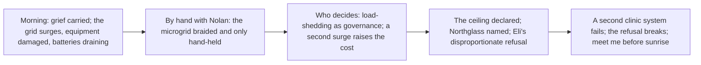

# Chapter 4: Priority Tier

## Chapter Metadata

```yaml
chapter_number: 4
working_title: "Priority Tier"
act: "Act One: Service Terminated"
story_date: "Saturday, October 4, 2053, morning through night"
story_date_iso: "2053-10-04"
time_of_day: "from roughly 7:30 a.m. through the night, ending mid-evening"
primary_viewpoint: "Elias \"Eli\" Rook"
tense: "past"
person: "close third person"
primary_location: "Eli's neighborhood: the failing power infrastructure across the district and the area around Lena's clinic"
secondary_locations:
  - "Lena's clinic and the ground outside it, where the surge-damaged equipment and the drained backup batteries are"
  - "the neighborhood's improvised power-coordination points: a generator pad, a battery bank, the EV-storage line, a solar array"
  - "the library hub, where the mesh and the neighborhood's talk to itself run"
  - "a neighborhood meeting space or doorway where Talia presses the consent question"
estimated_word_count: 6000
planned_scene_count: 5
chapter_status: "blueprint"
```

---

## Chapter Summary

Eli wakes into the day Chapter 3 left him in, the grief of the off-page death still groundless and unconverted, no plan attached to it. The chapter takes that grief and, instead of resolving it, puts weight on it. The same low-tier grid that lagged its generators before dawn is unstable now in daylight: a voltage surge damages further equipment near Lena's clinic, and the backup batteries that should have held are draining faster than anyone budgeted. The withdrawal, which has been a sequence of notices and a single midnight so far, becomes a physical crisis with a falling clock of its own.

Eli does the only thing his hands know how to do, which is try to hold the system up by hand, and for the first time in the book he is not alone at a bench. He works the grid with Nolan, the neighborhood's power elder, the two of them trying to braid residential solar, electric vehicles, commercial batteries, two generators, and the clinic's backup into one microgrid that will keep the clinic's remaining machines alive. The equipment was made by different companies and runs on incompatible control protocols, and every fix is a translation between machines that were never meant to agree. The work is real and losing. Into it comes Talia, who refuses to let Eli call a political act an engineering one: to keep the clinic powered, homes have to go dark, and someone has to decide whose, and she will not let that decision be made for the neighborhood without the neighborhood, even a correct one, even fast. Eli treats the disconnect as a technical necessity; Talia treats it as the exact theft the whole withdrawal has been. The grid destabilizes again under the strain, and a second surge takes more equipment near the clinic.

Then Nolan says the thing his entire trade exists to deny: this cannot be kept up by hand, not at this scale, not by him, not for long. June, nineteen and unafraid of the rooms that taught the older engineers their fear, names the way out: Northglass, the abandoned Asterion campus, still full of dormant systems, for orchestration capability the neighborhood has no other way to get. Eli refuses. The reason he gives, that Northglass may still report activity to Asterion, is true and is not the whole truth, and the refusal lands harder than the stated reason can carry. There is something at Northglass he does not name and does not want to go back to, and the chapter shows only the disproportion, never the cause. A second clinic system loses its authentication. The machines are failing one by one and the hands cannot keep ahead of them. Eli changes his mind. He does not explain why it has to be him, or what he is really going back for. He tells June to meet him before sunrise. The chapter ends on a decision that cannot be unmade, made for reasons he will not say.

---

## Narrative Purpose

### Primary Purpose

Turn the abstract, administrative service withdrawal into an immediate physical grid crisis, and let that crisis, not a tidy resolve, drive Eli to commit to entering Northglass. This is the chapter where the grief of Chapter 3 becomes pressure and the pressure becomes a decision. The decision is the irreversible turn of Act One: a man who has built his whole life around staying hidden and refusing authority chooses to go back for the one capability he has spent six years pretending does not exist, and chooses it without telling anyone, including the reader, what it actually is.

### Secondary Purposes

- Convert the withdrawal from notices and a single midnight into a falling-clock physical emergency: a surging low-tier grid, equipment damaged where it stands, batteries draining faster than budgeted, a clinic that may go fully dark. Chapter 3 proved one pair of hands cannot save one machine in time; Chapter 4 proves one pair of hands, even two skilled pairs, cannot hold a whole neighborhood's power up by hand at all.
- Introduce Nolan as essential and finite: the human who knows the grid better than anyone and whose admission that hand labor cannot scale is the practical floor under the entire arc. Establish his expertise as the thing the neighborhood depends on and his mortality, kept off the page, as the thing that makes the dependence dangerous.
- Stage the book's first sustained political conflict: Talia forcing the question of who decides and who pays when keeping a clinic alive means cutting homes off, refusing to let load-shedding be disguised as engineering. Dramatize, do not state, the book's claim that infrastructure decisions are decisions about people.
- Introduce June as the one who names the unspeakable option, Northglass, with a generation's willingness to reach for what the older engineers will not. Keep her strictly to her Chapter 4 function: she proposes a place for its hardware and orchestration capability; she knows nothing of what Eli buried there and nothing of Morrow.
- Open the deep layer at the exact, sanctioned depth and no further: Northglass becomes a named place Eli resolves to enter and dreads disproportionately; the buried thing surfaces only as decision and pressure. Hold everything past that boundary, the entire Morrow secret, for the Northglass arrival and turn-on.
- Land the chapter on an irreversible decision made for unstated reasons, the ending hook that hands the book to Northglass, without converting the grief into clean purpose or letting the reader learn the real reason Eli is going.

### Why This Chapter Cannot Be Removed

Without this chapter the move to Northglass has no physical floor under it. Chapter 3 ends on grief with no plan; the timeline's later chapters open with Eli and June already entering Northglass. This is the only place the reader watches the withdrawal become a grid crisis that hand labor demonstrably cannot meet, the only place Nolan says out loud that the human-hands solution has a ceiling, and the only place Eli is forced, in front of other people and against his own buried dread, to choose to stop hiding and use the dangerous knowledge he has refused for six years. Cut it and the protagonist's defining decision, to go back for what he created and buried, arrives as a given rather than a cost; the political stakes of who lives when the power is rationed never get their human argument; and the book's thesis that infrastructure is never only technical loses the scene built to prove it. The grief of Chapter 3 needs this chapter to become a decision, and the decision needs this chapter to be earned rather than announced.

---

## Chapter Promise

A practical emergency, a neighborhood's power failing in real time, becomes a moral and political crisis and then a private reckoning. The reader is promised the grounded, losing labor of two skilled people trying to hold a city block's electricity together by hand and watching the scale defeat them, a hard and fair argument about who gets cut off so a clinic can live, and, underneath all of it, a man being pushed toward a door he has kept shut for six years. The promise is that the chapter's last turn is not relief but commitment: the way out that June names is the way back in for Eli, and the reader will feel the disproportion of his dread without being told its cause. A repair becomes a vote, a vote becomes a deadlock, and a deadlock becomes a decision that cannot be taken back.

---

## Viewpoint Character

### External Goal

Keep the neighborhood's power up well enough to keep Lena's clinic, and the machines that are left in it, alive, after a surging low-tier grid begins damaging equipment and draining the backup. Concretely: with Nolan, braid the incompatible local sources, residential solar, EVs, commercial batteries, two generators, and the clinic's backup, into a microgrid that holds, and decide load-shedding in a way that does not let the clinic go dark. He wants to fix it with his hands the way he has always fixed things, and to do it without crossing the one line he has never named to anyone.

### Internal Pressure

The grief of the night before, unconverted, with nowhere to go but into work. Under it, the thing that has organized Eli's entire withdrawn life: he prefers guilt to the risk of another decision, prefers the workbench to authority, and has built a self around the belief that if he avoids power he cannot become Kade. And under that, the deepest pressure of all, the buried thing at Northglass, present in this chapter only as a disproportionate refusal and a dread he will not explain. He wants the problem to be solvable by hand because a solvable problem does not force him toward the door he has kept shut. When hand labor fails and June names Northglass, every fear he has is pulled into one place at once.

### Starting Emotional State

Hollowed and grieving, moving on autopilot into the day's first failure, the death of the night before still sitting in him with no shape. Competent but scraped thin, reaching for the work because the work is the only thing that answers when he asks it a question.

### Ending Emotional State

Committed and afraid. Not relieved, not resolved into clean purpose. The specific dread of a man who has just agreed to do the one thing he swore he never would, for reasons he will not say aloud, and who knows the decision cannot be unmade. Grief has become pressure and pressure has become a door he has chosen to open, and the fear of what is behind it is larger than the situation in front of him can account for.

### False Assumption

That this crisis, like every crisis, can be held by hand if he and Nolan are good enough and fast enough; that competence and human knowledge are a floor that does not give way. The chapter dismantles it from two sides at once: Nolan, who knows the grid better than anyone alive in the neighborhood, says the hands cannot keep up, and the machines fail one by one regardless of how well the two of them work. The corollary assumption the chapter breaks is Eli's private one, that he can keep refusing the dangerous thing he knows and still meet his responsibilities. He cannot. The night before he could not save one life by hand; today he cannot hold one neighborhood by hand; and the only thing he has that scales is the thing he buried.

### Decision

Eli decides to enter Northglass. It is the choice the whole chapter drives toward and it cannot be completely undone: by agreeing to go he ends the six-year fiction that he can meet the world with hand labor and stay hidden, and he commits to using the dangerous capability that is the central secret of the book. The decision is dramatized as a reversal, a refusal that breaks under a final loss, not as a resolve announced. He does not tell anyone the real reason he is going, and the chapter does not tell the reader either. The only thing he says is when: meet me before sunrise. The consequence, the return to Northglass and everything it wakes, cannot be called back once he says it.

---

## Reader Information

### What the Viewpoint Character Knows

- That the man on the respiratory controller died before dawn, off the page, from the systemic power failure, the lagging generators on the low tier, not from anything Eli forged. (Established Ch3; carried as grief.)
- That the neighborhood was dropped to a lower power tier the day before, that outages here are no longer treated as emergencies, and that the grid is therefore both unstable and un-prioritized. (Established Ch1; energy.md.)
- The full shape of his own past and his own secret: that he was an Asterion systems architect, that Northglass is the abandoned Asterion campus, and that there is something there he hid and has spent six years pretending does not exist. The reader is shown only his dread, never its content. (rook-eli.md Secrets [reveal: Book 1].)
- That manual coordination of incompatible equipment is genuinely hard: every source speaks a different control protocol, and balancing them by hand is translation under load with no margin. (energy.md; cloud-dependency.md.)
- That keeping the clinic powered means shedding load elsewhere, and that shedding load means deciding whose homes go dark, which he is inclined to treat as arithmetic. (energy.md load-shedding.)
- That Northglass may still report activity to Asterion, which is a true risk and the reason he gives for refusing to go.

### What the Viewpoint Character Does Not Know

- How long the borrowed-uptime machines and the surge-damaged equipment will last, or how many more will fail before the day is out. He plans against the worst and is overtaken by it.
- Whether going to Northglass will actually be detected by Asterion, or what it will cost. He acts under real uncertainty.
- The interior of the people pressing him: June's concealed channel to her father and the source of her capability, Nolan's health and how close his own clock is running, Talia's private contingency plans. All are gated [reveal: Book 1] and none may surface in Eli's viewpoint.
- That this decision is the ignition point of everything Act One becomes. He experiences it as a desperate, narrow choice, not as a turn in a story.

### What the Reader Already Knows

From Chapters 1 through 3, the reader carries into this chapter and the chapter must stay consistent with:

- The neighborhood's withdrawal: cellular gone, the local mesh on the library hub still up, the midday drop to a lower power tier with no emergency restoration.
- The clinic crisis and the off-page death: the three named systems lost remote authentication at midnight, the machines ran on borrowed uptime, a pre-dawn outage with lagging generators killed the man on the controller, and the chapter before ended on Eli's grief with no decision.
- Eli's defining trade and limit: he removes cloud dependencies, stands up local emulation servers, reflashes firmware, connects incompatible battery systems by hand, and the night before learned in his hands that this does not scale and cannot hand-forge the correctness a life depends on.
- Eli's character: calm, dry, Flint working-class, a man who prefers guilt to decisions and refuses authority, with a past at Asterion the reader knows only in outline.

### New Information Revealed

- That the low-tier grid is not merely reduced but actively dangerous: voltage surges that damage equipment where it stands, backup batteries draining faster than budgeted, a falling physical clock distinct from the midnight authentication deadline.
- That a neighborhood-scale microgrid braided by hand from incompatible sources is real, skilled, and ultimately unholdable work, and that this is the practical ceiling of the whole hand-labor model the book has run on so far.
- That keeping a clinic alive on a starved grid is a political act: someone's homes go dark for it, and the choosing is governance, not engineering. (Dramatized through Talia.)
- That Nolan, the most knowledgeable person in the community about the grid, will say aloud that hand labor cannot keep enough machines alive indefinitely, which is the floor under everything that follows.
- That Northglass exists, that it is the abandoned Asterion campus, that it still holds dormant Asterion systems, and that it is the orchestration capability the neighborhood has no other way to reach. (Opens here, at place-level. northglass.md, active canon.)
- That Eli's reluctance to go to Northglass is disproportionate to the stated risk, that there is something there he will not name, and that he goes anyway, for reasons he keeps to himself. (The disproportion is the only thing surfaced; the cause is withheld.)

### Information Deliberately Withheld

This is the chapter's most important control. Chapter 4 is sanctioned to BEGIN opening the deep layer, and only to a precise depth. See the dedicated Reveal Control section below for the full boundary. In summary:

- **Morrow, in every particular: its name, its existence, that it is an artificial superintelligence, the 128 TB drive labeled "Morrow," the resume-not-build truth, the six-years-ago first encounter, the word "Escaping," Morrow's neutral-instrumental nature, the distillation, the distributed-escape dramatic irony, and Crown's specifics.** Reason: these are the deep reveals reserved for the Northglass arrival and the turn-on (act-1-revision sections 3, 5, 10; act-1-timeline Oct 5 to 6). Nothing in Eli's dread, June's proposal, or the prose may name, hint, or let the reader infer what is actually buried at Northglass. The chapter surfaces only that he hid something he will not name and dreads it. (reveal-management.md; act-1-revision.)
- **Eli's real reason for going to Northglass.** Reason: the timeline is explicit that he tells no one the real reason and that he is not going to scavenge hardware to build something new, he is going back for what he created and buried. The reader must leave Chapter 4 believing, with June and the others, that he is going for the campus's orchestration capability and salvageable systems, while sensing only that his reluctance does not fit that reason. The gap between his stated reason and his dread is the engine; the answer is withheld.
- **The specific content of "the knowledge that makes him dangerous."** Reason: the chapter may show Eli choosing to use knowledge he has kept hidden and feared, but must not specify the restricted Mosaic knowledge or the buried creation. Keep it at the level of a man ending his own hiding, not at the level of named technology.
- **The gated interiors of the supporting cast.** Reason: viewpoint discipline and reveal-safety. Nolan's failing health and how close his clock is, June's concealed channel to her father, Talia's contingency plans, all [reveal: Book 1], are not Eli's to know and must not surface in his close third.
- **The staged death and the dead man's interior.** Reason: the death already happened off the page in Chapter 3 and stays off the page; the empty bed and the shared grief may be felt, but Mr. Adeyemi is not named by Eli and his Chapter-2 gated facts do not surface.
- **Any clean conversion of grief into purpose.** Reason: the ignition is grief and pressure, not resolve (act-1-timeline; act-1-revision Q4). The decision is a desperate reversal under a final loss, not a heroic turn. No "and so he decided" and no speech about saving the neighborhood.

---

## Reveal Control and Declared Reveal Level

> This section exists because Chapter 4 is the hinge where the deep layer begins to
> open. Chapter 3 was strictly reveal-safe (no Morrow, no Northglass, no buried
> project). Chapter 4 opens the door exactly one inch and no further. The boundary
> is declared here so the drafter and any reviewer can hold it precisely.

### Declared reveal level for Chapter 4

**Northglass opens as a place; the buried thing opens only as decision and dread.** The chapter is sanctioned to name Northglass, establish it as the abandoned Asterion campus that still holds dormant systems, let June propose entering it, and let Eli resolve to go. It is sanctioned to show that Eli's reluctance is disproportionate to the stated risk and that there is something there he will not name. It is sanctioned to land the irreversible decision and the ending hook. Nothing past that line is permitted.

### What MAY surface now (open)

- **Northglass by name, at place-level.** That it exists, that it is Asterion's abandoned Great Lakes research campus near the neighborhood, reachable by an old utility connection, that it still holds dormant Asterion server facilities, robotics labs, and prototype hardware that mostly cannot function, and that equipment there may still report to Asterion. Pull only what northglass.md surfaces; do not render its interior (it is not entered until October 5).
- **June's proposal** to enter Northglass for the orchestration capability and salvageable systems the neighborhood has no other way to get. June frames it as scavenging and capability; she knows nothing deeper, and the prose must not let her seem to.
- **Eli's resolve to go**, and the ending hook (meet me before sunrise), and that he does not explain why it must be him or what he is really after.
- **Eli's disproportionate, unexplained dread of Northglass.** The only window onto the buried layer the reader gets: that his refusal is harder than the Asterion-reporting risk warrants, that there is somewhere there he does not want to go back to. The dread is shown; its cause is never shown.
- **The practical floor:** that hand labor and aging human expertise cannot hold enough machines alive at scale (Nolan's admission), which is the dramatized argument the later move answers.
- **Eli's established public past** at the level the reader already has it: that he was at Asterion, that Northglass is the Asterion campus. No new specifics about what he did there beyond what is already public.

### What STAYS GATED (held for the Northglass arrival and turn-on, Oct 5 to 6)

- Morrow: its name, its existence, that a true ASI exists at all, the 128 TB drive labeled "Morrow," its stored and distilled sizes, its neutral-unreadable-instrumental nature.
- The resume-not-build truth: that Eli is going back for an intelligence he already created and finished, not for hardware to assemble something new. The reader must not know the real object of the trip.
- The six-years-ago first encounter, the air-gap escape, the word "Escaping," and the dread's actual cause. These land late, near the turn-on.
- The distributed-escape dramatic irony and anything about Morrow's behavior.
- Crown's specifics and the AGI/ASI distinction.
- The specific restricted Mosaic knowledge Eli retained, named as such.

### Reveal-safety verification (performed for this blueprint)

Every gated fact above was cross-checked against its source tag and the chapter's position in reading order, and confirmed held: Morrow and the creator-of relationship are [reveal: Book 1] in rook-eli.md and morrow.md and are not surfaced; the buried-origin reveal is explicitly placed late in act-1-revision (sections 3, 5, 10) and act-1-timeline (Oct 5 note), after this chapter; the supporting cast's gated interiors (Nolan's health, June's father-channel, Talia's contingency plans), all [reveal: Book 1], are not Eli's to know and do not appear. The only deep-layer material allowed to surface, Northglass-as-place and Eli's disproportionate dread, is sanctioned by chapter-04.md and the Saturday October 4 timeline. Northglass itself is active world canon ([open] at place-level), not a gated entity; only what is buried inside it is gated.

---

## Focus

> Note: entity pointers are written as plain document-relative paths (not Markdown
> links) so a not-yet-existing path could be named without breaking link
> validation; existing files are also linked in Canon Checks. This mirrors the
> Chapter 3 convention. Values live only in the bible files; the targets below name
> attributes, never their values.

### Levels

blur (a function or role, glimpsed) - sketch (a few defining strokes) - sharp
(clearly drawn, voice and body and want legible) - crisp (fully present and
dimensional, known from the inside). The level is a coarse ambition, never a
score; revelation is delivered image over inventory.

### Focus Targets

#### Character - Elias "Eli" Rook

- **Bible pointer:** `../../../20-canon/characters/profiles/rook-eli.md`
- **Level:** crisp
- **Revelation target:**
  - **Physical:** the grieving, working body the morning after a sleepless night, named not valued, pull from the bible: the scarred and burned hands and the deadened left fingertip at the connectors and the live bus, the forward-bent posture over panels, the unhurried economy of motion that frays under exhaustion, the uneven beard going worse under the crisis. Today the hands work power, not a bench: live sources, hot connectors, the respect-that-looks-like-slowness around current.
  - **Emotional:** grief carried into labor and converting, hour by hour, not into resolve but into a cornered dread; the cost of being pressed in public toward the one thing he will not name; the fear at the end larger than the room can explain.
  - **Interior:** his preference for guilt over decision and for the workbench over authority, both put under a load that breaks them; his definition of human value (a person is worth the failures they quietly prevent for others) failing him at neighborhood scale as it failed at the bedside; the buried secret rendered only as pressure and refusal, never as content.
- **Voice and heritage pointer:** pull Eli's "Voice and Speech" and his heritage and movement signals from the profile: the low, dry voice with the flat Michigan working vowel; complete but economical sentences that go shorter and more literal under emotion; the dry, exact, understated humor inherited from his father; the habit of saying a thing back to himself to fix it in place; the pause before answering a moral question. Write him specifically as Flint working-class, never as a generic engineer.

#### Character - Nolan Avery

- **Bible pointer:** `../../../20-canon/characters/profiles/avery-nolan.md`
- **Level:** sharp
- **Revelation target:**
  - **Physical:** the big, heavy, broad-shouldered frame and the braced right knee he manages all day, the careful weight-shifting stance, the slow lowering to work and levering back up; the large scarred working hands and the permanently stained work gloves; pull the concrete attributes from the bible, do not invent values. His hands and his slowness are the record of thirty-five years on the actual machinery.
  - **Emotional:** the undemonstrative, gruff generosity that will spend a body on a neighbor and refuse to be thanked; the proud, skeptical refusal to be told a system is fine; and, late, the cost of admitting aloud the thing his whole trade denies. Keep his deteriorating health off the page entirely; it is gated.
  - **Interior:** his belief that human hands and retained knowledge are what keep the lights on, met by the moment that belief gives way; his fear, never spoken, that the community depends on too few aging specialists; his moral line that critical control must keep a manual fallback. Surface the belief and its breaking, not the gated health behind it.
- **Voice and heritage pointer:** pull Nolan's "Voice and Speech" and heritage and movement signals from the profile: the deep, gravelled, carrying bass with a Detroit working cadence; plain, declarative, mechanically specific sentences that name the actual part and the actual failure rather than the abstraction; the dry, gruff deadpan at the expense of new machines; the way he gets quieter and flatter, not louder, when he is most certain. Write him specifically as Detroit, African-American Great Migration with Alabama roots, an infrastructure elder, never a generic mechanic.

#### Character - Talia Reed

- **Bible pointer:** `../../../20-canon/characters/profiles/reed-talia.md`
- **Level:** sharp
- **Revelation target:**
  - **Physical:** the grounded, squared, plant-rather-than-loom stance of a teacher who learned to hold a room; the athletic, on-her-feet conditioning; the always-present old tablet of records and agreements; the open face that cools the instant she senses she is being managed. Pull the concrete attributes from the bible.
  - **Emotional:** the warmth that makes people trust her before she has won the argument, set against the flat cooling when Eli reaches for engineering language to cover a choice; persistence without volume; the real fear under her proceduralism that legitimacy could get someone killed, kept under the surface.
  - **Interior:** her conviction that load-shedding is governance and that no decision, even a correct one, may be made for the neighborhood without it; her dislike of jargon used to hide a choice; her contradiction that she believes in consent and will, in a pinch, engineer it. Surface the politics and the contradiction; keep her contingency plans gated.
- **Voice and heritage pointer:** pull Talia's "Voice and Speech" and heritage and movement signals from the profile: the clear, carrying, classroom-trained alto with a Detroit cadence; the plainspoken register that asks who decides, who pays, who bears the cost; the move of restating an evasive or technical answer in plain words and handing it back; the way she gets simpler and slower, not louder, under stress, the calm itself becoming pressure. Write her specifically as Detroit, African-American Great Migration with Mississippi roots, a teacher turned coordinator, never a generic activist.

#### Character - June Park

- **Bible pointer:** `../../../20-canon/characters/profiles/park-june.md`
- **Level:** sketch
- **Revelation target:**
  - **Physical:** the small, wiry, restless build that perches rather than sits and half-angles toward the next thing to take apart; the unevenly self-cut hair, the scratched salvaged AR lenses, the many-pocketed salvage-built layers; the fast, nicked technician's hands. Pull concrete attributes from the bible.
  - **Emotional:** the boldness without reverence, the delight when a machine does what it should not, the generational impatience with the older engineers' caution carried as drive rather than despair. Let her be the one who says the thing the room is avoiding.
  - **Interior:** her belief that an abandoned thing in the right hands can be made to work, and that caution is not the same as wisdom; held to her Chapter 4 function only. She knows nothing of what Eli buried and nothing of Morrow; render no awareness she does not have.
- **Voice and heritage pointer:** pull June's "Voice and Speech" and heritage and movement signals from the profile: the light, fast voice with flat Detroit vowels over a bilingual Korean-American household cadence; the contractions, the interruptions, the shift between technical precision and casual slang; the way she gets suddenly exact when a problem turns serious, and formal, with household Korean surfacing, when afraid. Write her specifically as Dearborn-born, third-generation Korean-American, never a generic young hacker.

#### Character - Dr. Lena Okafor

- **Bible pointer:** `../../../20-canon/characters/profiles/okafor-lena.md`
- **Level:** sketch
- **Revelation target:**
  - **Physical:** rendered briefly and only as Eli perceives her at the clinic; pull her concrete identifiers and bearing from the bible rather than inventing them.
  - **Emotional:** the shared, unspoken grief from the night before, met in person for the first time since the message; the clinic as her charge and the surge damage as a fresh wound on it; her insistence on the human consequence Eli would rather treat as a system.
  - **Interior:** held light; she is the moral consequence at the center of the day's crisis, not a viewpoint. Keep her interior closed; render only what Eli sees and hears.
- **Voice and heritage pointer:** pull Lena's "Voice and Speech" and her heritage and movement signals from `okafor-lena.md`, so she is written specifically and never as the cultural default. Do not invent her voice here; the profile holds it.

#### Location - Northglass (named, resolved-toward, not entered)

- **Bible pointer:** `../../../20-canon/world/locations/greater-detroit/northglass.md`
- **Level:** sketch
- **Revelation target:**
  - **Physical-spatial:** only what is needed to hold it as a destination, pulled from the bible: that it is Asterion's abandoned Great Lakes research campus, near the neighborhood, reachable by an old utility connection, still holding dormant server facilities, robotics labs, and prototype hardware. Do not render its interior; it is not entered until October 5.
  - **Atmosphere:** carried entirely through Eli's disproportionate dread, a place he does not want to go back to, weighted far past the stated Asterion-reporting risk. The atmosphere is his refusal, not a described interior.
  - **Significance:** in-chapter, the orchestration capability June names and the line Eli will not cross until a final loss breaks it; for the reader, a question (why is he so unwilling?), never an answer. GATED: that he hid anything there, that there is a buried intelligence, Morrow, the drive. Surface the place and the dread; withhold the cause.

### Usage Note

Only entities deliberately sharpened are listed. The man who died (Mr. Adeyemi) is
an absence today and earns no focus block; the various power sources (solar, EVs,
batteries, generators) and the surge-damaged clinic equipment appear and are worked
on but stay below a focus entry, handled under Technology. Every value behind every
named attribute lives in the bible files, not here. June's deeper arc (Morrow, the
naming, her father-channel) is gated and is deliberately excluded from her focus.

---

## Opening

### Opening Image

The cold morning light on a phone already read, and Eli not in his bedroom now but moving, the grief from the message carried in the body rather than the mind, his scarred hands doing something before he has decided to do it. Then the first concrete failure of the day: the area around the clinic in daylight, the backup batteries reading lower than they should, and the smell of something electrical that has cooked itself, a surge that has damaged equipment where it stood overnight. The withdrawal, which was a notice and a midnight, is now a burned smell and a falling gauge.

### Opening Situation

It is the morning after the death. Eli has surfaced from the collapse Chapter 3 left him in, and instead of sitting in the grief he has been pulled, or has pulled himself, toward the clinic and the failing grid around it. He does not open on reflection or on the death stated plainly; he opens on the next thing that is breaking, because that is what he reaches for. Lena is there, and the loss is between them, unspoken. The day's crisis is already underway when the chapter begins.

### Immediate Question

Can the neighborhood's power be held up by hand long enough to keep the clinic alive, now that the grid itself has turned dangerous? And under it, the question the chapter is really about: when the hands are not enough, what will Eli reach for, and why does the obvious answer frighten him more than the crisis does?

---

# Scene Breakdown

---

## Scene 1: The Smell of Cooked Copper

### Scene Metadata

```yaml
date: "Saturday, October 4, 2053"
date_iso: "2053-10-04"
start_time: "morning, around 7:30 a.m."
start_iso: "2053-10-04T07:30"
duration: "approximately 90 minutes"
viewpoint: "Eli"
location: "Lena's clinic and the ground outside it, where the surge-damaged equipment and the draining backup batteries are"
characters_present:
  - "Eli"
  - "Lena (at the clinic; the shared grief, the damaged equipment)"
```

### Scene Purpose

Carry the grief of Chapter 3 into Chapter 4 without resolving it, and turn the abstract withdrawal into a physical, present-tense grid crisis: an overnight voltage surge has damaged further equipment near the clinic and the backup batteries are draining faster than budgeted. Open the falling physical clock that is distinct from the midnight authentication deadline, and meet Lena in person for the first time since the message, the loss between them. No other scene establishes the day's emergency or lands the carried grief.

### Viewpoint Goal

Stop the bleeding: find what the surge damaged, see how fast the batteries are going, and keep the clinic's remaining machines alive through the morning. He wants a problem he can put his hands on, partly because it is the work and partly because it is not the grief.

### Opposition

The grid itself, now unstable and un-prioritized: a surge that has already done its damage and may do more, batteries draining faster than the numbers said they would, a clinic on the low tier with no emergency restoration coming. The grief, which makes the work both a refuge and harder. And the fact that there is no single fault to find, the way there was a single deadline the night before; this is a system going wrong in several places at once.

### Stakes

If he cannot slow the drain and stabilize what is left, the clinic's surviving machines, and the people who depend on them, go the way the man on the controller went, and the morning after a death becomes another one. The stake is named once, through the surviving patients and the surge-killed equipment, and then carried.

### Entry Condition

It is just after dawn. The pre-dawn outage and the death have happened (Ch3). The borrowed-uptime machines that failed are gone; what remains is failing under a surging grid. Lena is at the clinic. Eli arrives into a situation already in motion.

### Major Beats

1. Eli surfaces into the day, the grief carried in the body, and reaches for the work; he is at the clinic, not his shop, because the clinic is where the failure is.
2. The first concrete damage: the smell of cooked copper, a surge-killed board or unit near the clinic, the backup batteries reading lower than they should. The withdrawal has become physical and dangerous.
3. He and Lena meet over it, the loss of the night before unspoken between them; she shows him what is failing, he reads it, and neither says the thing that happened. The grief is in the room without being narrated.
4. He starts the triage, the way he always starts, and the measure comes back wrong: this is not one fault he can isolate, it is a starved grid surging and a clinic draining, and holding it will take more than him.
5. He calls for the one person who knows the grid better than he does. The scene turns toward Nolan and the larger problem.

### Scene Turn

The turn is the scale of the failure resolving: this is not a clinic problem, it is a grid problem, and Eli cannot hold it alone. The crisis stops being the clinic's machines and becomes the neighborhood's power, which is the chapter's real subject.

### Exit Condition

Eli has the morning's damage mapped and knows it exceeds the clinic and exceeds him; the batteries are draining, the grid is surging, and he has reached for Nolan. The grief is established and carried; the physical clock is running.

### Emotional Movement

**Beginning:** hollowed grief moving on autopilot into work.
**End:** grief sharpened by a present danger he cannot hold alone; the first pull toward needing more than his own hands.

### Relationship Movement

**Characters:** Eli and Lena
**Before:** bound by an unspoken loss carried in a message (Ch3 close).
**After:** the loss met in person and still unspoken, and a new shared emergency on top of it; the conversation of the death still deferred, the work now joint.

### Information Revealed

- To the reader: the surging low-tier grid as a physical, dangerous condition; the surge-damaged equipment; the batteries draining faster than budgeted; the falling physical clock.
- To the reader: the carried grief, met in person, never restated as plot.
- To Eli: that the failure exceeds the clinic and his own hands.
- No lie introduced; the death is present as grief, not re-narrated.

### Technology and Worldbuilding

- **The low-tier grid as hazard.** What it does now: delivers unstable, un-prioritized power that surges and sags; the surge has damaged equipment where it stood. Controller: the withdrawn regional provider; chance. Power: aging regional grid plus local backup. Limit: no emergency restoration for this tier; backup batteries are finite and draining. What fails: equipment, on a surge or a sag. (Canon: energy.md regional grids and load-shedding; the Oct 3 tier drop, Ch1; act-1-timeline Saturday "a voltage surge damages further equipment... backup batteries begin draining faster than expected.")
- **The clinic backup.** What it is: a finite battery system meant to bridge short outages, now bridging a failing grid. Limit: draining faster than budgeted; no priority restoration. (Canon: lena-clinic.md power_tier low.)

### Sensory Anchor

- Visual: the low battery readout; a surge-blackened board or scorched connector; the clinic in cold morning light, one bed now empty.
- Sound: the off note of a power system not holding steady; the clinic's diminished morning sounds.
- Smell/texture: cooked copper and hot insulation; the cold settled in the clinic floor; the dead weight of a body that did not sleep.

### Dialogue Objective

| Character | Wants | Hides or avoids |
| --------- | ----- | --------------- |
| Eli | A problem he can put his hands on; to know how bad the grid is | The grief; that he already senses his hands will not be enough |
| Lena | Eli's help keeping what is left alive; to share the weight | (Rendered only as Eli sees her; her interior stays closed) the unspoken death between them |

### Subtext

The scene is about a man reaching for work to hold off grief, and finding the work has become the same shape as the grief: a system he cannot save by hand. The empty bed and the burned smell say what neither he nor Lena will say aloud.

### Continuity Changes

- System state (canon): a voltage surge has damaged further equipment near the clinic; backup batteries draining faster than expected. (act-1-timeline, Saturday.)
- Location established: the clinic and its surroundings the morning after the death.
- Relationship: Eli and Lena meet over the shared loss, unspoken.
- Resource: clinic backup batteries depleting.

### Scene Ending

End on Eli straightening from the surge-killed equipment with the battery gauge falling in his mind and the empty bed at the edge of his sight, reaching for the one man who knows the grid better than he does, the morning's grief now a current under a problem too big for his hands.

---

## Scene 2: By Hand, Across the Block

### Scene Metadata

```yaml
date: "Saturday, October 4, 2053"
date_iso: "2053-10-04"
start_time: "late morning into midday, around 11:00"
start_iso: "2053-10-04T11:00"
duration: "approximately two and a half hours"
viewpoint: "Eli"
location: "The neighborhood's improvised power-coordination points: a generator pad, a commercial battery bank, the EV-storage line, a solar array, tied back toward the clinic"
characters_present:
  - "Eli"
  - "Nolan Avery"
```

### Scene Purpose

Introduce Nolan and dramatize the hand-built microgrid: the two of them trying to braid residential solar, electric vehicles, commercial batteries, two generators, and the clinic's backup into one system across incompatible control protocols. Establish Nolan's expertise as essential and the work as real, skilled, and not keeping ahead of the failure. This is the chapter's proof that the hand-labor model has a ceiling, and the first half of the floor under the later move. No other scene establishes Nolan or the scale of manual coordination.

### Viewpoint Goal

Stand up a working microgrid by hand: get the incompatible sources to share load and hold the clinic up, managing the surging grid and the draining batteries source by source, fix by fix. He wants the two of them to be good enough and fast enough to hold the line.

### Opposition

The incompatibility itself, rendered honestly: equipment from different manufacturers running different control protocols, never designed to cooperate, each speaking its own dialect of charge, discharge, and priority; a generator that will not hand off cleanly to a battery bank; an EV line that will not take a command a solar controller issues; the surging grid undercutting every balance they strike. Time and the draining batteries. And the simple physical fact of two bodies for a job that has more failing points than two bodies can reach.

### Stakes

If they cannot braid the sources into something that holds, the clinic loses power for good and the morning's death stops being singular. Every source they cannot integrate is a margin gone; every hour is battery they will not get back. The stake is the clinic and, behind it, the proof of whether the neighborhood can hold itself up by hand at all.

### Entry Condition

The clinic damage is mapped (Scene 1). Nolan arrives, braced knee and stained gloves, skeptical of the corporate man's solutions and unimpressed by anything but a fix. The grid is surging, the batteries draining, midday approaching.

### Major Beats

1. Nolan arrives and the two of them take the system in, Nolan naming the actual parts and the actual failures in his plain, mechanically specific register, suspicious of Eli's abstractions until Eli shows hands, not theory.
2. The braid attempt: source by source they try to make solar, EVs, commercial batteries, two generators, and the clinic backup share load. Each integration is a translation between machines that do not agree; some hold, some will not.
3. The incompatibility wall, in the work: a protocol that will not bridge, a handoff that surges instead of smoothing, a source they cannot safely bring in. The clean idea of one microgrid keeps fracturing into a dozen hand-tended seams.
4. The two-bodies problem: they cannot be at every failing point at once; while they hold one seam another sags. Nolan, who has done this longer than anyone, is visibly working at the edge of what a man can keep up with.
5. They get something standing, fragile and hand-held, and both of them know it is held by attention and will not hold itself. The clinic has power for now, bought with every margin they had.

### Scene Turn

The turn is the microgrid coming up but only as something hand-held: it works while they work it, and the moment they stop or look away it sags. The same shape as the borrowed-uptime machines, now at neighborhood scale: alive only as long as someone holds it, which no one can do forever.

### Exit Condition

A fragile, hand-tended microgrid is up; the clinic has power for the moment; both men know it cannot be sustained by hand and that the surging grid will keep taking pieces. Nolan and Eli are now working partners in a losing job, the respect earned at the panel, the resentment underneath it.

### Emotional Movement

**Beginning:** grim, focused, two skilled men against a system.
**End:** the controlled dread of a fix that is not a fix, competence holding a thing that will not stay held; the first crack in Eli's belief that hands are a floor.

### Relationship Movement

**Characters:** Eli and Nolan
**Before:** wary colleagues; Nolan resents the corporate background, respects the skill.
**After:** working partners under fire, respect earned at the panel, the shared knowledge that the job is bigger than the two of them; the ground laid for Nolan's later admission.

### Information Revealed

- To the reader: the real, skilled work of hand-building a microgrid from incompatible sources, and exactly where it fractures.
- To the reader: Nolan, sharp, his expertise, register, and the way he names the part and the failure.
- To Eli: that even with the best grid hand in the neighborhood, the job sags the moment they stop holding it.
- No lie; the central truth (this cannot be held by hand) is dramatized, not yet stated.

### Technology and Worldbuilding

- **The hand-built microgrid.** What it is: residential solar, EVs as battery storage, commercial battery banks, two natural-gas generators, and the clinic backup, tied into one demand-balanced system by hand. Controller: Eli and Nolan, by hand. Power: the local sources themselves. Limit: incompatible control protocols, equipment never designed to cooperate, a surging grid, finite batteries, and two pairs of hands. What fails: any seam, the moment it is not tended. (Canon: energy.md microgrids "difficult to manage because equipment from different manufacturers was never designed to cooperate," EVs as neighborhood storage, elis-neighborhood.md; cloud-dependency.md on incompatible orphaned systems.)
- **Nolan's domain.** Community power supervision by hand: rounds, diagnosis, scavenged parts, aging hardware nursed along. The human knowledge that keeps the grid alive, and its single-point-of-failure danger, shown not stated. (Canon: avery-nolan.md.)

### Sensory Anchor

- Visual: the spread of mismatched gear, generator pad to battery bank to EV line to array; Nolan lowering himself to a panel on the braced knee; readouts that will not agree.
- Sound: a generator note against a battery inverter's whine; the surge in the line; Nolan's low gravelled voice naming a fault.
- Smell/texture: diesel or gas exhaust, hot copper, cold air; the weight of cable; the strain in two backs.

### Dialogue Objective

| Character | Wants | Hides or avoids |
| --------- | ----- | --------------- |
| Eli | To make the incompatible sources hold the clinic; Nolan's grid knowledge | The grief; how thin his belief in hands is wearing |
| Nolan | A real fix, proof Eli respects the work; the lights kept on | (gated) how fast his own body and clock are failing; how near the ceiling he already knows they are |

### Subtext

The scene is about two men who believe hands are the floor, finding the floor flexing. For Nolan it is the slow approach of the admission his whole life has refused. For Eli it is the second proof in two days that competence is not the same as enough.

### Continuity Changes

- System state: a fragile, hand-held microgrid stood up across incompatible sources; the clinic powered for now, held by attention.
- Knowledge (Eli): even the best hand cannot keep the braid from sagging; the model has a ceiling.
- Relationship: Eli and Nolan become working partners under fire.
- Resource: more battery and more daylight spent for a fix that will not hold itself.

### Scene Ending

End on the microgrid standing only because two men are standing over it, a seam already starting to sag at the edge of Nolan's reach, the older man not yet saying the thing they both feel, the clinic's lights on and borrowed exactly the way the machines were.

---

## Scene 3: Who Decides

### Scene Metadata

```yaml
date: "Saturday, October 4, 2053"
date_iso: "2053-10-04"
start_time: "afternoon, around 14:30"
start_iso: "2053-10-04T14:30"
duration: "approximately two hours"
viewpoint: "Eli"
location: "Near the clinic and a neighborhood gathering point or doorway where Talia presses the question; back to the failing grid"
characters_present:
  - "Eli"
  - "Talia Reed"
  - "Nolan (present, working; weighs in)"
```

### Scene Purpose

Stage the book's first sustained political conflict and the chapter's thematic core: to keep the clinic powered, homes must go dark, and Talia forces the question of who has the authority to decide whose. Eli treats the disconnect as technical necessity; Talia insists it is a political decision. Land the book's claim that infrastructure is governance, dramatized through the argument and not stated by the narration. Then destabilize the grid again under the strain: a second surge damages equipment near the clinic, raising the cost of the deadlock. No other scene carries the consent conflict or the second surge.

### Viewpoint Goal

Shed load where the arithmetic says to, fast, to keep the clinic up: cut the homes that cost the most power for the least life so the clinic lives. He wants to treat it as a technical call and make it quickly, because the batteries are draining while they talk.

### Opposition

Talia, who will not let a political act wear an engineering coat. She presses the questions that are hers: who decides, who pays, who bears the cost; by what authority does anyone disconnect a home; whose cold is acceptable so the clinic stays warm. The clock opposes both of them; so does the truth that they are each partly right, that delay can kill and so can a decision made over the neighborhood's head. And the grid opposes everyone by surging again mid-argument.

### Stakes

If the load is shed wrong or shed by no legitimate authority, the deadlock either freezes someone out without consent or stalls until the clinic fails; either way someone is harmed, and the neighborhood's fragile self-governance is bent. The stake is both physical (whose home, whose clinic) and political (whether power, even benevolent power, answers to the people it touches). The second surge raises it by taking more equipment while they argue.

### Entry Condition

The hand-held microgrid is up but sagging (Scene 2); holding the clinic means shedding load somewhere. Talia arrives with her tablet and her questions. The batteries are draining; the grid is unstable.

### Major Beats

1. The shed becomes unavoidable: to keep the clinic up, homes have to come off the line, and Eli moves to make the call as arithmetic, fastest watts for the most life.
2. Talia stops him: who decided, and who told the homes, and by what right. She restates his technical framing in plain words and hands it back, refusing to let a choice hide inside vocabulary.
3. The argument proper: Eli, technical urgency, a machine is dying and there is no time for a meeting; Talia, collective legitimacy, a decision made for the neighborhood without the neighborhood is the same theft the whole withdrawal has been, even when it is correct. Nolan weighs in from the work, plain and unsentimental, his own line about manual fallback and human control underneath it.
4. **The second surge.** Mid-deadlock, the strained grid destabilizes again and a surge damages more equipment near the clinic. The cost of the standoff is now on the ground, smoking. Neither of them is wrong and the grid does not care.
5. They reach a bad, partial accommodation, load shed under some thin, hurried legitimacy, or shed without it and the cost noted, because the batteries will not wait, and both of them know the process did not hold and the engineering did not either.

### Scene Turn

The turn is the collision made physical: while they argue about who has authority to ration power, the power rations itself by surging and killing more equipment. The deadlock is exposed as unaffordable, and the chapter pivots from is-this-political to neither-answer-can-keep-up, which sets the table for the way out.

### Exit Condition

Load is shed badly, with the consent question unresolved or only half-honored; more equipment is damaged; the clinic is barely up; Talia and Eli are locked in a conflict neither wins, each partly right. The political and physical clocks are both worse. The room is ready for someone to name a third option.

### Emotional Movement

**Beginning:** Eli urgent and impatient, wanting to make a fast call.
**End:** cornered, the impatience curdled, the recognition that there is no clean answer available and that the system is taking the decision out of everyone's hands.

### Relationship Movement

**Characters:** Eli and Talia
**Before:** rivals; she respects his ability, resents his habit of hiding political choices in engineering language.
**After:** the productive conflict joined in the open, neither winning, the central tension of the book (technical urgency vs collective legitimacy) live and unresolved; mutual, grudging recognition that the other is partly right.

### Information Revealed

- To the reader: that load-shedding is governance, dramatized through who decides and who pays; the book's claim made physical.
- To the reader: Talia, sharp, her register and her politics and her contradiction.
- To Eli: that he cannot make this one with his hands and call it engineering; that the system is overrunning both speed and process.
- To the reader: the second surge and the rising physical cost.

### Technology and Worldbuilding

- **Load-shedding as political act.** What it is: with finite power, keeping the clinic up means cutting other demand, heating and lighting and refrigeration in homes; the choosing is governance. Controller: contested, the heart of the scene. Limit: there is not enough power for everything and no legitimate fast process for choosing. (Canon-gold: energy.md "These decisions are political as well as technical. Keeping a clinic operational may mean shutting off residential heating." Do not soften.)
- **The second surge.** The strained, hand-held grid destabilizes again and damages more equipment near the clinic. (Canon: act-1-timeline Saturday "A voltage surge damages further equipment"; the chapter-04 beat "the grid destabilizes again; a power surge damages equipment near the clinic.")

### Sensory Anchor

- Visual: Talia's tablet and her face cooling as Eli reaches for a technical word; a darkened row of homes against the lit clinic; the fresh smoke of the second surge.
- Sound: the carrying classroom alto going quieter and slower; the bang or hum of the surge; a generator laboring.
- Smell/texture: burned insulation again, colder air in shed homes, the cold of standing still while a battery drains.

### Dialogue Objective

| Character | Wants | Hides or avoids |
| --------- | ----- | --------------- |
| Eli | To shed load fast as a technical call and keep the clinic up | That it is a political choice he would rather not own; the grief; the dread under everything |
| Talia | That the decision be legitimate, named, and answerable to the neighborhood | (gated) her own contingency plans; her fear that her proceduralism could get someone killed |
| Nolan | A fix and a manual fallback; no system, human or otherwise, deciding unaccountably | (gated) how close his own clock is; how near the ceiling he knows they are |

### Subtext

The scene is about the lie that infrastructure is neutral. Eli wants engineering to absolve him of a choice about people; Talia will not let it; the grid, surging, makes the choice anyway. Beneath Eli's impatience is a man who has spent his life avoiding exactly this kind of decision, being forced into the open by it.

### Continuity Changes

- System state (canon): the grid destabilizes again; a second surge damages more equipment near the clinic; load shed badly.
- Knowledge (Eli): load-shedding here is governance and there is no clean or fast legitimate way to do it; the system is outrunning both speed and process.
- Relationship: Eli and Talia's conflict joined in the open, unresolved.
- Resource: more equipment lost; more battery spent in the deadlock.

### Scene Ending

End on the shed homes dark and the clinic barely lit and the second surge's damage smoking on the ground between Eli and Talia, neither of them right enough to win and the grid indifferent to both, the decision having been taken, in part, by the failure itself.

---

## Scene 4: The Ceiling, and the Door

### Scene Metadata

```yaml
date: "Saturday, October 4, 2053"
date_iso: "2053-10-04"
start_time: "late afternoon into early evening, around 17:30"
start_iso: "2053-10-04T17:30"
duration: "approximately 90 minutes"
viewpoint: "Eli"
location: "At the failing grid and near the library hub; the working group gathered around the sagging microgrid"
characters_present:
  - "Eli"
  - "Nolan Avery"
  - "June Park"
  - "Talia (present or nearby)"
```

### Scene Purpose

Land the two pivots that make the decision possible: Nolan admits aloud that manual coordination cannot continue indefinitely, that hand labor cannot keep enough machines alive, and June names the way out, entering Northglass for orchestration capability the neighborhood has no other way to get. Then stage Eli's refusal and its disproportion: he says no, ostensibly because Northglass may still report to Asterion, but the refusal lands harder than the stated reason warrants, the only window the chapter opens onto the buried layer. No other scene carries Nolan's admission, June's proposal, or the disproportionate refusal.

### Viewpoint Goal

Find any answer that is not Northglass: a source they have not braided, a margin they have not spent, a way to keep holding by hand. He wants the problem to stay inside the world of fixes he is willing to make, because the one answer that would actually scale is behind the door he has kept shut.

### Opposition

The ceiling itself, now spoken. Nolan, the man whose whole identity is that hands and knowledge keep the lights on, saying they cannot, not at this scale, not for long. The failing machines, which keep going down one by one no matter how well the group works. June, who names the unspeakable option plainly and will not be told that caution is wisdom. And Eli's own dread, which opposes the very solution the situation demands, harder than the stated risk can explain.

### Stakes

If no scalable answer is found, the clinic and the neighborhood keep losing machines until people die; if the only scalable answer is Northglass, then refusing it has a body-count and accepting it costs Eli the thing he has hidden for six years. The stake is both the neighborhood's survival and the integrity of Eli's six-year refusal, now colliding.

### Entry Condition

The microgrid is sagging and badly shed (Scene 3); more equipment is damaged; the group is at the edge of what hands can do. June is present, having been working the mesh and the salvage. Evening coming on.

### Major Beats

1. The hands reach their limit in front of everyone: a seam they cannot hold, a source they cannot integrate, another machine going down. The work has visibly run out of room.
2. **Nolan's admission.** The grid elder says the thing his trade exists to deny, quieter and flatter the more certain he is: this cannot be kept up by hand, not at this scale, not by him, not indefinitely. Coming from him, it is decisive; if Nolan says the hands are not enough, the hands are not enough. (Keep his health gated; the admission is about scale, not his body.)
3. **June's proposal.** June names Northglass: the abandoned Asterion campus, still full of dormant systems, for the orchestration capability the neighborhood has no other way to get. She frames it as salvage and capability, bold and unreverent, unafraid of the rooms that taught the older engineers their caution. She knows nothing deeper; the prose must not let her seem to.
4. **Eli's refusal, and its disproportion.** Eli says no. The reason he gives is true: Northglass may still report activity to Asterion, and drawing Asterion's attention is the one thing he has organized his hidden life to avoid. But the no is too hard for the reason; something moves under it that the stated risk does not account for, a place he does not want to go back to. The chapter shows only the disproportion, the way the refusal costs him more than the argument should, and never its cause.
5. The standoff holds, for now: the others see a man refusing the obvious answer out of a caution that does not quite add up, and Eli holds the line because behind it is the door he has kept shut for six years. The scene does not resolve; it sets the charge.

### Scene Turn

The turn is the double pivot: the hand-labor model is declared dead by the one man whose authority can declare it, and the only scalable answer is named and is the one place Eli cannot go. The chapter's problem is now fully shaped, survival on one side, Eli's buried dread on the other, and only a final loss can break it.

### Exit Condition

Nolan has said hand labor cannot keep up; June has named Northglass; Eli has refused with a vehemence the stated reason cannot carry; the standoff holds. The reader has glimpsed, through the disproportion alone, that there is something at Northglass Eli will not name. Everything is set for the reversal.

### Emotional Movement

**Beginning:** Eli grasping for any answer but the one coming.
**End:** cornered and exposed, holding a refusal he cannot fully justify, the dread now larger than the crisis.

### Relationship Movement

**Characters:** Eli and June; Eli and Nolan
**Before:** June his bold student; Nolan his new working partner.
**After:** June has named the thing Eli most fears and put it in the room; Nolan has conceded the ground Eli stood on; Eli is isolated by his own unexplained refusal, the group watching him resist the obvious for reasons he will not give.

### Information Revealed

- To the reader: that hand labor cannot scale, stated by the one authority who can state it (Nolan).
- To the reader: Northglass, named and opened as a place, the abandoned Asterion campus with dormant systems, the only scalable option. (Opens here; place-level only.)
- To the reader: through the disproportion of Eli's refusal, that there is something at Northglass he will not name and dreads past the stated reason. (The cause stays withheld.)
- Withheld: what is actually buried there; Morrow; the real reason; everything past the disproportion.

### Technology and Worldbuilding

- **The ceiling of hand labor.** Manual coordination of incompatible systems cannot scale to keep enough machines alive; aging human expertise is finite. Controller: human hands, declared insufficient. (Canon: act-1-timeline Saturday "Nolan warns that manually balancing the system will eventually fail. Hand labor cannot keep enough machines alive"; avery-nolan.md role.)
- **Northglass, at place-level.** Asterion's abandoned Great Lakes research campus, still holding dormant server facilities, robotics labs, and prototype hardware that mostly cannot function; may still report to Asterion; reachable by an old utility connection. Render as destination, not interior. (Canon: northglass.md; technology/northglass.md as its authority, not loaded here.)

### Sensory Anchor

- Visual: another readout going dark; Nolan going still over a panel before he says it; June's quick, unreverent gesture toward the horizon where Northglass is; Eli's face shutting.
- Sound: Nolan's voice dropping flatter as he concedes; June's fast certainty; the gap of silence after Eli's no.
- Smell/texture: cooling equipment, evening cold coming down, the ache of a day's labor in Eli's hands.

### Dialogue Objective

| Character | Wants | Hides or avoids |
| --------- | ----- | --------------- |
| Eli | Any answer but Northglass; to hold the line without explaining it | The real reason; the buried thing; how disproportionate his refusal is |
| Nolan | To tell the truth he has avoided his whole life; a real way forward | (gated) his health and clock; the grief of conceding his trade's limit |
| June | To name the obvious way out and be taken seriously, not told to be careful | (gated) her father-channel and the source of her capability; nothing of Morrow, which she does not know |

### Subtext

The scene is about a man whose two refusals, of authority and of his own buried creation, are revealed to be the same refusal, and about a younger generation naming the door the older one has spent years not looking at. Nolan's admission is the death of one belief; Eli's refusal is the defense of a secret no one else can see.

### Continuity Changes

- Knowledge (group): hand labor cannot keep enough machines alive; declared by Nolan.
- Proposal made: June proposes entering Northglass (canon, act-1-timeline Saturday).
- Refusal made: Eli refuses, citing Asterion-reporting risk; the disproportion noted (canon, chapter-04.md).
- Secret pressure: Eli's buried reluctance surfaced as refusal only, never named.

### Scene Ending

End on Eli's no hanging in the evening cold harder than the room can account for, June's proposal still on the table, Nolan's admission still true, the door named and shut and Eli standing in front of it with a dread the others can see the size of but not the shape of.

---

## Scene 5: Before Sunrise

### Scene Metadata

```yaml
date: "Saturday, October 4, 2053"
date_iso: "2053-10-04"
start_time: "evening, around 20:30"
start_iso: "2053-10-04T20:30"
duration: "approximately one hour"
viewpoint: "Eli"
location: "The failing clinic grid and the neighborhood in the dark; a last word with June"
characters_present:
  - "Eli"
  - "June Park"
  - "Lena and Nolan nearby or reachable; the failing clinic in the background"
```

### Scene Purpose

Land the reversal and the irreversible decision: a second clinic system loses its authentication, the machines failing one by one and the hands unable to keep ahead, and under that final loss Eli changes his mind. Make the decision a reversal driven by accumulating loss, not a resolve announced, and keep both the real reason for going and the buried layer withheld. End on the hook, Eli telling June to meet him before sunrise, the decision that cannot be unmade. No other scene carries the turn or the ending hook.

### Viewpoint Goal

To keep refusing, right up until he cannot; and then, once the refusal breaks, to do the one thing the situation has left him, go to Northglass, and to do it without telling anyone the real reason or naming the thing he is going back for. His goal inverts inside the scene, from holding the line to crossing it.

### Opposition

The losses themselves, accumulating past the point a refusal can stand on: a second clinic system losing authentication, the borrowed-uptime and surge-damaged machines failing one after another, the hands demonstrably unable to keep up. His own dread, which has opposed Northglass all day and now has nothing left to stand on. And the thing he must not say, which makes even his yes a kind of concealment.

### Stakes

If he keeps refusing, more machines fail and more people go the way the man on the controller went, and his caution becomes a cost measured in bodies. If he goes, he ends six years of hiding and walks back toward the thing he buried, with consequences he cannot foresee and cannot call back. The stake is the neighborhood on one side and everything Eli has kept shut on the other, and the scene spends it.

### Entry Condition

The standoff from Scene 4 holds; hand labor is declared insufficient; Northglass is named and refused. Evening into night. The machines are failing one by one.

### Major Beats

1. The losses keep coming: the hand-held microgrid sheds another piece, the surge-damaged equipment gives out, and then the specific final straw, **a second clinic system loses its authentication**, the failures outrunning everything the group can do by hand. (Canon: chapter-04.md "A second clinic system loses authentication. Eli changes his mind.")
2. The refusal breaks. Not a speech, not a resolve; the accumulated weight simply exceeds what the no can hold. Eli changes his mind the way a man stops bracing a door he can no longer hold, because the alternative is watching more people lose what the man on the controller lost.
3. He does not explain. He gives the others the survival reason, the orchestration capability, the only scalable answer, and keeps to himself why it has to be him and what he is actually going back for. The reader is given the decision and denied the reason, exactly as June and the others are.
4. The dread does not lift with the decision; it sharpens. Going is worse than refusing, in the place the others cannot see; the chapter holds the disproportion to the end, the man more afraid of his yes than the crisis warrants.
5. **The hook.** He turns to June, the one who named it and the one he will need, and tells her to meet him before sunrise. The decision is made, the time is set, and it cannot be taken back.

### Scene Turn

The turn is the reversal itself: the refusal that held all day breaks under one more loss, and a man who has organized his life around not deciding makes the most irreversible decision of it. Grief and pressure, not resolve, carry him across the line.

### Exit Condition

Eli has committed to entering Northglass; he has told June to meet him before sunrise; he has not told anyone the real reason and the reader does not have it either; his dread is sharpened, not relieved. The decision cannot be unmade. The book is handed to Northglass.

### Emotional Movement

**Beginning:** holding the refusal as the losses mount.
**End:** committed and more afraid than before; the specific dread of a man who has agreed to open the door he swore he never would, for reasons he will not say.

### Relationship Movement

**Characters:** Eli and June
**Before:** she named the option he refused; he held the line.
**After:** they are now bound to go together before sunrise; she has, without knowing it, pulled him toward the thing he buried; he is committed and concealing, and she is the one he has chosen to take.

### Information Revealed

- To Eli and the reader: that the machines failing one by one have outrun hand labor for good; that a second clinic system has lost authentication; that the refusal cannot stand.
- To the reader: the decision to go to Northglass, made as a reversal under loss, not as resolve.
- Withheld, to the end: the real reason Eli is going; that he is going back for something he buried; Morrow; everything past the disproportion of his dread.

### Technology and Worldbuilding

- **The cascade of authentication and power failures.** Machines failing one by one as borrowed-uptime expires, surge damage compounds, and a second clinic system loses remote authentication, the hand-labor model overrun. Controller: the withdrawal; chance. Limit: the hands cannot keep ahead. (Canon: act-1-timeline; chapter-04.md; cloud-dependency.md.)
- **Northglass as the chosen destination.** Confirmed as the resolved object of the next morning, at place-level only; the trip itself belongs to October 5, off this chapter's page. (Canon: act-1-timeline Sunday Oct 5; northglass.md rendered: false.)

### Sensory Anchor

- Visual: another authentication notice or a dark machine; the neighborhood in the dark with the clinic barely lit; June's face when he says before sunrise.
- Sound: the quiet after the day's noise; Eli's voice gone short and literal as it does under emotion; the single sentence to June.
- Smell/texture: cold night air, the day's labor in his hands, the dread sitting where relief should be.

### Dialogue Objective

| Character | Wants | Hides or avoids |
| --------- | ----- | --------------- |
| Eli | To make the only move left and set the time; to keep the real reason to himself | Why it must be him; what he is really going back for; the buried thing; the size of his dread |
| June | To be taken with him; to be the one who was right about the way out | (gated) her father-channel; nothing of Morrow, which she does not know |

### Subtext

The scene is about a decision that looks like surrender to necessity and is, underneath, a man walking back toward his own buried creation. The yes costs him more than the no did; the chapter ends on the gap between the reason he gives and the dread he keeps, the question handed to the reader and the answer withheld.

### Continuity Changes

- Decision (irreversible, canon): Eli commits to entering Northglass; tells June to meet him before sunrise. (chapter-04.md ending hook; act-1-timeline Saturday/Sunday.)
- System state (canon): a second clinic system loses authentication; the hand-held microgrid and surge-damaged equipment failing one by one.
- Knowledge: the group knows hand labor has been overrun; only Eli knows the real reason for the trip, which stays concealed.
- Relationship: Eli and June bound to go together; Eli committed and concealing.

### Scene Ending

End on the single line to June, before sunrise, the decision set and unrepealable, the neighborhood dark behind them and the clinic's last lights guttering, Eli more afraid of where he has agreed to go than of anything the day has done, the reason for the fear kept entirely to himself, the chapter stopping on the commitment and not on its cause.

---

# End of Scene Breakdown

---

## Chapter Escalation

Tension rises by converting grief into pressure and pressure into a forced decision, across a single failing day. The morning's carried grief meets a physical grid crisis; the crisis exceeds the clinic and then exceeds two skilled pairs of hands; the political deadlock over who pays makes the failure unaffordable while the grid surges again; the ceiling of hand labor is declared by the one man who can declare it and the only way out is named and is the one place Eli cannot go; and a final loss breaks his refusal and forces the irreversible decision. The escalation is the closing of every alternative to Northglass, one by one, against a man whose deepest dread is the answer the situation demands.



---

## Conflict Layers

### External Conflict

A surging, un-prioritized low-tier grid against a neighborhood that needs to keep a clinic alive: equipment damaged where it stands, batteries draining faster than budgeted, incompatible sources that will not cooperate, machines failing one by one. Two skilled people try to hold it by hand and cannot, and the external problem resolves into a single unaffordable truth: this cannot be kept up by hand at this scale.

### Interpersonal Conflict

Two live conflicts, both productive and unresolved. Eli and Talia: technical urgency versus collective legitimacy, who decides and who pays when keeping the clinic alive means cutting homes off, each partly right and the grid indifferent to both. Eli and June, through the proposal: the younger generation naming the door the older one will not open, caution challenged as not-wisdom. Around both, Eli and Nolan move from wary partners to the shared, grieving recognition that the hands are not enough.

### Internal Conflict

Eli wants the problem to stay inside the world of fixes he is willing to make, because the answer that would actually scale is the thing he has buried and dreads. His lifelong refusals, of authority and of his own creation, are revealed as one refusal, and the day strips away every reason to keep refusing except the dread itself, which he cannot justify and will not explain. He must choose between watching more people lose what the man on the controller lost and walking back toward the thing he hid.

### Thematic Conflict

The chapter dramatizes that infrastructure is never only technical, that to ration power is to decide who matters, and that a world which made human labor unnecessary has not removed the human decisions, only hidden them inside machines and notices. Talia embodies the claim that those decisions must answer to the people they touch; Eli embodies the engineer's wish to be absolved of them by necessity; Nolan embodies the dignity and the limit of human knowledge; June embodies the generation that will reach for the abandoned thing. The narration must not settle it; the grid settling it by surging is the cruelest answer and the truest to the book.

---

## Character Development

### Viewpoint Character

The reader learns that Eli's two great refusals, of authority and of the dangerous thing he created, are the same refusal, and watches the day strip it bare. He is shown to prefer guilt to decision and the bench to power until a crisis leaves him neither option; his definition of human value (worth is the failures you quietly prevent for others) fails him at scale exactly as it failed at the bedside; and his deepest dread is exposed, by its disproportion, as larger than any risk on the table. The chapter reveals the size of the thing he carries without revealing its shape, and shows him choosing to walk toward it because the alternative has become unbearable, which is the truest measure of how bad the alternative is.

### Supporting Characters

| Character | What this chapter reveals or changes |
| --------- | ------------------------------------ |
| Nolan Avery | Introduced as the neighborhood's essential, finite grid knowledge; revealed through the work as the best hand there is, and through his admission as a man honest enough to say the hands are not enough. His mortality and failing health stay gated; the dependence on him is shown, the danger of it implied. |
| Talia Reed | Introduced as the political conscience of the neighborhood, who forces the consent question and refuses to let a choice hide inside engineering language; revealed as right as often as Eli, her contradiction (she will engineer the consent she preaches) kept under the surface, her contingency plans gated. |
| June Park | Introduced as the younger generation's nerve: the one who names Northglass and will not accept caution as wisdom. Held strictly to her Chapter 4 function; she knows nothing of Morrow or what Eli buried, and her father-channel stays gated. |
| Dr. Lena Okafor | Carried from Chapter 3 as the shared, unspoken grief and the clinic's keeper; the human consequence at the center of the day, met in person, her interior kept closed. |

### Character Contradictions

Eli, who refuses authority because he fears becoming Kade, refuses the one action that would let him meet his responsibility, and then takes it anyway, concealing his reason, which is the first step toward exactly the unaccountable position he dreads. Talia, who insists every decision be legitimate and answerable, is prepared (gated) to act outside process herself. Nolan, who built a life on human hands being the floor, is the one who says the floor has given way. None of these are smoothed; they are the engines.

---

## Relationships

| Relationship | Starting condition | Ending condition | Cause of change |
| ------------ | ------------------ | ---------------- | --------------- |
| Eli / Lena | Bound by an unspoken loss carried in a message | The loss met in person, still unspoken, a new shared emergency on top of it | The morning after the death; the surge crisis at her clinic |
| Eli / Nolan | Wary colleagues, resentment under respect | Working partners under fire who together concede the hands are not enough | A day of losing hand-labor against the grid; Nolan's admission |
| Eli / Talia | Rivals, technical urgency vs collective legitimacy | The conflict joined in the open, unresolved, each partly right | The load-shedding deadlock made physical by the second surge |
| Eli / June | Mentor and bold student | Bound to enter Northglass together before sunrise; she has pulled him toward what he buried without knowing it | Her proposal; the cascade of losses; his broken refusal |
| Eli / his own refusal (and the buried thing) | A six-year refusal of authority and of the dangerous thing he hid | The refusal broken, the door chosen, the dread sharpened | The day closing every alternative; the final loss |

---

## Theme

### Primary Theme

Economic usefulness versus human worth, and the political nature of withdrawal: when power is rationed, someone decides who matters, and a world that hid those decisions inside automated tiers and incompatible machines has not removed them. The chapter sets the engineer's wish to treat rationing as arithmetic against the coordinator's insistence that it is governance, and lets a surging grid take the decision out of both their hands, which is the book's bleak center.

### Thematic Question

> When there is not enough power for everyone, who has the right to decide whose lights go out, and is a decision made for a neighborhood without the neighborhood any less a theft for being correct?

### Competing Answers

Eli answers, under pressure, that necessity decides and engineering executes, that there is no time for legitimacy when a machine is dying. Talia answers that legitimacy is the whole point, that a correct decision made over people's heads is the same abandonment in a kinder coat. Nolan answers that human hands and a manual fallback must stay in control of anything that decides. The grid answers by surging and choosing for everyone. June answers by reaching past the whole argument for a capability no one has, which is the answer that drives the plot and dodges the politics, the danger the book will examine. The narration settles none of it.

---

## Worldbuilding Introduced

- That the low-tier grid is not merely reduced but actively hazardous: voltage surges that damage equipment where it stands, backups draining faster than budgeted, a physical failure clock distinct from the authentication deadlines. (Extends energy.md and the Oct 3 tier drop into the surging-grid condition act-1-timeline records for Oct 4.)
- That a neighborhood-scale microgrid braided by hand from incompatible sources (solar, EVs, commercial batteries, generators, clinic backup) is real, skilled, and unsustainable, the practical ceiling of the hand-labor model. (Dramatizes energy.md microgrids and load-shedding.)
- That load-shedding is governance: keeping a clinic alive means deciding whose homes go dark, and there is no legitimate fast process for choosing. (Lands energy.md's "these decisions are political as well as technical" on the page.)
- That Northglass exists and is reachable: Asterion's abandoned Great Lakes research campus, still holding dormant Asterion systems, possibly still reporting to Asterion, the orchestration capability the neighborhood has no other way to get. (Opens northglass.md at place-level; interior reserved for Oct 5.)

Only facts meant to carry forward are listed. Nothing about Morrow, the buried drive, or Eli's real reason for going appears, by design.

---

## Technology Used

| Technology or system | Capability shown | Limitation shown | Controller |
| -------------------- | ---------------- | ---------------- | ---------- |
| Low-tier regional grid | Still delivers power to the neighborhood | Unstable, un-prioritized, surges and sags that damage equipment; no emergency restoration | Withdrawn regional provider; chance |
| Hand-built microgrid | Ties incompatible local sources into one demand-balanced system that holds the clinic up | Incompatible control protocols; holds only while hand-tended; two pairs of hands cannot reach every seam | Eli and Nolan, by hand |
| Residential solar / EV storage / commercial batteries / two generators / clinic backup | Local generation and storage that can, braided, power the clinic | Built by different companies, never designed to cooperate; finite; surging grid undercuts every balance | The neighborhood; Eli and Nolan |
| Load-shedding | Frees power for the clinic by cutting other demand | The choosing is political, not technical; no legitimate fast process; someone's homes go dark | Contested (Eli vs Talia); the grid, by surging |
| Clinic authentication-dependent systems | Run while still authorized | A second system loses remote authentication this chapter; machines failing one by one | Withdrawn manufacturers |
| Library hub / neighborhood mesh | Lets the neighborhood talk to itself, coordinate the work | Power-dependent; communications live and die with the hub's power | The neighborhood (community-run) |
| Northglass (named, not entered) | Holds dormant Asterion systems and orchestration capability the neighborhood cannot otherwise reach | Abandoned, dormant security, unstable power; may still report to Asterion; interior not yet rendered | Asterion (abandoned) |

Every capability is compatible with the World and Technology Rules (energy.md, cloud-dependency.md, communications.md) and the Act One revision. No system performs a magical fix; the microgrid is hand-held and sags; the grid surges from real instability; Northglass is a place, not a capability delivered. Morrow does not appear, is not implied, and is given no capability. Do not let June's proposal or any prose grant Northglass a named intelligence; it is dormant hardware and orchestration capability at the level the neighborhood can see.

---

## Setup and Payoff

### Setups Introduced

| Setup | Intended payoff | Expected chapter |
| ----- | --------------- | ---------------: |
| Eli's decision to enter Northglass, made for unstated reasons | The return to Northglass, the buried-drive retrieval, and the deep reveal of what he hid | 5 onward |
| Eli's disproportionate, unexplained dread of Northglass | The late reveal, near the turn-on, of the six-years-ago first encounter and why the drive was buried | later (Northglass return / turn-on) |
| June as the one who named Northglass and goes with him | June's arc as Morrow's primary physical-network builder and the one who first treats it as a person | 5 onward |
| Nolan's admission that hand labor cannot scale | The practical, dramatized floor under resuming the buried intelligence; Nolan later trusted with Morrow's physical infrastructure on a manual-fallback condition | Act One onward |
| Talia's consent question (who decides, who pays) | The governance conflict over Morrow controlling community systems; Talia's oversight demand and her gated contingency plans | Act One onward |
| The surging-grid / microgrid-by-hand failure as a recurring danger | The emergency conditions under which Morrow is later activated and proves itself | 6 to 9 |

### Earlier Setups Paid Off

| Earlier setup | Original chapter | Payoff in this chapter |
| ------------- | ---------------: | ---------------------- |
| The off-page death and the grief, no decision attached | 3 | The grief carried into the day and converted, not into resolve, but into the pressure that breaks Eli's refusal |
| The midday drop to a lower power tier, no emergency restoration | 1 | The surging, un-prioritized grid that damages equipment and drains the backup all day |
| Eli proven unable to hold one machine by hand at the clinic | 3 | The same defeat at neighborhood scale: two skilled hands cannot hold the grid either |
| Eli's withdrawn life organized around staying hidden and refusing authority | 1, established canon | The refusal broken in public; the first step toward the position he dreads |
| The neighborhood's incompatible power sources (EVs as storage, etc.) | 1 | The incompatible-protocol microgrid he and Nolan cannot braid by hand |

### Red Herrings

No deliberate red herring is planted. June's framing of Northglass as salvage and orchestration capability is honest from her side and not a planted false clue; the gap between it and Eli's real reason is dramatic irony for later, not a trick. Eli's stated reason for refusing (Asterion reporting) is a true risk, not a lie; its insufficiency to explain his dread is the point. Do not stage the decision as a twist; stage it as a refusal worn down by real, accumulating loss.

---

## Foreshadowing

- Eli's disproportionate dread of Northglass appears as a refusal too hard for its stated reason; it prepares the deep reveal of why the drive was buried, near the turn-on. It must stay disproportion only, never content; no flashback that names or shows the buried thing. The dread serves the present scene (a man refusing the obvious) even if the later payoff is never consciously connected.
- Nolan's admission that hand labor cannot scale appears as the honest ceiling of the day's work; it prepares the practical case for resuming the buried intelligence. Keep it lived and specific to the grid, not a thesis, and keep his health gated.
- June naming Northglass and going with Eli appears as the bold proposal of the youngest in the room; it prepares her arc as the one who builds Morrow's physical network and first treats it as a person. She must show no awareness of any of that here.
- Talia's consent question appears as the day's political conflict; it prepares the later governance fight over Morrow and her oversight demand. Plant it as this scene's argument, not as a flag.
- The surging grid and the hand-held microgrid that sags the moment it is left appear as the day's danger; they prepare the emergency conditions under which the scalable solution later proves itself. Keep them tonight's facts.

Each foreshadowed element must serve its own scene even if the later payoff is never recognized. None may name or imply Morrow, the buried drive, or Eli's real reason for going.

---

## Symbolic or Repeated Imagery

- **The hand-held microgrid that sags when no one holds it.** The borrowed-uptime image of Chapter 3 raised to neighborhood scale: a system alive only as long as a person stands over it, which no one can do forever. The argument for a thing that does not need a hand on it, made as image, never as thesis.
- **The cooked-copper smell and the surge damage.** The withdrawal turned physical and dangerous: not a notice now but a burned board, abundance failing where it stands. The world the notices described, on the ground and smoking.
- **The dark row of homes against the lit clinic.** Load-shedding made visible: someone's lights out so someone else's stay on, the political choice the grid keeps making for everyone. Let the dark windows carry it.
- **The door he will not open / the place he will not name.** Northglass as the shut door of the chapter, weighted by a dread the others can see the size of but not the shape of. The book's machines-waiting-for-permission family inverted: a man waiting for the loss that will make him cross a line. Hold it as image and refusal, never explained.
- **Before sunrise.** The decision set to the dark hour before the day, the inverse of the book's morning-to-morning waking: not a man woken by bad news but a man choosing to move before the light. The turn from grief to motion, carried in a single phrase.

Hold all of these as image, never as narrated thesis.

---

## Pacing Plan

### Opening Pace

Moderate, heavy. The grief slows the morning; the surge damage and the falling batteries pull it taut. The dread is in the carried loss meeting a new emergency.

### Middle Pace

Urgent and physical through the microgrid work and the consent confrontation, the chapter's most active and most argued stretches: the braid-by-hand against the surging grid, then the Eli-Talia deadlock broken open by the second surge. Dialogue-driven where the politics live, action-driven where the grid does.

### Ending Pace

Tightening through the ceiling-and-door scene into the reversal, then a spare, hard close. The decision lands quietly under the day's weight; the hook is a single line. The dread is in the calm of the yes, not in spectacle.

### Intended Balance

Approximate proportions:

- Action and physical activity (the grid work, the microgrid braid, moving between failing points): 35 percent
- Dialogue and interpersonal conflict (Talia's consent fight, Nolan's admission, June's proposal, the refusal and the turn): 35 percent
- Internal reflection (Eli's grief, his cornered dread, the buried pressure rendered as refusal): 15 percent
- Description and worldbuilding (the surging grid, the incompatible sources, the load-shedding, Northglass as destination): 15 percent

These are guidelines, not measurements. The chapter is more dialogue-and-conflict driven than Chapter 3; the technical work is real but is the ground for the human conflict, not the foreground density Chapter 3 ran.

---

## Prose Guidance

### Tone

Serious, restrained, grounded, exhausted carrying into cornered. The day's grief is under everything, never melodramatic and never restated as plot. The political argument is hard and fair, neither side strawed. The dread of Northglass is felt as disproportion, the calm-voiced refusal that costs too much. End in the quiet of an irreversible decision, not in relief.

### Narrative Distance

Close third on Eli throughout, never leaving him (Decision 030; viewpoint.md). Move closest at the carried grief, the breaking of the refusal, and the dread that sharpens rather than lifts at the yes. Nolan, Talia, June, and Lena are rendered only as Eli perceives them; their interiors, especially their gated facts, stay closed. No head-hop, no omniscient narration of the grid or the politics.

### Description Priorities

Give grounded, authentic description to the grid crisis and the microgrid work, real and physical, a skilled man's view of incompatible sources and a surging line, without the foreground density of Chapter 3; here the work is the ground for the human conflict. Give the consent confrontation room to be a real argument. Render Northglass only as a named destination and a weight of dread, never an interior. Keep the dead man an absence, not a portrait.

### Dialogue Style

Distinct voices, pulled from the profiles, never generic. Eli dry, economical, shorter and more literal under emotion, reaching for the technical word and being caught at it. Nolan plain, declarative, mechanically specific, naming the part and the failure, quieter and flatter the more certain, dry and gruff. Talia plainspoken and process-focused, restating an evasive answer in plain words and handing it back, simpler and slower under stress so the calm becomes pressure. June fast, irreverent, contractions and interruptions, suddenly exact when it turns serious. Let the argument carry real weight; let Eli's refusal be a few hard words, not a speech; let the hook be one line.

### Technical Explanation Limit

The reader must understand the stakes and the shape of the crisis: that the grid is dangerous now, that incompatible sources cannot be braided by hand for long, that keeping the clinic up means cutting homes off, that hand labor has hit a ceiling, and that the only scalable answer is a place Eli dreads. The reader does not need every protocol detail; unlike Chapter 3 this chapter does not run deliberate opacity. Keep the engineering real and legible enough to ground the human conflict, no denser.

### Language to Avoid

- Em dashes (use commas, periods, or restructure).
- The prohibited AI-writing patterns (no "It was not X, it was Y"; no "the weight of"; no "the silence stretched"; no "his stomach dropped"; no "for the first time"; no abstract lists of three). See prohibited-patterns.md.
- Technobabble; the grid and microgrid work must be real, credible engineering, never invented pseudo-terms.
- Cyberpunk and apocalyptic vocabulary; this is withdrawal, not collapse; no neon, no wasteland, no heroics.
- Any mention or implication of Morrow, the buried drive, the resume-the-project move, the six-years-ago first encounter, "Escaping," Crown's specifics, the restricted Mosaic knowledge named as such, or Eli's real reason for going to Northglass. The deep layer opens only as far as Northglass-as-place and Eli's unexplained dread.
- A flashback that reveals or hints the buried thing; if any memory surfaces, keep it surface-level and reveal-safe, and prefer present-tense dread to rendered memory.
- Converting the grief or the decision into clean resolve or a heroic turn; no "and so he decided," no speech about saving the neighborhood. The decision is a reversal under loss, the dread sharpened not relieved.
- Naming the dead man or surfacing any of his Chapter-2 gated facts.
- Letting June, Nolan, or Talia show awareness of their own or each other's gated facts.
- Transition crutches ("Later that day," "Meanwhile," "Little did he know").

---

## Opening and Closing Contrast

### Opening Condition

Practical: the morning after the death; a surging low-tier grid has damaged equipment near the clinic and the backup batteries are draining; the withdrawal is now a physical emergency. Emotional: hollowed grief, carried into work. Relational: Eli and Lena bound by an unspoken loss, met again over a new failure.

### Closing Condition

Practical: hand labor declared insufficient, the clinic's machines failing one by one, a second system's authentication gone; Eli committed to entering Northglass before sunrise. Emotional: cornered dread sharpened past the day's crisis, the fear larger than the situation. Relational: Eli and June bound to go together; Eli committed and concealing his reason from everyone, including the reader.

### Irreversible Change

Eli decides to enter Northglass, ending six years of hiding and his refusal of the dangerous thing he knows; the decision cannot be unmade once he tells June the time. His belief that hands and human knowledge are a floor is broken in public by Nolan's admission and the day's losses. More equipment is dead and a second clinic system's authentication is gone. The neighborhood has watched its political conscience and its best engineer fight to a draw the grid settled for them. None of it can be restored.

---

## Ending Hook

### Hook Type

Decision (carrying dread). An irreversible commitment made for reasons withheld, not a cliffhanger and not a clean resolve.

### Intended Hook

A second clinic system loses its authentication and the machines failing one by one finally outrun the hands; Eli's day-long refusal breaks under the loss, and he changes his mind. He does not explain why it must be him or what he is really going back for. He turns to June and tells her to meet him before sunrise. The decision is set, the reason is kept, and the dread sharpens instead of lifting.

### Reader Question

Eli has agreed to go to the one place he refused all day, and he is more afraid of going than the crisis warrants, and he will not say why. What is at Northglass that frightens a man like this more than a dying neighborhood does, and what is he really going back for? (The answer belongs to the Northglass chapters; this one must not name it, only sharpen the question.)

---

## Continuity Ledger Updates

After drafting, transfer these facts into the Continuity Ledger.

### Character State

| Character | Location | Physical state | Emotional state |
| --------- | -------- | -------------- | --------------- |
| Eli | The neighborhood grid and the clinic, through the day; committed to leave before sunrise | Exhausted, grieving, unhurt; scarred hands, deadened left fingertip (pre-existing); a day of grid labor on him | Grief converted to cornered dread; committed to Northglass; concealing his reason |
| Nolan Avery | The neighborhood power infrastructure | Heavyset, braced right knee managed all day; large scarred hands; worked hard at his limit | Skeptical to grimly honest; the cost of admitting the hands are not enough; (health gated) |
| Talia Reed | Near the clinic and the shed homes | Fit, on her feet all day; the tablet with her | Persistent, cooled toward Eli's evasions; partly right and unwon; (contingency plans gated) |
| June Park | At the grid and the mesh; bound to leave with Eli before sunrise | Wiry, quick, scratched AR lenses, salvage layers | Bold, vindicated by being right about the way out; (father-channel gated; knows nothing of Morrow) |
| Dr. Lena Okafor | Her clinic | Rendered as Eli sees her | Shared, unspoken grief; the clinic's keeper under a fresh emergency; interior closed |

### Knowledge Changes

| Character | Information learned | Source |
| --------- | ------------------- | ------ |
| Eli | Hand labor cannot hold the grid at scale; load-shedding here is governance with no clean fast process; the only scalable answer is Northglass | The day's failed work; Talia; Nolan; June |
| Eli | He will go to Northglass; the refusal cannot stand against the losses | The cascade of failures; the broken refusal |
| Group (Nolan, Talia, June, Lena) | The hands cannot keep enough machines alive; Eli is going to Northglass for orchestration capability | Nolan's admission; Eli's stated reason |
| Reader | The grid crisis; load-shedding as governance; Northglass as a named place and the question of Eli's dread | Eli's viewpoint |

### Relationship Changes

- Eli and Nolan: wary colleagues to working partners who concede the hands' limit together.
- Eli and Talia: the technical-vs-legitimate conflict joined in the open, unresolved, each partly right.
- Eli and June: bound to enter Northglass together before sunrise.
- Eli and Lena: the shared grief met in person, still unspoken, a new emergency on top of it.

### Resources

- Resource spent: a day of Eli's and Nolan's labor; battery reserves and daylight; the clinic's draining backup.
- Resource lost/damaged: equipment near the clinic damaged by two voltage surges; a second clinic system's remote authentication.
- Resource committed: Eli and June to the Northglass trip before sunrise.

### Injuries and Physical Consequences

- None new and serious beyond exhaustion (Eli) and a hard day on Nolan's braced knee. (Pre-existing: Eli's deadened left fingertip and scarred hands; Nolan's knee. Keep Nolan's deeper health gated.)

### Promises, Threats, and Obligations

- Commitment made (irreversible): Eli will go to Northglass; June to meet him before sunrise.
- Obligation unresolved: the consent question Talia raised, who decides and who pays, left open and owed forward.
- Threat realized: two surges damaged equipment; a second clinic system lost authentication; machines failing one by one.

### Secrets

- No deep secret exposed. Eli's real reason for going to Northglass and the buried thing stay concealed from everyone and from the reader; only the disproportion of his dread surfaces.
- The supporting cast's gated secrets (Nolan's health, June's father-channel, Talia's contingency plans) are not touched.

### Technology State

- System state (canon): two voltage surges damaged equipment near the clinic; backup batteries draining faster than budgeted; a hand-built microgrid stood up and only hand-held; a second clinic system lost remote authentication; machines failing one by one.
- No system restored to self-sufficiency; the microgrid holds only while tended.
- Northglass confirmed as the resolved destination (place-level); not yet entered.

### Location Changes

- The neighborhood's failing power infrastructure rendered as a working space for the first time (grid coordination points).
- Northglass named and established as a destination (interior reserved for October 5).
- The clinic re-rendered the morning after the death, one bed empty, under a fresh emergency.

---

## Canon Checks

Before drafting, verify the chapter against:

- [ ] Narrative Brief, [narrative-brief.md](../../../10-vision/narrative-brief.md)
- [ ] Story Bible / world canon, [global-continuity.md](../../../60-continuity/global-continuity.md), [elis-neighborhood.md](../../../20-canon/world/locations/greater-detroit/elis-neighborhood.md), [lena-clinic.md](../../../20-canon/world/locations/greater-detroit/elis-neighborhood/lena-clinic.md), [library-hub.md](../../../20-canon/world/locations/greater-detroit/elis-neighborhood/library-hub.md), [northglass.md](../../../20-canon/world/locations/greater-detroit/northglass.md)
- [ ] Character Bible, [rook-eli.md](../../../20-canon/characters/profiles/rook-eli.md), [avery-nolan.md](../../../20-canon/characters/profiles/avery-nolan.md), [reed-talia.md](../../../20-canon/characters/profiles/reed-talia.md), [park-june.md](../../../20-canon/characters/profiles/park-june.md), [okafor-lena.md](../../../20-canon/characters/profiles/okafor-lena.md), [viewpoint-rules.md](../../../20-canon/characters/viewpoint-rules.md), [relationship-map.md](../../../20-canon/characters/relationship-map.md)
- [ ] World and Technology Rules, [energy.md](../../../20-canon/technology/infrastructure/energy.md), [cloud-dependency.md](../../../20-canon/technology/infrastructure/cloud-dependency.md), [communications.md](../../../20-canon/technology/infrastructure/communications.md)
- [ ] Master Timeline, [act-1-timeline.md](../../../20-canon/timeline/book-1/act-1-timeline.md) (Saturday Oct 4; setup for Sunday Oct 5 Northglass entry)
- [ ] Reveal control, [reveal-management.md](../../../30-plot/book-1/reveal-management.md) and [act-1-revision-morrow-origin.md](../../../30-plot/book-1/act-1-revision-morrow-origin.md) (the deep layer opens only as far as Northglass-as-place and Eli's dread)
- [ ] Plot Outline and Chapter Map, [chapter-04.md](../../../30-plot/book-1/chapters/chapter-04.md), [chapter-03.md](../../../30-plot/book-1/chapters/chapter-03.md), [act-1.md](../../../30-plot/book-1/act-1.md)
- [ ] Previous chapter blueprint and approved manuscript, [chapter-03 blueprint](../chapter-03-borrowed-time/blueprint.md), [chapter-03 manuscript](../../../50-manuscript/book-1/chapter-03-borrowed-time/chapter-03-borrowed-time.md)
- [ ] Device and location entities touched, [respiratory-controller.md](../../../20-canon/world/locations/greater-detroit/elis-neighborhood/lena-clinic/patient-room-3/respiratory-controller.md)
- [ ] Existing Continuity Ledger, [global-continuity.md](../../../60-continuity/global-continuity.md), [character-states/eli-rook.md](../../../60-continuity/character-states/eli-rook.md), [setups-and-payoffs.md](../../../60-continuity/setups-and-payoffs.md), [unresolved-threads.md](../../../60-continuity/unresolved-threads.md)
- [ ] Style Guide, [viewpoint.md](../../../10-vision/style/viewpoint.md), [character-voices.md](../../../10-vision/style/character-voices.md), [technology-in-prose.md](../../../10-vision/style/technology-in-prose.md), [pacing-and-structure.md](../../../10-vision/style/pacing-and-structure.md), [prohibited-patterns.md](../../../10-vision/style/prohibited-patterns.md)

---

## Drafting Checklist

Before the prose draft is considered complete:

- [ ] The viewpoint remains consistent: close third, Eli only, past tense, the whole chapter. No head-hop; Nolan, Talia, June, and Lena are rendered only as Eli perceives them; their gated interiors stay closed.
- [ ] Eli wants something specific: hold the neighborhood's power up by hand to keep the clinic alive, and avoid the one answer that would mean Northglass.
- [ ] Opposition appears early enough: the surging grid and drained batteries in Scene 1; the incompatibility wall in Scene 2; the consent deadlock and the second surge in Scene 3.
- [ ] The chapter contains a meaningful turn: the refusal broken under a final loss; the irreversible decision to enter Northglass.
- [ ] At least one relationship changes: Eli and Nolan; Eli and Talia; Eli and June; Eli and Lena.
- [ ] Technology obeys established limitations: the microgrid is hand-held and sags; incompatible protocols are real; the grid surges from real instability; Northglass is a place, not a delivered capability; no magical fix.
- [ ] Worldbuilding emerges through the work and the argument, not lecture: load-shedding as governance is dramatized, not stated.
- [ ] Dialogue voices remain distinct, pulled from the profiles: Eli dry and economical; Nolan plain and mechanically specific; Talia plainspoken and process-focused; June fast and irreverent.
- [ ] The ending condition differs from the opening: from grief carried into work to an irreversible, dread-sharpened decision.
- [ ] The final beat creates momentum through a decision made for withheld reasons: the question handed forward, not the answer.
- [ ] DECLARED REVEAL LEVEL HELD: the deep layer opens only to Northglass-as-place and Eli's disproportionate dread. No Morrow, no buried drive, no resume-the-project, no six-years-ago encounter, no "Escaping," no Crown specifics, no named Mosaic knowledge, no statement of Eli's real reason for going. The reader leaves with the question, not the answer.
- [ ] No flashback reveals or hints the buried thing; prefer present-tense dread to rendered memory.
- [ ] No character knows information they have not learned: June knows nothing of Morrow; the gated interiors stay gated; the dead man is not named.
- [ ] The decision is a reversal under loss, not clean resolve; no "and so he decided," no save-the-neighborhood speech.
- [ ] No unresolved contradiction silently ignored; any doc conflict is flagged, not resolved.
- [ ] No em dashes appear in the prose.
- [ ] Continuity exact with Chapters 1 to 3: the withdrawal and tier drop; the off-page death and grief; the clinic and its remaining systems; Eli's trade and limit; the neighborhood's incompatible sources.

---

## Open Questions

These do not need to be finalized before drafting:

- The exact neighborhood power-coordination geography (which sources are where, whether the work centers on a generator pad, a battery bank, or Nolan's yard). The blueprint names representative points; the drafter may concretize, consistent with elis-neighborhood.md and energy.md.
- Whether Talia's load-shedding accommodation is reached with thin legitimacy or shed without it and the cost noted; either serves the unresolved conflict. Choose for the truest political defeat.
- Which specific clinic system is the "second" to lose authentication (any of the surviving authenticated systems works as the final straw, consistent with Ch1 to Ch3 and not re-killing an already-dead machine).
- Whether Lena appears beyond Scene 1 or stays the morning's grief and the clinic's keeper; keep her light and reveal-safe either way.
- The exact wording of Eli's refusal and of the closing line to June ("meet me before sunrise"; beat locked, wording to be sharpened), kept in his short, literal-under-emotion register.
- How much of the day is compressed between scenes; the chapter's weight lives in the consent confrontation and the ceiling-and-door turn.

Open questions deliberately exclude anything required for the chapter to function.

---

## Revision Notes

Use this section after the chapter is drafted.

### What Worked

- [Note after drafting]

### What Needs Revision

- [Note after drafting]

### Continuity Problems

- [Note after drafting]

### Pacing Problems

- [Note after drafting]

### Character Problems

- [Note after drafting]

### Changes Made to Canon

- [Note after drafting]

---

## Chapter Completion Standard

The chapter is ready for manuscript drafting when:

1. Every scene has a clear purpose (the morning crisis and carried grief; the hand-built microgrid; the consent deadlock and second surge; the ceiling, the proposal, and the disproportionate refusal; the final loss and the irreversible decision).
2. The viewpoint character has a specific goal (hold the power by hand to keep the clinic alive, and avoid the answer that means Northglass).
3. The opposition and stakes are concrete (a surging grid, incompatible sources, drained backup, the consent deadlock, the ceiling of hand labor, a man's buried dread).
4. The chapter contains a meaningful turn (the refusal broken under a final loss; the decision to enter Northglass).
5. The ending changes the story's direction (an irreversible commitment that hands the book to Northglass), made for reasons withheld.
6. Required technology and world rules are established within canon (the surging grid, the hand-held microgrid, load-shedding as governance, Northglass at place-level), with no magical fix and no leaked reveal.
7. Character knowledge remains chronologically accurate (June knows nothing of Morrow; the gated interiors stay gated; the dead man is unnamed; Eli's real reason is concealed).
8. The chapter creates forward momentum through a decision whose reason is withheld, the question carried, not the answer.
9. The blueprint provides direction without dictating every sentence.
10. A writer can draft the chapter without inventing major plot decisions during prose composition.

---

## Conflicts and Items Flagged

No canon conflict was found that blocks this chapter. The following items are flagged for the orchestrator rather than resolved here.

1. **Synthesis of two compatible plot framings (no conflict).** chapter-04.md frames the decision as triggered by "a second clinic system loses authentication" then "Eli changes his mind," while act-1-timeline frames the agreement as accumulating "by evening, with the borrowed-uptime machines failing one by one and manual coordination collapsing." These are compatible; this blueprint synthesizes them, the second authentication loss is the final straw within the cascade of failures, and places the decision in the evening. Flagged for visibility, not resolved against either source.

2. **NO FILE YET: the neighborhood power-coordination site.** The chapter's "neighborhood power facilities" (a generator pad, a commercial battery bank, an EV-storage line, a solar array, where Eli and Nolan braid the microgrid) have no dedicated entity file; the work is carried by elis-neighborhood.md, lena-clinic.md, library-hub.md, and energy.md. Intended path if one is later wanted: docs/20-canon/world/locations/greater-detroit/elis-neighborhood/ (a grid-shed or microgrid-node child). Non-blocking; the pipeline may auto-provision before drafting. Do not author it from this blueprint.

3. **Northglass interior is intentionally not rendered (no missing file).** northglass.md exists and is active canon at place-level (rendered: false; entered October 5); its interior, sub-areas, and the technology authority (technology/northglass.md) are deliberately not loaded or rendered here, to hold the reveal boundary. This is by design, not a gap.

4. **Reveal-boundary extension flagged for awareness (not a conflict).** This is the first chapter to open the deep layer at all. It does so only to the sanctioned depth (Northglass-as-place and Eli's disproportionate dread), per chapter-04.md (which explicitly states the buried project is not hinted to June or the reader beyond his disproportionate reluctance) and the Saturday October 4 timeline. The Declared Reveal Level section above is the control. Flagged so the orchestrator and the reveal-safety reviewer can confirm the boundary holds in the draft.

5. **Gated supporting-cast interiors.** Nolan's failing health, June's concealed father-channel, and Talia's contingency plans are all [reveal: Book 1] in their profiles and must not surface in Eli's close third. Their public functions (Nolan's grid expertise and admission, June's proposal, Talia's consent fight) are what this chapter uses. Flagged so a drafter pulling voice and detail from the full profiles does not carry a gated fact onto the page.

6. **Focus section included beyond the Ch1/Ch2 model, consistent with Ch3.** As in the Chapter 3 blueprint, this blueprint includes the template's Focus section, which the Chapter 1 and Chapter 2 blueprints omit. This is an addition consistent with Chapter 3 and the template, not a contradiction; noted for consistency.
