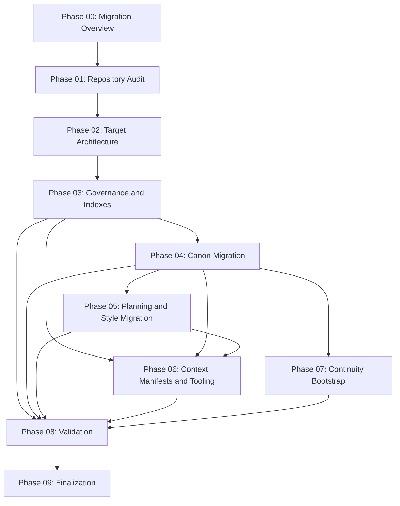

# Phase 00: Migration Overview

> Authority note: the master specification at `migration/REPOSITORY-REORGANIZATION-SPEC.md` is authoritative. It overrides any phase runbook, including this one. If anything in any plan document conflicts with the master spec, the master spec wins and the phase document must be corrected to match it.

> Planning note: this is a PLANNING document. Nothing here is executed now. The repository reorganization is a FUTURE activity. These runbooks describe what a future execution must do. No project document is moved, split, renamed, archived, or rewritten by authoring this plan.

This is the top governance document for the `migration/plan/` folder. Every other phase runbook (01 through 09) is subordinate to this overview, and all of them are subordinate to the master spec. This file defines the overall goal, the order in which phases run, the rules that bind every agent, and the conditions under which the whole migration is considered finished.

## 1. Purpose

The Unnecessary is a novel project, not a software product. Its development material currently lives as a small number of large Markdown monoliths at the repository root. This migration reorganizes that material into a navigable `docs/` tree so that a future LLM can load only the files relevant to its current task (chapter blueprinting, drafting, continuity checking, technology research, or canon revision) instead of loading the whole repository.

Phase 00 exists to make the multi-phase plan coherent and safe. It does not move any content. It establishes:

- The overall goal of the migration and the authority of the master spec over every phase document.
- The phase dependency graph for phases 00 through 09, so no phase begins before its prerequisites are validated.
- The canon-safety rules and the ten agent-coordination rules that every phase and every delegated agent must obey.
- The checkpoint strategy (a git commit after each phase, on top of the existing baseline commit).
- The conflict-handling procedure (preserve both conflicting statements, flag, record, and let only the orchestrator resolve).
- The definition of completion for the whole migration.
- A current migration status table covering all ten phases.
- A record of phase-boundary adjustments made relative to the task spec's suggested boundaries, and why.

When this phase is later executed, its only concrete artifacts are the `migration/` working area being confirmed in place, the baseline state being verified, and the Phase 00 checkpoint being recorded. The substantive work happens in Phases 01 through 09.

## 2. Dependencies

- A git baseline commit must already exist before the plan is executed. It does: commit `091a71a` ("chore: baseline before migration planning") is the recoverable starting point. Phase 00 builds on top of it.
- Phase 00 has no upstream phase. It is the root of the dependency graph. Every other phase depends, directly or transitively, on Phase 00.
- The master spec at `migration/REPOSITORY-REORGANIZATION-SPEC.md` must be present and readable. It is the authority every phase derives from.
- This phase ends with its own checkpoint commit before Phase 01 begins.

## 3. Inputs

Read-only inputs for this phase:

- `migration/REPOSITORY-REORGANIZATION-SPEC.md`, the full master spec. Phase 00 reads it in its entirety because it governs all later phases. Of particular relevance: the Primary Objectives, the Important Operating Rules, the Phase 2 target tree, the Validation Requirements, and the Desired End State.
- The existing phase runbooks already authored in `migration/plan/` (01 through 09), used to confirm that the dependency graph, the status table, and the adjustments recorded here match what those runbooks actually say.
- `git log` and `git status`, used only to confirm the baseline commit exists and the working tree is in a known state.

Phase 00 reads the source monoliths at the repo root only to confirm their exact filenames for cross-reference. It does not read them for content and does not modify them. The exact source filenames are: `Narrative Brief.md`, `Story Bible.md`, `Character Bible.md`, `Technology Rules.md`, `Master Timeline.md`, `Plot Outline and Chapter Map.md`, `Style Guide.md`, `Creative Decision Log.md`, `Development and Canon Guide.md`, and `chapter-blueprints/Chapter Blueprint Template.md`.

## 4. Allowed Changes

When this phase is later executed, it MAY create or edit only the following:

- `migration/plan/00-migration-overview.md` (this file).
- `migration/conflicts-found.md` is seeded as an empty-but-headed ledger if it does not already exist, so later phases have a stable place to append conflicts. Seeding the empty ledger is a definitive Phase 00 action and is the only `migration/` write Phase 00 may make beyond this runbook. The orchestrator remains the only writer of the ledger; Phase 00 seeds the header, and later phases append.

All new filenames use lowercase kebab-case. This runbook carries YAML front matter per master spec Phase 3. No em dashes appear in any prose written here.

## 5. Prohibited Changes

This phase MUST NOT:

- Move, split, rename, rewrite, or archive any source monolith. The originals stay exactly where they are at the repo root. Archival of the monoliths is reserved for Phase 09 only.
- Create or populate any canon content under `docs/10-vision/`, `docs/20-canon/`, `docs/30-plot/`, `docs/40-blueprints/`, `docs/50-manuscript/`, `docs/60-continuity/`, or `docs/70-research/`. Those are filled by later phases.
- Create the target directory tree. That is Phase 02 work.
- Author any `context-manifests/*.yaml`, any `scripts/*`, or any governance file under `docs/00-governance/`. Those are later phases.
- Write into `archive/` or `.context/`.
- Resolve any canon conflict by editing canon. Conflicts are logged, never silently fixed, and only the orchestrator decides resolution.
- Add em dashes to any prose.

If a needed change falls outside the Allowed Changes list, stop and escalate to the orchestrator rather than expanding scope.

## 6. Agent Delegation Plan

Phase 00 is small and is primarily an orchestrator authoring task, but it is parallel-safe where it fans out. Each task below reads only and writes to a disjoint target. No two tasks write to the same file.

- Task A: Confirm the baseline. Read `git log` and `git status`, confirm the baseline commit exists and the working tree state is known. Report the baseline commit hash and whether the tree is clean. Writes nothing.
- Task B: Verify the dependency graph and status table against the authored runbooks. Read each phase runbook front matter (`phase`, `depends_on`) in `migration/plan/01` through `09`, and report any mismatch between this overview's graph or status table and the actual `depends_on` values. Writes nothing; reports findings to the orchestrator.
- Task C: Confirm source filenames. List the repo root and `chapter-blueprints/`, and report whether the exact source filenames named in section 3 still exist unchanged. Writes nothing.
- Task D (orchestrator-reserved): Author or correct this overview, definitively seed the empty `migration/conflicts-found.md` ledger, and record the checkpoint. This is not delegated.

Agents in this phase are read-only inspectors. Authoring the governance overview and the conflict-ledger seed is reserved to the orchestrator, because Phase 00 defines authority and must not be drafted by a parallel agent acting on a partial view.

## 7. Orchestrator Responsibilities

The orchestrator owns every decision that binds later phases:

- Authoring and maintaining this overview, the dependency graph, and the status table.
- Verifying agent reports against the underlying source (the actual runbook front matter, the actual `git log`), not merely trusting an agent summary.
- Choosing final paths, resolving canon conflicts, and approving archival. These are never delegated, in any phase.
- Confirming that each phase's checkpoint commit exists before allowing a dependent phase to begin.
- Seeding `migration/conflicts-found.md` as the single empty-but-headed conflict ledger in Phase 00, keeping it the single ledger thereafter, and ensuring no parallel agent edits it concurrently.
- Halting the plan if any phase would leave the repository in a non-recoverable state.

## 8. Execution Steps

1. Read the master spec in full and confirm it is the authority for the plan.
2. Confirm the baseline commit `091a71a` exists and the working tree is in a known state (Task A).
3. Verify each authored runbook's `depends_on` front matter matches the dependency graph and status table in this overview (Task B). Correct this overview if they diverge; the runbooks and the spec win over a stale graph here.
4. Confirm the exact source filenames still exist unchanged at the repo root and under `chapter-blueprints/` (Task C).
5. Finalize this overview: graph, coordination rules, conflict procedure, completion definition, status table, and adjustments record.
6. Seed an empty `migration/conflicts-found.md` ledger with a heading so later phases have a stable append target. This seeding is definitive, not optional.
7. Record the Phase 00 checkpoint commit before Phase 01 begins.

## 9. Deliverables

- `migration/plan/00-migration-overview.md`: this governance overview, containing all thirteen standard sections plus the overview-specific content (overall goal, master-spec authority statement, phase dependency graph, canon-safety rules, the ten coordination rules, checkpoint strategy, conflict-handling procedure, completion definition, status table, and adjustments record).
- An empty-but-headed `migration/conflicts-found.md` ledger, definitively seeded, ready for later phases to append to.
- A Phase 00 checkpoint commit on top of the baseline.

## 10. Validation

Phase 00 is complete and valid only when all of the following hold:

- This overview contains all thirteen standard sections in order and none is empty.
- The dependency graph below covers phases 00 through 09 and matches the `depends_on` front matter of every authored runbook.
- The status table has one row per phase (00 through 09) with phase number, title, depends-on, status, and a one-line deliverable.
- All ten agent-coordination rules appear verbatim.
- The master-spec authority statement is present and unambiguous.
- The conflict-handling procedure names `migration/conflicts-found.md` and reserves resolution to the orchestrator.
- No source monolith was moved, split, renamed, archived, or rewritten by this phase.
- No em dashes appear anywhere in this file.
- The baseline commit is confirmed to exist.

## 11. Human Review Points

- Confirm the overall goal and completion definition match the author's intent for the novel project before any later phase runs.
- Confirm the phase-boundary adjustments in section "Phase-Boundary Adjustments" are acceptable, in particular the parallelism of Phase 07 with Phase 06. The placement of the Narrative Brief in Phase 05 has been confirmed by the orchestrator.
- Confirm the master spec is the intended single authority and that no phase runbook is expected to override it.
- Approve the dependency graph as the binding execution order.

## 12. Completion Criteria

- [ ] Master-spec authority statement present and correct.
- [ ] Overall migration goal stated.
- [ ] Phase dependency graph (Mermaid `graph TD`) covers phases 00 through 09 and matches every runbook's `depends_on`.
- [ ] Canon-safety rules stated.
- [ ] All ten agent-coordination rules present verbatim.
- [ ] Checkpoint strategy stated (git commit after each phase, baseline already exists).
- [ ] Conflict-handling procedure stated and points to `migration/conflicts-found.md`.
- [ ] Whole-migration completion definition stated.
- [ ] Current migration status table present with one row per phase.
- [ ] Phase-boundary adjustments documented with reasons.
- [ ] All thirteen standard sections present and non-empty.
- [ ] No em dashes anywhere in this file.
- [ ] Phase 00 checkpoint commit recorded before Phase 01 begins.

## 13. Checkpoint

End Phase 00 with a single git commit once this overview is finalized and the conflict ledger is seeded. A baseline commit already exists (`091a71a`); this is the first phase checkpoint on top of it. No project content changes in this phase, so the diff is limited to `migration/plan/00-migration-overview.md` and the empty-but-headed `migration/conflicts-found.md`.

Suggested commit message:

```text
plan(phase-00): author migration overview runbook

Add the governing overview for the migration plan: goal, master-spec
authority, phase dependency graph (00-09), canon-safety rules, the ten
agent-coordination rules, checkpoint strategy, conflict-handling
procedure, completion definition, status table, and phase-boundary
adjustments. Planning only; no project content changed.
```

Do not begin Phase 01 until this checkpoint exists.

---

## Overall Goal of the Migration

Refactor the project's Markdown documentation for The Unnecessary into a structure that an LLM can navigate selectively, optimizing for context efficiency, discoverability, and canon safety. Concretely, the migration must:

- Break the large monoliths into smaller, semantically focused files.
- Make it possible to load only the files relevant to the current task.
- Preserve a clear hierarchy between canon, planning, manuscript, continuity, and research.
- Prevent duplicate or conflicting sources of truth.
- Create indexes and task-specific context manifests so an LLM identifies the files it needs without reading everything.
- Preserve all existing content, titles, version labels, status labels, tables, code blocks, and Mermaid diagrams.
- Make the repository understandable without access to the conversation that created it.
- Create safeguards so future LLMs do not silently alter canon.
- Leave the project ready to begin the Chapter 1 blueprint.

The end state is not a one-million-token dump. It is selective retrieval, stable authority, low duplication, and the ability to hand the project to a different capable LLM in the future.

## Master-Spec Authority Statement

The master specification at `migration/REPOSITORY-REORGANIZATION-SPEC.md` is the single source of authority for this migration. It overrides every phase document, including this overview. If any phase runbook conflicts with the master spec, the master spec wins, the phase document is wrong, and the phase document must be corrected to match the spec. No phase runbook may grant itself authority over the spec. This statement is binding on every phase and every delegated agent.

## Phase Dependency Graph

The graph below is the binding execution order for phases 00 through 09. A phase may begin only after every phase it points from has been completed and validated.



Notes on the graph:

- Phases 06 and 07 both depend on Phase 04 and can run in parallel with each other because they touch disjoint files (manifests and tooling versus continuity files). Phase 06 additionally depends on Phases 03 and 05.
- Phase 08 (Validation) is the convergence point. It depends on Phases 03, 04, 05, 06, and 07, and it gates Phase 09.
- Phase 09 (Finalization), which includes archival of the source monoliths, runs only after validation passes.

## Canon-Safety Rules

Canon safety is the highest non-negotiable constraint of this migration. Every phase and every agent obeys these rules:

- Do not rewrite the story, change canon, improve plot decisions, or invent missing content.
- Do not paraphrase canonical prose merely to shorten it. Preserve exact canonical wording, especially any rule whose wording limits plot convenience.
- Do not silently merge conflicting facts. If two files conflict, preserve both statements, flag the conflict, and record it (see the conflict-handling procedure below).
- Preserve all meaningful existing content, including titles, version information, status labels, tables, code blocks, and Mermaid diagrams.
- Do not delete original source documents. Move a monolith to the archive only after its content has been safely split and verified, and never before Phase 09.
- Do not treat archived documents as active canon, and do not place generated context bundles in active canon folders.
- Treat approved manuscript as established canon. Treat plot files and blueprints as approved plans, not as already-established events. Do not treat planned future events as established continuity.
- Do not expose future reveals in earlier chapter work, and do not give Morrow or Crown unestablished capabilities.
- Maintain single authority per domain: character facts in character profiles, technology capabilities in technology files, dates in timeline files, chapter order in plot files, prose rules in style files, decision rationale in decision files. When a concept crosses domains, link rather than duplicate.
- Every phase must leave the repository in a valid, recoverable state. Use git history as one safety net, but never as the only backup.

## Agent Coordination Rules

These ten rules are binding on every phase and every delegated agent, verbatim:

1. Parallel agents may inspect different source domains.
2. Parallel agents should not edit the same index, manifest, or shared metadata file.
3. Only the main orchestrator chooses final paths.
4. Only the main orchestrator resolves canon conflicts.
5. Only the main orchestrator approves archival.
6. Agent outputs must identify every source section they processed.
7. The orchestrator must verify agent work against the original source, not only the agent summary.
8. Every phase must leave the repository in a valid, recoverable state.
9. Do not begin a dependent phase before validation of its prerequisite.
10. The master specification overrides a phase document if they conflict.

## Checkpoint Strategy

Each phase ends with a single git commit checkpoint before the next phase begins. A baseline commit already exists (`091a71a`, "chore: baseline before migration planning"); it is the recoverable starting point and is not re-created. The checkpoint sequence is therefore: baseline, then one commit per phase, in dependency order. Rules:

- A phase's checkpoint is recorded only after that phase's deliverables exist and its validation passes.
- A dependent phase does not begin until every prerequisite phase's checkpoint exists (coordination rule 9).
- Each commit message names the phase and summarizes what changed, so the history reads as a clear migration log.
- Because every phase ends in a committed, valid state, the repository is recoverable to the end of any completed phase at all times (coordination rule 8).

## Conflict-Handling Procedure

When any phase or agent discovers two project documents that disagree on a fact:

1. Preserve both conflicting statements exactly. Do not delete, merge, or paraphrase either one.
2. Flag the conflict in place where appropriate, without altering the canonical wording.
3. Record the conflict in `migration/conflicts-found.md`, capturing the two sources, their exact conflicting statements, the file paths, and the section or heading each came from (coordination rule 6 requires identifying every source section processed).
4. Continue the phase. A discovered conflict does not block splitting or indexing; it blocks silent resolution only.
5. Only the orchestrator resolves a canon conflict (coordination rule 4), and only the orchestrator approves any archival that depends on a resolved conflict (coordination rule 5). No parallel agent resolves a conflict or edits the shared conflict ledger concurrently (coordination rule 2).

The conflict ledger is a single shared file. To honor the no-shared-file rule, agents report conflicts back to the orchestrator, and the orchestrator is the only writer of `migration/conflicts-found.md`.

## Definition of Completion for the Whole Migration

The migration is complete only when all of the following hold, consistent with the master spec's Validation Requirements and Desired End State:

- Every active source section has a confirmed destination, and no canonical section was lost.
- Source-monolith headings have been compared against the split-file headings and reconcile.
- All Mermaid diagrams remain valid Markdown blocks, and all relative links resolve.
- Active documents carry the required status metadata, and context manifests reference only existing files.
- Archived monoliths carry archive headers and are excluded from normal task context manifests.
- Character Bible material exists for every established character; all 36 chapter plot-map entries remain represented; the Chapter Blueprint Template, the Creative Decision Log, the Style Guide, and the Development and Canon Guide all remain fully represented.
- An LLM can plan Chapter 1 without loading the entire repository: read `CLAUDE.md`, identify the task from `project-status.md`, open the relevant context manifest, load only the selected indexes and files, and proceed.
- All conflicts discovered are recorded in `migration/conflicts-found.md`, the final migration report exists, and `project-status.md` points to creating the Chapter 1 blueprint as the next task.
- Every phase has a checkpoint commit, the repository is recoverable, and Phase 09 finalization (including monolith archival) has passed validation.

## Current Migration Status Table

One row per phase. Status is "planned" for all phases because this is a planning exercise and no phase has been executed.

| Phase | Title | Depends on | Status | One-line deliverable |
| --- | --- | --- | --- | --- |
| 00 | Migration Overview | (baseline) | planned | This governing overview: goal, authority, dependency graph, coordination rules, checkpoint strategy, conflict procedure, completion definition, status table. |
| 01 | Repository Audit | 00 | planned | Read-only audit reports under `migration/` mapping every document to type, version, canon status, destination, split decision, and conflicts. |
| 02 | Target Architecture | 01 | planned | The target `docs/` tree plus naming, metadata, index, and manifest schemas, and canon-ownership rules. |
| 03 | Governance and Indexes | 02 | planned | Root `CLAUDE.md`, governance docs (canon hierarchy, context-loading guide), the reusable index template, `project-status.md`, and migration tracking files. |
| 04 | Canon Migration | 03 | planned | World, character, technology, and timeline canon split into focused files with indexes, sources left untouched, archival deferred to Phase 09. |
| 05 | Planning and Style Migration | 04 | planned | Plot outline, style guide, decision log, and blueprint template split and relocated, with the narrative brief folded in (confirmed by orchestrator). |
| 06 | Context Manifests and Tooling | 03, 04, 05 | planned | `context-manifests/*.yaml`, the Chapter 1 manifest, and four stdlib-only scripts (build-context-pack, validate-links, validate-metadata, check-duplicate-headings). |
| 07 | Continuity Bootstrap | 04 | planned | Lightweight pre-draft continuity files covering all seven continuity dimensions, stating no chapters are approved yet. |
| 08 | Validation | 03, 04, 05, 06, 07 | planned | Independent read-only validation across all required checks, with orchestrator-written reports that gate Phase 09. |
| 09 | Finalization | 08 | planned | Source-monolith archival with headers, the final migration report, and `project-status.md` set to create the Chapter 1 blueprint. |

## Phase-Boundary Adjustments

These adjustments deviate from the task spec's suggested phase boundaries. Each is recorded with its reason so the orchestrator can confirm or revert.

- Narrative Brief placement. The task spec does not explicitly assign "Narrative Brief.md" to a phase. It is folded into Phase 05 (Planning and Style Migration); the orchestrator has confirmed this placement. Reason: the Narrative Brief is short and meant to be read first, and the master spec Phase 4 says to keep it mostly intact rather than split it. Phase 05 already handles the lighter planning relocations, so the brief sits naturally there as a near-verbatim relocation rather than a canon split.

- Phase 07 dependency and parallelism. Phase 07 (Continuity Bootstrap) depends on Phase 04 (canon), not on Phase 06, and may run in parallel with Phase 06. Reason: the continuity bootstrap needs canon to reference (characters, technology, timeline) but does not need the context manifests or scripts that Phase 06 produces. Phase 06 and Phase 07 touch disjoint files (manifests and tooling versus continuity files), so running them concurrently violates no coordination rule and shortens the critical path. Phase 08 still waits for both.

- Convergent validation before finalization. Phase 08 is modeled as a single convergence point depending on Phases 03, 04, 05, 06, and 07, and Phase 09 depends only on Phase 08. Reason: archival of the source monoliths (a non-reversible-looking step from a navigation standpoint) must not happen until one independent validation pass confirms every destination exists and nothing was lost. Folding all validation into one gating phase keeps the canon-safety guarantee simple and auditable.

- Archival is deferred to Phase 09 only. Although the master spec's narrative Phase 11 describes archiving each monolith after its own sections are verified, this plan defers all archival to Phase 09 after global validation. Reason: deferring archival keeps every source monolith in place and readable as a cross-check through Phases 04, 05, 06, 07, and 08, which strengthens the "verify agent work against the original source" rule. This is a sequencing choice within the spec's intent, not a conflict with it; the master spec still governs, and the spec's requirement that archival happens only after sections have confirmed destinations is satisfied more conservatively, not less.

## Intentionally Deferred and Added Artifacts

These records account for artifacts that are added beyond the master spec Phase 2 tree, and for parts of that tree that are intentionally deferred because the content does not yet exist. They are recorded here so the orchestrator can confirm them and so no later phase treats an absent artifact as a defect.

- Root `README.md` is authored in Phase 03. The master spec Phase 2 tree does not assign `README.md` to a phase. This plan assigns it to Phase 03 (Governance and Indexes), which owns the per-session entry layer, so the repository has a concise root introduction that points to `CLAUDE.md` and `docs/00-governance/`.
- `docs/70-research/` content is deferred until research exists. No research material exists yet. Per the master spec, empty files are not created merely to satisfy the tree. Manifests that reference `docs/70-research/**` mark those paths as optional so the link validator and the context-pack builder do not fail on absent research files.
- `docs/50-manuscript/` scaffolding is deferred until an approved manuscript chapter exists. The manuscript index and chapter files are not created during this migration because no approved chapter exists yet. The directory is created empty in Phase 02; its contents wait for a real approved chapter so no placeholder masquerades as canon.
- `migration/validation-report.md` is an intentional ADDED artifact. It is produced by Phase 08 (Validation) and consumed by Phase 09 (Finalization), beyond the four `migration/` files named in the master spec Phase 2 tree. It is recorded here so the added file is expected rather than treated as scope creep.
